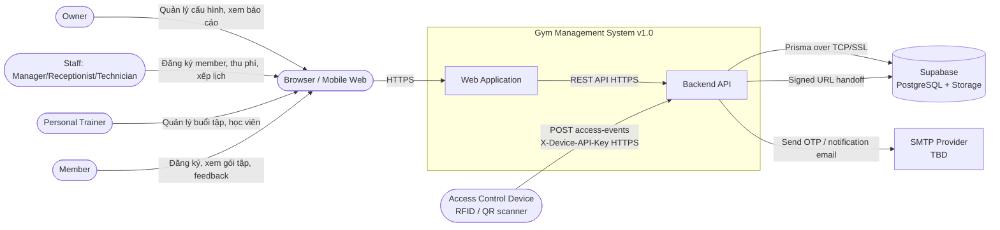
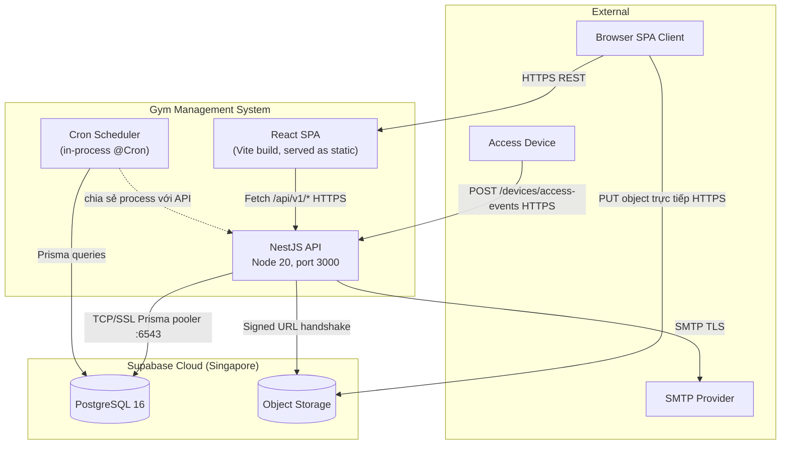
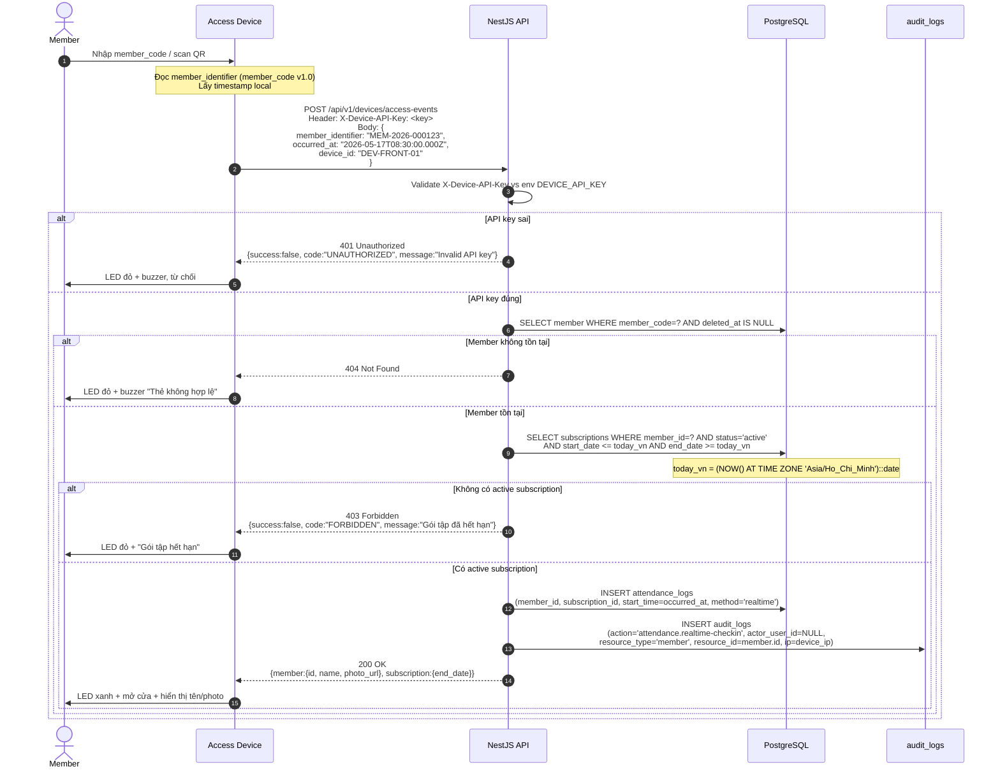
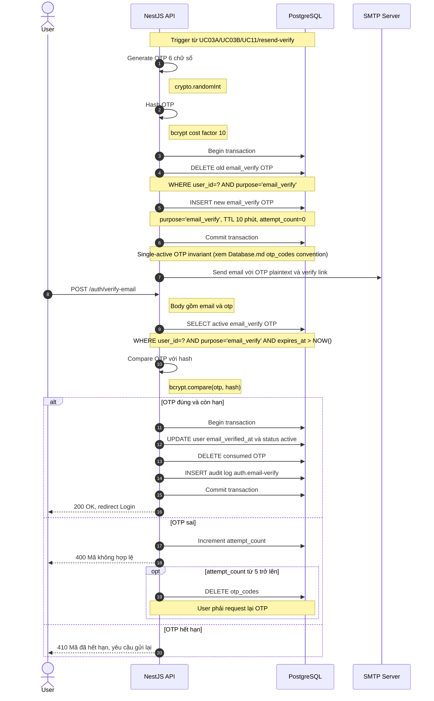
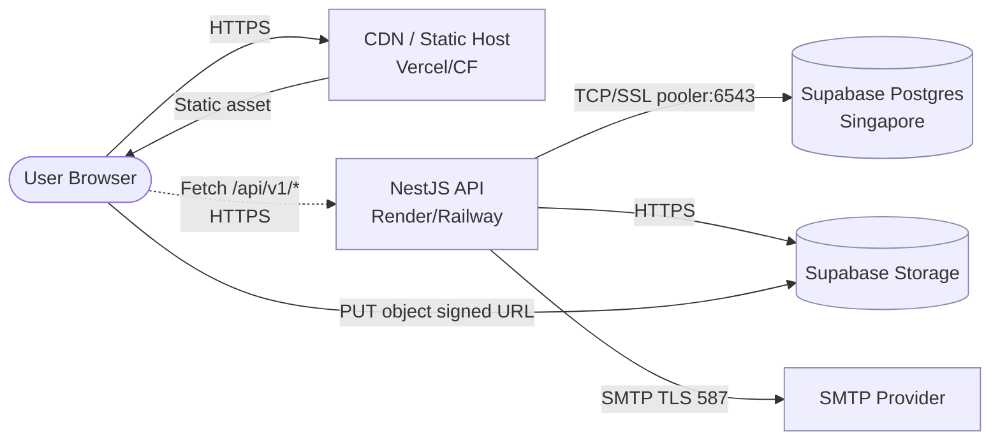

# Architecture & High-Level Design

| Field | Value |
|---|---|
| Document ID | GMS-ARCH-001 |
| Version | 1.1.8 |
| Status | Draft |
| Author | Lê Thanh An (initial draft 2026-05-16) |
| Reviewers | TBD — tối thiểu 1 backend lead + 1 DBA + 1 DevOps khi team formed |
| Last Updated | 2026-05-22 |
| Related docs | [`docs/VI/SRS_VI.md`](../VI/SRS_VI.md), [`docs/Design/Database.md`](./Database.md), [`server/README.md`](../../server/README.md) |

---

## 1. Document Info

### 1.1 Mục đích

Tài liệu này đặc tả kiến trúc và thiết kế kỹ thuật cấp cao (High-Level Design) của hệ thống Gym Management v1.0. Trình bày theo lát cắt macro → micro: từ system context, tech stack, container boundary tới cross-cutting concerns, operations, NFR, decision log.

### 1.2 Phạm vi

In-scope:
- System context (C4 Level 1) và container diagram (C4 Level 2).
- Technology stack + rationale.
- Module boundary backend (NestJS) và frontend (React).
- Cross-cutting: authentication, RBAC, API convention, error handling, audit, timezone, currency, SLA.
- Operations: deployment topology, background jobs, CI/CD, secrets, observability, backup/DR.
- Non-functional requirements (performance, availability, security/threat model).
- Architectural Decision Records (ADR) inline.
- Roadmap v1.1+ items deferred.

Out-of-scope:
- Yêu cầu nghiệp vụ (xem [`SRS_VI.md`](../VI/SRS_VI.md)).
- Schema entity chi tiết (xem [`Database.md`](./Database.md)).
- API spec endpoint-by-endpoint (build sau, khi doc này stable).
- Component-level design (C4 Level 3) — dùng module list ở §3.1+3.2 thay thế.

### 1.3 Audience

Backend developer, frontend developer, architect, DevOps, QA, security reviewer. Đọc tuần tự §2-3 đủ để nắm hệ thống; §4-6 cho người triển khai operations; §7-8 cho architect ra quyết định.

---

## 2. System Overview

### 2.1 System Context (C4 Level 1)

Boundary của hệ thống và các actor / external system tương tác.



Actor và external system:

| Entity | Loại | Vai trò |
|---|---|---|
| Owner | Actor (primary user) | Cấu hình hệ thống, xem báo cáo KPI, quản lý nhân sự. |
| Staff | Actor (primary user) | Đăng ký member tại quầy, thu phí, xếp lịch, xử lý feedback. Sub-position: manager (đầy đủ quyền staff), receptionist (lễ tân), technician (bảo trì thiết bị). |
| Trainer (PT) | Actor (primary user) | Lập lịch buổi tập, ghi nhận tiến độ học viên, xem học viên do mình phụ trách (`primary_trainer_id`). |
| Member | Actor (primary user) | Đăng ký online (UC03B), xem gói tập, gửi feedback, xem tiến độ. |
| Access Control Device | Actor (system) | Thiết bị quẹt thẻ/QR ở cửa, gọi API check-in real-time bằng API key. |
| Supabase | External system | Managed PostgreSQL 16 (transaction pooler + session pooler) + Object Storage cho file. |
| SMTP Provider | External system | Gửi email OTP (verify, reset password), thông báo cancel subscription. V1.0 chưa chốt provider — placeholder dev: log OTP ra stdout. |
| Browser | External | Trình duyệt user (Chrome/Firefox/Edge desktop và mobile web). Không có native app v1.0. |

### 2.2 Tech Stack & Rationale

| Layer | Technology | Version | Chosen because | Alternatives rejected |
|---|---|---|---|---|
| Backend framework | NestJS | 10.x | TypeScript first; DI container + decorator + module system phù hợp team có background OOP/Java/.NET; ecosystem mature (Passport, class-validator, Prisma integration). | Express thuần (thiếu structure cho team multi-dev); Fastify (ít tài liệu cho RBAC/auth pattern). |
| ORM | Prisma | 5.x | Schema-as-code, type-safe query, migration UX tốt, generated client; phù hợp `db push` workflow của Supabase. | TypeORM (decorator nặng, migration hay drift); Drizzle (chưa stable feature parity 2026 Q2). |
| Database | PostgreSQL | 16 (Supabase) | Open-source RDBMS chuẩn; Supabase cung cấp managed Postgres + Auth + Storage + dashboard với pooler sẵn; team đã dùng `BIGSERIAL` PK pattern. | MySQL/MariaDB (kém transactional DDL); MongoDB (không hợp cho RBAC + reporting nặng JOIN). |
| Storage | Supabase Storage | S3-compatible | Đã có Supabase project; signed URL handoff giúp tránh proxy bytes qua API; max object 10MB phù hợp avatar/document. | AWS S3 trực tiếp (thêm tài khoản, IAM phức tạp); local filesystem (không scale horizontal). |
| Frontend bundler | Vite | 5.x | Dev server nhanh (ESM HMR), production build qua Rollup ổn định; cấu hình `proxy /api → localhost:3000` đơn giản. | Webpack (chậm dev start); CRA (deprecated). |
| Frontend framework | React | 18 | Hệ sinh thái component rộng; team đã quen; concurrent features (Suspense) sẵn cho list view. | Vue 3 (team ít kinh nghiệm); Svelte (ecosystem nhỏ hơn). |
| Client state | Zustand + TanStack Query | Zustand 4, TQ 5 | Zustand cho client state nhẹ (auth, UI preference); TanStack Query cho server state có cache + retry + stale time. | Redux Toolkit (boilerplate cho project quy mô MVP); SWR (TQ feature richer). |
| Auth | JWT + Passport | jsonwebtoken 9 | Stateless, scale horizontal không cần session store; Passport strategy chuẩn cho NestJS. | Session cookie + Redis (thêm dependency); Auth0 (cost, vendor lock-in). |
| Validation | class-validator + class-transformer | Latest | Tích hợp NestJS `ValidationPipe` global; decorator gắn ngay vào DTO. | Zod (cần custom pipe); Joi (không idiomatic NestJS). |
| Styling | Tailwind CSS + Material Design 3 tokens | TW 3.x | Utility-first nhanh build UI; MD3 token cho consistency theme. | CSS Modules (verbose); Styled Components (runtime overhead). |

Tham khảo ADR-001..ADR-014 ở §7 cho các quyết định mang tính architectural đi kèm stack.

### 2.3 Container Diagram (C4 Level 2)

Trong system boundary GMS, các container thực thi độc lập và protocol giữa chúng.



| Container | Trách nhiệm | Ngôn ngữ / Runtime | Port |
|---|---|---|---|
| React SPA | UI rendering, client routing, auth state, optimistic UI. Build artifact `client/dist/` được serve qua CDN/static host. | TypeScript + React 18 | 5173 dev / 443 prod |
| NestJS API | Business logic, validation, RBAC enforcement, JWT issuance, Prisma queries, audit interceptor. | TypeScript + Node 20 | 3000 |
| Cron Scheduler | 9 background job (xem §5.2). V1.0 chạy in-process cùng NestJS API (1 instance). | TypeScript (NestJS `@Cron`) | — |
| PostgreSQL | Persist toàn bộ business data + audit log. 21 bảng (20 nghiệp vụ + `otp_codes`). | Postgres 16 | 5432 / 6543 (pooler) |
| Object Storage | Persist file: avatar, document, equipment doc. Max 10MB per file. | Supabase Storage (S3) | 443 |
| SMTP Provider | Outbound email (OTP, notification). Provider chưa chốt — placeholder dev. | TBD (candidates: Resend, SendGrid, AWS SES) | 587 / 465 |

Container ranh giới: SPA và API tách biệt deploy (SPA static, API stateful). DB và Storage là managed service (không tự host). Cron không phải container độc lập v1.0 — chạy cùng tiến trình API; tách thành job runner riêng defer v1.1 (xem §5.2 multi-instance).

---

## 3. Module Architecture

### 3.1 Backend modules (NestJS)

```
server/src/
  auth/          JWT, OTP, password reset, email verify (lockout defer v1.1 — xem §8 R20)
  users/         User CRUD + role resolution (findByEmailWithRoles)
  members/       Member profile, subscription view, assign trainer
  staff/         Staff profile, schedule, position
  groups/        RBAC groups + permissions assignment
  packages/      Package CRUD, time-based pricing
  subscriptions/ Subscription lifecycle, cron triggers
  payments/      Payment record, integration cổng thanh toán (mock v1.0)
  sessions/      Training session (UC05A schedule + UC05B real-time)
  attendance/    attendance_logs, device callback endpoint
  rooms/         gym_rooms CRUD
  equipment/     Equipment + maintenance logs
  feedback/      Feedback intake + SLA tracking
  reports/       Aggregation queries cho UC12
  audit/         Audit interceptor + query endpoint (owner)
  files/         Signed URL handshake cho Supabase Storage upload
  health/        GET /health (không qua prefix /api/v1)
  common/        Filters, decorators, pipes, interceptors shared
  prisma/        PrismaModule @Global() bọc PrismaService
  config/        Environment validation (class-validator)
```

Mỗi module độc lập, import qua `app.module.ts`. `PrismaModule` là `@Global()` — service các module khác inject `PrismaService` trực tiếp.

Convention: file naming `kebab-case.ts` với suffix loại (`.controller`, `.service`, `.module`, `.guard`, `.decorator`, `.dto`, `.interface`, `.filter`). Comment tiếng Việt; identifier + log message tiếng Anh.

### 3.2 Frontend layers

```
client/src/
  pages/        Route components, role-aware (RoleDashboardPage routes owner/staff/trainer/member)
  components/   Reusable UI (Material Design 3 tokens, btn-primary, input-base, card)
  hooks/        Custom hooks (useAuth, useMembers, ...)
  services/     Axios instance + API client per module (api.ts → auth.service.ts → ...)
  stores/       Zustand stores (authStore với partialize cho user/token/isAuthenticated)
  router/       React Router 6 + ProtectedRoute (JWT + role check)
```

Convention: components/pages `PascalCase.tsx`; hooks/stores/services `camelCase.ts`. Path alias `@/` → `src/`. Vite dev proxy `/api → http://localhost:3000` loại CORS dev.

### 3.3 Data Flow Example — UC05B Real-time Check-in (E2E)

Ví dụ end-to-end để hiểu cách data đi qua các container. Flow này được chọn vì touch device, API, DB, audit log — đại diện cho check-in pattern.



Data shape tại mỗi hop:

- **Device → API request**: 3 field `member_identifier` (string; v1.0 PHẢI là `member_code` — `members` table chưa có `card_id` column; RFID card_id và QR payload defer v1.1, xem §8 Roadmap), `occurred_at` (ISO 8601 UTC), `device_id` (string, identify device để debug).
- **API key validate**: compare bằng `crypto.timingSafeEqual` để tránh timing attack.
- **Subscription check**: dùng `today_vn` cho boundary (xem §4.5 timezone). Lý do: member check-in 23:59 VN không bị tính là ngày hôm sau.
- **attendance_logs row**: `start_time = occurred_at` (UTC), `end_time = NULL` (real-time không có end), `method = 'realtime'` để phân biệt với manual check-in của UC05A.
- **audit_logs row**: `actor_user_id = NULL` vì device không phải user; `resource_type/resource_id` trỏ member; `before_data = NULL`, `after_data = {attendance_log_id}`.
- **API → Device response (200)**: trả `member.photo_url` (signed URL từ Supabase Storage, TTL 5 phút) và `subscription.end_date` để device hiển thị nhắc nhở gia hạn nếu gần hết hạn. Implementation: server resolve `users.avatar_file_id → files.storage_path` (bảng `files`), rồi gọi `supabase.storage.from(bucket).createSignedUrl(path, 300)` với `bucket = process.env.SUPABASE_STORAGE_BUCKET` (default `gym-media`). Nếu member không có avatar (`avatar_file_id = NULL`), trả `photo_url = null`.

Retry và idempotency: device tự retry 3 lần backoff (1s, 4s, 16s) khi network fail. Idempotency key = `(device_id, occurred_at)` cho phép server dedupe nếu device gửi lại cùng event. V1.0 dedupe ở application logic; UNIQUE constraint chưa add — defer khi observed duplicate rate.

---

## 4. Cross-Cutting Concerns

### 4.1 Authentication & Authorization

#### 4.1.1 JWT

- Payload: `{ sub: string, email: string, roles: Role[] }`. `sub` là string (BigInt PK cast — xem ADR-002).
- TTL: 7 ngày. Không có refresh token v1.0 (xem ADR-008).
- Algorithm: HS256 với env `JWT_SECRET` (min 32 char).
- Header: `Authorization: Bearer <token>`.

**LINE LIFF Authentication (ADR-015):** LINE ID token xác thực qua `POST https://api.line.me/oauth2/v2.1/verify`. Backend issue JWT cùng payload `{sub, email, roles}`. LINE login chỉ cho role `member` — non-member bị reject 403 `LINE_LOGIN_MEMBER_ONLY`. LINE-only user có `passwordHash=null`; email login block với anti-enumeration message nếu user không có password. User LINE mới auto-tạo `status=active`, role `member`.

#### 4.1.2 RBAC

- 4 role chính: `owner`, `staff` (gồm position `manager`/`receptionist`/`technician`), `pt` (trainer), `member`.
- Quan hệ: `users ↔ groups` qua `user_groups`; `groups ↔ permissions` qua `group_permissions` (xem [Database.md §3](./Database.md)).
- Resolve at login: `UsersService.findByEmailWithRoles()` join `user_groups → groups → group_permissions` trả `Role[]`.
- Guards: `JwtAuthGuard` global (mặc định bật); `RolesGuard` per-route; `@Public()` opt-out cho endpoint không cần auth; `@Roles('owner', 'staff')` whitelist role.
- `RolesGuard` dùng `roles.some()` — KHÔNG thay `roles[0]` equality (phá multi-role support, xem `.claude/rules/security.md`).

#### 4.1.3 Email Verification Flow

Áp dụng cho mọi user mới: hội viên qua UC03A/UC03B, nhân sự qua UC11.

Tiền điều kiện: `users.status='pending_verification'`, `users.email_verified_at IS NULL`.



Endpoints:

| Method | Path | Body | Response |
|---|---|---|---|
| POST | `/api/v1/auth/verify-email` | `{ email, otp }` | 200/400/410 |
| POST | `/api/v1/auth/resend-verify` | `{ email }` | 200 (rate-limit 3 requests/giờ/email — thống nhất với `/auth/forgot-password` §4.1.4) |

#### 4.1.4 Password Reset Flow

Reference SRS UC02. Cơ chế giống Email Verification: OTP 6 chữ số, bcrypt hash, TTL 10 phút, `purpose='password_reset'`.

- **Single-active OTP invariant:** Khi user resend `/auth/forgot-password` hoặc `/auth/resend-verify`, trước INSERT OTP mới phải `DELETE FROM otp_codes WHERE user_id=? AND purpose=?` trong cùng `$transaction`. Lý do: nhiều OTP coexist → security gap (OTP cũ vẫn valid tới expire, attacker race lấy 2 OTPs, attempt_count counter bị bypass). Application-level enforce — KHÔNG add UNIQUE constraint DB vì OTP có lifecycle (used → DELETE). Xem [Database.md otp_codes convention](./Database.md#otp_codes).
- Rate limit: 3 yêu cầu / giờ / email (chống abuse). Implementation v1.0: in-memory `Map<email, timestamp[]>` trong `AuthService` (per-process; reset khi restart — acceptable cho single-instance API v1.0). Mỗi request push `Date.now()`, filter giữ timestamps trong cửa sổ 1 giờ; nếu length ≥ 3 → return same anti-enumeration 200 response (không thực gửi email). Redis-backed defer v1.1 (xem §8 R12 global rate limiter).
- Login lockout: **defer v1.1+** (xem §8 R20). V1.0 mỗi failed login → 401 Unauthorized, không tăng counter, không lock account. Trade-off: brute-force risk; mitigate bằng `/forgot-password` rate limit ở trên + global WAF (Cloudflare) khi pre-production. Để bật v1.1 cần thêm `users.failed_login_count` + `users.last_failed_login_at` columns + cron unlock + audit action `auth.lockout`/`auth.unlock`/`auth.admin-unlock`.
- Atomic transaction trong `reset-password`: UPDATE password_hash + DELETE otp_codes trong cùng `$transaction` — nếu một bước fail, cả hai rollback.
- Anti-enumeration: response `/forgot-password` luôn trả 200 OK bất kể email có tồn tại hay không, để tránh leak existence.

#### 4.1.5 Device Authentication (UC05B)

Access Control Device gọi backend mỗi lần member check-in. Authentication bằng header `X-Device-API-Key` so với env `DEVICE_API_KEY`.

Endpoint:

| Method | Path | Auth | Body | Response |
|---|---|---|---|---|
| POST | `/api/v1/devices/access-events` | `X-Device-API-Key` | `{ member_identifier: string, occurred_at: ISO8601, device_id: string }` (v1.0: `member_identifier` = `member_code`) | 200/401/403/404 |

Device API key rotation:

- V1.0: Cố định trong env `DEVICE_API_KEY`. Rotation manual: deploy env mới → restart API server → cập nhật key vào firmware device → verify check-in OK. Downtime: ~5 phút (xem ADR-007).
- Trade-off: 1 key cho toàn bộ device → leak 1 device = compromise toàn bộ. Chấp nhận vì v1.0 chỉ 1-2 device per gym, deploy controlled.
- V1.1+: bảng `devices(device_id, api_key_hash, last_seen_at, rotated_at)` với per-device key, cron rotation hàng tháng. Xem §8 Roadmap.

Retry và idempotency: xem §3.3 (Data Flow E2E).

### 4.2 API Conventions

| Mục | Quy ước |
|---|---|
| Versioning | Path-based `/api/v1`. Breaking change → bump `/v2`, không header-based. |
| Pagination | Query `?page=1&pageSize=20`. Default `pageSize=20`, max `100`. Cursor variant `?cursor=<id>` defer v1.1 (xem §8). |
| Sort | Default `created_at DESC`. Param `?sort=field:asc` hoặc `?sort=field:desc`. |
| Filter | Flat query string: `?status=active&from=2026-01-01&to=2026-12-31`. |
| Response (list) | `{ data: [...], meta: { page, pageSize, total } }` |
| Response (single) | Resource object trực tiếp |
| Error response | `{ success: false, code, message, details? }` — chuẩn hoá qua `HttpExceptionFilter` (xem `server/src/common/filters/http-exception.filter.ts`). Validation → `details: string[]` chứa danh sách lỗi field. |
| HTTP status mapping | P2002 (UNIQUE) → 409; P2025 (not found) → 404; ValidationError → 400; JwtAuthGuard fail → 401; RolesGuard fail → 403. |
| Datetime format | ISO 8601 UTC, ví dụ `2026-04-28T10:30:00.000Z`. Client display Asia/Ho_Chi_Minh. |
| ID serialization | BigInt PK → string (`BigInt.prototype.toJSON` patched ở `main.ts`). |
| Auth | `Authorization: Bearer <JWT>` cho mọi endpoint không có `@Public()`. |

#### 4.2.1 Real-time pattern (phân biệt rõ 2 cơ chế)

V1.0 có 2 cơ chế distinct, không nhầm lẫn:

1. **Device push** (UC05B): Access Device chủ động POST `/devices/access-events` mỗi sự kiện check-in. Server-side là endpoint nhận, không cần SSE/WebSocket. Latency từ tap thẻ tới response: <500ms target.
2. **Client polling**: UI dashboard cho PT/staff/owner poll `GET` list endpoint mỗi 30s để refresh trạng thái (vd: danh sách session đang diễn ra, attendance log mới nhất). TanStack Query với `refetchInterval: 30000`. WebSocket / SSE defer v1.1.

#### 4.2.2 Idempotency

V1.0 KHÔNG enforce idempotency header cho mutation endpoints. Lý do: không có storage substrate trong v1.0 stack (PostgreSQL only, không Redis, không cache layer); thêm bảng `idempotency_keys` chỉ để chống retry hiếm gặp là over-engineering MVP. Defer v1.1+ (xem §8 Roadmap).

Mitigation hiện tại cho double-action risk:

- `POST /api/v1/payments` — client UI disable submit button sau click đầu, hiển thị spinner cho tới khi response trả về. Server-side: payment record có UNIQUE constraint trên `transaction_reference` (nếu client gửi cùng reference 2 lần → P2002 → 409 Conflict). Trường hợp client không pass `transaction_reference` (vd payment tiền mặt tại quầy), accept double-charge risk hiếm và rely on audit log để detect/refund manually.
- `POST /api/v1/devices/access-events` (UC05B) — dedup ở application logic theo cặp `(device_id, occurred_at)`: trước INSERT `attendance_logs`, query existing log cùng cặp này trong cửa sổ 60s; nếu tồn tại, skip INSERT và trả 200 OK với attendance_log cũ. KHÔNG add UNIQUE constraint v1.0 (chờ observed duplicate rate); xem §3.3 Retry policy.
- Mọi mutation khác: chấp nhận retry behavior từ HTTP semantics (POST → 200/4xx → client retry là client's responsibility).

Trade-off chấp nhận: hiếm hoi double-write nếu client retry network timeout + server xử lý xong. Mitigation đủ cho v1.0 scale (5-10 gym, payment vol < 100/ngày). V1.1+ sẽ add full `Idempotency-Key` cho `POST /payments` + generic interceptor (xem §8).

#### 4.2.3 Error envelope chi tiết

Source-of-truth: `server/src/common/filters/http-exception.filter.ts` (lines 12-17 envelope shape, 105-152 code mapping).

```json
{
  "success": false,
  "code": "DUPLICATE_VALUE",
  "message": "Email đã tồn tại"
}
```

Validation (`code: "VALIDATION_ERROR"`, HTTP 400):

```json
{
  "success": false,
  "code": "VALIDATION_ERROR",
  "message": "Dữ liệu không hợp lệ",
  "details": ["email phải hợp lệ", "password tối thiểu 8 ký tự"]
}
```

Field cố định:

- `success: false` — phân biệt với envelope success `{ success: true, data, meta? }`.
- `code: string` — domain error code (UPPER_SNAKE_CASE). Catalog 9 standard code (`VALIDATION_ERROR`, `FK_CONSTRAINT`, `UNAUTHORIZED`, `FORBIDDEN`, `NOT_FOUND`, `DUPLICATE_VALUE`, `RATE_LIMIT_EXCEEDED`, `INTERNAL_SERVER_ERROR`, `PRISMA_<P-code>`) + domain-specific codes per module (xem `docs/Design/API/<Module>.md` appendix).
- `message: string` — human-readable Vietnamese cho UI display.
- `details?: string[] | object` — optional, dùng cho validation errors hoặc structured context.

Prisma errors phải được catch trong `HttpExceptionFilter` và map sang business message — KHÔNG để raw Prisma error message lọt ra client (leak schema info).

### 4.3 Error Handling Standards

#### 4.3.1 Prisma error map

| Prisma code | HTTP | Message convention |
|---|---|---|
| P2002 | 409 | "X đã tồn tại" (X = tên field unique) |
| P2025 | 404 | "Không tìm thấy resource" |
| P2003 | 400 | "FK constraint vi phạm" |
| P1001 | 503 | "Không kết nối được DB" |

Implementation: `common/filters/HttpExceptionFilter` catch Prisma errors và map sang `HttpException` tương ứng.

#### 4.3.2 Race condition handling

- **UC03B email UNIQUE**: validate check ở step 2 là best-effort. Step 3 INSERT có thể fail P2002 nếu 2 request đồng thời → filter catch và trả 409 "Email đã tồn tại" thay vì raw error.
- **UC05A schedule overlap**: check overlap trong cùng transaction với INSERT (`SELECT ... FOR UPDATE` trên `staff_schedules` của PT) để đảm bảo atomic.
- **Subscription expire vs cancel concurrent**: dùng row-level lock `SELECT ... FOR UPDATE` khi cancel. Cron `subscription:expire` không lock vì idempotent (`WHERE status='active'`).
- **OTP reuse**: `$transaction` UPDATE password + DELETE OTP cùng nhau — nếu một step fail, cả 2 rollback. Tránh state OTP đã consumed nhưng password chưa đổi.

#### 4.3.3 Cascade transaction — Cancel active + activate pending (UC04B)

Khi member hủy subscription `active` và đang có subscription `pending` đã thanh toán (prepaid renewal), 2 update phải atomic. SRS UC04B step 4 spec hành vi nghiệp vụ; section này chốt implementation pattern.

Required `$transaction`:

```typescript
await prisma.$transaction(async (tx) => {
  // Step 1: cancel active
  await tx.subscription.update({
    where: { id: activeSubId },
    data: { status: 'cancelled', cancelledAt: new Date() },
  });

  // Step 2: nếu có pending prepaid → activate ngay
  const pending = await tx.subscription.findFirst({
    where: { memberId, status: 'pending' },
    include: { package: true, payments: { where: { status: 'success' } } },
  });

  if (pending && pending.payments.length > 0) {
    const todayVn = dayjs().tz('Asia/Ho_Chi_Minh').startOf('day').toDate();
    const endDate = dayjs(todayVn).add(pending.package.durationDays, 'day').toDate();
    await tx.subscription.update({
      where: { id: pending.id },
      data: { status: 'active', startDate: todayVn, endDate },
    });
  }

  // Step 3: audit logs (cùng transaction để consistent)
  await tx.auditLog.create({ data: { action: 'subscription.cancel', ... } });
  if (pending) {
    await tx.auditLog.create({ data: { action: 'subscription.activate', ... } });
  }
});
```

Quy ước:

- Dùng `today_vn` (xem §4.5.2) cho `start_date`/`end_date`. KHÔNG dùng `new Date()` thô — sẽ là UTC, sai 1 ngày nếu cancel quanh nửa đêm VN.
- `pending` prepaid check qua `payments.status='success'` (cùng pattern với cron `subscription:activate-pending` §5.2).
- Nếu 2 user concurrent cancel cùng `active`: P2025 NotFoundError ở step 1 lần thứ 2 → filter trả 409. Trade-off: không dùng `SELECT FOR UPDATE` vì optimistic check qua status filter đủ rare.
- Audit log 2 row trong cùng transaction để Owner trace được cause-effect: "cancel X → activate Y vào HH:mm:ss.fff".

Trường hợp KHÔNG cascade (chỉ cancel, không activate):

- Member không có subscription `pending`.
- Có `pending` nhưng chưa payment (`NOT EXISTS payments WHERE status='success'`) → cron `subscription:cancel-unpaid-pending` sẽ cancel sau 24-48h (§5.2).

### 4.4 Audit Logging

#### 4.4.1 Scope (v1.0)

| Module | Action codes |
|---|---|
| Auth | `auth.login` (ghi CẢ success lẫn failed — payload `{success: boolean, reason?: 'invalid_credentials'\|'email_not_verified'\|'user_deleted'}`), `auth.password-reset`, `auth.email-verify` (`auth.lockout`/`auth.unlock`/`auth.admin-unlock` defer v1.1 cùng R20) |
| Member | `member.create`, `member.update`, `member.delete`, `member.assign-trainer` |
| Subscription | `subscription.create`, `subscription.renew`, `subscription.activate` (cascade từ UC04B cancel HOẶC cron daily activate-pending — payload `{subscription_id, activated_from: 'cron' \| 'cascade_cancel'}`), `subscription.cancel`, `subscription.expire` |
| Payment | `payment.success`, `payment.fail` |
| Staff | `staff.create`, `staff.update`, `staff.delete`, `staff.assign-group` |
| Room | `room.create`, `room.update`, `room.delete` (payload `{before_data, after_data}` cho update/delete; `{after_data}` cho create) |
| Equipment | `equipment.create`, `equipment.update`, `equipment.delete`, `maintenance.create`, `maintenance.update`, `maintenance.resolve` |
| Permission | `group.create`, `group.update`, `group.delete`, `group.assign-permission`, `group.revoke-permission`, `user.assign-group`, `user.revoke-group` (payload `{user_id, group_id}` cho `user.assign-group`/`user.revoke-group`; `{group_id, permission_id}` cho `group.assign-permission`/`group.revoke-permission`) |
| Package | `package.create`, `package.update`, `package.delete` (payload chuẩn `{before_data, after_data}` cho update/delete; `{after_data}` cho create) |
| Attendance | `attendance.realtime-checkin`, `attendance.manual-checkin` |
| Training | `training.cancel` (PT chủ động hủy), `training.no_show` (cron auto-close detect không có attendance) |

#### 4.4.2 Implementation

- NestJS interceptor capture mutation requests (POST/PUT/PATCH/DELETE) trên controller nhạy cảm. Khai báo bằng decorator `@Audit('action.code')` per route.
- Lưu `before_data` (NULL với create), `after_data` (NULL với delete), `ip_address`, `user_agent`, `actor_user_id`.
- Không log GET request (tránh storage explosion).
- **Failed login exception**: `auth.login` ghi cả trường hợp 401 Unauthorized (sai mật khẩu / chưa verify email / user disabled). Interceptor phải catch exception trước khi propagate — không bỏ qua khi handler throw. `actor_user_id` NULL khi credential không khớp user nào; lưu `payload.email_attempted` để forensics. Lý do: thay thế cho login lockout (defer v1.1 R20) — Owner phải xem được pattern brute-force qua audit query.
- Retention 1 năm; cron `audit:cleanup` xóa records cũ hơn (xem §5.2).
- Bảng `audit_logs` append-only — không cho phép UPDATE/DELETE qua API. DB-level: revoke UPDATE/DELETE từ application role nếu RLS enable v1.1.

#### 4.4.3 Truy vấn

- Owner có dashboard riêng xem audit log.
- Filter: `actor_user_id`, `action`, `resource_type`, `resource_id`, time range.
- Endpoint `GET /api/v1/audit-logs` (chỉ role `owner` qua `@Roles('owner')`).

### 4.5 Currency & Timezone Conventions

#### 4.5.1 Currency

- Lưu DB: `DECIMAL(12,2)`. V1.0 chỉ VND, giá trị luôn integer (phần thập phân `.00`).
- Validate API: từ chối input có phần thập phân khác 0.
- Không có discount/coupon trong v1.0 → không cần rounding rule. Khi thêm v1.1, dùng banker's rounding (`ROUND_HALF_EVEN`) trước khi lưu.
- Đa tiền tệ defer v1.1 — sẽ cần thêm `currency_code` column và conversion table; KHÔNG chỉ là đổi data type (xem ADR-005 và §8 Roadmap).

#### 4.5.2 Timezone

- DB session: `SET timezone = 'UTC';` (default Supabase).
- V1.0 DDL dùng `TIMESTAMP WITHOUT TIME ZONE` — quy ước giá trị lưu LUÔN là UTC. Application chịu trách nhiệm convert (xem ADR-003).
- TIMESTAMPTZ defer v1.1+ — tránh re-migrate trong v1.0 single-timezone (xem [Database.md "Timezone Convention"](./Database.md#timezone-convention)).
- Application đọc datetime từ DB (UTC) → convert sang `Asia/Ho_Chi_Minh` khi display. Ghi vào DB → convert ngược về UTC.
- **Helper `today_vn` (named convention):** dùng cho mọi date comparison nghiệp vụ.
  - SQL: `today_vn = (NOW() AT TIME ZONE 'Asia/Ho_Chi_Minh')::date`
  - App-side (NestJS): `dayjs().tz('Asia/Ho_Chi_Minh').startOf('day').format('YYYY-MM-DD')`
  - KHÔNG dùng `CURRENT_DATE` trực tiếp (sẽ là UTC date, sai 1 ngày quanh nửa đêm VN).
  - Áp dụng cho: subscription `start_date`/`end_date`, staff_schedules `work_date`, cron `subscription:expire`/`activate-pending`, UC05B check-in subscription validity, UC04 cancel cascade recompute, UC03A/B activate flow.
  - SRS reference: Glossary `today_vn` (docs/VI/SRS_VI.md §1.3). Database.md `Timezone Convention` section.

### 4.6 Feedback SLA

Tính từ `feedback.created_at` (calendar days, không phải business days):

| Severity | Thời hạn | Action khi quá hạn (v1.0) |
|---|---|---|
| `high` | 24 giờ | UI badge đỏ "Quá hạn" |
| `medium` | 48 giờ | UI badge cam "Quá hạn" |
| `low` | 7 ngày | UI badge vàng "Quá hạn" |

- Cron `feedback:sla-check` hàng giờ tính lại badge (xem §5.2).
- V1.0 không auto-escalate, không gửi alert email cho manager (defer v1.1 cùng email integration).
- Feedback `status='resolved'` hoặc `status='rejected'` không tính SLA.

---

## 5. Operations

### 5.1 Deployment Topology

V1.0 deploy 3 environment. Provider chốt khi pre-production.

| Environment | Mục đích | Hosting (TBD) | DB | Notes |
|---|---|---|---|---|
| Dev local | Lập trình + smoke test cá nhân | localhost:5173 (Vite) + localhost:3000 (Nest) | Local Postgres 16 hoặc Supabase dev project | `.env.local` chỉ commit `.env.example`. |
| Staging | UAT, demo nội bộ, integration test | TBD — candidates: Render / Railway / Fly.io cho API + Vercel/Netlify cho SPA | Supabase project riêng (free tier) | Auto-deploy từ branch `main` (defer cấu hình CI). |
| Production | Khách hàng thật | TBD — candidates: Render/Railway cho API + Vercel/Cloudflare Pages cho SPA | Supabase project production (Singapore region) | Manual approval gate trước deploy v1.0. |

Network flow production (high-level):



DNS / TLS: provider-managed cert (Let's Encrypt qua hosting platform). Custom domain: TBD. SPA và API tách subdomain (vd `app.gms.example` cho SPA, `api.gms.example` cho API) để separate cache policy.

### 5.2 Background Jobs (Cron / Scheduled Tasks)

V1.0 implement bằng NestJS `@Cron` decorator (in-process cùng API server). 8 job (cron `auth:unlock-expired-lockout` defer v1.1 cùng R20 — xem §4.1.4):

| Job ID | Tần suất | Hành động | Module |
|---|---|---|---|
| `subscription:expire` | Daily 00:05 | Tìm `subscriptions` có `status='active'` và `end_date < today_vn` → set `status='expired'`, ghi audit log. | Membership |
| `subscription:activate-pending` | Daily 00:10 | Tìm `subscriptions` có `status='pending'` và `start_date <= today_vn` và `EXISTS (SELECT 1 FROM payments WHERE subscription_id = sub.subscription_id AND status='success')` → set `status='active'`. **Index requirement**: query EXISTS quét `payments(subscription_id, status)` — composite index `@@index([subscriptionId, status])` sẽ add vào `schema.prisma` khi implement Module 4 Subscription. Defer phase 8 theo pattern design-stability-first (không touch Prisma schema trong doc-only phase). | Membership |
| `subscription:cancel-unpaid-pending` | Daily 00:15 | Tìm `subscriptions` có `status='pending'` và `created_at < NOW() - INTERVAL '24 hours'` và `NOT EXISTS (SELECT 1 FROM payments WHERE subscription_id = sub.subscription_id AND status='success')` → set `status='cancelled'`, ghi audit log. **Cửa sổ thực tế 24–48 giờ** (do daily cron): sub tạo 00:14 ngày D bị cancel 00:15 ngày D+1 (~24h); sub tạo 00:16 ngày D bị cancel 00:15 ngày D+2 (~48h, trượt cron D+1 1 phút). SRS UC03B step 8a phải đồng bộ "24-48 giờ" thay vì "24 giờ". Defer cron hourly v1.1+ nếu business cần window chặt hơn. ("Payment success" = `payments.status='success'` per `payment_status` enum — values `success`/`failed`.) | Membership |
| `training-session:auto-close` | Mỗi 15 phút | Cho mỗi `training_sessions` có `status IN ('scheduled','in_progress')` và `end_time < NOW() - INTERVAL '15 minutes'`, query `EXISTS (SELECT 1 FROM attendance_logs WHERE session_id = ts.id)`: **(a)** EXISTS = có attendance → `status='completed'`. **(b)** NOT EXISTS → `status='cancelled'` + ghi `audit_logs` action `training.no_show` (reason=auto). Atomic mỗi session. Lý do query-based thay vì status-based: tránh dependency vào UC05B/UC05A có update `in_progress` hay không (v1.0 không bắt buộc transition này). UC12 KPI count `completed` = số session thực sự có attendance — accurate. | Training |
| `otp:cleanup` | Hourly | Xóa `otp_codes` có `expires_at < NOW()`. | Auth |
| `feedback:sla-check` | Hourly | Log metric: đếm số feedback `status IN ('open','in_progress')` quá hạn theo SLA (xem §4.6) cho dashboard/alert v1.1. **Overdue status derive tại query time** trong API list endpoint (so sánh `NOW() - created_at` với threshold per `priority`), không stored field. V1.0 không auto-escalate. | Engagement |
| `audit:cleanup` | Weekly (Sun 03:00) | Xóa `audit_logs` có `created_at < NOW() - INTERVAL '1 year'`. | Audit |
| `files:cleanup` | Weekly (Sun 03:30) | File `deleted_at < NOW() - INTERVAL '30 days'` → xóa object Supabase Storage rồi hard delete metadata. Đồng thời orphan check: file thuộc resource hard-deleted (equipment) → soft delete + xóa theo chu kỳ. | Files |

`today_vn = (NOW() AT TIME ZONE 'Asia/Ho_Chi_Minh')::date` (xem §4.5).

#### 5.2.1 Yêu cầu chung

- Idempotent: chạy nhiều lần không tạo side effect kép. VD: `subscription:expire` dùng `WHERE status='active'` → lần 2 không match.
- Log đầy đủ vào application log (NestJS Logger stdout); nếu modify data thì insert `audit_logs`.
- Timeout per job: 5 phút. Vượt → log warning + retry ở lần chạy tiếp theo (cron interval). Không có dead-letter queue v1.0.

#### 5.2.2 Daily window ordering

3 job chạy trong cửa sổ 00:05–00:15 có dependency, phải chạy đúng thứ tự để tránh race:

1. `00:05 subscription:expire` — chuyển `active → expired` theo `end_date`. Chạy trước để pending sau đó mới được activate.
2. `00:10 subscription:activate-pending` — chuyển `pending → active` cho subscription `start_date <= today_vn` đã payment. Chạy sau expire để member kết thúc gói cũ và start gói mới đúng ngày.
3. `00:15 subscription:cancel-unpaid-pending` — cancel pending quá 24h không payment. Chạy cuối vì không xung đột với 2 job trên (lọc theo `created_at < NOW() - 24h`).

Window 10 phút giữa job dư cho timeout 5 phút. Khi scale v1.1+ (external scheduler), giữ nguyên offset.

#### 5.2.3 Multi-instance strategy

V1.0 single-instance NestJS — không issue. Khi scale horizontal v1.1+, chốt **option (a) designated cron instance**: chỉ 1 pod có env `RUN_CRON=true`, các pod khác bỏ qua `@Cron`. Lý do: đơn giản, không phụ thuộc DB-level lock; trade-off: cron instance là single point of failure cho scheduler — chấp nhận vì job không critical (idempotent + chạy lại lần sau OK).

Option (b) Postgres advisory lock (`pg_try_advisory_lock`) là fallback nếu cần multi-pod cron — defer cho đến khi traffic biện minh effort.

### 5.3 CI/CD Pipeline

#### 5.3.1 Hiện trạng

CLAUDE.md ghi nhận: CI workflow gọi `npm test` nhưng KHÔNG có test file nào trong cả `client/` lẫn `server/` v1.0. `.github/workflows/` hiện chưa có file (cần verify). Section này document **plan** cho v1.0 → v1.1.

#### 5.3.2 Pipeline stages (target)

```text
┌──────────┐    ┌──────┐    ┌──────┐    ┌────────┐    ┌────────┐
│ checkout │ -> │ lint │ -> │ test │ -> │  build │ -> │ deploy │
└──────────┘    └──────┘    └──────┘    └────────┘    └────────┘
                                                          │
                                          manual approval ┘
```

| Stage | Tool | V1.0 status | V1.1 plan |
|---|---|---|---|
| Checkout | `actions/checkout@v4` | Placeholder workflow | Active |
| Setup Node | `actions/setup-node@v4` (Node 20) | Placeholder | Active |
| Install | `npm ci` (server + client riêng) | Placeholder | Active |
| Lint | `npm run lint` (ESLint cả 2 project) | Active | Active |
| Type check | `tsc --noEmit` | Active (build job) | Active |
| Test | `npm test` | **Skip v1.0 — không có test** | Active sau khi viết test cho `auth.service` (qa-tester agent) |
| Build | `npm run build` (server: tsc + nest build; client: tsc + vite build) | Active | Active |
| Deploy staging | Manual trigger | Manual v1.0 | Auto-deploy từ `main` |
| Deploy production | Manual trigger + approval | Manual | Manual approval gate |

#### 5.3.3 CI service: PostgreSQL

Theo CLAUDE.md, CI server job cần PostgreSQL 16 service (localhost:5432, user/pass/db: `gym/gym/gym_test`). Khi viết test integration sau, cần DB local tương đương để chạy locally:

```yaml
services:
  postgres:
    image: postgres:16
    env:
      POSTGRES_USER: gym
      POSTGRES_PASSWORD: gym
      POSTGRES_DB: gym_test
    ports: ['5432:5432']
```

### 5.4 Configuration & Secrets Management

#### 5.4.1 Env var inventory

Source-of-truth: `server/src/config/configuration.ts` (validated bằng class-validator boot time). File `.env.example` cần đồng bộ.

| Variable | Required | Default | Source | Notes / Rotation |
|---|---|---|---|---|
| `NODE_ENV` | No | `development` | Process env | `development` / `production` / `test`. |
| `PORT` | No | `3000` | Process env | Internal port của NestJS. Provider có thể map. |
| `CLIENT_URL` | No | `http://localhost:5173` | Process env | Dùng cho CORS whitelist. Production: domain SPA thật. |
| `DATABASE_URL` | **Yes** | — | Supabase | Transaction pooler `:6543` cho runtime. **Không commit.** |
| `DIRECT_URL` | No (yes cho Prisma) | — | Supabase | Session pooler `:5432` cho DDL (`prisma db push`). Bắt buộc khi schema change. |
| `JWT_SECRET` | **Yes** | — | Manual gen | Min 32 char random. **Rotation: restart-required.** Rotate khi suspect leak — mọi user logout. |
| `JWT_EXPIRES_IN` | No | `7d` | Config | Format jsonwebtoken (vd `7d`, `12h`). |
| `SMTP_HOST` | No (yes khi gửi email) | — | Provider | TBD provider. |
| `SMTP_PORT` | No | — | Provider | Thường `587` (TLS) hoặc `465` (SSL). |
| `SMTP_USER` | No | — | Provider | Credentials. |
| `SMTP_PASS` | No | — | Provider | Credentials. **Rotation: provider dashboard.** |
| `DEVICE_API_KEY` | No (yes khi enable UC05B) | — | Manual gen | Min 32 char random. Đã thêm vào `configuration.ts` 2026-05-17 (commit `348f641`) dưới dạng optional `@IsOptional() @IsString()`. **Rotation: restart-required + cập nhật firmware device.** |

#### 5.4.2 Rotation policy v1.0

- `JWT_SECRET`: rotate khi suspect leak; mọi user logout (token cũ không verify được). Downtime: 0 (chỉ user phải re-login).
- `DEVICE_API_KEY`: rotate hàng quý hoặc khi device bị suspect compromise. Downtime: ~5 phút (restart + cập nhật firmware device).
- `DATABASE_URL` / `DIRECT_URL`: rotate khi đổi Supabase project hoặc reset Supabase DB password. Restart required.
- `SMTP_PASS`: rotate qua provider dashboard, không downtime.

#### 5.4.3 Secret storage

- **Dev local**: `.env.local` (gitignored). Template ở `.env.example`.
- **Staging/Production**: secret manager của hosting platform (Render env, Railway secret, Vercel env). KHÔNG commit `.env*` (đã có `.gitignore` rule).
- **Forbidden files** (`.gitignore` check): `.env*`, `*.pem`, `*.key`, `*secret*`, `*credential*`, `*.token`, `id_rsa*`, `*.kdbx`.

### 5.5 Observability

#### 5.5.1 Logging

V1.0:
- NestJS Logger → stdout (unstructured text). Hosting platform (Render/Railway) thu thập stdout vào dashboard log viewer.
- Log level: `log` / `error` / `warn` / `debug` / `verbose`. Production set level `log` (loại `debug`/`verbose`).
- Format: `[Nest] {timestamp} {context} {level}: {message}`.
- **App log không persist v1.0** — hosting platform log retention thường 7 ngày, không backup. Defer log aggregation (Loki/Datadog) v1.1+.

V1.1+:
- Structured JSON logging (Pino hoặc Winston) cho query / filter dễ.
- Log aggregation: Grafana Loki (self-host) hoặc managed (Datadog/Better Stack).
- Correlation ID: middleware gen `X-Request-Id`, propagate qua interceptor để trace cross-module.

#### 5.5.2 Metrics

V1.0: **không có metrics dedicated**. Health endpoint `GET /health` trả `{ status: "ok", db: "ok|down" }` — đủ cho uptime monitoring bên ngoài (UptimeRobot, Pingdom).

V1.1+:
- Prometheus exporter cho NestJS (`@willsoto/nestjs-prometheus`).
- Grafana dashboard: P50/P95/P99 latency, QPS per endpoint, error rate, DB connection pool usage.

#### 5.5.3 Alerting

V1.0:
- Supabase dashboard alert email cho DB issue (CPU > 80%, connection cap reached, error rate spike).
- Hosting platform alert cho API down (qua uptime check).
- **Manual review log** khi user report issue. Không có on-call rotation.

V1.1+: PagerDuty/Opsgenie cho on-call; threshold-based alert (P95 latency > 1s, error rate > 5%, queue depth).

#### 5.5.4 Tracing

V1.0: không có distributed tracing (single-instance NestJS, không phân tán).

V1.1+: OpenTelemetry SDK + Jaeger/Tempo khi tách microservice hoặc cần debug request path qua nhiều layer.

### 5.6 Backup & Disaster Recovery

#### 5.6.1 Mục tiêu

- **RTO**: ≤ 4 giờ (downtime tối đa từ phát hiện đến restore xong).
- **RPO**: ≤ 1 giờ (mất dữ liệu tối đa tính từ thời điểm sự cố ngược lại backup gần nhất).

#### 5.6.2 Phạm vi backup

| Asset | Backup mechanism | Retention | Notes |
|---|---|---|---|
| PostgreSQL DB | Supabase managed: full daily + WAL continuous | Full 30 ngày, WAL 7 ngày | Đủ recover bất kỳ point-in-time trong 7 ngày. |
| Supabase Storage (files) | Replicated qua Supabase managed | Mặc định Supabase (cần verify SLA khi chọn tier) | V1.0 không backup riêng — chấp nhận rủi ro Supabase outage. V1.1: backup offsite. |
| Application log (NestJS stdout) | **Không persist** v1.0 | Hosting platform retention (~7 ngày) | Defer log aggregation v1.1+ (xem §5.5.1). |
| Offsite snapshot (DB) | Manual export + upload S3 bên ngoài Supabase | Weekly 90 ngày | V1.0 implement khi pre-production. |

#### 5.6.3 Quy trình khôi phục

1. **Phát hiện**: monitoring tự động cảnh báo (Supabase dashboard / uptime check) hoặc user report.
2. **Triage**: lỗi nhẹ (restart server) → trung bình (restore DB từ point-in-time gần nhất) → nặng (failover sang offsite snapshot, manual DNS switch).
3. **Restore**: từ backup gần nhất qua Supabase dashboard (PITR) hoặc CLI. Verify data integrity (smoke test seed user login, sample query).
4. **Verify**: smoke test (login owner, list members, create test subscription), switch traffic về primary, thông báo user qua email.
5. **Postmortem**: ghi nguyên nhân, root cause, action items vào runbook. Review backup strategy nếu phát sinh gap.

#### 5.6.4 Kiểm tra

- **Restore drill**: weekly trong staging environment (cron task DevOps, không tự động v1.0).
- **Full DR drill**: hàng quý (manual, document kết quả).
- **Runbook**: cập nhật khi pipeline thay đổi (host provider, Supabase tier, network topology).

---

## 6. Non-Functional Requirements (NFR)

### 6.1 Performance & Scale

| Metric | Target v1.0 | Đo bằng |
|---|---|---|
| API latency P50 | < 100ms | Per-endpoint, không kể network user |
| API latency P95 | < 300ms (read), < 500ms (write) | Health check + sample endpoint |
| Device check-in latency (UC05B) | < 500ms (tap thẻ → LED xanh) | End-to-end manual test |
| QPS sustained | 10 req/s | Load test khi pre-production |
| QPS burst | 50 req/s (5 giây) | Load test |
| Concurrent users | 100 active session | JWT verify + 1 query each |
| Storage growth | ~100 MB / tháng (1 gym, 200 members) | Estimate dựa trên audit log + attendance_log volume |
| DB connection pool | 20 connection (pooler 6543) | Supabase free tier limit |

Scale assumption: v1.0 target 5-10 gym owner, mỗi gym 50-200 member. Tổng concurrent: ~100-200 user. Đủ chạy 1 instance NestJS. Khi vượt mốc này → scale lên 2 instance + tách cron (xem §5.2.3) hoặc upgrade Supabase tier.

### 6.2 Availability & Reliability

| Metric | Target v1.0 |
|---|---|
| Uptime SLO | 99% (~7 giờ downtime/tháng) |
| Error budget | 1% / tháng |
| MTTR (Mean Time To Recover) | ≤ 4 giờ (= RTO) |
| Data loss tolerance | ≤ 1 giờ (= RPO) |

99% là chấp nhận được cho MVP single-region (Singapore Supabase). V1.1+ tăng lên 99.9% nếu cần (multi-AZ Supabase tier + multi-instance API + failover DNS).

Reliability tactics:
- Idempotent cron jobs (chạy lại OK).
- DB connection retry: Prisma auto-retry 3 lần với backoff.
- Health check `/health` cho hosting platform restart container nếu fail.
- Graceful shutdown: NestJS lifecycle hooks đóng DB connection trước khi exit.

### 6.3 Security Architecture & Threat Model

Áp dụng STRIDE-lite cho v1.0:

| Threat (STRIDE) | Mô tả | Mitigation v1.0 | Gap / Defer v1.1 |
|---|---|---|---|
| **S**poofing | Mạo danh user, device | JWT signed HS256 (verify chữ ký), bcrypt password (cost 10), OTP 6 chữ số bcrypt hash, anti-enumeration login, device API key constant-time compare | Refresh token rotation (ADR-008); per-device API key (ADR-007); MFA cho owner (defer) |
| **T**ampering | Sửa data trái phép | DB constraint (FK, UNIQUE, CHECK), Prisma transaction, audit_logs append-only, RBAC enforce server-side | Supabase RLS chưa enable v1.0 (mọi query qua application logic + service role) — defer enable RLS v1.1 |
| **R**epudiation | User phủ nhận hành động | audit_logs ghi actor + ip + user-agent + before/after; retention 1 năm | Hash chain / signed audit (defer) |
| **I**nformation disclosure | Leak PII, password, token | bcrypt password, OTP hash, JWT không chứa PII nhạy cảm, Helmet middleware (X-Frame-Options, CSP basic), HTTPS only production | RLS chưa enable; secret rotation manual; PII encryption at rest = Supabase default (cần audit) |
| **D**enial of Service | Flood request làm crash hệ thống; brute-force login | Forgot-password + resend-verify rate limit 3/giờ/email mỗi endpoint, ValidationPipe reject oversize body | Login lockout defer v1.1 (R20) — brute-force tạm rely on WAF (Cloudflare) khi pre-production; global rate limit (Nest throttler) defer v1.1 (R12) |
| **E**levation of privilege | User leo thang role | RBAC RolesGuard server-side (mọi mutation check), JWT chỉ chứa `roles[]` từ DB tại login, `@CurrentUser()` chỉ trust JWT payload (không trust body) | Permission per-field check defer; periodic re-fetch role (token cache stale 7 ngày) |

#### 6.3.1 Trust boundary

```text
┌─────────────────┐         ┌─────────────────────────────────────────┐
│  Untrusted zone │         │             Trusted zone                │
│                 │  HTTPS  │                                         │
│ Browser / Device├────────►│  NestJS API (JWT validate, RBAC check)  │
│                 │         │                  │                      │
└─────────────────┘         │                  ▼                      │
                            │      ┌─────────────────────┐            │
                            │      │ PostgreSQL (private)│            │
                            │      │   Storage           │            │
                            │      └─────────────────────┘            │
                            └─────────────────────────────────────────┘
```

- **Untrusted input**: mọi HTTP request body, query, header (trừ JWT đã verify). Validate qua `ValidationPipe` + DTO.
- **Trusted internal**: dữ liệu sau khi qua guard + pipe + service layer.
- **Service role**: API dùng Supabase service role (bypass RLS). RLS enable v1.1 sẽ thêm layer defense in depth.

#### 6.3.2 OWASP Top 10 checklist v1.0

| OWASP | Status |
|---|---|
| A01 Broken Access Control | RBAC + RolesGuard ✓ |
| A02 Cryptographic Failures | bcrypt + JWT HS256 + HTTPS ✓ |
| A03 Injection | Prisma parameterized query ✓ |
| A04 Insecure Design | RBAC + audit + STRIDE ✓ |
| A05 Security Misconfiguration | Helmet + ConfigService validate ✓ |
| A06 Vulnerable Components | `npm audit` manual; defer Dependabot v1.1 |
| A07 Auth Failures | OTP + anti-enumeration + bcrypt + rate limit forgot-password ✓; **lockout defer v1.1 (R20) — risk brute-force chấp nhận v1.0 + WAF mitigation pre-prod** |
| A08 Data Integrity Failures | Audit log + transaction ✓ |
| A09 Logging Failures | App log to stdout + audit_logs ✓ (defer aggregation) |
| A10 SSRF | Không gọi URL từ user input ✓ |

---

## 7. Architectural Decisions (ADR)

Định dạng ngắn cho v1.0. Format đầy đủ ADR (Michael Nygard's template): Context → Decision → Consequences.

### ADR-001: Prisma `db push` thay vì `migrate` cho Supabase

- **Status**: Accepted | **Date**: 2026-05-14
- **Context**: `prisma migrate deploy` trả `P3005` trên Supabase vì DB có sẵn schema/extensions trong `public`. Shadow DB cho `migrate dev` cũng không khả thi với Supabase pooler.
- **Decision**: Dùng `prisma db push` làm cơ chế sync schema duy nhất. Xóa folder `prisma/migrations/`. Source-of-truth = `server/prisma/schema.prisma`.
- **Consequences**: Không có migration rollback history trên DB. Rollback qua Supabase backup. Workflow: edit schema → `prisma:push` → `prisma:generate`.

### ADR-002: BIGSERIAL PK (không UUID)

- **Status**: Accepted | **Date**: 2026-05-12
- **Context**: Cần chọn PK type cho 20+ bảng. UUID v4 fragment index; UUID v7 cần extension chưa có sẵn.
- **Decision**: `BIGINT GENERATED BY DEFAULT AS IDENTITY` (BIGSERIAL) cho mọi PK. JWT `sub` cast string. `BigInt.prototype.toJSON` patched ở `main.ts`.
- **Consequences**: Index fragmentation tối thiểu. ID leak thông tin về thứ tự tạo / volume (acceptable cho v1.0 internal). Distributed insert cần UUID khi multi-tenant — defer v1.1.

### ADR-003: TIMESTAMP + UTC convention (defer TIMESTAMPTZ)

- **Status**: Accepted | **Date**: 2026-05-16
- **Context**: V1.0 single-timezone (Asia/Ho_Chi_Minh). Chuyển sang TIMESTAMPTZ cần re-migrate toàn bộ + sửa application logic.
- **Decision**: V1.0 DDL dùng `TIMESTAMP WITHOUT TIME ZONE` + quy ước "session UTC, app convert". Tính ngày bản địa dùng `AT TIME ZONE 'Asia/Ho_Chi_Minh'`.
- **Consequences**: Application phải convert nhất quán. Multi-timezone deploy không support v1.0. Migrate TIMESTAMPTZ defer v1.1 (xem §8).

### ADR-004: Single-tenant v1.0 (không `branch_id`)

- **Status**: Accepted | **Date**: 2026-05-14
- **Context**: MVP scope cho 1 gym / 1 deploy. Multi-branch thêm phức tạp routing, FK, RBAC scope.
- **Decision**: Schema không có `branch_id`. Multi-tenant refactor v1.2+ qua schema-per-tenant hoặc row-level `tenant_id`.
- **Consequences**: 1 owner / 1 deploy. Khi mở rộng cần data migration đáng kể. Đổi lại schema simple, code straightforward.

### ADR-005: Time-based packages only (không session-based)

- **Status**: Accepted | **Date**: 2026-05-14
- **Context**: Gym subscription model thông thường: gói tháng/quý/năm. Session-based ("10 buổi PT") cần `remaining_sessions` + business logic phức tạp.
- **Decision**: V1.0 chỉ `duration_days` (time-based). Bỏ `session_limit`, `remaining_sessions`.
- **Consequences**: Không support gói "10 buổi". Logic subscription đơn giản. Future: tách `pt_sessions` count riêng nếu cần.

### ADR-006: Email-only OTP (không SMS)

- **Status**: Accepted | **Date**: 2026-05-14
- **Context**: SMS gateway cần tích hợp provider thêm, cost cao hơn email.
- **Decision**: V1.0 OTP qua email duy nhất (UC02 reset, UC13 verify). SMS defer.
- **Consequences**: User không có email không dùng được reset/verify. Phụ thuộc deliverability của SMTP. Cần SMTP provider trước production.

### ADR-007: 1 device API key cố định (defer per-device)

- **Status**: Accepted | **Date**: 2026-05-15
- **Context**: V1.0 1-2 device per gym. Per-device key cần bảng `devices` + rotation cron.
- **Decision**: Env `DEVICE_API_KEY` constant. Rotation manual qua restart + firmware update.
- **Consequences**: Leak 1 device = compromise toàn bộ. Acceptable vì deploy controlled. V1.1: per-device key.

### ADR-008: No refresh token (JWT 7 ngày)

- **Status**: Accepted | **Date**: 2026-05-12
- **Context**: Refresh token cần bảng rotation + revocation list, blacklist.
- **Decision**: V1.0 access token duy nhất, TTL 7 ngày. Logout client-side only (xóa token localStorage).
- **Consequences**: Token bị leak vẫn valid đến hết 7 ngày. Mitigation: rotate JWT_SECRET khẩn cấp. V1.1: refresh token + blacklist.

### ADR-009: Audit log riêng bảng (không column per-table)

- **Status**: Accepted | **Date**: 2026-05-15
- **Context**: Cần track ai-làm-gì-khi-nào cho compliance + debug. Lựa chọn: `created_by`/`updated_by` per table HOẶC bảng `audit_logs` riêng.
- **Decision**: Bảng `audit_logs(actor, action, resource_type, resource_id, before, after, ip, ua)` riêng. NestJS interceptor capture mutation.
- **Consequences**: Track được auth event (login/permission) không gắn với data table. Storage cost cao hơn (1 năm retention). Query cần JOIN ngược → ít dùng.

### ADR-010: File upload qua Supabase Storage signed URL

- **Status**: Accepted | **Date**: 2026-05-15
- **Context**: Avatar, document upload từ client. Lựa chọn: proxy bytes qua NestJS HOẶC signed URL direct.
- **Decision**: Server cấp signed URL TTL 5 phút, client PUT trực tiếp Supabase Storage. Server lưu metadata vào bảng `files`.
- **Consequences**: Giảm tải NestJS (không stream bytes). Client phải handle 2 step (request URL → upload). Storage max 10MB (CHECK constraint).

### ADR-011: Hard delete cho rooms/equipment/maintenance_logs/payments/attendance_logs

- **Status**: Accepted | **Date**: 2026-05-15
- **Context**: Soft delete tăng query complexity (mọi WHERE phải có `deleted_at IS NULL`). Một số bảng log/immutable không cần soft delete.
- **Decision**: 11 bảng soft delete (user-facing entity); 9 bảng hard delete (log, immutable, junction).
- **Consequences**: Code phải biết bảng nào hard vs soft. Cascade soft delete qua Prisma `$transaction` (ADR-013). Equipment muốn "ẩn" → dùng `status='retired'` thay vì delete.

### ADR-012: PT cố định 1:N (primary_trainer_id)

- **Status**: Accepted | **Date**: 2026-05-14
- **Context**: Mô hình PT-member: 1 member có thể có nhiều PT (M:N) HOẶC 1 PT cố định (1:N).
- **Decision**: `members.primary_trainer_id` (FK staff). Mỗi member 0 hoặc 1 PT cố định. PT chỉ thấy "khách của mình" trong UC06.
- **Consequences**: Đơn giản RBAC. Không support member học nhiều PT (refer ngắn hạn). V1.1: bảng `member_trainers` M:N nếu cần.

### ADR-013: Cascade soft delete qua Prisma `$transaction`

- **Status**: Accepted | **Date**: 2026-05-16
- **Context**: Khi soft delete user, các child (member, staff, subscriptions, files) cần đồng bộ. DB-level `ON DELETE CASCADE` không trigger với soft delete.
- **Decision**: Application-level cascade trong Prisma `$transaction`. Mapping bảng cha → con document ở Database.md "Cascade Soft Delete Convention".
- **Consequences**: Code phải maintain mapping. Inconsistency nếu thiếu trong transaction. Database.md có pattern reference.

### ADR-014: `prisma:reset` = `db push --force-reset` + seed

- **Status**: Accepted | **Date**: 2026-05-16
- **Context**: Phase 4 xóa `prisma migrate` workflow. Dev cần "reset to clean state" command.
- **Decision**: `npm run prisma:reset` chạy `prisma db push --force-reset --accept-data-loss && prisma db seed`. Semantic equivalent với `prisma migrate reset` cũ.
- **Consequences**: Destructive — chỉ dùng dev. Production tuyệt đối không chạy. Đã ghi warning trong `server/README.md`.

### ADR-015: LINE LIFF ID Token Verification Pattern

- **Status**: Accepted | **Date**: 2026-05-23
- **Context**: LINE LIFF login cần verify ID token do LIFF SDK cấp phía client. Hai lựa chọn: (1) verify cục bộ qua JWKS endpoint của LINE, (2) gọi LINE verify endpoint chính thức `POST https://api.line.me/oauth2/v2.1/verify`.
- **Decision**: Xác thực LINE ID token qua `POST https://api.line.me/oauth2/v2.1/verify`, không verify JWT cục bộ qua JWKS.
- **Rationale**: LINE cung cấp verify endpoint chính thức. Verify cục bộ yêu cầu quản lý JWKS rotation và key cache — phức tạp không cần thiết cho auth flow này.
- **Trade-off**: +100–200ms latency mỗi LINE login so với local verify. Chấp nhận được — không phải hot path.
- **Consequences**: `LINE_CHANNEL_ID` bắt buộc trong env. Fail gracefully khi LINE API down: trả 401 `LINE_AUTH_FAILED`, không crash server.

---

## 8. Roadmap & Open Questions

Consolidate items defer v1.1+ từ các section trên. Format: trigger = điều kiện mở thực hiện, effort = sơ bộ (S/M/L), depends = blocker.

| # | Item | Trigger | Effort | Depends |
|---|---|---|---|---|
| R1 | Refresh token + blacklist (revoke JWT) | User report token leak; hoặc compliance yêu cầu revocation | M | ADR-008 |
| R2 | Per-device API key (bảng `devices`) | Số device > 5 per gym; hoặc 1 device leak | M | ADR-007 |
| R3 | Migrate TIMESTAMP → TIMESTAMPTZ toàn bộ DDL | Mở rộng multi-timezone (chi nhánh khác múi giờ) | L | ADR-003; cần down-time hoặc shadow DB |
| R4 | Multi-instance cron (designated instance) | API scale > 1 pod | S | §5.2.3 |
| R5 | Enable Supabase RLS cho `public` schema | Compliance audit; hoặc third-party API truy cập DB | L | Cần audit policy per-table |
| R6 | Log aggregation (Loki / Datadog) | App log retention > 7 ngày; cần debug cross-time | M | §5.5.1 |
| R7 | Observability stack (Prometheus + Grafana) | Cần alert latency / error rate threshold | M | §5.5.2 |
| R8 | Distributed tracing (OpenTelemetry) | Tách microservice; debug request path | M | §5.5.4 |
| R9 | Multi-currency support | Mở rộng quốc tế | L | ADR-005; cần `currency_code` + conversion |
| R10 | Multi-tenant / multi-branch (`branch_id`) | Owner sở hữu nhiều chi nhánh | L | ADR-004 |
| R11 | Session-based packages (PT count) | Business yêu cầu gói "10 buổi PT" | M | ADR-005; cần `pt_sessions` table |
| R12 | Global rate limiting (Nest throttler / WAF) | Bị flood / abuse | S | §6.3 STRIDE D |
| R13 | Cursor pagination (large list) | List endpoint > 10k rows | S | §4.2 |
| R14 | WebSocket / SSE cho real-time UI | UX poll 30s không đủ (vd: PT muốn thấy member check-in ngay) | M | §4.2.1 |
| R15 | MFA cho owner role | Compliance hoặc owner request | M | ADR-006 (SMS / TOTP) |
| R16 | Feedback auto-escalate email | SLA quá hạn cần notify manager | S | §4.6; phụ thuộc SMTP |
| R17 | Offsite backup (S3 ngoài Supabase) | Pre-production hoặc Supabase incident | S | §5.6.2 |
| R18 | In-app notification (xóa khỏi v1.0 phase 2) | Business sau MVP request | L | Cần xây UI notification dropdown + push channel |
| R19 | `Idempotency-Key` header cho mutation endpoints (`POST /payments` v.v.) | Observed double-charge incident; hoặc client retry policy aggressive | M | Cần thêm bảng `idempotency_keys` hoặc Redis cache layer |
| R20 | Login lockout (5 lần sai / 15 phút → lock 30 phút) + admin unlock endpoint | Brute-force attack observed; hoặc compliance yêu cầu account lockout | M | Cần thêm `users.failed_login_count`, `users.last_failed_login_at`; thêm `auth.unlock`/`auth.admin-unlock` action codes; endpoint `PATCH /users/:id/unlock` (Owner role) |
| R21 | RFID `card_id` + QR payload trong UC05B device authentication | Hardware reader deploy phase 2; hoặc member feedback request thẻ vật lý | M | Cần thêm `members.card_id VARCHAR(50) UNIQUE NULLABLE` + update UC05B sequence diagram + firmware spec |

### 8.1 Open questions (chưa quyết định)

- **SMTP provider**: Resend / SendGrid / AWS SES — chốt khi pre-production.
- **Hosting**: Render / Railway / Fly.io cho API; Vercel / Cloudflare Pages cho SPA — chốt khi pre-production.
- **Custom domain**: Chưa có. Cần subdomain split (`app.` cho SPA, `api.` cho API).
- **Supabase tier**: Free tier đủ dev; chốt tier paid khi pre-production (cần PITR 7 ngày, connection pool > 20).
- **Multi-instance cron strategy chi tiết**: option (a) chốt nhưng implementation `RUN_CRON=true` chưa làm — defer khi scale.

---

## 9. Glossary

| Thuật ngữ | Định nghĩa |
|---|---|
| ADR | Architecture Decision Record — ghi nhận quyết định kiến trúc với context và hệ quả |
| C4 | Mô hình diagram 4 cấp (Context / Container / Component / Code) của Simon Brown |
| DDL | Data Definition Language (CREATE/ALTER/DROP) |
| FK | Foreign Key |
| HLD | High-Level Design — tài liệu thiết kế cấp cao |
| JWT | JSON Web Token — chuỗi mã hóa chứa user identity + roles |
| MFA | Multi-Factor Authentication |
| MTTR | Mean Time To Recover — thời gian trung bình để khôi phục dịch vụ sau sự cố |
| NFR | Non-Functional Requirement — yêu cầu phi chức năng (performance, scale, security…) |
| OTP | One-Time Password — mã 6 chữ số dùng 1 lần cho verify/reset |
| PII | Personally Identifiable Information |
| PITR | Point-In-Time Recovery — khôi phục DB về thời điểm cụ thể |
| PK | Primary Key |
| QPS | Queries Per Second |
| RBAC | Role-Based Access Control — phân quyền theo nhóm/role |
| RLS | Row-Level Security (Postgres) — policy filter row theo user |
| RPO | Recovery Point Objective — lượng dữ liệu tối đa có thể mất |
| RTO | Recovery Time Objective — thời gian tối đa downtime sau sự cố |
| SLA | Service Level Agreement — cam kết thời gian xử lý |
| SLO | Service Level Objective — mục tiêu nội bộ (vd uptime 99%) |
| SPA | Single-Page Application |
| SSE | Server-Sent Events — server push qua HTTP |
| STRIDE | Mô hình threat model: Spoofing/Tampering/Repudiation/Info disclosure/DoS/Elevation |
| TTL | Time-To-Live — thời hạn hiệu lực |
| UC | Use Case (xem SRS_VI.md) |
| WAL | Write-Ahead Log (Postgres replication mechanism) |

---

## 10. Changelog

| Version | Date | Author | Changes |
|---|---|---|---|
| 1.0.0 | 2026-05-16 | Lê Thanh An | Initial — extract từ SRS_VI.md §2.5/§4.8/§4.9/§4.10/§4.11/UC13, bổ sung 3 cron jobs (auth:unlock-expired-lockout, subscription:cancel-unpaid-pending, training-session:auto-close), thêm Timezone convention (UTC + Asia/Ho_Chi_Minh), thêm Error handling section. |
| 1.1.0 | 2026-05-17 | Lê Thanh An | Restructure thành full HLD: thêm cluster Document Info / System Overview / Module Architecture / Cross-Cutting / Operations / NFR / ADR / Roadmap. Bổ sung: System Context (C4 L1) + Container Diagram (C4 L2) + Deployment topology + Data Flow E2E (4 Mermaid diagram mới); Tech Stack Rationale table; CI/CD Pipeline section; Configuration & Secrets Management section; Observability section; NFR section (performance / availability / security threat model STRIDE-lite); 14 ADR inline (ADR-001..ADR-014); Roadmap 18 items + Open Questions. Fix: clarify polling vs device push trong API conventions; chốt idempotency scope (chỉ /payments enforce v1.0); chốt backup scope (app log không persist v1.0); flag DEVICE_API_KEY chưa có trong configuration.ts (gap cần fix khi implement UC05B). Glossary mở rộng từ 11 → 26 thuật ngữ. |
| 1.1.1 | 2026-05-17 | Lê Thanh An | Round-2 Logic review fix 3 CRITICAL: (LOG-C01) UC05B §3.3 sequence query đổi `card_id=?` → `member_code=?`; data shape note v1.0 chỉ `member_code` (RFID/QR defer v1.1 R21). (LOG-C02) §4.2.2 Idempotency: bỏ "POST /payments enforce Idempotency-Key" (không có storage), thay bằng client-side disable button + UNIQUE `transaction_reference` constraint + UC05B dedup `(device_id, occurred_at)`; full `Idempotency-Key` defer v1.1 R19. (LOG-C03) Login lockout defer v1.1 R20: §4.1.4 rewrite, §4.4.1 bỏ `auth.lockout`/`auth.unlock` khỏi v1.0 scope, §5.2 bỏ cron `auth:unlock-expired-lockout` (9→8 job), §6.3 STRIDE D + OWASP A07 update. Database.md §External Device Authentication body sync member_code. Round-3 Reader quick-fix 3 gap HIGH risk: (READ-M01) §3.3 thêm SDK pattern `supabase.storage.from(bucket).createSignedUrl(path, 300)` cho photo_url. (READ-M02) §4.1.4 thêm rate limit implementation = in-memory `Map<email, timestamp[]>` v1.0. (READ-M03) §5.2 cron `subscription:cancel-unpaid-pending` + `:activate-pending` thay "payment success" mơ hồ → explicit `EXISTS/NOT EXISTS payments WHERE status='success'` (enum values `success`/`failed`). 9 finding READ-N/M còn lại OPEN — xem `docs/reviews/Architecture-review-2026-05-17-round3.md`. |
| 1.1.2 | 2026-05-17 | Lê Thanh An | Phase 7 unblock Module 4/7 — fix 3 BLOCKING MAJOR surgical doc-only: (LOG-M01) §4.5.2 chuyển từ rule "không dùng CURRENT_DATE" thành named helper convention `today_vn` với SQL + app-side formula; áp dụng list bao gồm UC03A/B activate, UC04 cancel cascade, UC05B subscription validity. SRS Glossary thêm `today_vn`; 4 use case (UC03A/UC03B/UC04B/UC05B) replace `CURRENT_DATE` → `today_vn`. Database.md Timezone Convention promote thành named helper. (LOG-M02) §4.1.3 Email Verification sequence + §4.1.4 Password Reset thêm "Single-active OTP invariant" — `DELETE` old OTP cùng `(user_id, purpose)` trước INSERT new trong `$transaction`. Database.md thêm `otp_codes` convention section. SRS UC02 step 5 thêm note. (LOG-M05) §5.2 cron `training-session:auto-close` rewrite từ "all → completed" thành query-based split: `EXISTS attendance_logs` → `completed`, NOT EXISTS → `cancelled` + audit `training.no_show`. §4.4.1 audit scope thêm Module Training. SRS UC12 KPI formula clarify. Database.md `training_session_status` note rewrite phản ánh enum + audit action phân biệt. Phase 7 cleanup: SRS UC00 step 4b-4e (`failed_login_count`, `auth.lockout`, `status='locked'`) defer v1.1 R20; UC02 step 8 bỏ "unlock locked user" branch. |
| 1.1.3 | 2026-05-17 | Lê Thanh An | Phase 8 resolve 4 MAJOR OPEN findings (round 2 + round 3) — unblock Module 1 Auth + Module 4 Subscription API spec. (READ-M04) §4.4.1 audit row `auth.login` clarify ghi CẢ success lẫn failed với payload `{success: boolean, reason?: 'invalid_credentials'\|'email_not_verified'\|'user_deleted'}`; §4.4.2 thêm "Failed login exception" — interceptor catch 401 trước khi propagate, `actor_user_id=NULL` khi credential không khớp, lưu `payload.email_attempted` cho brute-force forensics (thay thế cho lockout defer R20). (LOG-M03) §5.2 cron `subscription:cancel-unpaid-pending` clarify "cửa sổ thực tế 24-48 giờ" do daily cron — sub tạo 00:14 → cancel ~24h, sub tạo 00:16 → cancel ~48h. SRS UC03B step 8a sync. Defer cron hourly v1.1+. (LOG-M04) §4.3.3 mới — cascade transaction document cho UC04B cancel `active` + activate prepaid `pending`: required `$transaction` với `today_vn` helper, audit `subscription.cancel` + `subscription.activate` cùng tx, race handling qua P2025 NotFoundError. (LOG-M07) §5.2 cron `subscription:activate-pending` thêm index requirement note — composite index `@@index([subscriptionId, status])` trên `payments` defer khi implement Module 4 (không touch Prisma schema phase 8 doc-only). |
| 1.1.4 | 2026-05-17 | Lê Thanh An | Phase 10 sync 3 drift được flag bởi API spec Module 1 + 4 (phase 9): (Drift 1) §4.2 + §4.2.3 error envelope — đổi NestJS default `{statusCode, message, error}` → actual `HttpExceptionFilter` shape `{success: false, code, message, details?}` (xem `http-exception.filter.ts:12-17, 105-152`). Cập nhật 2 ví dụ trong sequence UC05B §3.3 (line 223, 234). Liệt kê 9 standard codes + reference module appendix cho domain codes. (Drift 2) §4.4.1 audit table — thêm `subscription.activate` vào row Subscription với trigger "cascade từ UC04B HOẶC cron daily activate-pending" + payload `{subscription_id, activated_from: 'cron' \| 'cascade_cancel'}`. Lý do: semantic action khác `subscription.create` (member tạo pending) để audit filter phân biệt được "Owner tạo sub" vs "system activate prepaid". (Drift 3) §4.1.3 rate limit `/auth/resend-verify` — đổi từ 1 request/60s/email → 3 requests/giờ/email thống nhất với `/auth/forgot-password` §4.1.4. Lý do: user typo email lần đầu cần resend nhanh trong 60s, 3/giờ vẫn limit reasonable. §6.3 STRIDE row D sync. |
| 1.1.5 | 2026-05-17 | Lê Thanh An | Phase 10 SRS Round 2 Logic fix LOG2-C01: §4.4.1 audit payload `auth.login` reason đổi `'user_disabled'` → `'user_deleted'` (map với `users.deleted_at IS NOT NULL`). Lý do: `user_disabled` là phantom state — không có DB enum value tương ứng trong `user_status`; `user_deleted` map đúng với UC00 step 4 check `deleted_at IS NULL` đã có sẵn. Phân biệt `deleted_at`-based block (v1.0 reachable qua UC10 soft-delete user) vs `status='locked'` (v1.1 R20). |
| 1.1.6 | 2026-05-18 | Lê Thanh An | Phase 11 sync 6 audit code drift từ Module 2 + 3 spec phase 10. §4.4.1 row Permission mở rộng thêm 3 code: `group.revoke-permission`, `user.assign-group`, `user.revoke-group` với payload `{user_id, group_id}` cho user-group mutation và `{group_id, permission_id}` cho group-permission mutation. Thêm row mới Package với `package.create`/`package.update`/`package.delete` (payload chuẩn before_data/after_data). Lý do: Module 2 §4.9/§4.13/§4.14 và Module 3 §4.3/§4.4/§4.6 đã reference các code này nhưng v1.1.5 chưa list — close drift trước khi spec Module 5/6/7 tích thêm. |
| 1.1.7 | 2026-05-22 | Lê Thanh An | Phase 12 close 5 audit code drift từ Module 6 spec (Facility). §4.4.1 thêm row mới Room: `room.create`/`room.update`/`room.delete`. §4.4.1 mở rộng row Equipment: thêm `equipment.update` và `maintenance.update` vào list codes hiện có. Lý do: Module-6-Facility.md reference các codes này nhưng v1.1.6 chưa list trong audit scope. |
| 1.1.8 | 2026-05-23 | Lê Thanh An | §4.1.1 thêm LINE LIFF authentication flow (member-only, auto-create, passwordHash nullable); ADR-015 LINE LIFF ID token verify pattern. |
