# Tài liệu Thiết kế kiến trúc

---

### Thiết kế kiến trúc cho UC01 — Đăng nhập

#### Biểu đồ tuần tự - Sequence Diagram

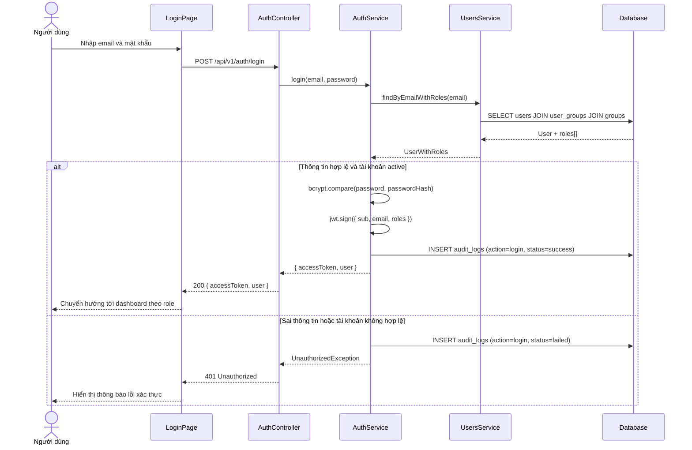

#### Biểu đồ giao tiếp

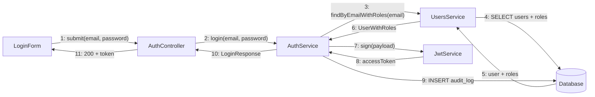

#### Biểu đồ lớp phân tích

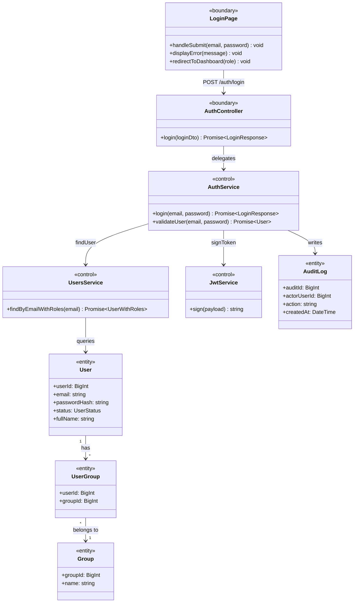

---

### Thiết kế kiến trúc cho UC02 — Đăng xuất

#### Biểu đồ tuần tự - Sequence Diagram

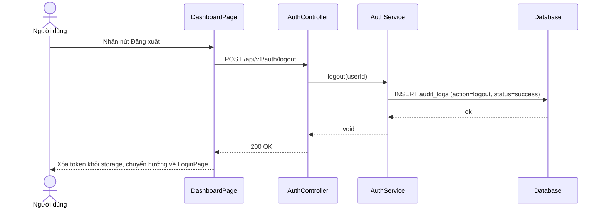

#### Biểu đồ giao tiếp

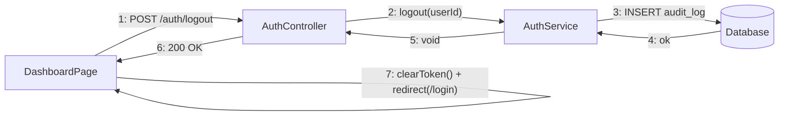

#### Biểu đồ lớp phân tích

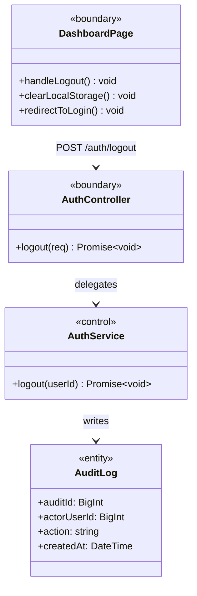

---

### Thiết kế kiến trúc cho UC03 — Quên/Đặt lại mật khẩu

#### Biểu đồ tuần tự - Sequence Diagram

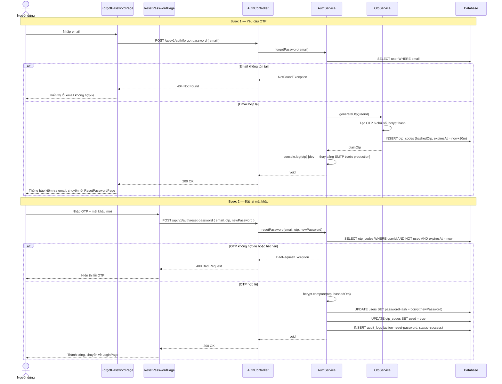

#### Biểu đồ giao tiếp

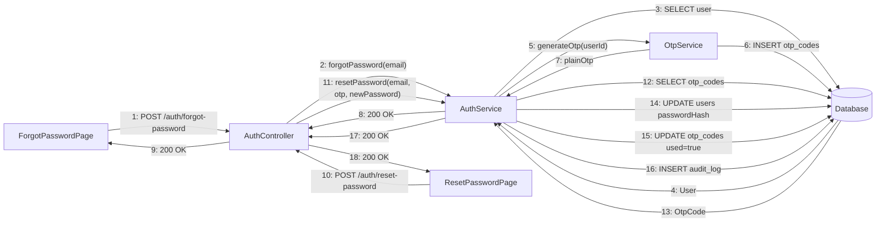

#### Biểu đồ lớp phân tích

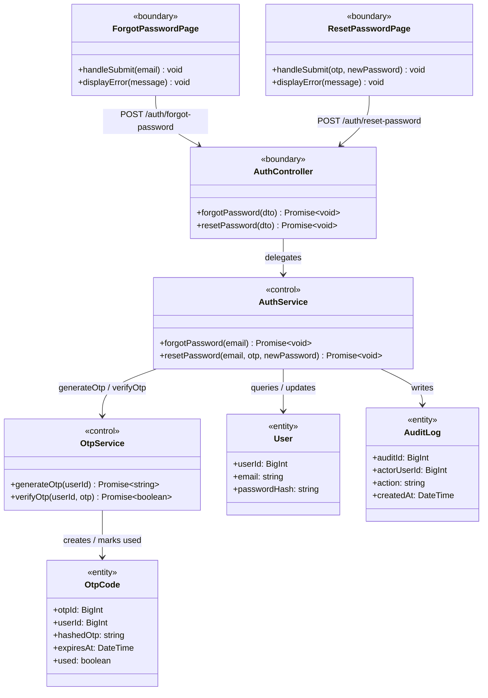

---

### Thiết kế kiến trúc cho UC04 — Quản lý hồ sơ cá nhân

> Ghi chú: Codebase không có `UsersController` hay `FileService`. Profile được phục vụ qua `AuthController` (thông tin base) + `MembersController` / `StaffController` (thông tin role-specific). Avatar upload chưa được implement.

#### Biểu đồ tuần tự - Sequence Diagram

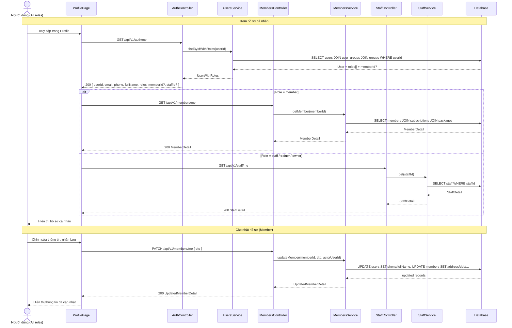

#### Biểu đồ giao tiếp

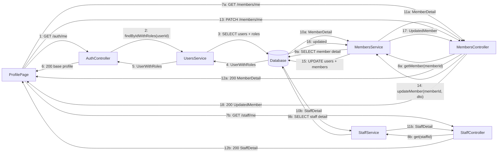

#### Biểu đồ lớp phân tích

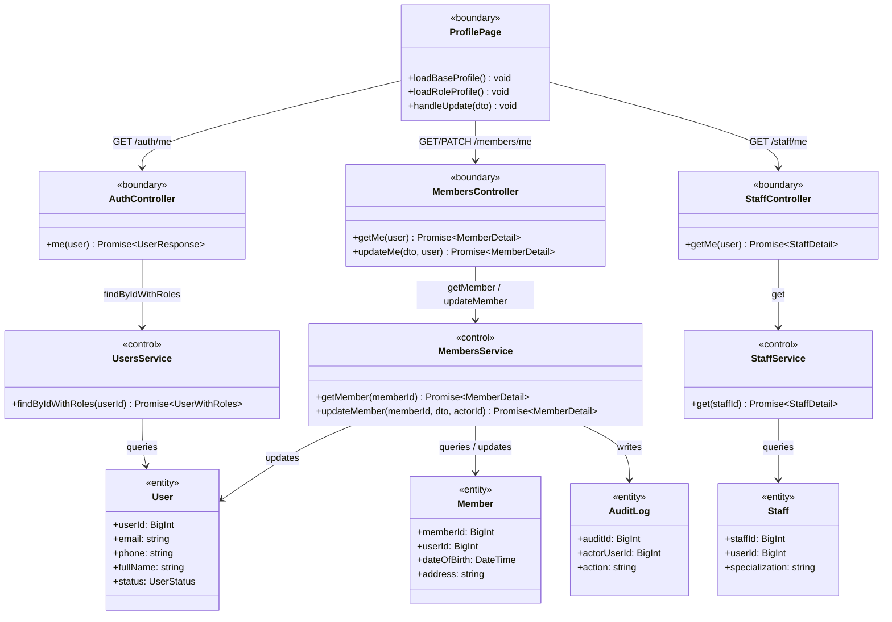

---

### Thiết kế kiến trúc cho UC05A — Staff đăng ký hội viên tại quầy

> Ghi chú: Không có OtpService trong luồng này — staff tạo tài khoản trực tiếp, email được đánh dấu verified ngay (`emailVerifiedAt = now`). Toàn bộ User + Member + UserGroup + Subscription + Payment được tạo trong một `$transaction`.

#### Biểu đồ tuần tự - Sequence Diagram

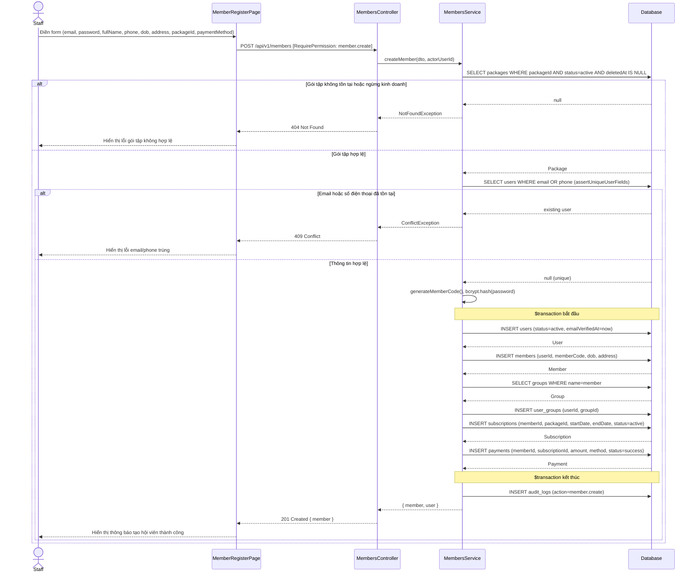

#### Biểu đồ giao tiếp

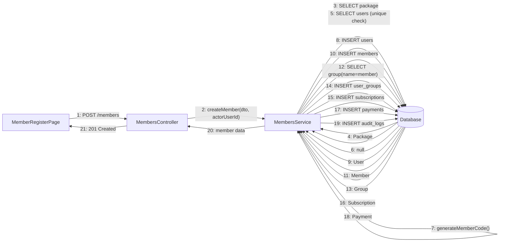

#### Biểu đồ lớp phân tích


---

### Thiết kế kiến trúc cho UC05B — Member tự đăng ký online

> Ghi chú: OTP xác thực email được lưu trong `OtpStoreService` (in-memory store), không phải bảng `otp_codes` trong DB. User tạo ra với `status = pending_verification`; Subscription (nếu có) với `status = pending` — chưa active cho đến khi email được xác thực. Không tạo Payment trong bước này. SubscriptionsService không tham gia — MembersService tự INSERT subscription trong transaction.

#### Biểu đồ tuần tự - Sequence Diagram

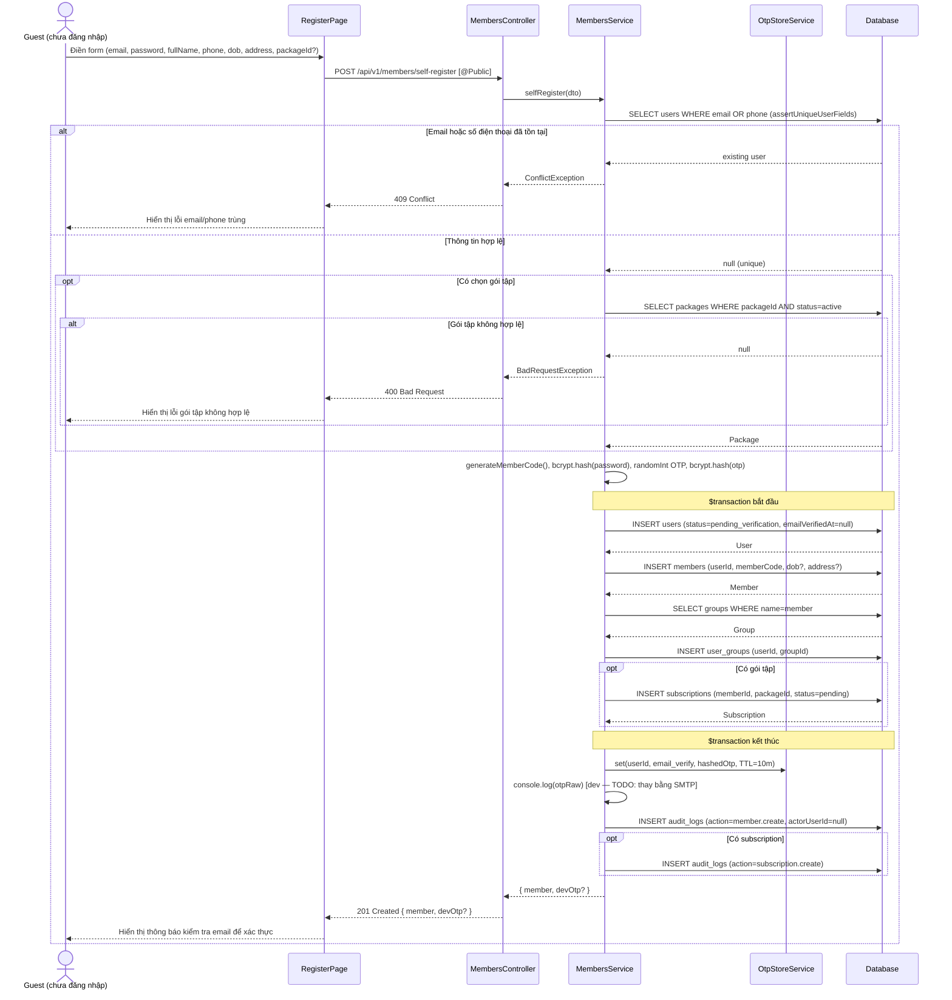

#### Biểu đồ giao tiếp

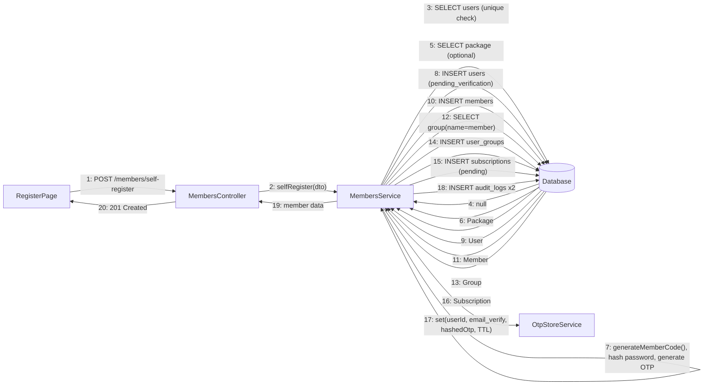

#### Biểu đồ lớp phân tích

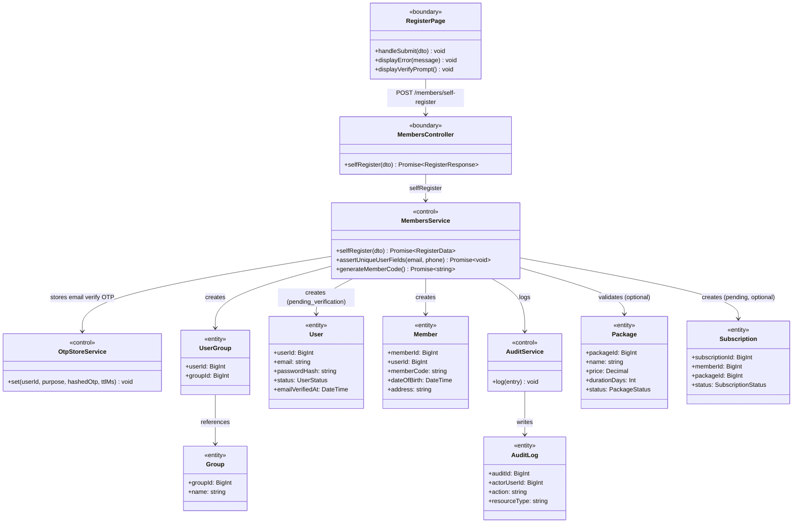

---

### Thiết kế kiến trúc cho UC06 — Đăng ký gói tập mới (Tạo mới subscription)

> Ghi chú thực tế: `PackagesService` và `PaymentService` không tham gia luồng này. `SubscriptionsService` query bảng `packages` trực tiếp qua Prisma. Subscription được tạo với `status=pending` — không có Payment record ở bước này (payment chỉ tạo khi gia hạn).

#### Biểu đồ tuần tự - Sequence Diagram

```mermaid
sequenceDiagram
    actor Actor as Member / Staff
    participant Client as PackageListPage
    participant API as SubscriptionsController
    participant Svc as SubscriptionsService
    participant Audit as AuditService
    participant DB as Database

    Actor->>Client: Chọn gói tập, điền thông tin đăng ký
    Client->>API: POST /api/v1/subscriptions
    API->>Svc: createSubscription(dto, user)

    Svc->>DB: SELECT members WHERE memberId AND deletedAt IS NULL
    DB-->>Svc: Member | null

    alt Member không tồn tại
        Svc-->>API: BadRequestException (FK_CONSTRAINT)
        API-->>Client: 400 Bad Request
        Client-->>Actor: Hiển thị lỗi hội viên không tồn tại
    end

    alt Member chưa xác thực email (caller là Member)
        Svc-->>API: ForbiddenException (EMAIL_NOT_VERIFIED)
        API-->>Client: 403 Forbidden
        Client-->>Actor: Yêu cầu xác thực email trước
    end

    Svc->>DB: SELECT packages WHERE packageId AND status=active AND deletedAt IS NULL
    DB-->>Svc: Package | null

    alt Package không tồn tại hoặc inactive
        Svc-->>API: BadRequestException (FK_CONSTRAINT)
        API-->>Client: 400 Bad Request
        Client-->>Actor: Hiển thị lỗi gói tập không hợp lệ
    end

    Svc->>DB: SELECT subscriptions WHERE memberId AND (status=pending OR status=active)
    DB-->>Svc: existingSub | null

    alt Đã có gói active hoặc pending
        Svc-->>API: ConflictException (SUBSCRIPTION_ALREADY_EXISTS)
        API-->>Client: 409 Conflict
        Client-->>Actor: Yêu cầu hủy gói cũ trước khi đăng ký mới
    end

    alt Package có includesPt = true
        Svc->>DB: SELECT staff WHERE staffId AND position IN (trainer, pt)
        DB-->>Svc: Trainer | null
        alt Trainer không hợp lệ hoặc không chọn trainer
            Svc-->>API: BadRequestException (TRAINER_REQUIRED / TRAINER_NOT_FOUND)
            API-->>Client: 400 Bad Request
            Client-->>Actor: Yêu cầu chọn PT hợp lệ
        end
    end

    Svc->>DB: $transaction BEGIN
    Svc->>DB: INSERT subscriptions (status=pending, startDate=today, endDate=today+durationDays)
    alt Package có PT
        Svc->>DB: UPDATE members SET primaryTrainerId = trainerId
    end
    Svc->>DB: $transaction COMMIT
    DB-->>Svc: Subscription (kèm Member, Package, Trainer)

    Svc->>Audit: log(subscription.create, subscriptionId)
    Svc-->>API: { data: serializedSubscription }
    API-->>Client: 201 Created
    Client-->>Actor: Hiển thị thông tin gói tập vừa đăng ký (status=pending)
```

#### Biểu đồ giao tiếp

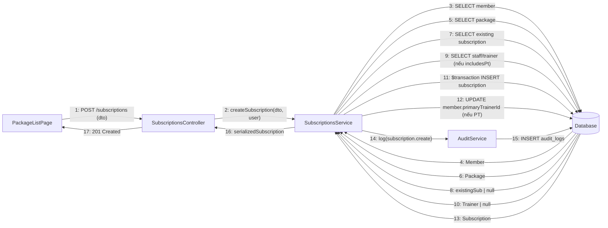

#### Biểu đồ lớp phân tích

```mermaid
classDiagram
    class PackageListPage {
        <<boundary>>
        +displayPackages() void
        +submitSubscription(packageId, trainerId) void
    }
    class SubscriptionsController {
        <<boundary>>
        +create(dto, user) Promise~SubscriptionResponse~
    }
    class SubscriptionsService {
        <<control>>
        +createSubscription(dto, caller) Promise~SubscriptionData~
        -resolveCallerMemberId(caller) Promise~bigint~
        -serializeSubscription(sub) object
    }
    class AuditService {
        <<control>>
        +log(entry) void
    }
    class Package {
        <<entity>>
        +packageId: BigInt
        +name: string
        +durationDays: number
        +price: Decimal
        +includesPt: boolean
        +status: PackageStatus
    }
    class Subscription {
        <<entity>>
        +subscriptionId: BigInt
        +memberId: BigInt
        +packageId: BigInt
        +trainerId: BigInt
        +startDate: DateTime
        +endDate: DateTime
        +status: SubscriptionStatus
    }
    class Member {
        <<entity>>
        +memberId: BigInt
        +userId: BigInt
        +primaryTrainerId: BigInt
    }
    class Staff {
        <<entity>>
        +staffId: BigInt
        +position: string
    }
    class AuditLog {
        <<entity>>
        +auditId: BigInt
        +actorUserId: BigInt
        +action: string
        +resourceType: string
    }

    PackageListPage --> SubscriptionsController : POST /subscriptions
    SubscriptionsController --> SubscriptionsService : delegates
    SubscriptionsService --> Package : validates (read)
    SubscriptionsService --> Member : validates (read) + updates primaryTrainerId
    SubscriptionsService --> Staff : validates trainer (optional)
    SubscriptionsService --> Subscription : creates (status=pending)
    SubscriptionsService --> AuditService : logs
    AuditService --> AuditLog : writes
```

---

### Thiết kế kiến trúc cho UC07A — Gia hạn gói tập

> Ghi chú thực tế: `PaymentService` không tham gia. Payment record được tạo trực tiếp qua Prisma bên trong `$transaction` cùng với lệnh cập nhật `endDate`. Amount lấy từ `package.price` phía server, không tin dữ liệu từ client.

#### Biểu đồ tuần tự - Sequence Diagram

```mermaid
sequenceDiagram
    actor Actor as Member / Staff
    participant Client as SubscriptionDetailPage
    participant API as SubscriptionsController
    participant Svc as SubscriptionsService
    participant Audit as AuditService
    participant DB as Database

    Actor->>Client: Chọn gia hạn gói tập, điền phương thức thanh toán
    Client->>API: POST /api/v1/subscriptions/:id/renew
    API->>Svc: renewSubscription(subscriptionId, dto, caller)

    Svc->>DB: SELECT subscriptions WHERE subscriptionId (kèm member, package, trainer)
    DB-->>Svc: Subscription | null

    alt Subscription không tồn tại hoặc status != active
        Svc-->>API: NotFoundException (NOT_FOUND)
        API-->>Client: 404 Not Found
        Client-->>Actor: Hiển thị lỗi chỉ gia hạn gói đang hoạt động
    end

    alt Package đã ngừng kinh doanh (status != active)
        Svc-->>API: BadRequestException (PACKAGE_INACTIVE)
        API-->>Client: 400 Bad Request
        Client-->>Actor: Thông báo gói này đã ngừng bán, không thể gia hạn
    end

    Svc->>Svc: assertCanAccessSubscription(memberId, memberUserId, caller)

    alt Caller không có quyền truy cập subscription này
        Svc-->>API: ForbiddenException (FORBIDDEN)
        API-->>Client: 403 Forbidden
        Client-->>Actor: Hiển thị lỗi không có quyền
    end

    Svc->>Svc: newEndDate = endDate + package.durationDays

    Svc->>DB: $transaction BEGIN
    Svc->>DB: INSERT payments (amount=package.price, method, status=success, paidAt=now)
    Svc->>DB: UPDATE subscriptions SET endDate = newEndDate
    Svc->>DB: $transaction COMMIT
    DB-->>Svc: updated Subscription (kèm Member, Package, Trainer)

    Svc->>Audit: log(subscription.renew, subscriptionId, beforeEndDate, newEndDate)
    Svc-->>API: { data: serializedSubscription }
    API-->>Client: 200 OK
    Client-->>Actor: Hiển thị thông tin gói tập sau gia hạn (endDate mới)
```

#### Biểu đồ giao tiếp

```mermaid
graph LR
    SD[SubscriptionDetailPage] -- "1: POST /subscriptions/:id/renew (method, txRef)" --> SC[SubscriptionsController]
    SC -- "2: renewSubscription(id, dto, caller)" --> SS[SubscriptionsService]
    SS -- "3: SELECT subscription + package + member" --> DB[(Database)]
    DB -- "4: Subscription" --> SS
    SS -- "5: assertCanAccessSubscription" --> SS
    SS -- "6: $transaction INSERT payment (amount=pkg.price, status=success)" --> DB
    SS -- "7: $transaction UPDATE subscription endDate" --> DB
    DB -- "8: updated Subscription" --> SS
    SS -- "9: log(subscription.renew)" --> AS[AuditService]
    AS -- "10: INSERT audit_logs" --> DB
    SS -- "11: serializedSubscription" --> SC
    SC -- "12: 200 OK" --> SD
```

#### Biểu đồ lớp phân tích

```mermaid
classDiagram
    class SubscriptionDetailPage {
        <<boundary>>
        +displaySubscriptionDetail() void
        +submitRenewal(method, transactionReference) void
    }
    class SubscriptionsController {
        <<boundary>>
        +renew(id, dto, user) Promise~SubscriptionResponse~
    }
    class SubscriptionsService {
        <<control>>
        +renewSubscription(subscriptionId, dto, caller) Promise~SubscriptionData~
        -assertCanAccessSubscription(memberId, memberUserId, caller) Promise~void~
        -serializeSubscription(sub) object
    }
    class AuditService {
        <<control>>
        +log(entry) void
    }
    class Subscription {
        <<entity>>
        +subscriptionId: BigInt
        +memberId: BigInt
        +packageId: BigInt
        +endDate: DateTime
        +status: SubscriptionStatus
    }
    class Package {
        <<entity>>
        +packageId: BigInt
        +durationDays: number
        +price: Decimal
        +status: PackageStatus
    }
    class Payment {
        <<entity>>
        +paymentId: BigInt
        +memberId: BigInt
        +subscriptionId: BigInt
        +amount: Decimal
        +method: PaymentMethod
        +status: PaymentStatus
        +paidAt: DateTime
    }
    class Member {
        <<entity>>
        +memberId: BigInt
        +userId: BigInt
    }
    class AuditLog {
        <<entity>>
        +auditId: BigInt
        +actorUserId: BigInt
        +action: string
        +resourceType: string
    }

    SubscriptionDetailPage --> SubscriptionsController : POST /subscriptions/:id/renew
    SubscriptionsController --> SubscriptionsService : delegates
    SubscriptionsService --> Subscription : reads + updates endDate
    SubscriptionsService --> Package : validates status + reads price/durationDays
    SubscriptionsService --> Member : validates access
    SubscriptionsService --> Payment : creates (status=success)
    SubscriptionsService --> AuditService : logs
    AuditService --> AuditLog : writes
```

---

### Thiết kế kiến trúc cho UC07B — Hủy gói tập

#### Biểu đồ tuần tự - Sequence Diagram

```mermaid
sequenceDiagram
    actor User as Member / Staff
    participant Client as SubscriptionDetailPage
    participant API as SubscriptionsController
    participant Svc as SubscriptionsService
    participant DB as Database

    User->>Client: Nhấn "Hủy gói tập"
    Client->>API: PATCH /api/v1/subscriptions/:id/cancel [RequirePermission: subscription.cancel]
    API->>Svc: cancelSubscription(subscriptionId, caller)
    Svc->>DB: SELECT subscription WHERE subscriptionId AND deletedAt IS NULL INCLUDE member, user, package

    alt Không tìm thấy hoặc status đã là cancelled / expired
        DB-->>Svc: null hoặc sub.status ∈ {cancelled, expired}
        Svc-->>API: NotFoundException
        API-->>Client: 404 Not Found
        Client-->>User: Hiển thị lỗi không tìm thấy
    end

    DB-->>Svc: Subscription
    Svc->>Svc: assertCanAccessSubscription(memberId, memberUserId, caller)

    alt Không có quyền truy cập subscription
        Svc-->>API: ForbiddenException
        API-->>Client: 403 Forbidden
        Client-->>User: Hiển thị lỗi không có quyền
    end

    alt status không phải active hoặc pending
        Svc-->>API: ConflictException (SUBSCRIPTION_NOT_CANCELLABLE)
        API-->>Client: 409 Conflict
        Client-->>User: Hiển thị lỗi không thể hủy
    end

    Svc->>Svc: effectiveEndDate = endDate > yesterday ? yesterday : endDate
    Svc->>DB: $transaction: UPDATE subscription SET status=cancelled, cancelledAt=now, endDate=effectiveEndDate

    opt subscription.trainerId !== null
        Svc->>DB: UPDATE member SET primaryTrainerId=null
    end

    Svc->>DB: INSERT audit_logs (action=subscription.cancel, resourceId=subscriptionId)
    DB-->>Svc: OK
    Svc-->>API: { subscriptionId, status='cancelled', cancelledAt, endDate }
    API-->>Client: 200 { success: true, data }
    Client-->>User: Hiển thị xác nhận hủy thành công
```

#### Biểu đồ giao tiếp

```mermaid
graph LR
    SD[SubscriptionDetailPage] -- "1: PATCH /subscriptions/:id/cancel" --> SC[SubscriptionsController]
    SC -- "2: cancelSubscription(id, caller)" --> SS[SubscriptionsService]
    SS -- "3: SELECT subscription + member + user" --> DB[(Database)]
    DB -- "4: Subscription" --> SS
    SS -- "5: assertCanAccessSubscription()" --> SS
    SS -- "6: $transaction: UPDATE subscription status=cancelled, endDate=effectiveEndDate" --> DB
    SS -- "7: [nếu trainerId] UPDATE member.primaryTrainerId=null" --> DB
    SS -- "8: INSERT audit_log (subscription.cancel)" --> DB
    DB -- "9: OK" --> SS
    SS -- "10: { status: cancelled, endDate }" --> SC
    SC -- "11: 200 { success: true, data }" --> SD
```

#### Biểu đồ lớp phân tích

```mermaid
classDiagram
    class SubscriptionDetailPage {
        <<boundary>>
        +cancelSubscription()
    }
    class SubscriptionsController {
        <<boundary>>
        +cancel(id, user)
    }
    class SubscriptionsService {
        <<control>>
        +cancelSubscription(subscriptionId, caller)
        -assertCanAccessSubscription(memberId, memberUserId, caller)
    }
    class Subscription {
        <<entity>>
        +subscriptionId: BigInt
        +status: SubscriptionStatus
        +endDate: Date
        +cancelledAt: Date
        +trainerId: BigInt?
    }
    class Member {
        <<entity>>
        +memberId: BigInt
        +primaryTrainerId: BigInt?
    }
    class AuditLog {
        <<entity>>
        +action: string
        +resourceType: string
        +resourceId: string
    }
    SubscriptionDetailPage --> SubscriptionsController : PATCH /subscriptions/:id/cancel
    SubscriptionsController --> SubscriptionsService : delegates
    SubscriptionsService --> Subscription : reads + updates status/endDate
    SubscriptionsService --> Member : clears primaryTrainerId nếu có trainer
    SubscriptionsService --> AuditLog : writes
```

---

### Thiết kế kiến trúc cho UC08 — Xem gói tập hiện tại và lịch sử

#### Biểu đồ tuần tự - Sequence Diagram

```mermaid
sequenceDiagram
    actor Member as Member
    participant Client as PackageHistoryPage
    participant API as SubscriptionsController
    participant Svc as SubscriptionsService
    participant DB as Database

    Member->>Client: Mở trang gói tập
    Client->>API: GET /api/v1/subscriptions?status=active [RequirePermission: subscription.read]
    API->>Svc: listSubscriptions({ status, page, pageSize }, caller)

    alt memberId không có trong JWT payload
        Svc->>DB: SELECT member WHERE userId = caller.userId AND deletedAt IS NULL
        DB-->>Svc: Member { memberId }
    end

    Svc->>DB: SELECT subscriptions WHERE memberId=selfMemberId AND status=active AND deletedAt IS NULL INCLUDE package, member, trainer ORDER BY createdAt DESC
    Svc->>DB: COUNT subscriptions WHERE same filters
    DB-->>Svc: Subscription[], total
    Svc-->>API: { data: Subscription[], meta: { page, pageSize, totalItems, totalPages } }
    API-->>Client: 200 { success: true, data, meta }
    Client-->>Member: Hiển thị gói tập hiện tại (status, daysLeft, packageName, endDate)

    Member->>Client: Chuyển sang tab lịch sử
    Client->>API: GET /api/v1/subscriptions?status=cancelled [RequirePermission: subscription.read]
    API->>Svc: listSubscriptions({ status: cancelled, page, pageSize }, caller)
    Svc->>DB: SELECT subscriptions WHERE memberId=selfMemberId AND status=cancelled AND deletedAt IS NULL ORDER BY createdAt DESC
    DB-->>Svc: Subscription[]
    Svc-->>API: { data: Subscription[], meta }
    API-->>Client: 200 { success: true, data, meta }
    Client-->>Member: Hiển thị lịch sử các gói đã hủy / hết hạn
```

#### Biểu đồ giao tiếp

```mermaid
graph LR
    PHP[PackageHistoryPage] -- "1: GET /subscriptions?status=active" --> SC[SubscriptionsController]
    SC -- "2: listSubscriptions(dto, caller)" --> SS[SubscriptionsService]
    SS -- "3: SELECT member WHERE userId [nếu memberId thiếu trong JWT]" --> DB[(Database)]
    DB -- "4: memberId" --> SS
    SS -- "5: SELECT subscriptions WHERE memberId + status filter INCLUDE package, trainer" --> DB
    SS -- "6: COUNT subscriptions WHERE same filter" --> DB
    DB -- "7: Subscription[], total" --> SS
    SS -- "8: { data[], meta }" --> SC
    SC -- "9: 200 { success: true, data, meta }" --> PHP
```

#### Biểu đồ lớp phân tích

```mermaid
classDiagram
    class PackageHistoryPage {
        <<boundary>>
        +loadCurrentPackage()
        +loadHistory()
    }
    class SubscriptionsController {
        <<boundary>>
        +list(query, user)
    }
    class SubscriptionsService {
        <<control>>
        +listSubscriptions(dto, caller)
        -resolveCallerMemberId(caller)
        -serializeSubscription(sub)
    }
    class Subscription {
        <<entity>>
        +subscriptionId: BigInt
        +memberId: BigInt
        +status: SubscriptionStatus
        +startDate: Date
        +endDate: Date
        +cancelledAt: Date?
        +daysLeft: number?
    }
    class Package {
        <<entity>>
        +packageId: BigInt
        +name: string
        +durationDays: number
        +price: Decimal
    }
    class Member {
        <<entity>>
        +memberId: BigInt
        +memberCode: string
    }
    PackageHistoryPage --> SubscriptionsController : GET /subscriptions?status=
    SubscriptionsController --> SubscriptionsService : delegates
    SubscriptionsService --> Member : resolves selfMemberId
    SubscriptionsService --> Subscription : reads list + serializes
    SubscriptionsService --> Package : includes via relation
```

---

### Thiết kế kiến trúc cho UC09 — Quản lý hội viên

#### Biểu đồ tuần tự - Sequence Diagram

```mermaid
sequenceDiagram
    actor Staff as Staff
    participant Client as MemberListPage / MemberDetailPage
    participant API as MembersController
    participant Svc as MembersService
    participant DB as Database

    Note over Staff, DB: Luồng 1 — Xem danh sách hội viên
    Staff->>Client: Mở trang danh sách hội viên
    Client->>API: GET /api/v1/members?search=&status=&subStatus=&page= [RequirePermission: member.read]
    API->>Svc: listMembers(dto, caller)
    Svc->>DB: SELECT members INCLUDE user, activeSubscription+package WHERE filters ORDER BY createdAt DESC
    Svc->>DB: COUNT members WHERE same filters
    DB-->>Svc: Member[], total
    Svc-->>API: { data: MemberWithSub[], meta: { page, pageSize, totalItems, totalPages } }
    API-->>Client: 200 { success: true, data, meta }
    Client-->>Staff: Hiển thị danh sách hội viên kèm trạng thái gói tập hiện tại

    Note over Staff, DB: Luồng 2 — Xem chi tiết hội viên
    Staff->>Client: Nhấn vào hội viên
    Client->>API: GET /api/v1/members/:id
    API->>Svc: getMemberForCaller(memberId, caller)
    Svc->>DB: SELECT member WHERE memberId AND deletedAt IS NULL INCLUDE user, primaryTrainer+user, subscriptions+package (last 5)
    DB-->>Svc: MemberDetail
    Svc->>Svc: assertCanReadMember(member, caller)
    Svc-->>API: { data: MemberDetail }
    API-->>Client: 200 { success: true, data }
    Client-->>Staff: Hiển thị chi tiết hội viên, lịch sử 5 gói tập gần nhất, thông tin PT

    Note over Staff, DB: Luồng 3 — Cập nhật thông tin hội viên
    Staff->>Client: Chỉnh sửa thông tin và lưu
    Client->>API: PATCH /api/v1/members/:id { fullName, phone, dateOfBirth, address }
    API->>Svc: updateMemberForCaller(memberId, dto, caller)
    Svc->>DB: SELECT member WHERE memberId INCLUDE user
    DB-->>Svc: Member + User
    Svc->>Svc: assertIsOwnerStaffOrSelf
    Svc->>DB: $transaction: UPDATE user SET fullName, phone + UPDATE member SET dateOfBirth, address
    DB-->>Svc: Updated member + user
    Svc->>DB: INSERT audit_logs (action=member.update)
    DB-->>Svc: OK
    Svc-->>API: { data: Member }
    API-->>Client: 200 { success: true, data }
    Client-->>Staff: Hiển thị thông tin đã cập nhật

    Note over Staff, DB: Luồng 4 — Xóa hội viên (soft delete)
    Staff->>Client: Nhấn "Xóa hội viên"
    Client->>API: DELETE /api/v1/members/:id [RequirePermission: member.delete]
    API->>Svc: deleteMember(memberId, caller.userId)
    Svc->>DB: SELECT member WHERE memberId INCLUDE user
    DB-->>Svc: Member + User
    Svc->>DB: $transaction: UPDATE member SET deletedAt=now + UPDATE user SET deletedAt=now
    DB-->>Svc: OK
    Svc->>DB: INSERT audit_logs (action=member.delete)
    DB-->>Svc: OK
    API-->>Client: 204 No Content
    Client-->>Staff: Hội viên đã bị xóa khỏi danh sách
```

#### Biểu đồ giao tiếp

```mermaid
graph LR
    MLP[MemberListPage] -- "1: GET /members?filters" --> MC[MembersController]
    MC -- "2: listMembers(dto, caller)" --> MS[MembersService]
    MS -- "3: SELECT members + activeSubscription INCLUDE user, package" --> DB[(Database)]
    MS -- "4: COUNT members WHERE filters" --> DB
    DB -- "5: Member[], total" --> MS
    MS -- "6: { data[], meta }" --> MC
    MC -- "7: 200 { success, data, meta }" --> MLP

    MDP[MemberDetailPage] -- "8: GET /members/:id" --> MC
    MC -- "9: getMemberForCaller(id, caller)" --> MS
    MS -- "10: SELECT member INCLUDE user, trainer, subscriptions" --> DB
    DB -- "11: MemberDetail" --> MS
    MS -- "12: assertCanReadMember()" --> MS
    MS -- "13: { data: MemberDetail }" --> MC
    MC -- "14: 200 { success, data }" --> MDP

    MDP -- "15: PATCH /members/:id" --> MC
    MC -- "16: updateMemberForCaller(id, dto, caller)" --> MS
    MS -- "17: $transaction: UPDATE user + UPDATE member" --> DB
    MS -- "18: INSERT audit_log (member.update)" --> DB
    DB -- "19: OK" --> MS
    MS -- "20: { data: Member }" --> MC
    MC -- "21: 200 { success, data }" --> MDP
```

#### Biểu đồ lớp phân tích

```mermaid
classDiagram
    class MemberListPage {
        <<boundary>>
        +loadMembers(filters)
    }
    class MemberDetailPage {
        <<boundary>>
        +loadDetail(memberId)
        +updateMember(dto)
        +deleteMember(memberId)
    }
    class MembersController {
        <<boundary>>
        +list(query, user)
        +detail(id, user)
        +update(id, dto, user)
        +delete(id, user)
    }
    class MembersService {
        <<control>>
        +listMembers(dto, caller)
        +getMemberForCaller(memberId, caller)
        +updateMemberForCaller(memberId, dto, caller)
        +deleteMember(memberId, actorUserId)
        -assertCanReadMember(member, caller)
        -serializeMemberWithSub(member)
        -serializeMemberDetail(member)
    }
    class Member {
        <<entity>>
        +memberId: BigInt
        +memberCode: string
        +userId: BigInt
        +primaryTrainerId: BigInt?
        +dateOfBirth: Date?
        +address: string?
        +deletedAt: Date?
    }
    class User {
        <<entity>>
        +userId: BigInt
        +fullName: string
        +email: string
        +phone: string?
        +status: UserStatus
        +deletedAt: Date?
    }
    class Subscription {
        <<entity>>
        +subscriptionId: BigInt
        +status: SubscriptionStatus
        +endDate: Date
    }
    class AuditLog {
        <<entity>>
        +action: string
        +resourceType: string
        +resourceId: string
    }
    MemberListPage --> MembersController : GET /members
    MemberDetailPage --> MembersController : GET/PATCH/DELETE /members/:id
    MembersController --> MembersService : delegates
    MembersService --> Member : reads + updates + soft-deletes
    MembersService --> User : updates fullName/phone + soft-deletes
    MembersService --> Subscription : includes last 5 in detail
    MembersService --> AuditLog : writes on update/delete
```

---

### Thiết kế kiến trúc cho UC10 — Quản lý giáo án / workout plan

#### Biểu đồ tuần tự - Sequence Diagram

```mermaid
sequenceDiagram
    actor Trainer as Trainer
    participant Client as WorkoutPlanPage
    participant API as WorkoutPlansController
    participant Svc as WorkoutPlansService
    participant DB as Database

    Note over Trainer, DB: Luồng 1 — Tạo giáo án mới
    Trainer->>Client: Tạo giáo án mới
    Client->>API: POST /api/v1/workout-plans [RequirePermission: workout_plan.create]
    API->>Svc: create(dto, caller)
    Svc->>DB: SELECT staff WHERE userId = caller.userId [nếu staffId thiếu trong JWT]
    DB-->>Svc: staffId
    Svc->>DB: INSERT workout_plan (name, description, creatorType=staff, creatorStaffId, status=draft)
    DB-->>Svc: WorkoutPlan
    Svc->>DB: INSERT audit_logs (action=workout_plan.create)
    Svc-->>API: WorkoutPlan (status=draft)
    API-->>Client: 201 { success: true, data }
    Client-->>Trainer: Hiển thị giáo án mới tạo ở trạng thái draft

    Note over Trainer, DB: Luồng 2 — Thêm ngày tập và bài tập
    Trainer->>Client: Thêm ngày tập
    Client->>API: POST /api/v1/workout-plans/:id/days [RequirePermission: workout_plan.update]
    API->>Svc: addDay(planId, dto, caller)
    Svc->>DB: SELECT workout_plan WHERE planId AND deletedAt IS NULL
    DB-->>Svc: WorkoutPlan
    Svc->>Svc: assertCanMutatePlan + assertPlanStructureMutable + assertPlanHasNoLogs
    Svc->>DB: INSERT workout_plan_day (planId, dayNumber, weekNumber, dayOfWeek, name)
    Svc->>DB: INSERT audit_logs (action=workout_plan.update)
    DB-->>Svc: WorkoutPlanDay
    Svc-->>API: WorkoutPlanDay
    API-->>Client: 201 { success: true, data }

    Trainer->>Client: Thêm bài tập vào ngày
    Client->>API: POST /api/v1/workout-plans/:id/days/:dayId/exercises [RequirePermission: workout_plan.update]
    API->>Svc: addExercise(planId, planDayId, dto, caller)
    Svc->>DB: SELECT workout_plan_day WHERE planDayId AND planId INCLUDE plan
    DB-->>Svc: WorkoutPlanDay + Plan
    Svc->>Svc: assertCanMutatePlan + assertPlanStructureMutable + assertPlanHasNoLogs
    Svc->>DB: SELECT exercise WHERE exerciseId AND deletedAt IS NULL
    DB-->>Svc: Exercise
    Svc->>DB: INSERT workout_plan_exercise (planDayId, exerciseId, targetSets, targetReps, restSeconds, ...)
    Svc->>DB: INSERT audit_logs (action=workout_plan.update)
    DB-->>Svc: WorkoutPlanExercise
    Svc-->>API: WorkoutPlanExercise + exercise
    API-->>Client: 201 { success: true, data }
    Client-->>Trainer: Hiển thị bài tập đã thêm vào ngày tập

    Note over Trainer, DB: Luồng 3 — Kích hoạt giáo án (draft → active)
    Trainer->>Client: Nhấn "Kích hoạt giáo án"
    Client->>API: PATCH /api/v1/workout-plans/:id { status: active } [RequirePermission: workout_plan.update]
    API->>Svc: update(planId, { status: active }, caller)
    Svc->>DB: SELECT workout_plan_days WHERE planId INCLUDE exercises
    DB-->>Svc: Days + Exercises

    alt Ngày trống hoặc bài tập thiếu targetReps/Duration hoặc restSeconds
        Svc-->>API: BadRequestException
        API-->>Client: 400 Moi ngay can co bai tap day du
        Client-->>Trainer: Hiển thị lỗi validation
    end

    Svc->>DB: UPDATE workout_plan SET status=active
    Svc->>DB: INSERT audit_logs (action=workout_plan.update)
    DB-->>Svc: WorkoutPlan (status=active)
    Svc-->>API: WorkoutPlan
    API-->>Client: 200 { success: true, data }
    Client-->>Trainer: Giáo án đã được kích hoạt

    Note over Trainer, DB: Luồng 4 — Giao giáo án cho hội viên
    Trainer->>Client: Chọn hội viên và giao giáo án
    Client->>API: POST /api/v1/workout-plans/members/:memberId/assign { planId, startDate }
    API->>Svc: assignPlan(memberId, dto, caller)
    Svc->>DB: SELECT member WHERE memberId AND deletedAt IS NULL
    DB-->>Svc: Member { primaryTrainerId }
    Svc->>Svc: validate trainer là primaryTrainer của member

    alt Trainer không phụ trách member này
        Svc-->>API: ForbiddenException (TRAINER_NOT_ASSIGNED)
        API-->>Client: 403 Forbidden
        Client-->>Trainer: Hiển thị lỗi không có quyền
    end

    Svc->>DB: SELECT workout_plan WHERE planId AND status=active
    DB-->>Svc: WorkoutPlan
    Svc->>DB: $transaction: FOR UPDATE active assignments → UPDATE status=replaced + INSERT new MemberWorkoutPlan (status=active)
    DB-->>Svc: MemberWorkoutPlan
    Svc->>DB: INSERT audit_logs (action=workout_plan.assign)
    DB-->>Svc: OK
    Svc-->>API: MemberWorkoutPlan
    API-->>Client: 201 { success: true, data }
    Client-->>Trainer: Giáo án đã được giao cho hội viên
```

#### Biểu đồ giao tiếp

```mermaid
graph LR
    WPP[WorkoutPlanPage] -- "1: POST /workout-plans" --> WPC[WorkoutPlansController]
    WPC -- "2: create(dto, caller)" --> WPS[WorkoutPlansService]
    WPS -- "3: INSERT workout_plan status=draft" --> DB[(Database)]
    WPS -- "4: INSERT audit_log" --> DB
    DB -- "5: WorkoutPlan" --> WPS
    WPS -- "6: WorkoutPlan" --> WPC
    WPC -- "7: 201 { success, data }" --> WPP

    WPP -- "8: POST /workout-plans/:id/days" --> WPC
    WPC -- "9: addDay(planId, dto, caller)" --> WPS
    WPS -- "10: assertCanMutatePlan + assertPlanHasNoLogs" --> WPS
    WPS -- "11: INSERT workout_plan_day" --> DB
    DB -- "12: WorkoutPlanDay" --> WPS

    WPP -- "13: POST /workout-plans/:id/days/:dayId/exercises" --> WPC
    WPC -- "14: addExercise(planId, dayId, dto, caller)" --> WPS
    WPS -- "15: SELECT exercise WHERE exerciseId" --> DB
    WPS -- "16: INSERT workout_plan_exercise" --> DB
    DB -- "17: WorkoutPlanExercise" --> WPS

    WPP -- "18: PATCH /workout-plans/:id { status: active }" --> WPC
    WPC -- "19: update(planId, dto, caller)" --> WPS
    WPS -- "20: SELECT days + exercises để validate" --> DB
    WPS -- "21: UPDATE workout_plan status=active" --> DB
    DB -- "22: WorkoutPlan active" --> WPS

    WPP -- "23: POST /workout-plans/members/:memberId/assign" --> WPC
    WPC -- "24: assignPlan(memberId, dto, caller)" --> WPS
    WPS -- "25: $transaction: UPDATE old=replaced + INSERT MemberWorkoutPlan active" --> DB
    WPS -- "26: INSERT audit_log (workout_plan.assign)" --> DB
    DB -- "27: MemberWorkoutPlan" --> WPS
    WPS -- "28: MemberWorkoutPlan" --> WPC
    WPC -- "29: 201 { success, data }" --> WPP
```

#### Biểu đồ lớp phân tích

```mermaid
classDiagram
    class WorkoutPlanPage {
        <<boundary>>
        +createPlan()
        +addDay()
        +addExercise()
        +activatePlan()
        +assignPlan(memberId)
    }
    class WorkoutPlansController {
        <<boundary>>
        +list(user)
        +create(dto, user)
        +update(id, dto, user)
        +addDay(id, dto, user)
        +addExercise(id, dayId, dto, user)
        +assign(memberId, dto, user)
    }
    class WorkoutPlansService {
        <<control>>
        +findAll(user)
        +create(dto, caller)
        +update(id, dto, caller)
        +addDay(planId, dto, caller)
        +addExercise(planId, dayId, dto, caller)
        +assignPlan(memberId, dto, caller)
        -assertCanMutatePlan(plan, caller)
        -assertPlanHasNoLogs(planId)
        -assertPlanStructureMutable(status)
    }
    class WorkoutPlan {
        <<entity>>
        +planId: BigInt
        +name: string
        +creatorType: PlanCreatorType
        +creatorStaffId: BigInt?
        +status: WorkoutPlanStatus
    }
    class WorkoutPlanDay {
        <<entity>>
        +planDayId: BigInt
        +planId: BigInt
        +dayNumber: number
        +weekNumber: number
        +dayOfWeek: number
    }
    class WorkoutPlanExercise {
        <<entity>>
        +planExerciseId: BigInt
        +planDayId: BigInt
        +exerciseId: BigInt
        +targetSets: number
        +targetReps: number?
        +targetDurationSec: number?
        +restSeconds: number
    }
    class Exercise {
        <<entity>>
        +exerciseId: BigInt
        +name: string
    }
    class MemberWorkoutPlan {
        <<entity>>
        +assignmentId: BigInt
        +memberId: BigInt
        +planId: BigInt
        +assignedByStaffId: BigInt?
        +status: WorkoutAssignmentStatus
        +startDate: Date
    }
    class AuditLog {
        <<entity>>
        +action: string
        +resourceType: string
        +resourceId: string
    }
    WorkoutPlanPage --> WorkoutPlansController
    WorkoutPlansController --> WorkoutPlansService : delegates
    WorkoutPlansService --> WorkoutPlan : creates + updates
    WorkoutPlansService --> WorkoutPlanDay : creates + deletes
    WorkoutPlansService --> WorkoutPlanExercise : creates + deletes
    WorkoutPlansService --> Exercise : validates existence
    WorkoutPlansService --> MemberWorkoutPlan : creates assignment
    WorkoutPlansService --> AuditLog : writes
```

---

### Thiết kế kiến trúc cho UC11 — Quản lý buổi tập / lịch tập

#### Biểu đồ tuần tự - Sequence Diagram

```mermaid
sequenceDiagram
    actor Trainer as Trainer
    participant Client as TrainingSchedulePage
    participant API as TrainingController
    participant Svc as TrainingService
    participant DB as Database

    Note over Trainer, DB: Luồng 1 — Tạo buổi tập mới
    Trainer->>Client: Tạo buổi tập cho hội viên
    Client->>API: POST /api/v1/training-sessions [RequirePermission: session.manage]
    API->>Svc: createSession(dto, caller)
    Svc->>Svc: validate endTime > startTime + startTime >= now - 5min grace
    Svc->>DB: SELECT member WHERE memberId AND deletedAt IS NULL
    DB-->>Svc: Member

    alt Member không tồn tại
        Svc-->>API: NotFoundException
        API-->>Client: 404 Not Found
        Client-->>Trainer: Hiển thị lỗi không tìm thấy hội viên
    end

    Svc->>DB: SELECT subscription WHERE memberId AND status=active AND startDate<=now AND endDate>=now
    DB-->>Svc: Subscription

    alt Không có gói tập active
        Svc-->>API: BadRequestException (NO_ACTIVE_SUBSCRIPTION)
        API-->>Client: 400 Bad Request
        Client-->>Trainer: Hiển thị lỗi hội viên không có gói tập active
    end

    Svc->>DB: SELECT gymRoom WHERE roomId AND deletedAt IS NULL
    Svc->>DB: SELECT staff WHERE trainerStaffId AND deletedAt IS NULL
    DB-->>Svc: GymRoom + Staff

    Svc->>DB: checkOverlap: SELECT trainingSession WHERE roomId AND time overlap AND status≠cancelled
    Svc->>DB: checkOverlap: SELECT trainingSession WHERE trainerStaffId AND time overlap AND status≠cancelled
    DB-->>Svc: Overlap results

    alt Phòng tập hoặc trainer bị conflict
        Svc-->>API: ConflictException (ROOM_CONFLICT / TRAINER_CONFLICT)
        API-->>Client: 409 Conflict
        Client-->>Trainer: Hiển thị lỗi lịch bị trùng
    end

    Svc->>DB: resolveSessionPlanLink: SELECT memberWorkoutPlan WHERE memberId AND status=active
    DB-->>Svc: MemberWorkoutPlan (optional)
    Svc->>DB: resolveSessionPlanLink: SELECT workoutPlanDay WHERE planId AND dayNumber matches
    DB-->>Svc: WorkoutPlanDay (optional, linked if found)

    Svc->>DB: INSERT training_session (memberId, trainerStaffId, roomId, startTime, endTime, assignmentId?, planDayId?, status=scheduled)
    DB-->>Svc: TrainingSession
    Svc->>DB: INSERT audit_log (action=training.create, resourceType=training_session)
    DB-->>Svc: OK
    Svc-->>API: TrainingSession (with member, trainer, room)
    API-->>Client: 201 { success: true, data }
    Client-->>Trainer: Hiển thị buổi tập vừa tạo

    Note over Trainer, DB: Luồng 2 — Xem danh sách buổi tập
    Trainer->>Client: Xem lịch tập
    Client->>API: GET /api/v1/training-sessions?memberId=&status=&from=&to= [RequirePermission: session.read]
    API->>Svc: listSessions(dto, caller)
    Svc->>DB: SELECT training_sessions WHERE filters (memberId, trainerStaffId, roomId, status, startTime range) INCLUDE member, trainer, room, assignment, planDay PAGINATE
    DB-->>Svc: TrainingSession[]
    Svc-->>API: { data, total, page, pageSize }
    API-->>Client: 200 { success: true, data }
    Client-->>Trainer: Hiển thị danh sách buổi tập

    Note over Trainer, DB: Luồng 3 — Cập nhật trạng thái buổi tập
    Trainer->>Client: Bắt đầu / kết thúc buổi tập
    Client->>API: POST /api/v1/training-sessions/:id/status { status: in_progress | completed } [RequirePermission: session.manage]
    API->>Svc: updateSessionStatus(id, status, caller)
    Svc->>DB: SELECT training_session WHERE sessionId AND deletedAt IS NULL
    DB-->>Svc: TrainingSession

    alt Transition không hợp lệ (ví dụ: completed → in_progress)
        Svc-->>API: BadRequestException (INVALID_STATUS_TRANSITION)
        API-->>Client: 400 Bad Request
        Client-->>Trainer: Hiển thị lỗi trạng thái không hợp lệ
    end

    Svc->>DB: UPDATE training_session SET status = newStatus
    Svc->>DB: INSERT audit_log (action=training.status.{newStatus})
    DB-->>Svc: TrainingSession (updated)
    Svc-->>API: TrainingSession
    API-->>Client: 200 { success: true, data }
    Client-->>Trainer: Hiển thị trạng thái mới

    Note over Trainer, DB: Luồng 4 — Hủy buổi tập
    Trainer->>Client: Nhấn hủy buổi tập
    Client->>API: POST /api/v1/training-sessions/:id/cancel [RequirePermission: session.manage]
    API->>Svc: cancelSession(id, dto, caller)
    Svc->>DB: SELECT training_session WHERE sessionId AND deletedAt IS NULL
    DB-->>Svc: TrainingSession
    Svc->>Svc: permission check — trainer chỉ cancel được session của mình
    Svc->>DB: UPDATE training_session SET status=cancelled
    Svc->>DB: INSERT audit_log (action=training.cancel)
    DB-->>Svc: OK
    Svc-->>API: TrainingSession (status=cancelled)
    API-->>Client: 200 { success: true, data }
    Client-->>Trainer: Hiển thị buổi tập đã hủy
```

#### Biểu đồ giao tiếp

```mermaid
graph LR
    TSP[TrainingSchedulePage] -- "1: POST /training-sessions" --> TC[TrainingController]
    TC -- "2: createSession(dto, caller)" --> TS[TrainingService]
    TS -- "3: SELECT member + validate" --> DB[(Database)]
    TS -- "4: SELECT subscription WHERE status=active" --> DB
    TS -- "5: SELECT gymRoom + staff (trainer)" --> DB
    TS -- "6: checkOverlap room + trainer" --> DB
    DB -- "7: overlap results" --> TS
    TS -- "8: resolveSessionPlanLink: SELECT memberWorkoutPlan + workoutPlanDay" --> DB
    DB -- "9: MemberWorkoutPlan + WorkoutPlanDay (optional)" --> TS
    TS -- "10: INSERT training_session (status=scheduled)" --> DB
    TS -- "11: INSERT audit_log (training.create)" --> DB
    DB -- "12: TrainingSession" --> TS
    TS -- "13: TrainingSession" --> TC
    TC -- "14: 201 { success, data }" --> TSP

    TSP -- "15: GET /training-sessions?filters" --> TC
    TC -- "16: listSessions(dto, caller)" --> TS
    TS -- "17: SELECT training_sessions WITH filters INCLUDE member+trainer+room" --> DB
    DB -- "18: TrainingSession[]" --> TS
    TS -- "19: { data, total }" --> TC
    TC -- "20: 200 { success, data }" --> TSP

    TSP -- "21: POST /training-sessions/:id/status { status }" --> TC
    TC -- "22: updateSessionStatus(id, status, caller)" --> TS
    TS -- "23: SELECT training_session" --> DB
    TS -- "24: UPDATE training_session.status" --> DB
    TS -- "25: INSERT audit_log (training.status.{status})" --> DB
    DB -- "26: TrainingSession (updated)" --> TS
    TS -- "27: TrainingSession" --> TC
    TC -- "28: 200 { success, data }" --> TSP

    TSP -- "29: POST /training-sessions/:id/cancel" --> TC
    TC -- "30: cancelSession(id, dto, caller)" --> TS
    TS -- "31: SELECT + permission check" --> DB
    TS -- "32: UPDATE training_session.status=cancelled" --> DB
    TS -- "33: INSERT audit_log (training.cancel)" --> DB
    DB -- "34: OK" --> TS
    TS -- "35: TrainingSession (cancelled)" --> TC
    TC -- "36: 200 { success, data }" --> TSP
```

#### Biểu đồ lớp phân tích

```mermaid
classDiagram
    class TrainingSchedulePage {
        <<boundary>>
        +createSession()
        +listSessions(filters)
        +updateSessionStatus(id, status)
        +cancelSession(id)
    }
    class TrainingController {
        <<boundary>>
        +listSessions(dto, user)
        +getSession(id, user)
        +createSession(dto, user)
        +updateSession(id, dto, user)
        +cancelSession(id, dto, user)
        +updateSessionStatus(id, status, user)
    }
    class TrainingService {
        <<control>>
        +listSessions(dto, caller)
        +getSession(id, caller)
        +createSession(dto, caller)
        +updateSession(id, dto, caller)
        +cancelSession(id, dto, caller)
        +updateSessionStatus(id, status, caller)
        -checkOverlap(roomId, trainerStaffId, startTime, endTime)
        -resolveSessionPlanLink(memberId, startTime)
    }
    class TrainingSession {
        <<entity>>
        +sessionId: BigInt
        +memberId: BigInt
        +trainerStaffId: BigInt
        +roomId: BigInt
        +assignmentId: BigInt?
        +planDayId: BigInt?
        +startTime: DateTime
        +endTime: DateTime
        +status: SessionStatus
    }
    class Member {
        <<entity>>
        +memberId: BigInt
        +primaryTrainerId: BigInt?
    }
    class Staff {
        <<entity>>
        +staffId: BigInt
    }
    class GymRoom {
        <<entity>>
        +roomId: BigInt
        +name: string
    }
    class Subscription {
        <<entity>>
        +subscriptionId: BigInt
        +memberId: BigInt
        +status: SubscriptionStatus
        +endDate: DateTime
    }
    class MemberWorkoutPlan {
        <<entity>>
        +assignmentId: BigInt
        +memberId: BigInt
        +planId: BigInt
        +status: WorkoutAssignmentStatus
    }
    class WorkoutPlanDay {
        <<entity>>
        +planDayId: BigInt
        +planId: BigInt
        +dayNumber: number
    }
    class AuditLog {
        <<entity>>
        +action: string
        +resourceType: string
    }
    TrainingSchedulePage --> TrainingController
    TrainingController --> TrainingService : delegates
    TrainingService --> TrainingSession : creates + updates
    TrainingService --> Member : validates
    TrainingService --> Staff : validates trainer
    TrainingService --> GymRoom : validates + conflict check
    TrainingService --> Subscription : validates active
    TrainingService --> MemberWorkoutPlan : links optional
    TrainingService --> WorkoutPlanDay : links optional
    TrainingService --> AuditLog : writes
```

---

### Thiết kế kiến trúc cho UC12 — Theo dõi và ghi nhận buổi tập

#### Biểu đồ tuần tự - Sequence Diagram

```mermaid
sequenceDiagram
    actor Member as Member
    participant AttPage as AttendancePage
    participant TAPI as TrainingController
    participant AttSvc as AttendanceService
    participant WLPage as WorkoutLogPage
    participant WLAPI as WorkoutLogsController
    participant WLSvc as WorkoutLogsService
    participant DB as Database

    Note over Member, DB: Luồng 1 — Check-in thủ công vào phòng tập
    Member->>AttPage: Check-in vào phòng tập
    AttPage->>TAPI: POST /api/v1/attendance/manual-checkin { memberCode } [RequirePermission: attendance.checkin]
    TAPI->>AttSvc: manualCheckin(dto, caller)
    AttSvc->>DB: SELECT member WHERE memberCode AND deletedAt IS NULL
    DB-->>AttSvc: Member

    alt Không tìm thấy member
        AttSvc-->>TAPI: NotFoundException
        TAPI-->>AttPage: 404 Not Found
        AttPage-->>Member: Hiển thị lỗi không tìm thấy
    end

    AttSvc->>DB: SELECT subscription WHERE memberId AND status=active AND startDate<=today AND endDate>=today
    DB-->>AttSvc: Subscription

    alt Không có gói tập active hôm nay
        AttSvc-->>TAPI: BadRequestException (NO_ACTIVE_SUBSCRIPTION)
        TAPI-->>AttPage: 400 Bad Request
        AttPage-->>Member: Hiển thị lỗi không có gói tập active
    end

    AttSvc->>DB: UPDATE attendance_log SET endTime=now WHERE memberId AND endTime IS NULL (auto-close open)
    AttSvc->>DB: INSERT attendance_log (memberId, subscriptionId, startTime=now, method=manual)
    DB-->>AttSvc: AttendanceLog
    AttSvc->>DB: INSERT audit_log (action=attendance.manual-checkin)
    AttSvc-->>TAPI: AttendanceLog
    TAPI-->>AttPage: 201 { success: true, data }
    AttPage-->>Member: Hiển thị check-in thành công

    Note over Member, DB: Luồng 2 — Check-out khỏi phòng tập
    Member->>AttPage: Check-out
    AttPage->>TAPI: PATCH /api/v1/attendance-logs/:id/checkout { endTime } [RequirePermission: attendance.checkin]
    TAPI->>AttSvc: checkout(id, dto, caller)
    AttSvc->>DB: SELECT attendance_log WHERE attendanceId AND deletedAt IS NULL
    DB-->>AttSvc: AttendanceLog

    alt endTime đã tồn tại (đã checkout trước đó)
        AttSvc-->>TAPI: ConflictException (ALREADY_CHECKED_OUT)
        TAPI-->>AttPage: 409 Conflict
        AttPage-->>Member: Hiển thị lỗi đã checkout rồi
    end

    AttSvc->>DB: UPDATE attendance_log SET endTime = dto.endTime WHERE attendanceId
    AttSvc->>DB: INSERT audit_log (action=attendance.checkout)
    DB-->>AttSvc: AttendanceLog (updated)
    AttSvc-->>TAPI: AttendanceLog
    TAPI-->>AttPage: 200 { success: true, data }
    AttPage-->>Member: Hiển thị thời gian tập đã ghi nhận

    Note over Member, DB: Luồng 3 — Ghi nhận chi tiết buổi tập (workout log)
    Member->>WLPage: Ghi nhận các set đã thực hiện
    WLPage->>WLAPI: POST /api/v1/workout-logs { assignmentId, planDayId, loggedAt, sets[] } [RequirePermission: workout_log.create]
    WLAPI->>WLSvc: create(dto, caller)
    WLSvc->>DB: resolveCallerMember: SELECT member WHERE userId = caller.userId
    DB-->>WLSvc: Member
    WLSvc->>DB: SELECT member_workout_plan WHERE assignmentId AND memberId AND status=active
    DB-->>WLSvc: MemberWorkoutPlan

    alt Assignment không tồn tại hoặc không thuộc member này
        WLSvc-->>WLAPI: NotFoundException / ForbiddenException
        WLAPI-->>WLPage: 404 / 403
        WLPage-->>Member: Hiển thị lỗi
    end

    WLSvc->>DB: SELECT workout_plan_day WHERE planDayId AND planId = assignment.planId
    DB-->>WLSvc: WorkoutPlanDay
    WLSvc->>DB: INSERT workout_log (memberId, assignmentId, planDayId, loggedAt, durationMin, notes)
    DB-->>WLSvc: WorkoutLog (logId)
    WLSvc->>DB: INSERT workout_log_set[] (logId, planExerciseId, setNumber, actualReps, actualWeightKg, completed) — bulk insert
    DB-->>WLSvc: WorkoutLogSet[]
    WLSvc->>DB: INSERT audit_log (action=workout_log.create)
    DB-->>WLSvc: OK
    WLSvc-->>WLAPI: WorkoutLog (with sets)
    WLAPI-->>WLPage: 201 { success: true, data }
    WLPage-->>Member: Hiển thị buổi tập đã được ghi nhận

    Note over Member, DB: Luồng 4 — Cập nhật workout log (trong vòng 24 giờ)
    Member->>WLPage: Chỉnh sửa log
    WLPage->>WLAPI: PATCH /api/v1/workout-logs/:id { sets[] } [RequirePermission: workout_log.update]
    WLAPI->>WLSvc: update(id, dto, caller)
    WLSvc->>DB: SELECT workout_log WHERE logId AND memberId = callerMemberId
    DB-->>WLSvc: WorkoutLog

    alt Log quá 24 giờ
        WLSvc-->>WLAPI: ForbiddenException (LOG_EDIT_WINDOW_EXPIRED)
        WLAPI-->>WLPage: 403 Forbidden
        WLPage-->>Member: Hiển thị lỗi không thể sửa sau 24 giờ
    end

    WLSvc->>DB: UPDATE workout_log (durationMin, notes) + DELETE old sets + INSERT new sets
    WLSvc->>DB: INSERT audit_log (action=workout_log.update)
    DB-->>WLSvc: WorkoutLog (updated)
    WLSvc-->>WLAPI: WorkoutLog
    WLAPI-->>WLPage: 200 { success: true, data }
    WLPage-->>Member: Hiển thị log đã cập nhật
```

#### Biểu đồ giao tiếp

```mermaid
graph LR
    AttPage[AttendancePage] -- "1: POST /attendance/manual-checkin" --> TC[TrainingController]
    TC -- "2: manualCheckin(dto, caller)" --> AttSvc[AttendanceService]
    AttSvc -- "3: SELECT member WHERE memberCode" --> DB[(Database)]
    AttSvc -- "4: SELECT subscription WHERE status=active today" --> DB
    AttSvc -- "5: UPDATE open attendance_log endTime=now" --> DB
    AttSvc -- "6: INSERT attendance_log (method=manual)" --> DB
    AttSvc -- "7: INSERT audit_log (attendance.manual-checkin)" --> DB
    DB -- "8: AttendanceLog" --> AttSvc
    AttSvc -- "9: AttendanceLog" --> TC
    TC -- "10: 201 { success, data }" --> AttPage

    AttPage -- "11: PATCH /attendance-logs/:id/checkout" --> TC
    TC -- "12: checkout(id, dto, caller)" --> AttSvc
    AttSvc -- "13: SELECT attendance_log" --> DB
    AttSvc -- "14: UPDATE attendance_log.endTime" --> DB
    AttSvc -- "15: INSERT audit_log (attendance.checkout)" --> DB
    DB -- "16: AttendanceLog (updated)" --> AttSvc
    AttSvc -- "17: AttendanceLog" --> TC
    TC -- "18: 200 { success, data }" --> AttPage

    WLPage[WorkoutLogPage] -- "19: POST /workout-logs { assignmentId, sets[] }" --> WLC[WorkoutLogsController]
    WLC -- "20: create(dto, caller)" --> WLSvc[WorkoutLogsService]
    WLSvc -- "21: SELECT member WHERE userId (resolveCallerMember)" --> DB
    WLSvc -- "22: SELECT member_workout_plan WHERE assignmentId AND status=active" --> DB
    WLSvc -- "23: SELECT workout_plan_day WHERE planDayId" --> DB
    WLSvc -- "24: INSERT workout_log" --> DB
    WLSvc -- "25: INSERT workout_log_set[] (bulk)" --> DB
    WLSvc -- "26: INSERT audit_log (workout_log.create)" --> DB
    DB -- "27: WorkoutLog + WorkoutLogSet[]" --> WLSvc
    WLSvc -- "28: WorkoutLog" --> WLC
    WLC -- "29: 201 { success, data }" --> WLPage

    WLPage -- "30: PATCH /workout-logs/:id" --> WLC
    WLC -- "31: update(id, dto, caller)" --> WLSvc
    WLSvc -- "32: SELECT workout_log WHERE logId AND validate 24h window" --> DB
    WLSvc -- "33: UPDATE workout_log + DELETE old sets + INSERT new sets" --> DB
    WLSvc -- "34: INSERT audit_log (workout_log.update)" --> DB
    DB -- "35: WorkoutLog (updated)" --> WLSvc
    WLSvc -- "36: WorkoutLog" --> WLC
    WLC -- "37: 200 { success, data }" --> WLPage
```

#### Biểu đồ lớp phân tích

```mermaid
classDiagram
    class AttendancePage {
        <<boundary>>
        +checkin(memberCode)
        +checkout(id, endTime)
        +listAttendance(filters)
    }
    class TrainingController {
        <<boundary>>
        +manualCheckin(dto, user)
        +checkout(id, dto, user)
        +listAttendance(dto, user)
    }
    class AttendanceService {
        <<control>>
        +manualCheckin(dto, caller)
        +checkout(id, dto, caller)
        +listAttendance(dto, caller)
        -serializeAttendance(log)
    }
    class WorkoutLogPage {
        <<boundary>>
        +createLog(assignmentId, sets)
        +updateLog(id, sets)
        +listLogs()
    }
    class WorkoutLogsController {
        <<boundary>>
        +create(dto, user)
        +update(id, dto, user)
        +list(user)
    }
    class WorkoutLogsService {
        <<control>>
        +create(dto, caller)
        +update(id, dto, caller)
        +findAll(caller)
        -resolveCallerMember(caller)
    }
    class AttendanceLog {
        <<entity>>
        +attendanceId: BigInt
        +memberId: BigInt
        +subscriptionId: BigInt
        +sessionId: BigInt?
        +startTime: DateTime
        +endTime: DateTime?
        +method: AttendanceMethod
    }
    class WorkoutLog {
        <<entity>>
        +logId: BigInt
        +memberId: BigInt
        +assignmentId: BigInt
        +planDayId: BigInt
        +loggedAt: DateTime
        +durationMin: Int?
    }
    class WorkoutLogSet {
        <<entity>>
        +logSetId: BigInt
        +logId: BigInt
        +planExerciseId: BigInt
        +setNumber: Int
        +actualReps: Int?
        +actualWeightKg: Decimal?
        +completed: Boolean
    }
    class Subscription {
        <<entity>>
        +subscriptionId: BigInt
        +memberId: BigInt
        +status: SubscriptionStatus
        +endDate: DateTime
    }
    class MemberWorkoutPlan {
        <<entity>>
        +assignmentId: BigInt
        +memberId: BigInt
        +planId: BigInt
        +status: WorkoutAssignmentStatus
    }
    class WorkoutPlanDay {
        <<entity>>
        +planDayId: BigInt
        +planId: BigInt
        +dayNumber: number
    }
    class AuditLog {
        <<entity>>
        +action: string
    }
    AttendancePage --> TrainingController
    TrainingController --> AttendanceService : delegates
    AttendanceService --> AttendanceLog : creates + updates
    AttendanceService --> Subscription : validates active
    AttendanceService --> AuditLog : writes
    WorkoutLogPage --> WorkoutLogsController
    WorkoutLogsController --> WorkoutLogsService : delegates
    WorkoutLogsService --> WorkoutLog : creates + updates
    WorkoutLogsService --> WorkoutLogSet : creates + replaces
    WorkoutLogsService --> MemberWorkoutPlan : validates active assignment
    WorkoutLogsService --> WorkoutPlanDay : validates plan day
    WorkoutLogsService --> AuditLog : writes
```

---

---
