# Tài liệu Thiết kế kiến trúc

---

### Thiết kế kiến trúc cho UC01 — Đăng nhập

#### Biểu đồ tuần tự - Sequence Diagram

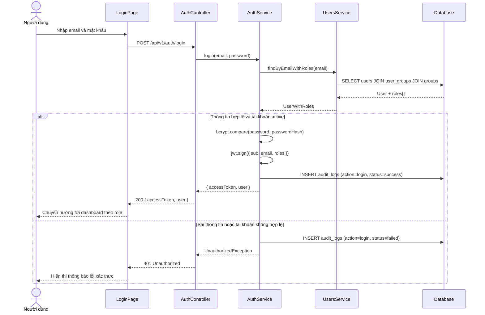
```mermaid
sequenceDiagram
    actor User as Người dùng
    participant Client as LoginPage
    participant API as AuthController
    participant Auth as AuthService
    participant UserSvc as UsersService
    participant DB as Database

    User->>Client: Nhập email và mật khẩu
    Client->>API: POST /api/v1/auth/login
    API->>Auth: login(email, password)
    Auth->>UserSvc: findByEmailWithRoles(email)
    UserSvc->>DB: SELECT users JOIN user_groups JOIN groups
    DB-->>UserSvc: User + roles[]
    UserSvc-->>Auth: UserWithRoles

    alt Thông tin hợp lệ và tài khoản active
        Auth->>Auth: bcrypt.compare(password, passwordHash)
        Auth->>Auth: jwt.sign({ sub, email, roles })
        Auth->>DB: INSERT audit_logs (action=login, status=success)
        Auth-->>API: { accessToken, user }
        API-->>Client: 200 { accessToken, user }
        Client-->>User: Chuyển hướng tới dashboard theo role
    else Sai thông tin hoặc tài khoản không hợp lệ
        Auth->>DB: INSERT audit_logs (action=login, status=failed)
        Auth-->>API: UnauthorizedException
        API-->>Client: 401 Unauthorized
        Client-->>User: Hiển thị thông báo lỗi xác thực
    end
```

#### Biểu đồ lớp phân tích

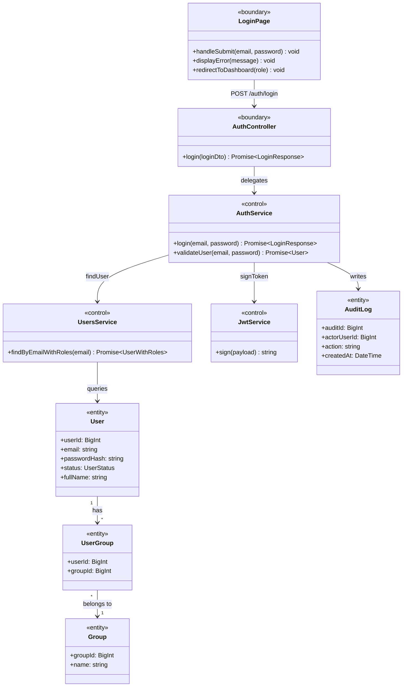
```mermaid
classDiagram
    class LoginPage {
        <<boundary>>
        +handleSubmit(email, password) void
        +displayError(message) void
        +redirectToDashboard(role) void
    }
    class AuthController {
        <<boundary>>
        +login(loginDto) Promise~LoginResponse~
    }
    class AuthService {
        <<control>>
        +login(email, password) Promise~LoginResponse~
        +validateUser(email, password) Promise~User~
    }
    class UsersService {
        <<control>>
        +findByEmailWithRoles(email) Promise~UserWithRoles~
    }
    class JwtService {
        <<control>>
        +sign(payload) string
    }
    class User {
        <<entity>>
        +userId: BigInt
        +email: string
        +passwordHash: string
        +status: UserStatus
        +fullName: string
    }
    class UserGroup {
        <<entity>>
        +userId: BigInt
        +groupId: BigInt
    }
    class Group {
        <<entity>>
        +groupId: BigInt
        +name: string
    }
    class AuditLog {
        <<entity>>
        +auditId: BigInt
        +actorUserId: BigInt
        +action: string
        +createdAt: DateTime
    }

    LoginPage --> AuthController : POST /auth/login
    AuthController --> AuthService : delegates
    AuthService --> UsersService : findUser
    AuthService --> JwtService : signToken
    UsersService --> User : queries
    User "1" --> "*" UserGroup : has
    UserGroup "*" --> "1" Group : belongs to
    AuthService --> AuditLog : writes
```

---

### Thiết kế kiến trúc cho UC02 — Đăng xuất

#### Biểu đồ tuần tự - Sequence Diagram

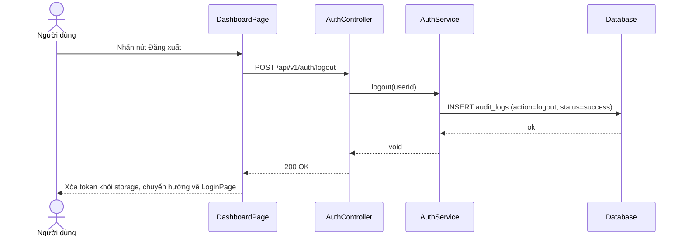
```mermaid
sequenceDiagram
    actor User as Người dùng
    participant Client as DashboardPage
    participant API as AuthController
    participant Auth as AuthService
    participant DB as Database

    User->>Client: Nhấn nút Đăng xuất
    Client->>API: POST /api/v1/auth/logout
    API->>Auth: logout(userId)
    Auth->>DB: INSERT audit_logs (action=logout, status=success)
    DB-->>Auth: ok
    Auth-->>API: void
    API-->>Client: 200 OK
    Client-->>User: Xóa token khỏi storage, chuyển hướng về LoginPage
```

#### Biểu đồ lớp phân tích

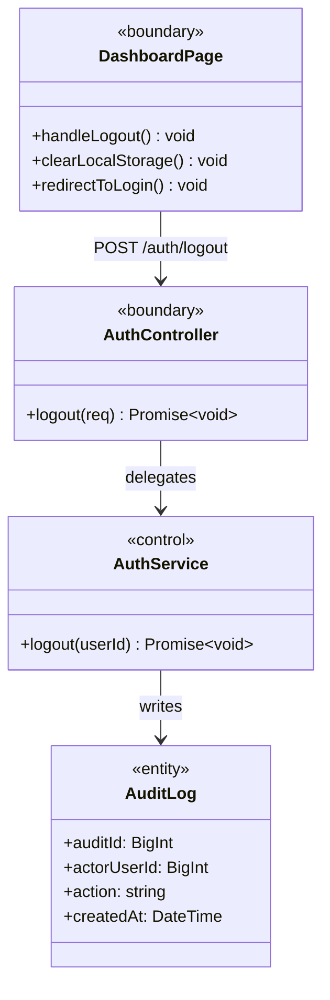
```mermaid
classDiagram
    class DashboardPage {
        <<boundary>>
        +handleLogout() void
        +clearLocalStorage() void
        +redirectToLogin() void
    }
    class AuthController {
        <<boundary>>
        +logout(req) Promise~void~
    }
    class AuthService {
        <<control>>
        +logout(userId) Promise~void~
    }
    class AuditLog {
        <<entity>>
        +auditId: BigInt
        +actorUserId: BigInt
        +action: string
        +createdAt: DateTime
    }

    DashboardPage --> AuthController : POST /auth/logout
    AuthController --> AuthService : delegates
    AuthService --> AuditLog : writes
```

---

### Thiết kế kiến trúc cho UC03 — Quên/Đặt lại mật khẩu

#### Biểu đồ tuần tự - Sequence Diagram

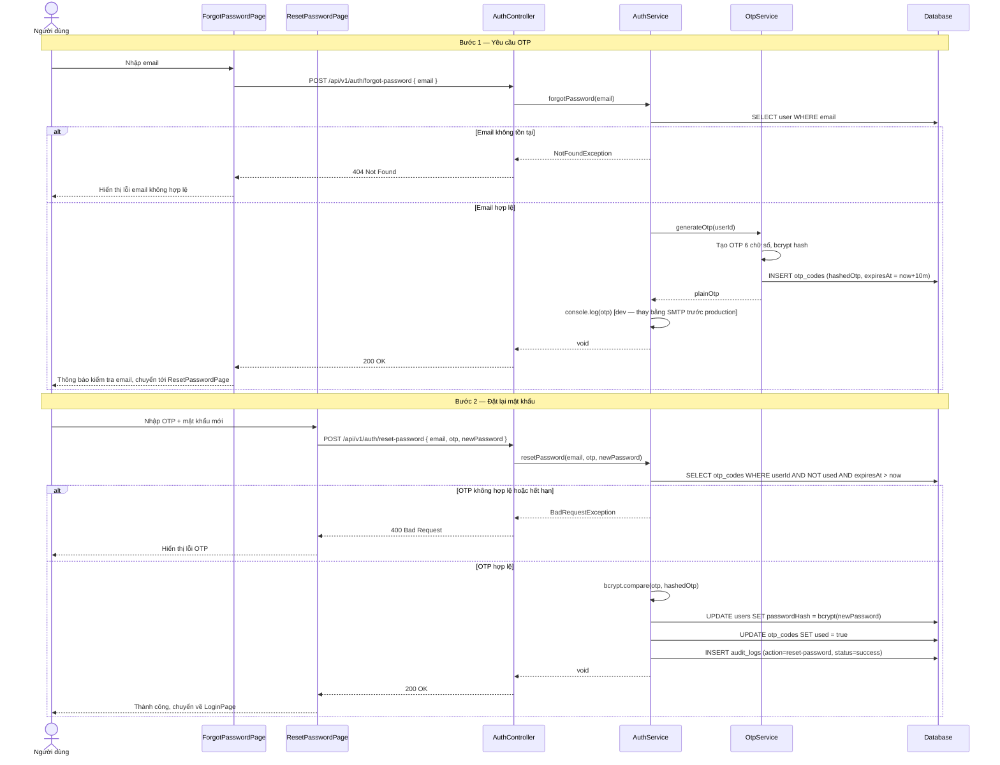
```mermaid
sequenceDiagram
    actor User as Người dùng
    participant FP as ForgotPasswordPage
    participant RP as ResetPasswordPage
    participant API as AuthController
    participant Auth as AuthService
    participant Otp as OtpService
    participant DB as Database

    Note over User, DB: Bước 1 — Yêu cầu OTP
    User->>FP: Nhập email
    FP->>API: POST /api/v1/auth/forgot-password { email }
    API->>Auth: forgotPassword(email)
    Auth->>DB: SELECT user WHERE email
    alt Email không tồn tại
        Auth-->>API: NotFoundException
        API-->>FP: 404 Not Found
        FP-->>User: Hiển thị lỗi email không hợp lệ
    else Email hợp lệ
        Auth->>Otp: generateOtp(userId)
        Otp->>Otp: Tạo OTP 6 chữ số, bcrypt hash
        Otp->>DB: INSERT otp_codes (hashedOtp, expiresAt = now+10m)
        Otp-->>Auth: plainOtp
        Auth->>Auth: console.log(otp) [dev — thay bằng SMTP trước production]
        Auth-->>API: void
        API-->>FP: 200 OK
        FP-->>User: Thông báo kiểm tra email, chuyển tới ResetPasswordPage
    end

    Note over User, DB: Bước 2 — Đặt lại mật khẩu
    User->>RP: Nhập OTP + mật khẩu mới
    RP->>API: POST /api/v1/auth/reset-password { email, otp, newPassword }
    API->>Auth: resetPassword(email, otp, newPassword)
    Auth->>DB: SELECT otp_codes WHERE userId AND NOT used AND expiresAt > now
    alt OTP không hợp lệ hoặc hết hạn
        Auth-->>API: BadRequestException
        API-->>RP: 400 Bad Request
        RP-->>User: Hiển thị lỗi OTP
    else OTP hợp lệ
        Auth->>Auth: bcrypt.compare(otp, hashedOtp)
        Auth->>DB: UPDATE users SET passwordHash = bcrypt(newPassword)
        Auth->>DB: UPDATE otp_codes SET used = true
        Auth->>DB: INSERT audit_logs (action=reset-password, status=success)
        Auth-->>API: void
        API-->>RP: 200 OK
        RP-->>User: Thành công, chuyển về LoginPage
    end
```

#### Biểu đồ lớp phân tích

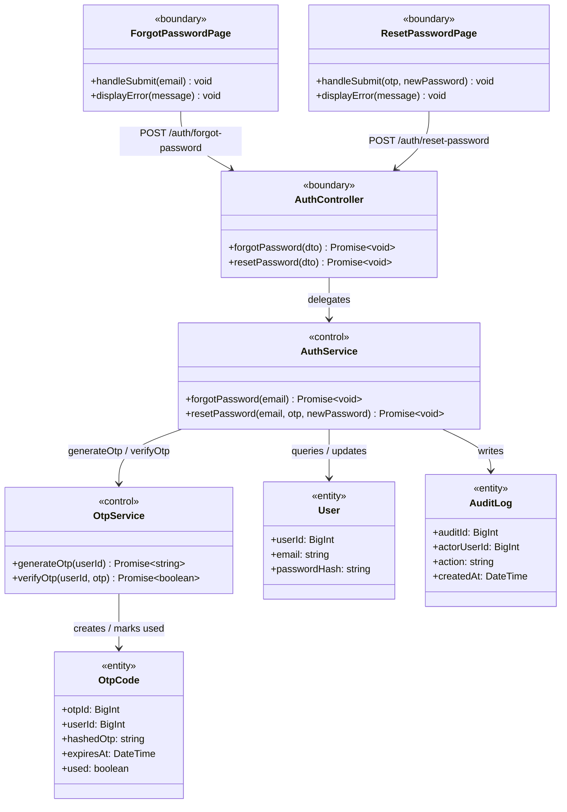
```mermaid
classDiagram
    class ForgotPasswordPage {
        <<boundary>>
        +handleSubmit(email) void
        +displayError(message) void
    }
    class ResetPasswordPage {
        <<boundary>>
        +handleSubmit(otp, newPassword) void
        +displayError(message) void
    }
    class AuthController {
        <<boundary>>
        +forgotPassword(dto) Promise~void~
        +resetPassword(dto) Promise~void~
    }
    class AuthService {
        <<control>>
        +forgotPassword(email) Promise~void~
        +resetPassword(email, otp, newPassword) Promise~void~
    }
    class OtpService {
        <<control>>
        +generateOtp(userId) Promise~string~
        +verifyOtp(userId, otp) Promise~boolean~
    }
    class User {
        <<entity>>
        +userId: BigInt
        +email: string
        +passwordHash: string
    }
    class OtpCode {
        <<entity>>
        +otpId: BigInt
        +userId: BigInt
        +hashedOtp: string
        +expiresAt: DateTime
        +used: boolean
    }
    class AuditLog {
        <<entity>>
        +auditId: BigInt
        +actorUserId: BigInt
        +action: string
        +createdAt: DateTime
    }

    ForgotPasswordPage --> AuthController : POST /auth/forgot-password
    ResetPasswordPage --> AuthController : POST /auth/reset-password
    AuthController --> AuthService : delegates
    AuthService --> OtpService : generateOtp / verifyOtp
    AuthService --> User : queries / updates
    OtpService --> OtpCode : creates / marks used
    AuthService --> AuditLog : writes
```

---

### Thiết kế kiến trúc cho UC04 — Quản lý hồ sơ cá nhân

> Ghi chú: Codebase không có `UsersController` hay `FileService`. Profile được phục vụ qua `AuthController` (thông tin base) + `MembersController` / `StaffController` (thông tin role-specific). Avatar upload chưa được implement.

#### Biểu đồ tuần tự - Sequence Diagram

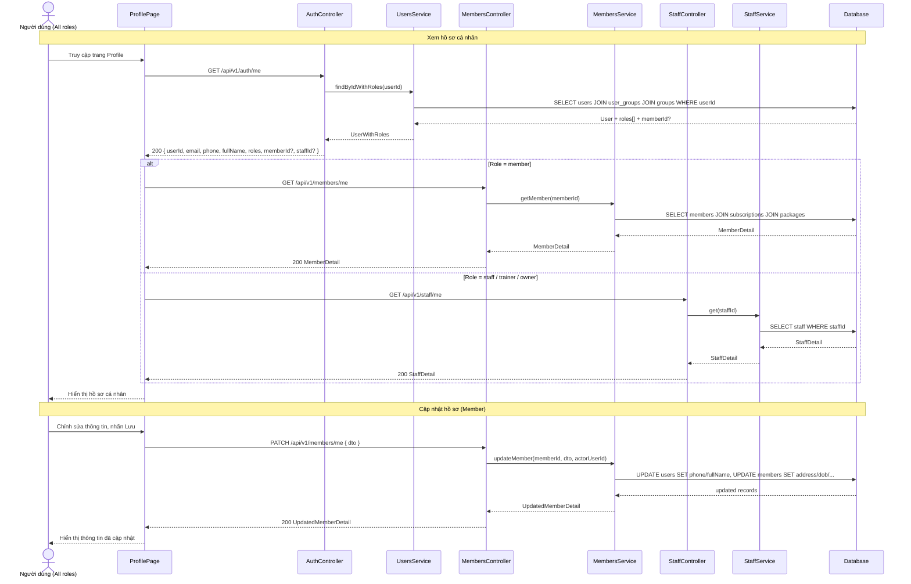
```mermaid
sequenceDiagram
    actor User as Người dùng (All roles)
    participant Client as ProfilePage
    participant AuthAPI as AuthController
    participant UserSvc as UsersService
    participant MembersAPI as MembersController
    participant MemberSvc as MembersService
    participant StaffAPI as StaffController
    participant StaffSvc as StaffService
    participant DB as Database

    Note over User, DB: Xem hồ sơ cá nhân
    User->>Client: Truy cập trang Profile
    Client->>AuthAPI: GET /api/v1/auth/me
    AuthAPI->>UserSvc: findByIdWithRoles(userId)
    UserSvc->>DB: SELECT users JOIN user_groups JOIN groups WHERE userId
    DB-->>UserSvc: User + roles[] + memberId?
    UserSvc-->>AuthAPI: UserWithRoles
    AuthAPI-->>Client: 200 { userId, email, phone, fullName, roles, memberId?, staffId? }

    alt Role = member
        Client->>MembersAPI: GET /api/v1/members/me
        MembersAPI->>MemberSvc: getMember(memberId)
        MemberSvc->>DB: SELECT members JOIN subscriptions JOIN packages
        DB-->>MemberSvc: MemberDetail
        MemberSvc-->>MembersAPI: MemberDetail
        MembersAPI-->>Client: 200 MemberDetail
    else Role = staff / trainer / owner
        Client->>StaffAPI: GET /api/v1/staff/me
        StaffAPI->>StaffSvc: get(staffId)
        StaffSvc->>DB: SELECT staff WHERE staffId
        DB-->>StaffSvc: StaffDetail
        StaffSvc-->>StaffAPI: StaffDetail
        StaffAPI-->>Client: 200 StaffDetail
    end
    Client-->>User: Hiển thị hồ sơ cá nhân

    Note over User, DB: Cập nhật hồ sơ (Member)
    User->>Client: Chỉnh sửa thông tin, nhấn Lưu
    Client->>MembersAPI: PATCH /api/v1/members/me { dto }
    MembersAPI->>MemberSvc: updateMember(memberId, dto, actorUserId)
    MemberSvc->>DB: UPDATE users SET phone/fullName, UPDATE members SET address/dob/...
    DB-->>MemberSvc: updated records
    MemberSvc-->>MembersAPI: UpdatedMemberDetail
    MembersAPI-->>Client: 200 UpdatedMemberDetail
    Client-->>User: Hiển thị thông tin đã cập nhật
```

#### Biểu đồ lớp phân tích

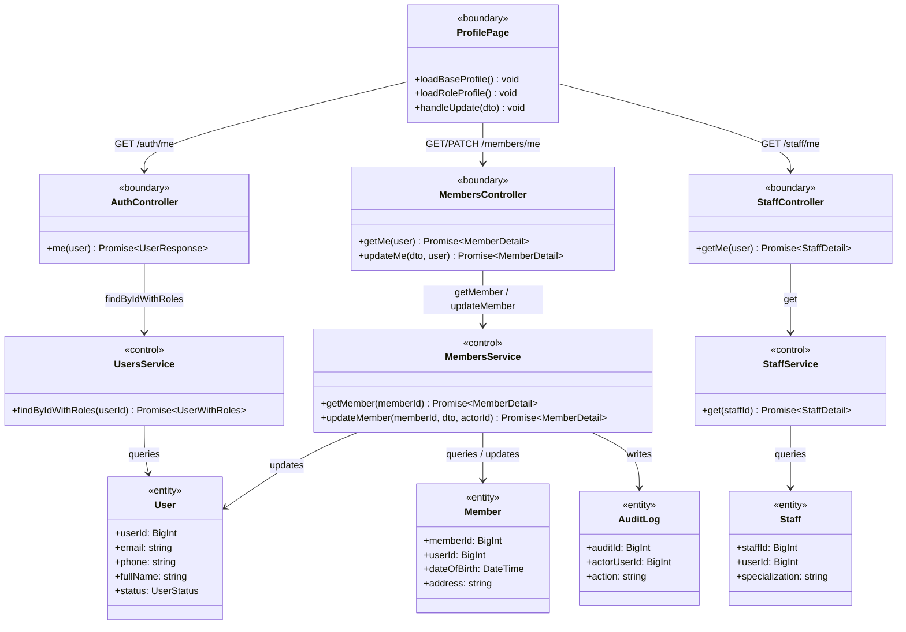
```mermaid
classDiagram
    class ProfilePage {
        <<boundary>>
        +loadBaseProfile() void
        +loadRoleProfile() void
        +handleUpdate(dto) void
    }
    class AuthController {
        <<boundary>>
        +me(user) Promise~UserResponse~
    }
    class MembersController {
        <<boundary>>
        +getMe(user) Promise~MemberDetail~
        +updateMe(dto, user) Promise~MemberDetail~
    }
    class StaffController {
        <<boundary>>
        +getMe(user) Promise~StaffDetail~
    }
    class UsersService {
        <<control>>
        +findByIdWithRoles(userId) Promise~UserWithRoles~
    }
    class MembersService {
        <<control>>
        +getMember(memberId) Promise~MemberDetail~
        +updateMember(memberId, dto, actorId) Promise~MemberDetail~
    }
    class StaffService {
        <<control>>
        +get(staffId) Promise~StaffDetail~
    }
    class User {
        <<entity>>
        +userId: BigInt
        +email: string
        +phone: string
        +fullName: string
        +status: UserStatus
    }
    class Member {
        <<entity>>
        +memberId: BigInt
        +userId: BigInt
        +dateOfBirth: DateTime
        +address: string
    }
    class Staff {
        <<entity>>
        +staffId: BigInt
        +userId: BigInt
        +specialization: string
    }
    class AuditLog {
        <<entity>>
        +auditId: BigInt
        +actorUserId: BigInt
        +action: string
    }

    ProfilePage --> AuthController : GET /auth/me
    ProfilePage --> MembersController : GET/PATCH /members/me
    ProfilePage --> StaffController : GET /staff/me
    AuthController --> UsersService : findByIdWithRoles
    MembersController --> MembersService : getMember / updateMember
    StaffController --> StaffService : get
    UsersService --> User : queries
    MembersService --> Member : queries / updates
    MembersService --> User : updates
    MembersService --> AuditLog : writes
    StaffService --> Staff : queries
```

---

### Thiết kế kiến trúc cho UC05A — Staff đăng ký hội viên tại quầy

> Ghi chú: Không có OtpService trong luồng này — staff tạo tài khoản trực tiếp, email được đánh dấu verified ngay (`emailVerifiedAt = now`). Toàn bộ User + Member + UserGroup + Subscription + Payment được tạo trong một `$transaction`.

#### Biểu đồ tuần tự - Sequence Diagram

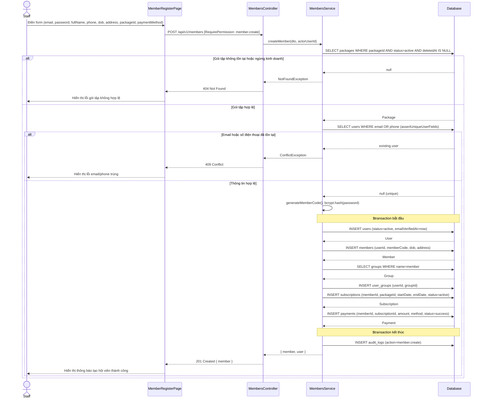
```mermaid
sequenceDiagram
    actor Staff as Staff
    participant Client as MemberRegisterPage
    participant API as MembersController
    participant Svc as MembersService
    participant DB as Database

    Staff->>Client: Điền form (email, password, fullName, phone, dob, address, packageId, paymentMethod)
    Client->>API: POST /api/v1/members [RequirePermission: member.create]
    API->>Svc: createMember(dto, actorUserId)

    Svc->>DB: SELECT packages WHERE packageId AND status=active AND deletedAt IS NULL
    alt Gói tập không tồn tại hoặc ngừng kinh doanh
        DB-->>Svc: null
        Svc-->>API: NotFoundException
        API-->>Client: 404 Not Found
        Client-->>Staff: Hiển thị lỗi gói tập không hợp lệ
    else Gói tập hợp lệ
        DB-->>Svc: Package
        Svc->>DB: SELECT users WHERE email OR phone (assertUniqueUserFields)
        alt Email hoặc số điện thoại đã tồn tại
            DB-->>Svc: existing user
            Svc-->>API: ConflictException
            API-->>Client: 409 Conflict
            Client-->>Staff: Hiển thị lỗi email/phone trùng
        else Thông tin hợp lệ
            DB-->>Svc: null (unique)
            Svc->>Svc: generateMemberCode(), bcrypt.hash(password)
            Note over Svc, DB: $transaction bắt đầu
            Svc->>DB: INSERT users (status=active, emailVerifiedAt=now)
            DB-->>Svc: User
            Svc->>DB: INSERT members (userId, memberCode, dob, address)
            DB-->>Svc: Member
            Svc->>DB: SELECT groups WHERE name=member
            DB-->>Svc: Group
            Svc->>DB: INSERT user_groups (userId, groupId)
            Svc->>DB: INSERT subscriptions (memberId, packageId, startDate, endDate, status=active)
            DB-->>Svc: Subscription
            Svc->>DB: INSERT payments (memberId, subscriptionId, amount, method, status=success)
            DB-->>Svc: Payment
            Note over Svc, DB: $transaction kết thúc
            Svc->>DB: INSERT audit_logs (action=member.create)
            Svc-->>API: { member, user }
            API-->>Client: 201 Created { member }
            Client-->>Staff: Hiển thị thông báo tạo hội viên thành công
        end
    end
```

#### Biểu đồ lớp phân tích

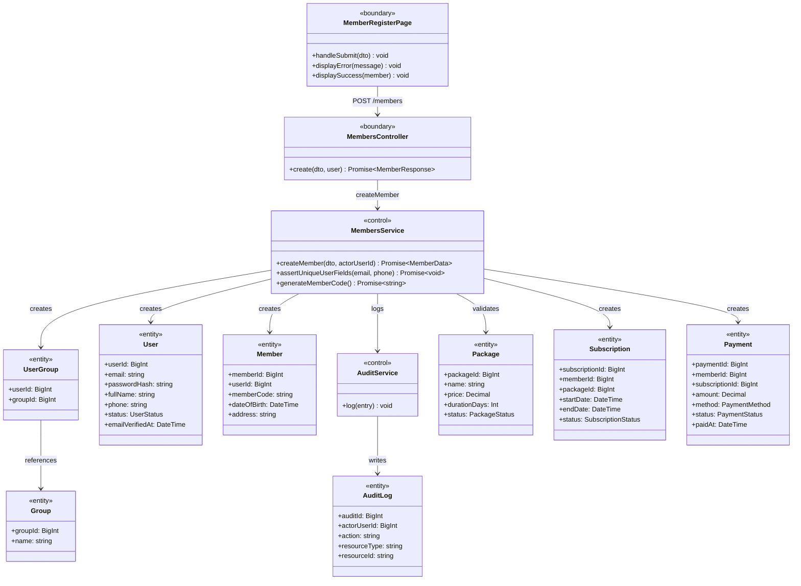
```mermaid
classDiagram
    class MemberRegisterPage {
        <<boundary>>
        +handleSubmit(dto) void
        +displayError(message) void
        +displaySuccess(member) void
    }
    class MembersController {
        <<boundary>>
        +create(dto, user) Promise~MemberResponse~
    }
    class MembersService {
        <<control>>
        +createMember(dto, actorUserId) Promise~MemberData~
        +assertUniqueUserFields(email, phone) Promise~void~
        +generateMemberCode() Promise~string~
    }
    class AuditService {
        <<control>>
        +log(entry) void
    }
    class User {
        <<entity>>
        +userId: BigInt
        +email: string
        +passwordHash: string
        +fullName: string
        +phone: string
        +status: UserStatus
        +emailVerifiedAt: DateTime
    }
    class Member {
        <<entity>>
        +memberId: BigInt
        +userId: BigInt
        +memberCode: string
        +dateOfBirth: DateTime
        +address: string
    }
    class UserGroup {
        <<entity>>
        +userId: BigInt
        +groupId: BigInt
    }
    class Group {
        <<entity>>
        +groupId: BigInt
        +name: string
    }
    class Package {
        <<entity>>
        +packageId: BigInt
        +name: string
        +price: Decimal
        +durationDays: Int
        +status: PackageStatus
    }
    class Subscription {
        <<entity>>
        +subscriptionId: BigInt
        +memberId: BigInt
        +packageId: BigInt
        +startDate: DateTime
        +endDate: DateTime
        +status: SubscriptionStatus
    }
    class Payment {
        <<entity>>
        +paymentId: BigInt
        +memberId: BigInt
        +subscriptionId: BigInt
        +amount: Decimal
        +method: PaymentMethod
        +status: PaymentStatus
        +paidAt: DateTime
    }
    class AuditLog {
        <<entity>>
        +auditId: BigInt
        +actorUserId: BigInt
        +action: string
        +resourceType: string
        +resourceId: string
    }

    MemberRegisterPage --> MembersController : POST /members
    MembersController --> MembersService : createMember
    MembersService --> Package : validates
    MembersService --> User : creates
    MembersService --> Member : creates
    MembersService --> UserGroup : creates
    UserGroup --> Group : references
    MembersService --> Subscription : creates
    MembersService --> Payment : creates
    MembersService --> AuditService : logs
    AuditService --> AuditLog : writes
```

---

### Thiết kế kiến trúc cho UC05B — Member tự đăng ký online

> Ghi chú: OTP xác thực email được lưu trong `OtpStoreService` (in-memory store), không phải bảng `otp_codes` trong DB. User tạo ra với `status = pending_verification`; Subscription (nếu có) với `status = pending` — chưa active cho đến khi email được xác thực. Không tạo Payment trong bước này. SubscriptionsService không tham gia — MembersService tự INSERT subscription trong transaction.

#### Biểu đồ tuần tự - Sequence Diagram

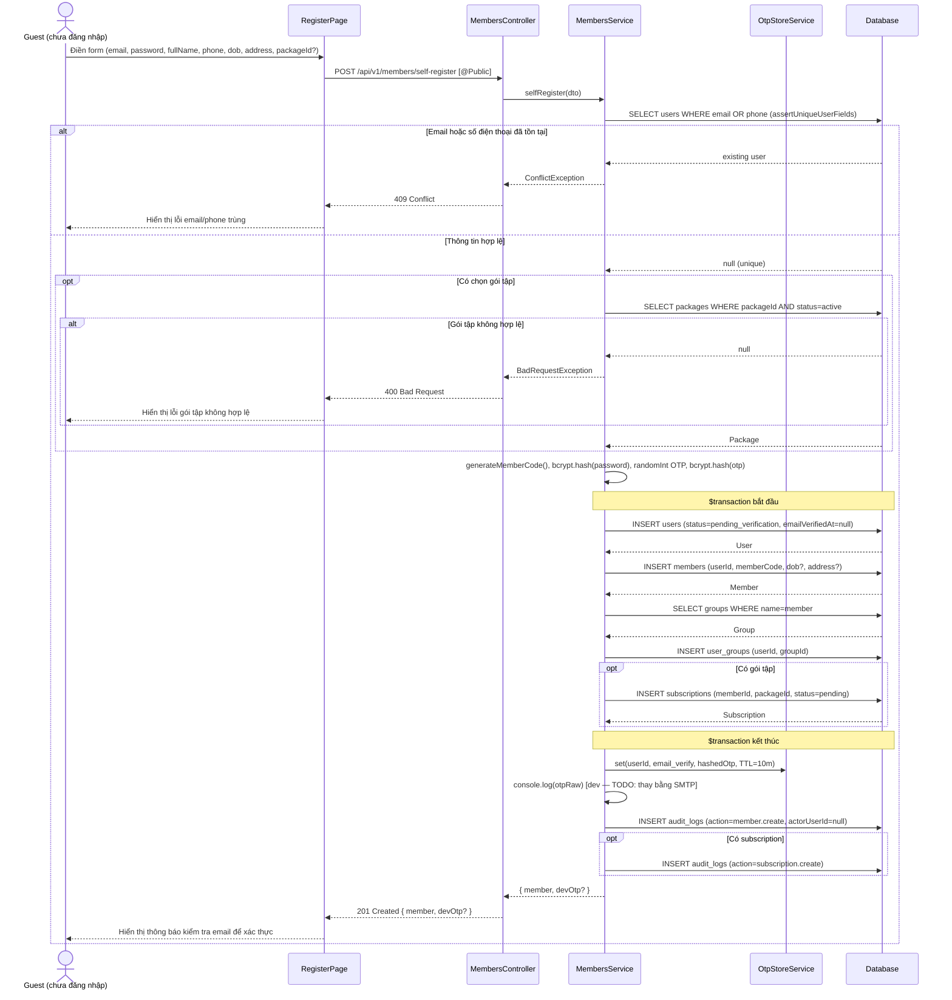
```mermaid
sequenceDiagram
    actor Guest as Guest (chưa đăng nhập)
    participant Client as RegisterPage
    participant API as MembersController
    participant Svc as MembersService
    participant OtpStore as OtpStoreService
    participant DB as Database

    Guest->>Client: Điền form (email, password, fullName, phone, dob, address, packageId?)
    Client->>API: POST /api/v1/members/self-register [@Public]
    API->>Svc: selfRegister(dto)

    Svc->>DB: SELECT users WHERE email OR phone (assertUniqueUserFields)
    alt Email hoặc số điện thoại đã tồn tại
        DB-->>Svc: existing user
        Svc-->>API: ConflictException
        API-->>Client: 409 Conflict
        Client-->>Guest: Hiển thị lỗi email/phone trùng
    else Thông tin hợp lệ
        DB-->>Svc: null (unique)
        opt Có chọn gói tập
            Svc->>DB: SELECT packages WHERE packageId AND status=active
            alt Gói tập không hợp lệ
                DB-->>Svc: null
                Svc-->>API: BadRequestException
                API-->>Client: 400 Bad Request
                Client-->>Guest: Hiển thị lỗi gói tập không hợp lệ
            end
            DB-->>Svc: Package
        end
        Svc->>Svc: generateMemberCode(), bcrypt.hash(password), randomInt OTP, bcrypt.hash(otp)
        Note over Svc, DB: $transaction bắt đầu
        Svc->>DB: INSERT users (status=pending_verification, emailVerifiedAt=null)
        DB-->>Svc: User
        Svc->>DB: INSERT members (userId, memberCode, dob?, address?)
        DB-->>Svc: Member
        Svc->>DB: SELECT groups WHERE name=member
        DB-->>Svc: Group
        Svc->>DB: INSERT user_groups (userId, groupId)
        opt Có gói tập
            Svc->>DB: INSERT subscriptions (memberId, packageId, status=pending)
            DB-->>Svc: Subscription
        end
        Note over Svc, DB: $transaction kết thúc
        Svc->>OtpStore: set(userId, email_verify, hashedOtp, TTL=10m)
        Svc->>Svc: console.log(otpRaw) [dev — TODO: thay bằng SMTP]
        Svc->>DB: INSERT audit_logs (action=member.create, actorUserId=null)
        opt Có subscription
            Svc->>DB: INSERT audit_logs (action=subscription.create)
        end
        Svc-->>API: { member, devOtp? }
        API-->>Client: 201 Created { member, devOtp? }
        Client-->>Guest: Hiển thị thông báo kiểm tra email để xác thực
    end
```

#### Biểu đồ lớp phân tích

```mermaid
classDiagram
    class RegisterPage {
        <<boundary>>
        +handleSubmit(dto) void
        +displayError(message) void
        +displayVerifyPrompt() void
    }
    class MembersController {
        <<boundary>>
        +selfRegister(dto) Promise~RegisterResponse~
    }
    class MembersService {
        <<control>>
        +selfRegister(dto) Promise~RegisterData~
        +assertUniqueUserFields(email, phone) Promise~void~
        +generateMemberCode() Promise~string~
    }
    class OtpStoreService {
        <<control>>
        +set(userId, purpose, hashedOtp, ttlMs) void
    }
    class AuditService {
        <<control>>
        +log(entry) void
    }
    class User {
        <<entity>>
        +userId: BigInt
        +email: string
        +passwordHash: string
        +status: UserStatus
        +emailVerifiedAt: DateTime
    }
    class Member {
        <<entity>>
        +memberId: BigInt
        +userId: BigInt
        +memberCode: string
        +dateOfBirth: DateTime
        +address: string
    }
    class UserGroup {
        <<entity>>
        +userId: BigInt
        +groupId: BigInt
    }
    class Group {
        <<entity>>
        +groupId: BigInt
        +name: string
    }
    class Package {
        <<entity>>
        +packageId: BigInt
        +name: string
        +price: Decimal
        +durationDays: Int
        +status: PackageStatus
    }
    class Subscription {
        <<entity>>
        +subscriptionId: BigInt
        +memberId: BigInt
        +packageId: BigInt
        +status: SubscriptionStatus
    }
    class AuditLog {
        <<entity>>
        +auditId: BigInt
        +actorUserId: BigInt
        +action: string
        +resourceType: string
    }

    RegisterPage --> MembersController : POST /members/self-register
    MembersController --> MembersService : selfRegister
    MembersService --> Package : validates (optional)
    MembersService --> User : creates (pending_verification)
    MembersService --> Member : creates
    MembersService --> UserGroup : creates
    UserGroup --> Group : references
    MembersService --> Subscription : creates (pending, optional)
    MembersService --> OtpStoreService : stores email verify OTP
    MembersService --> AuditService : logs
    AuditService --> AuditLog : writes
```

---

### Thiết kế kiến trúc cho UC06 — Đăng ký gói tập mới (Tạo mới subscription)

> Ghi chú thực tế: `PackagesService` và `PaymentService` không tham gia luồng này. `SubscriptionsService` query bảng `packages` trực tiếp qua Prisma. Subscription được tạo với `status=pending` — không có Payment record ở bước này (payment chỉ tạo khi gia hạn).

#### Biểu đồ tuần tự - Sequence Diagram

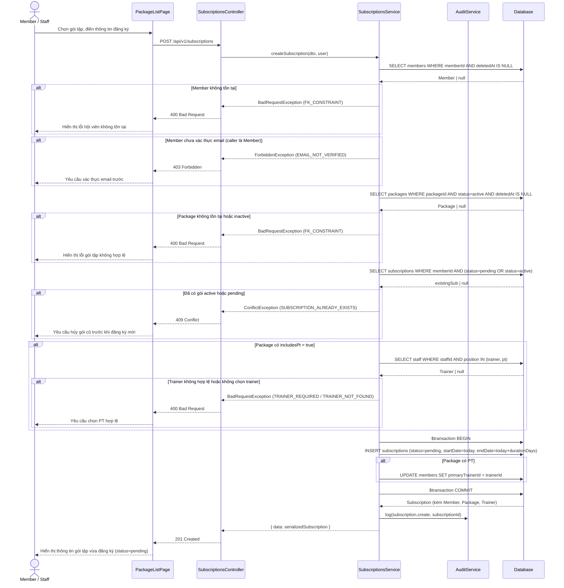
```mermaid
sequenceDiagram
    actor User as Member / Staff
    participant Client as PackageListPage
    participant API as SubscriptionsController
    participant Svc as SubscriptionsService
    participant Audit as AuditService
    participant DB as Database

    User->>Client: Chọn gói tập, điền thông tin đăng ký
    Client->>API: POST /api/v1/subscriptions
    API->>Svc: createSubscription(dto, user)

    Svc->>DB: SELECT members WHERE memberId AND deletedAt IS NULL
    DB-->>Svc: Member | null

    alt Member không tồn tại
        Svc-->>API: BadRequestException (FK_CONSTRAINT)
        API-->>Client: 400 Bad Request
        Client-->>User: Hiển thị lỗi hội viên không tồn tại
    end

    alt Member chưa xác thực email (caller là Member)
        Svc-->>API: ForbiddenException (EMAIL_NOT_VERIFIED)
        API-->>Client: 403 Forbidden
        Client-->>User: Yêu cầu xác thực email trước
    end

    Svc->>DB: SELECT packages WHERE packageId AND status=active AND deletedAt IS NULL
    DB-->>Svc: Package | null

    alt Package không tồn tại hoặc inactive
        Svc-->>API: BadRequestException (FK_CONSTRAINT)
        API-->>Client: 400 Bad Request
        Client-->>User: Hiển thị lỗi gói tập không hợp lệ
    end

    Svc->>DB: SELECT subscriptions WHERE memberId AND (status=pending OR status=active)
    DB-->>Svc: existingSub | null

    alt Đã có gói active hoặc pending
        Svc-->>API: ConflictException (SUBSCRIPTION_ALREADY_EXISTS)
        API-->>Client: 409 Conflict
        Client-->>User: Yêu cầu hủy gói cũ trước khi đăng ký mới
    end

    alt Package có includesPt = true
        Svc->>DB: SELECT staff WHERE staffId AND position IN (trainer, pt)
        DB-->>Svc: Trainer | null
        alt Trainer không hợp lệ hoặc không chọn trainer
            Svc-->>API: BadRequestException (TRAINER_REQUIRED / TRAINER_NOT_FOUND)
            API-->>Client: 400 Bad Request
            Client-->>User: Yêu cầu chọn PT hợp lệ
        end
    end

    Svc->>DB: $transaction BEGIN
    Svc->>DB: INSERT subscriptions (status=pending, startDate=today, endDate=today+durationDays)
    alt Package có PT
        Svc->>DB: UPDATE members SET primaryTrainerId = trainerId
    end
    Svc->>DB: $transaction COMMIT
    DB-->>Svc: Subscription (kèm Member, Package, Trainer)

    Svc->>Audit: log(subscription.create, subscriptionId)
    Svc-->>API: { data: serializedSubscription }
    API-->>Client: 201 Created
    Client-->>User: Hiển thị thông tin gói tập vừa đăng ký (status=pending)
```

#### Biểu đồ lớp phân tích

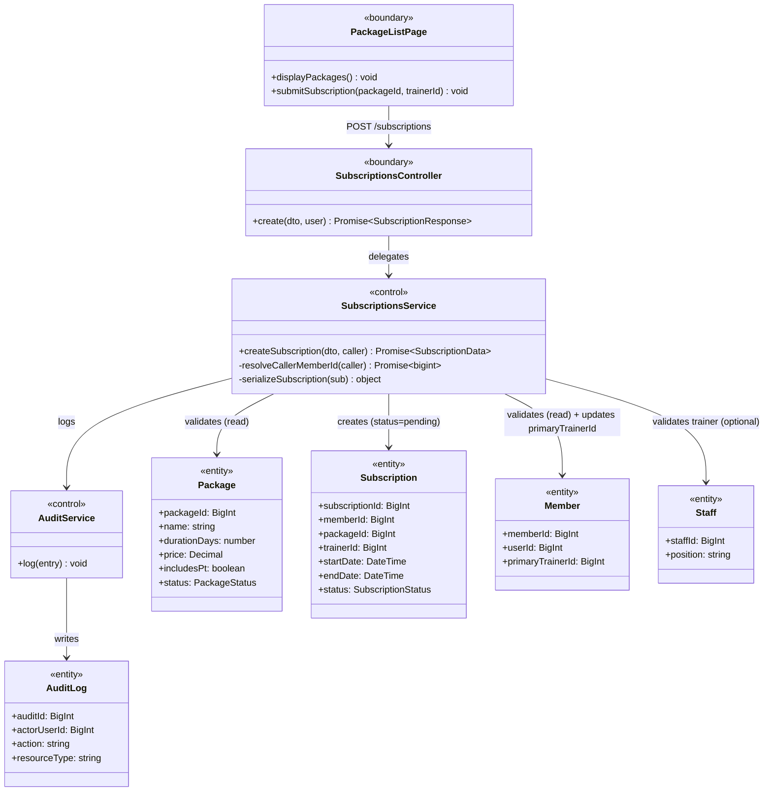
```mermaid
classDiagram
    class PackageListPage {
        <<boundary>>
        +displayPackages() void
        +submitSubscription(packageId, trainerId) void
    }
    class SubscriptionsController {
        <<boundary>>
        +create(dto, user) Promise~SubscriptionResponse~
    }
    class SubscriptionsService {
        <<control>>
        +createSubscription(dto, caller) Promise~SubscriptionData~
        -resolveCallerMemberId(caller) Promise~bigint~
        -serializeSubscription(sub) object
    }
    class AuditService {
        <<control>>
        +log(entry) void
    }
    class Package {
        <<entity>>
        +packageId: BigInt
        +name: string
        +durationDays: number
        +price: Decimal
        +includesPt: boolean
        +status: PackageStatus
    }
    class Subscription {
        <<entity>>
        +subscriptionId: BigInt
        +memberId: BigInt
        +packageId: BigInt
        +trainerId: BigInt
        +startDate: DateTime
        +endDate: DateTime
        +status: SubscriptionStatus
    }
    class Member {
        <<entity>>
        +memberId: BigInt
        +userId: BigInt
        +primaryTrainerId: BigInt
    }
    class Staff {
        <<entity>>
        +staffId: BigInt
        +position: string
    }
    class AuditLog {
        <<entity>>
        +auditId: BigInt
        +actorUserId: BigInt
        +action: string
        +resourceType: string
    }

    PackageListPage --> SubscriptionsController : POST /subscriptions
    SubscriptionsController --> SubscriptionsService : delegates
    SubscriptionsService --> Package : validates (read)
    SubscriptionsService --> Member : validates (read) + updates primaryTrainerId
    SubscriptionsService --> Staff : validates trainer (optional)
    SubscriptionsService --> Subscription : creates (status=pending)
    SubscriptionsService --> AuditService : logs
    AuditService --> AuditLog : writes
```

---

### Thiết kế kiến trúc cho UC07A — Gia hạn gói tập

> Ghi chú thực tế: `PaymentService` không tham gia. Payment record được tạo trực tiếp qua Prisma bên trong `$transaction` cùng với lệnh cập nhật `endDate`. Amount lấy từ `package.price` phía server, không tin dữ liệu từ client.

#### Biểu đồ tuần tự - Sequence Diagram

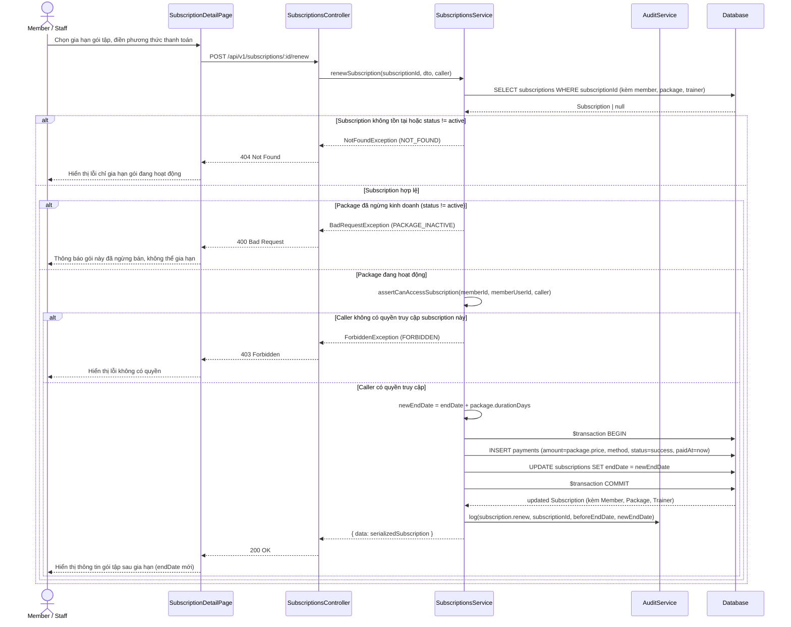
```mermaid
sequenceDiagram
    actor User as Member / Staff
    participant Client as SubscriptionDetailPage
    participant API as SubscriptionsController
    participant Svc as SubscriptionsService
    participant Audit as AuditService
    participant DB as Database

    User->>Client: Chọn gia hạn gói tập, điền phương thức thanh toán
    Client->>API: POST /api/v1/subscriptions/:id/renew
    API->>Svc: renewSubscription(subscriptionId, dto, caller)

    Svc->>DB: SELECT subscriptions WHERE subscriptionId (kèm member, package, trainer)
    DB-->>Svc: Subscription | null

    alt Subscription không tồn tại hoặc status != active
        Svc-->>API: NotFoundException (NOT_FOUND)
        API-->>Client: 404 Not Found
        Client-->>User: Hiển thị lỗi chỉ gia hạn gói đang hoạt động
    else Subscription hợp lệ
        alt Package đã ngừng kinh doanh (status != active)
            Svc-->>API: BadRequestException (PACKAGE_INACTIVE)
            API-->>Client: 400 Bad Request
            Client-->>User: Thông báo gói này đã ngừng bán, không thể gia hạn
        else Package đang hoạt động
            Svc->>Svc: assertCanAccessSubscription(memberId, memberUserId, caller)

            alt Caller không có quyền truy cập subscription này
                Svc-->>API: ForbiddenException (FORBIDDEN)
                API-->>Client: 403 Forbidden
                Client-->>User: Hiển thị lỗi không có quyền
            else Caller có quyền truy cập
                Svc->>Svc: newEndDate = endDate + package.durationDays

                Svc->>DB: $transaction BEGIN
                Svc->>DB: INSERT payments (amount=package.price, method, status=success, paidAt=now)
                Svc->>DB: UPDATE subscriptions SET endDate = newEndDate
                Svc->>DB: $transaction COMMIT
                DB-->>Svc: updated Subscription (kèm Member, Package, Trainer)

                Svc->>Audit: log(subscription.renew, subscriptionId, beforeEndDate, newEndDate)
                Svc-->>API: { data: serializedSubscription }
                API-->>Client: 200 OK
                Client-->>User: Hiển thị thông tin gói tập sau gia hạn (endDate mới)
            end
        end
    end
```

#### Biểu đồ lớp phân tích

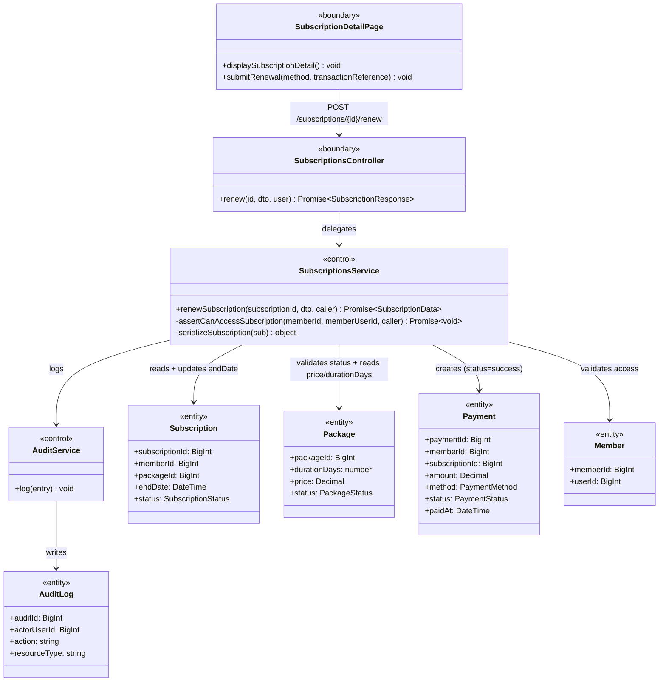
```mermaid
classDiagram
    class SubscriptionDetailPage {
        <<boundary>>
        +displaySubscriptionDetail() void
        +submitRenewal(method, transactionReference) void
    }
    class SubscriptionsController {
        <<boundary>>
        +renew(id, dto, user) Promise~SubscriptionResponse~
    }
    class SubscriptionsService {
        <<control>>
        +renewSubscription(subscriptionId, dto, caller) Promise~SubscriptionData~
        -assertCanAccessSubscription(memberId, memberUserId, caller) Promise~void~
        -serializeSubscription(sub) object
    }
    class AuditService {
        <<control>>
        +log(entry) void
    }
    class Subscription {
        <<entity>>
        +subscriptionId: BigInt
        +memberId: BigInt
        +packageId: BigInt
        +endDate: DateTime
        +status: SubscriptionStatus
    }
    class Package {
        <<entity>>
        +packageId: BigInt
        +durationDays: number
        +price: Decimal
        +status: PackageStatus
    }
    class Payment {
        <<entity>>
        +paymentId: BigInt
        +memberId: BigInt
        +subscriptionId: BigInt
        +amount: Decimal
        +method: PaymentMethod
        +status: PaymentStatus
        +paidAt: DateTime
    }
    class Member {
        <<entity>>
        +memberId: BigInt
        +userId: BigInt
    }
    class AuditLog {
        <<entity>>
        +auditId: BigInt
        +actorUserId: BigInt
        +action: string
        +resourceType: string
    }

    SubscriptionDetailPage --> SubscriptionsController : POST /subscriptions/{id}/renew
    SubscriptionsController --> SubscriptionsService : delegates
    SubscriptionsService --> Subscription : reads + updates endDate
    SubscriptionsService --> Package : validates status + reads price/durationDays
    SubscriptionsService --> Member : validates access
    SubscriptionsService --> Payment : creates (status=success)
    SubscriptionsService --> AuditService : logs
    AuditService --> AuditLog : writes
```

---

### Thiết kế kiến trúc cho UC07B — Hủy gói tập

#### Biểu đồ tuần tự - Sequence Diagram

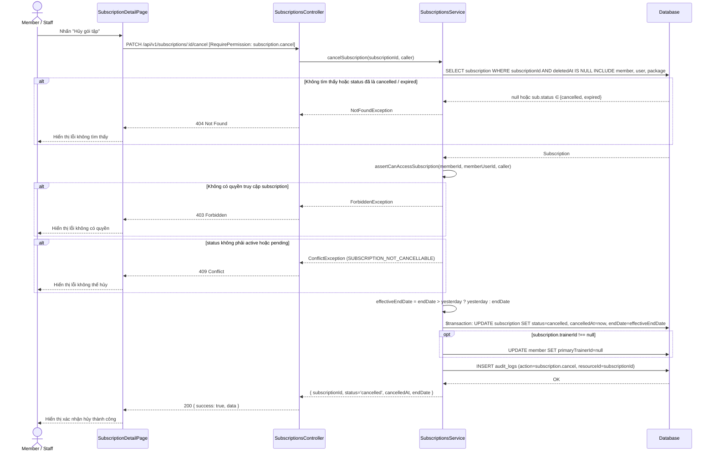
```mermaid
sequenceDiagram
    actor User as Member / Staff
    participant Client as SubscriptionDetailPage
    participant API as SubscriptionsController
    participant Svc as SubscriptionsService
    participant DB as Database

    User->>Client: Nhấn "Hủy gói tập"
    Client->>API: PATCH /api/v1/subscriptions/:id/cancel [RequirePermission: subscription.cancel]
    API->>Svc: cancelSubscription(subscriptionId, caller)
    Svc->>DB: SELECT subscription WHERE subscriptionId AND deletedAt IS NULL INCLUDE member, user, package

    alt Không tìm thấy hoặc status đã là cancelled / expired
        DB-->>Svc: null hoặc sub.status ∈ {cancelled, expired}
        Svc-->>API: NotFoundException
        API-->>Client: 404 Not Found
        Client-->>User: Hiển thị lỗi không tìm thấy
    end

    DB-->>Svc: Subscription
    Svc->>Svc: assertCanAccessSubscription(memberId, memberUserId, caller)

    alt Không có quyền truy cập subscription
        Svc-->>API: ForbiddenException
        API-->>Client: 403 Forbidden
        Client-->>User: Hiển thị lỗi không có quyền
    end

    alt status không phải active hoặc pending
        Svc-->>API: ConflictException (SUBSCRIPTION_NOT_CANCELLABLE)
        API-->>Client: 409 Conflict
        Client-->>User: Hiển thị lỗi không thể hủy
    end

    Svc->>Svc: effectiveEndDate = endDate > yesterday ? yesterday : endDate
    Svc->>DB: $transaction: UPDATE subscription SET status=cancelled, cancelledAt=now, endDate=effectiveEndDate

    opt subscription.trainerId !== null
        Svc->>DB: UPDATE member SET primaryTrainerId=null
    end

    Svc->>DB: INSERT audit_logs (action=subscription.cancel, resourceId=subscriptionId)
    DB-->>Svc: OK
    Svc-->>API: { subscriptionId, status='cancelled', cancelledAt, endDate }
    API-->>Client: 200 { success: true, data }
    Client-->>User: Hiển thị xác nhận hủy thành công
```

#### Biểu đồ lớp phân tích

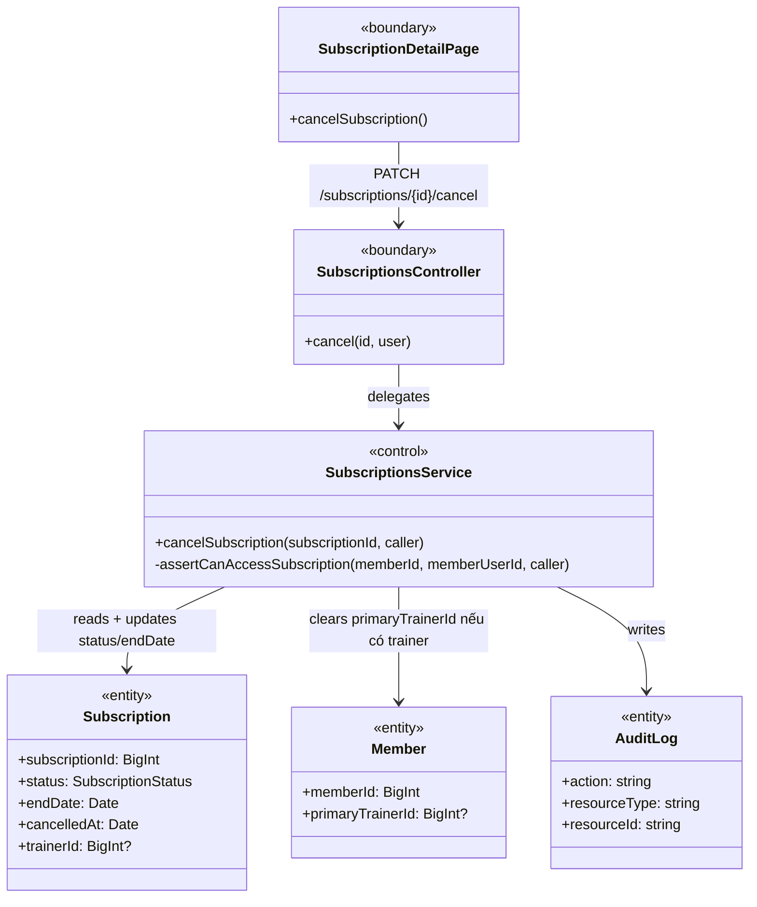
```mermaid
classDiagram
    class SubscriptionDetailPage {
        <<boundary>>
        +cancelSubscription()
    }
    class SubscriptionsController {
        <<boundary>>
        +cancel(id, user)
    }
    class SubscriptionsService {
        <<control>>
        +cancelSubscription(subscriptionId, caller)
        -assertCanAccessSubscription(memberId, memberUserId, caller)
    }
    class Subscription {
        <<entity>>
        +subscriptionId: BigInt
        +status: SubscriptionStatus
        +endDate: Date
        +cancelledAt: Date
        +trainerId: BigInt?
    }
    class Member {
        <<entity>>
        +memberId: BigInt
        +primaryTrainerId: BigInt?
    }
    class AuditLog {
        <<entity>>
        +action: string
        +resourceType: string
        +resourceId: string
    }
    SubscriptionDetailPage --> SubscriptionsController : PATCH /subscriptions/{id}/cancel
    SubscriptionsController --> SubscriptionsService : delegates
    SubscriptionsService --> Subscription : reads + updates status/endDate
    SubscriptionsService --> Member : clears primaryTrainerId nếu có trainer
    SubscriptionsService --> AuditLog : writes
```

---

### Thiết kế kiến trúc cho UC08 — Xem gói tập hiện tại và lịch sử

#### Biểu đồ tuần tự - Sequence Diagram

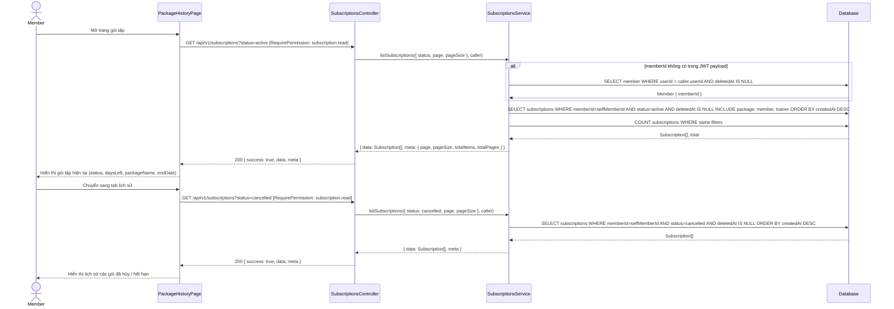
```mermaid
sequenceDiagram
    actor Member as Member
    participant Client as PackageHistoryPage
    participant API as SubscriptionsController
    participant Svc as SubscriptionsService
    participant DB as Database

    Member->>Client: Mở trang gói tập
    Client->>API: GET /api/v1/subscriptions?status=active [RequirePermission: subscription.read]
    API->>Svc: listSubscriptions({ status, page, pageSize }, caller)

    alt memberId không có trong JWT payload
        Svc->>DB: SELECT member WHERE userId = caller.userId AND deletedAt IS NULL
        DB-->>Svc: Member { memberId }
    end

    Svc->>DB: SELECT subscriptions WHERE memberId=selfMemberId AND status=active AND deletedAt IS NULL INCLUDE package, member, trainer ORDER BY createdAt DESC
    Svc->>DB: COUNT subscriptions WHERE same filters
    DB-->>Svc: Subscription[], total
    Svc-->>API: { data: Subscription[], meta: { page, pageSize, totalItems, totalPages } }
    API-->>Client: 200 { success: true, data, meta }
    Client-->>Member: Hiển thị gói tập hiện tại (status, daysLeft, packageName, endDate)

    Member->>Client: Chuyển sang tab lịch sử
    Client->>API: GET /api/v1/subscriptions?status=cancelled [RequirePermission: subscription.read]
    API->>Svc: listSubscriptions({ status: cancelled, page, pageSize }, caller)
    Svc->>DB: SELECT subscriptions WHERE memberId=selfMemberId AND status=cancelled AND deletedAt IS NULL ORDER BY createdAt DESC
    DB-->>Svc: Subscription[]
    Svc-->>API: { data: Subscription[], meta }
    API-->>Client: 200 { success: true, data, meta }
    Client-->>Member: Hiển thị lịch sử các gói đã hủy / hết hạn
```

#### Biểu đồ lớp phân tích

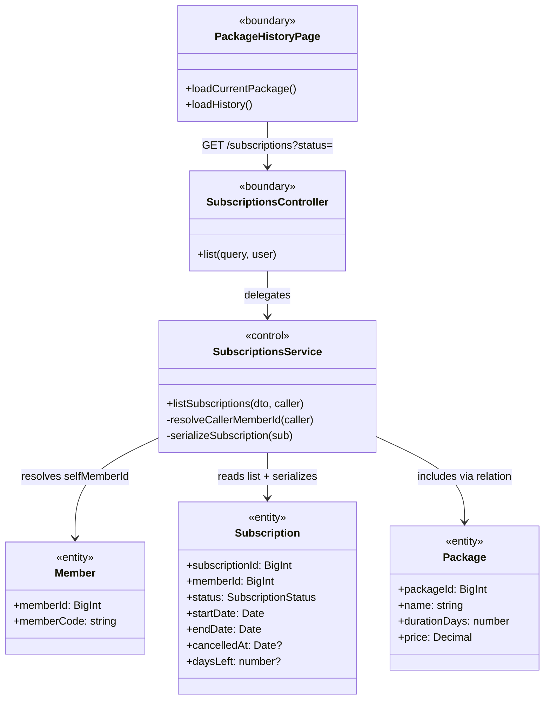
```mermaid
classDiagram
    class PackageHistoryPage {
        <<boundary>>
        +loadCurrentPackage()
        +loadHistory()
    }
    class SubscriptionsController {
        <<boundary>>
        +list(query, user)
    }
    class SubscriptionsService {
        <<control>>
        +listSubscriptions(dto, caller)
        -resolveCallerMemberId(caller)
        -serializeSubscription(sub)
    }
    class Subscription {
        <<entity>>
        +subscriptionId: BigInt
        +memberId: BigInt
        +status: SubscriptionStatus
        +startDate: Date
        +endDate: Date
        +cancelledAt: Date?
        +daysLeft: number?
    }
    class Package {
        <<entity>>
        +packageId: BigInt
        +name: string
        +durationDays: number
        +price: Decimal
    }
    class Member {
        <<entity>>
        +memberId: BigInt
        +memberCode: string
    }
    PackageHistoryPage --> SubscriptionsController : GET /subscriptions?status=
    SubscriptionsController --> SubscriptionsService : delegates
    SubscriptionsService --> Member : resolves selfMemberId
    SubscriptionsService --> Subscription : reads list + serializes
    SubscriptionsService --> Package : includes via relation
```

---

### Thiết kế kiến trúc cho UC09 — Quản lý hội viên

#### Biểu đồ tuần tự - Sequence Diagram

```mermaid
sequenceDiagram
    actor Staff as Staff
    participant Client as MemberListPage / MemberDetailPage
    participant API as MembersController
    participant Svc as MembersService
    participant DB as Database

    Note over Staff, DB: Luồng 1 — Xem danh sách hội viên
    Staff->>Client: Mở trang danh sách hội viên
    Client->>API: GET /api/v1/members?search=&status=&subStatus=&page= [RequirePermission: member.read]
    API->>Svc: listMembers(dto, caller)
    Svc->>DB: SELECT members INCLUDE user, activeSubscription+package WHERE filters ORDER BY createdAt DESC
    Svc->>DB: COUNT members WHERE same filters
    DB-->>Svc: Member[], total
    Svc-->>API: { data: MemberWithSub[], meta: { page, pageSize, totalItems, totalPages } }
    API-->>Client: 200 { success: true, data, meta }
    Client-->>Staff: Hiển thị danh sách hội viên kèm trạng thái gói tập hiện tại

    Note over Staff, DB: Luồng 2 — Xem chi tiết hội viên
    Staff->>Client: Nhấn vào hội viên
    Client->>API: GET /api/v1/members/:id
    API->>Svc: getMemberForCaller(memberId, caller)
    Svc->>DB: SELECT member WHERE memberId AND deletedAt IS NULL INCLUDE user, primaryTrainer+user, subscriptions+package (last 5)
    DB-->>Svc: MemberDetail
    Svc->>Svc: assertCanReadMember(member, caller)
    Svc-->>API: { data: MemberDetail }
    API-->>Client: 200 { success: true, data }
    Client-->>Staff: Hiển thị chi tiết hội viên, lịch sử 5 gói tập gần nhất, thông tin PT

    Note over Staff, DB: Luồng 3 — Cập nhật thông tin hội viên
    Staff->>Client: Chỉnh sửa thông tin và lưu
    Client->>API: PATCH /api/v1/members/:id { fullName, phone, dateOfBirth, address }
    API->>Svc: updateMemberForCaller(memberId, dto, caller)
    Svc->>DB: SELECT member WHERE memberId INCLUDE user
    DB-->>Svc: Member + User
    Svc->>Svc: assertIsOwnerStaffOrSelf
    Svc->>DB: $transaction: UPDATE user SET fullName, phone + UPDATE member SET dateOfBirth, address
    DB-->>Svc: Updated member + user
    Svc->>DB: INSERT audit_logs (action=member.update)
    DB-->>Svc: OK
    Svc-->>API: { data: Member }
    API-->>Client: 200 { success: true, data }
    Client-->>Staff: Hiển thị thông tin đã cập nhật

    Note over Staff, DB: Luồng 4 — Xóa hội viên (soft delete)
    Staff->>Client: Nhấn "Xóa hội viên"
    Client->>API: DELETE /api/v1/members/:id [RequirePermission: member.delete]
    API->>Svc: deleteMember(memberId, caller.userId)
    Svc->>DB: SELECT member WHERE memberId INCLUDE user
    DB-->>Svc: Member + User
    Svc->>DB: $transaction: UPDATE member SET deletedAt=now + UPDATE user SET deletedAt=now
    DB-->>Svc: OK
    Svc->>DB: INSERT audit_logs (action=member.delete)
    DB-->>Svc: OK
    API-->>Client: 204 No Content
    Client-->>Staff: Hội viên đã bị xóa khỏi danh sách
```

#### Biểu đồ lớp phân tích

```mermaid
classDiagram
    class MemberListPage {
        <<boundary>>
        +loadMembers(filters)
    }
    class MemberDetailPage {
        <<boundary>>
        +loadDetail(memberId)
        +updateMember(dto)
        +deleteMember(memberId)
    }
    class MembersController {
        <<boundary>>
        +list(query, user)
        +detail(id, user)
        +update(id, dto, user)
        +delete(id, user)
    }
    class MembersService {
        <<control>>
        +listMembers(dto, caller)
        +getMemberForCaller(memberId, caller)
        +updateMemberForCaller(memberId, dto, caller)
        +deleteMember(memberId, actorUserId)
        -assertCanReadMember(member, caller)
        -serializeMemberWithSub(member)
        -serializeMemberDetail(member)
    }
    class Member {
        <<entity>>
        +memberId: BigInt
        +memberCode: string
        +userId: BigInt
        +primaryTrainerId: BigInt?
        +dateOfBirth: Date?
        +address: string?
        +deletedAt: Date?
    }
    class User {
        <<entity>>
        +userId: BigInt
        +fullName: string
        +email: string
        +phone: string?
        +status: UserStatus
        +deletedAt: Date?
    }
    class Subscription {
        <<entity>>
        +subscriptionId: BigInt
        +status: SubscriptionStatus
        +endDate: Date
    }
    class AuditLog {
        <<entity>>
        +action: string
        +resourceType: string
        +resourceId: string
    }
    MemberListPage --> MembersController : GET /members
    MemberDetailPage --> MembersController : GET/PATCH/DELETE /members/{id}
    MembersController --> MembersService : delegates
    MembersService --> Member : reads + updates + soft-deletes
    MembersService --> User : updates fullName/phone + soft-deletes
    MembersService --> Subscription : includes last 5 in detail
    MembersService --> AuditLog : writes on update/delete
```

---

### Thiết kế kiến trúc cho UC10 — Quản lý giáo án / workout plan

#### Biểu đồ tuần tự - Sequence Diagram

```mermaid
sequenceDiagram
    actor Trainer as Trainer
    participant Client as WorkoutPlanPage
    participant API as WorkoutPlansController
    participant Svc as WorkoutPlansService
    participant DB as Database

    Note over Trainer, DB: Luồng 1 — Tạo giáo án mới
    Trainer->>Client: Tạo giáo án mới
    Client->>API: POST /api/v1/workout-plans [RequirePermission: workout_plan.create]
    API->>Svc: create(dto, caller)
    Svc->>DB: SELECT staff WHERE userId = caller.userId [nếu staffId thiếu trong JWT]
    DB-->>Svc: staffId
    Svc->>DB: INSERT workout_plan (name, description, creatorType=staff, creatorStaffId, status=draft)
    DB-->>Svc: WorkoutPlan
    Svc->>DB: INSERT audit_logs (action=workout_plan.create)
    Svc-->>API: WorkoutPlan (status=draft)
    API-->>Client: 201 { success: true, data }
    Client-->>Trainer: Hiển thị giáo án mới tạo ở trạng thái draft

    Note over Trainer, DB: Luồng 2 — Thêm ngày tập và bài tập
    Trainer->>Client: Thêm ngày tập
    Client->>API: POST /api/v1/workout-plans/:id/days [RequirePermission: workout_plan.update]
    API->>Svc: addDay(planId, dto, caller)
    Svc->>DB: SELECT workout_plan WHERE planId AND deletedAt IS NULL
    DB-->>Svc: WorkoutPlan
    Svc->>Svc: assertCanMutatePlan + assertPlanStructureMutable + assertPlanHasNoLogs
    Svc->>DB: INSERT workout_plan_day (planId, dayNumber, weekNumber, dayOfWeek, name)
    Svc->>DB: INSERT audit_logs (action=workout_plan.update)
    DB-->>Svc: WorkoutPlanDay
    Svc-->>API: WorkoutPlanDay
    API-->>Client: 201 { success: true, data }

    Trainer->>Client: Thêm bài tập vào ngày
    Client->>API: POST /api/v1/workout-plans/:id/days/:dayId/exercises [RequirePermission: workout_plan.update]
    API->>Svc: addExercise(planId, planDayId, dto, caller)
    Svc->>DB: SELECT workout_plan_day WHERE planDayId AND planId INCLUDE plan
    DB-->>Svc: WorkoutPlanDay + Plan
    Svc->>Svc: assertCanMutatePlan + assertPlanStructureMutable + assertPlanHasNoLogs
    Svc->>DB: SELECT exercise WHERE exerciseId AND deletedAt IS NULL
    DB-->>Svc: Exercise
    Svc->>DB: INSERT workout_plan_exercise (planDayId, exerciseId, targetSets, targetReps, restSeconds, ...)
    Svc->>DB: INSERT audit_logs (action=workout_plan.update)
    DB-->>Svc: WorkoutPlanExercise
    Svc-->>API: WorkoutPlanExercise + exercise
    API-->>Client: 201 { success: true, data }
    Client-->>Trainer: Hiển thị bài tập đã thêm vào ngày tập

    Note over Trainer, DB: Luồng 3 — Kích hoạt giáo án (draft → active)
    Trainer->>Client: Nhấn "Kích hoạt giáo án"
    Client->>API: PATCH /api/v1/workout-plans/:id { status: active } [RequirePermission: workout_plan.update]
    API->>Svc: update(planId, { status: active }, caller)
    Svc->>DB: SELECT workout_plan_days WHERE planId INCLUDE exercises
    DB-->>Svc: Days + Exercises

    alt Ngày trống hoặc bài tập thiếu targetReps/Duration hoặc restSeconds
        Svc-->>API: BadRequestException
        API-->>Client: 400 Moi ngay can co bai tap day du
        Client-->>Trainer: Hiển thị lỗi validation
    end

    Svc->>DB: UPDATE workout_plan SET status=active
    Svc->>DB: INSERT audit_logs (action=workout_plan.update)
    DB-->>Svc: WorkoutPlan (status=active)
    Svc-->>API: WorkoutPlan
    API-->>Client: 200 { success: true, data }
    Client-->>Trainer: Giáo án đã được kích hoạt

    Note over Trainer, DB: Luồng 4 — Giao giáo án cho hội viên
    Trainer->>Client: Chọn hội viên và giao giáo án
    Client->>API: POST /api/v1/workout-plans/members/:memberId/assign { planId, startDate }
    API->>Svc: assignPlan(memberId, dto, caller)
    Svc->>DB: SELECT member WHERE memberId AND deletedAt IS NULL
    DB-->>Svc: Member { primaryTrainerId }
    Svc->>Svc: validate trainer là primaryTrainer của member

    alt Trainer không phụ trách member này
        Svc-->>API: ForbiddenException (TRAINER_NOT_ASSIGNED)
        API-->>Client: 403 Forbidden
        Client-->>Trainer: Hiển thị lỗi không có quyền
    end

    Svc->>DB: SELECT workout_plan WHERE planId AND status=active
    DB-->>Svc: WorkoutPlan
    Svc->>DB: $transaction: FOR UPDATE active assignments → UPDATE status=replaced + INSERT new MemberWorkoutPlan (status=active)
    DB-->>Svc: MemberWorkoutPlan
    Svc->>DB: INSERT audit_logs (action=workout_plan.assign)
    DB-->>Svc: OK
    Svc-->>API: MemberWorkoutPlan
    API-->>Client: 201 { success: true, data }
    Client-->>Trainer: Giáo án đã được giao cho hội viên
```

#### Biểu đồ lớp phân tích

```mermaid
classDiagram
    class WorkoutPlanPage {
        <<boundary>>
        +createPlan()
        +addDay()
        +addExercise()
        +activatePlan()
        +assignPlan(memberId)
    }
    class WorkoutPlansController {
        <<boundary>>
        +list(user)
        +create(dto, user)
        +update(id, dto, user)
        +addDay(id, dto, user)
        +addExercise(id, dayId, dto, user)
        +assign(memberId, dto, user)
    }
    class WorkoutPlansService {
        <<control>>
        +findAll(user)
        +create(dto, caller)
        +update(id, dto, caller)
        +addDay(planId, dto, caller)
        +addExercise(planId, dayId, dto, caller)
        +assignPlan(memberId, dto, caller)
        -assertCanMutatePlan(plan, caller)
        -assertPlanHasNoLogs(planId)
        -assertPlanStructureMutable(status)
    }
    class WorkoutPlan {
        <<entity>>
        +planId: BigInt
        +name: string
        +creatorType: PlanCreatorType
        +creatorStaffId: BigInt?
        +status: WorkoutPlanStatus
    }
    class WorkoutPlanDay {
        <<entity>>
        +planDayId: BigInt
        +planId: BigInt
        +dayNumber: number
        +weekNumber: number
        +dayOfWeek: number
    }
    class WorkoutPlanExercise {
        <<entity>>
        +planExerciseId: BigInt
        +planDayId: BigInt
        +exerciseId: BigInt
        +targetSets: number
        +targetReps: number?
        +targetDurationSec: number?
        +restSeconds: number
    }
    class Exercise {
        <<entity>>
        +exerciseId: BigInt
        +name: string
    }
    class MemberWorkoutPlan {
        <<entity>>
        +assignmentId: BigInt
        +memberId: BigInt
        +planId: BigInt
        +assignedByStaffId: BigInt?
        +status: WorkoutAssignmentStatus
        +startDate: Date
    }
    class AuditLog {
        <<entity>>
        +action: string
        +resourceType: string
        +resourceId: string
    }
    WorkoutPlanPage --> WorkoutPlansController
    WorkoutPlansController --> WorkoutPlansService : delegates
    WorkoutPlansService --> WorkoutPlan : creates + updates
    WorkoutPlansService --> WorkoutPlanDay : creates + deletes
    WorkoutPlansService --> WorkoutPlanExercise : creates + deletes
    WorkoutPlansService --> Exercise : validates existence
    WorkoutPlansService --> MemberWorkoutPlan : creates assignment
    WorkoutPlansService --> AuditLog : writes
```

---

### Thiết kế kiến trúc cho UC11 — Quản lý buổi tập / lịch tập

#### Biểu đồ tuần tự - Sequence Diagram

```mermaid
sequenceDiagram
    actor Trainer as Trainer
    participant Client as TrainingSchedulePage
    participant API as TrainingController
    participant Svc as TrainingService
    participant DB as Database

    Note over Trainer, DB: Luồng 1 — Tạo buổi tập mới
    Trainer->>Client: Tạo buổi tập cho hội viên
    Client->>API: POST /api/v1/training-sessions [RequirePermission: session.manage]
    API->>Svc: createSession(dto, caller)
    Svc->>Svc: validate endTime > startTime + startTime >= now - 5min grace
    Svc->>DB: SELECT member WHERE memberId AND deletedAt IS NULL
    DB-->>Svc: Member

    alt Member không tồn tại
        Svc-->>API: NotFoundException
        API-->>Client: 404 Not Found
        Client-->>Trainer: Hiển thị lỗi không tìm thấy hội viên
    end

    Svc->>DB: SELECT subscription WHERE memberId AND status=active AND startDate<=now AND endDate>=now
    DB-->>Svc: Subscription

    alt Không có gói tập active
        Svc-->>API: BadRequestException (NO_ACTIVE_SUBSCRIPTION)
        API-->>Client: 400 Bad Request
        Client-->>Trainer: Hiển thị lỗi hội viên không có gói tập active
    end

    Svc->>DB: SELECT gymRoom WHERE roomId AND deletedAt IS NULL
    Svc->>DB: SELECT staff WHERE trainerStaffId AND deletedAt IS NULL
    DB-->>Svc: GymRoom + Staff

    Svc->>DB: checkOverlap: SELECT trainingSession WHERE roomId AND time overlap AND status≠cancelled
    Svc->>DB: checkOverlap: SELECT trainingSession WHERE trainerStaffId AND time overlap AND status≠cancelled
    DB-->>Svc: Overlap results

    alt Phòng tập hoặc trainer bị conflict
        Svc-->>API: ConflictException (ROOM_CONFLICT / TRAINER_CONFLICT)
        API-->>Client: 409 Conflict
        Client-->>Trainer: Hiển thị lỗi lịch bị trùng
    end

    Svc->>DB: resolveSessionPlanLink: SELECT memberWorkoutPlan WHERE memberId AND status=active
    DB-->>Svc: MemberWorkoutPlan (optional)
    Svc->>DB: resolveSessionPlanLink: SELECT workoutPlanDay WHERE planId AND dayNumber matches
    DB-->>Svc: WorkoutPlanDay (optional, linked if found)

    Svc->>DB: INSERT training_session (memberId, trainerStaffId, roomId, startTime, endTime, assignmentId?, planDayId?, status=scheduled)
    DB-->>Svc: TrainingSession
    Svc->>DB: INSERT audit_log (action=training.create, resourceType=training_session)
    DB-->>Svc: OK
    Svc-->>API: TrainingSession (with member, trainer, room)
    API-->>Client: 201 { success: true, data }
    Client-->>Trainer: Hiển thị buổi tập vừa tạo

    Note over Trainer, DB: Luồng 2 — Xem danh sách buổi tập
    Trainer->>Client: Xem lịch tập
    Client->>API: GET /api/v1/training-sessions?memberId=&status=&from=&to= [RequirePermission: session.read]
    API->>Svc: listSessions(dto, caller)
    Svc->>DB: SELECT training_sessions WHERE filters (memberId, trainerStaffId, roomId, status, startTime range) INCLUDE member, trainer, room, assignment, planDay PAGINATE
    DB-->>Svc: TrainingSession[]
    Svc-->>API: { data, total, page, pageSize }
    API-->>Client: 200 { success: true, data }
    Client-->>Trainer: Hiển thị danh sách buổi tập

    Note over Trainer, DB: Luồng 3 — Cập nhật trạng thái buổi tập
    Trainer->>Client: Bắt đầu / kết thúc buổi tập
    Client->>API: POST /api/v1/training-sessions/:id/status { status: in_progress | completed } [RequirePermission: session.manage]
    API->>Svc: updateSessionStatus(id, status, caller)
    Svc->>DB: SELECT training_session WHERE sessionId AND deletedAt IS NULL
    DB-->>Svc: TrainingSession

    alt Transition không hợp lệ (ví dụ: completed → in_progress)
        Svc-->>API: BadRequestException (INVALID_STATUS_TRANSITION)
        API-->>Client: 400 Bad Request
        Client-->>Trainer: Hiển thị lỗi trạng thái không hợp lệ
    end

    Svc->>DB: UPDATE training_session SET status = newStatus
    Svc->>DB: INSERT audit_log (action=training.status.{newStatus})
    DB-->>Svc: TrainingSession (updated)
    Svc-->>API: TrainingSession
    API-->>Client: 200 { success: true, data }
    Client-->>Trainer: Hiển thị trạng thái mới

    Note over Trainer, DB: Luồng 4 — Hủy buổi tập
    Trainer->>Client: Nhấn hủy buổi tập
    Client->>API: POST /api/v1/training-sessions/:id/cancel [RequirePermission: session.manage]
    API->>Svc: cancelSession(id, dto, caller)
    Svc->>DB: SELECT training_session WHERE sessionId AND deletedAt IS NULL
    DB-->>Svc: TrainingSession
    Svc->>Svc: permission check — trainer chỉ cancel được session của mình
    Svc->>DB: UPDATE training_session SET status=cancelled
    Svc->>DB: INSERT audit_log (action=training.cancel)
    DB-->>Svc: OK
    Svc-->>API: TrainingSession (status=cancelled)
    API-->>Client: 200 { success: true, data }
    Client-->>Trainer: Hiển thị buổi tập đã hủy
```

#### Biểu đồ lớp phân tích

```mermaid
classDiagram
    class TrainingSchedulePage {
        <<boundary>>
        +createSession()
        +listSessions(filters)
        +updateSessionStatus(id, status)
        +cancelSession(id)
    }
    class TrainingController {
        <<boundary>>
        +listSessions(dto, user)
        +getSession(id, user)
        +createSession(dto, user)
        +updateSession(id, dto, user)
        +cancelSession(id, dto, user)
        +updateSessionStatus(id, status, user)
    }
    class TrainingService {
        <<control>>
        +listSessions(dto, caller)
        +getSession(id, caller)
        +createSession(dto, caller)
        +updateSession(id, dto, caller)
        +cancelSession(id, dto, caller)
        +updateSessionStatus(id, status, caller)
        -checkOverlap(roomId, trainerStaffId, startTime, endTime)
        -resolveSessionPlanLink(memberId, startTime)
    }
    class TrainingSession {
        <<entity>>
        +sessionId: BigInt
        +memberId: BigInt
        +trainerStaffId: BigInt
        +roomId: BigInt
        +assignmentId: BigInt?
        +planDayId: BigInt?
        +startTime: DateTime
        +endTime: DateTime
        +status: SessionStatus
    }
    class Member {
        <<entity>>
        +memberId: BigInt
        +primaryTrainerId: BigInt?
    }
    class Staff {
        <<entity>>
        +staffId: BigInt
    }
    class GymRoom {
        <<entity>>
        +roomId: BigInt
        +name: string
    }
    class Subscription {
        <<entity>>
        +subscriptionId: BigInt
        +memberId: BigInt
        +status: SubscriptionStatus
        +endDate: DateTime
    }
    class MemberWorkoutPlan {
        <<entity>>
        +assignmentId: BigInt
        +memberId: BigInt
        +planId: BigInt
        +status: WorkoutAssignmentStatus
    }
    class WorkoutPlanDay {
        <<entity>>
        +planDayId: BigInt
        +planId: BigInt
        +dayNumber: number
    }
    class AuditLog {
        <<entity>>
        +action: string
        +resourceType: string
    }
    TrainingSchedulePage --> TrainingController
    TrainingController --> TrainingService : delegates
    TrainingService --> TrainingSession : creates + updates
    TrainingService --> Member : validates
    TrainingService --> Staff : validates trainer
    TrainingService --> GymRoom : validates + conflict check
    TrainingService --> Subscription : validates active
    TrainingService --> MemberWorkoutPlan : links optional
    TrainingService --> WorkoutPlanDay : links optional
    TrainingService --> AuditLog : writes
```

---

### Thiết kế kiến trúc cho UC12 — Theo dõi và ghi nhận buổi tập

#### Biểu đồ tuần tự - Sequence Diagram

```mermaid
sequenceDiagram
    actor Member as Member
    participant AttPage as AttendancePage
    participant TAPI as TrainingController
    participant AttSvc as AttendanceService
    participant WLPage as WorkoutLogPage
    participant WLAPI as WorkoutLogsController
    participant WLSvc as WorkoutLogsService
    participant DB as Database

    Note over Member, DB: Luồng 1 — Check-in thủ công vào phòng tập
    Member->>AttPage: Check-in vào phòng tập
    AttPage->>TAPI: POST /api/v1/attendance/manual-checkin { memberCode } [RequirePermission: attendance.checkin]
    TAPI->>AttSvc: manualCheckin(dto, caller)
    AttSvc->>DB: SELECT member WHERE memberCode AND deletedAt IS NULL
    DB-->>AttSvc: Member

    alt Không tìm thấy member
        AttSvc-->>TAPI: NotFoundException
        TAPI-->>AttPage: 404 Not Found
        AttPage-->>Member: Hiển thị lỗi không tìm thấy
    end

    AttSvc->>DB: SELECT subscription WHERE memberId AND status=active AND startDate<=today AND endDate>=today
    DB-->>AttSvc: Subscription

    alt Không có gói tập active hôm nay
        AttSvc-->>TAPI: BadRequestException (NO_ACTIVE_SUBSCRIPTION)
        TAPI-->>AttPage: 400 Bad Request
        AttPage-->>Member: Hiển thị lỗi không có gói tập active
    end

    AttSvc->>DB: UPDATE attendance_log SET endTime=now WHERE memberId AND endTime IS NULL (auto-close open)
    AttSvc->>DB: INSERT attendance_log (memberId, subscriptionId, startTime=now, method=manual)
    DB-->>AttSvc: AttendanceLog
    AttSvc->>DB: INSERT audit_log (action=attendance.manual-checkin)
    AttSvc-->>TAPI: AttendanceLog
    TAPI-->>AttPage: 201 { success: true, data }
    AttPage-->>Member: Hiển thị check-in thành công

    Note over Member, DB: Luồng 2 — Check-out khỏi phòng tập
    Member->>AttPage: Check-out
    AttPage->>TAPI: PATCH /api/v1/attendance-logs/:id/checkout { endTime } [RequirePermission: attendance.checkin]
    TAPI->>AttSvc: checkout(id, dto, caller)
    AttSvc->>DB: SELECT attendance_log WHERE attendanceId AND deletedAt IS NULL
    DB-->>AttSvc: AttendanceLog

    alt endTime đã tồn tại (đã checkout trước đó)
        AttSvc-->>TAPI: ConflictException (ALREADY_CHECKED_OUT)
        TAPI-->>AttPage: 409 Conflict
        AttPage-->>Member: Hiển thị lỗi đã checkout rồi
    end

    AttSvc->>DB: UPDATE attendance_log SET endTime = dto.endTime WHERE attendanceId
    AttSvc->>DB: INSERT audit_log (action=attendance.checkout)
    DB-->>AttSvc: AttendanceLog (updated)
    AttSvc-->>TAPI: AttendanceLog
    TAPI-->>AttPage: 200 { success: true, data }
    AttPage-->>Member: Hiển thị thời gian tập đã ghi nhận

    Note over Member, DB: Luồng 3 — Ghi nhận chi tiết buổi tập (workout log)
    Member->>WLPage: Ghi nhận các set đã thực hiện
    WLPage->>WLAPI: POST /api/v1/workout-logs { assignmentId, planDayId, loggedAt, sets[] } [RequirePermission: workout_log.create]
    WLAPI->>WLSvc: create(dto, caller)
    WLSvc->>DB: resolveCallerMember: SELECT member WHERE userId = caller.userId
    DB-->>WLSvc: Member
    WLSvc->>DB: SELECT member_workout_plan WHERE assignmentId AND memberId AND status=active
    DB-->>WLSvc: MemberWorkoutPlan

    alt Assignment không tồn tại hoặc không thuộc member này
        WLSvc-->>WLAPI: NotFoundException / ForbiddenException
        WLAPI-->>WLPage: 404 / 403
        WLPage-->>Member: Hiển thị lỗi
    end

    WLSvc->>DB: SELECT workout_plan_day WHERE planDayId AND planId = assignment.planId
    DB-->>WLSvc: WorkoutPlanDay
    WLSvc->>DB: INSERT workout_log (memberId, assignmentId, planDayId, loggedAt, durationMin, notes)
    DB-->>WLSvc: WorkoutLog (logId)
    WLSvc->>DB: INSERT workout_log_set[] (logId, planExerciseId, setNumber, actualReps, actualWeightKg, completed) — bulk insert
    DB-->>WLSvc: WorkoutLogSet[]
    WLSvc->>DB: INSERT audit_log (action=workout_log.create)
    DB-->>WLSvc: OK
    WLSvc-->>WLAPI: WorkoutLog (with sets)
    WLAPI-->>WLPage: 201 { success: true, data }
    WLPage-->>Member: Hiển thị buổi tập đã được ghi nhận

    Note over Member, DB: Luồng 4 — Cập nhật workout log (trong vòng 24 giờ)
    Member->>WLPage: Chỉnh sửa log
    WLPage->>WLAPI: PATCH /api/v1/workout-logs/:id { sets[] } [RequirePermission: workout_log.update]
    WLAPI->>WLSvc: update(id, dto, caller)
    WLSvc->>DB: SELECT workout_log WHERE logId AND memberId = callerMemberId
    DB-->>WLSvc: WorkoutLog

    alt Log quá 24 giờ
        WLSvc-->>WLAPI: ForbiddenException (LOG_EDIT_WINDOW_EXPIRED)
        WLAPI-->>WLPage: 403 Forbidden
        WLPage-->>Member: Hiển thị lỗi không thể sửa sau 24 giờ
    end

    WLSvc->>DB: UPDATE workout_log (durationMin, notes) + DELETE old sets + INSERT new sets
    WLSvc->>DB: INSERT audit_log (action=workout_log.update)
    DB-->>WLSvc: WorkoutLog (updated)
    WLSvc-->>WLAPI: WorkoutLog
    WLAPI-->>WLPage: 200 { success: true, data }
    WLPage-->>Member: Hiển thị log đã cập nhật
```

#### Biểu đồ lớp phân tích

```mermaid
classDiagram
    class AttendancePage {
        <<boundary>>
        +checkin(memberCode)
        +checkout(id, endTime)
        +listAttendance(filters)
    }
    class TrainingController {
        <<boundary>>
        +manualCheckin(dto, user)
        +checkout(id, dto, user)
        +listAttendance(dto, user)
    }
    class AttendanceService {
        <<control>>
        +manualCheckin(dto, caller)
        +checkout(id, dto, caller)
        +listAttendance(dto, caller)
        -serializeAttendance(log)
    }
    class WorkoutLogPage {
        <<boundary>>
        +createLog(assignmentId, sets)
        +updateLog(id, sets)
        +listLogs()
    }
    class WorkoutLogsController {
        <<boundary>>
        +create(dto, user)
        +update(id, dto, user)
        +list(user)
    }
    class WorkoutLogsService {
        <<control>>
        +create(dto, caller)
        +update(id, dto, caller)
        +findAll(caller)
        -resolveCallerMember(caller)
    }
    class AttendanceLog {
        <<entity>>
        +attendanceId: BigInt
        +memberId: BigInt
        +subscriptionId: BigInt
        +sessionId: BigInt?
        +startTime: DateTime
        +endTime: DateTime?
        +method: AttendanceMethod
    }
    class WorkoutLog {
        <<entity>>
        +logId: BigInt
        +memberId: BigInt
        +assignmentId: BigInt
        +planDayId: BigInt
        +loggedAt: DateTime
        +durationMin: Int?
    }
    class WorkoutLogSet {
        <<entity>>
        +logSetId: BigInt
        +logId: BigInt
        +planExerciseId: BigInt
        +setNumber: Int
        +actualReps: Int?
        +actualWeightKg: Decimal?
        +completed: Boolean
    }
    class Subscription {
        <<entity>>
        +subscriptionId: BigInt
        +memberId: BigInt
        +status: SubscriptionStatus
        +endDate: DateTime
    }
    class MemberWorkoutPlan {
        <<entity>>
        +assignmentId: BigInt
        +memberId: BigInt
        +planId: BigInt
        +status: WorkoutAssignmentStatus
    }
    class WorkoutPlanDay {
        <<entity>>
        +planDayId: BigInt
        +planId: BigInt
        +dayNumber: number
    }
    class AuditLog {
        <<entity>>
        +action: string
    }
    AttendancePage --> TrainingController
    TrainingController --> AttendanceService : delegates
    AttendanceService --> AttendanceLog : creates + updates
    AttendanceService --> Subscription : validates active
    AttendanceService --> AuditLog : writes
    WorkoutLogPage --> WorkoutLogsController
    WorkoutLogsController --> WorkoutLogsService : delegates
    WorkoutLogsService --> WorkoutLog : creates + updates
    WorkoutLogsService --> WorkoutLogSet : creates + replaces
    WorkoutLogsService --> MemberWorkoutPlan : validates active assignment
    WorkoutLogsService --> WorkoutPlanDay : validates plan day
    WorkoutLogsService --> AuditLog : writes
```

---

### Thiết kế kiến trúc cho UC13 — Gửi phản hồi

#### Biểu đồ tuần tự - Sequence Diagram

```mermaid
sequenceDiagram
    actor Member as Member
    participant Client as FeedbackFormPage
    participant API as FeedbackController
    participant Svc as FeedbackService
    participant DB as Database

    Member->>Client: Điền nội dung phản hồi (feedbackType, content, severity, subjectId)
    Client->>API: POST /api/v1/feedback [RequirePermission: feedback.create]
    API->>Svc: create(dto, caller)

    Svc->>Svc: Xác định memberId theo role
    Note over Svc: Member role → memberId = caller.memberId (tự động, không nhận từ DTO)<br/>Staff role → memberId từ DTO (bắt buộc)

    Svc->>DB: SELECT members WHERE memberId
    DB-->>Svc: Member | null

    alt Member không tồn tại
        Svc-->>API: BadRequestException
        API-->>Client: 400 Bad Request
        Client-->>Member: Hiển thị lỗi
    end

    Svc->>Svc: Validate feedbackType + subject consistency
    Note over Svc: type=staff → subjectEquipmentId phải null<br/>type=equipment → subjectStaffId phải null<br/>type=service → cả hai phải null

    alt Subject không khớp feedbackType
        Svc-->>API: BadRequestException (FEEDBACK_SUBJECT_MISMATCH)
        API-->>Client: 400 Bad Request
        Client-->>Member: Hiển thị lỗi subject không hợp lệ
    end

    Svc->>DB: INSERT feedback (status=open, severity=low nếu không truyền)
    DB-->>Svc: Feedback (include member)
    Svc->>DB: INSERT audit_logs (action=feedback.create)
    Svc-->>API: serialized feedback (kèm dueAt, overdue theo SLA)
    API-->>Client: 201 Created
    Client-->>Member: Hiển thị xác nhận phản hồi đã gửi
```

#### Biểu đồ lớp phân tích

```mermaid
classDiagram
    class FeedbackFormPage {
        <<boundary>>
        +submitFeedback(feedbackType, content, severity, subjectId)
    }
    class FeedbackController {
        <<boundary>>
        +create(dto, caller): POST /feedback
    }
    class FeedbackService {
        <<control>>
        +create(dto, caller): Feedback
        -resolveMemberId(dto, caller): BigInt
        -validateSubjectConsistency(feedbackType, dto): void
    }
    class Feedback {
        <<entity>>
        +feedbackId: BigInt
        +memberId: BigInt
        +feedbackType: FeedbackType
        +content: string
        +severity: FeedbackSeverity
        +status: FeedbackStatus
        +subjectStaffId: BigInt?
        +subjectEquipmentId: BigInt?
    }
    class Member {
        <<entity>>
        +memberId: BigInt
        +memberCode: string
    }
    class Staff {
        <<entity>>
        +staffId: BigInt
    }
    class Equipment {
        <<entity>>
        +equipmentId: BigInt
        +name: string
    }
    class AuditLog {
        <<entity>>
        +action: string
    }
    FeedbackFormPage --> FeedbackController
    FeedbackController --> FeedbackService
    FeedbackService --> Member : validates existence
    FeedbackService --> Feedback : creates
    FeedbackService --> Staff : subject (optional, type=staff)
    FeedbackService --> Equipment : subject (optional, type=equipment)
    FeedbackService --> AuditLog : writes
```

---

### Thiết kế kiến trúc cho UC14 — Xử lý phản hồi

#### Biểu đồ tuần tự - Sequence Diagram

```mermaid
sequenceDiagram
    actor Staff as Staff
    participant Client as FeedbackListPage / FeedbackDetailPage
    participant API as FeedbackController
    participant Svc as FeedbackService
    participant DB as Database

    Note over Staff, DB: Luồng 1 — Xem danh sách và chi tiết phản hồi
    Staff->>Client: Mở trang danh sách phản hồi
    Client->>API: GET /api/v1/feedback?status=&type=&... [RequirePermission: feedback.read]
    API->>Svc: list(query)
    Svc->>DB: SELECT feedbacks (filter status/type/severity/overdue) INCLUDE member + subjectStaff + subjectEquipment + handledByStaff, COUNT
    DB-->>Svc: feedbacks[], total
    Svc-->>API: paginated list (kèm dueAt, overdue theo SLA)
    API-->>Client: 200 { data[], meta }
    Client-->>Staff: Hiển thị danh sách feedback

    Staff->>Client: Chọn một feedback
    Client->>API: GET /api/v1/feedback/:id [RequirePermission: feedback.read]
    API->>Svc: detail(id)
    Svc->>DB: SELECT feedback WHERE feedbackId INCLUDE member + subjectStaff + subjectEquipment + handledByStaff
    DB-->>Svc: Feedback
    Svc-->>API: serialized feedback
    API-->>Client: 200 Feedback detail
    Client-->>Staff: Hiển thị chi tiết và nút xử lý

    Note over Staff, DB: Luồng 2 — Phân công xử lý (assign)
    Staff->>Client: Nhận phụ trách phản hồi
    Client->>API: PATCH /api/v1/feedback/:id/assign [RequirePermission: feedback.handle]
    API->>Svc: assign(id, dto, caller)
    Svc->>DB: SELECT feedback WHERE feedbackId
    DB-->>Svc: Feedback (status=open)
    Svc->>DB: UPDATE feedback SET status=in_progress, handledByStaffId, handledAt=now
    DB-->>Svc: Feedback updated
    Svc->>DB: INSERT audit_logs (action=feedback.assign)
    Svc-->>API: serialized feedback
    API-->>Client: 200 OK
    Client-->>Staff: Feedback chuyển sang trạng thái in_progress

    Note over Staff, DB: Luồng 3 — Cập nhật kết quả xử lý (resolve / reject)
    Staff->>Client: Điền kết quả và ghi chú giải quyết
    Client->>API: PATCH /api/v1/feedback/:id/status { status, resolutionNote } [RequirePermission: feedback.handle]
    API->>Svc: updateStatus(id, dto, caller)
    Svc->>DB: SELECT feedback WHERE feedbackId
    DB-->>Svc: Feedback (status=in_progress)

    alt Feedback chưa ở trạng thái in_progress
        Svc-->>API: BadRequestException (FEEDBACK_INVALID_STATE_TRANSITION)
        API-->>Client: 400 Bad Request
        Client-->>Staff: Hiển thị lỗi chuyển trạng thái không hợp lệ
    end

    Svc->>DB: UPDATE feedback SET status=resolved|rejected, resolutionNote, resolvedAt=now
    DB-->>Svc: Feedback updated
    Svc->>DB: INSERT audit_logs (action=feedback.updateStatus)
    Svc-->>API: serialized feedback
    API-->>Client: 200 OK
    Client-->>Staff: Feedback đóng lại với kết quả
```

#### Biểu đồ lớp phân tích

```mermaid
classDiagram
    class FeedbackListPage {
        <<boundary>>
        +listFeedback(filters)
        +assignFeedback(id)
    }
    class FeedbackDetailPage {
        <<boundary>>
        +viewDetail(id)
        +updateStatus(id, status, resolutionNote)
    }
    class FeedbackController {
        <<boundary>>
        +list(query): GET /feedback
        +detail(id): GET /feedback/:id
        +assign(id, dto, caller): PATCH /feedback/:id/assign
        +updateStatus(id, dto, caller): PATCH /feedback/:id/status
    }
    class FeedbackService {
        <<control>>
        +list(query): PaginatedFeedback
        +detail(id): Feedback
        +assign(id, dto, caller): Feedback
        +updateStatus(id, dto, caller): Feedback
        -validateStateTransition(currentStatus, newStatus): void
    }
    class Feedback {
        <<entity>>
        +feedbackId: BigInt
        +status: FeedbackStatus
        +handledByStaffId: BigInt?
        +handledAt: DateTime?
        +resolutionNote: string?
        +resolvedAt: DateTime?
    }
    class Staff {
        <<entity>>
        +staffId: BigInt
        +handledFeedbacks: Feedback[]
    }
    class AuditLog {
        <<entity>>
        +action: string
    }
    FeedbackListPage --> FeedbackController
    FeedbackDetailPage --> FeedbackController
    FeedbackController --> FeedbackService
    FeedbackService --> Feedback : reads + updates
    FeedbackService --> Staff : assigns as handler
    FeedbackService --> AuditLog : writes
```

---

### Thiết kế kiến trúc cho UC15 — Quản lý nhân sự

#### Biểu đồ tuần tự - Sequence Diagram

```mermaid
sequenceDiagram
    actor Owner as Owner
    participant Client as StaffListPage / StaffDetailPage
    participant API as StaffController
    participant Svc as StaffService
    participant SchedSvc as StaffScheduleService
    participant DB as Database

    Note over Owner, DB: Luồng 1 — Xem danh sách nhân sự
    Owner->>Client: Mở trang danh sách nhân sự
    Client->>API: GET /api/v1/staff?position=&status=&search= [RequirePermission: staff.read]
    API->>Svc: list(query, caller)
    Svc->>DB: SELECT staff INCLUDE user (filter position/status/search) + COUNT
    DB-->>Svc: staff[], total
    Svc-->>API: paginated list
    API-->>Client: 200 { data[], meta }
    Client-->>Owner: Hiển thị danh sách nhân sự

    Note over Owner, DB: Luồng 2 — Tạo nhân sự mới
    Owner->>Client: Điền thông tin nhân sự mới
    Client->>API: POST /api/v1/staff { email, fullName, position, groupIds? } [RequirePermission: staff.create]
    API->>Svc: create(dto, actorUserId)
    Svc->>DB: SELECT users WHERE email AND deletedAt=null
    DB-->>Svc: User | null

    alt Email đã tồn tại
        Svc-->>API: ConflictException (DUPLICATE_VALUE)
        API-->>Client: 409 Conflict
        Client-->>Owner: Hiển thị lỗi email đã tồn tại
    end

    Svc->>Svc: bcrypt.hash(defaultPassword, 12)
    Svc->>DB: $transaction [INSERT User(status=pending_verification) + INSERT Staff(staffCode) + INSERT UserGroup(s)]
    Note over Svc, DB: staffCode = STF-{year}-{random6digits}<br/>groupIds từ DTO hoặc auto-assign theo position
    DB-->>Svc: { User, Staff, UserGroup[] }
    Svc->>DB: INSERT audit_logs (action=staff.create)
    Svc-->>API: serialized staff
    API-->>Client: 201 Created
    Client-->>Owner: Nhân sự mới được tạo, mật khẩu mặc định

    Note over Owner, DB: Luồng 3 — Cập nhật thông tin nhân sự
    Owner->>Client: Chỉnh sửa thông tin nhân sự
    Client->>API: PATCH /api/v1/staff/:id { fullName?, phone?, position? } [RequirePermission: staff.update]
    API->>Svc: update(staffId, dto, actorUserId)
    Svc->>DB: SELECT staff WHERE staffId AND deletedAt=null INCLUDE user
    DB-->>Svc: Staff
    Svc->>DB: $transaction [UPDATE User (nếu có fullName/phone) + UPDATE Staff (nếu có position)]
    DB-->>Svc: updated
    Svc->>DB: INSERT audit_logs (action=staff.update, beforeData, afterData)
    Svc-->>API: serialized staff
    API-->>Client: 200 OK
    Client-->>Owner: Hiển thị thông tin đã cập nhật

    Note over Owner, DB: Luồng 4 — Xóa nhân sự (hard delete + cleanup)
    Owner->>Client: Xóa nhân sự
    Client->>API: DELETE /api/v1/staff/:id [RequirePermission: staff.delete]
    API->>Svc: remove(staffId, actorUserId)
    Svc->>DB: SELECT staff WHERE staffId INCLUDE user
    DB-->>Svc: Staff

    alt Owner tự xóa chính mình
        Svc-->>API: ForbiddenException (CANNOT_DELETE_SELF)
        API-->>Client: 403 Forbidden
        Client-->>Owner: Không thể tự xóa bản thân
    end

    Svc->>DB: $transaction [xóa TrainingSession + AttendanceLog + MaintenanceLog + StaffAttendanceLog + StaffSchedule + nullify FK trong Member/Subscription/WorkoutPlan/Feedback + anonymize AuditLog + DELETE File + DELETE UserGroup + DELETE Staff + DELETE User]
    DB-->>Svc: ok
    Svc->>DB: INSERT audit_logs (action=staff.delete, beforeData)
    Svc-->>API: { success: true }
    API-->>Client: 200 OK
    Client-->>Owner: Nhân sự đã bị xóa hoàn toàn

    Note over Owner, DB: Luồng 5 — Quản lý lịch làm việc (chỉ dành cho position=staff)
    Owner->>Client: Tạo lịch làm việc
    Client->>API: POST /api/v1/staff/:id/schedules { schedules[] } [RequirePermission: schedule.manage]
    API->>Svc: createSchedule(staffId, dto, actorUserId)
    Svc->>SchedSvc: createSchedule(staffId, dto, actorUserId)
    SchedSvc->>DB: validate workDate không quá khứ + check conflict ca/ngày
    SchedSvc->>DB: INSERT staff_schedules[] (batch)
    DB-->>SchedSvc: StaffSchedule[]
    SchedSvc->>DB: INSERT audit_logs (action=schedule.assign)
    SchedSvc-->>Svc: StaffSchedule[]
    Svc-->>API: schedules[]
    API-->>Client: 201 Created
    Client-->>Owner: Lịch làm việc đã tạo
```

#### Biểu đồ lớp phân tích

```mermaid
classDiagram
    class StaffListPage {
        <<boundary>>
        +listStaff(filters)
        +createStaff(dto)
    }
    class StaffDetailPage {
        <<boundary>>
        +getStaff(id)
        +updateStaff(id, dto)
        +deleteStaff(id)
        +manageSchedule(id, dto)
    }
    class StaffController {
        <<boundary>>
        +list(query, caller): GET /staff
        +create(dto, actorUserId): POST /staff
        +get(id): GET /staff/:id
        +update(id, dto, actorUserId): PATCH /staff/:id
        +remove(id, actorUserId): DELETE /staff/:id
        +createSchedule(id, dto): POST /staff/:id/schedules
        +listSchedules(id): GET /staff/:id/schedules
        +deleteSchedule(id, scheduleId): DELETE /staff/:id/schedules/:scheduleId
    }
    class StaffService {
        <<control>>
        +list(query, caller): PaginatedStaff
        +create(dto, actorUserId): Staff
        +get(staffId): Staff
        +update(staffId, dto, actorUserId): Staff
        +remove(staffId, actorUserId): void
        +createSchedule(staffId, dto, actorUserId): StaffSchedule[]
    }
    class StaffScheduleService {
        <<control>>
        +createSchedule(staffId, dto, actorUserId): StaffSchedule[]
        +deleteSchedule(staffId, scheduleId, actorUserId): void
        +listSchedules(staffId): StaffSchedule[]
        +listAllSchedules(from, to): StaffSchedule[]
    }
    class User {
        <<entity>>
        +userId: BigInt
        +email: string
        +fullName: string
        +status: UserStatus
        +passwordHash: string
    }
    class Staff {
        <<entity>>
        +staffId: BigInt
        +userId: BigInt
        +staffCode: string
        +position: StaffPosition
    }
    class UserGroup {
        <<entity>>
        +userId: BigInt
        +groupId: BigInt
    }
    class StaffSchedule {
        <<entity>>
        +scheduleId: BigInt
        +staffId: BigInt
        +workDate: DateTime
        +shift: ShiftType
    }
    class AuditLog {
        <<entity>>
        +action: string
    }
    StaffListPage --> StaffController
    StaffDetailPage --> StaffController
    StaffController --> StaffService
    StaffService --> StaffScheduleService : delegates schedule ops
    StaffService --> User : creates + updates + deletes
    StaffService --> Staff : creates + updates + deletes
    StaffService --> UserGroup : creates + deletes
    StaffService --> AuditLog : writes
    StaffScheduleService --> StaffSchedule : creates + deletes
    StaffScheduleService --> AuditLog : writes
```

---

### Thiết kế kiến trúc cho UC16 — Quản lý phân quyền người dùng

#### Biểu đồ tuần tự - Sequence Diagram

```mermaid
sequenceDiagram
    actor Owner as Owner
    participant Client as RBACPage
    participant GC as GroupsController
    participant UAC as UsersAdminController
    participant PC as PermissionsController
    participant Svc as RbacService
    participant DB as Database

    Note over Owner, DB: Luồng 1 — Xem danh sách groups và permissions
    Owner->>Client: Mở trang RBAC
    Client->>GC: GET /api/v1/groups [RequirePermission: rbac.manage]
    GC->>Svc: listGroups(query)
    Svc->>DB: SELECT groups INCLUDE _count.users + permissions.permission
    DB-->>Svc: Group[]
    Svc-->>GC: paginated groups
    GC-->>Client: 200 groups[]

    Client->>PC: GET /api/v1/permissions [RequirePermission: rbac.manage]
    PC->>Svc: listPermissions(query)
    Svc->>DB: SELECT permissions ORDER BY code ASC
    DB-->>Svc: Permission[]
    Svc-->>PC: permissions[]
    PC-->>Client: 200 permissions[]
    Client-->>Owner: Hiển thị danh sách groups và permissions

    Note over Owner, DB: Luồng 2 — Tạo group mới
    Owner->>Client: Nhập tên, mô tả, permissions cho group mới
    Client->>GC: POST /api/v1/groups { name, description, permissions? } [RequirePermission: rbac.manage]
    GC->>Svc: createGroup(dto, actorUserId)
    Svc->>Svc: validate name KHÔNG nằm trong system groups (owner/staff/trainer/member)

    alt Tên trùng system group
        Svc-->>GC: BadRequestException
        GC-->>Client: 400 Bad Request
        Client-->>Owner: Không thể dùng tên system group
    end

    Svc->>DB: resolvePermissionCodes(permissionCodes[]) → permissionId[]
    Svc->>DB: $transaction [INSERT group + INSERT GroupPermission[] (nếu có permissions)]
    DB-->>Svc: Group
    Svc->>DB: INSERT audit_logs (action=group.create)
    Svc-->>GC: created group
    GC-->>Client: 201 Created
    Client-->>Owner: Group mới được tạo

    Note over Owner, DB: Luồng 3 — Phân quyền cho group
    Owner->>Client: Gán permission vào group
    Client->>GC: POST /api/v1/groups/:id/permissions { permissions: [permissionId] } [RequirePermission: rbac.manage]
    GC->>Svc: assignPermissions(groupId, dto, actorUserId)
    Svc->>DB: SELECT group WHERE groupId AND deletedAt=null
    DB-->>Svc: Group
    Svc->>DB: SELECT GroupPermission WHERE groupId (check duplicates)
    DB-->>Svc: existing[]
    Svc->>DB: INSERT GroupPermission[] (chỉ thêm permission chưa có)
    Svc->>Svc: permCache.delete(groupId) — invalidate permission cache
    Svc->>DB: INSERT audit_logs (action=group.assign-permission)
    Svc-->>GC: { added[], skipped[] }
    GC-->>Client: 200 OK
    Client-->>Owner: Permissions đã được gán

    Owner->>Client: Thu hồi permission khỏi group
    Client->>GC: DELETE /api/v1/groups/:id/permissions/:permissionId [RequirePermission: rbac.manage]
    GC->>Svc: revokePermission(groupId, permissionId, actorUserId)
    Svc->>DB: DELETE GroupPermission WHERE groupId + permissionId
    Svc->>Svc: permCache.delete(groupId)
    Svc->>DB: INSERT audit_logs (action=group.revoke-permission)
    Svc-->>GC: void
    GC-->>Client: 204 No Content
    Client-->>Owner: Permission đã bị thu hồi

    Note over Owner, DB: Luồng 4 — Gán / xóa user khỏi group
    Owner->>Client: Gán user vào group
    Client->>UAC: POST /api/v1/users/:id/groups { groupId } [RequirePermission: rbac.manage]
    UAC->>Svc: assignUserGroup(userId, groupId, actorUserId)
    Svc->>DB: SELECT user WHERE userId AND deletedAt=null
    DB-->>Svc: User
    Svc->>DB: SELECT group WHERE groupId AND deletedAt=null
    DB-->>Svc: Group
    Svc->>DB: SELECT UserGroup WHERE userId + groupId (check duplicate)
    DB-->>Svc: existing | null
    Svc->>DB: INSERT UserGroup { userId, groupId }
    Svc->>Svc: permCache.delete(userId) — invalidate user permission cache
    Svc->>DB: INSERT audit_logs (action=user.assign-group)
    Svc-->>UAC: { userId, groupId, groupName, wasAlreadyAssigned }
    UAC-->>Client: 200 OK
    Client-->>Owner: User đã được gán vào group

    Owner->>Client: Xóa user khỏi group
    Client->>UAC: DELETE /api/v1/users/:id/groups/:groupId [RequirePermission: rbac.manage]
    UAC->>Svc: revokeUserGroup(userId, groupId, actorUserId)
    Svc->>DB: SELECT UserGroup COUNT WHERE userId (đảm bảo còn ít nhất 1 group)
    DB-->>Svc: count

    alt User chỉ còn 1 group
        Svc-->>UAC: BadRequestException (user phải có ít nhất 1 group)
        UAC-->>Client: 400 Bad Request
        Client-->>Owner: Không thể xóa group duy nhất của user
    end

    Svc->>DB: DELETE UserGroup WHERE userId + groupId
    Svc->>Svc: permCache.delete(userId)
    Svc->>DB: INSERT audit_logs (action=user.revoke-group)
    Svc-->>UAC: void
    UAC-->>Client: 204 No Content
    Client-->>Owner: User đã bị xóa khỏi group
```

#### Biểu đồ lớp phân tích

```mermaid
classDiagram
    class RBACPage {
        <<boundary>>
        +manageGroups()
        +managePermissions()
        +manageUserGroups()
    }
    class GroupsController {
        <<boundary>>
        +listGroups(): GET /groups
        +getGroup(id): GET /groups/:id
        +createGroup(dto): POST /groups
        +updateGroup(id, dto): PATCH /groups/:id
        +deleteGroup(id): DELETE /groups/:id
        +assignPermissions(id, dto): POST /groups/:id/permissions
        +revokePermission(id, permId): DELETE /groups/:id/permissions/:permId
    }
    class UsersAdminController {
        <<boundary>>
        +listUsers(): GET /users
        +getUser(id): GET /users/:id
        +getUserGroups(id): GET /users/:id/groups
        +assignGroup(id, dto): POST /users/:id/groups
        +revokeGroup(id, groupId): DELETE /users/:id/groups/:groupId
        +updateUser(id, dto): PATCH /users/:id
        +deleteUser(id): DELETE /users/:id
    }
    class PermissionsController {
        <<boundary>>
        +listPermissions(): GET /permissions
        +getPermission(id): GET /permissions/:id
    }
    class RbacService {
        <<control>>
        +listGroups(query): PaginatedGroup
        +createGroup(dto, actorId): Group
        +assignPermissions(groupId, dto, actorId): AssignResult
        +revokePermission(groupId, permId, actorId): void
        +assignUserGroup(userId, groupId, actorId): UserGroupResult
        +revokeUserGroup(userId, groupId, actorId): void
        +listUsers(query): PaginatedUser
        +deleteUser(userId, actorId): void
    }
    class Group {
        <<entity>>
        +groupId: BigInt
        +name: string
        +description: string
        +deletedAt: DateTime?
    }
    class Permission {
        <<entity>>
        +permissionId: BigInt
        +code: string
        +name: string
    }
    class GroupPermission {
        <<entity>>
        +groupId: BigInt
        +permissionId: BigInt
    }
    class UserGroup {
        <<entity>>
        +userId: BigInt
        +groupId: BigInt
    }
    class User {
        <<entity>>
        +userId: BigInt
        +email: string
        +status: UserStatus
    }
    class AuditLog {
        <<entity>>
        +action: string
    }
    RBACPage --> GroupsController
    RBACPage --> UsersAdminController
    RBACPage --> PermissionsController
    GroupsController --> RbacService
    UsersAdminController --> RbacService
    PermissionsController --> RbacService
    RbacService --> Group : CRUD
    RbacService --> Permission : reads
    RbacService --> GroupPermission : assigns + revokes
    RbacService --> UserGroup : assigns + revokes
    RbacService --> User : reads + updates + soft-deletes
    RbacService --> AuditLog : writes
```

---

### Thiết kế kiến trúc cho UC17 — Quản lý phòng tập

#### Biểu đồ tuần tự

```mermaid
sequenceDiagram
    actor Owner as Owner/Staff
    participant Client as RoomListPage
    participant API as FacilityController
    participant Svc as FacilityService
    participant DB as Database

    Owner->>Client: xem danh sách phòng
    Client->>API: GET /rooms?page=1&pageSize=10
    API->>Svc: listRooms(query)
    Svc->>DB: SELECT gym_rooms (filter roomType/search) + COUNT
    DB-->>Svc: GymRoom[] + total
    Svc-->>API: paginated rooms
    API-->>Client: 200 { data, meta }
    Client-->>Owner: hiển thị danh sách phòng

    Owner->>Client: xem chi tiết phòng
    Client->>API: GET /rooms/:id
    API->>Svc: getRoom(roomId)
    Svc->>DB: SELECT gym_room WHERE roomId
    DB-->>Svc: GymRoom
    Svc->>DB: COUNT equipments WHERE roomId
    DB-->>Svc: equipmentCount
    Svc->>DB: COUNT training_sessions WHERE roomId AND active
    DB-->>Svc: activeSessionsCount
    Svc-->>API: room detail with stats
    API-->>Client: 200 room detail
    Client-->>Owner: hiển thị chi tiết + số thiết bị + số buổi tập

    Owner->>Client: tạo phòng mới
    Client->>API: POST /rooms { name, roomType, capacity, ... }
    API->>Svc: createRoom(dto, actorUserId)
    Svc->>DB: auto-generate roomCode nếu không truyền
    Svc->>DB: INSERT gym_room
    DB-->>Svc: GymRoom
    Svc->>DB: INSERT audit_log (action=room.create)
    Svc-->>API: created room
    API-->>Client: 201 Created
    Client-->>Owner: phòng mới đã tạo

    Owner->>Client: xóa phòng
    Client->>API: DELETE /rooms/:id
    API->>Svc: deleteRoom(roomId, actorUserId)
    Svc->>DB: COUNT equipments WHERE roomId
    DB-->>Svc: equipmentCount
    alt equipmentCount > 0
        Svc-->>API: 409 Conflict (phòng còn thiết bị)
        API-->>Client: 409 lỗi
        Client-->>Owner: không thể xóa
    end
    Svc->>DB: COUNT training_sessions WHERE roomId AND endTime > now AND deletedAt IS NULL
    DB-->>Svc: activeSessionsCount
    alt activeSessionsCount > 0
        Svc-->>API: 409 Conflict (có buổi tập đang hoạt động)
        API-->>Client: 409 lỗi
        Client-->>Owner: không thể xóa
    end
    Svc->>DB: DELETE gym_room
    Svc->>DB: INSERT audit_log (action=room.delete)
    Svc-->>API: ok
    API-->>Client: 200 OK
    Client-->>Owner: phòng đã xóa
```

#### Biểu đồ lớp phân tích

```mermaid
classDiagram
    class RoomListPage {
        <<boundary>>
        +listRooms(query) void
        +showDetail(roomId) void
        +createRoom(dto) void
        +updateRoom(roomId, dto) void
        +deleteRoom(roomId) void
    }
    class FacilityController {
        <<boundary>>
        +listRooms(query, user) Promise~PaginatedRooms~
        +getRoom(roomId, user) Promise~RoomDetail~
        +createRoom(dto, user) Promise~GymRoom~
        +updateRoom(roomId, dto, user) Promise~GymRoom~
        +deleteRoom(roomId, user) Promise~void~
    }
    class FacilityService {
        <<control>>
        +listRooms(query) Promise~PaginatedRooms~
        +getRoom(roomId) Promise~RoomDetail~
        +createRoom(dto, actorUserId) Promise~GymRoom~
        +updateRoom(roomId, dto, actorUserId) Promise~GymRoom~
        +deleteRoom(roomId, actorUserId) Promise~void~
    }
    class GymRoom {
        <<entity>>
        +roomId: BigInt
        +roomCode: string
        +name: string
        +roomType: RoomType
        +capacity: int
        +status: RoomStatus
    }
    class Equipment {
        <<entity>>
        +equipmentId: BigInt
        +roomId: BigInt
        +name: string
    }
    class TrainingSession {
        <<entity>>
        +sessionId: BigInt
        +roomId: BigInt
        +endTime: DateTime
        +status: SessionStatus
    }
    class AuditLog {
        <<entity>>
        +auditId: BigInt
        +action: string
        +resourceType: string
    }

    RoomListPage --> FacilityController : GET/POST/PATCH/DELETE /rooms
    FacilityController --> FacilityService : delegates
    FacilityService --> GymRoom : CRUD
    FacilityService --> Equipment : COUNT (delete validation)
    FacilityService --> TrainingSession : COUNT active (delete validation)
    FacilityService --> AuditLog : writes (create/update/delete)
```

---

### Thiết kế kiến trúc cho UC18 — Quản lý thiết bị và bảo trì

#### Biểu đồ tuần tự

```mermaid
sequenceDiagram
    actor User as Owner / Staff / Technician
    participant Client as EquipmentListPage/MaintenancePage
    participant API as FacilityController
    participant EqSvc as EquipmentService
    participant MntSvc as MaintenanceService
    participant DB as Database

    User->>Client: xem danh sách thiết bị
    Client->>API: GET /equipment?roomId=&status=&warrantyExpiring=
    API->>EqSvc: listEquipment(query)
    EqSvc->>DB: SELECT equipments INCLUDE room (filter + COUNT)
    DB-->>EqSvc: Equipment[] + total
    EqSvc-->>API: paginated equipment list
    API-->>Client: 200 { data, meta }
    Client-->>User: hiển thị danh sách thiết bị

    User->>Client: tạo thiết bị mới
    Client->>API: POST /equipment { name, roomId, importDate, warrantyUntil, ... }
    API->>EqSvc: createEquipment(dto, actorUserId)
    EqSvc->>DB: validate roomId tồn tại
    DB-->>EqSvc: GymRoom
    EqSvc->>DB: auto-generate equipmentCode (EQP-XXXXXX) nếu không truyền
    EqSvc->>DB: INSERT equipment (status=active)
    DB-->>EqSvc: Equipment
    EqSvc->>DB: INSERT audit_log (equipment.create)
    EqSvc-->>API: created equipment
    API-->>Client: 201 Created
    Client-->>User: thiết bị mới đã tạo

    User->>Client: báo cáo thiết bị hỏng
    Client->>API: POST /equipment/:id/maintenance-logs { description, reportedByStaffId }
    API->>MntSvc: createMaintenanceLog(equipmentId, dto, actorUserId)
    MntSvc->>DB: SELECT equipment WHERE equipmentId
    DB-->>MntSvc: Equipment
    alt equipment.status = retired
        MntSvc-->>API: 409 Conflict (không tạo maintenance cho thiết bị đã nghỉ)
        API-->>Client: 409 lỗi
    end
    MntSvc->>DB: COUNT open maintenance_logs WHERE equipmentId AND status IN (reported, repairing)
    DB-->>MntSvc: openCount
    alt openCount > 0
        MntSvc-->>API: 409 Conflict (đã có maintenance đang mở)
        API-->>Client: 409 lỗi
    end
    MntSvc->>DB: validate reportedByStaffId là staff tồn tại
    DB-->>MntSvc: Staff
    MntSvc->>DB: INSERT maintenance_log (status=reported)
    MntSvc->>DB: UPDATE equipment SET status=broken
    MntSvc->>DB: INSERT audit_log (maintenance.create)
    MntSvc-->>API: created maintenance log
    API-->>Client: 201 Created
    Client-->>User: log bảo trì đã tạo, thiết bị chuyển sang broken

    User->>Client: cập nhật trạng thái bảo trì
    Client->>API: PATCH /maintenance-logs/:id { status: resolved }
    API->>MntSvc: updateMaintenanceLog(maintenanceId, dto, actorUserId)
    MntSvc->>DB: SELECT maintenance_log INCLUDE equipment
    DB-->>MntSvc: MaintenanceLog + Equipment
    Note over MntSvc: validate transition: reported→repairing, repairing→resolved/failed
    MntSvc->>DB: UPDATE maintenance_log (status=resolved, resolvedAt=now)
    MntSvc->>DB: UPDATE equipment SET status=active
    MntSvc->>DB: INSERT audit_log (maintenance.update)
    MntSvc-->>API: updated maintenance log
    API-->>Client: 200 OK
    Client-->>User: bảo trì hoàn tất, thiết bị chuyển sang active

    User->>Client: xóa thiết bị
    Client->>API: DELETE /equipment/:id?force=false
    API->>EqSvc: deleteEquipment(equipmentId, actorUserId, callerRoles, force)
    EqSvc->>DB: COUNT open maintenance_logs (reported/repairing)
    DB-->>EqSvc: openCount
    alt openCount > 0
        EqSvc-->>API: 409 EQUIPMENT_HAS_OPEN_MAINTENANCE
        API-->>Client: 409 lỗi
    end
    EqSvc->>DB: COUNT resolved/failed maintenance_logs
    DB-->>EqSvc: closedCount
    alt closedCount > 0 AND force = false
        EqSvc-->>API: 409 (cần force=true để xóa)
        API-->>Client: 409 lỗi
    end
    alt force = true AND caller không phải owner
        EqSvc-->>API: 403 FORCE_DELETE_REQUIRES_OWNER
        API-->>Client: 403 lỗi
    end
    EqSvc->>DB: DELETE maintenance_logs (nếu force)
    EqSvc->>DB: DELETE equipment
    EqSvc->>DB: INSERT audit_log (equipment.delete)
    EqSvc-->>API: ok
    API-->>Client: 200 OK
    Client-->>User: thiết bị đã xóa
```

#### Biểu đồ lớp phân tích

```mermaid
classDiagram
    class EquipmentListPage {
        <<boundary>>
        +listEquipment(query) void
        +showDetail(equipmentId) void
        +createEquipment(dto) void
        +updateEquipment(equipmentId, dto) void
        +deleteEquipment(equipmentId, force) void
    }
    class MaintenancePage {
        <<boundary>>
        +listMaintenanceLogs(equipmentId) void
        +createMaintenanceLog(equipmentId, dto) void
        +updateMaintenanceLog(maintenanceId, dto) void
    }
    class FacilityController {
        <<boundary>>
        +listEquipment(query, user) Promise~PaginatedEquipment~
        +getEquipment(id, user) Promise~EquipmentDetail~
        +createEquipment(dto, user) Promise~Equipment~
        +updateEquipment(id, dto, user) Promise~Equipment~
        +deleteEquipment(id, user, force) Promise~void~
        +listMaintenanceLogs(id, query, user) Promise~PaginatedLogs~
        +createMaintenanceLog(id, dto, user) Promise~MaintenanceLog~
        +updateMaintenanceLog(id, dto, user) Promise~MaintenanceLog~
    }
    class EquipmentService {
        <<control>>
        +listEquipment(query) Promise~PaginatedEquipment~
        +getEquipment(equipmentId) Promise~EquipmentDetail~
        +createEquipment(dto, actorUserId) Promise~Equipment~
        +updateEquipment(equipmentId, dto, actorUserId) Promise~Equipment~
        +deleteEquipment(equipmentId, actorUserId, roles, force) Promise~void~
    }
    class MaintenanceService {
        <<control>>
        +listMaintenanceLogs(equipmentId, query) Promise~PaginatedLogs~
        +createMaintenanceLog(equipmentId, dto, actorUserId) Promise~MaintenanceLog~
        +updateMaintenanceLog(maintenanceId, dto, actorUserId) Promise~MaintenanceLog~
    }
    class Equipment {
        <<entity>>
        +equipmentId: BigInt
        +equipmentCode: string
        +name: string
        +roomId: BigInt
        +importDate: DateTime
        +warrantyUntil: DateTime
        +status: EquipmentStatus
    }
    class GymRoom {
        <<entity>>
        +roomId: BigInt
        +name: string
    }
    class MaintenanceLog {
        <<entity>>
        +maintenanceId: BigInt
        +equipmentId: BigInt
        +reportedByStaffId: BigInt
        +description: string
        +status: MaintenanceStatus
        +reportedAt: DateTime
        +resolvedAt: DateTime
    }
    class Staff {
        <<entity>>
        +staffId: BigInt
        +userId: BigInt
    }
    class AuditLog {
        <<entity>>
        +auditId: BigInt
        +action: string
        +resourceType: string
    }

    EquipmentListPage --> FacilityController : GET/POST/PATCH/DELETE /equipment
    MaintenancePage --> FacilityController : GET/POST /equipment/{id}/maintenance-logs, PATCH /maintenance-logs/{id}
    FacilityController --> EquipmentService : delegates equipment ops
    FacilityController --> MaintenanceService : delegates maintenance ops
    EquipmentService --> Equipment : CRUD
    EquipmentService --> GymRoom : validates roomId
    EquipmentService --> MaintenanceLog : COUNT (delete validation)
    EquipmentService --> AuditLog : writes
    MaintenanceService --> MaintenanceLog : CRUD
    MaintenanceService --> Equipment : reads + updates status
    MaintenanceService --> Staff : validates reporter
    MaintenanceService --> AuditLog : writes
```

---

## UC19 — Quản lý gói tập

**Actor:** Owner  
**Boundary:** PackageListPage, PackagesController  
**Control:** PackagesService  
**Entity:** Package, Subscription, AuditLog

**Lưu ý thực tế:**
- Controller thực tế: `PackagesController` (đúng với plan).
- Service thực tế: `PackagesService`, inject `PrismaService` + `AuditService`. Không inject SubscriptionsService — query `prisma.subscription` trực tiếp khi cần check.
- Soft delete: Package dùng `deletedAt`, không phải hard delete.
- Xóa/update price+durationDays có guard: kiểm tra active+pending subscriptions → 409 nếu tồn tại.
- `updatePackageStatus` (active ↔ inactive): KHÔNG kiểm tra subscriptions — deactivate được kể cả khi có subscription active; subscriptions cũ vẫn valid, chỉ không tạo/gia hạn mới được.
- Member chỉ thấy package `status=active` + `deletedAt=null`. Owner/Staff thấy tất cả kể cả inactive/deleted.

### 1. Sequence Diagram

```mermaid
sequenceDiagram
    actor Owner as Owner
    participant Client as PackageListPage
    participant API as PackagesController
    participant Svc as PackagesService
    participant DB as Database

    Note over Owner,DB: Luồng 1 — List packages (Owner thấy tất cả, Member chỉ thấy active)
    Owner->>Client: truy cập trang quản lý gói tập
    Client->>API: GET /packages?status=&page=&pageSize=
    API->>Svc: listPackages(dto, callerRoles)
    Svc->>DB: SELECT packages (filter status/price/duration/search, role-based visibility)
    DB-->>Svc: packages[] + total count
    Svc-->>API: { packages, total, page }
    API-->>Client: 200 paginated list
    Client-->>Owner: hiển thị danh sách gói tập

    Note over Owner,DB: Luồng 2 — Tạo gói tập mới
    Owner->>Client: điền form tạo gói tập
    Client->>API: POST /packages { name, durationDays, price, benefits, includesPt }
    API->>Svc: createPackage(dto, actorUserId)
    alt packageCode không truyền
        Svc->>DB: SELECT packages WHERE packageCode = 'PKG-XXXX' (retry tối đa 10 lần)
        DB-->>Svc: không trùng → dùng code này
    end
    Svc->>DB: INSERT package (status=active, deletedAt=null)
    DB-->>Svc: package mới
    Svc->>DB: INSERT audit_log (action=package.create)
    Svc-->>API: package object
    API-->>Client: 201 created
    Client-->>Owner: gói tập mới hiển thị trong danh sách

    Note over Owner,DB: Luồng 3 — Cập nhật gói tập (có guard khi đổi price/durationDays)
    Owner->>Client: sửa thông tin gói tập
    Client->>API: PATCH /packages/:id { durationDays?, price?, name?, benefits? }
    API->>Svc: updatePackage(id, dto, actorUserId)
    Svc->>DB: SELECT package WHERE packageId = id AND deletedAt IS NULL
    DB-->>Svc: package hoặc null
    alt package không tồn tại
        Svc-->>API: NotFoundException
        API-->>Client: 404
    end
    alt dto chứa durationDays hoặc price
        Svc->>DB: COUNT subscriptions WHERE packageId=id AND status IN (active,pending) AND deletedAt IS NULL
        DB-->>Svc: { activeCount, pendingCount }
        alt activeCount + pendingCount > 0
            Svc-->>API: ConflictException { activeCount, pendingCount }
            API-->>Client: 409 — không được đổi giá/thời hạn khi có subscription đang chạy
        end
    end
    Svc->>DB: UPDATE package SET ...fields
    Svc->>DB: INSERT audit_log (beforeData, afterData)
    Svc-->>API: package đã cập nhật
    API-->>Client: 200
    Client-->>Owner: hiển thị thông tin mới

    Note over Owner,DB: Luồng 4 — Đổi trạng thái (active ↔ inactive)
    Owner->>Client: toggle trạng thái gói tập
    Client->>API: PATCH /packages/:id/status { status: inactive|active }
    API->>Svc: updatePackageStatus(id, status, actorUserId)
    Svc->>DB: UPDATE package SET status = ?
    Svc->>DB: INSERT audit_log (beforeData.status, afterData.status)
    Svc-->>API: package đã cập nhật
    API-->>Client: 200
    Client-->>Owner: trạng thái cập nhật (subscription cũ vẫn active đến hết endDate)

    Note over Owner,DB: Luồng 5 — Xóa gói tập (soft delete, có guard)
    Owner->>Client: xóa gói tập
    Client->>API: DELETE /packages/:id
    API->>Svc: deletePackage(id, actorUserId)
    Svc->>DB: COUNT subscriptions WHERE packageId=id AND status IN (active,pending) AND deletedAt IS NULL
    DB-->>Svc: { activeCount, pendingCount }
    alt activeCount + pendingCount > 0
        Svc-->>API: ConflictException { activeCount, pendingCount }
        API-->>Client: 409 — không được xóa khi còn subscription active/pending
    end
    Svc->>DB: UPDATE package SET deletedAt = NOW()
    Svc->>DB: INSERT audit_log (action=package.delete)
    Svc-->>API: success
    API-->>Client: 200
    Client-->>Owner: gói tập bị ẩn khỏi danh sách
```

### 3. Analysis Class Diagram

```mermaid
classDiagram
    class PackageListPage {
        <<boundary>>
        +listPackages()
        +createPackage()
        +updatePackage()
        +updatePackageStatus()
        +deletePackage()
    }
    class PackagesController {
        <<boundary>>
        +list(query, caller)
        +detail(id, caller)
        +create(dto, caller)
        +update(id, dto, caller)
        +updateStatus(id, dto, caller)
        +delete(id, caller)
    }
    class PackagesService {
        <<control>>
        +listPackages(dto, callerRoles)
        +getPackage(id, hasManage)
        +createPackage(dto, actorUserId)
        +updatePackage(id, dto, actorUserId)
        +updatePackageStatus(id, status, actorUserId)
        +deletePackage(id, actorUserId)
        -countActiveSubscriptions(packageId)
        -generateUniqueCode()
    }
    class Package {
        <<entity>>
        +packageId: BigInt
        +packageCode: string
        +name: string
        +durationDays: int
        +price: Decimal
        +benefits: string
        +includesPt: boolean
        +status: PackageStatus
        +deletedAt: DateTime
    }
    class Subscription {
        <<entity>>
        +subscriptionId: BigInt
        +packageId: BigInt
        +status: SubscriptionStatus
        +deletedAt: DateTime
    }
    class AuditLog {
        <<entity>>
        +auditId: BigInt
        +action: string
        +resourceType: string
        +beforeData: JSON
        +afterData: JSON
    }

    PackageListPage --> PackagesController : HTTP requests
    PackagesController --> PackagesService : delegates
    PackagesService --> Package : CRUD + soft delete
    PackagesService --> Subscription : COUNT (delete/update guard)
    PackagesService --> AuditLog : writes via AuditService
```

---

## UC20 — Báo cáo thống kê

**Actor:** Owner  
**Boundary:** ReportPage, ReportsController  
**Control:** ReportsService  
**Entity:** Payment, Member, Subscription, Package

**Lưu ý thực tế:**
- Controller thực tế: `ReportsController` (plan ghi `ReportController` — thiếu suffix "s").
- Service thực tế: `ReportsService` (plan ghi `ReportService` — thiếu suffix "s").
- Chỉ inject `PrismaService` — không có service nào khác.
- 4 endpoint báo cáo nghiệp vụ: `/reports/revenue`, `/reports/members`, `/reports/renewals`, `/reports/top-packages`. Hai endpoint performance (employee-performance, staff-performance) thuộc UC21.
- Tất cả endpoint yêu cầu `report.view` permission và bắt buộc truyền `from` + `to` (YYYY-MM-DD). Không có `report.view` → 403.
- Revenue aggregate theo ngày VN timezone (Asia/Ho_Chi_Minh).
- Renewals tính churn rate: tìm member có subscription endDate trong range, rồi check xem họ có tạo subscription mới sau đó không.

### 1. Sequence Diagram

```mermaid
sequenceDiagram
    actor Owner as Owner
    participant Client as ReportPage
    participant API as ReportsController
    participant Svc as ReportsService
    participant DB as Database

    Note over Owner,DB: Luồng 1 — Báo cáo doanh thu
    Owner->>Client: chọn khoảng thời gian + phương thức thanh toán
    Client->>API: GET /reports/revenue?from=&to=&method=
    API->>Svc: revenue(from, to, method?)
    Svc->>DB: SELECT payments WHERE status=success AND paidAt IN [from, to) AND method=? (nếu có)
    DB-->>Svc: payment records
    Svc->>Svc: aggregate theo ngày VN timezone
    Svc-->>API: { total, currency: VND, breakdown: [{date, amount}] }
    API-->>Client: 200
    Client-->>Owner: biểu đồ doanh thu theo ngày

    Note over Owner,DB: Luồng 2 — Báo cáo hội viên mới
    Owner->>Client: chọn khoảng thời gian
    Client->>API: GET /reports/members?from=&to=
    API->>Svc: members(from, to)
    Svc->>DB: SELECT members WHERE deletedAt IS NULL AND createdAt IN [from, to]
    DB-->>Svc: member records
    Svc->>Svc: group theo ngày VN timezone
    Svc-->>API: { total, breakdown: [{date, count}] }
    API-->>Client: 200
    Client-->>Owner: biểu đồ hội viên mới theo ngày

    Note over Owner,DB: Luồng 3 — Báo cáo tỷ lệ gia hạn / churn
    Owner->>Client: chọn khoảng thời gian
    Client->>API: GET /reports/renewals?from=&to=
    API->>Svc: renewals(from, to)
    Svc->>DB: SELECT subscriptions WHERE endDate IN [from, to] AND member.deletedAt IS NULL
    DB-->>Svc: subscriptions hết hạn trong kỳ
    Svc->>DB: SELECT subscriptions WHERE memberId IN (list) để tìm subscription mới sau endDate
    DB-->>Svc: subscription tiếp theo của từng member
    Svc->>Svc: tính renewed vs churned, renewalRate = renewed / eligible
    Svc-->>API: { renewed, churned, renewalRate }
    API-->>Client: 200
    Client-->>Owner: tỷ lệ gia hạn và churn

    Note over Owner,DB: Luồng 4 — Báo cáo gói tập bán chạy
    Owner->>Client: chọn khoảng thời gian
    Client->>API: GET /reports/top-packages?from=&to=
    API->>Svc: topPackages(from, to)
    Svc->>DB: SELECT packageId, COUNT(*) FROM subscriptions WHERE createdAt IN [from, to] AND deletedAt IS NULL GROUP BY packageId ORDER BY count DESC
    DB-->>Svc: [{packageId, count}]
    Svc->>DB: SELECT packages WHERE packageId IN (list)
    DB-->>Svc: package info (name, price, durationDays)
    Svc-->>API: [{ packageId, name, price, durationDays, count }]
    API-->>Client: 200
    Client-->>Owner: bảng xếp hạng gói tập
```

### 3. Analysis Class Diagram

```mermaid
classDiagram
    class ReportPage {
        <<boundary>>
        +viewRevenue()
        +viewNewMembers()
        +viewRenewals()
        +viewTopPackages()
    }
    class ReportsController {
        <<boundary>>
        +revenue(from, to, method?)
        +members(from, to)
        +renewals(from, to)
        +topPackages(from, to)
    }
    class ReportsService {
        <<control>>
        +revenue(from?, to?, method?)
        +members(from?, to?)
        +renewals(from?, to?)
        +topPackages(from?, to?)
        -parseDateRange(from, to)
        -toVnDateKey(date)
    }
    class Payment {
        <<entity>>
        +paymentId: BigInt
        +amount: Decimal
        +method: PaymentMethod
        +status: PaymentStatus
        +paidAt: DateTime
    }
    class Member {
        <<entity>>
        +memberId: BigInt
        +createdAt: DateTime
        +deletedAt: DateTime
    }
    class Subscription {
        <<entity>>
        +subscriptionId: BigInt
        +memberId: BigInt
        +packageId: BigInt
        +startDate: DateTime
        +endDate: DateTime
        +createdAt: DateTime
        +deletedAt: DateTime
    }
    class Package {
        <<entity>>
        +packageId: BigInt
        +name: string
        +price: Decimal
        +durationDays: int
    }

    ReportPage --> ReportsController : HTTP requests
    ReportsController --> ReportsService : delegates
    ReportsService --> Payment : SELECT (revenue)
    ReportsService --> Member : SELECT (new members)
    ReportsService --> Subscription : SELECT + GROUP BY (renewals, top packages)
    ReportsService --> Package : SELECT (join for top packages)
```

---

## UC21 — Đánh giá hiệu suất nhân viên

**Actor:** Owner  
**Boundary:** PerformancePage, ReportsController, StaffController  
**Control:** ReportsService, StaffService, StaffAttendanceService, StaffScheduleService  
**Entity:** Staff, StaffSchedule, StaffAttendanceLog, Feedback, TrainingSession

**Lưu ý thực tế:**
- Plan ghi `PerformanceService` — không tồn tại. Logic performance hoàn toàn nằm trong `ReportsService`.
- UC21 có hai luồng từ hai controller khác nhau:
  - `ReportsController` (`/reports/employee-performance`, `/reports/staff-performance`): Owner xem báo cáo tổng hợp.
  - `StaffController` (`/staff/me/attendance/check-in|out`): Staff/Trainer tự check-in/check-out hàng ngày.
- `ReportsService` chỉ inject `PrismaService`; `StaffService` inject `PrismaService` + `AuditService` + `StaffScheduleService` + `StaffAttendanceService`.
- Performance nhân viên (non-trainer): đo bằng `performancePercent = actualMinutes / expectedMinutes * 100` (capped 100%). Expected minutes tính từ StaffSchedule (mỗi ca = 300 phút).
- Performance trainer: đo bằng số `completedSessions` + `avgFeedbackSeverityScore`.
- `StaffAttendanceLog` có business rule quan trọng: check-out phải cùng ngày VN với check-in; khác ngày → log bị xóa tự động (ATTENDANCE_VOIDED_DIFFERENT_DAY).

### 1. Sequence Diagram

```mermaid
sequenceDiagram
    actor Staff as Staff/Trainer
    actor Owner as Owner
    participant StaffUI as StaffPage
    participant PerfUI as PerformancePage
    participant StaffAPI as StaffController
    participant ReportAPI as ReportsController
    participant StaffSvc as StaffAttendanceService
    participant ReportSvc as ReportsService
    participant DB as Database

    Note over Staff,DB: Luồng 1 — Staff tự check-in (hàng ngày)
    Staff->>StaffUI: check-in đầu ca
    StaffUI->>StaffAPI: POST /staff/me/attendance/check-in
    StaffAPI->>StaffSvc: checkIn(staffId)
    StaffSvc->>DB: SELECT staff_attendance_log WHERE staffId AND checkOut IS NULL
    DB-->>StaffSvc: open session hoặc null
    alt đã check-in hôm nay
        StaffSvc-->>StaffAPI: ALREADY_CHECKED_IN (409)
        StaffAPI-->>StaffUI: 409
    else còn session cũ từ ngày trước
        StaffSvc->>DB: DELETE attendance_log (invalid session)
    end
    StaffSvc->>DB: INSERT attendance_log (checkIn=now, checkOut=null)
    DB-->>StaffSvc: log mới
    StaffSvc-->>StaffAPI: serialized log
    StaffAPI-->>StaffUI: 201

    Note over Staff,DB: Luồng 2 — Staff tự check-out (cuối ca)
    Staff->>StaffUI: check-out cuối ca
    StaffUI->>StaffAPI: POST /staff/me/attendance/check-out
    StaffAPI->>StaffSvc: checkOut(staffId)
    StaffSvc->>DB: SELECT staff_attendance_log WHERE staffId AND checkOut IS NULL
    DB-->>StaffSvc: open session hoặc null
    alt không có session đang mở
        StaffSvc-->>StaffAPI: NOT_CHECKED_IN (409)
    end
    StaffSvc->>StaffSvc: validate cùng ngày VN (checkIn, now)
    alt khác ngày VN
        StaffSvc->>DB: DELETE attendance_log (void)
        StaffSvc-->>StaffAPI: ATTENDANCE_VOIDED_DIFFERENT_DAY (409)
    end
    StaffSvc->>DB: UPDATE attendance_log SET checkOut=now
    DB-->>StaffSvc: log đã cập nhật
    StaffSvc-->>StaffAPI: serialized log (kèm durationMinutes)
    StaffAPI-->>StaffUI: 200

    Note over Owner,DB: Luồng 3 — Owner xem hiệu suất nhân viên (non-trainer)
    Owner->>PerfUI: chọn khoảng thời gian
    PerfUI->>ReportAPI: GET /reports/employee-performance?from=&to=
    ReportAPI->>ReportSvc: employeePerformance(from, to)
    ReportSvc->>DB: SELECT staff WHERE position != trainer AND deletedAt IS NULL INCLUDE user
    DB-->>ReportSvc: staff list
    loop mỗi staff (parallel)
        ReportSvc->>DB: SELECT staff_schedules (workDate in range, deletedAt IS NULL)
        ReportSvc->>DB: SELECT staff_attendance_logs (checkIn in range)
        ReportSvc->>DB: SELECT feedback (subjectStaffId, type=staff, createdAt in range)
    end
    DB-->>ReportSvc: schedules + attendance logs + feedback
    ReportSvc->>ReportSvc: tính expectedMinutes (ca × 300), actualMinutes (sum checkOut-checkIn), performancePercent (min 100), avgFeedbackScore
    ReportSvc-->>ReportAPI: staff performance array (sorted by performancePercent DESC)
    ReportAPI-->>PerfUI: 200
    PerfUI-->>Owner: bảng hiệu suất nhân viên

    Note over Owner,DB: Luồng 4 — Owner xem hiệu suất trainer
    Owner->>PerfUI: chọn khoảng thời gian
    PerfUI->>ReportAPI: GET /reports/staff-performance?from=&to=&staffId=
    ReportAPI->>ReportSvc: staffPerformance(from, to, staffId?)
    ReportSvc->>DB: SELECT staff WHERE position=trainer AND deletedAt IS NULL
    DB-->>ReportSvc: trainer list
    loop mỗi trainer (parallel)
        ReportSvc->>DB: COUNT training_sessions WHERE trainerStaffId AND status=completed AND startTime in range
        ReportSvc->>DB: SELECT feedback (subjectStaffId, type=staff, createdAt in range)
    end
    DB-->>ReportSvc: session counts + feedback
    ReportSvc->>ReportSvc: tính avgFeedbackSeverityScore
    ReportSvc-->>ReportAPI: trainer performance array (sorted by completedSessions DESC)
    ReportAPI-->>PerfUI: 200
    PerfUI-->>Owner: bảng hiệu suất trainer
```

### 3. Analysis Class Diagram

```mermaid
classDiagram
    class PerformancePage {
        <<boundary>>
        +viewEmployeePerformance()
        +viewTrainerPerformance()
        +viewPerformanceDetail()
    }
    class StaffController {
        <<boundary>>
        +checkIn(staffId)
        +checkOut(staffId)
        +getMyAttendance(staffId, query)
    }
    class ReportsController {
        <<boundary>>
        +employeePerformance(from, to)
        +employeePerformanceDetail(staffId, from, to)
        +staffPerformance(from, to, staffId?)
    }
    class StaffAttendanceService {
        <<control>>
        +checkIn(staffId)
        +checkOut(staffId)
        +getMyAttendance(staffId, dto)
    }
    class ReportsService {
        <<control>>
        +employeePerformance(from?, to?)
        +employeePerformanceDetail(staffId, from?, to?)
        +staffPerformance(from?, to?, staffId?)
    }
    class Staff {
        <<entity>>
        +staffId: BigInt
        +staffCode: string
        +position: StaffPosition
        +deletedAt: DateTime
    }
    class StaffSchedule {
        <<entity>>
        +scheduleId: BigInt
        +staffId: BigInt
        +shift: ShiftType
        +workDate: DateTime
        +deletedAt: DateTime
    }
    class StaffAttendanceLog {
        <<entity>>
        +logId: BigInt
        +staffId: BigInt
        +checkIn: DateTime
        +checkOut: DateTime
    }
    class Feedback {
        <<entity>>
        +feedbackId: BigInt
        +subjectStaffId: BigInt
        +feedbackType: FeedbackType
        +severity: FeedbackSeverity
    }
    class TrainingSession {
        <<entity>>
        +sessionId: BigInt
        +trainerStaffId: BigInt
        +status: TrainingSessionStatus
        +startTime: DateTime
    }

    PerformancePage --> ReportsController : GET /reports/employee-performance
    StaffController --> StaffAttendanceService : delegates check-in/out
    ReportsController --> ReportsService : delegates performance queries
    StaffAttendanceService --> StaffAttendanceLog : INSERT / UPDATE / SELECT
    ReportsService --> Staff : SELECT (filter by position)
    ReportsService --> StaffSchedule : SELECT (expected hours)
    ReportsService --> StaffAttendanceLog : SELECT (actual hours)
    ReportsService --> Feedback : SELECT (severity scoring)
    ReportsService --> TrainingSession : COUNT completed (trainer metric)
```
