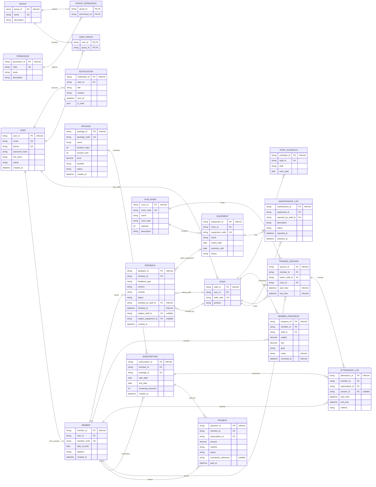

# Database

## ERD (Mermaid)



## Mô tả về các thực thể và các quan hệ

### 1. Danh sách bảng

Hệ thống gồm 19 bảng, được nhóm theo chủ đề nghiệp vụ như sau:

| STT | Nhóm | Bảng (DDL) | Thực thể (ERD) | Ý nghĩa |
|----:|------|------------|----------------|---------|
| 1 | Tài khoản | `users` | `USER` | Tài khoản hệ thống dùng để đăng nhập và phân quyền. |
| 2 | Tài khoản | `members` | `MEMBER` | Hồ sơ hội viên, gắn 1-1 với `USER`. |
| 3 | Tài khoản | `staff` | `STAFF` | Hồ sơ nhân sự / huấn luyện viên (PT), gắn 1-1 với `USER`. |
| 4 | Phân quyền | `groups` | `GROUP` | Nhóm quyền (role) của hệ thống. |
| 5 | Phân quyền | `permissions` | `PERMISSION` | Danh mục chức năng / quyền hạn. |
| 6 | Phân quyền | `user_groups` | `USER_GROUP` | Bảng nối N:N giữa người dùng và nhóm quyền. |
| 7 | Phân quyền | `group_permissions` | `GROUP_PERMISSION` | Bảng nối N:N giữa nhóm quyền và quyền hạn. |
| 8 | Gói tập & Thanh toán | `packages` | `PACKAGE` | Danh mục gói tập / dịch vụ. |
| 9 | Gói tập & Thanh toán | `subscriptions` | `SUBSCRIPTION` | Đăng ký / gia hạn gói tập của hội viên. |
| 10 | Gói tập & Thanh toán | `payments` | `PAYMENT` | Giao dịch thanh toán cho gói tập. |
| 11 | Cơ sở vật chất | `gym_rooms` | `GYM_ROOM` | Phòng tập của trung tâm. |
| 12 | Cơ sở vật chất | `equipment` | `EQUIPMENT` | Thiết bị thuộc các phòng tập. |
| 13 | Cơ sở vật chất | `maintenance_logs` | `MAINTENANCE_LOG` | Nhật ký bảo trì / sửa chữa thiết bị. |
| 14 | Lịch tập & Ghi nhận | `training_sessions` | `TRAINING_SESSION` | Lịch tập / phiên tập giữa hội viên và PT. |
| 15 | Lịch tập & Ghi nhận | `attendance_logs` | `ATTENDANCE_LOG` | Bản ghi check-in / check-out của hội viên. |
| 16 | Lịch tập & Ghi nhận | `member_progress` | `MEMBER_PROGRESS` | Chỉ số tiến độ tập luyện do PT ghi nhận. |
| 17 | Khác | `feedback` | `FEEDBACK` | Phản hồi của hội viên về dịch vụ / nhân sự / thiết bị. |
| 18 | Khác | `notifications` | `NOTIFICATION` | Thông báo hệ thống gửi đến người dùng. |
| 19 | Khác | `staff_schedules` | `STAFF_SCHEDULE` | Lịch làm việc của nhân sự theo ca. |

### 2. Thực thể và thuộc tính

Phần này mô tả chi tiết từng thực thể. Cột `Khóa` quy ước: `PK` = khóa chính, `FK` = khóa ngoại, `UK` = ràng buộc duy nhất (UNIQUE). Cột `Kiểu` lấy theo DDL PostgreSQL ở mục bên dưới.

#### 2.1. Nhóm Tài khoản

##### `USER` (`users`)

| Thuộc tính | Kiểu | Khóa | Ý nghĩa |
|------------|------|------|---------|
| `user_id` | `BIGINT` | PK | Định danh duy nhất của tài khoản. |
| `email` | `VARCHAR(255)` | UK | Địa chỉ email, dùng để đăng nhập. |
| `phone` | `VARCHAR(20)` | UK | Số điện thoại liên hệ, có thể dùng để đăng nhập / liên lạc. |
| `password_hash` | `VARCHAR(255)` |  | Mật khẩu đã được băm để lưu trữ an toàn. |
| `full_name` | `VARCHAR(200)` |  | Họ và tên đầy đủ của người dùng. |
| `status` | `user_status` |  | Trạng thái tài khoản: `active`, `locked`. |
| `created_at` | `TIMESTAMP` |  | Thời điểm bản ghi được tạo. |

##### `MEMBER` (`members`)

| Thuộc tính | Kiểu | Khóa | Ý nghĩa |
|------------|------|------|---------|
| `member_id` | `BIGINT` | PK | Định danh duy nhất của hội viên. |
| `user_id` | `BIGINT` | FK → `users.user_id`, UK | Liên kết 1-1 tới tài khoản. |
| `member_code` | `VARCHAR(30)` | UK | Mã hội viên nội bộ (thẻ thành viên). |
| `date_of_birth` | `DATE` |  | Ngày sinh hội viên. |
| `address` | `VARCHAR(200)` |  | Địa chỉ liên hệ. |
| `created_at` | `TIMESTAMP` |  | Thời điểm bản ghi được tạo. |

##### `STAFF` (`staff`)

| Thuộc tính | Kiểu | Khóa | Ý nghĩa |
|------------|------|------|---------|
| `staff_id` | `BIGINT` | PK | Định danh duy nhất của nhân sự. |
| `user_id` | `BIGINT` | FK → `users.user_id`, UK | Liên kết 1-1 tới tài khoản. |
| `staff_code` | `VARCHAR(30)` | UK | Mã nhân sự nội bộ. |
| `position` | `VARCHAR(50)` |  | Chức vụ / vị trí công việc (ví dụ: PT, lễ tân, quản lý). |

#### 2.2. Nhóm Phân quyền

##### `GROUP` (`groups`)

| Thuộc tính | Kiểu | Khóa | Ý nghĩa |
|------------|------|------|---------|
| `group_id` | `BIGINT` | PK | Định danh nhóm quyền. |
| `name` | `VARCHAR(100)` | UK | Tên nhóm quyền (ví dụ: `admin`, `trainer`, `member`). |
| `description` | `VARCHAR(255)` |  | Mô tả nhóm quyền. |

##### `PERMISSION` (`permissions`)

| Thuộc tính | Kiểu | Khóa | Ý nghĩa |
|------------|------|------|---------|
| `permission_id` | `BIGINT` | PK | Định danh quyền. |
| `code` | `VARCHAR(50)` | UK | Mã quyền dùng trong code (ví dụ: `member.create`). |
| `name` | `VARCHAR(100)` |  | Tên quyền hiển thị. |
| `description` | `VARCHAR(255)` |  | Mô tả quyền. |

##### `USER_GROUP` (`user_groups`)

| Thuộc tính | Kiểu | Khóa | Ý nghĩa |
|------------|------|------|---------|
| `user_id` | `BIGINT` | PK, FK → `users.user_id` | Tham chiếu tới người dùng. |
| `group_id` | `BIGINT` | PK, FK → `groups.group_id` | Tham chiếu tới nhóm quyền. |

##### `GROUP_PERMISSION` (`group_permissions`)

| Thuộc tính | Kiểu | Khóa | Ý nghĩa |
|------------|------|------|---------|
| `group_id` | `BIGINT` | PK, FK → `groups.group_id` | Tham chiếu tới nhóm quyền. |
| `permission_id` | `BIGINT` | PK, FK → `permissions.permission_id` | Tham chiếu tới quyền. |

#### 2.3. Nhóm Gói tập & Thanh toán

##### `PACKAGE` (`packages`)

| Thuộc tính | Kiểu | Khóa | Ý nghĩa |
|------------|------|------|---------|
| `package_id` | `BIGINT` | PK | Định danh gói tập. |
| `package_code` | `VARCHAR(30)` | UK | Mã gói tập dùng để hiển thị / tra cứu. |
| `name` | `VARCHAR(100)` |  | Tên gói tập. |
| `duration_days` | `INT` |  | Số ngày hiệu lực của gói. |
| `session_limit` | `INT` |  | Số buổi tập tối đa của gói. |
| `price` | `DECIMAL(12,2)` |  | Đơn giá của gói. |
| `benefits` | `VARCHAR(255)` |  | Quyền lợi đi kèm (mô tả ngắn). |
| `status` | `package_status` |  | Trạng thái gói: `active`, `inactive`. |
| `created_at` | `TIMESTAMP` |  | Thời điểm bản ghi được tạo. |

##### `SUBSCRIPTION` (`subscriptions`)

| Thuộc tính | Kiểu | Khóa | Ý nghĩa |
|------------|------|------|---------|
| `subscription_id` | `BIGINT` | PK | Định danh lượt đăng ký gói. |
| `member_id` | `BIGINT` | FK → `members.member_id` | Hội viên sở hữu đăng ký. |
| `package_id` | `BIGINT` | FK → `packages.package_id` | Gói tập được đăng ký. |
| `start_date` | `DATE` |  | Ngày bắt đầu hiệu lực. |
| `end_date` | `DATE` |  | Ngày kết thúc hiệu lực. |
| `remaining_sessions` | `INT` |  | Số buổi tập còn lại của gói. |
| `created_at` | `TIMESTAMP` |  | Thời điểm bản ghi được tạo. |

##### `PAYMENT` (`payments`)

| Thuộc tính | Kiểu | Khóa | Ý nghĩa |
|------------|------|------|---------|
| `payment_id` | `BIGINT` | PK | Định danh giao dịch thanh toán. |
| `member_id` | `BIGINT` | FK → `members.member_id` | Hội viên thực hiện thanh toán. |
| `subscription_id` | `BIGINT` | FK → `subscriptions.subscription_id` | Đăng ký gói mà giao dịch áp dụng. |
| `amount` | `DECIMAL(12,2)` |  | Số tiền giao dịch. |
| `method` | `payment_method` |  | Phương thức: `cash`, `bank_card`, `ewallet`. |
| `status` | `payment_status` |  | Trạng thái: `success`, `failed`. |
| `transaction_reference` | `VARCHAR(100)` |  | Mã giao dịch do cổng thanh toán cấp; `NULL` với phương thức tiền mặt. |
| `paid_at` | `TIMESTAMP` |  | Thời điểm thanh toán. |

#### 2.4. Nhóm Cơ sở vật chất

##### `GYM_ROOM` (`gym_rooms`)

| Thuộc tính | Kiểu | Khóa | Ý nghĩa |
|------------|------|------|---------|
| `room_id` | `BIGINT` | PK | Định danh phòng tập. |
| `room_code` | `VARCHAR(30)` | UK | Mã phòng tập. |
| `name` | `VARCHAR(100)` |  | Tên phòng. |
| `room_type` | `VARCHAR(50)` |  | Loại phòng (ví dụ: cardio, yoga, tạ tự do). |
| `capacity` | `INT` |  | Sức chứa tối đa. |
| `description` | `VARCHAR(255)` |  | Mô tả thêm. |

##### `EQUIPMENT` (`equipment`)

| Thuộc tính | Kiểu | Khóa | Ý nghĩa |
|------------|------|------|---------|
| `equipment_id` | `BIGINT` | PK | Định danh thiết bị. |
| `room_id` | `BIGINT` | FK → `gym_rooms.room_id` | Phòng chứa thiết bị. |
| `equipment_code` | `VARCHAR(30)` | UK | Mã thiết bị. |
| `name` | `VARCHAR(100)` |  | Tên thiết bị. |
| `import_date` | `DATE` |  | Ngày nhập thiết bị. |
| `warranty_until` | `DATE` |  | Ngày hết hạn bảo hành. |
| `status` | `equipment_status` |  | Trạng thái: `active`, `broken`, `repairing`, `retired`. |

##### `MAINTENANCE_LOG` (`maintenance_logs`)

| Thuộc tính | Kiểu | Khóa | Ý nghĩa |
|------------|------|------|---------|
| `maintenance_id` | `BIGINT` | PK | Định danh phiếu bảo trì. |
| `equipment_id` | `BIGINT` | FK → `equipment.equipment_id` | Thiết bị cần bảo trì. |
| `reported_by_staff_id` | `BIGINT` | FK → `staff.staff_id` | Nhân sự báo lỗi / lập phiếu. |
| `description` | `TEXT` |  | Mô tả sự cố / nội dung bảo trì. |
| `status` | `maintenance_status` |  | Trạng thái: `reported`, `repairing`, `resolved`, `failed`. |
| `reported_at` | `TIMESTAMP` |  | Thời điểm báo sự cố. |
| `resolved_at` | `TIMESTAMP` |  | Thời điểm xử lý xong (có thể trống). |

#### 2.5. Nhóm Lịch tập & Ghi nhận

##### `TRAINING_SESSION` (`training_sessions`)

| Thuộc tính | Kiểu | Khóa | Ý nghĩa |
|------------|------|------|---------|
| `session_id` | `BIGINT` | PK | Định danh phiên tập. |
| `member_id` | `BIGINT` | FK → `members.member_id` | Hội viên tham gia phiên tập. |
| `trainer_staff_id` | `BIGINT` | FK → `staff.staff_id` | PT phụ trách phiên tập. |
| `room_id` | `BIGINT` | FK → `gym_rooms.room_id` | Phòng diễn ra phiên tập. |
| `start_time` | `TIMESTAMP` |  | Thời điểm bắt đầu phiên tập theo lịch. |
| `end_time` | `TIMESTAMP` |  | Thời điểm kết thúc phiên tập theo lịch. |

##### `ATTENDANCE_LOG` (`attendance_logs`)

| Thuộc tính | Kiểu | Khóa | Ý nghĩa |
|------------|------|------|---------|
| `attendance_id` | `BIGINT` | PK | Định danh bản ghi chấm công. |
| `member_id` | `BIGINT` | FK → `members.member_id` | Hội viên check-in. |
| `subscription_id` | `BIGINT` | FK → `subscriptions.subscription_id` | Gói đăng ký bị trừ buổi. |
| `session_id` | `BIGINT` | FK → `training_sessions.session_id` (nullable) | Phiên tập tương ứng nếu có lịch hẹn PT; `NULL` khi hội viên tập tự do. |
| `start_time` | `TIMESTAMP` |  | Thời điểm check-in. |
| `end_time` | `TIMESTAMP` |  | Thời điểm check-out (có thể trống). |
| `method` | `attendance_method` |  | Cách ghi nhận: `realtime`, `manual`, `qr`. |

##### `MEMBER_PROGRESS` (`member_progress`)

| Thuộc tính | Kiểu | Khóa | Ý nghĩa |
|------------|------|------|---------|
| `progress_id` | `BIGINT` | PK | Định danh bản ghi tiến độ. |
| `member_id` | `BIGINT` | FK → `members.member_id` | Hội viên được đánh giá. |
| `staff_id` | `BIGINT` | FK → `staff.staff_id` | PT thực hiện đánh giá. |
| `weight` | `DECIMAL(6,2)` |  | Cân nặng tại thời điểm đo (kg). |
| `bmi` | `DECIMAL(5,2)` |  | Chỉ số khối cơ thể (BMI). |
| `goal` | `VARCHAR(255)` |  | Mục tiêu tập luyện. |
| `notes` | `TEXT` |  | Ghi chú thêm của PT. |
| `recorded_at` | `TIMESTAMP` |  | Thời điểm ghi nhận chỉ số. |

#### 2.6. Nhóm Khác

##### `FEEDBACK` (`feedback`)

| Thuộc tính | Kiểu | Khóa | Ý nghĩa |
|------------|------|------|---------|
| `feedback_id` | `BIGINT` | PK | Định danh phản hồi. |
| `member_id` | `BIGINT` | FK → `members.member_id` | Hội viên gửi phản hồi. |
| `feedback_type` | `feedback_type` |  | Loại phản hồi: `staff`, `equipment`, `service`. |
| `content` | `TEXT` |  | Nội dung phản hồi. |
| `severity` | `feedback_severity` |  | Mức độ: `low`, `medium`, `high`. |
| `status` | `feedback_status` |  | Trạng thái xử lý: `open`, `in_progress`, `resolved`. |
| `handled_by_staff_id` | `BIGINT` | FK → `staff.staff_id` | Nhân sự xử lý (có thể trống). |
| `handled_at` | `TIMESTAMP` |  | Thời điểm hoàn tất xử lý (có thể trống). |
| `subject_staff_id` | `BIGINT` | FK → `staff.staff_id` (nullable) | Nhân sự bị phản hồi (chỉ khi `feedback_type = 'staff'`). |
| `subject_equipment_id` | `BIGINT` | FK → `equipment.equipment_id` (nullable) | Thiết bị bị phản hồi (chỉ khi `feedback_type = 'equipment'`). |
| `created_at` | `TIMESTAMP` |  | Thời điểm hội viên gửi phản hồi, dùng để tính SLA xử lý theo `severity`. |

Ràng buộc CHECK ở DB đảm bảo `subject_staff_id` / `subject_equipment_id` khớp với `feedback_type` (loại `staff` phải có `subject_staff_id`, loại `equipment` phải có `subject_equipment_id`, loại `service` thì cả hai đều NULL).

##### `NOTIFICATION` (`notifications`)

| Thuộc tính | Kiểu | Khóa | Ý nghĩa |
|------------|------|------|---------|
| `notification_id` | `BIGINT` | PK | Định danh thông báo. |
| `user_id` | `BIGINT` | FK → `users.user_id` | Người dùng nhận thông báo. |
| `title` | `VARCHAR(200)` |  | Tiêu đề thông báo. |
| `content` | `TEXT` |  | Nội dung thông báo. |
| `sent_at` | `TIMESTAMP` |  | Thời điểm gửi. |
| `is_read` | `BOOLEAN` |  | Đã đọc hay chưa (mặc định `FALSE`). |

##### `STAFF_SCHEDULE` (`staff_schedules`)

| Thuộc tính | Kiểu | Khóa | Ý nghĩa |
|------------|------|------|---------|
| `schedule_id` | `BIGINT` | PK | Định danh dòng lịch làm việc. |
| `staff_id` | `BIGINT` | FK → `staff.staff_id` | Nhân sự được phân ca. |
| `shift` | `staff_shift` |  | Ca làm việc: `morning`, `afternoon`, `evening`. |
| `work_date` | `DATE` |  | Ngày làm việc. |

### 3. Liên kết giữa các thực thể

Bảng dưới đây tổng hợp toàn bộ quan hệ trong ERD. Ký hiệu lực lượng (cardinality) theo chuẩn ERD: `1 : 0..1` (một - không hoặc một), `1 : N` (một - nhiều), `N : 0..1` (nhiều - không hoặc một), `N : N` (nhiều - nhiều).

| # | Thực thể A | Thực thể B | Khóa ngoại / Bảng nối | Loại quan hệ | Mô tả |
|--:|------------|------------|-----------------------|--------------|-------|
| 1 | `USER` | `MEMBER` | `members.user_id` (UNIQUE) | 1 : 0..1 | Mỗi `USER` có tối đa một hồ sơ `MEMBER`. |
| 2 | `USER` | `STAFF` | `staff.user_id` (UNIQUE) | 1 : 0..1 | Mỗi `USER` có tối đa một hồ sơ `STAFF`. |
| 3 | `USER` | `GROUP` | `user_groups` | N : N | Một user thuộc nhiều nhóm; một nhóm có nhiều user. |
| 4 | `GROUP` | `PERMISSION` | `group_permissions` | N : N | Một nhóm có nhiều quyền; một quyền thuộc nhiều nhóm. |
| 5 | `MEMBER` | `SUBSCRIPTION` | `subscriptions.member_id` | 1 : N | Một hội viên có nhiều lượt đăng ký gói. |
| 6 | `PACKAGE` | `SUBSCRIPTION` | `subscriptions.package_id` | 1 : N | Một gói được nhiều hội viên đăng ký. |
| 7 | `SUBSCRIPTION` | `PAYMENT` | `payments.subscription_id` | 1 : N | Một đăng ký có thể phát sinh nhiều giao dịch thanh toán. |
| 8 | `MEMBER` | `PAYMENT` | `payments.member_id` | 1 : N | Một hội viên có nhiều giao dịch thanh toán. |
| 9 | `GYM_ROOM` | `EQUIPMENT` | `equipment.room_id` | 1 : N | Một phòng tập chứa nhiều thiết bị. |
| 10 | `EQUIPMENT` | `MAINTENANCE_LOG` | `maintenance_logs.equipment_id` | 1 : N | Một thiết bị có nhiều lần bảo trì. |
| 11 | `STAFF` | `MAINTENANCE_LOG` | `maintenance_logs.reported_by_staff_id` | 1 : N | Một nhân sự có thể lập nhiều phiếu bảo trì. |
| 12 | `MEMBER` | `TRAINING_SESSION` | `training_sessions.member_id` | 1 : N | Một hội viên tham gia nhiều phiên tập. |
| 13 | `STAFF` | `TRAINING_SESSION` | `training_sessions.trainer_staff_id` | 1 : N | Một PT hướng dẫn nhiều phiên tập. |
| 14 | `GYM_ROOM` | `TRAINING_SESSION` | `training_sessions.room_id` | 1 : N | Một phòng diễn ra nhiều phiên tập. |
| 15 | `TRAINING_SESSION` | `ATTENDANCE_LOG` | `attendance_logs.session_id` (nullable) | 1 : 0..N | Một phiên tập có thể có nhiều bản ghi chấm công; bản ghi tập tự do không gắn với phiên nào (`session_id` = NULL). |
| 16 | `MEMBER` | `ATTENDANCE_LOG` | `attendance_logs.member_id` | 1 : N | Một hội viên có nhiều bản ghi chấm công. |
| 17 | `SUBSCRIPTION` | `ATTENDANCE_LOG` | `attendance_logs.subscription_id` | 1 : N | Một gói đăng ký bị tiêu thụ qua nhiều bản ghi. |
| 18 | `MEMBER` | `MEMBER_PROGRESS` | `member_progress.member_id` | 1 : N | Một hội viên có nhiều lần đánh giá tiến độ. |
| 19 | `STAFF` | `MEMBER_PROGRESS` | `member_progress.staff_id` | 1 : N | Một PT ghi nhận tiến độ cho nhiều hội viên. |
| 20 | `MEMBER` | `FEEDBACK` | `feedback.member_id` | 1 : N | Một hội viên gửi nhiều phản hồi. |
| 21 | `FEEDBACK` | `STAFF` | `feedback.handled_by_staff_id` (nullable) | N : 0..1 | Mỗi phản hồi do tối đa một nhân sự xử lý; có thể chưa xử lý. |
| 22 | `FEEDBACK` | `STAFF` | `feedback.subject_staff_id` (nullable) | N : 0..1 | Nhân sự là đối tượng của phản hồi loại `staff`. |
| 23 | `FEEDBACK` | `EQUIPMENT` | `feedback.subject_equipment_id` (nullable) | N : 0..1 | Thiết bị là đối tượng của phản hồi loại `equipment`. |
| 24 | `USER` | `NOTIFICATION` | `notifications.user_id` | 1 : N | Một user nhận nhiều thông báo. |
| 25 | `STAFF` | `STAFF_SCHEDULE` | `staff_schedules.staff_id` | 1 : N | Một nhân sự có nhiều dòng lịch làm việc. |

## Enum types (PostgreSQL)

```sql
CREATE TYPE user_status AS ENUM ('active', 'locked');
CREATE TYPE package_status AS ENUM ('active', 'inactive');
CREATE TYPE payment_method AS ENUM ('cash', 'bank_card', 'ewallet');
CREATE TYPE payment_status AS ENUM ('success', 'failed');
CREATE TYPE equipment_status AS ENUM ('active', 'broken', 'repairing', 'retired');
CREATE TYPE maintenance_status AS ENUM ('reported', 'repairing', 'resolved', 'failed');
CREATE TYPE feedback_type AS ENUM ('staff', 'equipment', 'service');
CREATE TYPE feedback_severity AS ENUM ('low', 'medium', 'high');
CREATE TYPE feedback_status AS ENUM ('open', 'in_progress', 'resolved');
CREATE TYPE attendance_method AS ENUM ('realtime', 'manual', 'qr');
CREATE TYPE staff_shift AS ENUM ('morning', 'afternoon', 'evening');
```

## ALTER TABLE (migrate to enum types)

```sql
-- Assumes existing values already match the enum labels.
ALTER TABLE users ALTER COLUMN status TYPE user_status USING status::user_status;

ALTER TABLE packages ALTER COLUMN status TYPE package_status USING status::package_status;

ALTER TABLE payments
    ALTER COLUMN method TYPE payment_method USING method::payment_method,
    ALTER COLUMN status TYPE payment_status USING status::payment_status;

ALTER TABLE equipment ALTER COLUMN status TYPE equipment_status USING status::equipment_status;

ALTER TABLE maintenance_logs
    ALTER COLUMN status TYPE maintenance_status USING status::maintenance_status;

ALTER TABLE attendance_logs
    ALTER COLUMN method TYPE attendance_method USING method::attendance_method;

ALTER TABLE feedback
    ALTER COLUMN feedback_type TYPE feedback_type USING feedback_type::feedback_type,
    ALTER COLUMN severity TYPE feedback_severity USING severity::feedback_severity,
    ALTER COLUMN status TYPE feedback_status USING status::feedback_status;

ALTER TABLE staff_schedules
    ALTER COLUMN shift TYPE staff_shift USING shift::staff_shift;
```

## SQL schema (DDL)

Table name dung snake_case, map tu ten entity trong ERD. DDL duoi day dung SQL kieu PostgreSQL.

```sql
CREATE TABLE users (
    user_id BIGINT GENERATED BY DEFAULT AS IDENTITY PRIMARY KEY,
    email VARCHAR(255) NOT NULL UNIQUE,
    phone VARCHAR(20) UNIQUE,
    password_hash VARCHAR(255) NOT NULL,
    full_name VARCHAR(200) NOT NULL,
    status user_status NOT NULL,
    created_at TIMESTAMP NOT NULL DEFAULT NOW()
);

CREATE TABLE members (
    member_id BIGINT GENERATED BY DEFAULT AS IDENTITY PRIMARY KEY,
    user_id BIGINT NOT NULL UNIQUE,
    member_code VARCHAR(30) NOT NULL UNIQUE,
    date_of_birth DATE NOT NULL,
    address VARCHAR(200),
    created_at TIMESTAMP NOT NULL DEFAULT NOW(),
    CONSTRAINT fk_members_user
        FOREIGN KEY (user_id) REFERENCES users(user_id)
);

CREATE TABLE staff (
    staff_id BIGINT GENERATED BY DEFAULT AS IDENTITY PRIMARY KEY,
    user_id BIGINT NOT NULL UNIQUE,
    staff_code VARCHAR(30) NOT NULL UNIQUE,
    position VARCHAR(50) NOT NULL,
    CONSTRAINT fk_staff_user
        FOREIGN KEY (user_id) REFERENCES users(user_id)
);

CREATE TABLE groups (
    group_id BIGINT GENERATED BY DEFAULT AS IDENTITY PRIMARY KEY,
    name VARCHAR(100) NOT NULL UNIQUE,
    description VARCHAR(255)
);

CREATE TABLE permissions (
    permission_id BIGINT GENERATED BY DEFAULT AS IDENTITY PRIMARY KEY,
    code VARCHAR(50) NOT NULL UNIQUE,
    name VARCHAR(100) NOT NULL,
    description VARCHAR(255)
);

CREATE TABLE user_groups (
    user_id BIGINT NOT NULL,
    group_id BIGINT NOT NULL,
    PRIMARY KEY (user_id, group_id),
    CONSTRAINT fk_user_groups_user
        FOREIGN KEY (user_id) REFERENCES users(user_id) ON DELETE CASCADE,
    CONSTRAINT fk_user_groups_group
        FOREIGN KEY (group_id) REFERENCES groups(group_id) ON DELETE CASCADE
);

CREATE TABLE group_permissions (
    group_id BIGINT NOT NULL,
    permission_id BIGINT NOT NULL,
    PRIMARY KEY (group_id, permission_id),
    CONSTRAINT fk_group_permissions_group
        FOREIGN KEY (group_id) REFERENCES groups(group_id) ON DELETE CASCADE,
    CONSTRAINT fk_group_permissions_permission
        FOREIGN KEY (permission_id) REFERENCES permissions(permission_id) ON DELETE CASCADE
);

CREATE TABLE packages (
    package_id BIGINT GENERATED BY DEFAULT AS IDENTITY PRIMARY KEY,
    package_code VARCHAR(30) NOT NULL UNIQUE,
    name VARCHAR(100) NOT NULL,
    duration_days INT NOT NULL,
    session_limit INT NOT NULL,
    price DECIMAL(12,2) NOT NULL,
    benefits VARCHAR(255),
    status package_status NOT NULL,
    created_at TIMESTAMP NOT NULL DEFAULT NOW()
);

CREATE TABLE subscriptions (
    subscription_id BIGINT GENERATED BY DEFAULT AS IDENTITY PRIMARY KEY,
    member_id BIGINT NOT NULL,
    package_id BIGINT NOT NULL,
    start_date DATE NOT NULL,
    end_date DATE NOT NULL,
    remaining_sessions INT NOT NULL,
    created_at TIMESTAMP NOT NULL DEFAULT NOW(),
    CONSTRAINT fk_subscriptions_member
        FOREIGN KEY (member_id) REFERENCES members(member_id),
    CONSTRAINT fk_subscriptions_package
        FOREIGN KEY (package_id) REFERENCES packages(package_id)
);

CREATE TABLE payments (
    payment_id BIGINT GENERATED BY DEFAULT AS IDENTITY PRIMARY KEY,
    member_id BIGINT NOT NULL,
    subscription_id BIGINT NOT NULL,
    amount DECIMAL(12,2) NOT NULL,
    method payment_method NOT NULL,
    status payment_status NOT NULL,
    transaction_reference VARCHAR(100),
    paid_at TIMESTAMP NOT NULL,
    CONSTRAINT fk_payments_member
        FOREIGN KEY (member_id) REFERENCES members(member_id),
    CONSTRAINT fk_payments_subscription
        FOREIGN KEY (subscription_id) REFERENCES subscriptions(subscription_id)
);

CREATE TABLE gym_rooms (
    room_id BIGINT GENERATED BY DEFAULT AS IDENTITY PRIMARY KEY,
    room_code VARCHAR(30) NOT NULL UNIQUE,
    name VARCHAR(100) NOT NULL,
    room_type VARCHAR(50),
    capacity INT NOT NULL,
    description VARCHAR(255)
);

CREATE TABLE equipment (
    equipment_id BIGINT GENERATED BY DEFAULT AS IDENTITY PRIMARY KEY,
    room_id BIGINT NOT NULL,
    equipment_code VARCHAR(30) NOT NULL UNIQUE,
    name VARCHAR(100) NOT NULL,
    import_date DATE NOT NULL,
    warranty_until DATE,
    status equipment_status NOT NULL,
    CONSTRAINT fk_equipment_room
        FOREIGN KEY (room_id) REFERENCES gym_rooms(room_id)
);

CREATE TABLE maintenance_logs (
    maintenance_id BIGINT GENERATED BY DEFAULT AS IDENTITY PRIMARY KEY,
    equipment_id BIGINT NOT NULL,
    reported_by_staff_id BIGINT NOT NULL,
    description TEXT NOT NULL,
    status maintenance_status NOT NULL,
    reported_at TIMESTAMP NOT NULL,
    resolved_at TIMESTAMP,
    CONSTRAINT fk_maintenance_equipment
        FOREIGN KEY (equipment_id) REFERENCES equipment(equipment_id),
    CONSTRAINT fk_maintenance_staff
        FOREIGN KEY (reported_by_staff_id) REFERENCES staff(staff_id)
);

CREATE TABLE training_sessions (
    session_id BIGINT GENERATED BY DEFAULT AS IDENTITY PRIMARY KEY,
    member_id BIGINT NOT NULL,
    trainer_staff_id BIGINT NOT NULL,
    room_id BIGINT NOT NULL,
    start_time TIMESTAMP NOT NULL,
    end_time TIMESTAMP NOT NULL,
    CONSTRAINT fk_sessions_member
        FOREIGN KEY (member_id) REFERENCES members(member_id),
    CONSTRAINT fk_sessions_trainer
        FOREIGN KEY (trainer_staff_id) REFERENCES staff(staff_id),
    CONSTRAINT fk_sessions_room
        FOREIGN KEY (room_id) REFERENCES gym_rooms(room_id)
);

CREATE TABLE attendance_logs (
    attendance_id BIGINT GENERATED BY DEFAULT AS IDENTITY PRIMARY KEY,
    member_id BIGINT NOT NULL,
    subscription_id BIGINT NOT NULL,
    session_id BIGINT,
    start_time TIMESTAMP NOT NULL,
    end_time TIMESTAMP,
    method attendance_method,
    CONSTRAINT fk_attendance_member
        FOREIGN KEY (member_id) REFERENCES members(member_id),
    CONSTRAINT fk_attendance_subscription
        FOREIGN KEY (subscription_id) REFERENCES subscriptions(subscription_id),
    CONSTRAINT fk_attendance_session
        FOREIGN KEY (session_id) REFERENCES training_sessions(session_id)
);

CREATE TABLE member_progress (
    progress_id BIGINT GENERATED BY DEFAULT AS IDENTITY PRIMARY KEY,
    member_id BIGINT NOT NULL,
    staff_id BIGINT NOT NULL,
    weight DECIMAL(6,2),
    bmi DECIMAL(5,2),
    goal VARCHAR(255),
    notes TEXT,
    recorded_at TIMESTAMP NOT NULL,
    CONSTRAINT fk_progress_member
        FOREIGN KEY (member_id) REFERENCES members(member_id),
    CONSTRAINT fk_progress_staff
        FOREIGN KEY (staff_id) REFERENCES staff(staff_id)
);

CREATE TABLE feedback (
    feedback_id BIGINT GENERATED BY DEFAULT AS IDENTITY PRIMARY KEY,
    member_id BIGINT NOT NULL,
    feedback_type feedback_type NOT NULL,
    content TEXT NOT NULL,
    severity feedback_severity,
    status feedback_status,
    handled_by_staff_id BIGINT,
    handled_at TIMESTAMP,
    subject_staff_id BIGINT,
    subject_equipment_id BIGINT,
    created_at TIMESTAMP NOT NULL DEFAULT NOW(),
    CONSTRAINT fk_feedback_member
        FOREIGN KEY (member_id) REFERENCES members(member_id),
    CONSTRAINT fk_feedback_staff
        FOREIGN KEY (handled_by_staff_id) REFERENCES staff(staff_id),
    CONSTRAINT fk_feedback_subject_staff
        FOREIGN KEY (subject_staff_id) REFERENCES staff(staff_id),
    CONSTRAINT fk_feedback_subject_equipment
        FOREIGN KEY (subject_equipment_id) REFERENCES equipment(equipment_id),
    CONSTRAINT chk_feedback_subject
        CHECK (
            (feedback_type = 'staff'     AND subject_staff_id IS NOT NULL AND subject_equipment_id IS NULL)
         OR (feedback_type = 'equipment' AND subject_equipment_id IS NOT NULL AND subject_staff_id IS NULL)
         OR (feedback_type = 'service'   AND subject_staff_id IS NULL AND subject_equipment_id IS NULL)
        )
);

CREATE TABLE notifications (
    notification_id BIGINT GENERATED BY DEFAULT AS IDENTITY PRIMARY KEY,
    user_id BIGINT NOT NULL,
    title VARCHAR(200) NOT NULL,
    content TEXT NOT NULL,
    sent_at TIMESTAMP NOT NULL,
    is_read BOOLEAN NOT NULL DEFAULT FALSE,
    CONSTRAINT fk_notifications_user
        FOREIGN KEY (user_id) REFERENCES users(user_id)
);

CREATE TABLE staff_schedules (
    schedule_id BIGINT GENERATED BY DEFAULT AS IDENTITY PRIMARY KEY,
    staff_id BIGINT NOT NULL,
    shift staff_shift NOT NULL,
    work_date DATE NOT NULL,
    CONSTRAINT fk_schedules_staff
        FOREIGN KEY (staff_id) REFERENCES staff(staff_id)
);
```

