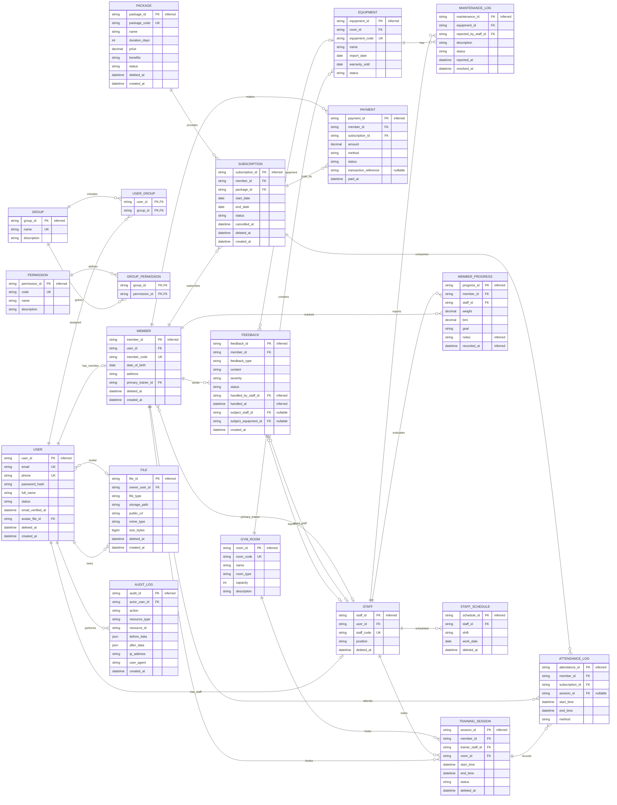

# Database Design — Gym Management System

| Field | Value |
|---|---|
| Document ID | `GMS-DB-DESIGN-001` |
| Version | 1.0.0 |
| Status | Draft |
| Last Updated | 2026-05-16 |
| Author | TBD |
| Reviewers | TBD |
| Related docs | `SRS_VI.md`, `Architecture.md` |

## Overview

Tài liệu mô tả thiết kế database PostgreSQL cho hệ thống quản lý gym (v1.0). Phạm vi: 20 bảng nghiệp vụ + 1 bảng phụ trợ `otp_codes` (schema quản lý trong Prisma codebase). Mục tiêu:

- Cung cấp ERD, mô tả thực thể, ràng buộc, DDL cuối cùng để team backend implement Prisma schema.
- Chốt convention dùng chung: code generation, soft/hard delete, currency, timezone, external device auth, phone UNIQUE+NULL.
- Single tenant v1.0 (không có `branch_id`); single timezone (Asia/Ho_Chi_Minh) lưu UTC.

Tài liệu này KHÔNG bao gồm: API spec (xem module spec sau), background jobs (xem `Architecture.md`), security policy chi tiết (xem `.claude/rules/security.md`).

## Glossary

| Term | Định nghĩa |
|---|---|
| BIGSERIAL | Kiểu auto-increment 64-bit của PostgreSQL, tương đương `BIGINT GENERATED BY DEFAULT AS IDENTITY`. Project dùng cho mọi PK; Prisma map thành `BigInt`. |
| PK | Primary Key — khóa chính, định danh duy nhất bản ghi trong bảng. |
| FK | Foreign Key — khóa ngoại, tham chiếu PK của bảng khác. |
| UK | Unique Key — ràng buộc UNIQUE; cho phép nhiều NULL nếu cột nullable. |
| ERD | Entity Relationship Diagram — sơ đồ thực thể-quan hệ. |
| DDL | Data Definition Language — câu lệnh SQL định nghĩa schema (`CREATE TABLE`, `ALTER TABLE`...). |
| RBAC | Role-Based Access Control — phân quyền theo nhóm (xem bảng `groups`, `permissions`). |
| OTP | One-Time Password — mã xác thực dùng 1 lần, TTL 10 phút (xem `Architecture.md §3.x`). |
| RLS | Row Level Security — cơ chế phân quyền theo dòng của PostgreSQL/Supabase. |
| JSONB | Kiểu JSON binary của PostgreSQL — hỗ trợ index, query nhanh hơn `JSON`. |
| Soft delete | Đánh dấu xóa bằng `deleted_at IS NOT NULL`, không xóa thật khỏi DB. |
| Hard delete | Xóa thật bằng `DELETE FROM`. Áp dụng cho logs immutable và junction/catalog. |

## Table of Contents

- [ERD (Mermaid)](#erd-mermaid)
- [Entities (mo ta ngan)](#entities-mo-ta-ngan)
- [Relationships (1:N, N:N)](#relationships-1n-nn)
- [Enum types (PostgreSQL)](#enum-types-postgresql)
- [ALTER TABLE (migrate to enum types)](#alter-table-migrate-to-enum-types)
- [SQL schema (DDL)](#sql-schema-ddl)


## ERD (Mermaid)



## Mô tả về các thực thể và các quan hệ

### 1. Danh sách bảng

Hệ thống gồm **20 bảng nghiệp vụ** dưới đây, cộng thêm **1 bảng phụ trợ `otp_codes`** (lưu mã OTP cho reset password / verify email, TTL 10 phút, hard delete sau khi dùng). Bảng `otp_codes` không xuất hiện trong ERD/§1 này vì là internal — schema chi tiết quản lý trực tiếp trong Prisma codebase (`server/prisma/schema.prisma`).

| STT | Nhóm | Bảng (DDL) | Thực thể (ERD) | Ý nghĩa |
|----:|------|------------|----------------|---------|
| 1 | Tài khoản | `users` | `USER` | Tài khoản hệ thống dùng để đăng nhập và phân quyền. |
| 2 | Tài khoản | `members` | `MEMBER` | Hồ sơ hội viên, gắn 1-1 với `USER`. |
| 3 | Tài khoản | `staff` | `STAFF` | Hồ sơ nhân sự / huấn luyện viên (PT), gắn 1-1 với `USER`. |
| 4 | Phân quyền | `groups` | `GROUP` | Nhóm quyền (role) của hệ thống. |
| 5 | Phân quyền | `permissions` | `PERMISSION` | Danh mục chức năng / quyền hạn. |
| 6 | Phân quyền | `user_groups` | `USER_GROUP` | Bảng nối N:N giữa người dùng và nhóm quyền. |
| 7 | Phân quyền | `group_permissions` | `GROUP_PERMISSION` | Bảng nối N:N giữa nhóm quyền và quyền hạn. |
| 8 | Gói tập & Thanh toán | `packages` | `PACKAGE` | Danh mục gói tập / dịch vụ. |
| 9 | Gói tập & Thanh toán | `subscriptions` | `SUBSCRIPTION` | Đăng ký / gia hạn gói tập của hội viên. |
| 10 | Gói tập & Thanh toán | `payments` | `PAYMENT` | Giao dịch thanh toán cho gói tập. |
| 11 | Cơ sở vật chất | `gym_rooms` | `GYM_ROOM` | Phòng tập của trung tâm. |
| 12 | Cơ sở vật chất | `equipment` | `EQUIPMENT` | Thiết bị thuộc các phòng tập. |
| 13 | Cơ sở vật chất | `maintenance_logs` | `MAINTENANCE_LOG` | Nhật ký bảo trì / sửa chữa thiết bị. |
| 14 | Lịch tập & Ghi nhận | `training_sessions` | `TRAINING_SESSION` | Lịch tập / phiên tập giữa hội viên và PT. |
| 15 | Lịch tập & Ghi nhận | `attendance_logs` | `ATTENDANCE_LOG` | Bản ghi check-in / check-out của hội viên. |
| 16 | Lịch tập & Ghi nhận | `member_progress` | `MEMBER_PROGRESS` | Chỉ số tiến độ tập luyện do PT ghi nhận. |
| 17 | Khác | `feedback` | `FEEDBACK` | Phản hồi của hội viên về dịch vụ / nhân sự / thiết bị. |
| 18 | Khác | `staff_schedules` | `STAFF_SCHEDULE` | Lịch làm việc của nhân sự theo ca. |
| 19 | Khác | `audit_logs` | `AUDIT_LOG` | Nhật ký hoạt động — ai làm gì khi nào trên các resource nhạy cảm. |
| 20 | Khác | `files` | `FILE` | Metadata các file upload (avatar, document) lưu trên Supabase Storage. |

### 2. Thực thể và thuộc tính

Phần này mô tả chi tiết từng thực thể. Cột `Khóa` quy ước: `PK` = khóa chính, `FK` = khóa ngoại, `UK` = ràng buộc duy nhất (UNIQUE). Cột `Kiểu` lấy theo DDL PostgreSQL ở mục bên dưới.

**Convention chung (áp dụng cho mọi bảng — không lặp lại trong từng bảng):**

- PK `<entity>_id` kiểu `BIGINT GENERATED BY DEFAULT AS IDENTITY` (BIGSERIAL), server tự sinh.
- `created_at` `TIMESTAMP NOT NULL DEFAULT NOW()` (UTC, xem Timezone Convention).
- Bảng có soft delete: cột `deleted_at TIMESTAMP NULL` (xem Soft Delete Convention).

Attribute table phía dưới chỉ liệt kê các thuộc tính NGHIỆP VỤ (business attributes) — các cột boilerplate ở trên không lặp lại để giảm noise. Một số bảng vẫn giữ row `created_at`/`deleted_at` khi cột có ý nghĩa nghiệp vụ đặc biệt (vd: `feedback.created_at` dùng tính SLA, `audit_logs.created_at` là thời điểm action).

#### 2.1. Nhóm Tài khoản

##### `USER` (`users`)

| Thuộc tính | Kiểu | Khóa | Ý nghĩa |
|------------|------|------|---------|
| `user_id` | `BIGINT` | PK | Định danh duy nhất của tài khoản. |
| `email` | `VARCHAR(255)` | UK | Địa chỉ email, dùng để đăng nhập. |
| `phone` | `VARCHAR(20)` | UK | Số điện thoại liên hệ; nullable nhưng UNIQUE khi có giá trị (PostgreSQL coi nhiều NULL là khác nhau). |
| `password_hash` | `VARCHAR(255)` |  | Mật khẩu đã được băm (bcrypt/Argon2). |
| `full_name` | `VARCHAR(200)` |  | Họ và tên đầy đủ của người dùng. |
| `status` | `user_status` |  | Trạng thái tài khoản: `pending_verification` (chưa verify email), `active`, `locked`. Default `pending_verification`. |
| `email_verified_at` | `TIMESTAMP` |  | Thời điểm verify email thành công; `NULL` khi chưa verify. |
| `avatar_file_id` | `BIGINT` | FK → `files.file_id` (nullable) | Ảnh đại diện của user (xem bảng `FILE`). |
| `deleted_at` | `TIMESTAMP` |  | Soft delete; `NULL` = active, có giá trị = đã xóa logic. |
| `created_at` | `TIMESTAMP` |  | Thời điểm bản ghi được tạo. |

##### `MEMBER` (`members`)

| Thuộc tính | Kiểu | Khóa | Ý nghĩa |
|------------|------|------|---------|
| `member_id` | `BIGINT` | PK | Định danh duy nhất của hội viên. |
| `user_id` | `BIGINT` | FK → `users.user_id`, UK | Liên kết 1-1 tới tài khoản. |
| `member_code` | `VARCHAR(30)` | UK | Mã hội viên nội bộ, server tự sinh theo format `MEM-{YYYY}-{6 digits}`. |
| `date_of_birth` | `DATE` |  | Ngày sinh hội viên. |
| `address` | `VARCHAR(200)` |  | Địa chỉ liên hệ. |
| `primary_trainer_id` | `BIGINT` | FK → `staff.staff_id` (nullable) | PT cố định phụ trách hội viên. `NULL` khi chưa gán. |
| `deleted_at` | `TIMESTAMP` |  | Soft delete. |
| `created_at` | `TIMESTAMP` |  | Thời điểm bản ghi được tạo. |

##### `STAFF` (`staff`)

| Thuộc tính | Kiểu | Khóa | Ý nghĩa |
|------------|------|------|---------|
| `staff_id` | `BIGINT` | PK | Định danh duy nhất của nhân sự. |
| `user_id` | `BIGINT` | FK → `users.user_id`, UK | Liên kết 1-1 tới tài khoản. |
| `staff_code` | `VARCHAR(30)` | UK | Mã nhân sự nội bộ, server tự sinh theo format `STF-{YYYY}-{6 digits}`. |
| `position` | `VARCHAR(50)` |  | Chức vụ: `pt` (huấn luyện viên), `manager` (quản lý), `receptionist` (lễ tân), `technician` (kỹ thuật viên bảo trì). |
| `deleted_at` | `TIMESTAMP` |  | Soft delete. |

#### 2.2. Nhóm Phân quyền

##### `GROUP` (`groups`)

| Thuộc tính | Kiểu | Khóa | Ý nghĩa |
|------------|------|------|---------|
| `group_id` | `BIGINT` | PK | Định danh nhóm quyền. |
| `name` | `VARCHAR(100)` | UK | Tên nhóm quyền. Seed mặc định: `owner`, `staff`, `trainer`, `member`. |
| `description` | `VARCHAR(255)` |  | Mô tả nhóm quyền. |
| `deleted_at` | `TIMESTAMP` |  | Soft delete; nhóm seed mặc định không xóa được. |

##### `PERMISSION` (`permissions`)

| Thuộc tính | Kiểu | Khóa | Ý nghĩa |
|------------|------|------|---------|
| `permission_id` | `BIGINT` | PK | Định danh quyền. |
| `code` | `VARCHAR(50)` | UK | Mã quyền dùng trong code (ví dụ: `member.create`). |
| `name` | `VARCHAR(100)` |  | Tên quyền hiển thị. |
| `description` | `VARCHAR(255)` |  | Mô tả quyền. |

##### `USER_GROUP` (`user_groups`)

| Thuộc tính | Kiểu | Khóa | Ý nghĩa |
|------------|------|------|---------|
| `user_id` | `BIGINT` | PK, FK → `users.user_id` | Tham chiếu tới người dùng. |
| `group_id` | `BIGINT` | PK, FK → `groups.group_id` | Tham chiếu tới nhóm quyền. |

##### `GROUP_PERMISSION` (`group_permissions`)

| Thuộc tính | Kiểu | Khóa | Ý nghĩa |
|------------|------|------|---------|
| `group_id` | `BIGINT` | PK, FK → `groups.group_id` | Tham chiếu tới nhóm quyền. |
| `permission_id` | `BIGINT` | PK, FK → `permissions.permission_id` | Tham chiếu tới quyền. |

#### 2.3. Nhóm Gói tập & Thanh toán

##### `PACKAGE` (`packages`)

| Thuộc tính | Kiểu | Khóa | Ý nghĩa |
|------------|------|------|---------|
| `package_id` | `BIGINT` | PK | Định danh gói tập. |
| `package_code` | `VARCHAR(30)` | UK | Mã gói tập, server tự sinh theo format `PKG-{4 digits}`. |
| `name` | `VARCHAR(100)` |  | Tên gói tập. |
| `duration_days` | `INT` |  | Số ngày hiệu lực của gói. Phải `> 0`. |
| `price` | `DECIMAL(12,2)` |  | Đơn giá VND (không dùng phần thập phân — xem section "Currency Convention"). |
| `benefits` | `VARCHAR(255)` |  | Quyền lợi đi kèm (mô tả ngắn). |
| `status` | `package_status` |  | `active` (hiển thị cho đăng ký), `inactive` (vô hiệu hóa mềm — không hiển thị nhưng giữ subscription cũ). |
| `deleted_at` | `TIMESTAMP` |  | Soft delete (khác `status='inactive'`: deleted_at là xóa hẳn khỏi danh sách). |
| `created_at` | `TIMESTAMP` |  | Thời điểm bản ghi được tạo. |

**Ghi chú:** V1.0 chỉ hỗ trợ time-based packages. Trường `session_limit` đã được loại bỏ. Nếu cần track số buổi PT đã hướng dẫn, dùng `training_sessions` đếm riêng.

##### `SUBSCRIPTION` (`subscriptions`)

| Thuộc tính | Kiểu | Khóa | Ý nghĩa |
|------------|------|------|---------|
| `subscription_id` | `BIGINT` | PK | Định danh lượt đăng ký gói. |
| `member_id` | `BIGINT` | FK → `members.member_id` | Hội viên sở hữu đăng ký. |
| `package_id` | `BIGINT` | FK → `packages.package_id` | Gói tập được đăng ký. |
| `start_date` | `DATE` |  | Ngày bắt đầu hiệu lực. |
| `end_date` | `DATE` |  | Ngày kết thúc hiệu lực. Phải `>= start_date`. |
| `status` | `subscription_status` |  | `pending` (chờ thanh toán), `active`, `expired` (cron job tự chuyển khi `end_date < NOW()`), `cancelled` (member hủy chủ động). |
| `cancelled_at` | `TIMESTAMP` |  | Thời điểm hủy gói; chỉ có giá trị khi `status = 'cancelled'`. |
| `deleted_at` | `TIMESTAMP` |  | Soft delete. |
| `created_at` | `TIMESTAMP` |  | Thời điểm bản ghi được tạo. |

**Ghi chú:**
- Trường `remaining_sessions` đã bỏ — v1.0 không track số buổi (xem `PACKAGE`).
- Quy tắc lifecycle: `pending` → `active` (khi payment thành công); `active` → `expired` (cron job daily); `active` → `cancelled` (hành động user).
- Một member chỉ có 1 subscription `active` tại một thời điểm; subscription mua trước (prepaid) ở `pending` cho đến khi gói hiện tại expired.

##### `PAYMENT` (`payments`)

| Thuộc tính | Kiểu | Khóa | Ý nghĩa |
|------------|------|------|---------|
| `payment_id` | `BIGINT` | PK | Định danh giao dịch thanh toán. |
| `member_id` | `BIGINT` | FK → `members.member_id` | Hội viên thực hiện thanh toán. |
| `subscription_id` | `BIGINT` | FK → `subscriptions.subscription_id` | Đăng ký gói mà giao dịch áp dụng. |
| `amount` | `DECIMAL(12,2)` |  | Số tiền giao dịch. |
| `method` | `payment_method` |  | Phương thức: `cash`, `bank_card`, `ewallet`. |
| `status` | `payment_status` |  | Trạng thái: `success`, `failed`. |
| `transaction_reference` | `VARCHAR(100)` |  | Mã giao dịch do cổng thanh toán cấp; `NULL` với phương thức tiền mặt. |
| `paid_at` | `TIMESTAMP` |  | Thời điểm thanh toán. |

#### 2.4. Nhóm Cơ sở vật chất

##### `GYM_ROOM` (`gym_rooms`)

| Thuộc tính | Kiểu | Khóa | Ý nghĩa |
|------------|------|------|---------|
| `room_id` | `BIGINT` | PK | Định danh phòng tập. |
| `room_code` | `VARCHAR(30)` | UK | Mã phòng tập, server tự sinh theo format `RM-{3 digits}`. |
| `name` | `VARCHAR(100)` |  | Tên phòng. |
| `room_type` | `VARCHAR(50)` |  | Loại phòng (ví dụ: cardio, yoga, tạ tự do). |
| `capacity` | `INT` |  | Sức chứa tối đa. |
| `description` | `VARCHAR(255)` |  | Mô tả thêm. |

**Ghi chú:** `gym_rooms` áp dụng **hard delete** (theo SRS UC08). Xóa cần xác nhận và block khi còn equipment/training_session tham chiếu.

##### `EQUIPMENT` (`equipment`)

| Thuộc tính | Kiểu | Khóa | Ý nghĩa |
|------------|------|------|---------|
| `equipment_id` | `BIGINT` | PK | Định danh thiết bị. |
| `room_id` | `BIGINT` | FK → `gym_rooms.room_id` | Phòng chứa thiết bị. |
| `equipment_code` | `VARCHAR(30)` | UK | Mã thiết bị, server tự sinh theo format `EQ-{6 digits}`. |
| `name` | `VARCHAR(100)` |  | Tên thiết bị. |
| `import_date` | `DATE` |  | Ngày nhập thiết bị. |
| `warranty_until` | `DATE` |  | Ngày hết hạn bảo hành. |
| `status` | `equipment_status` |  | `active`, `broken`, `repairing`, `retired` (đã thanh lý). |

**Ghi chú:** `equipment` áp dụng **hard delete** (theo SRS UC09). Khi thanh lý → set `status='retired'` thay vì xóa, vẫn giữ history maintenance.

##### `MAINTENANCE_LOG` (`maintenance_logs`)

| Thuộc tính | Kiểu | Khóa | Ý nghĩa |
|------------|------|------|---------|
| `maintenance_id` | `BIGINT` | PK | Định danh phiếu bảo trì. |
| `equipment_id` | `BIGINT` | FK → `equipment.equipment_id` | Thiết bị cần bảo trì. |
| `reported_by_staff_id` | `BIGINT` | FK → `staff.staff_id` | Nhân sự báo lỗi / lập phiếu. |
| `description` | `TEXT` |  | Mô tả sự cố / nội dung bảo trì. |
| `status` | `maintenance_status` |  | Trạng thái: `reported`, `repairing`, `resolved`, `failed`. |
| `reported_at` | `TIMESTAMP` |  | Thời điểm báo sự cố. |
| `resolved_at` | `TIMESTAMP` |  | Thời điểm xử lý xong (có thể trống). |

#### 2.5. Nhóm Lịch tập & Ghi nhận

##### `TRAINING_SESSION` (`training_sessions`)

| Thuộc tính | Kiểu | Khóa | Ý nghĩa |
|------------|------|------|---------|
| `session_id` | `BIGINT` | PK | Định danh phiên tập. |
| `member_id` | `BIGINT` | FK → `members.member_id` | Hội viên tham gia phiên tập. |
| `trainer_staff_id` | `BIGINT` | FK → `staff.staff_id` | PT phụ trách phiên tập (thường là `primary_trainer_id` của member). |
| `room_id` | `BIGINT` | FK → `gym_rooms.room_id` | Phòng diễn ra phiên tập. |
| `start_time` | `TIMESTAMP` |  | Thời điểm bắt đầu phiên tập theo lịch. |
| `end_time` | `TIMESTAMP` |  | Thời điểm kết thúc phiên tập theo lịch. Phải `> start_time`. |
| `status` | `training_session_status` |  | `scheduled` → `in_progress` (khi đến giờ) → `completed` (khi kết thúc). PT có thể chuyển `cancelled` trước 2h. |
| `deleted_at` | `TIMESTAMP` |  | Soft delete. |

**Ghi chú:** Overlap detection (cùng `room_id`, thời gian giao nhau) validate ở application layer khi PT tạo session.

##### `ATTENDANCE_LOG` (`attendance_logs`)

| Thuộc tính | Kiểu | Khóa | Ý nghĩa |
|------------|------|------|---------|
| `attendance_id` | `BIGINT` | PK | Định danh bản ghi chấm công. |
| `member_id` | `BIGINT` | FK → `members.member_id` | Hội viên check-in. |
| `subscription_id` | `BIGINT` | FK → `subscriptions.subscription_id` | Gói đăng ký bị trừ buổi. |
| `session_id` | `BIGINT` | FK → `training_sessions.session_id` (nullable) | Phiên tập tương ứng nếu có lịch hẹn PT; `NULL` khi hội viên tập tự do. |
| `start_time` | `TIMESTAMP` |  | Thời điểm check-in. |
| `end_time` | `TIMESTAMP` |  | Thời điểm check-out (có thể trống). |
| `method` | `attendance_method` |  | Cách ghi nhận: `realtime`, `manual`, `qr`. |

##### `MEMBER_PROGRESS` (`member_progress`)

| Thuộc tính | Kiểu | Khóa | Ý nghĩa |
|------------|------|------|---------|
| `progress_id` | `BIGINT` | PK | Định danh bản ghi tiến độ. |
| `member_id` | `BIGINT` | FK → `members.member_id` | Hội viên được đánh giá. |
| `staff_id` | `BIGINT` | FK → `staff.staff_id` | PT thực hiện đánh giá. Authorization: PT chỉ ghi cho member có `primary_trainer_id = self.staff_id`. |
| `weight` | `DECIMAL(6,2)` |  | Cân nặng tại thời điểm đo (kg). |
| `bmi` | `DECIMAL(5,2)` |  | Chỉ số khối cơ thể (BMI). |
| `goal` | `VARCHAR(255)` |  | Mục tiêu tập luyện. |
| `notes` | `TEXT` |  | Ghi chú thêm của PT. |
| `recorded_at` | `TIMESTAMP` |  | Thời điểm ghi nhận chỉ số. |
| `deleted_at` | `TIMESTAMP` |  | Soft delete. |

#### 2.6. Nhóm Khác

##### `FEEDBACK` (`feedback`)

| Thuộc tính | Kiểu | Khóa | Ý nghĩa |
|------------|------|------|---------|
| `feedback_id` | `BIGINT` | PK | Định danh phản hồi. |
| `member_id` | `BIGINT` | FK → `members.member_id` | Hội viên gửi phản hồi. |
| `feedback_type` | `feedback_type` |  | Loại phản hồi: `staff`, `equipment`, `service`. |
| `content` | `TEXT` |  | Nội dung phản hồi. |
| `severity` | `feedback_severity` |  | Mức độ: `low`, `medium`, `high`. Default `low`. |
| `status` | `feedback_status` |  | Trạng thái xử lý: `open`, `in_progress`, `resolved`, `rejected`. Default `open`. |
| `handled_by_staff_id` | `BIGINT` | FK → `staff.staff_id` | Nhân sự xử lý (có thể trống). |
| `handled_at` | `TIMESTAMP` |  | Thời điểm hoàn tất xử lý (có thể trống). |
| `subject_staff_id` | `BIGINT` | FK → `staff.staff_id` (nullable) | Nhân sự bị phản hồi (chỉ khi `feedback_type = 'staff'`). |
| `subject_equipment_id` | `BIGINT` | FK → `equipment.equipment_id` (nullable) | Thiết bị bị phản hồi (chỉ khi `feedback_type = 'equipment'`). |
| `deleted_at` | `TIMESTAMP` |  | Soft delete. |
| `created_at` | `TIMESTAMP` |  | Thời điểm hội viên gửi phản hồi, dùng để tính SLA xử lý theo `severity` (xem SRS 4.10). |

Ràng buộc CHECK ở DB đảm bảo `subject_staff_id` / `subject_equipment_id` khớp với `feedback_type` (loại `staff` phải có `subject_staff_id`, loại `equipment` phải có `subject_equipment_id`, loại `service` thì cả hai đều NULL).

##### `STAFF_SCHEDULE` (`staff_schedules`)

| Thuộc tính | Kiểu | Khóa | Ý nghĩa |
|------------|------|------|---------|
| `schedule_id` | `BIGINT` | PK | Định danh dòng lịch làm việc. |
| `staff_id` | `BIGINT` | FK → `staff.staff_id` | Nhân sự được phân ca. |
| `shift` | `staff_shift` |  | Ca làm việc: `morning`, `afternoon`, `evening`. |
| `work_date` | `DATE` |  | Ngày làm việc. |
| `deleted_at` | `TIMESTAMP` |  | Soft delete (manager xóa lịch khi đổi ca). |

**Ràng buộc:** Partial UNIQUE INDEX `(staff_id, shift, work_date) WHERE deleted_at IS NULL` ngăn cùng 1 nhân sự đăng ký trùng ca trùng ngày trên row active. Soft delete row cũ rồi đăng ký lại cùng ca không bị conflict.

##### `AUDIT_LOG` (`audit_logs`)

| Thuộc tính | Kiểu | Khóa | Ý nghĩa |
|------------|------|------|---------|
| `audit_id` | `BIGINT` | PK | Định danh log. |
| `actor_user_id` | `BIGINT` | FK → `users.user_id` (nullable) | User thực hiện action; `NULL` cho system action (cron, webhook). |
| `action` | `VARCHAR(100)` |  | Action code, format `resource.verb` (vd: `member.create`, `subscription.cancel`, `auth.login`). |
| `resource_type` | `VARCHAR(50)` |  | Loại resource: `member`, `payment`, `subscription`, v.v. |
| `resource_id` | `VARCHAR(50)` |  | ID resource bị tác động (cast BIGINT → string để generic; composite key dùng `id1:id2`). |
| `before_data` | `JSONB` |  | Snapshot dữ liệu trước thay đổi (nullable cho create action). |
| `after_data` | `JSONB` |  | Snapshot dữ liệu sau thay đổi (nullable cho delete action). |
| `ip_address` | `VARCHAR(45)` |  | IPv4/IPv6 của request. |
| `user_agent` | `VARCHAR(500)` |  | User-Agent header. |
| `created_at` | `TIMESTAMP` |  | Thời điểm action. Append-only, không bao giờ update. |

**Ghi chú:** Audit log là **append-only**, không soft delete. Retention policy đề xuất: giữ 1 năm, cleanup bằng cron job.

##### `FILE` (`files`)

| Thuộc tính | Kiểu | Khóa | Ý nghĩa |
|------------|------|------|---------|
| `file_id` | `BIGINT` | PK | Định danh file. |
| `owner_user_id` | `BIGINT` | FK → `users.user_id` | User sở hữu file. |
| `file_type` | `file_type` |  | Phân loại: `avatar`, `document`, `equipment_doc`. |
| `storage_path` | `VARCHAR(500)` |  | Object path trên Supabase Storage (vd: `avatars/2026/abc.jpg`). |
| `public_url` | `VARCHAR(1000)` |  | URL công khai cache (nullable). Với file private, dùng signed URL. |
| `mime_type` | `VARCHAR(100)` |  | MIME type. |
| `size_bytes` | `BIGINT` |  | Kích thước file, max 10MB (constraint). |
| `deleted_at` | `TIMESTAMP` |  | Soft delete. Cleanup object trên storage qua cron job. |
| `created_at` | `TIMESTAMP` |  | Thời điểm upload. |

**Flow upload:** Client gọi `POST /api/v1/files/upload` → server trả signed URL của Supabase Storage → client upload trực tiếp → server record metadata. Server không proxy file bytes.

### 3. Liên kết giữa các thực thể

Bảng dưới đây tổng hợp toàn bộ quan hệ trong ERD. Ký hiệu lực lượng (cardinality) theo chuẩn ERD: `1 : 0..1` (một - không hoặc một), `1 : N` (một - nhiều), `N : 0..1` (nhiều - không hoặc một), `N : N` (nhiều - nhiều).

| # | Thực thể A | Thực thể B | Khóa ngoại / Bảng nối | Loại quan hệ | Mô tả |
|--:|------------|------------|-----------------------|--------------|-------|
| 1 | `USER` | `MEMBER` | `members.user_id` (UNIQUE) | 1 : 0..1 | Mỗi `USER` có tối đa một hồ sơ `MEMBER`. |
| 2 | `USER` | `STAFF` | `staff.user_id` (UNIQUE) | 1 : 0..1 | Mỗi `USER` có tối đa một hồ sơ `STAFF`. |
| 3 | `USER` | `GROUP` | `user_groups` | N : N | Một user thuộc nhiều nhóm; một nhóm có nhiều user. |
| 4 | `GROUP` | `PERMISSION` | `group_permissions` | N : N | Một nhóm có nhiều quyền; một quyền thuộc nhiều nhóm. |
| 5 | `MEMBER` | `SUBSCRIPTION` | `subscriptions.member_id` | 1 : N | Một hội viên có nhiều lượt đăng ký gói. |
| 6 | `PACKAGE` | `SUBSCRIPTION` | `subscriptions.package_id` | 1 : N | Một gói được nhiều hội viên đăng ký. |
| 7 | `SUBSCRIPTION` | `PAYMENT` | `payments.subscription_id` | 1 : N | Một đăng ký có thể phát sinh nhiều giao dịch thanh toán. |
| 8 | `MEMBER` | `PAYMENT` | `payments.member_id` | 1 : N | Một hội viên có nhiều giao dịch thanh toán. |
| 9 | `GYM_ROOM` | `EQUIPMENT` | `equipment.room_id` | 1 : N | Một phòng tập chứa nhiều thiết bị. |
| 10 | `EQUIPMENT` | `MAINTENANCE_LOG` | `maintenance_logs.equipment_id` | 1 : N | Một thiết bị có nhiều lần bảo trì. |
| 11 | `STAFF` | `MAINTENANCE_LOG` | `maintenance_logs.reported_by_staff_id` | 1 : N | Một nhân sự có thể lập nhiều phiếu bảo trì. |
| 12 | `MEMBER` | `TRAINING_SESSION` | `training_sessions.member_id` | 1 : N | Một hội viên tham gia nhiều phiên tập. |
| 13 | `STAFF` | `TRAINING_SESSION` | `training_sessions.trainer_staff_id` | 1 : N | Một PT hướng dẫn nhiều phiên tập. |
| 14 | `GYM_ROOM` | `TRAINING_SESSION` | `training_sessions.room_id` | 1 : N | Một phòng diễn ra nhiều phiên tập. |
| 15 | `TRAINING_SESSION` | `ATTENDANCE_LOG` | `attendance_logs.session_id` (nullable) | 1 : 0..N | Một phiên tập có thể có nhiều bản ghi chấm công; bản ghi tập tự do không gắn với phiên nào (`session_id` = NULL). |
| 16 | `MEMBER` | `ATTENDANCE_LOG` | `attendance_logs.member_id` | 1 : N | Một hội viên có nhiều bản ghi chấm công. |
| 17 | `SUBSCRIPTION` | `ATTENDANCE_LOG` | `attendance_logs.subscription_id` | 1 : N | Một gói đăng ký bị tiêu thụ qua nhiều bản ghi. |
| 18 | `MEMBER` | `MEMBER_PROGRESS` | `member_progress.member_id` | 1 : N | Một hội viên có nhiều lần đánh giá tiến độ. |
| 19 | `STAFF` | `MEMBER_PROGRESS` | `member_progress.staff_id` | 1 : N | Một PT ghi nhận tiến độ cho nhiều hội viên. |
| 20 | `MEMBER` | `FEEDBACK` | `feedback.member_id` | 1 : N | Một hội viên gửi nhiều phản hồi. |
| 21 | `FEEDBACK` | `STAFF` | `feedback.handled_by_staff_id` (nullable) | N : 0..1 | Mỗi phản hồi do tối đa một nhân sự xử lý; có thể chưa xử lý. |
| 22 | `FEEDBACK` | `STAFF` | `feedback.subject_staff_id` (nullable) | N : 0..1 | Nhân sự là đối tượng của phản hồi loại `staff`. |
| 23 | `FEEDBACK` | `EQUIPMENT` | `feedback.subject_equipment_id` (nullable) | N : 0..1 | Thiết bị là đối tượng của phản hồi loại `equipment`. |
| 24 | `STAFF` | `STAFF_SCHEDULE` | `staff_schedules.staff_id` | 1 : N | Một nhân sự có nhiều dòng lịch làm việc. |
| 25 | `MEMBER` | `STAFF` | `members.primary_trainer_id` (nullable) | N : 0..1 | Mỗi hội viên có tối đa một PT cố định. |
| 26 | `USER` | `FILE` | `files.owner_user_id` | 1 : N | Một user có thể upload nhiều file (avatar, document). |
| 27 | `USER` | `FILE` | `users.avatar_file_id` (nullable) | 1 : 0..1 | User có tối đa một file avatar hiện hành (tham chiếu ngược tới `files`). |
| 28 | `USER` | `AUDIT_LOG` | `audit_logs.actor_user_id` (nullable) | 1 : N | Một user phát sinh nhiều audit log; system action có actor `NULL`. |

## Code Generation Rules

Server tự sinh các UNIQUE code khi tạo bản ghi. Format chuẩn hóa:

| Field | Format | Ví dụ |
|-------|--------|-------|
| `members.member_code` | `MEM-{YYYY}-{6 digits}` | `MEM-2026-000123` |
| `staff.staff_code` | `STF-{YYYY}-{6 digits}` | `STF-2026-000045` |
| `packages.package_code` | `PKG-{4 digits}` | `PKG-0012` |
| `gym_rooms.room_code` | `RM-{3 digits}` | `RM-101` |
| `equipment.equipment_code` | `EQ-{6 digits}` | `EQ-000789` |

Logic: server query `MAX(numeric_suffix)` trong namespace tương ứng và `+ 1`. Concurrency-safe bằng PostgreSQL sequence hoặc `pg_advisory_xact_lock` quanh transaction tạo. Không cho client truyền code khi POST.

## Soft Delete Convention

**Why split soft vs hard delete:** Business resources (user, member, subscription, feedback...) cần giữ history cho báo cáo + audit + khôi phục — soft delete. Log tables (`attendance_logs`, `maintenance_logs`, `payments`, `audit_logs`) immutable theo định nghĩa — hard delete vô nghĩa. Junction/catalog (`user_groups`, `group_permissions`, `permissions`) tự refresh khi parent bị xóa — soft delete sẽ tạo orphan logic.

**Why BIGSERIAL thay vì UUID:** Sequential PK + index nhỏ + JOIN nhanh + đã có patch `BigInt.prototype.toJSON` cho serialization. UUID v4 gây index fragmentation, UUID v7 cần extension `pg_uuidv7` — chưa setup. Trade-off: PK predictable (có thể guess `id+1`) — chấp nhận được vì authorization layer chặn truy cập trái phép.

**Quy tắc soft delete:**

Bảng có cột `deleted_at TIMESTAMP NULL`:

- `deleted_at IS NULL` → bản ghi active
- `deleted_at IS NOT NULL` → bản ghi đã xóa logic, không hiển thị ở list mặc định
- Mọi query default phải có `WHERE deleted_at IS NULL`. Prisma: dùng middleware hoặc Prisma extension để auto-filter
- UNIQUE constraint trên code (member_code, staff_code...) vẫn áp dụng → khi soft delete, code bị "khóa" vĩnh viễn (chấp nhận được, không re-use)

**Bảng áp dụng soft delete** (11 bảng): `users`, `members`, `staff`, `groups`, `packages`, `subscriptions`, `training_sessions`, `member_progress`, `feedback`, `staff_schedules`, `files`.

**Bảng áp dụng hard delete** (immutable hoặc xóa thật theo SRS):

- `gym_rooms` — SRS UC08 (hard delete, block khi còn FK reference)
- `equipment` — SRS UC09 (hard delete; thanh lý dùng `status='retired'`)
- `maintenance_logs` — immutable history
- `attendance_logs` — immutable check-in log
- `payments` — immutable financial record
- `audit_logs` — append-only
- `permissions`, `user_groups`, `group_permissions` — junction/catalog
- `otp_codes` — TTL-based cleanup

## Cascade Soft Delete Convention

PostgreSQL FK với `ON DELETE CASCADE` chỉ áp dụng cho hard delete. Soft delete (set `deleted_at`) KHÔNG được DB tự propagate — application layer phải xử lý.

**Quy tắc:** Khi soft delete một row, service phải gói trong `$transaction` và cùng lúc set `deleted_at` cho các bảng phụ thuộc theo bảng dưới đây.

| Khi soft delete | Phải cascade set `deleted_at` cho |
|---|---|
| `users` | `members` (1:1), `staff` (1:1), `subscriptions` (qua member), `files` (owner) |
| `members` | `subscriptions` của member |
| `staff` | `staff_schedules` của staff. KHÔNG cascade `training_sessions` (vẫn cần giữ history); chuyển `members.primary_trainer_id → NULL` nếu staff là PT cố định. |
| `packages` | KHÔNG cascade — `subscriptions` cũ vẫn giữ `package_id` để báo cáo. |

**Implementation pattern (Prisma):**

```typescript
await prisma.$transaction(async (tx) => {
  const now = new Date();
  await tx.user.update({ where: { id }, data: { deletedAt: now } });
  await tx.member.updateMany({ where: { userId: id, deletedAt: null }, data: { deletedAt: now } });
  await tx.staff.updateMany({ where: { userId: id, deletedAt: null }, data: { deletedAt: now } });
  await tx.subscription.updateMany({
    where: { member: { userId: id }, deletedAt: null },
    data: { deletedAt: now },
  });
  await tx.file.updateMany({ where: { ownerUserId: id, deletedAt: null }, data: { deletedAt: now } });
});
```

Quy ước này được codify trong `.claude/rules/db.md` (transaction + lock ordering). DB không enforce — application layer chịu trách nhiệm hoàn toàn.

## External Device Authentication

Thiết bị kiểm soát ra vào (Access Control Devices) ở SRS UC05 KHÔNG có bảng riêng trong v1.0:

- Authentication: API key cố định lưu env var `DEVICE_API_KEY`
- Endpoint: `POST /api/v1/devices/access-events` với header `X-Device-API-Key`
- Body: `{ "member_identifier": "<card_id | qr_code>", "occurred_at": "<ISO 8601>", "device_id": "<string>" }`
- Server validate API key, tìm member từ identifier, tạo `attendance_logs` với `method = 'realtime'`
- Retry policy: device tự retry tối đa 3 lần với exponential backoff (1s, 4s, 16s) nếu request fail
- V1.1+ roadmap: nâng cấp thành bảng `devices` với per-device key và rotation policy

## Currency Convention

- Đơn vị tiền tệ duy nhất: **VND** (Vietnamese Dong)
- VND không có phần thập phân trong thực tế — giá đều là số nguyên (vd: 500000 cho 500K VND)
- Schema dùng `DECIMAL(12,2)`: phần `.2` là buffer scale, KHÔNG phải cơ chế hỗ trợ đa tiền tệ. Đa tiền tệ thật sự cần thêm `currency_code` column + bảng `exchange_rates` + conversion logic — defer v1.1+. V1.0 chỉ lưu giá nguyên (phần thập phân luôn `.00`).
- Validation tại API layer: từ chối input có phần thập phân `> 0`
- Giá hiển thị đã bao gồm VAT (không split tax)

## Timezone Convention

- DB session khởi tạo bằng `SET timezone = 'UTC'`; mọi `NOW()`, `CURRENT_DATE` đều ở UTC.
- Tất cả cột `TIMESTAMP` trong DDL hiện tại KHÔNG có `WITH TIME ZONE` (tức `TIMESTAMP WITHOUT TIME ZONE`). Quy ước: giá trị lưu vào luôn là UTC; application chịu trách nhiệm convert khi đọc/ghi.
- Application đọc datetime → convert sang `Asia/Ho_Chi_Minh` cho display. Lưu lại DB → convert ngược về UTC.
- Tính toán ngày bản địa (ví dụ "hôm nay" cho `start_date`): dùng `(NOW() AT TIME ZONE 'Asia/Ho_Chi_Minh')::date` trong query, KHÔNG dùng `CURRENT_DATE` trực tiếp (sẽ là UTC date, sai 1 ngày quanh nửa đêm VN).
- Xem `Architecture.md §9.2` cho hướng dẫn chi tiết về handling timezone ở application layer.
- TBD v1.1+: chuyển sang `TIMESTAMPTZ` toàn bộ để DB tự xử lý conversion. Lý do defer: tránh re-migrate trong v1.0 single-tenant single-timezone.

## Phone UNIQUE + NULL

`users.phone` là `UNIQUE` nhưng `NULL`-able. PostgreSQL coi nhiều `NULL` là khác nhau theo SQL standard → cho phép nhiều user không có phone cùng tồn tại. Nếu cần ràng buộc "tối đa 1 user có phone NULL", phải dùng partial index — không cần thiết cho v1.0.

## Enum types (PostgreSQL)

```sql
CREATE TYPE user_status AS ENUM ('pending_verification', 'active', 'locked');
CREATE TYPE package_status AS ENUM ('active', 'inactive');
CREATE TYPE payment_method AS ENUM ('cash', 'bank_card', 'ewallet');
CREATE TYPE payment_status AS ENUM ('success', 'failed');
CREATE TYPE equipment_status AS ENUM ('active', 'broken', 'repairing', 'retired');
CREATE TYPE maintenance_status AS ENUM ('reported', 'repairing', 'resolved', 'failed');
CREATE TYPE feedback_type AS ENUM ('staff', 'equipment', 'service');
CREATE TYPE feedback_severity AS ENUM ('low', 'medium', 'high');
CREATE TYPE feedback_status AS ENUM ('open', 'in_progress', 'resolved', 'rejected');
CREATE TYPE attendance_method AS ENUM ('realtime', 'manual', 'qr');
CREATE TYPE staff_shift AS ENUM ('morning', 'afternoon', 'evening');
CREATE TYPE subscription_status AS ENUM ('pending', 'active', 'expired', 'cancelled');
CREATE TYPE training_session_status AS ENUM ('scheduled', 'in_progress', 'completed', 'cancelled');
CREATE TYPE file_type AS ENUM ('avatar', 'document', 'equipment_doc');
```

**Ghi chú lifecycle:**

- `subscription_status`: V1.0 KHÔNG hỗ trợ `paused`. Member tạm dừng tập (gãy chân, du lịch dài) phải `cancel` rồi mua gói mới khi quay lại. Lý do: cron expire/cancel-unpaid (xem `Architecture.md` background jobs) đơn giản hơn khi không có nhánh paused; business case chưa rõ trong v1.0.
- `training_session_status`: V1.0 KHÔNG phân biệt `cancelled` (PT hủy trước 2h) vs `no_show` (member vắng mặt). Báo cáo UC12 suy ra `no_show` bằng cross-check: session ở trạng thái `completed` + KHÔNG có dòng `attendance_logs` tương ứng = no-show. PT hủy trước 2h dùng `cancelled`. Trade-off: thống kê "PT hủy" và "member vắng" gom chung trong v1.0; tách khi báo cáo cần granularity hơn (v1.1+).

## ALTER TABLE (migrate to enum types)

```sql
-- Assumes existing values already match the enum labels.
ALTER TABLE users ALTER COLUMN status TYPE user_status USING status::user_status;

ALTER TABLE packages ALTER COLUMN status TYPE package_status USING status::package_status;

ALTER TABLE payments
    ALTER COLUMN method TYPE payment_method USING method::payment_method,
    ALTER COLUMN status TYPE payment_status USING status::payment_status;

ALTER TABLE equipment ALTER COLUMN status TYPE equipment_status USING status::equipment_status;

ALTER TABLE maintenance_logs
    ALTER COLUMN status TYPE maintenance_status USING status::maintenance_status;

ALTER TABLE attendance_logs
    ALTER COLUMN method TYPE attendance_method USING method::attendance_method;

ALTER TABLE feedback
    ALTER COLUMN feedback_type TYPE feedback_type USING feedback_type::feedback_type,
    ALTER COLUMN severity TYPE feedback_severity USING severity::feedback_severity,
    ALTER COLUMN status TYPE feedback_status USING status::feedback_status;

ALTER TABLE subscriptions
    ALTER COLUMN status TYPE subscription_status USING status::subscription_status;

ALTER TABLE training_sessions
    ALTER COLUMN status TYPE training_session_status USING status::training_session_status;

ALTER TABLE files
    ALTER COLUMN file_type TYPE file_type USING file_type::file_type;

ALTER TABLE staff_schedules
    ALTER COLUMN shift TYPE staff_shift USING shift::staff_shift;
```

## SQL schema (DDL)

Table name dung snake_case, map tu ten entity trong ERD. DDL duoi day dung SQL kieu PostgreSQL.

```sql
CREATE TABLE users (
    user_id BIGINT GENERATED BY DEFAULT AS IDENTITY PRIMARY KEY,
    email VARCHAR(255) NOT NULL UNIQUE,
    phone VARCHAR(20) UNIQUE,
    password_hash VARCHAR(255) NOT NULL,
    full_name VARCHAR(200) NOT NULL,
    status user_status NOT NULL DEFAULT 'pending_verification',
    email_verified_at TIMESTAMP NULL,
    avatar_file_id BIGINT NULL,
    deleted_at TIMESTAMP NULL,
    created_at TIMESTAMP NOT NULL DEFAULT NOW()
    -- FK fk_users_avatar_file thêm sau khi bảng files được tạo (xem ALTER TABLE bên dưới)
);
CREATE INDEX idx_users_deleted ON users(deleted_at);

CREATE TABLE members (
    member_id BIGINT GENERATED BY DEFAULT AS IDENTITY PRIMARY KEY,
    user_id BIGINT NOT NULL UNIQUE,
    member_code VARCHAR(30) NOT NULL UNIQUE,
    date_of_birth DATE NOT NULL,
    address VARCHAR(200),
    primary_trainer_id BIGINT NULL,
    deleted_at TIMESTAMP NULL,
    created_at TIMESTAMP NOT NULL DEFAULT NOW(),
    CONSTRAINT fk_members_user
        FOREIGN KEY (user_id) REFERENCES users(user_id)
    -- FK fk_members_primary_trainer thêm sau khi bảng staff được tạo (xem ALTER TABLE cuối file)
);
CREATE INDEX idx_members_primary_trainer ON members(primary_trainer_id);
CREATE INDEX idx_members_deleted ON members(deleted_at);

CREATE TABLE staff (
    staff_id BIGINT GENERATED BY DEFAULT AS IDENTITY PRIMARY KEY,
    user_id BIGINT NOT NULL UNIQUE,
    staff_code VARCHAR(30) NOT NULL UNIQUE,
    position VARCHAR(50) NOT NULL,
    deleted_at TIMESTAMP NULL,
    CONSTRAINT fk_staff_user
        FOREIGN KEY (user_id) REFERENCES users(user_id)
);
CREATE INDEX idx_staff_deleted ON staff(deleted_at);

CREATE TABLE groups (
    group_id BIGINT GENERATED BY DEFAULT AS IDENTITY PRIMARY KEY,
    name VARCHAR(100) NOT NULL UNIQUE,
    description VARCHAR(255),
    deleted_at TIMESTAMP NULL
);
CREATE INDEX idx_groups_deleted ON groups(deleted_at);

CREATE TABLE permissions (
    permission_id BIGINT GENERATED BY DEFAULT AS IDENTITY PRIMARY KEY,
    code VARCHAR(50) NOT NULL UNIQUE,
    name VARCHAR(100) NOT NULL,
    description VARCHAR(255)
);

CREATE TABLE user_groups (
    user_id BIGINT NOT NULL,
    group_id BIGINT NOT NULL,
    PRIMARY KEY (user_id, group_id),
    CONSTRAINT fk_user_groups_user
        FOREIGN KEY (user_id) REFERENCES users(user_id) ON DELETE CASCADE,
    CONSTRAINT fk_user_groups_group
        FOREIGN KEY (group_id) REFERENCES groups(group_id) ON DELETE CASCADE
);

CREATE TABLE group_permissions (
    group_id BIGINT NOT NULL,
    permission_id BIGINT NOT NULL,
    PRIMARY KEY (group_id, permission_id),
    CONSTRAINT fk_group_permissions_group
        FOREIGN KEY (group_id) REFERENCES groups(group_id) ON DELETE CASCADE,
    CONSTRAINT fk_group_permissions_permission
        FOREIGN KEY (permission_id) REFERENCES permissions(permission_id) ON DELETE CASCADE
);

CREATE TABLE packages (
    package_id BIGINT GENERATED BY DEFAULT AS IDENTITY PRIMARY KEY,
    package_code VARCHAR(30) NOT NULL UNIQUE,
    name VARCHAR(100) NOT NULL,
    duration_days INT NOT NULL,
    -- session_limit: REMOVED. V1.0 chỉ time-based, không track số buổi.
    price DECIMAL(12,2) NOT NULL,
    benefits VARCHAR(255),
    status package_status NOT NULL DEFAULT 'active',
    deleted_at TIMESTAMP NULL,
    created_at TIMESTAMP NOT NULL DEFAULT NOW(),
    CONSTRAINT chk_packages_duration CHECK (duration_days > 0),
    CONSTRAINT chk_packages_price CHECK (price >= 0)
);
CREATE INDEX idx_packages_status ON packages(status, deleted_at);

CREATE TABLE subscriptions (
    subscription_id BIGINT GENERATED BY DEFAULT AS IDENTITY PRIMARY KEY,
    member_id BIGINT NOT NULL,
    package_id BIGINT NOT NULL,
    start_date DATE NOT NULL,
    end_date DATE NOT NULL,
    -- remaining_sessions: REMOVED. Bỏ vì v1.0 chỉ time-based (xem packages).
    status subscription_status NOT NULL DEFAULT 'pending',
    cancelled_at TIMESTAMP NULL,
    deleted_at TIMESTAMP NULL,
    created_at TIMESTAMP NOT NULL DEFAULT NOW(),
    CONSTRAINT fk_subscriptions_member
        FOREIGN KEY (member_id) REFERENCES members(member_id),
    CONSTRAINT fk_subscriptions_package
        FOREIGN KEY (package_id) REFERENCES packages(package_id),
    CONSTRAINT chk_subscriptions_dates CHECK (end_date >= start_date)
);
CREATE INDEX idx_subscriptions_member_status ON subscriptions(member_id, status, deleted_at);
CREATE INDEX idx_subscriptions_end_date ON subscriptions(end_date) WHERE status = 'active';

CREATE TABLE payments (
    payment_id BIGINT GENERATED BY DEFAULT AS IDENTITY PRIMARY KEY,
    member_id BIGINT NOT NULL,
    subscription_id BIGINT NOT NULL,
    amount DECIMAL(12,2) NOT NULL,
    method payment_method NOT NULL,
    status payment_status NOT NULL,
    transaction_reference VARCHAR(100),
    paid_at TIMESTAMP NOT NULL,
    CONSTRAINT fk_payments_member
        FOREIGN KEY (member_id) REFERENCES members(member_id),
    CONSTRAINT fk_payments_subscription
        FOREIGN KEY (subscription_id) REFERENCES subscriptions(subscription_id),
    CONSTRAINT chk_payments_amount CHECK (amount > 0)
);
CREATE INDEX idx_payments_member ON payments(member_id, paid_at DESC);
CREATE INDEX idx_payments_subscription ON payments(subscription_id);
CREATE INDEX idx_payments_status ON payments(status, paid_at DESC);

CREATE TABLE gym_rooms (
    room_id BIGINT GENERATED BY DEFAULT AS IDENTITY PRIMARY KEY,
    room_code VARCHAR(30) NOT NULL UNIQUE,
    name VARCHAR(100) NOT NULL,
    room_type VARCHAR(50),
    capacity INT NOT NULL,
    description VARCHAR(255)
);

CREATE TABLE equipment (
    equipment_id BIGINT GENERATED BY DEFAULT AS IDENTITY PRIMARY KEY,
    room_id BIGINT NOT NULL,
    equipment_code VARCHAR(30) NOT NULL UNIQUE,
    name VARCHAR(100) NOT NULL,
    import_date DATE NOT NULL,
    warranty_until DATE,
    status equipment_status NOT NULL,
    CONSTRAINT fk_equipment_room
        FOREIGN KEY (room_id) REFERENCES gym_rooms(room_id)
);

CREATE TABLE maintenance_logs (
    maintenance_id BIGINT GENERATED BY DEFAULT AS IDENTITY PRIMARY KEY,
    equipment_id BIGINT NOT NULL,
    reported_by_staff_id BIGINT NOT NULL,
    description TEXT NOT NULL,
    status maintenance_status NOT NULL,
    reported_at TIMESTAMP NOT NULL,
    resolved_at TIMESTAMP,
    CONSTRAINT fk_maintenance_equipment
        FOREIGN KEY (equipment_id) REFERENCES equipment(equipment_id),
    CONSTRAINT fk_maintenance_staff
        FOREIGN KEY (reported_by_staff_id) REFERENCES staff(staff_id)
);

CREATE TABLE training_sessions (
    session_id BIGINT GENERATED BY DEFAULT AS IDENTITY PRIMARY KEY,
    member_id BIGINT NOT NULL,
    trainer_staff_id BIGINT NOT NULL,
    room_id BIGINT NOT NULL,
    start_time TIMESTAMP NOT NULL,
    end_time TIMESTAMP NOT NULL,
    status training_session_status NOT NULL DEFAULT 'scheduled',
    deleted_at TIMESTAMP NULL,
    CONSTRAINT fk_sessions_member
        FOREIGN KEY (member_id) REFERENCES members(member_id),
    CONSTRAINT fk_sessions_trainer
        FOREIGN KEY (trainer_staff_id) REFERENCES staff(staff_id),
    CONSTRAINT fk_sessions_room
        FOREIGN KEY (room_id) REFERENCES gym_rooms(room_id),
    CONSTRAINT chk_sessions_time CHECK (end_time > start_time)
);
CREATE INDEX idx_sessions_member ON training_sessions(member_id, start_time DESC) WHERE deleted_at IS NULL;
CREATE INDEX idx_sessions_trainer ON training_sessions(trainer_staff_id, start_time DESC) WHERE deleted_at IS NULL;
CREATE INDEX idx_sessions_room_time ON training_sessions(room_id, start_time, end_time) WHERE status != 'cancelled' AND deleted_at IS NULL;
-- Overlap detection trên (room_id, start_time, end_time) chấp nhận chỉ ở app layer
-- vì PostgreSQL EXCLUDE constraint cần extension btree_gist; mở rộng sau nếu cần

CREATE TABLE attendance_logs (
    attendance_id BIGINT GENERATED BY DEFAULT AS IDENTITY PRIMARY KEY,
    member_id BIGINT NOT NULL,
    subscription_id BIGINT NOT NULL,
    session_id BIGINT,
    start_time TIMESTAMP NOT NULL,
    end_time TIMESTAMP,
    method attendance_method NOT NULL,
    CONSTRAINT fk_attendance_member
        FOREIGN KEY (member_id) REFERENCES members(member_id),
    CONSTRAINT fk_attendance_subscription
        FOREIGN KEY (subscription_id) REFERENCES subscriptions(subscription_id),
    CONSTRAINT fk_attendance_session
        FOREIGN KEY (session_id) REFERENCES training_sessions(session_id)
);
CREATE INDEX idx_attendance_member_time ON attendance_logs(member_id, start_time DESC);
CREATE INDEX idx_attendance_subscription ON attendance_logs(subscription_id);
CREATE INDEX idx_attendance_session ON attendance_logs(session_id) WHERE session_id IS NOT NULL;

CREATE TABLE member_progress (
    progress_id BIGINT GENERATED BY DEFAULT AS IDENTITY PRIMARY KEY,
    member_id BIGINT NOT NULL,
    staff_id BIGINT NOT NULL,
    weight DECIMAL(6,2),
    bmi DECIMAL(5,2),
    goal VARCHAR(255),
    notes TEXT,
    recorded_at TIMESTAMP NOT NULL,
    deleted_at TIMESTAMP NULL,
    CONSTRAINT fk_progress_member
        FOREIGN KEY (member_id) REFERENCES members(member_id),
    CONSTRAINT fk_progress_staff
        FOREIGN KEY (staff_id) REFERENCES staff(staff_id)
);
CREATE INDEX idx_progress_member ON member_progress(member_id, recorded_at DESC) WHERE deleted_at IS NULL;

CREATE TABLE feedback (
    feedback_id BIGINT GENERATED BY DEFAULT AS IDENTITY PRIMARY KEY,
    member_id BIGINT NOT NULL,
    feedback_type feedback_type NOT NULL,
    content TEXT NOT NULL,
    severity feedback_severity NOT NULL DEFAULT 'low',
    status feedback_status NOT NULL DEFAULT 'open',
    handled_by_staff_id BIGINT,
    handled_at TIMESTAMP,
    subject_staff_id BIGINT,
    subject_equipment_id BIGINT,
    deleted_at TIMESTAMP NULL,
    created_at TIMESTAMP NOT NULL DEFAULT NOW(),
    CONSTRAINT fk_feedback_member
        FOREIGN KEY (member_id) REFERENCES members(member_id),
    CONSTRAINT fk_feedback_staff
        FOREIGN KEY (handled_by_staff_id) REFERENCES staff(staff_id),
    CONSTRAINT fk_feedback_subject_staff
        FOREIGN KEY (subject_staff_id) REFERENCES staff(staff_id),
    CONSTRAINT fk_feedback_subject_equipment
        FOREIGN KEY (subject_equipment_id) REFERENCES equipment(equipment_id),
    CONSTRAINT chk_feedback_subject
        CHECK (
            (feedback_type = 'staff'     AND subject_staff_id IS NOT NULL AND subject_equipment_id IS NULL)
         OR (feedback_type = 'equipment' AND subject_equipment_id IS NOT NULL AND subject_staff_id IS NULL)
         OR (feedback_type = 'service'   AND subject_staff_id IS NULL AND subject_equipment_id IS NULL)
        )
);
CREATE INDEX idx_feedback_status ON feedback(status, severity, created_at DESC) WHERE deleted_at IS NULL;
CREATE INDEX idx_feedback_member ON feedback(member_id, created_at DESC);
CREATE INDEX idx_feedback_handler ON feedback(handled_by_staff_id) WHERE status IN ('in_progress', 'open');

CREATE TABLE staff_schedules (
    schedule_id BIGINT GENERATED BY DEFAULT AS IDENTITY PRIMARY KEY,
    staff_id BIGINT NOT NULL,
    shift staff_shift NOT NULL,
    work_date DATE NOT NULL,
    deleted_at TIMESTAMP NULL,
    CONSTRAINT fk_schedules_staff
        FOREIGN KEY (staff_id) REFERENCES staff(staff_id)
);
-- Partial UNIQUE: cho phép re-assign cùng (staff, shift, date) sau khi row cũ bị soft-delete.
CREATE UNIQUE INDEX uq_schedules_staff_shift_date
    ON staff_schedules(staff_id, shift, work_date)
    WHERE deleted_at IS NULL;
CREATE INDEX idx_schedules_date ON staff_schedules(work_date, shift) WHERE deleted_at IS NULL;

CREATE TABLE audit_logs (
    audit_id BIGINT GENERATED BY DEFAULT AS IDENTITY PRIMARY KEY,
    actor_user_id BIGINT NULL,             -- nullable: NULL khi system action (cron, webhook)
    action VARCHAR(100) NOT NULL,          -- vd: 'member.create', 'subscription.cancel', 'auth.login'
    resource_type VARCHAR(50) NOT NULL,    -- vd: 'member', 'payment'
    resource_id VARCHAR(50),               -- BIGINT cast string, dùng VARCHAR để generic cho composite key
    before_data JSONB,
    after_data JSONB,
    ip_address VARCHAR(45),                -- IPv6 max 45 ký tự
    user_agent VARCHAR(500),
    created_at TIMESTAMP NOT NULL DEFAULT NOW(),
    CONSTRAINT fk_audit_actor
        FOREIGN KEY (actor_user_id) REFERENCES users(user_id) ON DELETE SET NULL
);
CREATE INDEX idx_audit_actor ON audit_logs(actor_user_id, created_at DESC);
CREATE INDEX idx_audit_resource ON audit_logs(resource_type, resource_id, created_at DESC);
CREATE INDEX idx_audit_action_time ON audit_logs(action, created_at DESC);
-- Audit logs là append-only, không soft delete. Cleanup theo retention policy (vd: 1 năm).

CREATE TABLE files (
    file_id BIGINT GENERATED BY DEFAULT AS IDENTITY PRIMARY KEY,
    owner_user_id BIGINT NOT NULL,
    file_type file_type NOT NULL,
    storage_path VARCHAR(500) NOT NULL,    -- Supabase Storage object path (vd: 'avatars/2026/abc.jpg')
    public_url VARCHAR(1000),              -- URL cache để tránh sign mỗi request; có thể NULL nếu private
    mime_type VARCHAR(100) NOT NULL,       -- vd: 'image/jpeg', 'application/pdf'
    size_bytes BIGINT NOT NULL,
    deleted_at TIMESTAMP NULL,
    created_at TIMESTAMP NOT NULL DEFAULT NOW(),
    CONSTRAINT fk_files_owner
        FOREIGN KEY (owner_user_id) REFERENCES users(user_id),
    CONSTRAINT chk_files_size CHECK (size_bytes > 0 AND size_bytes <= 10485760)  -- max 10MB
);
CREATE INDEX idx_files_owner_type ON files(owner_user_id, file_type) WHERE deleted_at IS NULL;

-- FK forward reference: users.avatar_file_id → files.file_id
-- Phải dùng ALTER TABLE vì users được tạo trước files.
ALTER TABLE users
    ADD CONSTRAINT fk_users_avatar_file
    FOREIGN KEY (avatar_file_id) REFERENCES files(file_id) ON DELETE SET NULL;

-- FK forward reference: members.primary_trainer_id → staff.staff_id
-- Phải dùng ALTER TABLE vì members được tạo trước staff.
ALTER TABLE members
    ADD CONSTRAINT fk_members_primary_trainer
    FOREIGN KEY (primary_trainer_id) REFERENCES staff(staff_id) ON DELETE SET NULL;
```

