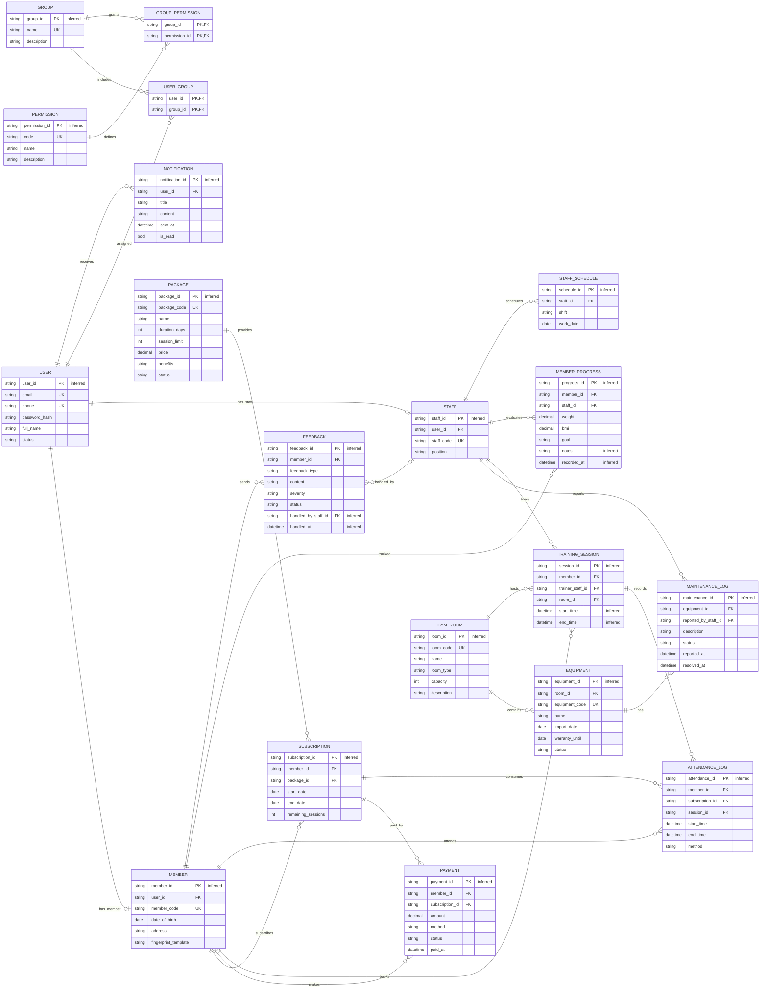

# Database

## ERD (Mermaid)



## Entities (mo ta ngan)

- USER: tai khoan he thong, phuc vu dang nhap va phan quyen.
- MEMBER: thong tin hoi vien, gan voi USER.
- STAFF: thong tin nhan su/PT, gan voi USER.
- GROUP: nhom quyen (role).
- PERMISSION: chuc nang he thong.
- USER_GROUP: bang lien ket USER - GROUP (N:N).
- GROUP_PERMISSION: bang lien ket GROUP - PERMISSION (N:N).
- PACKAGE: goi tap/dich vu.
- SUBSCRIPTION: thong tin dang ky/gia han goi tap.
- PAYMENT: giao dich thanh toan.
- GYM_ROOM: phong tap.
- EQUIPMENT: thiet bi tap.
- MAINTENANCE_LOG: nhat ky bao tri thiet bi.
- TRAINING_SESSION: lich tap/lich hen voi PT.
- ATTENDANCE_LOG: ghi nhan buoi tap theo thoi gian thuc.
- MEMBER_PROGRESS: chi so tien do tap luyen.
- FEEDBACK: phan hoi tu hoi vien.
- NOTIFICATION: thong bao he thong.
- STAFF_SCHEDULE: lich lam viec cua nhan su.

## Relationships (1:N, N:N)

- USER - MEMBER: 1:0..1 (moi member thuoc 1 user; user co the khong la member).
- USER - STAFF: 1:0..1 (moi staff thuoc 1 user; user co the khong la staff).
- USER - GROUP: N:N (qua USER_GROUP).
- GROUP - PERMISSION: N:N (qua GROUP_PERMISSION).
- MEMBER - SUBSCRIPTION: 1:N.
- PACKAGE - SUBSCRIPTION: 1:N.
- SUBSCRIPTION - PAYMENT: 1:N (inferred).
- MEMBER - PAYMENT: 1:N.
- GYM_ROOM - EQUIPMENT: 1:N.
- EQUIPMENT - MAINTENANCE_LOG: 1:N.
- STAFF - MAINTENANCE_LOG: 1:N.
- MEMBER - TRAINING_SESSION: 1:N.
- STAFF - TRAINING_SESSION: 1:N.
- GYM_ROOM - TRAINING_SESSION: 1:N.
- TRAINING_SESSION - ATTENDANCE_LOG: 1:N.
- MEMBER - ATTENDANCE_LOG: 1:N.
- SUBSCRIPTION - ATTENDANCE_LOG: 1:N.
- MEMBER - MEMBER_PROGRESS: 1:N.
- STAFF - MEMBER_PROGRESS: 1:N.
- MEMBER - FEEDBACK: 1:N.
- FEEDBACK - STAFF: N:0..1 (handled_by).
- USER - NOTIFICATION: 1:N (inferred).
- STAFF - STAFF_SCHEDULE: 1:N (inferred).

## Enum types (PostgreSQL)

```sql
CREATE TYPE user_status AS ENUM ('active', 'locked');
CREATE TYPE package_status AS ENUM ('active', 'inactive');
CREATE TYPE payment_method AS ENUM ('cash', 'bank_card', 'ewallet');
CREATE TYPE payment_status AS ENUM ('success', 'failed');
CREATE TYPE equipment_status AS ENUM ('active', 'broken', 'repairing', 'retired');
CREATE TYPE maintenance_status AS ENUM ('reported', 'repairing', 'resolved', 'failed');
CREATE TYPE feedback_type AS ENUM ('staff', 'equipment', 'service');
CREATE TYPE feedback_severity AS ENUM ('low', 'medium', 'high');
CREATE TYPE feedback_status AS ENUM ('open', 'in_progress', 'resolved');
CREATE TYPE attendance_method AS ENUM ('realtime', 'manual', 'qr');
CREATE TYPE staff_shift AS ENUM ('morning', 'afternoon', 'evening');
```

## ALTER TABLE (migrate to enum types)

```sql
-- Assumes existing values already match the enum labels.
ALTER TABLE users ALTER COLUMN status TYPE user_status USING status::user_status;

ALTER TABLE packages ALTER COLUMN status TYPE package_status USING status::package_status;

ALTER TABLE payments
    ALTER COLUMN method TYPE payment_method USING method::payment_method,
    ALTER COLUMN status TYPE payment_status USING status::payment_status;

ALTER TABLE equipment ALTER COLUMN status TYPE equipment_status USING status::equipment_status;

ALTER TABLE maintenance_logs
    ALTER COLUMN status TYPE maintenance_status USING status::maintenance_status;

ALTER TABLE attendance_logs
    ALTER COLUMN method TYPE attendance_method USING method::attendance_method;

ALTER TABLE feedback
    ALTER COLUMN feedback_type TYPE feedback_type USING feedback_type::feedback_type,
    ALTER COLUMN severity TYPE feedback_severity USING severity::feedback_severity,
    ALTER COLUMN status TYPE feedback_status USING status::feedback_status;

ALTER TABLE staff_schedules
    ALTER COLUMN shift TYPE staff_shift USING shift::staff_shift;
```

## SQL schema (DDL)

Table name dung snake_case, map tu ten entity trong ERD. DDL duoi day dung SQL kieu PostgreSQL.

```sql
CREATE TABLE users (
    user_id BIGINT GENERATED BY DEFAULT AS IDENTITY PRIMARY KEY,
    email VARCHAR(255) NOT NULL UNIQUE,
    phone VARCHAR(20) UNIQUE,
    password_hash VARCHAR(255) NOT NULL,
    full_name VARCHAR(200) NOT NULL,
    status user_status NOT NULL
);

CREATE TABLE members (
    member_id BIGINT GENERATED BY DEFAULT AS IDENTITY PRIMARY KEY,
    user_id BIGINT NOT NULL UNIQUE,
    member_code VARCHAR(30) NOT NULL UNIQUE,
    date_of_birth DATE NOT NULL,
    address VARCHAR(200),
    fingerprint_template BYTEA NOT NULL,
    CONSTRAINT fk_members_user
        FOREIGN KEY (user_id) REFERENCES users(user_id)
);

CREATE TABLE staff (
    staff_id BIGINT GENERATED BY DEFAULT AS IDENTITY PRIMARY KEY,
    user_id BIGINT NOT NULL UNIQUE,
    staff_code VARCHAR(30) NOT NULL UNIQUE,
    position VARCHAR(50) NOT NULL,
    CONSTRAINT fk_staff_user
        FOREIGN KEY (user_id) REFERENCES users(user_id)
);

CREATE TABLE groups (
    group_id BIGINT GENERATED BY DEFAULT AS IDENTITY PRIMARY KEY,
    name VARCHAR(100) NOT NULL UNIQUE,
    description VARCHAR(255)
);

CREATE TABLE permissions (
    permission_id BIGINT GENERATED BY DEFAULT AS IDENTITY PRIMARY KEY,
    code VARCHAR(50) NOT NULL UNIQUE,
    name VARCHAR(100) NOT NULL,
    description VARCHAR(255)
);

CREATE TABLE user_groups (
    user_id BIGINT NOT NULL,
    group_id BIGINT NOT NULL,
    PRIMARY KEY (user_id, group_id),
    CONSTRAINT fk_user_groups_user
        FOREIGN KEY (user_id) REFERENCES users(user_id) ON DELETE CASCADE,
    CONSTRAINT fk_user_groups_group
        FOREIGN KEY (group_id) REFERENCES groups(group_id) ON DELETE CASCADE
);

CREATE TABLE group_permissions (
    group_id BIGINT NOT NULL,
    permission_id BIGINT NOT NULL,
    PRIMARY KEY (group_id, permission_id),
    CONSTRAINT fk_group_permissions_group
        FOREIGN KEY (group_id) REFERENCES groups(group_id) ON DELETE CASCADE,
    CONSTRAINT fk_group_permissions_permission
        FOREIGN KEY (permission_id) REFERENCES permissions(permission_id) ON DELETE CASCADE
);

CREATE TABLE packages (
    package_id BIGINT GENERATED BY DEFAULT AS IDENTITY PRIMARY KEY,
    package_code VARCHAR(30) NOT NULL UNIQUE,
    name VARCHAR(100) NOT NULL,
    duration_days INT NOT NULL,
    session_limit INT NOT NULL,
    price DECIMAL(12,2) NOT NULL,
    benefits VARCHAR(255),
    status package_status NOT NULL
);

CREATE TABLE subscriptions (
    subscription_id BIGINT GENERATED BY DEFAULT AS IDENTITY PRIMARY KEY,
    member_id BIGINT NOT NULL,
    package_id BIGINT NOT NULL,
    start_date DATE NOT NULL,
    end_date DATE NOT NULL,
    remaining_sessions INT NOT NULL,
    CONSTRAINT fk_subscriptions_member
        FOREIGN KEY (member_id) REFERENCES members(member_id),
    CONSTRAINT fk_subscriptions_package
        FOREIGN KEY (package_id) REFERENCES packages(package_id)
);

CREATE TABLE payments (
    payment_id BIGINT GENERATED BY DEFAULT AS IDENTITY PRIMARY KEY,
    member_id BIGINT NOT NULL,
    subscription_id BIGINT NOT NULL,
    amount DECIMAL(12,2) NOT NULL,
    method payment_method NOT NULL,
    status payment_status NOT NULL,
    paid_at TIMESTAMP NOT NULL,
    CONSTRAINT fk_payments_member
        FOREIGN KEY (member_id) REFERENCES members(member_id),
    CONSTRAINT fk_payments_subscription
        FOREIGN KEY (subscription_id) REFERENCES subscriptions(subscription_id)
);

CREATE TABLE gym_rooms (
    room_id BIGINT GENERATED BY DEFAULT AS IDENTITY PRIMARY KEY,
    room_code VARCHAR(30) NOT NULL UNIQUE,
    name VARCHAR(100) NOT NULL,
    room_type VARCHAR(50),
    capacity INT NOT NULL,
    description VARCHAR(255)
);

CREATE TABLE equipment (
    equipment_id BIGINT GENERATED BY DEFAULT AS IDENTITY PRIMARY KEY,
    room_id BIGINT NOT NULL,
    equipment_code VARCHAR(30) NOT NULL UNIQUE,
    name VARCHAR(100) NOT NULL,
    import_date DATE NOT NULL,
    warranty_until DATE,
    status equipment_status NOT NULL,
    CONSTRAINT fk_equipment_room
        FOREIGN KEY (room_id) REFERENCES gym_rooms(room_id)
);

CREATE TABLE maintenance_logs (
    maintenance_id BIGINT GENERATED BY DEFAULT AS IDENTITY PRIMARY KEY,
    equipment_id BIGINT NOT NULL,
    reported_by_staff_id BIGINT NOT NULL,
    description TEXT NOT NULL,
    status maintenance_status NOT NULL,
    reported_at TIMESTAMP NOT NULL,
    resolved_at TIMESTAMP,
    CONSTRAINT fk_maintenance_equipment
        FOREIGN KEY (equipment_id) REFERENCES equipment(equipment_id),
    CONSTRAINT fk_maintenance_staff
        FOREIGN KEY (reported_by_staff_id) REFERENCES staff(staff_id)
);

CREATE TABLE training_sessions (
    session_id BIGINT GENERATED BY DEFAULT AS IDENTITY PRIMARY KEY,
    member_id BIGINT NOT NULL,
    trainer_staff_id BIGINT NOT NULL,
    room_id BIGINT NOT NULL,
    start_time TIMESTAMP NOT NULL,
    end_time TIMESTAMP NOT NULL,
    CONSTRAINT fk_sessions_member
        FOREIGN KEY (member_id) REFERENCES members(member_id),
    CONSTRAINT fk_sessions_trainer
        FOREIGN KEY (trainer_staff_id) REFERENCES staff(staff_id),
    CONSTRAINT fk_sessions_room
        FOREIGN KEY (room_id) REFERENCES gym_rooms(room_id)
);

CREATE TABLE attendance_logs (
    attendance_id BIGINT GENERATED BY DEFAULT AS IDENTITY PRIMARY KEY,
    member_id BIGINT NOT NULL,
    subscription_id BIGINT NOT NULL,
    session_id BIGINT NOT NULL,
    start_time TIMESTAMP NOT NULL,
    end_time TIMESTAMP,
    method attendance_method,
    CONSTRAINT fk_attendance_member
        FOREIGN KEY (member_id) REFERENCES members(member_id),
    CONSTRAINT fk_attendance_subscription
        FOREIGN KEY (subscription_id) REFERENCES subscriptions(subscription_id),
    CONSTRAINT fk_attendance_session
        FOREIGN KEY (session_id) REFERENCES training_sessions(session_id)
);

CREATE TABLE member_progress (
    progress_id BIGINT GENERATED BY DEFAULT AS IDENTITY PRIMARY KEY,
    member_id BIGINT NOT NULL,
    staff_id BIGINT NOT NULL,
    weight DECIMAL(6,2),
    bmi DECIMAL(5,2),
    goal VARCHAR(255),
    notes TEXT,
    recorded_at TIMESTAMP NOT NULL,
    CONSTRAINT fk_progress_member
        FOREIGN KEY (member_id) REFERENCES members(member_id),
    CONSTRAINT fk_progress_staff
        FOREIGN KEY (staff_id) REFERENCES staff(staff_id)
);

CREATE TABLE feedback (
    feedback_id BIGINT GENERATED BY DEFAULT AS IDENTITY PRIMARY KEY,
    member_id BIGINT NOT NULL,
    feedback_type feedback_type NOT NULL,
    content TEXT NOT NULL,
    severity feedback_severity,
    status feedback_status,
    handled_by_staff_id BIGINT,
    handled_at TIMESTAMP,
    CONSTRAINT fk_feedback_member
        FOREIGN KEY (member_id) REFERENCES members(member_id),
    CONSTRAINT fk_feedback_staff
        FOREIGN KEY (handled_by_staff_id) REFERENCES staff(staff_id)
);

CREATE TABLE notifications (
    notification_id BIGINT GENERATED BY DEFAULT AS IDENTITY PRIMARY KEY,
    user_id BIGINT NOT NULL,
    title VARCHAR(200) NOT NULL,
    content TEXT NOT NULL,
    sent_at TIMESTAMP NOT NULL,
    is_read BOOLEAN NOT NULL DEFAULT FALSE,
    CONSTRAINT fk_notifications_user
        FOREIGN KEY (user_id) REFERENCES users(user_id)
);

CREATE TABLE staff_schedules (
    schedule_id BIGINT GENERATED BY DEFAULT AS IDENTITY PRIMARY KEY,
    staff_id BIGINT NOT NULL,
    shift staff_shift NOT NULL,
    work_date DATE NOT NULL,
    CONSTRAINT fk_schedules_staff
        FOREIGN KEY (staff_id) REFERENCES staff(staff_id)
);
```

## Supabase SQL (bootstrap)

Chay trong Supabase SQL Editor. Supabase da co database san, chi can tao schema va tables.

```sql
BEGIN;

-- Optional reset (chi dung khi muon tao lai tu dau)
DROP TABLE IF EXISTS staff_schedules;
DROP TABLE IF EXISTS notifications;
DROP TABLE IF EXISTS feedback;
DROP TABLE IF EXISTS member_progress;
DROP TABLE IF EXISTS attendance_logs;
DROP TABLE IF EXISTS training_sessions;
DROP TABLE IF EXISTS maintenance_logs;
DROP TABLE IF EXISTS equipment;
DROP TABLE IF EXISTS gym_rooms;
DROP TABLE IF EXISTS payments;
DROP TABLE IF EXISTS subscriptions;
DROP TABLE IF EXISTS packages;
DROP TABLE IF EXISTS group_permissions;
DROP TABLE IF EXISTS user_groups;
DROP TABLE IF EXISTS permissions;
DROP TABLE IF EXISTS groups;
DROP TABLE IF EXISTS staff;
DROP TABLE IF EXISTS members;
DROP TABLE IF EXISTS users;

CREATE TABLE users (
    user_id BIGINT GENERATED BY DEFAULT AS IDENTITY PRIMARY KEY,
    email VARCHAR(255) NOT NULL UNIQUE,
    phone VARCHAR(20) UNIQUE,
    password_hash VARCHAR(255) NOT NULL,
    full_name VARCHAR(200) NOT NULL,
    status user_status NOT NULL
);

CREATE TABLE members (
    member_id BIGINT GENERATED BY DEFAULT AS IDENTITY PRIMARY KEY,
    user_id BIGINT NOT NULL UNIQUE,
    member_code VARCHAR(30) NOT NULL UNIQUE,
    date_of_birth DATE NOT NULL,
    address VARCHAR(200),
    fingerprint_template BYTEA NOT NULL,
    CONSTRAINT fk_members_user
        FOREIGN KEY (user_id) REFERENCES users(user_id)
);

CREATE TABLE staff (
    staff_id BIGINT GENERATED BY DEFAULT AS IDENTITY PRIMARY KEY,
    user_id BIGINT NOT NULL UNIQUE,
    staff_code VARCHAR(30) NOT NULL UNIQUE,
    position VARCHAR(50) NOT NULL,
    CONSTRAINT fk_staff_user
        FOREIGN KEY (user_id) REFERENCES users(user_id)
);

CREATE TABLE groups (
    group_id BIGINT GENERATED BY DEFAULT AS IDENTITY PRIMARY KEY,
    name VARCHAR(100) NOT NULL UNIQUE,
    description VARCHAR(255)
);

CREATE TABLE permissions (
    permission_id BIGINT GENERATED BY DEFAULT AS IDENTITY PRIMARY KEY,
    code VARCHAR(50) NOT NULL UNIQUE,
    name VARCHAR(100) NOT NULL,
    description VARCHAR(255)
);

CREATE TABLE user_groups (
    user_id BIGINT NOT NULL,
    group_id BIGINT NOT NULL,
    PRIMARY KEY (user_id, group_id),
    CONSTRAINT fk_user_groups_user
        FOREIGN KEY (user_id) REFERENCES users(user_id) ON DELETE CASCADE,
    CONSTRAINT fk_user_groups_group
        FOREIGN KEY (group_id) REFERENCES groups(group_id) ON DELETE CASCADE
);

CREATE TABLE group_permissions (
    group_id BIGINT NOT NULL,
    permission_id BIGINT NOT NULL,
    PRIMARY KEY (group_id, permission_id),
    CONSTRAINT fk_group_permissions_group
        FOREIGN KEY (group_id) REFERENCES groups(group_id) ON DELETE CASCADE,
    CONSTRAINT fk_group_permissions_permission
        FOREIGN KEY (permission_id) REFERENCES permissions(permission_id) ON DELETE CASCADE
);

CREATE TABLE packages (
    package_id BIGINT GENERATED BY DEFAULT AS IDENTITY PRIMARY KEY,
    package_code VARCHAR(30) NOT NULL UNIQUE,
    name VARCHAR(100) NOT NULL,
    duration_days INT NOT NULL,
    session_limit INT NOT NULL,
    price DECIMAL(12,2) NOT NULL,
    benefits VARCHAR(255),
    status package_status NOT NULL
);

CREATE TABLE subscriptions (
    subscription_id BIGINT GENERATED BY DEFAULT AS IDENTITY PRIMARY KEY,
    member_id BIGINT NOT NULL,
    package_id BIGINT NOT NULL,
    start_date DATE NOT NULL,
    end_date DATE NOT NULL,
    remaining_sessions INT NOT NULL,
    CONSTRAINT fk_subscriptions_member
        FOREIGN KEY (member_id) REFERENCES members(member_id),
    CONSTRAINT fk_subscriptions_package
        FOREIGN KEY (package_id) REFERENCES packages(package_id)
);

CREATE TABLE payments (
    payment_id BIGINT GENERATED BY DEFAULT AS IDENTITY PRIMARY KEY,
    member_id BIGINT NOT NULL,
    subscription_id BIGINT NOT NULL,
    amount DECIMAL(12,2) NOT NULL,
    method payment_method NOT NULL,
    status payment_status NOT NULL,
    paid_at TIMESTAMP NOT NULL,
    CONSTRAINT fk_payments_member
        FOREIGN KEY (member_id) REFERENCES members(member_id),
    CONSTRAINT fk_payments_subscription
        FOREIGN KEY (subscription_id) REFERENCES subscriptions(subscription_id)
);

CREATE TABLE gym_rooms (
    room_id BIGINT GENERATED BY DEFAULT AS IDENTITY PRIMARY KEY,
    room_code VARCHAR(30) NOT NULL UNIQUE,
    name VARCHAR(100) NOT NULL,
    room_type VARCHAR(50),
    capacity INT NOT NULL,
    description VARCHAR(255)
);

CREATE TABLE equipment (
    equipment_id BIGINT GENERATED BY DEFAULT AS IDENTITY PRIMARY KEY,
    room_id BIGINT NOT NULL,
    equipment_code VARCHAR(30) NOT NULL UNIQUE,
    name VARCHAR(100) NOT NULL,
    import_date DATE NOT NULL,
    warranty_until DATE,
    status equipment_status NOT NULL,
    CONSTRAINT fk_equipment_room
        FOREIGN KEY (room_id) REFERENCES gym_rooms(room_id)
);

CREATE TABLE maintenance_logs (
    maintenance_id BIGINT GENERATED BY DEFAULT AS IDENTITY PRIMARY KEY,
    equipment_id BIGINT NOT NULL,
    reported_by_staff_id BIGINT NOT NULL,
    description TEXT NOT NULL,
    status maintenance_status NOT NULL,
    reported_at TIMESTAMP NOT NULL,
    resolved_at TIMESTAMP,
    CONSTRAINT fk_maintenance_equipment
        FOREIGN KEY (equipment_id) REFERENCES equipment(equipment_id),
    CONSTRAINT fk_maintenance_staff
        FOREIGN KEY (reported_by_staff_id) REFERENCES staff(staff_id)
);

CREATE TABLE training_sessions (
    session_id BIGINT GENERATED BY DEFAULT AS IDENTITY PRIMARY KEY,
    member_id BIGINT NOT NULL,
    trainer_staff_id BIGINT NOT NULL,
    room_id BIGINT NOT NULL,
    start_time TIMESTAMP NOT NULL,
    end_time TIMESTAMP NOT NULL,
    CONSTRAINT fk_sessions_member
        FOREIGN KEY (member_id) REFERENCES members(member_id),
    CONSTRAINT fk_sessions_trainer
        FOREIGN KEY (trainer_staff_id) REFERENCES staff(staff_id),
    CONSTRAINT fk_sessions_room
        FOREIGN KEY (room_id) REFERENCES gym_rooms(room_id)
);

CREATE TABLE attendance_logs (
    attendance_id BIGINT GENERATED BY DEFAULT AS IDENTITY PRIMARY KEY,
    member_id BIGINT NOT NULL,
    subscription_id BIGINT NOT NULL,
    session_id BIGINT NOT NULL,
    start_time TIMESTAMP NOT NULL,
    end_time TIMESTAMP,
    method attendance_method,
    CONSTRAINT fk_attendance_member
        FOREIGN KEY (member_id) REFERENCES members(member_id),
    CONSTRAINT fk_attendance_subscription
        FOREIGN KEY (subscription_id) REFERENCES subscriptions(subscription_id),
    CONSTRAINT fk_attendance_session
        FOREIGN KEY (session_id) REFERENCES training_sessions(session_id)
);

CREATE TABLE member_progress (
    progress_id BIGINT GENERATED BY DEFAULT AS IDENTITY PRIMARY KEY,
    member_id BIGINT NOT NULL,
    staff_id BIGINT NOT NULL,
    weight DECIMAL(6,2),
    bmi DECIMAL(5,2),
    goal VARCHAR(255),
    notes TEXT,
    recorded_at TIMESTAMP NOT NULL,
    CONSTRAINT fk_progress_member
        FOREIGN KEY (member_id) REFERENCES members(member_id),
    CONSTRAINT fk_progress_staff
        FOREIGN KEY (staff_id) REFERENCES staff(staff_id)
);

CREATE TABLE feedback (
    feedback_id BIGINT GENERATED BY DEFAULT AS IDENTITY PRIMARY KEY,
    member_id BIGINT NOT NULL,
    feedback_type feedback_type NOT NULL,
    content TEXT NOT NULL,
    severity feedback_severity,
    status feedback_status,
    handled_by_staff_id BIGINT,
    handled_at TIMESTAMP,
    CONSTRAINT fk_feedback_member
        FOREIGN KEY (member_id) REFERENCES members(member_id),
    CONSTRAINT fk_feedback_staff
        FOREIGN KEY (handled_by_staff_id) REFERENCES staff(staff_id)
);

CREATE TABLE notifications (
    notification_id BIGINT GENERATED BY DEFAULT AS IDENTITY PRIMARY KEY,
    user_id BIGINT NOT NULL,
    title VARCHAR(200) NOT NULL,
    content TEXT NOT NULL,
    sent_at TIMESTAMP NOT NULL,
    is_read BOOLEAN NOT NULL DEFAULT FALSE,
    CONSTRAINT fk_notifications_user
        FOREIGN KEY (user_id) REFERENCES users(user_id)
);

CREATE TABLE staff_schedules (
    schedule_id BIGINT GENERATED BY DEFAULT AS IDENTITY PRIMARY KEY,
    staff_id BIGINT NOT NULL,
    shift staff_shift NOT NULL,
    work_date DATE NOT NULL,
    CONSTRAINT fk_schedules_staff
        FOREIGN KEY (staff_id) REFERENCES staff(staff_id)
);

COMMIT;
```