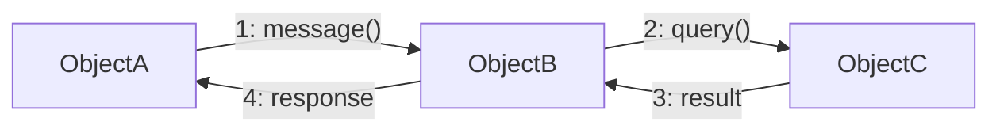
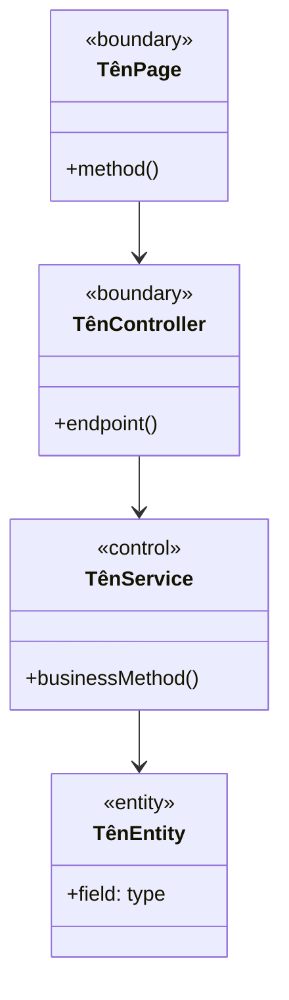

# Architecture.md — Hoàn thiện biểu đồ thiết kế kiến trúc

**Goal:** Viết đầy đủ 3 loại biểu đồ cho 21 use case vào `docs/Design/Architecture.md`.

**Architecture:** Mỗi UC có 3 biểu đồ Mermaid: (1) Sequence Diagram — luồng tương tác Actor→Client→Controller→Service→DB; (2) Communication Diagram — graph LR object và message đánh số; (3) Analysis Class Diagram — classDiagram với stereotype `<<boundary>>` / `<<control>>` / `<<entity>>`.

**Tech Stack:** Markdown + Mermaid (giống pattern trong `docs/Design/class-diagram.md`).

---

## Quy ước biểu đồ

### 1. Sequence Diagram

```mermaid
sequenceDiagram
    actor Actor as Tên_Actor
    participant Client as Tên_Page
    participant API as Controller
    participant Svc as Service
    participant DB as Database

    Actor->>Client: hành động
    Client->>API: HTTP request
    API->>Svc: gọi method
    Svc->>DB: truy vấn
    DB-->>Svc: kết quả
    Svc-->>API: response object
    API-->>Client: HTTP response
    Client-->>Actor: hiển thị kết quả
```

Participant: Actor, [Page client], [Controller], [Service(s)], Database.  
Thứ tự messages theo luồng chính của UC. Alt/opt block cho luồng thay thế quan trọng.

### 2. Communication Diagram



Messages đánh số theo thứ tự gọi. Nodes là các object tham gia tương tác (không phải lớp trừu tượng).

### 3. Analysis Class Diagram



Boundary = UI page + API controller. Control = service layer. Entity = Prisma model (User, Member, v.v.).

---

## Participants mapping per UC

| UC | Actors | Boundary | Control | Entity |
|----|--------|----------|---------|--------|
| UC01 | Member/Staff/Owner | LoginPage, AuthController | AuthService, UsersService, JwtService | User, UserGroup, Group, AuditLog |
| UC02 | All roles | DashboardPage, AuthController | AuthService | AuditLog |
| UC03 | All roles | ForgotPasswordPage, ResetPasswordPage, AuthController | AuthService, OtpService | User, OtpCode, AuditLog |
| UC04 | All roles | ProfilePage, UsersController | UsersService, MembersService, FileService | User, Member, Staff, File, AuditLog |
| UC05A | Staff | MemberRegisterPage, MembersController | MembersService, UsersService, OtpService | User, Member, OtpCode, AuditLog |
| UC05B | Guest | RegisterPage, MembersController | MembersService, UsersService, OtpService, SubscriptionsService | User, Member, OtpCode, Subscription |
| UC06 | Member, Staff | PackageListPage, SubscriptionsController | SubscriptionsService, PackagesService, PaymentService | Package, Subscription, Payment, Member |
| UC07A | Member, Staff | SubscriptionDetailPage, SubscriptionsController | SubscriptionsService, PaymentService | Subscription, Payment, Package, Member |
| UC07B | Member, Staff | SubscriptionDetailPage, SubscriptionsController | SubscriptionsService | Subscription, Member, AuditLog |
| UC08 | Member | PackageHistoryPage, SubscriptionsController | SubscriptionsService, PaymentService | Subscription, Package, Payment, Member |
| UC09 | Staff | MemberListPage, MemberDetailPage, MembersController | MembersService, UsersService | Member, User, Subscription, Staff, AuditLog |
| UC10 | Trainer | WorkoutPlanPage, WorkoutController | WorkoutPlanService, ExerciseService | WorkoutPlan, WorkoutPlanDay, WorkoutPlanExercise, Exercise, MemberWorkoutPlan |
| UC11 | Trainer | TrainingSchedulePage, TrainingController | TrainingSessionService, WorkoutPlanService | TrainingSession, MemberWorkoutPlan, WorkoutPlanDay, GymRoom, Member, Staff |
| UC12 | Member | AttendancePage, WorkoutLogPage, TrainingController | AttendanceService, WorkoutLogService | AttendanceLog, WorkoutLog, WorkoutLogSet, Subscription, MemberWorkoutPlan |
| UC13 | Member | FeedbackFormPage, FeedbackController | FeedbackService | Feedback, Member, Staff, Equipment |
| UC14 | Staff | FeedbackListPage, FeedbackDetailPage, FeedbackController | FeedbackService | Feedback, Staff, AuditLog |
| UC15 | Owner | StaffListPage, StaffDetailPage, StaffController | StaffService, UsersService, OtpService | User, Staff, UserGroup, StaffSchedule, AuditLog |
| UC16 | Owner | RBACPage, GroupsController, UsersController | RBACService, UsersService | User, Group, Permission, UserGroup, GroupPermission, AuditLog |
| UC17 | Owner, Staff | RoomListPage, RoomsController | RoomService | GymRoom, Equipment, TrainingSession |
| UC18 | Owner, Staff, Technician | EquipmentListPage, MaintenancePage, EquipmentController | EquipmentService, MaintenanceService | Equipment, GymRoom, MaintenanceLog, Staff |
| UC19 | Owner | PackageListPage, PackagesController | PackagesService | Package, Subscription, AuditLog |
| UC20 | Owner | ReportPage, ReportController | ReportService | Payment, Member, Subscription, Package, TrainingSession, Staff |
| UC21 | Owner | PerformancePage, ReportController | PerformanceService, ReportService | Staff, TrainingSession, StaffSchedule, Feedback, StaffAttendanceLog |

---

## Checkpoint Protocol (BẮTBUỘC)

Sau mỗi UC (không phải mỗi batch):
1. Dừng lại — báo cho user xem trước khi chuyển sang UC tiếp theo.
2. Cập nhật `docs/Design/architecture-progress.md` — ghi UC vừa hoàn thành, trạng thái 3 biểu đồ.
3. Chờ xác nhận từ user trước khi tiếp tục.

---

## Kế hoạch thực hiện

Thứ tự: UC01 → UC02 → UC03 → ... → UC21. Mỗi UC dừng checkpoint.

### Batch 1: UC01-UC03 (Auth)
- UC01: LoginPage, AuthController, AuthService, UsersService → User, UserGroup, AuditLog
- UC02: DashboardPage, AuthController, AuthService → AuditLog
- UC03: ForgotPasswordPage + ResetPasswordPage, AuthController, AuthService, OtpService → User, OtpCode, AuditLog

### Batch 2: UC04-UC05 (Hồ sơ + Đăng ký)
- UC04: ProfilePage, UsersController, UsersService/MembersService/FileService → User, Member, Staff, File
- UC05A: MemberRegisterPage, MembersController, MembersService/UsersService → User, Member, OtpCode
- UC05B: RegisterPage, MembersController, MembersService/SubscriptionsService → User, Member, Subscription

### Batch 3: UC06-UC08 (Gói tập)
- UC06: PackageListPage, SubscriptionsController, SubscriptionsService/PaymentService → Package, Subscription, Payment
- UC07A: SubscriptionDetailPage, SubscriptionsController, SubscriptionsService → Subscription, Payment
- UC07B: SubscriptionDetailPage, SubscriptionsController, SubscriptionsService → Subscription
- UC08: PackageHistoryPage, SubscriptionsController, SubscriptionsService → Subscription, Package, Payment

### Batch 4: UC09-UC12 (Quản lý + Lịch tập)
- UC09: MemberListPage, MembersController, MembersService → Member, User, Subscription
- UC10: WorkoutPlanPage, WorkoutController, WorkoutPlanService → WorkoutPlan, WorkoutPlanDay, MemberWorkoutPlan
- UC11: TrainingSchedulePage, TrainingController, TrainingSessionService → TrainingSession, GymRoom
- UC12: AttendancePage/WorkoutLogPage, TrainingController, AttendanceService/WorkoutLogService → AttendanceLog, WorkoutLog

### Batch 5: UC13-UC16 (Feedback + Nhân sự + RBAC)
- UC13: FeedbackFormPage, FeedbackController, FeedbackService → Feedback
- UC14: FeedbackListPage, FeedbackController, FeedbackService → Feedback, Staff
- UC15: StaffListPage, StaffController, StaffService → User, Staff, StaffSchedule
- UC16: RBACPage, GroupsController, RBACService → Group, Permission, UserGroup

### Batch 6: UC17-UC21 (Cơ sở vật chất + Báo cáo)
- UC17: RoomListPage, RoomsController, RoomService → GymRoom
- UC18: EquipmentListPage, EquipmentController, EquipmentService/MaintenanceService → Equipment, MaintenanceLog
- UC19: PackageListPage, PackagesController, PackagesService → Package
- UC20: ReportPage, ReportController, ReportService → Payment, Member, Subscription
- UC21: PerformancePage, ReportController, PerformanceService → Staff, TrainingSession, Feedback
