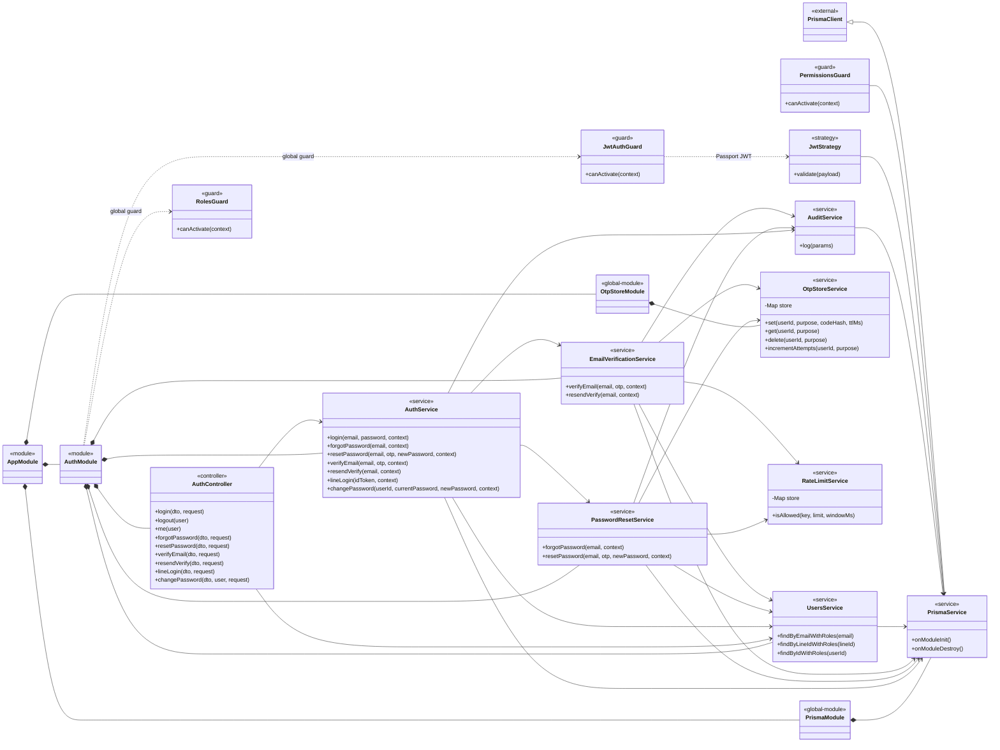
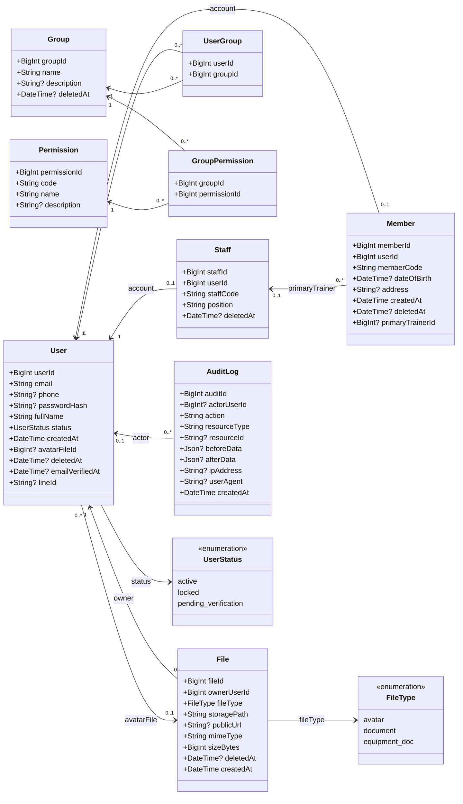
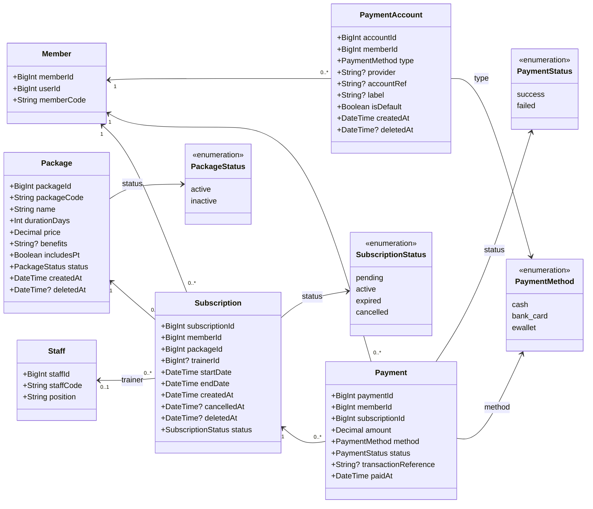
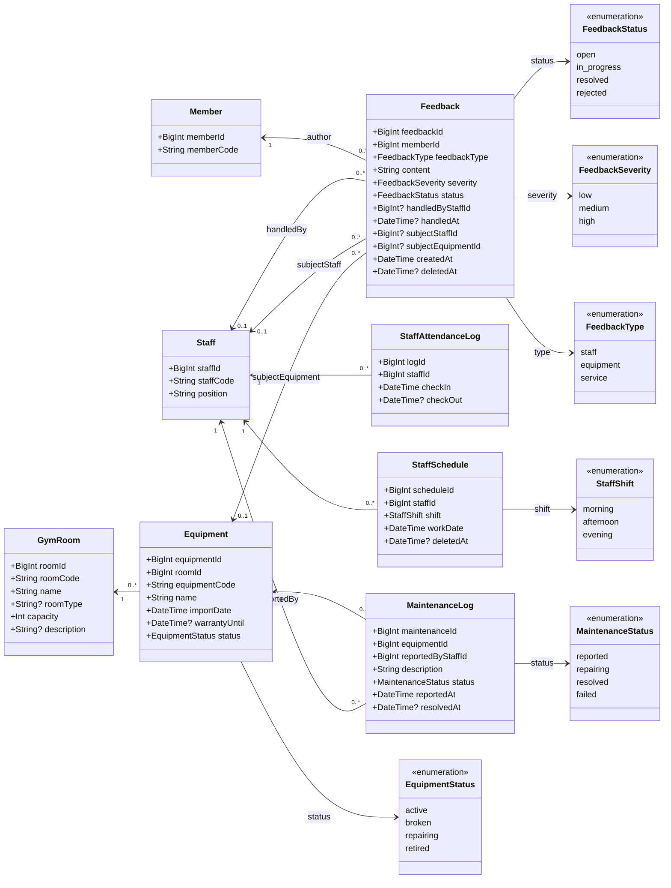
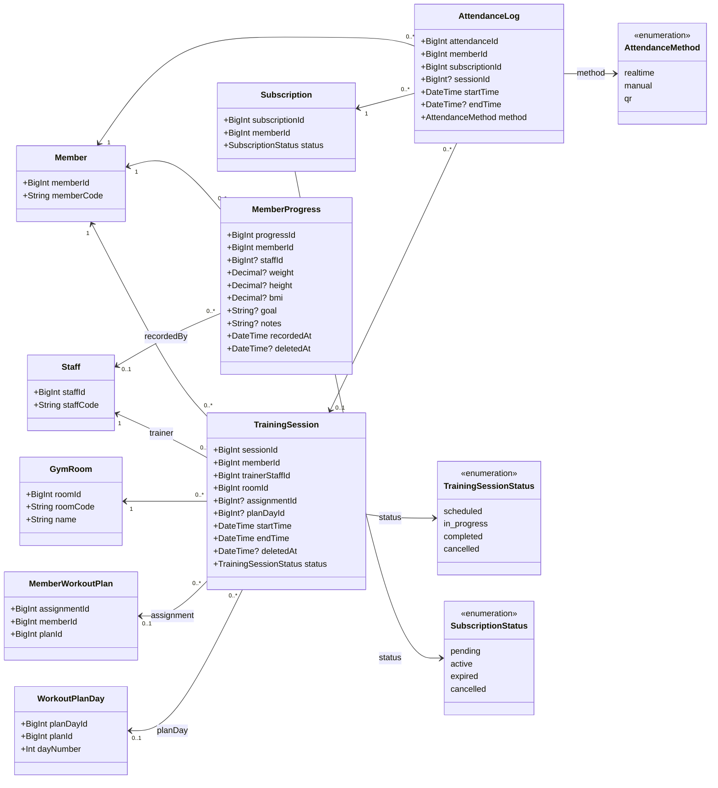
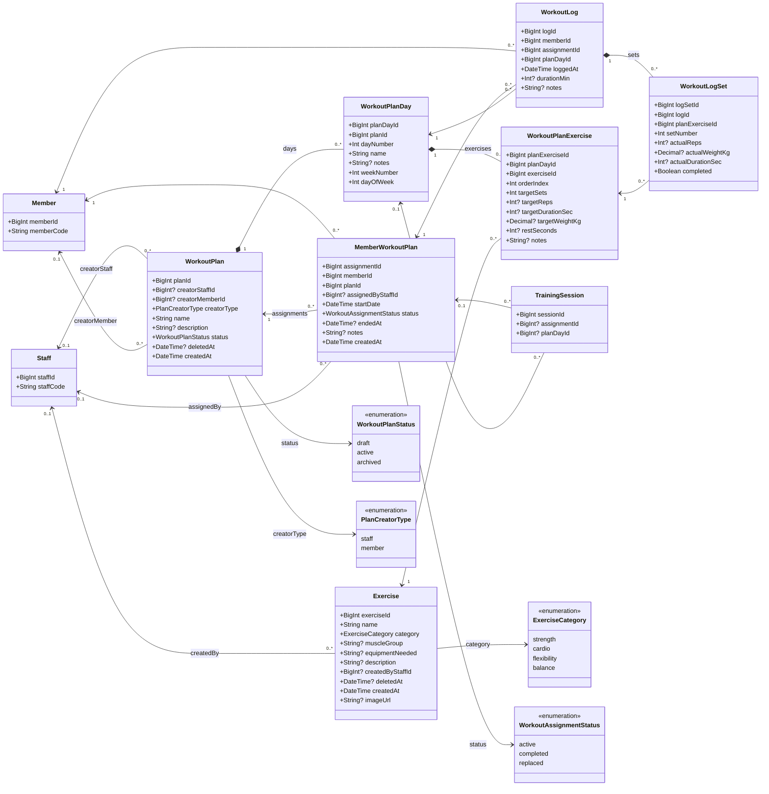

# Server Class Diagrams

Tài liệu này mô tả các lớp **đang được cài đặt** trong `server/src/` và các
domain model trong `server/prisma/schema.prisma` tại ngày 2026-06-19. Các sơ đồ
được tách theo từng góc nhìn để có thể đọc và bảo trì độc lập.

## Quy ước

- `Controller --> Service`: controller gọi service qua dependency injection.
- `Service --> PrismaService/AuditService`: service phụ thuộc hạ tầng dữ liệu
  hoặc audit.
- `*--`: composition; vòng đời lớp con phụ thuộc lớp cha (`onDelete: Cascade`).
- `-->`: association theo khóa ngoại Prisma.
- Kiểu có hậu tố `?` là nullable; các collection relation không lặp lại trong
  thân class mà được thể hiện bằng cạnh và multiplicity.
- Các lớp xuất hiện lại ở nhiều sơ đồ (ví dụ `Member`, `Staff`) vẫn là cùng một
  Prisma model; chúng được lặp để mỗi bounded context tự đầy đủ.
- Các diagram phản ánh schema và dependency thực tế, không biến các business
  rule chỉ nằm trong service thành database constraint.

## 1. Core, authentication và authorization

`JwtAuthGuard` và `RolesGuard` được đăng ký global qua `APP_GUARD` trong
`AuthModule`. `PermissionsGuard` được gắn tại các feature controller bằng
`@UseGuards`. `PrismaModule` và `OtpStoreModule` là global module.

## 2. Feature controllers và application services

```mermaid
classDiagram
    direction LR

    class PermissionsController { <<controller>> }
    class GroupsController { <<controller>> }
    class UsersAdminController { <<controller>> }
    class RbacService {
        <<service>>
        +listPermissions()
        +listGroups()
        +createGroup()
        +assignPermissions()
        +listUsers()
        +assignUserGroup()
    }

    class MembersController { <<controller>> }
    class MembersService {
        <<service>>
        +createMember()
        +selfRegister()
        +listMembers()
        +assignTrainer()
        +recordSelfProgress()
    }

    class StaffController { <<controller>> }
    class StaffService {
        <<service>>
        +create()
        +list()
        +createSchedule()
        +attendanceCheckIn()
        +attendanceCheckOut()
    }

    class PackagesController { <<controller>> }
    class PackagesService {
        <<service>>
        +listPackages()
        +createPackage()
        +updatePackage()
        +deletePackage()
    }
    class SubscriptionsController { <<controller>> }
    class SubscriptionsService {
        <<service>>
        +createSubscription()
        +renewSubscription()
        +listSubscriptions()
        +cancelSubscription()
    }
    class SubscriptionScheduleService {
        <<scheduled-service>>
        +expireSubscriptions()
        +activatePendingSubscriptions()
        +cancelUnpaidPendingSubscriptions()
    }

    class PaymentsController { <<controller>> }
    class PaymentAccountsController { <<controller>> }
    class PaymentsService {
        <<service>>
        +createPayment()
        +listPayments()
        +listPaymentAccounts()
        +createPaymentAccount()
        +setDefaultPaymentAccount()
        +removePaymentAccount()
    }

    class TrainingController { <<controller>> }
    class DeviceController { <<controller>> }
    class TrainingService {
        <<service>>
        +listSessions()
        +createSession()
        +updateSession()
        +manualCheckin()
        +checkout()
        +recordProgress()
        +deviceAccessEvent()
    }
    class DeviceApiKeyGuard { <<guard>> }

    class FacilityController { <<controller>> }
    class FacilityService {
        <<service>>
        +listRooms()
        +createRoom()
        +listEquipment()
        +createEquipment()
        +createMaintenanceLog()
    }

    class FeedbackController { <<controller>> }
    class FeedbackService {
        <<service>>
        +list()
        +create()
        +assign()
        +updateStatus()
    }

    class ExercisesController { <<controller>> }
    class ExercisesService {
        <<service>>
        +findAll()
        +create()
        +findFromExerciseDb()
        +importFromExerciseDb()
    }
    class WorkoutPlansController { <<controller>> }
    class WorkoutPlansService {
        <<service>>
        +create()
        +addDay()
        +addExercise()
        +assignPlan()
        +unassignMember()
    }
    class WorkoutLogsController { <<controller>> }
    class WorkoutLogsService {
        <<service>>
        +create()
        +findAll()
        +update()
    }

    class ReportsController { <<controller>> }
    class ReportsService {
        <<service>>
        +revenue()
        +members()
        +renewals()
        +employeePerformance()
        +staffPerformance()
        +topPackages()
    }
    class HealthController { <<controller>> }
    class PrismaService { <<global-service>> }
    class AuditService { <<service>> }

    PermissionsController --> RbacService
    GroupsController --> RbacService
    UsersAdminController --> RbacService
    MembersController --> MembersService
    StaffController --> StaffService
    PackagesController --> PackagesService
    SubscriptionsController --> SubscriptionsService
    PaymentsController --> PaymentsService
    PaymentAccountsController --> PaymentsService
    TrainingController --> TrainingService
    DeviceController --> TrainingService
    DeviceController ..> DeviceApiKeyGuard
    FacilityController --> FacilityService
    FeedbackController --> FeedbackService
    ExercisesController --> ExercisesService
    WorkoutPlansController --> WorkoutPlansService
    WorkoutLogsController --> WorkoutLogsService
    ReportsController --> ReportsService
    HealthController --> PrismaService

    RbacService --> PrismaService
    MembersService --> PrismaService
    StaffService --> PrismaService
    PackagesService --> PrismaService
    SubscriptionsService --> PrismaService
    SubscriptionScheduleService --> PrismaService
    PaymentsService --> PrismaService
    TrainingService --> PrismaService
    FacilityService --> PrismaService
    FeedbackService --> PrismaService
    ExercisesService --> PrismaService
    WorkoutPlansService --> PrismaService
    WorkoutLogsService --> PrismaService
    ReportsService --> PrismaService

    RbacService --> AuditService
    MembersService --> AuditService
    StaffService --> AuditService
    PackagesService --> AuditService
    SubscriptionsService --> AuditService
    PaymentsService --> AuditService
    TrainingService --> AuditService
    FacilityService --> AuditService
    FeedbackService --> AuditService
    ExercisesService --> AuditService
    WorkoutPlansService --> AuditService
    WorkoutLogsService --> AuditService
```

## 3. Identity, profile, RBAC, file và audit models

`UserGroup` và `GroupPermission` dùng composite primary key. Quan hệ
`User.avatarFile` là quan hệ riêng với quan hệ `File.owner`.

## 4. Membership và payment models

## 5. Staff, facility và feedback models

## 6. Training, attendance và progress models

`TrainingSession.assignmentId` và `TrainingSession.planDayId` là hai liên kết
nullable tới luồng workout plan; service xác thực plan day thuộc đúng assignment
trước khi tạo hoặc cập nhật buổi tập.

## 7. Workout planning và workout logging models

Các composition `WorkoutPlan -> WorkoutPlanDay`, `WorkoutPlanDay ->
WorkoutPlanExercise` và `WorkoutLog -> WorkoutLogSet` tương ứng với các relation
Prisma có `onDelete: Cascade`. Các unique constraint quan trọng gồm
`(planId, dayNumber)`, `(planId, weekNumber, dayOfWeek)`,
`(planDayId, orderIndex)` và `(logId, planExerciseId, setNumber)`.
