# Tài liệu Đặc tả Yêu cầu Phần mềm

## Hệ thống Quản lý Phòng tập Gym

| Field | Value |
|---|---|
| Document ID | GMS-SRS-001 |
| Version | 1.0.1 |
| Status | Draft |
| Author | bta, lta, nhl, tvm, pyn |
| Reviewers | TBD — tối thiểu 1 BA + 1 backend lead khi team formed |
| Last Updated | 9999-99-99 |
| Related docs | `docs/Design/Architecture.md` (v1.1.3), `docs/Design/Database.md` |

---

## Mục lục

- [Tài liệu Đặc tả Yêu cầu Phần mềm](#tài-liệu-đặc-tả-yêu-cầu-phần-mềm)
  - [Hệ thống Quản lý Phòng tập Gym](#hệ-thống-quản-lý-phòng-tập-gym)
  - [Mục lục](#mục-lục)
- [1. Giới thiệu](#1-giới-thiệu)
  - [1.1 Mục đích](#11-mục-đích)
  - [1.2 Phạm vi](#12-phạm-vi)
    - [Cụ thể, hệ thống cho phép:](#cụ-thể-hệ-thống-cho-phép)
    - [Các nhóm người dùng chính:](#các-nhóm-người-dùng-chính)
  - [1.3 Từ điển thuật ngữ](#13-từ-điển-thuật-ngữ)
  - [1.4 Tài liệu tham khảo](#14-tài-liệu-tham-khảo)
- [2. Mô tả tổng quan](#2-mô-tả-tổng-quan)
  - [2.1 Các tác nhân](#21-các-tác-nhân)
    - [Tác nhân chính (Con người):](#tác-nhân-chính-con-người)
    - [Tác nhân hệ thống:](#tác-nhân-hệ-thống)
  - [2.2 Biểu đồ Use Case Tổng quan](#22-biểu-đồ-use-case-tổng-quan)
    - [Nhóm tác nhân và phạm vi tương tác](#nhóm-tác-nhân-và-phạm-vi-tương-tác)
    - [Nhóm use case cấp cao](#nhóm-use-case-cấp-cao)
    - [PlantUML - Use Case Tổng quan](#plantuml---use-case-tổng-quan)
    - [Ràng buộc tổng quan](#ràng-buộc-tổng-quan)
  - [2.3 Biểu đồ Use Case Phân rã](#23-biểu-đồ-use-case-phân-rã)
    - [2.3.1 Phân rã Tài khoản - Bảo mật](#231-phân-rã-tài-khoản---bảo-mật)
    - [2.3.2 Phân rã Quản lý Hội viên](#232-phân-rã-quản-lý-hội-viên)
    - [2.3.3 Phân rã Gói tập, Đăng ký gói \& Thanh toán](#233-phân-rã-gói-tập-đăng-ký-gói--thanh-toán)
    - [2.3.4 Phân rã Quản lý Nhân sự, Chấm công \& Lịch làm việc](#234-phân-rã-quản-lý-nhân-sự-chấm-công--lịch-làm-việc)
    - [2.3.5 Phân rã Phản hồi](#235-phân-rã-phản-hồi)
    - [2.3.6 Phân rã Thiết bị \& Phòng tập](#236-phân-rã-thiết-bị--phòng-tập)
    - [2.3.7 Phân rã Workout Plan \& Training](#237-phân-rã-workout-plan--training)
    - [2.3.8 Phân rã Báo cáo \& Thống kê](#238-phân-rã-báo-cáo--thống-kê)
    - [2.3.9 Phân rã Quản lý Phân quyền RBAC](#239-phân-rã-quản-lý-phân-quyền-rbac)
  - [2.4 Quy trình Nghiệp vụ](#24-quy-trình-nghiệp-vụ)
    - [2.4.1 Quy trình Đăng nhập - Đăng xuất](#241-quy-trình-đăng-nhập---đăng-xuất)
    - [2.4.2 Quy trình Quản lý Hồ sơ cá nhân](#242-quy-trình-quản-lý-hồ-sơ-cá-nhân)
    - [2.4.3 Quy trình Đăng ký Hội viên](#243-quy-trình-đăng-ký-hội-viên)
    - [2.4.4 Quy trình Quản lý gói tập của hội viên](#244-quy-trình-quản-lý-gói-tập-của-hội-viên)
    - [2.4.5 Quy trình Quản lý Hội viên tại quầy](#245-quy-trình-quản-lý-hội-viên-tại-quầy)
    - [2.4.6 Quy trình Tạo và Quản lý buổi tập](#246-quy-trình-tạo-và-quản-lý-buổi-tập)
    - [2.4.7 Quy trình Tạo và Quản lý Workout Plan](#247-quy-trình-tạo-và-quản-lý-workout-plan)
    - [2.4.8 Quy trình Phản hồi và Xử lý phản hồi](#248-quy-trình-phản-hồi-và-xử-lý-phản-hồi)
    - [2.4.9 Quy trình Quản lý Nhân sự và Theo dõi hiệu suất](#249-quy-trình-quản-lý-nhân-sự-và-theo-dõi-hiệu-suất)
    - [2.4.10 Quy trình Quản lý Phòng tập, Thiết bị và Bảo trì](#2410-quy-trình-quản-lý-phòng-tập-thiết-bị-và-bảo-trì)
    - [2.4.11 Quy trình Quản lý danh mục Gói tập](#2411-quy-trình-quản-lý-danh-mục-gói-tập)
    - [2.4.12 Quy trình Quản lý Phân quyền người dùng](#2412-quy-trình-quản-lý-phân-quyền-người-dùng)
    - [2.4.13 Quy trình Báo cáo, Thống kê, Thanh toán và Hiệu suất](#2413-quy-trình-báo-cáo-thống-kê-thanh-toán-và-hiệu-suất)
- [3. Đặc tả các chức năng](#3-đặc-tả-các-chức-năng)
  - [3.1 Đặc tả Use Case UC01 - Đăng nhập](#31-đặc-tả-use-case-uc01---đăng-nhập)
    - [Luồng sự kiện chính](#luồng-sự-kiện-chính)
    - [Luồng sự kiện thay thế](#luồng-sự-kiện-thay-thế)
    - [Dữ liệu đầu vào](#dữ-liệu-đầu-vào)
    - [Hậu điều kiện](#hậu-điều-kiện)
  - [3.2 Đặc tả Use Case UC02 - Đăng xuất](#32-đặc-tả-use-case-uc02---đăng-xuất)
    - [Luồng sự kiện chính](#luồng-sự-kiện-chính-1)
    - [Luồng sự kiện thay thế](#luồng-sự-kiện-thay-thế-1)
    - [Hậu điều kiện](#hậu-điều-kiện-1)
  - [3.3 Đặc tả Use Case UC03 - Quên mật khẩu - Đặt lại mật khẩu](#33-đặc-tả-use-case-uc03---quên-mật-khẩu---đặt-lại-mật-khẩu)
    - [Luồng sự kiện chính](#luồng-sự-kiện-chính-2)
    - [Luồng sự kiện thay thế](#luồng-sự-kiện-thay-thế-2)
    - [Dữ liệu đầu vào](#dữ-liệu-đầu-vào-1)
    - [Hậu điều kiện](#hậu-điều-kiện-2)
  - [3.4 Đặc tả Use Case UC04 - Quản lý hồ sơ và thông tin cá nhân](#34-đặc-tả-use-case-uc04---quản-lý-hồ-sơ-và-thông-tin-cá-nhân)
    - [Luồng sự kiện chính](#luồng-sự-kiện-chính-3)
    - [Phân quyền theo vai trò](#phân-quyền-theo-vai-trò)
    - [Luồng sự kiện thay thế](#luồng-sự-kiện-thay-thế-3)
    - [Hậu điều kiện](#hậu-điều-kiện-3)
  - [3.5 Đặc tả Use Case UC05 - Đăng ký hội viên mới](#35-đặc-tả-use-case-uc05---đăng-ký-hội-viên-mới)
    - [3.5.1 UC05A - Staff đăng ký tại quầy](#351-uc05a---staff-đăng-ký-tại-quầy)
      - [Luồng sự kiện chính](#luồng-sự-kiện-chính-4)
      - [Luồng sự kiện thay thế](#luồng-sự-kiện-thay-thế-4)
      - [Hậu điều kiện](#hậu-điều-kiện-4)
    - [3.5.2 UC05B - Member tự đăng ký online](#352-uc05b---member-tự-đăng-ký-online)
      - [Luồng sự kiện chính](#luồng-sự-kiện-chính-5)
      - [Luồng sự kiện thay thế](#luồng-sự-kiện-thay-thế-5)
      - [Hậu điều kiện](#hậu-điều-kiện-5)
  - [3.6 Đặc tả Use Case UC06 - Đăng ký gói tập mới](#36-đặc-tả-use-case-uc06---đăng-ký-gói-tập-mới)
    - [Điều kiện được phép đăng ký gói mới](#điều-kiện-được-phép-đăng-ký-gói-mới)
    - [Luồng sự kiện chính](#luồng-sự-kiện-chính-6)
    - [Luồng sự kiện thay thế](#luồng-sự-kiện-thay-thế-6)
    - [Hậu điều kiện](#hậu-điều-kiện-6)
  - [3.7 Đặc tả Use Case UC07 - Gia hạn / Hủy gói tập](#37-đặc-tả-use-case-uc07---gia-hạn--hủy-gói-tập)
    - [3.7.1 UC07A - Gia hạn gói tập](#371-uc07a---gia-hạn-gói-tập)
      - [Luồng sự kiện chính](#luồng-sự-kiện-chính-7)
      - [Luồng sự kiện thay thế](#luồng-sự-kiện-thay-thế-7)
      - [Hậu điều kiện](#hậu-điều-kiện-7)
    - [3.7.2 UC07B - Hủy gói tập](#372-uc07b---hủy-gói-tập)
      - [Luồng sự kiện chính](#luồng-sự-kiện-chính-8)
      - [Luồng sự kiện thay thế](#luồng-sự-kiện-thay-thế-8)
      - [Hậu điều kiện](#hậu-điều-kiện-8)
  - [3.8 Đặc tả Use Case UC08 - Xem gói tập hiện tại và lịch sử](#38-đặc-tả-use-case-uc08---xem-gói-tập-hiện-tại-và-lịch-sử)
    - [Luồng sự kiện chính](#luồng-sự-kiện-chính-9)
    - [Luồng sự kiện thay thế](#luồng-sự-kiện-thay-thế-9)
    - [Hậu điều kiện](#hậu-điều-kiện-9)
  - [3.9 Đặc tả Use Case UC09 - Quản lý hội viên](#39-đặc-tả-use-case-uc09---quản-lý-hội-viên)
    - [Luồng sự kiện chính](#luồng-sự-kiện-chính-10)
    - [Luồng sự kiện thay thế](#luồng-sự-kiện-thay-thế-10)
    - [Hậu điều kiện](#hậu-điều-kiện-10)
  - [3.10 Đặc tả Use Case UC10 - Quản lý giáo án / workout plan](#310-đặc-tả-use-case-uc10---quản-lý-giáo-án--workout-plan)
    - [Luồng sự kiện chính](#luồng-sự-kiện-chính-11)
    - [Luồng sự kiện thay thế](#luồng-sự-kiện-thay-thế-11)
    - [Hậu điều kiện](#hậu-điều-kiện-11)
  - [3.11 Đặc tả Use Case UC11 - Quản lý buổi tập / lịch tập](#311-đặc-tả-use-case-uc11---quản-lý-buổi-tập--lịch-tập)
    - [Luồng sự kiện chính](#luồng-sự-kiện-chính-12)
    - [Luồng sự kiện thay thế](#luồng-sự-kiện-thay-thế-12)
    - [Hậu điều kiện](#hậu-điều-kiện-12)
  - [3.12 Đặc tả Use Case UC12 - Theo dõi và ghi nhận buổi tập](#312-đặc-tả-use-case-uc12---theo-dõi-và-ghi-nhận-buổi-tập)
    - [Luồng sự kiện chính](#luồng-sự-kiện-chính-13)
    - [Luồng sự kiện thay thế](#luồng-sự-kiện-thay-thế-13)
    - [Hậu điều kiện](#hậu-điều-kiện-13)
  - [3.13 Đặc tả Use Case UC13 - Gửi phản hồi](#313-đặc-tả-use-case-uc13---gửi-phản-hồi)
    - [Luồng sự kiện chính](#luồng-sự-kiện-chính-14)
    - [Luồng sự kiện thay thế](#luồng-sự-kiện-thay-thế-14)
    - [Hậu điều kiện](#hậu-điều-kiện-14)
  - [3.14 Đặc tả Use Case UC14 - Xử lý phản hồi](#314-đặc-tả-use-case-uc14---xử-lý-phản-hồi)
    - [Luồng sự kiện chính](#luồng-sự-kiện-chính-15)
    - [Luồng sự kiện thay thế](#luồng-sự-kiện-thay-thế-15)
    - [Hậu điều kiện](#hậu-điều-kiện-15)
  - [3.15 Đặc tả Use Case UC15 - Quản lý nhân sự](#315-đặc-tả-use-case-uc15---quản-lý-nhân-sự)
    - [Luồng sự kiện chính](#luồng-sự-kiện-chính-16)
    - [Luồng sự kiện thay thế](#luồng-sự-kiện-thay-thế-16)
    - [Hậu điều kiện](#hậu-điều-kiện-16)
  - [3.16 Đặc tả Use Case UC16 - Quản lý phân quyền người dùng](#316-đặc-tả-use-case-uc16---quản-lý-phân-quyền-người-dùng)
    - [Luồng sự kiện chính](#luồng-sự-kiện-chính-17)
    - [Luồng sự kiện thay thế](#luồng-sự-kiện-thay-thế-17)
    - [Hậu điều kiện](#hậu-điều-kiện-17)
  - [3.17 Đặc tả Use Case UC17 - Quản lý phòng tập](#317-đặc-tả-use-case-uc17---quản-lý-phòng-tập)
    - [Luồng sự kiện chính](#luồng-sự-kiện-chính-18)
    - [Luồng sự kiện thay thế](#luồng-sự-kiện-thay-thế-18)
    - [Hậu điều kiện](#hậu-điều-kiện-18)
  - [3.18 Đặc tả Use Case UC18 - Quản lý thiết bị và bảo trì](#318-đặc-tả-use-case-uc18---quản-lý-thiết-bị-và-bảo-trì)
    - [Luồng sự kiện chính](#luồng-sự-kiện-chính-19)
    - [Luồng sự kiện thay thế](#luồng-sự-kiện-thay-thế-19)
    - [Hậu điều kiện](#hậu-điều-kiện-19)
  - [3.19 Đặc tả Use Case UC19 - Quản lý gói tập](#319-đặc-tả-use-case-uc19---quản-lý-gói-tập)
    - [Luồng sự kiện chính](#luồng-sự-kiện-chính-20)
    - [Luồng sự kiện thay thế](#luồng-sự-kiện-thay-thế-20)
    - [Hậu điều kiện](#hậu-điều-kiện-20)
  - [3.20 Đặc tả Use Case UC20 - Báo cáo thống kê](#320-đặc-tả-use-case-uc20---báo-cáo-thống-kê)
    - [Luồng sự kiện chính](#luồng-sự-kiện-chính-21)
    - [Danh sách báo cáo chính](#danh-sách-báo-cáo-chính)
    - [Luồng sự kiện thay thế](#luồng-sự-kiện-thay-thế-21)
    - [Hậu điều kiện](#hậu-điều-kiện-21)
  - [3.21 Đặc tả Use Case UC21 - Đánh giá hiệu suất nhân viên](#321-đặc-tả-use-case-uc21---đánh-giá-hiệu-suất-nhân-viên)
    - [Luồng sự kiện chính](#luồng-sự-kiện-chính-22)
    - [Luồng sự kiện thay thế](#luồng-sự-kiện-thay-thế-22)
    - [Hậu điều kiện](#hậu-điều-kiện-22)
- [4. Các yêu cầu khác](#4-các-yêu-cầu-khác)
  - [4.1 Chức năng (Functionality)](#41-chức-năng-functionality)
    - [Yêu cầu cụ thể:](#yêu-cầu-cụ-thể)
  - [4.2 Tính dễ dùng (Usability)](#42-tính-dễ-dùng-usability)
    - [Yêu cầu cụ thể:](#yêu-cầu-cụ-thể-1)
  - [4.3 Hiệu năng (Performance)](#43-hiệu-năng-performance)
  - [4.4 Bảo mật (Security)](#44-bảo-mật-security)
  - [4.5 Độ tin cậy (Reliability)](#45-độ-tin-cậy-reliability)
  - [4.6 Khả năng mở rộng (Scalability)](#46-khả-năng-mở-rộng-scalability)
  - [4.7 Khả năng bảo trì (Maintainability)](#47-khả-năng-bảo-trì-maintainability)

---

# 1. Giới thiệu

## 1.1 Mục đích

Tài liệu này được xây dựng nhằm mô tả chi tiết các yêu cầu của **hệ thống quản lý phòng tập Gym**, bao gồm:
- Các chức năng chính
- Các đối tượng sử dụng
- Quy trình nghiệp vụ
- Các ràng buộc liên quan

Trong bối cảnh các phòng tập hiện nay ngày càng phát triển với quy mô lớn và số lượng hội viên tăng nhanh, việc quản lý thủ công hoặc sử dụng các công cụ rời rạc gây ra nhiều khó khăn như:
- Sai sót dữ liệu
- Khó theo dõi lịch sử tập luyện
- Thiếu tính đồng bộ

Vì vậy, việc xây dựng một **hệ thống phần mềm tập trung** là cần thiết.

Tài liệu này đóng vai trò là cầu nối giữa các bên liên quan (stakeholders) như chủ phòng tập, nhân viên vận hành và đội ngũ phát triển phần mềm, giúp đảm bảo việc hiểu đúng yêu cầu và triển khai hệ thống một cách hiệu quả.

## 1.2 Phạm vi

Hệ thống quản lý phòng tập Gym được xây dựng nhằm hỗ trợ quản lý toàn diện các hoạt động vận hành trong phòng tập, từ quản lý hội viên, nhân sự đến thiết bị và doanh thu.

### Cụ thể, hệ thống cho phép:

- Quản lý thiết bị tập luyện và tình trạng bảo trì
- Quản lý nhân sự và phân công công việc
- Quản lý thông tin phòng tập
- Tiếp nhận và xử lý phản hồi từ hội viên
- Quản lý thông tin cá nhân và tài khoản của hội viên
- Quản lý quá trình đăng ký, thiết lập, gia hạn gói tập của hội viên
- Theo dõi lịch sử tập luyện và mức độ tham gia của hội viên
- Quản lý các gói tập và quá trình đăng ký, thanh toán
- Thực hiện các báo cáo thống kê doanh thu, hiệu suất phục vụ quản lý

### Các nhóm người dùng chính:
- Chủ phòng tập
- Nhân viên quản lý
- Huấn luyện viên
- Hội viên

## 1.3 Từ điển thuật ngữ

| Thuật ngữ | Mô tả |
|-----------|--------|
| **Hội viên** | Người sử dụng dịch vụ |
| **Gói tập** | Dịch vụ tập luyện theo thời hạn (v1.0 chỉ time-based, không track số buổi) |
| **PT** | Huấn luyện viên (sub-role của `staff` với `position='pt'`) |
| **Thiết bị** | Máy móc tập |
| **Gia hạn** | Tiếp tục gói tập (cùng gói hoặc gói khác) sau khi gói hiện tại hết hạn |
| **Nhóm quyền** | Tập hợp các chức năng được phép thực hiện, dùng để phân quyền người dùng trong hệ thống (tương đương Role trong RBAC) |
| **PT cố định (Primary Trainer)** | PT được gán làm người phụ trách chính của một hội viên; lưu ở `members.primary_trainer_id` |
| **Trạng thái gói (Subscription Status)** | `pending` (chờ thanh toán), `active` (đang hoạt động), `expired` (hết hạn), `cancelled` (hủy chủ động) |
| **Verify Email** | Xác thực email qua OTP/link sau đăng ký; bắt buộc trước khi sử dụng dịch vụ (áp dụng cho cả member đăng ký online lẫn tại quầy) |
| **Soft Delete / Hard Delete** | Soft = đánh dấu `deleted_at`, vẫn giữ data; Hard = xóa khỏi DB. Xem Database.md "Soft Delete Convention" |
| **Audit Log** | Bản ghi ai-làm-gì-khi-nào trên resource nhạy cảm (bảng `audit_logs`) |
| **JWT** | JSON Web Token — chuỗi mã hóa chứa user identity + roles, dùng để xác thực API request |
| **OTP** | One-Time Password — mã 6 chữ số dùng 1 lần (verify email, reset mật khẩu), TTL 10 phút |
| **RBAC** | Role-Based Access Control — phân quyền theo nhóm/role |
| **SLA** | Service Level Agreement — cam kết thời gian xử lý (áp dụng cho feedback) |
| **BMI** | Body Mass Index — chỉ số khối cơ thể, ghi trong `member_progress` |
| **Access Device** | Thiết bị kiểm soát ra/vào tại phòng tập (đầu đọc thẻ / QR), gọi backend qua API key cố định |
| **`today_vn`** | Ngày bản địa theo `Asia/Ho_Chi_Minh`, định nghĩa `(NOW() AT TIME ZONE 'Asia/Ho_Chi_Minh')::date`. Mọi date comparison nghiệp vụ (subscription start/end, attendance window, KPI day-of) dùng `today_vn` — KHÔNG dùng `CURRENT_DATE` (UTC, sai 1 ngày quanh nửa đêm VN). Xem Architecture.md §4.5 |

## 1.4 Tài liệu tham khảo

Tài liệu được xây dựng dựa trên:
- Đề bài hệ thống quản lý phòng tập Gym trong môn Phát triển phần mềm theo chuẩn ITSS
- Các tài liệu mẫu SRS tiêu chuẩn
- Tham khảo các hệ thống quản lý gym thực tế

---

# 2. Mô tả tổng quan

## 2.1 Các tác nhân

### Tác nhân chính (Con người):

- **Hội viên (Member):** Người sử dụng hệ thống để theo dõi gói tập, lịch tập và phản hồi dịch vụ. Có thể tự đăng ký online hoặc do Staff đăng ký tại quầy.
- **Huấn luyện viên (PT / Trainer):** Quản lý danh sách học viên, thiết lập lịch tập (training_session), nhập tiến độ.
- **Nhân viên quản lý (Staff):** Đăng ký hội viên, kiểm soát gói tập, xử lý phản hồi, quản lý phòng/thiết bị.
- **Chủ phòng tập (Owner):** Quyền cao nhất; bao gồm mọi quyền của Staff + cấu hình gói tập, quản lý nhân sự, RBAC (group/permission), xem báo cáo.

### Tác nhân hệ thống:

- **Hệ thống Thanh toán (Payment Gateway):** Xác nhận giao dịch thanh toán trực tuyến (ngân hàng số, ví điện tử). Tương tác qua webhook callback.
- **Access Device:** Thiết bị kiểm soát ra/vào (đầu đọc thẻ / QR / vân tay) đặt tại phòng tập. Push event check-in qua `POST /api/v1/devices/access-events` với API key cố định (v1.0). Xem Database.md "External Device Authentication".
- **Scheduler / Cron Jobs:** Tác nhân nội bộ chạy các job định kỳ — auto-expire subscription, cleanup OTP, SLA badge check. Chi tiết job list xem Architecture.md §5.2.

---

## 2.2 Biểu đồ Use Case Tổng quan

Phần tổng quan này được cập nhật theo project hiện tại, đối chiếu với các màn hình người dùng, sidebar theo vai trò, các nhóm chức năng backend, schema dữ liệu và tài liệu module. Hệ thống không chỉ dừng ở đăng ký hội viên/gia hạn gói, mà đã bao phủ các nhóm chức năng: xác thực, hồ sơ, hội viên, gói tập, thanh toán, nhân sự, phản hồi, phòng/thiết bị, workout plan, training, báo cáo và RBAC.

### Nhóm tác nhân và phạm vi tương tác

| Tác nhân | Phạm vi chính trong project |
|---|---|
| **Khách truy cập** | Xem trang public, xem gói tập/chương trình/HLV, đăng ký tài khoản hội viên, xác thực email, thanh toán sau đăng ký. |
| **Hội viên (`member`)** | Quản lý hồ sơ, gói hiện tại, mua/gia hạn/hủy gói, tài khoản thanh toán, workout plan, lịch tập, check-in/attendance, tiến độ, phản hồi, chọn trainer. |
| **Huấn luyện viên (`trainer`)** | Xem học viên mình phụ trách, lập lịch dạy, ghi tiến độ, tạo/giao workout plan, quản lý bài tập/giáo án, xem lịch làm việc cá nhân. |
| **Nhân viên (`staff`)** | Đăng ký/quản lý hội viên tại quầy, xử lý gia hạn và thanh toán, check-in hội viên, chấm công cá nhân, xử lý phản hồi, quản lý phòng tập và thiết bị. |
| **Chủ phòng tập (`owner`)** | Quản trị gói tập, nhân sự, lịch phân công, thiết bị, RBAC, doanh thu, hóa đơn/giao dịch, báo cáo hiệu suất. |
| **Payment Gateway** | Xác nhận giao dịch thanh toán online/chuyển khoản/thẻ/ví điện tử và trả kết quả để hệ thống ghi nhận thanh toán. |
| **Access Device** | Thiết bị kiểm soát ra/vào gửi thông tin check-in/check-out của hội viên về hệ thống qua kênh tích hợp đã định danh. |
| **Scheduler/Cron** | Tự động kích hoạt, hết hạn hoặc hủy gói tập đang chờ theo thời gian và trạng thái thanh toán. |

### Nhóm use case cấp cao

| Nhóm chức năng | Actor chính | Màn hình/chức năng liên quan |
|---|---|---|
| Tài khoản - bảo mật | Tất cả role, khách truy cập | Màn hình đăng nhập, quên/đặt lại mật khẩu, xác thực email, đổi mật khẩu, đăng ký hội viên online và quản lý phiên người dùng. |
| Hội viên | Member, Staff, Trainer, Owner | Danh sách/chi tiết hội viên, hồ sơ cá nhân, gán hoặc chọn trainer, tiến độ luyện tập và danh sách học viên của trainer. |
| Gói tập - subscription - payment | Member, Staff, Owner, Payment Gateway, Scheduler | Trang xem gói tập, mua/gia hạn/hủy gói, thanh toán, tài khoản thanh toán, hóa đơn/giao dịch và quản trị gói tập. |
| Nhân sự | Staff, Trainer, Owner | Hồ sơ nhân sự, lịch làm việc, phân công ca, chấm công cá nhân và đánh giá hiệu suất. |
| Phản hồi | Member, Staff, Owner | Màn hình gửi phản hồi, danh sách phản hồi, phân công xử lý, cập nhật trạng thái và tổng hợp phản hồi cho báo cáo. |
| Thiết bị và phòng tập | Staff, Owner, Trainer | Quản lý phòng tập, thiết bị, tra cứu phòng khi lập lịch, nhật ký bảo trì và phản hồi liên quan đến thiết bị. |
| Workout Plan & Training | Member, Trainer, Staff, Owner, Access Device | Thư viện bài tập, workout plan, lịch training session, nhật ký buổi tập, check-in hội viên và theo dõi tiến độ. |
| Báo cáo - thống kê | Owner | Báo cáo doanh thu, hội viên mới, tỷ lệ gia hạn, gói bán chạy và hiệu suất nhân viên/trainer. |
| RBAC | Owner | Quản lý nhóm quyền, danh mục quyền, người dùng và việc gán/gỡ quyền theo vai trò. |

### PlantUML - Use Case Tổng quan

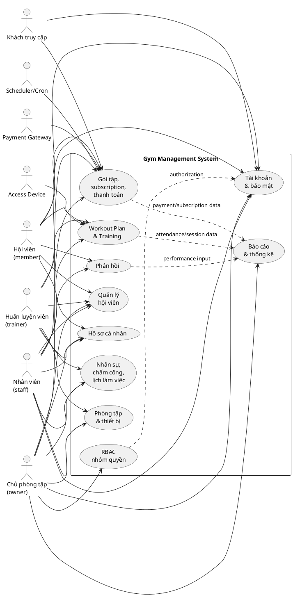
```plantuml
@startuml GMS_Overview_UseCase
left to right direction
skinparam packageStyle rectangle

actor "Khách truy cập" as Guest
actor "Hội viên\n(member)" as Member
actor "Huấn luyện viên\n(trainer)" as Trainer
actor "Nhân viên\n(staff)" as Staff
actor "Chủ phòng tập\n(owner)" as Owner
actor "Payment Gateway" as Payment
actor "Access Device" as Device
actor "Scheduler/Cron" as Scheduler

rectangle "Gym Management System" {
  usecase "Tài khoản\n& bảo mật" as UC_AUTH
  usecase "Hồ sơ cá nhân" as UC_PROFILE
  usecase "Quản lý\nhội viên" as UC_MEMBER
  usecase "Gói tập,\nsubscription,\nthanh toán" as UC_PACKAGE
  usecase "Workout Plan\n& Training" as UC_TRAINING
  usecase "Nhân sự,\nchấm công,\nlịch làm việc" as UC_STAFF
  usecase "Phản hồi" as UC_FEEDBACK
  usecase "Phòng tập\n& thiết bị" as UC_FACILITY
  usecase "Báo cáo\n& thống kê" as UC_REPORT
  usecase "RBAC\nnhóm quyền" as UC_RBAC
}

Guest --> UC_AUTH
Guest --> UC_PACKAGE

Member --> UC_AUTH
Member --> UC_PROFILE
Member --> UC_PACKAGE
Member --> UC_TRAINING
Member --> UC_FEEDBACK
Member --> UC_MEMBER

Trainer --> UC_AUTH
Trainer --> UC_PROFILE
Trainer --> UC_MEMBER
Trainer --> UC_TRAINING
Trainer --> UC_STAFF
Trainer --> UC_FACILITY

Staff --> UC_AUTH
Staff --> UC_PROFILE
Staff --> UC_MEMBER
Staff --> UC_PACKAGE
Staff --> UC_STAFF
Staff --> UC_FEEDBACK
Staff --> UC_FACILITY
Staff --> UC_TRAINING

Owner --> UC_AUTH
Owner --> UC_PROFILE
Owner --> UC_PACKAGE
Owner --> UC_STAFF
Owner --> UC_FACILITY
Owner --> UC_REPORT
Owner --> UC_RBAC
Owner --> UC_MEMBER

Payment --> UC_PACKAGE
Device --> UC_TRAINING
Scheduler --> UC_PACKAGE

UC_PACKAGE ..> UC_REPORT : payment/subscription data
UC_TRAINING ..> UC_REPORT : attendance/session data
UC_FEEDBACK ..> UC_REPORT : performance input
UC_RBAC ..> UC_AUTH : authorization
@enduml
```

### Ràng buộc tổng quan

- Các màn hình sau đăng nhập được bảo vệ theo vai trò: `member`, `trainer`, `staff`, `owner`; riêng luồng đăng ký member, xác thực email và thanh toán ban đầu được mở hoặc bảo vệ theo từng bước nghiệp vụ.
- Với role `member`, các màn hình workout, attendance, progress và feedback chỉ sử dụng được khi hội viên có gói tập đang hoạt động.
- Gói tập hiện tại là **time-based** theo thời hạn sử dụng; attendance chỉ ghi nhận lượt vào/ra, không trừ số buổi.
- Owner là actor duy nhất của nhóm báo cáo tổng hợp và RBAC. Staff có thể vận hành tại quầy nhưng không xem báo cáo doanh thu/quản trị quyền nếu chưa được cấp quyền tương ứng.
- Trainer chỉ xem/quản lý học viên, lịch và tiến độ trong phạm vi được phân công, không quản trị toàn bộ hội viên.

---

## 2.3 Biểu đồ Use Case Phân rã

Các sơ đồ dưới đây dùng PlantUML để có thể dựng lại bằng PlantUML hoặc Astah. Nội dung phân rã bám theo các module hiện có trong project: `auth`, `members`, `packages`, `subscriptions`, `payments`, `payment-accounts`, `staff`, `feedback`, `facility`, `workout`, `training`, `reports`, `rbac`.

### 2.3.1 Phân rã Tài khoản - Bảo mật

Nhóm này bao phủ đăng nhập, phiên người dùng, quên/đặt lại mật khẩu, xác thực email, đổi mật khẩu và đăng ký tài khoản hội viên. Đây là lớp tiền đề cho mọi chức năng cần xác thực người dùng bằng JWT.

**Use case chính:**

| Use case | Actor | Màn hình/chức năng liên quan |
|---|---|---|
| Đăng nhập | Tất cả role | Người dùng nhập thông tin đăng nhập; hệ thống xác thực, tạo phiên đăng nhập và điều hướng theo vai trò. |
| Xem phiên hiện tại | Tất cả role đã đăng nhập | Hệ thống hiển thị trạng thái đăng nhập, vai trò và hồ sơ liên quan để giao diện tải đúng quyền. |
| Đăng xuất | Tất cả role đã đăng nhập | Người dùng kết thúc phiên đăng nhập; giao diện xóa thông tin đăng nhập cục bộ. |
| Quên mật khẩu | Khách truy cập/tất cả role | Màn hình quên mật khẩu tiếp nhận email/số điện thoại và gửi hướng dẫn xác nhận. |
| Đặt lại mật khẩu | Khách truy cập/tất cả role | Màn hình đặt lại mật khẩu cho phép người dùng nhập OTP/token và mật khẩu mới. |
| Xác thực email | Member/Staff mới tạo | Màn hình xác thực email và gửi lại mã xác thực khi người dùng chưa nhận được mã. |
| Đổi mật khẩu | Người dùng đã đăng nhập | Màn hình đổi mật khẩu yêu cầu mật khẩu hiện tại và mật khẩu mới. |
| Đăng ký hội viên online | Khách truy cập | Trang đăng ký hội viên online, màn hình xác thực email và màn hình thanh toán ban đầu. |
| Quản lý hồ sơ cá nhân | Member/Trainer/Staff/Owner | Trang hồ sơ cá nhân theo từng vai trò, cho phép xem và cập nhật thông tin được phép. |

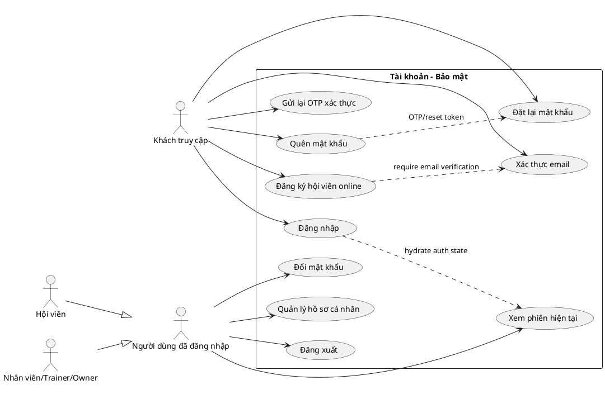
```plantuml
@startuml GMS_Account_Security
left to right direction
skinparam packageStyle rectangle

actor "Khách truy cập" as Guest
actor "Người dùng đã đăng nhập" as User
actor "Hội viên" as Member
actor "Nhân viên/Trainer/Owner" as InternalUser

rectangle "Tài khoản - Bảo mật" {
  usecase "Đăng nhập" as Login
  usecase "Xem phiên hiện tại" as Me
  usecase "Đăng xuất" as Logout
  usecase "Quên mật khẩu" as Forgot
  usecase "Đặt lại mật khẩu" as Reset
  usecase "Xác thực email" as Verify
  usecase "Gửi lại OTP xác thực" as Resend
  usecase "Đổi mật khẩu" as ChangePassword
  usecase "Đăng ký hội viên online" as SelfRegister
  usecase "Quản lý hồ sơ cá nhân" as Profile
}

Guest --> Login
Guest --> Forgot
Guest --> Reset
Guest --> SelfRegister
Guest --> Verify
Guest --> Resend

User --> Me
User --> Logout
User --> ChangePassword
User --> Profile

Member --|> User
InternalUser --|> User

SelfRegister ..> Verify : require email verification
Forgot ..> Reset : OTP/reset token
Login ..> Me : hydrate auth state
@enduml
```

### 2.3.2 Phân rã Quản lý Hội viên

Nhóm này bao phủ quản lý hội viên, hồ sơ cá nhân, gán/chọn trainer, xem học viên của trainer và theo dõi tiến độ luyện tập. Project hiện tách dữ liệu tài khoản (`users`) và dữ liệu hội viên (`members`), nên thao tác hội viên có thể đi qua cả trang tự phục vụ của member lẫn màn hình quản lý của staff/trainer/owner.

**Use case chính:**

| Use case | Actor | Màn hình/chức năng liên quan |
|---|---|---|
| Xem danh sách hội viên | Staff, Trainer, Owner | Màn hình danh sách hội viên có lọc theo vai trò; trainer chỉ thấy học viên mình phụ trách. |
| Tạo hội viên tại quầy | Staff, Owner | Nhân viên nhập thông tin hội viên, chọn gói tập ban đầu và tạo tài khoản/hồ sơ hội viên tại quầy. |
| Xem chi tiết hội viên | Member, Trainer, Staff, Owner | Màn hình chi tiết hồ sơ; member xem chính mình, trainer xem học viên mình phụ trách. |
| Cập nhật hồ sơ hội viên | Member self-field| Member cập nhật các trường được phép trong hồ sơ cá nhân. |
| Gán hoặc bỏ trainer cho hội viên | Staff, Owner, Member chọn trainer | Màn hình phân công trainer và chức năng hội viên tự chọn trainer trong phạm vi được phép. |
| Xem học viên đang huấn luyện | Trainer | Màn hình học viên của trainer, kèm thông tin hồ sơ, lịch tập và tiến độ liên quan. |
| Ghi nhận tiến độ luyện tập | Trainer, Member self-progress | Trainer hoặc hội viên nhập chỉ số cơ thể, ghi chú luyện tập và kết quả theo từng thời điểm. |
| Xem tiến độ luyện tập | Member, Trainer, Staff, Owner | Màn hình tiến độ hiển thị lịch sử chỉ số và biểu đồ theo dõi quá trình luyện tập. |

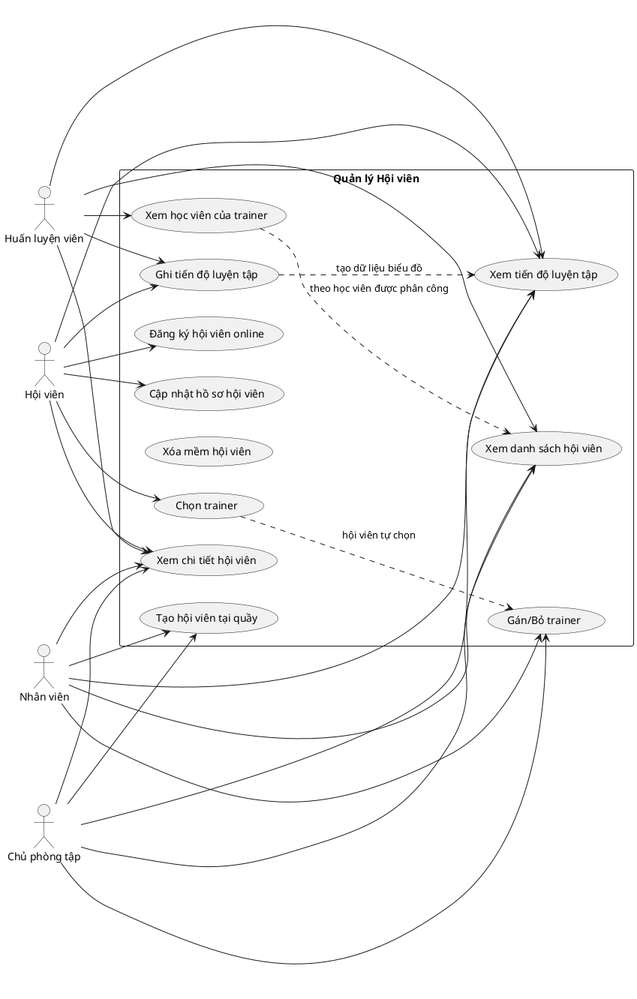
```plantuml
@startuml GMS_Member_Management
left to right direction
skinparam packageStyle rectangle

actor "Hội viên" as Member
actor "Huấn luyện viên" as Trainer
actor "Nhân viên" as Staff
actor "Chủ phòng tập" as Owner

rectangle "Quản lý Hội viên" {
  usecase "Xem danh sách hội viên" as ListMembers
  usecase "Tạo hội viên tại quầy" as CreateMember
  usecase "Đăng ký hội viên online" as SelfRegister
  usecase "Xem chi tiết hội viên" as ViewMember
  usecase "Cập nhật hồ sơ hội viên" as UpdateMember
  usecase "Xóa mềm hội viên" as DeleteMember
  usecase "Gán/Bỏ trainer" as AssignTrainer
  usecase "Chọn trainer" as ChooseTrainer
  usecase "Xem học viên của trainer" as TrainerStudents
  usecase "Ghi tiến độ luyện tập" as RecordProgress
  usecase "Xem tiến độ luyện tập" as ViewProgress
}

Member --> SelfRegister
Member --> ViewMember
Member --> UpdateMember
Member --> ChooseTrainer
Member --> ViewProgress
Member --> RecordProgress

Trainer --> ListMembers
Trainer --> ViewMember
Trainer --> TrainerStudents
Trainer --> RecordProgress
Trainer --> ViewProgress

Staff --> ListMembers
Staff --> CreateMember
Staff --> ViewMember
Staff --> AssignTrainer
Staff --> ViewProgress

Owner --> ListMembers
Owner --> CreateMember
Owner --> ViewMember
Owner --> AssignTrainer
Owner --> ViewProgress

TrainerStudents ..> ListMembers : theo học viên được phân công
ChooseTrainer ..> AssignTrainer : hội viên tự chọn
RecordProgress ..> ViewProgress : tạo dữ liệu biểu đồ
@enduml
```

### 2.3.3 Phân rã Gói tập, Đăng ký gói & Thanh toán

Nhóm này bao phủ danh mục gói tập, gói hội viên đang sử dụng, mua/gia hạn/hủy gói, tài khoản thanh toán, ghi nhận thanh toán và hóa đơn/giao dịch. Đây là luồng tạo doanh thu chính của hệ thống.

**Use case chính:**

| Use case | Actor | Màn hình/chức năng liên quan |
|---|---|---|
| Xem danh sách gói tập | Khách truy cập, Member, Staff, Trainer, Owner | Trang danh mục gói tập công khai và màn hình chọn gói trong các luồng mua/gia hạn. |
| Quản lý gói tập | Owner; Staff nếu được cấp quyền quản lý gói | Màn hình quản trị gói tập cho phép tạo, cập nhật, bật/tắt trạng thái và theo dõi gói đang bán. |
| Xem gói hiện tại | Member, Staff, Owner | Màn hình gói hiện tại hiển thị thời hạn, trạng thái, quyền lợi và thông tin thanh toán liên quan. |
| Xem lịch sử gói đã đăng ký | Member, Staff, Owner | Màn hình lịch sử gói tập cho biết các lần mua, gia hạn, hủy hoặc hết hạn trước đây. |
| Đăng ký/mua gói mới | Member, Staff | Hội viên hoặc nhân viên chọn gói, kiểm tra thông tin và khởi tạo gói ở trạng thái chờ thanh toán. |
| Gia hạn gói hiện tại | Member, Staff | Màn hình gia hạn cho phép chọn thời điểm/chu kỳ gia hạn và chuyển sang bước thanh toán. |
| Hủy gói hiện tại | Member| Màn hình quản lý gói cho phép hủy gói theo điều kiện nghiệp vụ.|
| Quản lý tài khoản thanh toán | Member| Màn hình tài khoản thanh toán lưu thông tin phương thức thanh toán phục vụ các lần mua/gia hạn sau. |
| Ghi nhận thanh toán | Member, Staff, Payment Gateway | Màn hình thanh toán tại quầy/online ghi nhận tiền mặt, thẻ, ví điện tử hoặc kết quả xác nhận từ cổng thanh toán. |
| Xem giao dịch/hóa đơn | Owner, Staff theo nghiệp vụ quầy | Màn hình giao dịch/hóa đơn cho phép tra cứu, lọc và đối soát thanh toán. |
| Quản lý danh sách hóa đơn | Owner, Staff vận hành | Danh sách hóa đơn được tạo sau khi thanh toán, có chức năng lọc, xem chi tiết và phục vụ đối soát. |
| Áp dụng/kích hoạt/hết hạn gói tập | Scheduler, hệ thống sau thanh toán thành công | Cron tự động kích hoạt gói sau khi thanh toán thành công, đồng thời hết hạn hoặc hủy các gói chờ quá lâu. |

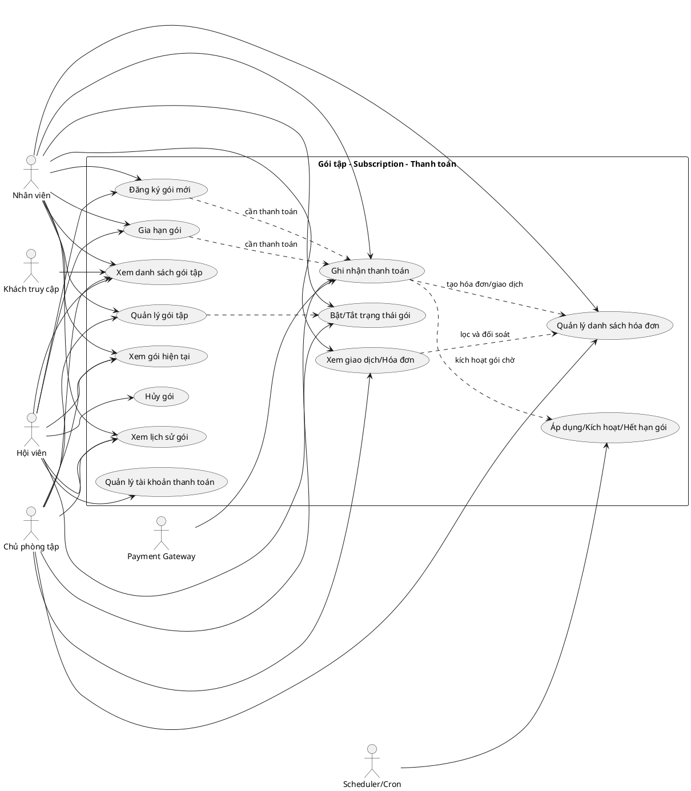
```plantuml
@startuml GMS_Package_Subscription_Payment
left to right direction
skinparam packageStyle rectangle

actor "Khách truy cập" as Guest
actor "Hội viên" as Member
actor "Nhân viên" as Staff
actor "Chủ phòng tập" as Owner
actor "Payment Gateway" as Payment
actor "Scheduler/Cron" as Scheduler

rectangle "Gói tập - Subscription - Thanh toán" {
  usecase "Xem danh sách gói tập" as BrowsePackages
  usecase "Quản lý gói tập" as ManagePackages
  usecase "Bật/Tắt trạng thái gói" as TogglePackage
  usecase "Xem gói hiện tại" as CurrentSub
  usecase "Xem lịch sử gói" as SubHistory
  usecase "Đăng ký gói mới" as CreateSub
  usecase "Gia hạn gói" as RenewSub
  usecase "Hủy gói" as CancelSub
  usecase "Quản lý tài khoản thanh toán" as PaymentAccounts
  usecase "Ghi nhận thanh toán" as CreatePayment
  usecase "Xem giao dịch/Hóa đơn" as ListPayments
  usecase "Quản lý danh sách hóa đơn" as ManageInvoices
  usecase "Áp dụng/Kích hoạt/Hết hạn gói" as SubscriptionCron
}

Guest --> BrowsePackages

Member --> BrowsePackages
Member --> CurrentSub
Member --> SubHistory
Member --> CreateSub
Member --> RenewSub
Member --> CancelSub
Member --> PaymentAccounts
Member --> CreatePayment

Staff --> BrowsePackages
Staff --> CurrentSub
Staff --> SubHistory
Staff --> CreateSub
Staff --> RenewSub
Staff --> CreatePayment
Staff --> ListPayments
Staff --> ManageInvoices
Staff --> ManagePackages
Staff --> TogglePackage

Owner --> BrowsePackages
Owner --> ManagePackages
Owner --> TogglePackage
Owner --> CurrentSub
Owner --> SubHistory
Owner --> ListPayments
Owner --> ManageInvoices

Payment --> CreatePayment
Scheduler --> SubscriptionCron

CreateSub ..> CreatePayment : cần thanh toán
RenewSub ..> CreatePayment : cần thanh toán
CreatePayment ..> ManageInvoices : tạo hóa đơn/giao dịch
ListPayments ..> ManageInvoices : lọc và đối soát
CreatePayment ..> SubscriptionCron : kích hoạt gói chờ
ManagePackages ..> TogglePackage
@enduml
```

### 2.3.4 Phân rã Quản lý Nhân sự, Chấm công & Lịch làm việc

Nhóm này bao phủ tài khoản nhân sự, lịch làm việc, chấm công cá nhân và dữ liệu đánh giá hiệu suất. Project hiện có `staff`, `staff_schedules`, `staff_attendance_logs` và báo cáo hiệu suất trong module `reports`.

**Use case chính:**

| Use case | Actor | Màn hình/chức năng liên quan |
|---|---|---|
| Xem danh sách nhân sự | Owner, Staff có quyền | Màn hình danh sách nhân sự có tìm kiếm, lọc vai trò và xem nhanh trạng thái làm việc. |
| Tạo/cập nhật/xóa nhân sự | Owner | Màn hình quản lý nhân sự cho phép tạo hồ sơ, cập nhật thông tin và ngừng kích hoạt nhân sự. |
| Xem hồ sơ nhân sự cá nhân | Staff, Trainer, Owner | Trang hồ sơ cá nhân theo vai trò, hiển thị thông tin liên hệ, vai trò và thông tin công việc. |
| Xem lịch làm việc cá nhân | Staff, Trainer | Màn hình lịch cá nhân hoặc sidebar/profile hiển thị ca làm và lịch được phân công. |
| Xem lịch tất cả nhân sự | Owner, Staff có quyền | Màn hình lịch tổng hợp giúp theo dõi phân công nhân sự theo ngày/tuần/khoảng thời gian. |
| Quản lý lịch làm việc | Owner, Staff có quyền | Màn hình phân công ca cho phép thêm, cập nhật hoặc xóa lịch làm việc của nhân sự. |
| Chấm công vào/ra | Staff, Owner nếu có staff profile | Chức năng chấm công cá nhân ghi nhận thời điểm vào/ra ca làm việc. |
| Xem lịch sử chấm công cá nhân | Staff, Owner nếu có staff profile | Màn hình lịch sử chấm công hiển thị các lần vào/ra và trạng thái ca làm. |
| Đánh giá hiệu suất làm việc | Owner | Báo cáo dựa trên sessions, attendance, feedback, revenue/operation data. |

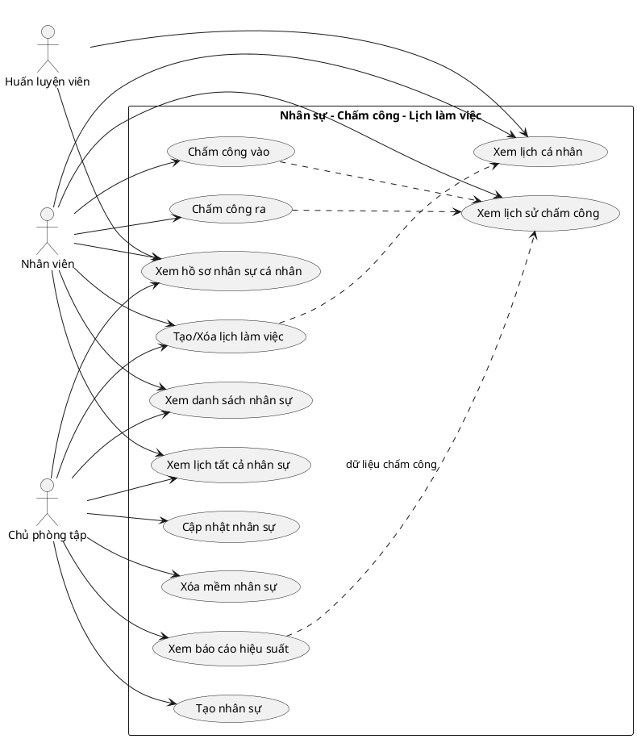
```plantuml
@startuml GMS_Staff_HR
left to right direction
skinparam packageStyle rectangle

actor "Nhân viên" as Staff
actor "Huấn luyện viên" as Trainer
actor "Chủ phòng tập" as Owner

rectangle "Nhân sự - Chấm công - Lịch làm việc" {
  usecase "Xem danh sách nhân sự" as ListStaff
  usecase "Tạo nhân sự" as CreateStaff
  usecase "Cập nhật nhân sự" as UpdateStaff
  usecase "Xóa mềm nhân sự" as DeleteStaff
  usecase "Xem hồ sơ nhân sự cá nhân" as StaffMe
  usecase "Xem lịch cá nhân" as PersonalSchedule
  usecase "Xem lịch tất cả nhân sự" as AllSchedules
  usecase "Tạo/Xóa lịch làm việc" as ManageSchedules
  usecase "Chấm công vào" as CheckIn
  usecase "Chấm công ra" as CheckOut
  usecase "Xem lịch sử chấm công" as AttendanceHistory
  usecase "Xem báo cáo hiệu suất" as PerformanceReport
}

Staff --> StaffMe
Staff --> PersonalSchedule
Staff --> CheckIn
Staff --> CheckOut
Staff --> AttendanceHistory
Staff --> ListStaff
Staff --> AllSchedules
Staff --> ManageSchedules

Trainer --> StaffMe
Trainer --> PersonalSchedule

Owner --> ListStaff
Owner --> CreateStaff
Owner --> UpdateStaff
Owner --> DeleteStaff
Owner --> StaffMe
Owner --> AllSchedules
Owner --> ManageSchedules
Owner --> PerformanceReport

ManageSchedules ..> PersonalSchedule
CheckIn ..> AttendanceHistory
CheckOut ..> AttendanceHistory
PerformanceReport ..> AttendanceHistory : dữ liệu chấm công
@enduml
```

### 2.3.5 Phân rã Phản hồi

Nhóm này bao phủ việc hội viên gửi phản hồi và nhân viên/chủ phòng tập xử lý phản hồi. Project hỗ trợ feedback theo loại `staff`, `equipment`, `service`, có trạng thái `open`, `in_progress`, `resolved`, `rejected` và có thể xóa mềm.

**Use case chính:**

| Use case | Actor | Màn hình/chức năng liên quan |
|---|---|---|
| Gửi phản hồi | Member| Màn hình gửi phản hồi cho phép chọn loại phản hồi, nhập nội dung và đính kèm thông tin nhân sự/thiết bị liên quan nếu có. |
| Xem phản hồi của tôi | Member | Màn hình phản hồi cá nhân hiển thị các phản hồi đã gửi và trạng thái xử lý. |
| Xem danh sách/chi tiết phản hồi | Staff, Owner | Màn hình quản lý phản hồi cho phép lọc danh sách, xem chi tiết nội dung và lịch sử xử lý. |
| Phân công xử lý phản hồi | Staff, Owner | Chức năng phân công người phụ trách để chuyển phản hồi vào luồng xử lý. |
| Cập nhật trạng thái xử lý | Staff, Owner | Chức năng cập nhật trạng thái phản hồi từ mới tiếp nhận đến đang xử lý, đã xử lý hoặc từ chối. |
| Xóa phản hồi | Member | Màn hình xem phản hồi của member cho phép xóa phản hồi khi cần.|

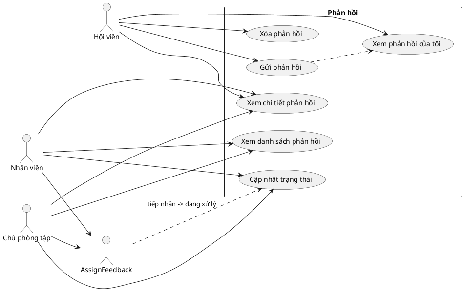
```plantuml
@startuml GMS_Feedback
left to right direction
skinparam packageStyle rectangle

actor "Hội viên" as Member
actor "Nhân viên" as Staff
actor "Chủ phòng tập" as Owner

rectangle "Phản hồi" {
  usecase "Gửi phản hồi" as CreateFeedback
  usecase "Xem phản hồi của tôi" as MyFeedback
  usecase "Xem danh sách phản hồi" as ListFeedback
  usecase "Xem chi tiết phản hồi" as FeedbackDetail
  usecase "Cập nhật trạng thái" as UpdateStatus
  usecase "Xóa phản hồi" as DeleteFeedback
}

Member --> CreateFeedback
Member --> MyFeedback
Member --> FeedbackDetail
Member --> DeleteFeedback

Staff --> ListFeedback
Staff --> FeedbackDetail
Staff --> AssignFeedback
Staff --> UpdateStatus


Owner --> ListFeedback
Owner --> FeedbackDetail
Owner --> AssignFeedback
Owner --> UpdateStatus

AssignFeedback ..> UpdateStatus : tiếp nhận -> đang xử lý
CreateFeedback ..> MyFeedback
@enduml
```

### 2.3.6 Phân rã Thiết bị & Phòng tập

Nhóm này bao phủ quản lý phòng tập, quản lý thiết bị và nhật ký bảo trì. Project dùng module `facility` với các dữ liệu phòng, thiết bị và bảo trì; phòng được dùng để xếp lịch training session, thiết bị có thể là đối tượng phản hồi/bảo trì.

**Use case chính:**

| Use case | Actor | Màn hình/chức năng liên quan |
|---|---|---|
| Quản lý phòng tập | Staff, Owner | Màn hình phòng tập cho phép xem danh sách, thêm phòng mới, cập nhật thông tin và ngừng sử dụng phòng. |
| Tra cứu phòng để lập lịch | Trainer | Chức năng chọn phòng khả dụng khi tạo hoặc điều chỉnh training session. |
| Quản lý thiết bị | Staff, Owner | Màn hình thiết bị cho phép xem danh sách, thêm thiết bị, cập nhật thông tin và ngừng sử dụng thiết bị. |
| Xem lịch sử bảo trì thiết bị | Staff, Owner| Màn hình chi tiết thiết bị hiển thị các lần báo hỏng, sửa chữa và kết quả bảo trì. |
| Báo hỏng thiết bị | Staff, Owner | Màn hình nhập mô tả sự cố, mức độ ảnh hưởng và tạo yêu cầu bảo trì. |
| Cập nhật trạng thái bảo trì | Staff, Owner | Màn hình bảo trì cho phép chuyển trạng thái xử lý, ghi chú kết quả và thời điểm hoàn tất. |
| Liên kết phản hồi thiết bị | Member, Staff, Owner | Phản hồi liên quan đến thiết bị có thể tham chiếu thiết bị cụ thể để nhân viên theo dõi và bảo trì. |

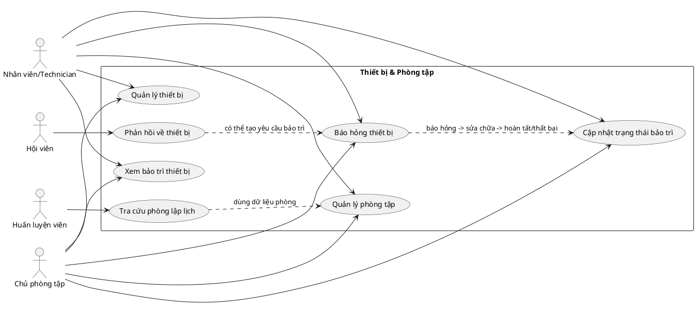
```plantuml
@startuml GMS_Facility
left to right direction
skinparam packageStyle rectangle

actor "Hội viên" as Member
actor "Huấn luyện viên" as Trainer
actor "Nhân viên/Technician" as Staff
actor "Chủ phòng tập" as Owner

rectangle "Thiết bị & Phòng tập" {
  usecase "Quản lý phòng tập" as RoomCrud
  usecase "Tra cứu phòng lập lịch" as RoomLookup
  usecase "Quản lý thiết bị" as EquipmentCrud
  usecase "Xem bảo trì thiết bị" as MaintenanceRead
  usecase "Báo hỏng thiết bị" as MaintenanceReport
  usecase "Cập nhật trạng thái bảo trì" as MaintenanceResolve
  usecase "Phản hồi về thiết bị" as EquipmentFeedback
}

Member --> EquipmentFeedback

Trainer --> RoomLookup

Staff --> RoomCrud
Staff --> EquipmentCrud
Staff --> MaintenanceRead
Staff --> MaintenanceReport
Staff --> MaintenanceResolve

Owner --> RoomCrud
Owner --> EquipmentCrud
Owner --> MaintenanceRead
Owner --> MaintenanceReport
Owner --> MaintenanceResolve

EquipmentFeedback ..> MaintenanceReport : có thể tạo yêu cầu bảo trì
RoomLookup ..> RoomCrud : dùng dữ liệu phòng
MaintenanceReport ..> MaintenanceResolve : báo hỏng -> sửa chữa -> hoàn tất/thất bại
@enduml
```

### 2.3.7 Phân rã Workout Plan & Training

Nhóm này là phần vận hành tập luyện. Project đã tách rõ thư viện bài tập, workout plan, plan được giao cho hội viên, nhật ký buổi tập, training session, attendance và tiến độ.

**Use case chính:**

| Use case | Actor | Màn hình/chức năng liên quan |
|---|---|---|
| Xem thư viện bài tập | Member, Trainer| Màn hình thư viện bài tập cho phép xem, tìm kiếm và tra cứu hướng dẫn bài tập. |
| Quản lý bài tập | Trainer | Màn hình quản lý bài tập cho phép thêm, chỉnh sửa, ẩn/xóa bài tập theo quyền được cấp. |
| Quản lý workout plan | Trainer, Member với plan tự tạo | Trainer hoặc member tạo, chỉnh sửa và quản lý workout plan trong phạm vi được phép. |
| Xây dựng giáo án/plan theo ngày và bài tập | Trainer, Member | Màn hình dựng plan cho phép chia ngày tập, chọn bài tập, số hiệp, số lần và ghi chú kỹ thuật. |
| Giao workout plan cho hội viên | Trainer | Trainer chọn hội viên, chọn workout plan phù hợp và giao plan để hội viên theo dõi. |
| Xem plan PT giao | Member | Màn hình plan được giao hiển thị lịch tập, bài tập và hướng dẫn từ trainer. |
| Áp dụng/bắt đầu plan | Member | Hội viên bắt đầu một buổi tập từ plan được giao hoặc plan tự tạo; hệ thống khởi tạo nhật ký buổi tập. |
| Điều chỉnh plan | Trainer với plan do nhân sự tạo, Member với plan tự tạo | Hệ thống không cho chỉnh sửa phần đã có lịch sử tập để bảo toàn dữ liệu theo dõi. |
| Ghi nhận kết quả buổi tập | Member | Hội viên nhập kết quả buổi tập, cảm nhận, số hiệp/số lần hoàn thành và ghi chú nếu có. |
| Lập lịch training session | Trainer | Màn hình lập lịch cho phép chọn hội viên, trainer, phòng tập, thời gian và nội dung buổi tập. |
| Xem lịch tập | Member, Trainer| Màn hình lịch tập hiển thị các buổi đã lên lịch, trạng thái và thông tin liên quan. |
| Check-in hội viên | Access Device, Staff, Member xem log | Thiết bị kiểm soát ra/vào gửi thông tin check-in của hội viên về hệ thống. Hệ thống kiểm tra quyền truy cập và tự động ghi nhận lượt vào phòng tập; nhân viên có thể hỗ trợ check-in thủ công khi cần. |
| Ghi và xem tiến độ | Trainer, Member | Kết nối với nhóm Hội viên ở 2.3.2. |

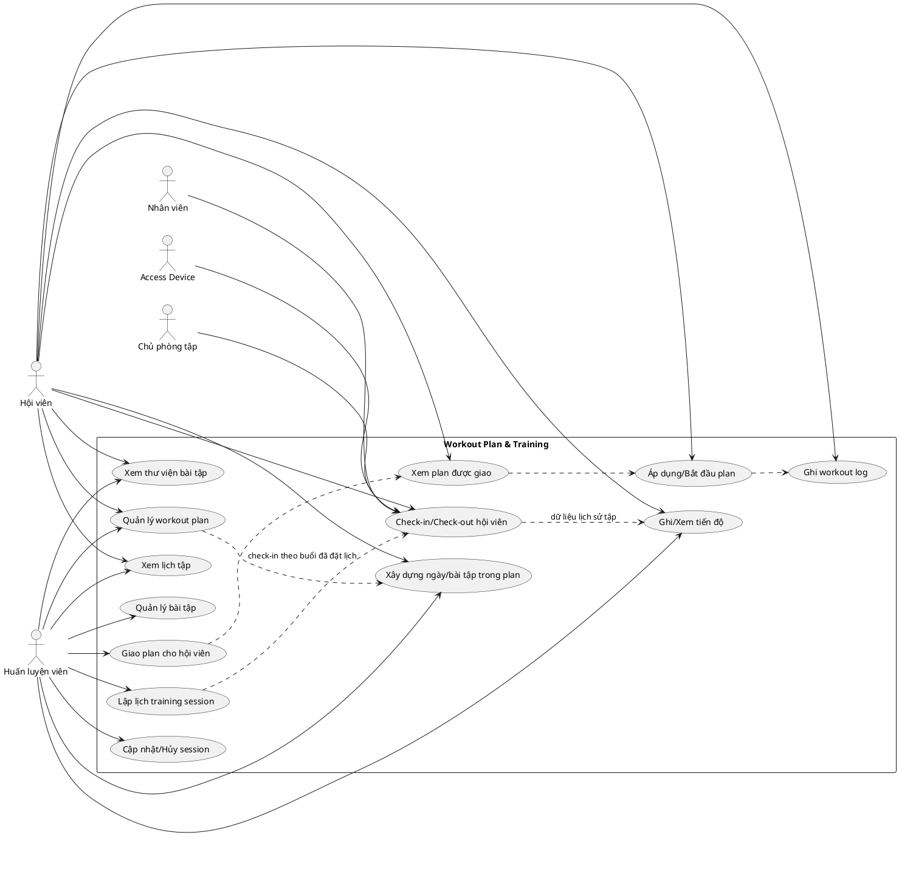
```plantuml
@startuml GMS_Workout_Training
left to right direction
skinparam packageStyle rectangle

actor "Hội viên" as Member
actor "Huấn luyện viên" as Trainer
actor "Nhân viên" as Staff
actor "Chủ phòng tập" as Owner
actor "Access Device" as Device

rectangle "Workout Plan & Training" {
  usecase "Xem thư viện bài tập" as ExerciseRead
  usecase "Quản lý bài tập" as ExerciseCrud
  usecase "Quản lý workout plan" as PlanCrud
  usecase "Xây dựng ngày/bài tập trong plan" as PlanBuilder
  usecase "Giao plan cho hội viên" as AssignPlan
  usecase "Xem plan được giao" as ViewAssignedPlan
  usecase "Áp dụng/Bắt đầu plan" as ApplyPlan
  usecase "Ghi workout log" as WorkoutLog
  usecase "Lập lịch training session" as CreateSession
  usecase "Cập nhật/Hủy session" as ManageSession
  usecase "Xem lịch tập" as ViewSchedule
  usecase "Check-in/Check-out hội viên" as Attendance
  usecase "Ghi/Xem tiến độ" as Progress
}

Member --> ExerciseRead
Member --> PlanCrud
Member --> PlanBuilder
Member --> ViewAssignedPlan
Member --> ApplyPlan
Member --> WorkoutLog
Member --> ViewSchedule
Member --> Attendance
Member --> Progress

Trainer --> ExerciseRead
Trainer --> ExerciseCrud
Trainer --> PlanCrud
Trainer --> PlanBuilder
Trainer --> AssignPlan
Trainer --> CreateSession
Trainer --> ManageSession
Trainer --> ViewSchedule
Trainer --> Progress

Staff --> Attendance

Owner --> Attendance

Device --> Attendance

PlanCrud ..> PlanBuilder
AssignPlan ..> ViewAssignedPlan
ViewAssignedPlan ..> ApplyPlan
ApplyPlan ..> WorkoutLog
CreateSession ..> Attendance : check-in theo buổi đã đặt lịch
Attendance ..> Progress : dữ liệu lịch sử tập
@enduml
```

### 2.3.8 Phân rã Báo cáo & Thống kê

Nhóm này phục vụ Owner trong việc theo dõi doanh thu, hội viên mới, tỷ lệ gia hạn, gói bán chạy và hiệu suất nhân viên/trainer. Dữ liệu báo cáo vẫn đọc từ `payments`, `subscriptions`, `members`, `training_sessions`, `feedback`, `staff_attendance_logs` và các bảng liên quan; phần xem giao dịch, hóa đơn và ghi nhận thanh toán thuộc nhóm 2.3.3 Gói tập, Đăng ký gói & Thanh toán.

**Use case chính:**

| Use case | Actor | Màn hình/chức năng liên quan |
|---|---|---|
| Xem doanh thu | Owner | Dashboard doanh thu theo thời gian, nguồn thanh toán và các chỉ số tổng hợp. |
| Xem hội viên mới | Owner | Báo cáo số hội viên mới theo khoảng thời gian, kênh đăng ký và gói đã chọn. |
| Xem tỷ lệ gia hạn | Owner | Báo cáo tỷ lệ hội viên gia hạn, hủy gói hoặc để gói hết hạn. |
| Xem gói bán chạy | Owner | Báo cáo xếp hạng gói tập theo số lượt mua/gia hạn và doanh thu. |
| Xem báo cáo hiệu suất nhân viên | Owner | Báo cáo hiệu suất vận hành dựa trên chấm công, xử lý phản hồi, giao dịch và dữ liệu liên quan. |
| Xem báo cáo hiệu suất trainer/staff | Owner | Báo cáo hiệu suất trainer/staff có lọc theo nhân sự, thời gian và chỉ số đánh giá. |

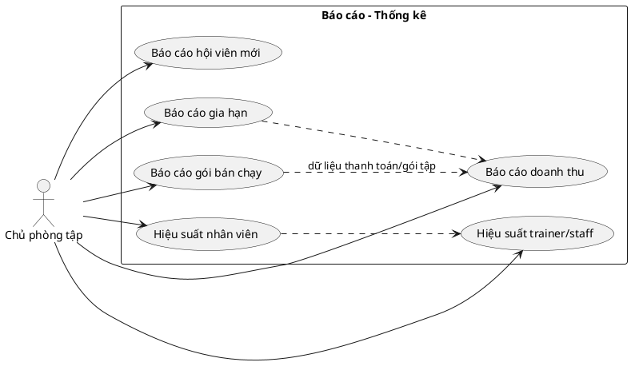
```plantuml
@startuml GMS_Reports_Statistics
left to right direction
skinparam packageStyle rectangle

actor "Chủ phòng tập" as Owner

rectangle "Báo cáo - Thống kê" {
  usecase "Báo cáo doanh thu" as Revenue
  usecase "Báo cáo hội viên mới" as MembersReport
  usecase "Báo cáo gia hạn" as Renewals
  usecase "Báo cáo gói bán chạy" as TopPackages
  usecase "Hiệu suất nhân viên" as EmployeePerformance
  usecase "Hiệu suất trainer/staff" as StaffPerformance
}

Owner --> Revenue
Owner --> MembersReport
Owner --> Renewals
Owner --> TopPackages
Owner --> EmployeePerformance
Owner --> StaffPerformance

Renewals ..> Revenue
TopPackages ..> Revenue : dữ liệu thanh toán/gói tập
EmployeePerformance ..> StaffPerformance
@enduml
```

### 2.3.9 Phân rã Quản lý Phân quyền RBAC

Nhóm này phục vụ Owner trong quản lý phân quyền. Project hiện hỗ trợ quản lý nhóm quyền, gán/gỡ quyền cho nhóm, quản lý người dùng và gán/gỡ nhóm cho người dùng. Riêng danh mục permission hiện là **chỉ đọc** trên giao diện/hệ thống; việc thêm/sửa/xóa permission khi chạy chưa được hỗ trợ trực tiếp, mà được quản lý qua seed/migration.

**Use case chính:**

| Use case | Actor | Màn hình/chức năng liên quan |
|---|---|---|
| Xem danh mục quyền | Owner | Màn hình danh mục quyền hiển thị các permission hiện có và ghi rõ trạng thái chỉ đọc. |
| Xem chi tiết quyền | Owner | Màn hình chi tiết quyền cho biết tên quyền, mô tả và phạm vi áp dụng. |
| Quản lý nhóm quyền | Owner | Màn hình nhóm quyền cho phép tạo, xem, cập nhật và ngừng sử dụng nhóm quyền. |
| Gán quyền cho nhóm | Owner | Owner chọn nhóm quyền và bổ sung các permission phù hợp với phạm vi trách nhiệm của nhóm. |
| Gỡ quyền khỏi nhóm | Owner | Owner loại bỏ permission khỏi nhóm khi nhóm không còn cần quyền đó. |
| Xem danh sách người dùng | Owner | Màn hình người dùng cho phép tra cứu tài khoản, vai trò và trạng thái hoạt động. |
| Cập nhật/xóa người dùng | Owner | Owner cập nhật thông tin tài khoản hoặc ngừng kích hoạt người dùng theo quy trình quản trị. |
| Gán nhóm cho người dùng | Owner | Owner thêm người dùng vào nhóm quyền để cấp bộ quyền tương ứng. |
| Gỡ nhóm khỏi người dùng | Owner | Owner gỡ người dùng khỏi nhóm quyền khi vai trò hoặc phạm vi công việc thay đổi. |

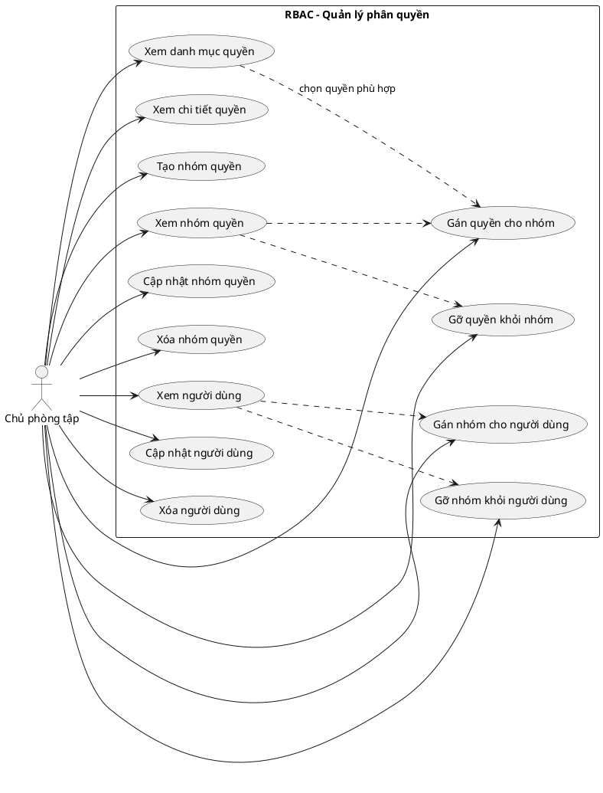
```plantuml
@startuml GMS_RBAC
left to right direction
skinparam packageStyle rectangle

actor "Chủ phòng tập" as Owner

rectangle "RBAC - Quản lý phân quyền" {
  usecase "Xem danh mục quyền" as PermissionList
  usecase "Xem chi tiết quyền" as PermissionDetail
  usecase "Tạo nhóm quyền" as GroupCreate
  usecase "Xem nhóm quyền" as GroupRead
  usecase "Cập nhật nhóm quyền" as GroupUpdate
  usecase "Xóa nhóm quyền" as GroupDelete
  usecase "Gán quyền cho nhóm" as AssignPermission
  usecase "Gỡ quyền khỏi nhóm" as RevokePermission
  usecase "Xem người dùng" as UserRead
  usecase "Cập nhật người dùng" as UserUpdate
  usecase "Xóa người dùng" as UserDelete
  usecase "Gán nhóm cho người dùng" as AssignGroup
  usecase "Gỡ nhóm khỏi người dùng" as RevokeGroup
}

Owner --> PermissionList
Owner --> PermissionDetail
Owner --> GroupCreate
Owner --> GroupRead
Owner --> GroupUpdate
Owner --> GroupDelete
Owner --> AssignPermission
Owner --> RevokePermission
Owner --> UserRead
Owner --> UserUpdate
Owner --> UserDelete
Owner --> AssignGroup
Owner --> RevokeGroup

PermissionList ..> AssignPermission : chọn quyền phù hợp
GroupRead ..> AssignPermission
GroupRead ..> RevokePermission
UserRead ..> AssignGroup
UserRead ..> RevokeGroup
@enduml
```

---

## 2.4 Quy trình Nghiệp vụ

Phần này mô tả các luồng nghiệp vụ cấp tiến trình, bám theo phạm vi use case ở 2.3, các đặc tả chi tiết ở Chương 3 và cấu trúc module hiện có của project. Các luồng có thể do Owner, Staff, Trainer hoặc Member thực hiện tùy quyền RBAC; mọi thao tác làm thay đổi dữ liệu quan trọng cần ghi nhận audit log.

### 2.4.1 Quy trình Đăng nhập - Đăng xuất

**Tác nhân:** Owner, Staff, Trainer, Member.

**Luồng chính:**
1. Người dùng truy cập một trang đăng nhập chung và nhập email, mật khẩu.
2. Hệ thống xác thực thông tin đăng nhập, kiểm tra trạng thái tài khoản (`active`, `locked`, `pending_verification`) và lấy danh sách nhóm quyền của người dùng.
3. Nếu đăng nhập hợp lệ, hệ thống phát hành JWT kèm `roles`, `staffId` hoặc `memberId` nếu có.
4. Giao diện điều hướng theo vai trò:
   - Owner: chuyển đến dashboard quản lý Owner.
   - Staff: chuyển đến dashboard vận hành của Staff.
   - Trainer: chuyển đến dashboard quản lý lịch dạy, hội viên và workout plan.
   - Member: hệ thống kiểm tra gói tập còn hiệu lực trước khi cho vào dashboard.
5. Với Member, nếu chưa có gói tập, gói đang chờ thanh toán, gói đã hủy hoặc gói active nhưng hết hạn, hệ thống chuyển đến màn hình đăng ký gói tập. Nếu có gói tập đang có hiệu lực và còn hạn, hệ thống cho phép truy cập dashboard Member.
6. Khi người dùng đăng xuất, client xóa token phiên hiện tại, gọi logout để ghi nhận sự kiện nếu cần, sau đó chuyển về HomePage.

**Luồng ngoại lệ:**
- Sai email/mật khẩu: hệ thống trả lỗi đăng nhập chung, không tiết lộ tài khoản có tồn tại hay không.
- Tài khoản `locked`: hệ thống từ chối đăng nhập và hướng dẫn liên hệ quản trị.
- Tài khoản `pending_verification`: hệ thống yêu cầu xác thực email trước khi đăng nhập đầy đủ.

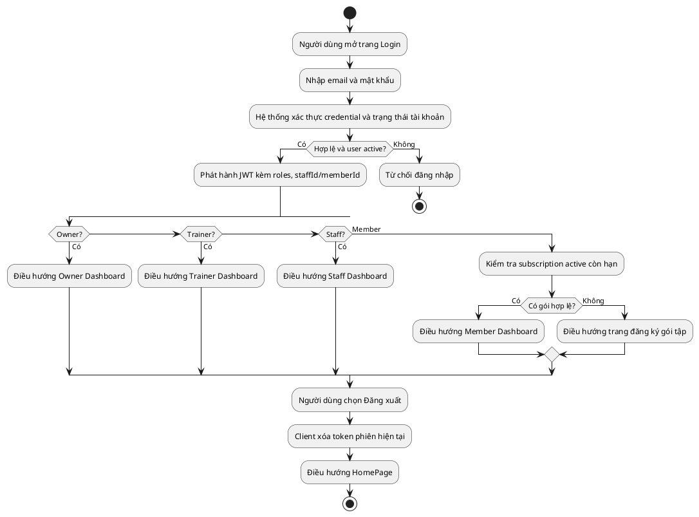
```plantuml
@startuml GMS_Process_Login_Logout
start
:Người dùng mở trang Login;
:Nhập email và mật khẩu;
:Hệ thống xác thực credential và trạng thái tài khoản;

if (Hợp lệ và user active?) then (Có)
  :Phát hành JWT kèm roles, staffId/memberId;
else (Không)
  :Từ chối đăng nhập;
  stop
endif

if (Owner?) then (Có)
  :Điều hướng Owner Dashboard;
elseif (Trainer?) then (Có)
  :Điều hướng Trainer Dashboard;
elseif (Staff?) then (Có)
  :Điều hướng Staff Dashboard;
else (Member)
  :Kiểm tra subscription active còn hạn;
  if (Có gói hợp lệ?) then (Có)
    :Điều hướng Member Dashboard;
  else (Không)
    :Điều hướng trang đăng ký gói tập;
  endif
endif

:Người dùng chọn Đăng xuất;
:Client xóa token phiên hiện tại;
:Điều hướng HomePage;
stop
@enduml
```

### 2.4.2 Quy trình Quản lý Hồ sơ cá nhân

**Tác nhân:** Owner, Staff, Trainer, Member.

**Luồng chính:**
1. Người dùng đã đăng nhập mở màn hình hồ sơ cá nhân.
2. Hệ thống hiển thị thông tin tài khoản hiện tại gồm họ tên, email, số điện thoại, trạng thái tài khoản, nhóm quyền và mã hồ sơ tương ứng (`staffId` hoặc `memberId`) nếu có.
3. Người dùng chỉnh sửa các thông tin được phép thay đổi như họ tên, số điện thoại, ảnh đại diện hoặc thông tin hồ sơ cá nhân liên quan.
4. Trước khi lưu, hệ thống yêu cầu xác nhận thay đổi và validate các trường bắt buộc, định dạng email/SĐT, độ dài dữ liệu.
5. Hệ thống cập nhật hồ sơ, ghi audit log cho các trường thay đổi và hiển thị thông báo thành công.
6. Nếu đổi mật khẩu, người dùng phải nhập mật khẩu hiện tại và mật khẩu mới. Hệ thống kiểm tra mật khẩu hiện tại, hash mật khẩu mới và ghi log sự kiện `auth.change-password`.

**Quy tắc nghiệp vụ:**
- Người dùng được xem và cập nhật hồ sơ của chính mình mà không cần quyền quản trị bổ sung.
- Người dùng không được tự thay đổi `status`, nhóm quyền hoặc quyền chức năng của chính mình.
- Với tài khoản không dùng mật khẩu nội bộ, hệ thống có thể từ chối đổi mật khẩu và yêu cầu dùng phương thức đăng nhập tương ứng.

### 2.4.3 Quy trình Đăng ký Hội viên

Quy trình đăng ký hội viên có hai kênh: Member tự đăng ký online và Staff đăng ký tại quầy. Dù đăng ký theo kênh nào, hội viên mới phải có gói tập hợp lệ sau khi hoàn tất thì mới được truy cập đầy đủ các tính năng Member.

**Luồng đăng ký online:**
1. Khách truy cập trang đăng ký, nhập thông tin cá nhân, email, số điện thoại và mật khẩu.
2. Hệ thống kiểm tra dữ liệu, đảm bảo email/SĐT chưa được sử dụng.
3. Hệ thống tạo `users` với `status='pending_verification'`, tạo `members`, sinh `member_code` và gán group `member`.
4. Hệ thống gửi OTP/link xác thực email.
5. Sau khi xác thực email thành công, tài khoản chuyển sang `active`.
6. Hội viên chọn gói tập, chọn trainer nếu gói có PT, tiến hành thanh toán.
7. Khi thanh toán thành công, subscription được kích hoạt và hội viên được chuyển vào dashboard Member.

**Luồng đăng ký tại quầy:**
1. Staff nhập thông tin khách hàng vào form đăng ký.
2. Hệ thống kiểm tra email/SĐT trùng lặp và validate dữ liệu.
3. Staff chọn gói tập, phương thức thanh toán và trainer nếu gói có PT.
4. Sau khi thu tiền hoặc xác nhận giao dịch thành công, hệ thống tạo user, member, subscription active, payment success trong một giao dịch nghiệp vụ.
5. Hệ thống in/hiển thị biên lai, ghi audit log với Staff là người thực hiện và cung cấp thông tin đăng nhập/xác thực email cho hội viên.

**Quy tắc nghiệp vụ:**
- Đăng ký online có thể tạo subscription `pending` trước, nhưng Member chỉ được vào dashboard sau khi email đã xác thực và gói tập đã thanh toán/kích hoạt.
- Đăng ký tại quầy được xem là Staff đã đối soát khách trực tiếp; hệ thống vẫn cần tạo tài khoản và ghi nhận lịch sử thanh toán rõ ràng.
- Nếu thanh toán thất bại, hệ thống giữ hoặc hủy yêu cầu theo trạng thái hiện tại, cho phép thử lại hoặc chọn phương thức thanh toán khác.

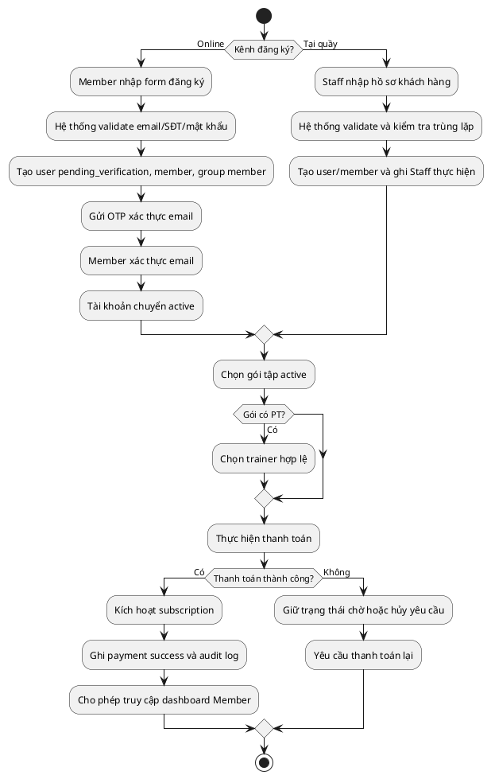
```plantuml
@startuml GMS_Process_Member_Registration
start
if (Kênh đăng ký?) then (Online)
  :Member nhập form đăng ký;
  :Hệ thống validate email/SĐT/mật khẩu;
  :Tạo user pending_verification, member, group member;
  :Gửi OTP xác thực email;
  :Member xác thực email;
  :Tài khoản chuyển active;
else (Tại quầy)
  :Staff nhập hồ sơ khách hàng;
  :Hệ thống validate và kiểm tra trùng lặp;
  :Tạo user/member và ghi Staff thực hiện;
endif

:Chọn gói tập active;
if (Gói có PT?) then (Có)
  :Chọn trainer hợp lệ;
endif
:Thực hiện thanh toán;
if (Thanh toán thành công?) then (Có)
  :Kích hoạt subscription;
  :Ghi payment success và audit log;
  :Cho phép truy cập dashboard Member;
else (Không)
  :Giữ trạng thái chờ hoặc hủy yêu cầu;
  :Yêu cầu thanh toán lại;
endif
stop
@enduml
```

### 2.4.4 Quy trình Quản lý gói tập của hội viên

Quy trình này bao gồm đăng ký gói mới, gia hạn, hủy gói và xem lịch sử gói đã đăng ký. Member có thể tự thực hiện online; Staff có thể thực hiện thay Member tại quầy theo quyền được cấp.

**Đăng ký gói mới:**
1. Member/Staff mở danh sách gói tập đang kinh doanh (gói tập đang có hiệu lực và chưa bị xóa).
2. Hệ thống kiểm tra Member hiện có subscription `pending` hoặc subscription `active` còn hạn hay không.
3. Nếu đã có gói đang hoạt động hoặc đang chờ kích hoạt, hệ thống từ chối đăng ký gói khác. Member phải hủy gói hiện tại hoặc đợi gói hết hạn trước khi đăng ký gói mới.
4. Member/Staff chọn gói. Nếu gói chứa trainer/PT, hệ thống yêu cầu chọn trainer/PT hợp lệ trong danh sách Staff có vị trí trainer/PT.
5. Hệ thống tạo subscription theo ngày bắt đầu tính theo thời điểm đăng kí hiện tại, ngày kết thúc tính theo thời hạn gói và trạng thái ban đầu phù hợp với luồng thanh toán.
6. Sau khi thanh toán thành công, hệ thống kích hoạt gói nếu không còn gói active khác; cập nhật `primaryTrainerId` nếu có trainer.

**Gia hạn gói:**
1. Member/Staff chọn subscription đang có hiệu lực.
2. Hệ thống hiển thị thông tin gói, ngày hết hạn hiện tại, số ngày gia hạn và số tiền cần thanh toán.
3. Sau khi thanh toán thành công, hệ thống tạo payment success và cộng thêm thời hạn gói vào ngày hết hạn hiện tại.
4. Lịch sử gia hạn được ghi vào payment/subscription history và audit log.

**Hủy gói:**
1. Member/Staff chọn gói đang có hiệu lực và yêu cầu hủy.
2. Hệ thống hiển thị cảnh báo: hủy gói làm dừng quyền lợi ngay và không hoàn tiền.
3. Sau khi xác nhận, hệ thống chuyển trạng thái subscription sang Đã hủy, ghi lại thời gian hủy, dừng quyền lợi Member, cập nhật ngày kết thúc hiệu lực hiển thị về ngày hủy và đưa Member về trang đăng ký gói tập.
4. Nếu gói có trainer, hệ thống bỏ gán trainer chính cho Member. Dữ liệu nghiệp vụ dùng thời gian hủy hoặc trường ngày kết thúc tương ứng để thể hiện gói đã hết hiệu lực ngay trong ngày hủy.

**Xem lịch sử gói tập:**
- Member xem lịch sử gói, trạng thái, trainer, ngày bắt đầu/kết thúc và các lần thanh toán của chính mình.
- Staff xem lịch sử theo quyền quản lý.
- Trainer chỉ xem được gói và thanh toán của Member thuộc phạm vi phụ trách.

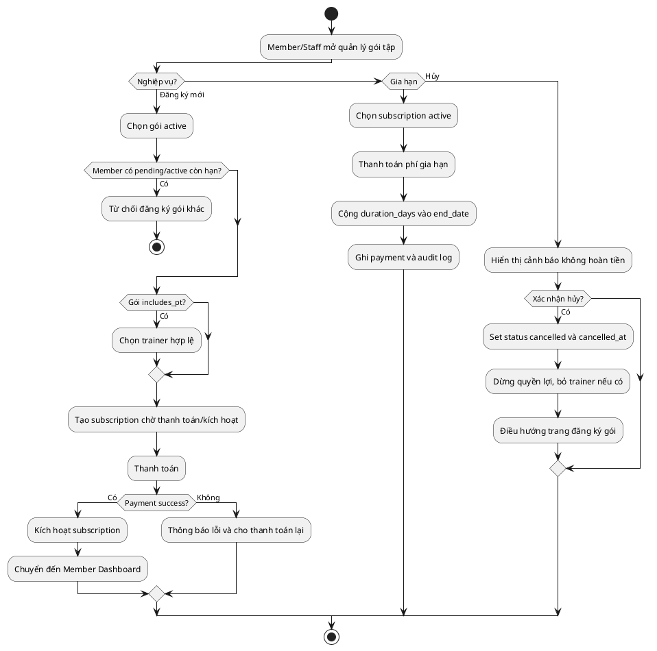
```plantuml
@startuml GMS_Process_Subscription_Lifecycle
start
:Member/Staff mở quản lý gói tập;
if (Nghiệp vụ?) then (Đăng ký mới)
  :Chọn gói active;
  if (Member có pending/active còn hạn?) then (Có)
    :Từ chối đăng ký gói khác;
    stop
  endif
  if (Gói includes_pt?) then (Có)
    :Chọn trainer hợp lệ;
  endif
  :Tạo subscription chờ thanh toán/kích hoạt;
  :Thanh toán;
  if (Payment success?) then (Có)
    :Kích hoạt subscription;
    :Chuyển đến Member Dashboard;
  else (Không)
    :Thông báo lỗi và cho thanh toán lại;
  endif
elseif (Gia hạn)
  :Chọn subscription active;
  :Thanh toán phí gia hạn;
  :Cộng duration_days vào end_date;
  :Ghi payment và audit log;
else (Hủy)
  :Hiển thị cảnh báo không hoàn tiền;
  if (Xác nhận hủy?) then (Có)
    :Set status cancelled và cancelled_at;
    :Dừng quyền lợi, bỏ trainer nếu có;
    :Điều hướng trang đăng ký gói;
  endif
endif
stop
@enduml
```

### 2.4.5 Quy trình Quản lý Hội viên tại quầy

**Tác nhân:** Staff, Owner.

**Luồng chính:**
1. Staff tìm kiếm hội viên theo mã hội viên, tên, email, SĐT, trạng thái tài khoản hoặc trạng thái gói.
2. Hệ thống hiển thị trang chi tiết gồm thông tin cá nhân, trainer phụ trách, gói đang dùng, lịch sử đăng ký gói, lịch sử thanh toán, lịch sử tập luyện và phản hồi liên quan.
3. Staff cập nhật thông tin cơ bản của hội viên theo yêu cầu trực tiếp từ hội viên.
4. Staff thực hiện nghiệp vụ tại quầy như đăng ký gói mới, gia hạn, hủy gói, gán trainer hoặc hỗ trợ check-in thủ công.
5. Hệ thống ghi lại `actor_user_id` của Staff vào audit log đối với các thao tác thay mặt hội viên.

**Quy tắc nghiệp vụ:**
- Staff không được bỏ qua ràng buộc "một hội viên chỉ có tối đa một gói active/pending tại một thời điểm".
- Các thao tác tài chính phải gắn với payment, phương thức thanh toán và mã giao dịch nếu có.
- Khi cập nhật trainer, trainer phải tồn tại, chưa bị xóa và có vị trí trainer/PT.

### 2.4.6 Quy trình Tạo và Quản lý buổi tập

Quy trình này mô tả quản lý lịch tập theo Trainer và ghi nhận tham gia buổi tập theo thời gian thực.

**Luồng chính:**
1. Trainer mở màn hình lịch dạy, chọn Member mình phụ trách, phòng tập, thời gian bắt đầu/kết thúc và nội dung/ghi chú buổi tập theo plan nếu có.
2. Hệ thống kiểm tra Member có subscription active tại ngày buổi tập.
3. Hệ thống kiểm tra quyền phụ trách: Trainer chỉ được tạo lịch cho Member có `primaryTrainerId` là chính mình; Staff/Owner có thể tạo theo quyền quản lý.
4. Hệ thống kiểm tra xung đột lịch phòng và lịch trainer trong cùng khung giờ.
5. Nếu hợp lệ, hệ thống tạo `training_sessions` với trạng thái `scheduled`.
6. Member xem buổi tập trong lịch cá nhân với thời gian, trainer, phòng tập và nội dung liên quan.
7. Trainer theo dõi lịch dạy của các Member mình phụ trách và có thể cập nhật/hủy buổi tập trước khi bắt đầu, miễn buổi tập chưa `completed` hoặc `cancelled`.
8. Khi Member đến phòng, Access Device hoặc Staff ghi nhận check-in. Hệ thống tạo `attendance_logs` nếu Member có subscription active.
9. Nếu check-in trùng với training session đã lên lịch, hệ thống gắn attendance với session và có thể chuyển session sang `in_progress`; sau khi kết thúc, session chuyển sang `completed` theo thao tác hoặc job tự động.

**Luồng ngoại lệ:**
- Member không có gói active tại ngày tập: từ chối tạo lịch hoặc check-in.
- Phòng hoặc Trainer bị trùng lịch: từ chối tạo/cập nhật session.
- Trainer cố tạo/sửa session của Member không thuộc phạm vi phụ trách: từ chối.
- Member đã có attendance đang mở: hệ thống không tạo check-in trùng.

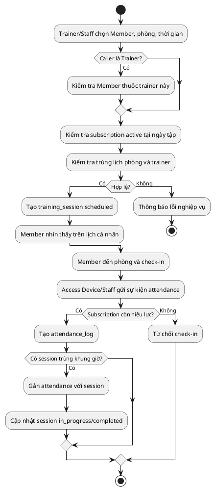
```plantuml
@startuml GMS_Process_Training_Session
start
:Trainer/Staff chọn Member, phòng, thời gian;
if (Caller là Trainer?) then (Có)
  :Kiểm tra Member thuộc trainer này;
endif
:Kiểm tra subscription active tại ngày tập;
:Kiểm tra trùng lịch phòng và trainer;
if (Hợp lệ?) then (Có)
  :Tạo training_session scheduled;
  :Member nhìn thấy trên lịch cá nhân;
else (Không)
  :Thông báo lỗi nghiệp vụ;
  stop
endif

:Member đến phòng và check-in;
:Access Device/Staff gửi sự kiện attendance;
if (Subscription còn hiệu lực?) then (Có)
  :Tạo attendance_log;
  if (Có session trùng khung giờ?) then (Có)
    :Gắn attendance với session;
    :Cập nhật session in_progress/completed;
  endif
else (Không)
  :Từ chối check-in;
endif
stop
@enduml
```

### 2.4.7 Quy trình Tạo và Quản lý Workout Plan

**Tác nhân:** Trainer, Member, Staff/Owner có quyền quản lý.

**Luồng chính:**
1. Trainer tạo giáo án mới cho hội viên hoặc Member tự tạo plan cá nhân.
2. Người tạo đặt tên, mô tả/mục tiêu và thêm các ngày tập.
3. Với mỗi ngày tập, người tạo chọn bài tập từ thư viện, thiết lập thứ tự, số hiệp, số lần lặp hoặc thời lượng, mức tạ, thời gian nghỉ và ghi chú kỹ thuật.
4. Khi kích hoạt plan, hệ thống kiểm tra plan có ít nhất một ngày tập và mỗi ngày có ít nhất một bài tập hợp lệ.
5. Trainer giao plan cho Member. Hệ thống kiểm tra Trainer có quyền phụ trách Member; nếu Trainer cố giao plan cho Member của Trainer khác, hệ thống từ chối.
6. Khi plan được giao, hệ thống tạo `member_workout_plans.status='active'`; các assignment cũ bị thay thế theo quy tắc hiện hành.
7. Member mở plan được giao, bắt đầu buổi tập và ghi workout log cho từng ngày/bài tập.
8. Từ khi plan đã có workout log, cấu trúc plan bị khóa, không cho chỉnh sửa ngày tập/bài tập nhằm bảo toàn dữ liệu lịch sử. Workout log của Member chỉ được chỉnh sửa trong thời hạn cho phép.

**Quy tắc nghiệp vụ:**
- Plan ở trạng thái `draft` được soạn thảo; `active` mới được giao; `archived` là chỉ đọc.
- Plan do Trainer tạo không được xóa nếu còn assignment active.
- Member có thể tự tạo và tự áp dụng plan cá nhân theo quyền của chính mình.

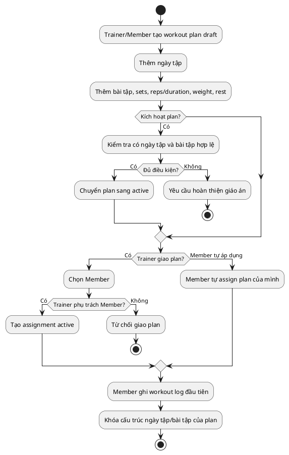
```plantuml
@startuml GMS_Process_Workout_Plan
start
:Trainer/Member tạo workout plan draft;
:Thêm ngày tập;
:Thêm bài tập, sets, reps/duration, weight, rest;
if (Kích hoạt plan?) then (Có)
  :Kiểm tra có ngày tập và bài tập hợp lệ;
  if (Đủ điều kiện?) then (Có)
    :Chuyển plan sang active;
  else (Không)
    :Yêu cầu hoàn thiện giáo án;
    stop
  endif
endif

if (Trainer giao plan?) then (Có)
  :Chọn Member;
  if (Trainer phụ trách Member?) then (Có)
    :Tạo assignment active;
  else (Không)
    :Từ chối giao plan;
    stop
  endif
else (Member tự áp dụng)
  :Member tự assign plan của mình;
endif

:Member ghi workout log đầu tiên;
:Khóa cấu trúc ngày tập/bài tập của plan;
stop
@enduml
```

### 2.4.8 Quy trình Phản hồi và Xử lý phản hồi

**Tác nhân:** Member, Staff, Owner.

**Luồng chính:**
1. Member mở chức năng phản hồi, chọn loại phản hồi (`staff`, `equipment`, `service`), mức độ nghiêm trọng (`low`, `medium`, `high`) và nhập nội dung mô tả.
2. Nếu phản hồi liên quan đến Staff hoặc thiết bị, Member chọn đối tượng tương ứng; hệ thống kiểm tra loại phản hồi và đối tượng có khớp nhau không.
3. Hệ thống tạo feedback với `status='open'`, hiển thị trong hàng chờ xử lý và ưu tiên các phản hồi `severity='high'`.
4. Staff nhận xử lý hoặc được phân công, hệ thống chuyển trạng thái sang `in_progress` và ghi người phụ trách.
5. Staff tìm hiểu vấn đề, cập nhật tiến độ hoặc mức độ nghiêm trọng nếu cần.
6. Khi hoàn tất, Staff đóng phản hồi bằng `resolved` hoặc `rejected`. Nếu từ chối hoặc giải quyết xong, hệ thống bắt buộc nhập ghi chú kết quả/lý do.
7. Member xem được trạng thái xử lý và kết quả cuối cùng.
8. Hệ thống đánh dấu phản hồi quá hạn theo SLA để Owner giám sát.

**SLA xử lý tham chiếu:** `high` trong 1 ngày, `medium` trong 3 ngày, `low` trong 7 ngày.

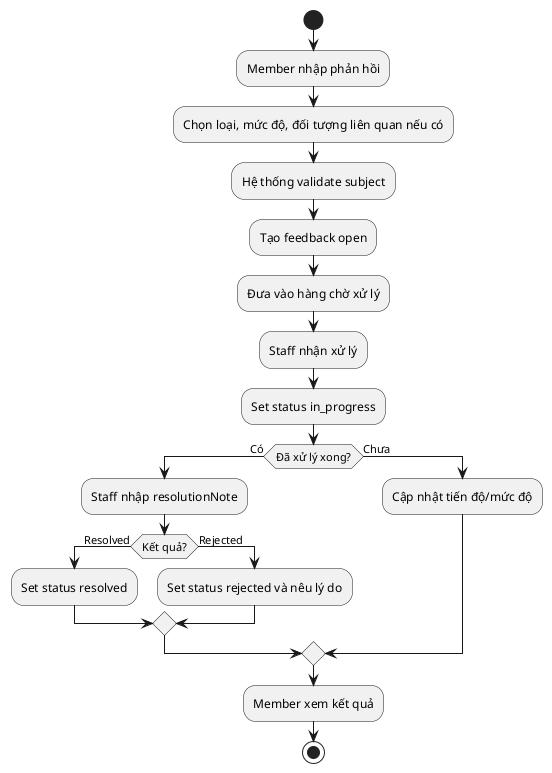
```plantuml
@startuml GMS_Process_Feedback
start
:Member nhập phản hồi;
:Chọn loại, mức độ, đối tượng liên quan nếu có;
:Hệ thống validate subject;
:Tạo feedback open;
:Đưa vào hàng chờ xử lý;
:Staff nhận xử lý;
:Set status in_progress;
if (Đã xử lý xong?) then (Có)
  :Staff nhập resolutionNote;
  if (Kết quả?) then (Resolved)
    :Set status resolved;
  else (Rejected)
    :Set status rejected và nêu lý do;
  endif
else (Chưa)
  :Cập nhật tiến độ/mức độ;
endif
:Member xem kết quả;
stop
@enduml
```

### 2.4.9 Quy trình Quản lý Nhân sự và Theo dõi hiệu suất

**Tác nhân:** Owner, Staff, Trainer.

**Luồng chính:**
1. Owner tạo hồ sơ nhân viên, nhập họ tên, email, SĐT, chức vụ (`trainer`/`pt`, `manager`, `receptionist`, `technician`) và nhóm quyền.
2. Hệ thống kiểm tra trùng email/SĐT, tạo `users.status='pending_verification'`, tạo `staff`, sinh `staff_code` và gán group mặc định hoặc group được chọn.
3. Owner/Staff có quyền lập lịch làm việc theo ngày, ca sáng/chiều/tối; hệ thống chặn trùng ca cùng ngày của cùng nhân viên.
4. Staff/Trainer check-in/check-out ca làm việc hoặc được hệ thống ghi nhận dữ liệu vận hành liên quan.
5. Hệ thống tổng hợp KPI từ số buổi dạy, attendance, phản hồi đã xử lý, điểm/mức độ phản hồi, thanh toán hoặc dữ liệu nghiệp vụ phát sinh theo vai trò.
6. Owner xem báo cáo hiệu suất để đánh giá nhân viên; Staff/Trainer có thể xem chỉ số cá nhân nếu được cấp quyền.
7. Khi nhân viên thôi việc, Owner thực hiện xóa/ngừng kích hoạt. Hệ thống soft delete `staff` và `users`, thu hồi khả năng đăng nhập nhưng giữ lịch sử làm việc, feedback, session và audit log để đối chiếu.

**Quy tắc nghiệp vụ:**
- Nhân viên mới phải xác thực email/thiết lập mật khẩu trước khi đăng nhập đầy đủ.
- Xóa nhân sự không được xóa trắng dữ liệu lịch sử.
- Trainer có thể thuộc nhiều group, ví dụ vừa là `trainer` vừa có một số quyền `staff` nếu Owner cấu hình.

### 2.4.10 Quy trình Quản lý Phòng tập, Thiết bị và Bảo trì

**Tác nhân:** Owner, Staff, Technician.

**Luồng quản lý phòng tập:**
1. Owner/Staff thêm hoặc cập nhật phòng tập, gồm mã phòng, tên, loại phòng, sức chứa và mô tả.
2. Khi xóa phòng, hệ thống kiểm tra ràng buộc. Nếu phòng còn thiết bị hoặc còn training session chưa kết thúc, hệ thống từ chối xóa.
3. Nếu không còn ràng buộc, hệ thống xóa phòng và ghi audit log.

**Luồng quản lý thiết bị và bảo trì:**
1. Owner/Staff thêm thiết bị vào phòng, ghi ngày nhập, bảo hành và trạng thái ban đầu `active`.
2. Khi phát hiện sự cố, Staff tạo maintenance log với mô tả lỗi; hệ thống chuyển thiết bị từ `active` sang `broken` nếu phù hợp.
3. Technician nhận phiếu, chuyển maintenance từ `reported` sang `repairing`; thiết bị chuyển sang `repairing`.
4. Sau khi xử lý:
   - Nếu sửa thành công, maintenance chuyển `resolved`, thiết bị chuyển `active`.
   - Nếu không thể sửa, maintenance chuyển `failed`, thiết bị chuyển `retired`.
5. Thiết bị đã `retired` không được tạo maintenance log mới và không được khôi phục về active.
6. Nếu thiết bị đã có lịch sử bảo trì, hệ thống ưu tiên chuyển `status='retired'` thay vì xóa trắng để giữ lịch sử. Force delete chỉ dành cho Owner theo chính sách hệ thống.

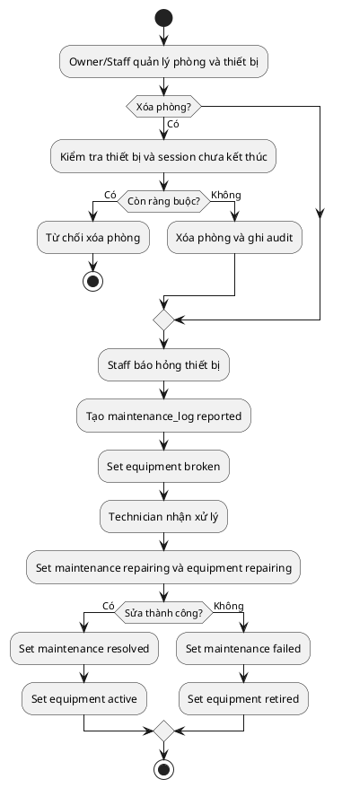
```plantuml
@startuml GMS_Process_Facility_Maintenance
start
:Owner/Staff quản lý phòng và thiết bị;
if (Xóa phòng?) then (Có)
  :Kiểm tra thiết bị và session chưa kết thúc;
  if (Còn ràng buộc?) then (Có)
    :Từ chối xóa phòng;
    stop
  else (Không)
    :Xóa phòng và ghi audit;
  endif
endif

:Staff báo hỏng thiết bị;
:Tạo maintenance_log reported;
:Set equipment broken;
:Technician nhận xử lý;
:Set maintenance repairing và equipment repairing;
if (Sửa thành công?) then (Có)
  :Set maintenance resolved;
  :Set equipment active;
else (Không)
  :Set maintenance failed;
  :Set equipment retired;
endif
stop
@enduml
```

### 2.4.11 Quy trình Quản lý danh mục Gói tập

**Tác nhân:** Owner, Staff có quyền cấu hình.

**Luồng chính:**
1. Người quản lý mở màn hình cấu hình gói tập.
2. Người quản lý tạo gói mới với tên, số ngày sử dụng, đơn giá, mô tả quyền lợi và cờ có bao gồm PT hay không.
3. Hệ thống validate `duration_days > 0`, `price >= 0`, mã/tên không trùng theo quy định và lưu gói với `status='active'`.
4. Khi chỉnh sửa gói, hệ thống cập nhật thông tin danh mục cho lượt mua mới; các subscription/payment đã phát sinh trước đó vẫn giữ lịch sử, giá trị và quyền lợi đã ghi nhận tại thời điểm mua.
5. Khi không muốn bán tiếp, người quản lý vô hiệu hóa gói bằng `status='inactive'`; gói không còn hiển thị trong danh sách đăng ký mới nhưng lịch sử cũ vẫn còn.
6. Khi xóa gói, hệ thống kiểm tra subscription đang `active` hoặc `pending`. Nếu còn hội viên đang dùng/chờ kích hoạt, hệ thống chặn xóa; nếu không, hệ thống thực hiện xóa theo chính sách soft delete.

**Quy tắc nghiệp vụ:**
- Gói tập của v1.0 là time-based, không trừ số buổi.
- Gói có PT bắt buộc chọn trainer khi đăng ký.
- Không chỉnh sửa hồi tố giá hoặc quyền lợi của subscription đã mua.

### 2.4.12 Quy trình Quản lý Phân quyền người dùng

**Tác nhân:** Owner.

**Luồng chính:**
1. Owner tạo nhóm quyền, đặt tên và mô tả phạm vi sử dụng. Các nhóm hệ thống như `owner`, `staff`, `trainer`, `member` được bảo vệ theo quy định hệ thống.
2. Owner mở danh mục permission hiện có. Danh mục permission là tập chức năng hệ thống như đọc/ghi/xóa/báo cáo/quản lý RBAC.
3. Owner gán hoặc gỡ permission cho từng nhóm quyền.
4. Owner tra cứu người dùng và gán người dùng vào một hoặc nhiều nhóm phù hợp với vai trò thực tế.
5. Khi vai trò thay đổi, Owner gỡ nhóm cũ hoặc gán nhóm mới. Hệ thống không cho người dùng mất toàn bộ group nếu quy tắc tối thiểu yêu cầu ít nhất một group.
6. Quyền truy cập được cập nhật cho các request tiếp theo mà không yêu cầu người dùng đăng xuất thủ công.
7. Mọi thao tác thay đổi nhóm quyền, quyền của nhóm hoặc nhóm của người dùng đều ghi audit log.

**Luồng ngoại lệ:**
- Không được xóa hoặc đổi tên nhóm hệ thống.
- Không được gỡ group cuối cùng của một user nếu làm user không còn nhóm nào.
- Không được tự cập nhật `status` hoặc tự nâng quyền cho chính mình.

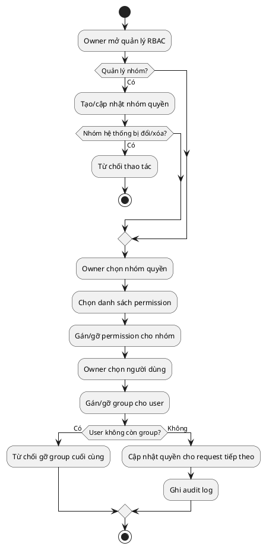
```plantuml
@startuml GMS_Process_RBAC
start
:Owner mở quản lý RBAC;
if (Quản lý nhóm?) then (Có)
  :Tạo/cập nhật nhóm quyền;
  if (Nhóm hệ thống bị đổi/xóa?) then (Có)
    :Từ chối thao tác;
    stop
  endif
endif

:Owner chọn nhóm quyền;
:Chọn danh sách permission;
:Gán/gỡ permission cho nhóm;
:Owner chọn người dùng;
:Gán/gỡ group cho user;
if (User không còn group?) then (Có)
  :Từ chối gỡ group cuối cùng;
else (Không)
  :Cập nhật quyền cho request tiếp theo;
  :Ghi audit log;
endif
stop
@enduml
```

### 2.4.13 Quy trình Báo cáo, Thống kê, Thanh toán và Hiệu suất

**Tác nhân:** Owner, Staff/Trainer xem dữ liệu cá nhân nếu được cấp quyền.

**Luồng chính:**
1. Người dùng có quyền mở màn hình báo cáo.
2. Chọn loại báo cáo: doanh thu, hội viên mới, tỷ lệ gia hạn/hủy, gói bán chạy, thanh toán, hiệu suất nhân viên hoặc hiệu suất trainer.
3. Thiết lập khoảng thời gian và bộ lọc liên quan như phương thức thanh toán, staff/trainer, gói tập hoặc trạng thái.
4. Hệ thống truy vấn dữ liệu từ `payments`, `subscriptions`, `members`, `training_sessions`, `feedback`, `staff_attendance_logs` và các bảng liên quan.
5. Hệ thống tổng hợp số liệu, tính chỉ số và hiển thị thành biểu đồ cột, đường, tròn hoặc bảng so sánh.
6. Người dùng xem chi tiết để đối chiếu giao dịch, lịch sử gói, số buổi dạy, phản hồi xử lý và mức độ hoàn thành công việc.
7. Hệ thống cung cấp chức năng xuất báo cáo ra PDF, Excel hoặc CSV để lưu trữ/gửi báo cáo.

**Quy tắc nghiệp vụ:**
- Doanh thu chỉ tính payment `success`.
- Báo cáo hiệu suất trainer ưu tiên số buổi `completed`, attendance thực tế và phản hồi liên quan.
- Báo cáo phản hồi cần hiển thị các mục quá hạn SLA để Owner giám sát.
- Nếu không có dữ liệu trong khoảng chọn, hệ thống hiển thị trạng thái rỗng thay vì báo lỗi.

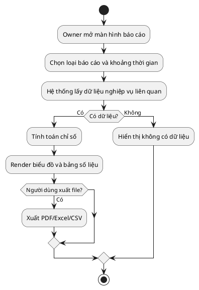
```plantuml
@startuml GMS_Process_Reports
start
:Owner mở màn hình báo cáo;
:Chọn loại báo cáo và khoảng thời gian;
:Hệ thống lấy dữ liệu nghiệp vụ liên quan;
if (Có dữ liệu?) then (Có)
  :Tính toán chỉ số;
  :Render biểu đồ và bảng số liệu;
  if (Người dùng xuất file?) then (Có)
    :Xuất PDF/Excel/CSV;
  endif
else (Không)
  :Hiển thị không có dữ liệu;
endif
stop
@enduml
```

---

# 3. Đặc tả các chức năng

Phần này đặc tả các use case cấp chức năng theo danh sách UC01-UC21. Mọi use case thao tác dữ liệu nội bộ đều yêu cầu người dùng đã đăng nhập, JWT hợp lệ và thỏa RBAC tương ứng; các use case công khai gồm đăng nhập, quên/đặt lại mật khẩu và member tự đăng ký online. Các thao tác tạo/sửa/xóa dữ liệu quan trọng phải ghi audit log theo quy ước trong Architecture.md và Database.md.

---

## 3.1 Đặc tả Use Case UC01 - Đăng nhập

| Thông tin | Chi tiết |
|-----------|----------|
| **Mã Use case** | UC01 |
| **Tên Use case** | Đăng nhập |
| **Tác nhân** | Member, Trainer, Staff, Owner |
| **Tiền điều kiện** | Người dùng đã có tài khoản trong hệ thống, tài khoản chưa bị xóa và đã xác thực email nếu đang ở trạng thái yêu cầu xác thực |

### Luồng sự kiện chính

| STT | Thực hiện bởi | Hành động |
|-----|---------------|-----------|
| 1 | Người dùng | Mở màn hình đăng nhập và nhập email, mật khẩu |
| 2 | Hệ thống | Kiểm tra định dạng email, độ dài mật khẩu và rate limit |
| 3 | Hệ thống | Xác thực email/mật khẩu, kiểm tra `users.status='active'` và `deleted_at IS NULL` |
| 4 | Hệ thống | Tạo JWT chứa `userId`, role/group và các định danh liên quan (`memberId`, `staffId` nếu có) |
| 5 | Hệ thống | Điều hướng người dùng tới dashboard phù hợp với role: member, trainer, staff hoặc owner |

### Luồng sự kiện thay thế

| STT | Thực hiện bởi | Hành động |
|-----|---------------|-----------|
| 2a | Hệ thống | Email hoặc mật khẩu sai định dạng -> hiển thị lỗi nhập liệu |
| 3a | Hệ thống | Sai thông tin đăng nhập, tài khoản chưa verify, bị khóa hoặc đã bị xóa -> trả lỗi xác thực chung và ghi audit thất bại |
| 3b | Người dùng | Chọn "Quên mật khẩu" -> chuyển sang UC03 |

### Dữ liệu đầu vào

| Trường | Bắt buộc | Ràng buộc |
|--------|----------|-----------|
| `email` | Có | Đúng định dạng email |
| `password` | Có | Tối thiểu 8 ký tự |

### Hậu điều kiện
Người dùng đăng nhập thành công có JWT hợp lệ trên client. Audit log ghi nhận lần đăng nhập thành công hoặc thất bại.

---

## 3.2 Đặc tả Use Case UC02 - Đăng xuất

| Thông tin | Chi tiết |
|-----------|----------|
| **Mã Use case** | UC02 |
| **Tên Use case** | Đăng xuất |
| **Tác nhân** | Member, Trainer, Staff, Owner |
| **Tiền điều kiện** | Người dùng đã đăng nhập |

### Luồng sự kiện chính

| STT | Thực hiện bởi | Hành động |
|-----|---------------|-----------|
| 1 | Người dùng | Chọn chức năng đăng xuất |
| 2 | Client | Gọi endpoint đăng xuất và xóa JWT/token khỏi storage |
| 3 | Hệ thống | Ghi audit hành động đăng xuất và trả thông báo thành công |
| 4 | Client | Điều hướng người dùng về màn hình đăng nhập hoặc trang public |

### Luồng sự kiện thay thế

| STT | Thực hiện bởi | Hành động |
|-----|---------------|-----------|
| 2a | Hệ thống | JWT đã hết hạn hoặc không hợp lệ -> client vẫn xóa token cục bộ và coi người dùng đã thoát phiên |

### Hậu điều kiện
Phiên đăng nhập trên client kết thúc. Với JWT stateless v1.0, server không blacklist token; token phía client phải được xóa.

---

## 3.3 Đặc tả Use Case UC03 - Quên mật khẩu - Đặt lại mật khẩu

| Thông tin | Chi tiết |
|-----------|----------|
| **Mã Use case** | UC03 |
| **Tên Use case** | Quên mật khẩu - Đặt lại mật khẩu |
| **Tác nhân** | Member, Trainer, Staff, Owner |
| **Tiền điều kiện** | Người dùng có email đã đăng ký trong hệ thống |

### Luồng sự kiện chính

| STT | Thực hiện bởi | Hành động |
|-----|---------------|-----------|
| 1 | Người dùng | Chọn "Quên mật khẩu" và nhập email |
| 2 | Hệ thống | Sinh OTP `purpose='password_reset'`, hash OTP, đặt TTL 10 phút và gửi qua email hoặc log dev placeholder |
| 3 | Người dùng | Nhập email, OTP và mật khẩu mới |
| 4 | Hệ thống | Kiểm tra OTP còn hạn, chưa dùng, khớp với email và mật khẩu mới đạt yêu cầu |
| 5 | Hệ thống | Cập nhật `password_hash`, xóa OTP reset còn hiệu lực của user và ghi audit |
| 6 | Người dùng | Đăng nhập lại bằng mật khẩu mới |

### Luồng sự kiện thay thế

| STT | Thực hiện bởi | Hành động |
|-----|---------------|-----------|
| 2a | Hệ thống | Email không tồn tại -> vẫn trả thông báo trung tính để tránh dò tài khoản |
| 2b | Hệ thống | Người dùng yêu cầu OTP quá số lần cho phép -> trả thông báo rate limit hoặc thông báo trung tính theo anti-enumeration |
| 4a | Hệ thống | OTP sai, hết hạn hoặc đã dùng -> từ chối đặt lại mật khẩu |
| 4b | Hệ thống | Mật khẩu mới không đủ mạnh -> yêu cầu nhập lại |

### Dữ liệu đầu vào

| Trường | Bắt buộc | Ràng buộc |
|--------|----------|-----------|
| `email` | Có | Đúng định dạng email |
| `otp` | Có khi reset | OTP 6 chữ số, còn hạn |
| `newPassword` | Có khi reset | Tối thiểu 8 ký tự, tuân thủ chính sách mật khẩu |

### Hậu điều kiện
Mật khẩu được cập nhật an toàn, OTP đã dùng bị vô hiệu hóa, người dùng có thể đăng nhập bằng mật khẩu mới.

---

## 3.4 Đặc tả Use Case UC04 - Quản lý hồ sơ và thông tin cá nhân

| Thông tin | Chi tiết |
|-----------|----------|
| **Mã Use case** | UC04 |
| **Tên Use case** | Quản lý hồ sơ và thông tin cá nhân |
| **Tác nhân** | Member, Trainer, Staff, Owner |
| **Tiền điều kiện** | Người dùng đã đăng nhập và có profile tương ứng với vai trò |

### Luồng sự kiện chính

| STT | Thực hiện bởi | Hành động |
|-----|---------------|-----------|
| 1 | Người dùng | Mở trang hồ sơ cá nhân |
| 2 | Hệ thống | Hiển thị thông tin tài khoản (`email`, `fullName`, `phone`, avatar, trạng thái) và profile theo vai trò |
| 3 | Người dùng | Chỉnh sửa các trường được phép như họ tên, số điện thoại, địa chỉ, ngày sinh hoặc avatar |
| 4 | Hệ thống | Validate dữ liệu, kiểm tra trùng số điện thoại/email nếu có thay đổi |
| 5 | Hệ thống | Lưu thay đổi vào `users`, `members` hoặc `staff` theo vai trò và ghi audit |
| 6 | Người dùng | Nếu cần, chọn "Đổi mật khẩu", nhập mật khẩu hiện tại và mật khẩu mới |
| 7 | Hệ thống | Xác thực mật khẩu hiện tại, cập nhật `password_hash` mới và ghi audit đổi mật khẩu |

### Phân quyền theo vai trò

| Vai trò | Phạm vi cập nhật |
|---------|------------------|
| Member | Cập nhật hồ sơ cá nhân, địa chỉ, ngày sinh, số điện thoại, avatar; đổi mật khẩu |
| Trainer | Cập nhật thông tin cá nhân của staff/trainer, số điện thoại, avatar; đổi mật khẩu |
| Staff | Cập nhật thông tin cá nhân, số điện thoại, avatar; đổi mật khẩu |
| Owner | Cập nhật hồ sơ owner, số điện thoại, avatar; đổi mật khẩu; có thể cập nhật user/staff khác qua UC15/UC16 |

### Luồng sự kiện thay thế

| STT | Thực hiện bởi | Hành động |
|-----|---------------|-----------|
| 4a | Hệ thống | Số điện thoại đã tồn tại hoặc sai định dạng -> thông báo lỗi |
| 5a | Hệ thống | Người dùng cố sửa trường hệ thống như `userId`, `memberCode`, `staffCode`, `status` khi không có quyền -> từ chối |
| 7a | Hệ thống | Mật khẩu hiện tại sai hoặc mật khẩu mới không hợp lệ -> không cập nhật mật khẩu |

### Hậu điều kiện
Thông tin cá nhân được cập nhật trong phạm vi cho phép; dữ liệu định danh hệ thống không bị người dùng tự ý thay đổi.

---

## 3.5 Đặc tả Use Case UC05 - Đăng ký hội viên mới

UC05 có hai luồng: UC05A do Staff đăng ký tại quầy và UC05B do Member tự đăng ký online. Nếu người đăng ký chọn gói tập ngay trong quá trình tạo tài khoản, hệ thống chuyển tiếp sang UC06 để tạo subscription và thanh toán.

### 3.5.1 UC05A - Staff đăng ký tại quầy

| Thông tin | Chi tiết |
|-----------|----------|
| **Mã Use case** | UC05A |
| **Tên Use case** | Staff đăng ký hội viên tại quầy |
| **Tác nhân** | Staff |
| **Tiền điều kiện** | Staff đã đăng nhập và có quyền `member.create`; gói tập muốn đăng ký đang `active` nếu đăng ký gói ngay |

#### Luồng sự kiện chính

| STT | Thực hiện bởi | Hành động |
|-----|---------------|-----------|
| 1 | Staff | Mở màn hình đăng ký hội viên mới |
| 2 | Staff | Nhập thông tin: họ tên, email, số điện thoại, ngày sinh, địa chỉ và thông tin khởi tạo tài khoản |
| 3 | Hệ thống | Validate dữ liệu, kiểm tra email/phone chưa tồn tại |
| 4 | Hệ thống | Tạo `users` trạng thái `pending_verification`, tạo `members` và sinh `member_code` dạng `MEM-YYYY-XXXXXX` |
| 5 | Hệ thống | Gửi OTP/link xác thực email cho hội viên |
| 6 | Staff | Nếu hội viên mua gói tại quầy, chuyển sang UC06 để tạo subscription và ghi nhận thanh toán |

#### Luồng sự kiện thay thế

| STT | Thực hiện bởi | Hành động |
|-----|---------------|-----------|
| 3a | Hệ thống | Email hoặc số điện thoại đã tồn tại -> từ chối tạo hội viên |
| 4a | Hệ thống | Không sinh được `member_code` sau số lần retry -> báo lỗi hệ thống |
| 6a | Staff | Hội viên chưa chọn gói -> chỉ lưu tài khoản hội viên, trạng thái chưa có subscription active |

#### Hậu điều kiện
Hội viên mới được tạo, có mã hội viên và cần xác thực email trước khi sử dụng đầy đủ dịch vụ.

### 3.5.2 UC05B - Member tự đăng ký online

| Thông tin | Chi tiết |
|-----------|----------|
| **Mã Use case** | UC05B |
| **Tên Use case** | Member tự đăng ký online |
| **Tác nhân** | Khách truy cập / Member mới |
| **Tiền điều kiện** | Khách truy cập chưa có tài khoản trùng email/phone trong hệ thống |

#### Luồng sự kiện chính

| STT | Thực hiện bởi | Hành động |
|-----|---------------|-----------|
| 1 | Khách truy cập | Mở form đăng ký online |
| 2 | Khách truy cập | Nhập email, mật khẩu, họ tên, số điện thoại, ngày sinh, địa chỉ và có thể chọn gói tập |
| 3 | Hệ thống | Validate dữ liệu, kiểm tra mật khẩu và kiểm tra email/phone chưa tồn tại |
| 4 | Hệ thống | Tạo `users`, `members`, sinh `member_code`, tạo OTP verify email |
| 5 | Hệ thống | Nếu có `packageId`, tạo subscription `pending` theo UC06 và chờ thanh toán/xác thực |
| 6 | Member mới | Xác thực email bằng OTP/link và tiếp tục thanh toán nếu đã chọn gói |

#### Luồng sự kiện thay thế

| STT | Thực hiện bởi | Hành động |
|-----|---------------|-----------|
| 3a | Hệ thống | Dữ liệu không hợp lệ hoặc mật khẩu yếu -> yêu cầu nhập lại |
| 3b | Hệ thống | Email/phone đã tồn tại -> hướng dẫn đăng nhập hoặc quên mật khẩu |
| 5a | Hệ thống | Gói được chọn không tồn tại, inactive hoặc đã soft delete -> không tạo subscription |

#### Hậu điều kiện
Tài khoản hội viên online được tạo. Nếu có chọn gói, subscription ở trạng thái `pending` cho tới khi thanh toán và điều kiện kích hoạt hoàn tất.

---

## 3.6 Đặc tả Use Case UC06 - Đăng ký gói tập mới

| Thông tin | Chi tiết |
|-----------|----------|
| **Mã Use case** | UC06 |
| **Tên Use case** | Đăng ký gói tập mới |
| **Tác nhân** | Member, Staff |
| **Tiền điều kiện** | Member tồn tại, tài khoản hợp lệ; gói tập đang `active`; Member không có subscription `active` hoặc `pending` chặn đăng ký mới |

### Điều kiện được phép đăng ký gói mới

| Trường hợp | Mô tả |
|------------|-------|
| Đăng ký hội viên mới | Hội viên vừa được tạo ở UC05 và chưa có gói active |
| Hết hạn chưa gia hạn | Gói cũ đã `expired`, không còn subscription active hoặc pending |
| Sau khi hủy gói | Gói cũ đã `cancelled`, member cần mua lại gói mới |

### Luồng sự kiện chính

| STT | Thực hiện bởi | Hành động |
|-----|---------------|-----------|
| 1 | Member/Staff | Chọn hội viên và gói tập muốn đăng ký |
| 2 | Hệ thống | Hiển thị danh sách gói `packages.status='active'`, giá, thời hạn ngày và quyền lợi |
| 3 | Member/Staff | Xác nhận đăng ký gói mới |
| 4 | Hệ thống | Kiểm tra member không có subscription `active` hoặc `pending`, gói chưa bị xóa và còn active |
| 5 | Hệ thống | Tạo `subscriptions` trạng thái `pending`, tính `startDate`, `endDate` theo `durationDays` |
| 6 | Member/Staff | Thực hiện hoặc ghi nhận thanh toán bằng tiền mặt, thẻ, ví điện tử hoặc tài khoản thanh toán đã lưu |
| 7 | Hệ thống | Khi payment `success`, kích hoạt subscription nếu ngày bắt đầu đã tới; nếu chưa tới ngày bắt đầu thì giữ `pending` cho cron kích hoạt |

### Luồng sự kiện thay thế

| STT | Thực hiện bởi | Hành động |
|-----|---------------|-----------|
| 4a | Hệ thống | Member còn gói active hoặc pending -> không cho đăng ký gói mới, gợi ý UC07 gia hạn/hủy theo trạng thái hiện tại |
| 4b | Hệ thống | Gói inactive hoặc deleted -> yêu cầu chọn gói khác |
| 6a | Hệ thống | Thanh toán thất bại hoặc thiếu mã giao dịch khi phương thức không phải tiền mặt -> subscription vẫn pending hoặc bị hủy theo cron nếu quá hạn |
| 7a | Scheduler | Subscription pending chưa thanh toán sau thời gian cấu hình -> tự động hủy pending |

### Hậu điều kiện
Một subscription mới được tạo và liên kết với member. Gói chỉ trở thành `active` sau khi thanh toán thành công và thỏa điều kiện ngày bắt đầu.

---

## 3.7 Đặc tả Use Case UC07 - Gia hạn / Hủy gói tập

UC07 gồm UC07A gia hạn gói tập và UC07B hủy gói tập. Cả Member và Staff đều có thể thực hiện trong phạm vi quyền/ownership tương ứng.

### 3.7.1 UC07A - Gia hạn gói tập

| Thông tin | Chi tiết |
|-----------|----------|
| **Mã Use case** | UC07A |
| **Tên Use case** | Gia hạn gói tập |
| **Tác nhân** | Member, Staff |
| **Tiền điều kiện** | Member có subscription hiện tại còn thông tin để gia hạn; gói liên quan chưa bị xóa; người thực hiện có quyền `subscription.create` hoặc là chính member |

#### Luồng sự kiện chính

| STT | Thực hiện bởi | Hành động |
|-----|---------------|-----------|
| 1 | Member/Staff | Mở chi tiết gói hiện tại và chọn "Gia hạn" |
| 2 | Hệ thống | Hiển thị thông tin gói, ngày kết thúc hiện tại, giá và phương thức thanh toán |
| 3 | Member/Staff | Xác nhận gia hạn và chọn phương thức thanh toán |
| 4 | Hệ thống | Tạo subscription mới nối tiếp sau `endDate` của subscription hiện tại, trạng thái `pending` |
| 5 | Member/Staff | Hoàn tất thanh toán |
| 6 | Hệ thống | Ghi payment; subscription mới được active khi tới `startDate` hoặc khi gói cũ không còn chiếm slot active |

#### Luồng sự kiện thay thế

| STT | Thực hiện bởi | Hành động |
|-----|---------------|-----------|
| 4a | Hệ thống | Subscription gốc không tồn tại hoặc đã bị xóa -> báo lỗi |
| 4b | Hệ thống | Đã có subscription pending cho lần gia hạn -> không tạo trùng |
| 5a | Hệ thống | Payment thất bại -> giữ pending hoặc hủy theo quy trình unpaid pending |

#### Hậu điều kiện
Subscription gia hạn được tạo, lịch sử gói của member thể hiện cả gói hiện tại và gói nối tiếp.

### 3.7.2 UC07B - Hủy gói tập

| Thông tin | Chi tiết |
|-----------|----------|
| **Mã Use case** | UC07B |
| **Tên Use case** | Hủy gói tập |
| **Tác nhân** | Member, Staff |
| **Tiền điều kiện** | Subscription cần hủy đang `active` hoặc `pending`; người thực hiện có quyền hoặc là chính member |

#### Luồng sự kiện chính

| STT | Thực hiện bởi | Hành động |
|-----|---------------|-----------|
| 1 | Member/Staff | Mở gói hiện tại hoặc gói pending và chọn "Hủy gói" |
| 2 | Hệ thống | Hiển thị cảnh báo về việc không hoàn tiền trong v1.0 và yêu cầu xác nhận |
| 3 | Member/Staff | Nhập lý do hủy nếu có và xác nhận |
| 4 | Hệ thống | Cập nhật `subscriptions.status='cancelled'`, ghi `cancelledAt` và audit |
| 5 | Hệ thống | Nếu tồn tại subscription pending đã thanh toán và đủ điều kiện cascade, kích hoạt subscription kế tiếp theo rule hiện hành |

#### Luồng sự kiện thay thế

| STT | Thực hiện bởi | Hành động |
|-----|---------------|-----------|
| 2a | Người dùng | Không xác nhận -> không thay đổi dữ liệu |
| 4a | Hệ thống | Subscription đã `expired` hoặc `cancelled` -> không cho hủy lại |
| 5a | Hệ thống | Không có subscription pending kế tiếp -> member chuyển sang trạng thái không có gói active |

#### Hậu điều kiện
Gói bị hủy không còn cho phép check-in hoặc đặt lịch mới. Member có thể đăng ký gói mới theo UC06.

---

## 3.8 Đặc tả Use Case UC08 - Xem gói tập hiện tại và lịch sử

| Thông tin | Chi tiết |
|-----------|----------|
| **Mã Use case** | UC08 |
| **Tên Use case** | Xem gói tập hiện tại và lịch sử |
| **Tác nhân** | Member |
| **Tiền điều kiện** | Member đã đăng nhập và có profile hội viên |

### Luồng sự kiện chính

| STT | Thực hiện bởi | Hành động |
|-----|---------------|-----------|
| 1 | Member | Mở trang "Gói tập hiện tại" |
| 2 | Hệ thống | Truy vấn subscription `active` hoặc `pending` của chính member và hiển thị gói, ngày bắt đầu, ngày kết thúc, trạng thái thanh toán |
| 3 | Member | Mở trang "Lịch sử gói tập" |
| 4 | Hệ thống | Hiển thị danh sách subscription theo thời gian gồm `pending`, `active`, `expired`, `cancelled` và các payment liên quan |
| 5 | Member | Chọn một bản ghi để xem chi tiết gói, hóa đơn/thanh toán và trạng thái |

### Luồng sự kiện thay thế

| STT | Thực hiện bởi | Hành động |
|-----|---------------|-----------|
| 2a | Hệ thống | Không có gói active/pending -> hiển thị trạng thái chưa có gói và gợi ý đăng ký UC06 |
| 4a | Hệ thống | Lịch sử rỗng -> hiển thị empty state |
| 5a | Hệ thống | Member cố xem subscription của người khác -> từ chối theo ownership guard |

### Hậu điều kiện
Member nắm được trạng thái gói hiện tại, ngày hết hạn, lịch sử đăng ký và thanh toán của chính mình.

---

## 3.9 Đặc tả Use Case UC09 - Quản lý hội viên

| Thông tin | Chi tiết |
|-----------|----------|
| **Mã Use case** | UC09 |
| **Tên Use case** | Quản lý hội viên |
| **Tác nhân** | Staff |
| **Tiền điều kiện** | Staff đã đăng nhập và có quyền `member.read`, `member.update` hoặc `member.delete` tùy thao tác |

### Luồng sự kiện chính

| STT | Thực hiện bởi | Hành động |
|-----|---------------|-----------|
| 1 | Staff | Mở màn hình quản lý hội viên |
| 2 | Hệ thống | Hiển thị danh sách hội viên có phân trang, tìm kiếm theo mã hội viên, họ tên, email, số điện thoại và filter trạng thái |
| 3 | Staff | Chọn một hội viên để xem chi tiết hồ sơ, gói tập, trainer phụ trách, lịch sử thanh toán và tiến độ liên quan |
| 4 | Staff | Cập nhật thông tin cho phép như họ tên, phone, địa chỉ, ngày sinh hoặc gán trainer |
| 5 | Hệ thống | Validate dữ liệu, cập nhật `users`, `members`, `primary_trainer_id` nếu có và ghi audit |
| 6 | Staff | Khi cần, xóa/ngưng hoạt động hội viên theo quy trình soft delete |

### Luồng sự kiện thay thế

| STT | Thực hiện bởi | Hành động |
|-----|---------------|-----------|
| 2a | Hệ thống | Không tìm thấy hội viên -> hiển thị danh sách rỗng |
| 4a | Hệ thống | Phone/email trùng hoặc trainer không tồn tại/không phải trainer -> báo lỗi |
| 6a | Hệ thống | Hội viên có dữ liệu lịch sử -> soft delete `members`/`users`, giữ audit và lịch sử cần thiết |

### Hậu điều kiện
Thông tin hội viên được quản lý tập trung, Staff có thể hỗ trợ đăng ký/gia hạn, gán trainer và xử lý hồ sơ tại quầy.

---

## 3.10 Đặc tả Use Case UC10 - Quản lý giáo án / workout plan

| Thông tin | Chi tiết |
|-----------|----------|
| **Mã Use case** | UC10 |
| **Tên Use case** | Quản lý giáo án / workout plan |
| **Tác nhân** | Trainer |
| **Tiền điều kiện** | Trainer đã đăng nhập, có quyền workout plan; member đích thuộc phạm vi quản lý hoặc được phép gán |

### Luồng sự kiện chính

| STT | Thực hiện bởi | Hành động |
|-----|---------------|-----------|
| 1 | Trainer | Mở module Workout Plan và tạo plan mới |
| 2 | Trainer | Nhập tên, mô tả, thêm ngày tập, thêm bài tập từ thư viện và thiết lập target sets/reps/weight/duration/rest |
| 3 | Hệ thống | Lưu plan ở trạng thái `draft` hoặc `active` tùy thao tác |
| 4 | Trainer | Chọn member cụ thể và gán workout plan với `startDate` và ghi chú |
| 5 | Hệ thống | Kiểm tra plan có ít nhất một ngày tập, bài tập hợp lệ và member tồn tại |
| 6 | Hệ thống | Tạo `member_workout_plans` active; assignment cũ của member chuyển sang `replaced` nếu cần |
| 7 | Trainer | Quản lý plan sau khi tạo: xem, sửa metadata, ngày tập, bài tập hoặc gỡ assignment khi còn được phép |

### Luồng sự kiện thay thế

| STT | Thực hiện bởi | Hành động |
|-----|---------------|-----------|
| 2a | Trainer | Không tìm thấy bài tập phù hợp -> tạo/import bài tập mới nếu có quyền |
| 5a | Hệ thống | Plan chưa active hoặc chưa có ngày tập -> không cho gán |
| 6a | Hệ thống | Member không thuộc phạm vi trainer quản lý -> từ chối theo ownership/permission |
| 7a | Hệ thống | Plan đã có workout log thực tế -> hạn chế sửa/xóa cấu trúc để bảo toàn lịch sử |

### Hậu điều kiện
Workout plan được lưu và có thể được gán cho member. Member nhìn thấy plan được giao trên dashboard/lịch tập của mình.

---

## 3.11 Đặc tả Use Case UC11 - Quản lý buổi tập / lịch tập

| Thông tin | Chi tiết |
|-----------|----------|
| **Mã Use case** | UC11 |
| **Tên Use case** | Quản lý buổi tập / lịch tập |
| **Tác nhân** | Trainer |
| **Tiền điều kiện** | Trainer đã đăng nhập; member có subscription active tại thời điểm buổi tập; member đã được gán workout plan phù hợp |

### Luồng sự kiện chính

| STT | Thực hiện bởi | Hành động |
|-----|---------------|-----------|
| 1 | Trainer | Mở lịch tập và chọn member mình phụ trách |
| 2 | Hệ thống | Hiển thị workout plan assignment active và các ngày tập có thể lên lịch |
| 3 | Trainer | Chọn `assignmentId`, `planDayId`, phòng tập, `startTime`, `endTime` |
| 4 | Hệ thống | Validate thời gian, phòng, trainer không overlap và member có gói active tại ngày tập |
| 5 | Hệ thống | Tạo `training_sessions` trạng thái `scheduled` |
| 6 | Trainer | Cập nhật lịch, đổi phòng/giờ hoặc hủy buổi tập trong khung thời gian cho phép |
| 7 | Trainer | Khi buổi tập diễn ra, cập nhật trạng thái `in_progress` hoặc `completed` nếu cần |

### Luồng sự kiện thay thế

| STT | Thực hiện bởi | Hành động |
|-----|---------------|-----------|
| 2a | Hệ thống | Member chưa có workout plan active -> yêu cầu gán plan trước theo UC10 |
| 4a | Hệ thống | Phòng hoặc trainer bị trùng lịch -> báo lỗi và gợi ý chọn slot khác |
| 4b | Hệ thống | Member không có subscription active tại ngày tập -> yêu cầu đăng ký/gia hạn gói trước |
| 6a | Hệ thống | Buổi tập đã bắt đầu hoặc hết hạn hủy -> không cho đổi/hủy theo rule |

### Hậu điều kiện
Lịch tập của member và trainer được cập nhật, buổi tập liên kết với workout plan cụ thể để member có thể theo dõi và ghi nhận kết quả.

---

## 3.12 Đặc tả Use Case UC12 - Theo dõi và ghi nhận buổi tập

| Thông tin | Chi tiết |
|-----------|----------|
| **Mã Use case** | UC12 |
| **Tên Use case** | Theo dõi và ghi nhận buổi tập |
| **Tác nhân** | Member |
| **Tiền điều kiện** | Member đã đăng nhập; có subscription active khi check-in/đặt lịch; có workout plan assignment active khi ghi workout log |

### Luồng sự kiện chính

| STT | Thực hiện bởi | Hành động |
|-----|---------------|-----------|
| 1 | Member | Mở lịch tập để xem các buổi `scheduled`, `in_progress`, `completed`, `cancelled` |
| 2 | Member | Đến phòng tập và check-in bằng QR/thẻ hoặc nhờ Staff check-in thủ công |
| 3 | Hệ thống/Thiết bị | Ghi `attendance_logs`, kiểm tra member có subscription active và không có attendance đang mở |
| 4 | Member | Sau buổi tập, mở workout plan/ngày tập được giao và nhập kết quả từng bài tập, thời lượng, ghi chú |
| 5 | Hệ thống | Lưu `workout_logs` và `workout_log_sets` theo assignment/day hợp lệ |
| 6 | Member | Xem lịch sử buổi tập, attendance và kết quả workout gần đây |

### Luồng sự kiện thay thế

| STT | Thực hiện bởi | Hành động |
|-----|---------------|-----------|
| 3a | Hệ thống | Không có subscription active -> từ chối check-in và hướng dẫn đăng ký/gia hạn gói |
| 3b | Hệ thống | Đã có attendance log đang mở -> không mở thêm log trùng |
| 4a | Hệ thống | Member chưa có plan active -> hiển thị empty state, gợi ý liên hệ trainer hoặc tự tạo plan nếu được phép |
| 5a | Member | Sửa workout log trong cửa sổ 24 giờ; sau thời hạn hệ thống từ chối sửa |

### Hậu điều kiện
Attendance và workout log của member được ghi nhận. Trainer/Owner có thể dùng dữ liệu này để theo dõi tiến độ và báo cáo hiệu suất.

---

## 3.13 Đặc tả Use Case UC13 - Gửi phản hồi

| Thông tin | Chi tiết |
|-----------|----------|
| **Mã Use case** | UC13 |
| **Tên Use case** | Gửi phản hồi |
| **Tác nhân** | Member |
| **Tiền điều kiện** | Member đã đăng nhập và có profile hội viên |

### Luồng sự kiện chính

| STT | Thực hiện bởi | Hành động |
|-----|---------------|-----------|
| 1 | Member | Mở màn hình gửi phản hồi |
| 2 | Hệ thống | Hiển thị form gồm loại phản hồi `service`, `staff`, `equipment`, mức độ `low`, `medium`, `high` và nội dung |
| 3 | Member | Nhập nội dung, chọn đối tượng liên quan nếu phản hồi về nhân viên hoặc thiết bị |
| 4 | Hệ thống | Validate type-subject, kiểm tra đối tượng tham chiếu tồn tại |
| 5 | Hệ thống | Tạo `feedback` trạng thái `open`, lưu severity và thời điểm tạo |
| 6 | Member | Xem phản hồi trong danh sách "Phản hồi của tôi" |

### Luồng sự kiện thay thế

| STT | Thực hiện bởi | Hành động |
|-----|---------------|-----------|
| 4a | Hệ thống | Nội dung rỗng hoặc loại phản hồi không khớp đối tượng -> báo lỗi |
| 4b | Hệ thống | Member cố tạo phản hồi cho hội viên khác -> từ chối theo ownership |
| 6a | Member | Xóa phản hồi của chính mình nếu còn trong phạm vi được phép |

### Hậu điều kiện
Feedback được ghi nhận và sẵn sàng cho Staff xử lý. Member có thể theo dõi trạng thái xử lý.

---

## 3.14 Đặc tả Use Case UC14 - Xử lý phản hồi

| Thông tin | Chi tiết |
|-----------|----------|
| **Mã Use case** | UC14 |
| **Tên Use case** | Xử lý phản hồi |
| **Tác nhân** | Staff |
| **Tiền điều kiện** | Staff đã đăng nhập và có quyền `feedback.read`, `feedback.handle` |

### Luồng sự kiện chính

| STT | Thực hiện bởi | Hành động |
|-----|---------------|-----------|
| 1 | Staff | Mở danh sách phản hồi với filter theo type, severity, status, overdue, người xử lý hoặc đối tượng liên quan |
| 2 | Hệ thống | Hiển thị feedback, SLA badge và chi tiết member/đối tượng liên quan |
| 3 | Staff | Nhận xử lý hoặc gán phản hồi cho nhân viên phụ trách |
| 4 | Staff | Cập nhật trạng thái `in_progress` khi bắt đầu xử lý |
| 5 | Staff | Nhập ghi chú kết quả và chuyển trạng thái `resolved` hoặc `rejected` |
| 6 | Hệ thống | Lưu trạng thái mới, `handledByStaffId`, `handledAt`, ghi audit và cập nhật SLA |

### Luồng sự kiện thay thế

| STT | Thực hiện bởi | Hành động |
|-----|---------------|-----------|
| 3a | Hệ thống | Feedback đã đóng hoặc đã được gán -> không cho gán trùng |
| 5a | Hệ thống | Thiếu `resolutionNote` khi resolved/rejected -> yêu cầu nhập ghi chú |
| 5b | Hệ thống | Chuyển trạng thái không hợp lệ -> từ chối theo state machine |

### Hậu điều kiện
Phản hồi được phân công và xử lý có trạng thái rõ ràng. Dữ liệu phản hồi có thể dùng cho báo cáo chất lượng dịch vụ và đánh giá nhân sự.

---

## 3.15 Đặc tả Use Case UC15 - Quản lý nhân sự

| Thông tin | Chi tiết |
|-----------|----------|
| **Mã Use case** | UC15 |
| **Tên Use case** | Quản lý nhân sự |
| **Tác nhân** | Owner |
| **Tiền điều kiện** | Owner đã đăng nhập và có quyền quản lý nhân sự |

### Luồng sự kiện chính

| STT | Thực hiện bởi | Hành động |
|-----|---------------|-----------|
| 1 | Owner | Mở module quản lý nhân sự |
| 2 | Hệ thống | Hiển thị danh sách staff/trainer có phân trang, tìm kiếm, filter vị trí và trạng thái |
| 3 | Owner | Tạo nhân sự mới với email, họ tên, phone, position và group quyền ban đầu |
| 4 | Hệ thống | Tạo `users` trạng thái `pending_verification`, tạo `staff`, sinh `staff_code` và gửi invite/OTP |
| 5 | Owner | Cập nhật thông tin nhân sự, position hoặc nhóm quyền khi cần |
| 6 | Owner | Tạo/xóa lịch làm việc theo ca (`morning`, `afternoon`, `evening`) và ngày làm việc |
| 7 | Owner | Xóa/ngưng hoạt động nhân sự theo chính sách soft delete hoặc quy ước hiện hành của service |

### Luồng sự kiện thay thế

| STT | Thực hiện bởi | Hành động |
|-----|---------------|-----------|
| 3a | Hệ thống | Email đã tồn tại hoặc groupId không tồn tại -> từ chối tạo |
| 6a | Hệ thống | Trùng lịch `(staffId, shift, workDate)` -> rollback batch lịch làm việc |
| 7a | Hệ thống | Nhân sự đã bị xóa hoặc thao tác ảnh hưởng owner cuối cùng -> từ chối theo ràng buộc bảo toàn quyền quản trị |

### Hậu điều kiện
Nhân sự, lịch làm việc và tài khoản liên quan được cập nhật. Nhân sự mới cần xác thực email trước khi đăng nhập.

---

## 3.16 Đặc tả Use Case UC16 - Quản lý phân quyền người dùng

| Thông tin | Chi tiết |
|-----------|----------|
| **Mã Use case** | UC16 |
| **Tên Use case** | Quản lý phân quyền người dùng |
| **Tác nhân** | Owner |
| **Tiền điều kiện** | Owner đã đăng nhập và có quyền `rbac.manage`, `user.read`, `user.update` theo thao tác |

### Luồng sự kiện chính

| STT | Thực hiện bởi | Hành động |
|-----|---------------|-----------|
| 1 | Owner | Mở module RBAC/Users |
| 2 | Hệ thống | Hiển thị danh mục permission, group hệ thống (`owner`, `staff`, `trainer`, `member`) và group tùy chỉnh |
| 3 | Owner | Tạo hoặc cập nhật group tùy chỉnh, mô tả và bộ permission |
| 4 | Hệ thống | Validate tên group, permission code và lưu `groups`, `group_permissions` |
| 5 | Owner | Xem danh sách users và gán/gỡ group cho từng user |
| 6 | Hệ thống | Cập nhật `user_groups`, đảm bảo user vẫn còn ít nhất một group |
| 7 | Owner | Cập nhật trạng thái user hoặc soft delete user nếu cần và được phép |

### Luồng sự kiện thay thế

| STT | Thực hiện bởi | Hành động |
|-----|---------------|-----------|
| 3a | Hệ thống | Tên group trùng hoặc sai format -> báo lỗi |
| 4a | Hệ thống | Permission code không tồn tại -> từ chối lưu |
| 5a | Hệ thống | Gỡ group cuối cùng của user -> từ chối với `USER_NEEDS_AT_LEAST_ONE_GROUP` |
| 7a | Hệ thống | User tự xóa chính mình hoặc xóa owner cuối cùng -> từ chối |

### Hậu điều kiện
Quyền truy cập của người dùng được cập nhật theo nhóm quyền. Các thay đổi nhạy cảm được ghi audit.

---

## 3.17 Đặc tả Use Case UC17 - Quản lý phòng tập

| Thông tin | Chi tiết |
|-----------|----------|
| **Mã Use case** | UC17 |
| **Tên Use case** | Quản lý phòng tập |
| **Tác nhân** | Owner, Staff |
| **Tiền điều kiện** | Người thực hiện đã đăng nhập và có quyền `room.manage` |

### Luồng sự kiện chính

| STT | Thực hiện bởi | Hành động |
|-----|---------------|-----------|
| 1 | Owner/Staff | Mở chức năng quản lý phòng tập |
| 2 | Hệ thống | Hiển thị danh sách phòng với mã phòng, tên, loại phòng, sức chứa, mô tả và thống kê liên quan |
| 3 | Owner/Staff | Tạo phòng mới hoặc cập nhật thông tin phòng hiện có |
| 4 | Hệ thống | Validate `roomCode`, tên, sức chứa; auto-generate mã `RM-XXX` nếu cần |
| 5 | Owner/Staff | Xóa phòng khi không còn sử dụng |
| 6 | Hệ thống | Kiểm tra ràng buộc thiết bị và buổi tập đang/ sắp diễn ra trước khi hard delete |

### Luồng sự kiện thay thế

| STT | Thực hiện bởi | Hành động |
|-----|---------------|-----------|
| 4a | Hệ thống | Mã phòng trùng, sức chứa không hợp lệ hoặc body rỗng -> báo lỗi |
| 6a | Hệ thống | Phòng còn thiết bị hoặc session chưa kết thúc -> không cho xóa |
| 6b | Owner/Staff | Hủy xác nhận xóa -> không thay đổi dữ liệu |

### Hậu điều kiện
Danh sách phòng tập được cập nhật. Phòng hợp lệ có thể được dùng khi gán thiết bị hoặc lập lịch buổi tập.

---

## 3.18 Đặc tả Use Case UC18 - Quản lý thiết bị và bảo trì

| Thông tin | Chi tiết |
|-----------|----------|
| **Mã Use case** | UC18 |
| **Tên Use case** | Quản lý thiết bị và bảo trì |
| **Tác nhân** | Owner, Staff, Technician |
| **Tiền điều kiện** | Người thực hiện đã đăng nhập; có quyền `equipment.manage`, `maintenance.report`, `maintenance.resolve` theo thao tác |

### Luồng sự kiện chính

| STT | Thực hiện bởi | Hành động |
|-----|---------------|-----------|
| 1 | Owner/Staff | Mở danh sách thiết bị, filter theo phòng, trạng thái, bảo hành, tìm kiếm theo mã/tên |
| 2 | Owner/Staff | Thêm thiết bị mới với phòng, tên, ngày nhập, ngày bảo hành |
| 3 | Hệ thống | Sinh `equipmentCode`, validate ngày nhập/bảo hành, lưu thiết bị trạng thái `active` |
| 4 | Owner/Staff | Khi phát hiện hỏng, tạo maintenance log với mô tả sự cố |
| 5 | Hệ thống | Tạo `maintenance_logs.status='reported'` và chuyển thiết bị sang `broken` |
| 6 | Technician | Chuyển log sang `repairing` khi bắt đầu sửa |
| 7 | Technician | Kết thúc bảo trì bằng `resolved` để thiết bị về `active`, hoặc `failed` để thiết bị chuyển `retired` |

### Luồng sự kiện thay thế

| STT | Thực hiện bởi | Hành động |
|-----|---------------|-----------|
| 3a | Hệ thống | `warrantyUntil < importDate` hoặc `importDate` ở tương lai -> báo lỗi |
| 4a | Hệ thống | Thiết bị đã có maintenance log mở -> không tạo log mới |
| 7a | Hệ thống | Chuyển trạng thái bảo trì sai thứ tự hoặc log đã đóng -> từ chối |
| 7b | Owner | Force delete thiết bị chỉ khi thỏa quyền và hiểu rằng lịch sử maintenance có thể mất vĩnh viễn |

### Hậu điều kiện
Trạng thái thiết bị và nhật ký bảo trì phản ánh đúng vòng đời `active`, `broken`, `repairing`, `active/retired`.

---

## 3.19 Đặc tả Use Case UC19 - Quản lý gói tập

| Thông tin | Chi tiết |
|-----------|----------|
| **Mã Use case** | UC19 |
| **Tên Use case** | Quản lý gói tập |
| **Tác nhân** | Owner |
| **Tiền điều kiện** | Owner đã đăng nhập và có quyền `package.manage` |

### Luồng sự kiện chính

| STT | Thực hiện bởi | Hành động |
|-----|---------------|-----------|
| 1 | Owner | Mở module quản lý gói tập |
| 2 | Hệ thống | Hiển thị danh sách gói, filter trạng thái, thời hạn, giá, tìm kiếm theo tên/mã gói |
| 3 | Owner | Tạo gói mới với tên, thời hạn ngày, giá VND, quyền lợi, cờ `includesPt` nếu có |
| 4 | Hệ thống | Validate `durationDays`, `price`, sinh `packageCode` nếu cần và lưu trạng thái `active`/`inactive` |
| 5 | Owner | Cập nhật metadata gói, bật/tắt trạng thái active/inactive hoặc xóa mềm gói |
| 6 | Hệ thống | Kiểm tra subscription đang `active` hoặc `pending` trước khi đổi giá/thời hạn hoặc xóa mềm |

### Luồng sự kiện thay thế

| STT | Thực hiện bởi | Hành động |
|-----|---------------|-----------|
| 4a | Hệ thống | Giá không hợp lệ, thời hạn ngoài khoảng cho phép, mã gói trùng -> báo lỗi |
| 5a | Hệ thống | Gói inactive không hiển thị cho member đăng ký mới nhưng subscription cũ vẫn chạy tới hết hạn |
| 6a | Hệ thống | Gói còn subscription active/pending -> chặn xóa hoặc chặn sửa giá/thời hạn |

### Hậu điều kiện
Danh mục gói tập được cập nhật. Chỉ gói `active`, chưa soft delete mới hiển thị cho đăng ký mới.

---

## 3.20 Đặc tả Use Case UC20 - Báo cáo thống kê

| Thông tin | Chi tiết |
|-----------|----------|
| **Mã Use case** | UC20 |
| **Tên Use case** | Báo cáo thống kê |
| **Tác nhân** | Owner |
| **Tiền điều kiện** | Owner đã đăng nhập và có quyền `report.view` |

### Luồng sự kiện chính

| STT | Thực hiện bởi | Hành động |
|-----|---------------|-----------|
| 1 | Owner | Mở trang báo cáo thống kê |
| 2 | Owner | Chọn loại báo cáo, khoảng ngày `from`, `to` và bộ lọc bổ sung nếu có |
| 3 | Hệ thống | Validate khoảng ngày, không cho `from > to` hoặc `to` vượt quá ngày hiện tại |
| 4 | Hệ thống | Truy vấn dữ liệu và tính toán báo cáo theo loại được chọn |
| 5 | Hệ thống | Hiển thị biểu đồ, bảng số liệu và tổng hợp chính |
| 6 | Owner | Xuất báo cáo PDF/Excel/CSV nếu chức năng export được bật |

### Danh sách báo cáo chính

| Báo cáo | Dữ liệu / công thức chính |
|---------|----------------------------|
| Doanh thu | Tổng `payments.amount` với `status='success'` trong khoảng ngày, breakdown theo ngày và phương thức |
| Hội viên mới | Số `members` tạo mới trong khoảng ngày, loại trừ soft-deleted |
| Tỷ lệ gia hạn | `renewed / eligible`, trong đó eligible là member có gói hết hạn trong range |
| Gói bán chạy | Số subscription theo từng package và doanh thu tương ứng |
| Hiệu suất trainer/staff | Số session completed, giờ dạy/làm việc và dữ liệu feedback liên quan |

### Luồng sự kiện thay thế

| STT | Thực hiện bởi | Hành động |
|-----|---------------|-----------|
| 3a | Hệ thống | Khoảng ngày sai định dạng hoặc vượt ngày hiện tại -> báo lỗi |
| 4a | Hệ thống | Không có dữ liệu -> hiển thị trạng thái rỗng thay vì lỗi |
| 4b | Hệ thống | Lỗi aggregation DB -> log chi tiết server-side và hiển thị thông báo chung |

### Hậu điều kiện
Owner có dữ liệu tổng hợp để theo dõi doanh thu, tăng trưởng hội viên, tình hình gia hạn và hiệu quả vận hành.

---

## 3.21 Đặc tả Use Case UC21 - Đánh giá hiệu suất nhân viên

| Thông tin | Chi tiết |
|-----------|----------|
| **Mã Use case** | UC21 |
| **Tên Use case** | Đánh giá hiệu suất nhân viên |
| **Tác nhân** | Owner |
| **Tiền điều kiện** | Owner đã đăng nhập; có dữ liệu nhân sự, lịch làm việc, buổi tập, attendance hoặc feedback trong khoảng đánh giá |

### Luồng sự kiện chính

| STT | Thực hiện bởi | Hành động |
|-----|---------------|-----------|
| 1 | Owner | Mở trang đánh giá hiệu suất nhân viên |
| 2 | Owner | Chọn khoảng ngày và nhân viên hoặc xem toàn bộ danh sách |
| 3 | Hệ thống | Tổng hợp dữ liệu theo nhân viên: số buổi tập completed, tổng giờ, lịch làm việc, attendance và phản hồi liên quan |
| 4 | Hệ thống | Sắp xếp/ranking nhân viên theo KPI mặc định hoặc bộ lọc owner chọn |
| 5 | Owner | Mở chi tiết một nhân viên để xem breakdown theo ngày, session, feedback và thông tin liên quan |
| 6 | Owner | Ghi nhận kết quả đánh giá ngoài hệ thống hoặc dùng dữ liệu để ra quyết định phân ca, khen thưởng, đào tạo |

### Luồng sự kiện thay thế

| STT | Thực hiện bởi | Hành động |
|-----|---------------|-----------|
| 2a | Hệ thống | Khoảng ngày không hợp lệ -> yêu cầu chọn lại |
| 3a | Hệ thống | Nhân viên đã soft delete hoặc không có dữ liệu trong range -> hiển thị thông báo không có dữ liệu |
| 5a | Hệ thống | StaffId không tồn tại -> báo lỗi không tìm thấy |

### Hậu điều kiện
Owner có cái nhìn chi tiết về hiệu suất từng nhân viên/trainer, phục vụ quản trị vận hành và cải thiện chất lượng dịch vụ.

---

# 4. Các yêu cầu khác

## 4.1 Chức năng (Functionality)

Hệ thống cần đảm bảo thực hiện đầy đủ các chức năng đã mô tả trong các use case, bao gồm:
- Quản lý hội viên
- Quản lý gói tập
- Quản lý thiết bị
- Báo cáo thống kê

### Yêu cầu cụ thể:
- Các thao tác CRUD phải đảm bảo tính toàn vẹn dữ liệu
- Hệ thống cần phân quyền rõ ràng giữa các loại người dùng
- Các thao tác liên quan đến dữ liệu quan trọng cần có xác nhận từ người dùng

---

## 4.2 Tính dễ dùng (Usability)

Hệ thống cần được thiết kế với giao diện thân thiện, dễ sử dụng đối với cả người dùng không có chuyên môn kỹ thuật.

### Yêu cầu cụ thể:
- Các chức năng được bố trí rõ ràng, dễ tìm kiếm
- Có thông báo lỗi cụ thể, giúp người dùng hiểu và xử lý vấn đề
- Hỗ trợ thao tác nhanh trong các tác vụ thường xuyên như đăng ký hội viên hoặc gia hạn gói tập

---

## 4.3 Hiệu năng (Performance)

Hệ thống cần đảm bảo khả năng xử lý ổn định và đáp ứng nhanh:

- **Thời gian phản hồi:** Các tác vụ cơ bản (đăng nhập, tra cứu) ≤ 2 giây; báo cáo ≤ 5 giây
- **Hỗ trợ đồng thời:** Tối thiểu 100 người dùng truy cập cùng lúc
- **Tính sẵn sàng:** Hệ thống hoạt động ≥ 99% thời gian
- **Xử lý dữ liệu:** Cơ sở dữ liệu có thể xử lý ≥ 1000 giao dịch/giây
- **Khả năng mở rộng:** Hỗ trợ tăng bộ nhớ, lưu trữ khi số lượng dữ liệu tăng
- **Giám sát:** Sử dụng công cụ APM (New Relic, Grafana) để theo dõi hiệu năng

---

## 4.4 Bảo mật (Security)

Do hệ thống xử lý thông tin cá nhân và dữ liệu tài chính, cần đảm bảo:

- **Mã hóa mật khẩu:** Sử dụng Bcrypt hoặc Argon2, không lưu plain text
- **Mật khẩu mạnh:** Tối thiểu 8 ký tự, chứa chữ hoa, chữ thường, số, ký tự đặc biệt
- **Bảo vệ tài khoản:** Khóa sau 5 lần nhập sai; hỗ trợ quên mật khẩu qua email/SMS
- **Phân quyền:** Group-Based Access Control — quyền hạn được cấp theo Nhóm quyền (Nhóm Admin, Nhóm Quản lý, Nhóm PT, Nhóm Hội viên) với nguyên tắc quyền tối thiểu; cấu hình chi tiết theo Quy trình 2.4.12
- **Mã hóa truyền tải:** HTTPS/TLS 1.2+ cho tất cả kết nối
- **Mã hóa lưu trữ:** AES-256 cho dữ liệu nhạy cảm (email, SĐT, thông tin thanh toán)
- **Session timeout:** 30 phút không hoạt động; giới hạn 3 phiên/tài khoản
- **Ghi log bảo mật:** Ghi lại đăng nhập, thay đổi mật khẩu, truy cập dữ liệu nhạy cảm; giữ log 1 năm
- **Bảo vệ web:** Ngăn chặn SQL Injection, XSS, CSRF dùng input validation + Prepared Statements
- **Cập nhật:** Triển khai security patches trong 24 giờ; kiểm tra lỗ hổng hàng tuần

---

## 4.5 Độ tin cậy (Reliability)

- Hệ thống hoạt động ổn định, hạn chế lỗi
- Có cơ chế backup dữ liệu định kỳ
- Có khả năng phục hồi khi xảy ra sự cố

---

## 4.6 Khả năng mở rộng (Scalability)

- Hệ thống có thể mở rộng khi số lượng hội viên tăng
- Có thể triển khai cho nhiều chi nhánh phòng tập

---

## 4.7 Khả năng bảo trì (Maintainability)

- Code được tổ chức rõ ràng
- Dễ dàng nâng cấp và sửa lỗi
- Có tài liệu hướng dẫn cho developer

---

