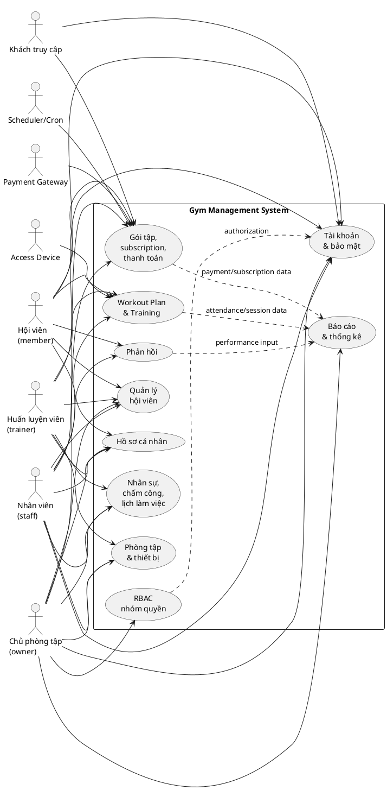
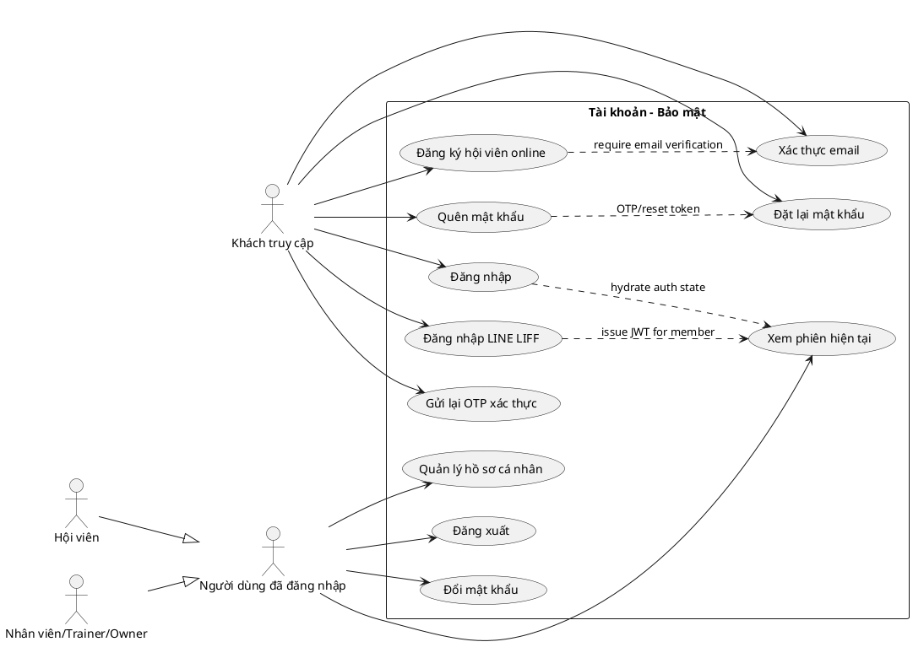
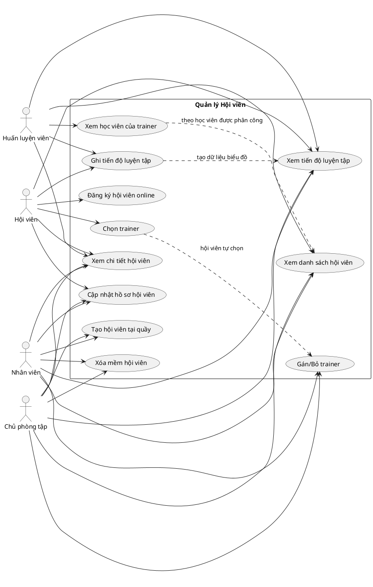
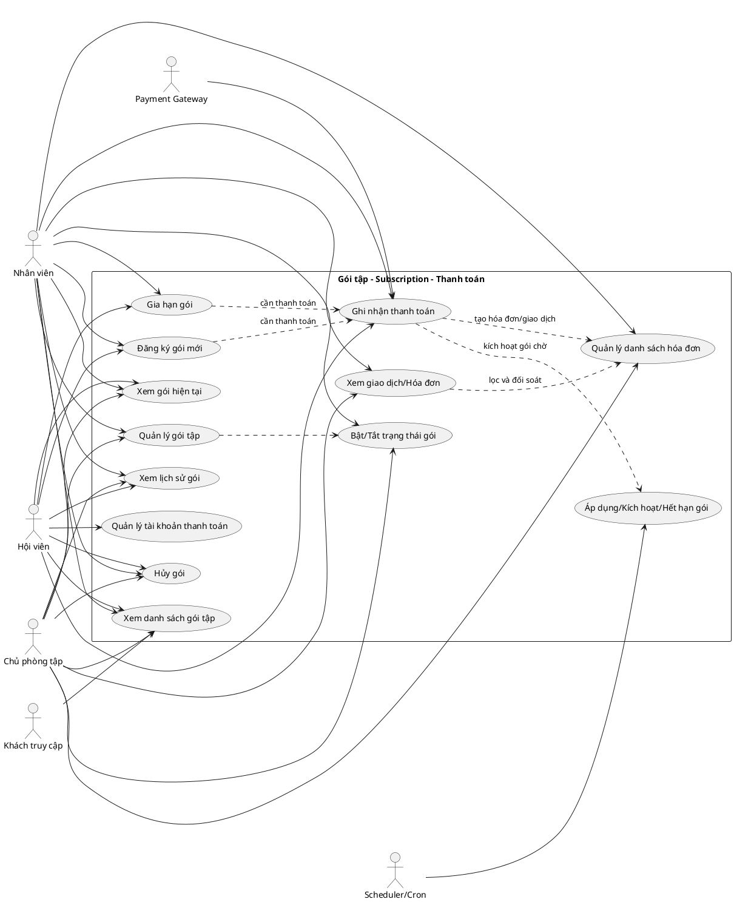
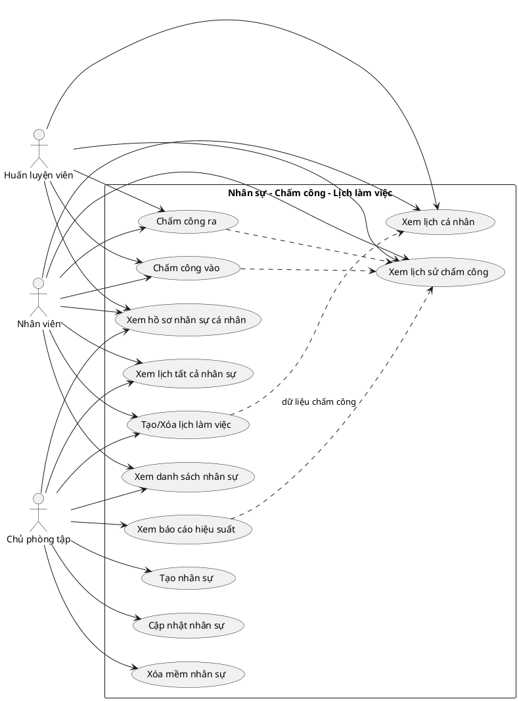
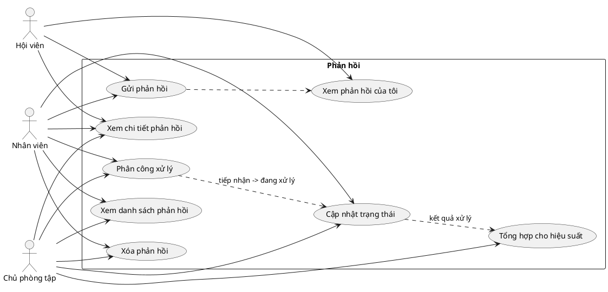
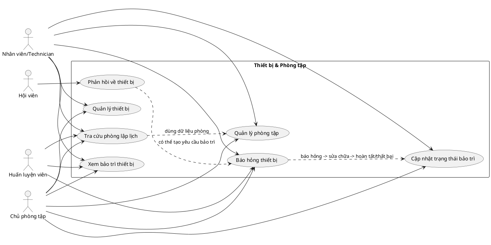
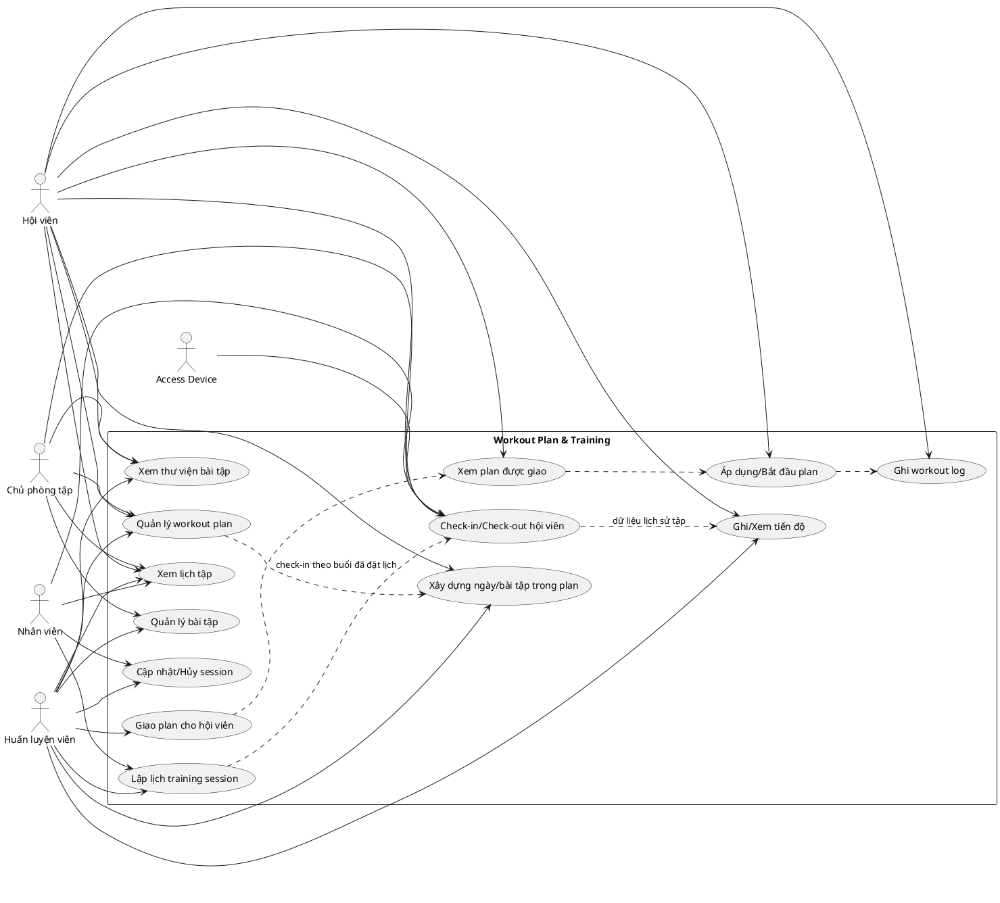
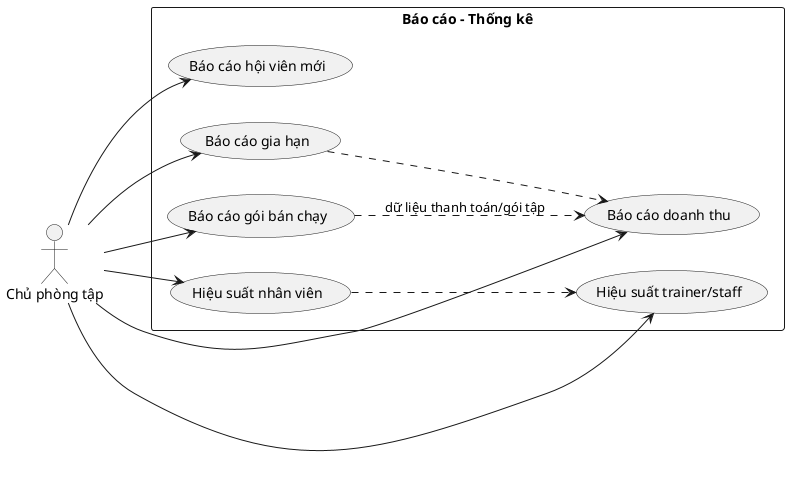
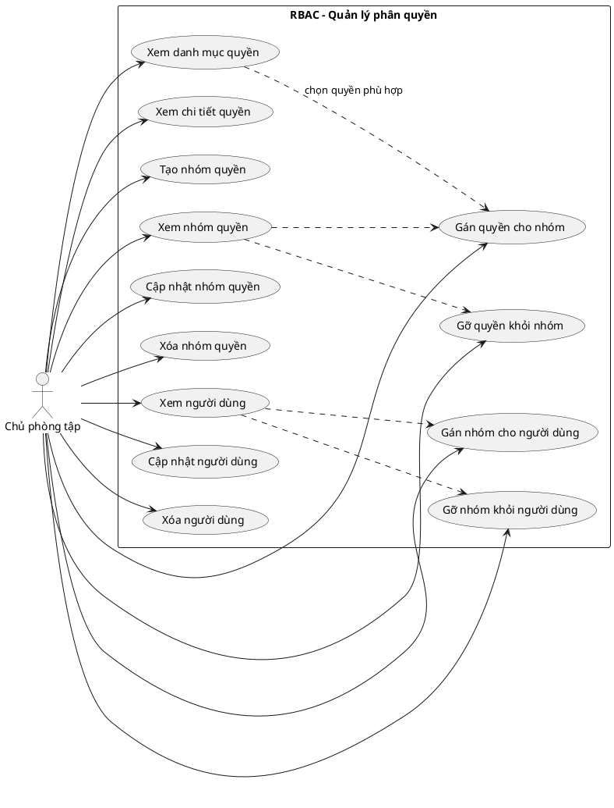

# Tài liệu Đặc tả Yêu cầu Phần mềm

## Hệ thống Quản lý Phòng tập Gym

| Field | Value |
|---|---|
| Document ID | GMS-SRS-001 |
| Version | 1.0.1 |
| Status | Draft |
| Author | Lê Thanh An (initial draft 2026-05-16) |
| Reviewers | TBD — tối thiểu 1 BA + 1 backend lead khi team formed |
| Last Updated | 2026-05-17 |
| Related docs | `docs/Design/Architecture.md` (v1.1.3), `docs/Design/Database.md` |

---

## Mục lục

- [Tài liệu Đặc tả Yêu cầu Phần mềm](#tài-liệu-đặc-tả-yêu-cầu-phần-mềm)
  - [Hệ thống Quản lý Phòng tập Gym](#hệ-thống-quản-lý-phòng-tập-gym)
  - [Mục lục](#mục-lục)
- [1. Giới thiệu](#1-giới-thiệu)
  - [1.1 Mục đích](#11-mục-đích)
  - [1.2 Phạm vi](#12-phạm-vi)
    - [Cụ thể, hệ thống cho phép:](#cụ-thể-hệ-thống-cho-phép)
    - [Các nhóm người dùng chính:](#các-nhóm-người-dùng-chính)
  - [1.3 Từ điển thuật ngữ](#13-từ-điển-thuật-ngữ)
  - [1.4 Tài liệu tham khảo](#14-tài-liệu-tham-khảo)
- [2. Mô tả tổng quan](#2-mô-tả-tổng-quan)
  - [2.1 Các tác nhân](#21-các-tác-nhân)
    - [Tác nhân chính (Con người):](#tác-nhân-chính-con-người)
    - [Tác nhân hệ thống:](#tác-nhân-hệ-thống)
  - [2.2 Biểu đồ Use Case Tổng quan](#22-biểu-đồ-use-case-tổng-quan)
    - [Nhóm tác nhân và phạm vi tương tác](#nhóm-tác-nhân-và-phạm-vi-tương-tác)
    - [Nhóm use case cấp cao](#nhóm-use-case-cấp-cao)
    - [PlantUML - Use Case Tổng quan](#plantuml---use-case-tổng-quan)
    - [Ràng buộc tổng quan](#ràng-buộc-tổng-quan)
  - [2.3 Biểu đồ Use Case Phân rã](#23-biểu-đồ-use-case-phân-rã)
    - [2.3.1 Phân rã Tài khoản - Bảo mật](#231-phân-rã-tài-khoản---bảo-mật)
    - [2.3.2 Phân rã Quản lý Hội viên](#232-phân-rã-quản-lý-hội-viên)
    - [2.3.3 Phân rã Gói tập, Đăng ký gói \& Thanh toán](#233-phân-rã-gói-tập-đăng-ký-gói--thanh-toán)
    - [2.3.4 Phân rã Quản lý Nhân sự, Chấm công \& Lịch làm việc](#234-phân-rã-quản-lý-nhân-sự-chấm-công--lịch-làm-việc)
    - [2.3.5 Phân rã Phản hồi](#235-phân-rã-phản-hồi)
    - [2.3.6 Phân rã Thiết bị \& Phòng tập](#236-phân-rã-thiết-bị--phòng-tập)
    - [2.3.7 Phân rã Workout Plan \& Training](#237-phân-rã-workout-plan--training)
    - [2.3.8 Phân rã Báo cáo \& Thống kê](#238-phân-rã-báo-cáo--thống-kê)
    - [2.3.9 Phân rã Quản lý Phân quyền RBAC](#239-phân-rã-quản-lý-phân-quyền-rbac)
  - [2.4 Quy trình Nghiệp vụ](#24-quy-trình-nghiệp-vụ)
    - [2.4.1 Quy trình Đăng ký Hội viên và Gia hạn (Tích hợp Thanh toán)](#241-quy-trình-đăng-ký-hội-viên-và-gia-hạn-tích-hợp-thanh-toán)
    - [2.4.2 Quy trình Theo dõi Lịch tập và Tự động ghi nhận (Real-time)](#242-quy-trình-theo-dõi-lịch-tập-và-tự-động-ghi-nhận-real-time)
    - [2.4.3 Quy trình Quản lý Thiết bị và Bảo trì (Tích hợp)](#243-quy-trình-quản-lý-thiết-bị-và-bảo-trì-tích-hợp)
    - [2.4.4 Quy trình Quản lý Nhân sự và Đánh giá](#244-quy-trình-quản-lý-nhân-sự-và-đánh-giá)
    - [2.4.5 Quy trình Tiếp nhận và Xử lý Phản hồi](#245-quy-trình-tiếp-nhận-và-xử-lý-phản-hồi)
    - [2.4.6 Quy trình Quản lý Phân quyền và Nhóm người dùng](#246-quy-trình-quản-lý-phân-quyền-và-nhóm-người-dùng)
      - [2.4.6.1 Quản lý nhóm cho người dùng](#2461-quản-lý-nhóm-cho-người-dùng)
      - [2.4.6.2 Quản lý người dùng cho nhóm](#2462-quản-lý-người-dùng-cho-nhóm)
      - [2.4.6.3 Quản lý chức năng cho nhóm](#2463-quản-lý-chức-năng-cho-nhóm)
    - [2.4.7 Quy trình Báo cáo Thống kê](#247-quy-trình-báo-cáo-thống-kê)
- [3. Đặc tả các chức năng](#3-đặc-tả-các-chức-năng)
  - [3.1 Đặc tả Use Case UC00 - Đăng nhập](#31-đặc-tả-use-case-uc00---đăng-nhập)
    - [Luồng sự kiện chính (Thành công)](#luồng-sự-kiện-chính-thành-công)
    - [Luồng sự kiện thay thế](#luồng-sự-kiện-thay-thế)
    - [Dữ liệu đầu vào](#dữ-liệu-đầu-vào)
    - [Hậu điều kiện](#hậu-điều-kiện)
  - [3.2 Đặc tả Use Case UC01 - Đăng xuất](#32-đặc-tả-use-case-uc01---đăng-xuất)
    - [Luồng sự kiện chính (Thành công)](#luồng-sự-kiện-chính-thành-công-1)
    - [Luồng sự kiện thay thế](#luồng-sự-kiện-thay-thế-1)
    - [Hậu điều kiện](#hậu-điều-kiện-1)
  - [3.3 Đặc tả Use Case UC02 - Quên mật khẩu](#33-đặc-tả-use-case-uc02---quên-mật-khẩu)
    - [Luồng sự kiện chính (Thành công)](#luồng-sự-kiện-chính-thành-công-2)
    - [Luồng sự kiện thay thế](#luồng-sự-kiện-thay-thế-2)
    - [Dữ liệu đầu vào](#dữ-liệu-đầu-vào-1)
    - [Hậu điều kiện](#hậu-điều-kiện-2)
  - [3.4 Đặc tả Use Case UC03 - Đăng ký hội viên mới](#34-đặc-tả-use-case-uc03---đăng-ký-hội-viên-mới)
    - [3.4.1 UC03A - Đăng ký tại quầy (Staff thực hiện)](#341-uc03a---đăng-ký-tại-quầy-staff-thực-hiện)
      - [Luồng sự kiện chính (Thành công)](#luồng-sự-kiện-chính-thành-công-3)
      - [Luồng sự kiện thay thế](#luồng-sự-kiện-thay-thế-3)
    - [3.4.2 UC03B - Đăng ký online (Member tự thực hiện)](#342-uc03b---đăng-ký-online-member-tự-thực-hiện)
      - [Luồng sự kiện chính (Thành công)](#luồng-sự-kiện-chính-thành-công-4)
      - [Luồng sự kiện thay thế](#luồng-sự-kiện-thay-thế-4)
    - [Dữ liệu đầu vào (chung cho UC03A và UC03B)](#dữ-liệu-đầu-vào-chung-cho-uc03a-và-uc03b)
    - [Hậu điều kiện](#hậu-điều-kiện-3)
  - [3.5 Đặc tả Use Case UC04 - Gia hạn / Hủy gói tập](#35-đặc-tả-use-case-uc04---gia-hạn--hủy-gói-tập)
    - [3.5.1 Gia hạn gói tập](#351-gia-hạn-gói-tập)
      - [Luồng sự kiện chính (Thành công)](#luồng-sự-kiện-chính-thành-công-5)
      - [Luồng sự kiện thay thế](#luồng-sự-kiện-thay-thế-5)
    - [3.5.2 Hủy gói tập](#352-hủy-gói-tập)
      - [Luồng sự kiện chính](#luồng-sự-kiện-chính)
    - [Hậu điều kiện](#hậu-điều-kiện-4)
  - [3.6 Đặc tả Use Case UC05 - Lập kế hoạch tập luyện, Lịch tập và Ghi nhận Real-time](#36-đặc-tả-use-case-uc05---lập-kế-hoạch-tập-luyện-lịch-tập-và-ghi-nhận-real-time)
    - [3.6.1 UC05A - PT lập kế hoạch workout và giao cho hội viên](#361-uc05a---pt-lập-kế-hoạch-workout-và-giao-cho-hội-viên)
      - [Luồng sự kiện chính](#luồng-sự-kiện-chính-1)
      - [Luồng sự kiện thay thế](#luồng-sự-kiện-thay-thế-6)
      - [Hậu điều kiện](#hậu-điều-kiện-5)
    - [3.6.2 UC05B - PT lập lịch tập cho hội viên](#362-uc05b---pt-lập-lịch-tập-cho-hội-viên)
      - [Luồng sự kiện chính](#luồng-sự-kiện-chính-2)
      - [Luồng sự kiện thay thế](#luồng-sự-kiện-thay-thế-7)
    - [3.6.3 UC05C - Theo dõi và tự động ghi nhận buổi tập (Real-time)](#363-uc05c---theo-dõi-và-tự-động-ghi-nhận-buổi-tập-real-time)
      - [Luồng sự kiện chính (Thành công)](#luồng-sự-kiện-chính-thành-công-6)
      - [Luồng sự kiện thay thế](#luồng-sự-kiện-thay-thế-8)
    - [Hậu điều kiện](#hậu-điều-kiện-6)
  - [3.7 Đặc tả Use Case UC06 - Kế hoạch và Nhật ký Luyện tập](#37-đặc-tả-use-case-uc06---kế-hoạch-và-nhật-ký-luyện-tập)
    - [3.7.1 UC06A - Hội viên ghi nhận buổi tập](#371-uc06a---hội-viên-ghi-nhận-buổi-tập)
      - [Luồng sự kiện chính](#luồng-sự-kiện-chính-3)
      - [Luồng sự kiện thay thế](#luồng-sự-kiện-thay-thế-9)
      - [Hậu điều kiện](#hậu-điều-kiện-7)
    - [3.7.2 UC06B - Hội viên tự tạo workout plan cá nhân](#372-uc06b---hội-viên-tự-tạo-workout-plan-cá-nhân)
      - [Luồng sự kiện chính](#luồng-sự-kiện-chính-4)
      - [Luồng sự kiện thay thế](#luồng-sự-kiện-thay-thế-10)
      - [Hậu điều kiện](#hậu-điều-kiện-8)
    - [3.7.3 UC06C - Theo dõi và Đánh giá tiến độ (chỉ số cơ thể)](#373-uc06c---theo-dõi-và-đánh-giá-tiến-độ-chỉ-số-cơ-thể)
      - [Luồng sự kiện chính (Thành công)](#luồng-sự-kiện-chính-thành-công-7)
      - [Luồng sự kiện thay thế](#luồng-sự-kiện-thay-thế-11)
      - [Hậu điều kiện](#hậu-điều-kiện-9)
  - [3.8 Đặc tả Use Case UC07 - Gửi phản hồi](#38-đặc-tả-use-case-uc07---gửi-phản-hồi)
    - [Luồng sự kiện chính (Thành công)](#luồng-sự-kiện-chính-thành-công-8)
    - [Luồng sự kiện thay thế](#luồng-sự-kiện-thay-thế-12)
    - [Hậu điều kiện](#hậu-điều-kiện-10)
  - [3.9 Đặc tả Use Case UC08 - Quản lý thông tin phòng tập](#39-đặc-tả-use-case-uc08---quản-lý-thông-tin-phòng-tập)
    - [Luồng sự kiện chính (Thành công)](#luồng-sự-kiện-chính-thành-công-9)
    - [Luồng sự kiện thay thế](#luồng-sự-kiện-thay-thế-13)
    - [Hậu điều kiện](#hậu-điều-kiện-11)
  - [3.10 Đặc tả Use Case UC09 - Quản lý và Bảo trì thiết bị](#310-đặc-tả-use-case-uc09---quản-lý-và-bảo-trì-thiết-bị)
    - [Luồng sự kiện chính (Thành công)](#luồng-sự-kiện-chính-thành-công-10)
    - [Luồng sự kiện thay thế](#luồng-sự-kiện-thay-thế-14)
    - [Hậu điều kiện](#hậu-điều-kiện-12)
  - [3.11 Đặc tả Use Case UC10 - Thiết lập gói tập](#311-đặc-tả-use-case-uc10---thiết-lập-gói-tập)
    - [Luồng sự kiện chính (Thành công)](#luồng-sự-kiện-chính-thành-công-11)
    - [Luồng sự kiện thay thế](#luồng-sự-kiện-thay-thế-15)
    - [Hậu điều kiện](#hậu-điều-kiện-13)
  - [3.12 Đặc tả Use Case UC11 - Quản lý nhân sự](#312-đặc-tả-use-case-uc11---quản-lý-nhân-sự)
    - [Luồng sự kiện chính (Thành công)](#luồng-sự-kiện-chính-thành-công-12)
    - [Luồng sự kiện thay thế](#luồng-sự-kiện-thay-thế-16)
    - [Hậu điều kiện](#hậu-điều-kiện-14)
  - [3.13 Đặc tả Use Case UC12 - Xem báo cáo thống kê](#313-đặc-tả-use-case-uc12---xem-báo-cáo-thống-kê)
    - [Luồng sự kiện chính (Thành công)](#luồng-sự-kiện-chính-thành-công-13)
    - [Danh sách báo cáo và công thức](#danh-sách-báo-cáo-và-công-thức)
    - [Luồng sự kiện thay thế](#luồng-sự-kiện-thay-thế-17)
    - [Hậu điều kiện](#hậu-điều-kiện-15)
- [4. Các yêu cầu khác](#4-các-yêu-cầu-khác)
  - [4.1 Chức năng (Functionality)](#41-chức-năng-functionality)
    - [Yêu cầu cụ thể:](#yêu-cầu-cụ-thể)
  - [4.2 Tính dễ dùng (Usability)](#42-tính-dễ-dùng-usability)
    - [Yêu cầu cụ thể:](#yêu-cầu-cụ-thể-1)
  - [4.3 Hiệu năng (Performance)](#43-hiệu-năng-performance)
  - [4.4 Bảo mật (Security)](#44-bảo-mật-security)
  - [4.5 Độ tin cậy (Reliability)](#45-độ-tin-cậy-reliability)
  - [4.6 Khả năng mở rộng (Scalability)](#46-khả-năng-mở-rộng-scalability)
  - [4.7 Khả năng bảo trì (Maintainability)](#47-khả-năng-bảo-trì-maintainability)

---

# 1. Giới thiệu

## 1.1 Mục đích

Tài liệu này được xây dựng nhằm mô tả chi tiết các yêu cầu của **hệ thống quản lý phòng tập Gym**, bao gồm:
- Các chức năng chính
- Các đối tượng sử dụng
- Quy trình nghiệp vụ
- Các ràng buộc liên quan

Trong bối cảnh các phòng tập hiện nay ngày càng phát triển với quy mô lớn và số lượng hội viên tăng nhanh, việc quản lý thủ công hoặc sử dụng các công cụ rời rạc gây ra nhiều khó khăn như:
- Sai sót dữ liệu
- Khó theo dõi lịch sử tập luyện
- Thiếu tính đồng bộ

Vì vậy, việc xây dựng một **hệ thống phần mềm tập trung** là cần thiết.

Tài liệu này đóng vai trò là cầu nối giữa các bên liên quan (stakeholders) như chủ phòng tập, nhân viên vận hành và đội ngũ phát triển phần mềm, giúp đảm bảo việc hiểu đúng yêu cầu và triển khai hệ thống một cách hiệu quả.

## 1.2 Phạm vi

Hệ thống quản lý phòng tập Gym được xây dựng nhằm hỗ trợ quản lý toàn diện các hoạt động vận hành trong phòng tập, từ quản lý hội viên, nhân sự đến thiết bị và doanh thu.

### Cụ thể, hệ thống cho phép:

- Quản lý thiết bị tập luyện và tình trạng bảo trì
- Quản lý nhân sự và phân công công việc
- Quản lý thông tin phòng tập
- Tiếp nhận và xử lý phản hồi từ hội viên
- Quản lý thông tin cá nhân và tài khoản của hội viên
- Quản lý quá trình đăng ký, thiết lập, gia hạn gói tập của hội viên
- Theo dõi lịch sử tập luyện và mức độ tham gia của hội viên
- Quản lý các gói tập và quá trình đăng ký, thanh toán
- Thực hiện các báo cáo thống kê doanh thu, hiệu suất phục vụ quản lý

### Các nhóm người dùng chính:
- Chủ phòng tập
- Nhân viên quản lý
- Huấn luyện viên
- Hội viên

## 1.3 Từ điển thuật ngữ

| Thuật ngữ | Mô tả |
|-----------|--------|
| **Hội viên** | Người sử dụng dịch vụ |
| **Gói tập** | Dịch vụ tập luyện theo thời hạn (v1.0 chỉ time-based, không track số buổi) |
| **PT** | Huấn luyện viên (sub-role của `staff` với `position='pt'`) |
| **Thiết bị** | Máy móc tập |
| **Gia hạn** | Tiếp tục gói tập (cùng gói hoặc gói khác) sau khi gói hiện tại hết hạn |
| **Nhóm quyền** | Tập hợp các chức năng được phép thực hiện, dùng để phân quyền người dùng trong hệ thống (tương đương Role trong RBAC) |
| **PT cố định (Primary Trainer)** | PT được gán làm người phụ trách chính của một hội viên; lưu ở `members.primary_trainer_id` |
| **Trạng thái gói (Subscription Status)** | `pending` (chờ thanh toán), `active` (đang hoạt động), `expired` (hết hạn), `cancelled` (hủy chủ động) |
| **Verify Email** | Xác thực email qua OTP/link sau đăng ký; bắt buộc trước khi sử dụng dịch vụ (áp dụng cho cả member đăng ký online lẫn tại quầy) |
| **Soft Delete / Hard Delete** | Soft = đánh dấu `deleted_at`, vẫn giữ data; Hard = xóa khỏi DB. Xem Database.md "Soft Delete Convention" |
| **Audit Log** | Bản ghi ai-làm-gì-khi-nào trên resource nhạy cảm (bảng `audit_logs`) |
| **Kỹ thuật viên (Technician)** | Sub-role của `staff` với `position='technician'`, phụ trách sửa chữa thiết bị |
| **JWT** | JSON Web Token — chuỗi mã hóa chứa user identity + roles, dùng để xác thực API request |
| **OTP** | One-Time Password — mã 6 chữ số dùng 1 lần (verify email, reset mật khẩu), TTL 10 phút |
| **RBAC** | Role-Based Access Control — phân quyền theo nhóm/role |
| **SLA** | Service Level Agreement — cam kết thời gian xử lý (áp dụng cho feedback) |
| **BMI** | Body Mass Index — chỉ số khối cơ thể, ghi trong `member_progress` |
| **Access Device** | Thiết bị kiểm soát ra/vào tại phòng tập (đầu đọc thẻ / QR), gọi backend qua API key cố định |
| **`today_vn`** | Ngày bản địa theo `Asia/Ho_Chi_Minh`, định nghĩa `(NOW() AT TIME ZONE 'Asia/Ho_Chi_Minh')::date`. Mọi date comparison nghiệp vụ (subscription start/end, attendance window, KPI day-of) dùng `today_vn` — KHÔNG dùng `CURRENT_DATE` (UTC, sai 1 ngày quanh nửa đêm VN). Xem Architecture.md §4.5 |

## 1.4 Tài liệu tham khảo

Tài liệu được xây dựng dựa trên:
- Đề bài hệ thống quản lý phòng tập Gym trong môn Phát triển phần mềm theo chuẩn ITSS
- Các tài liệu mẫu SRS tiêu chuẩn
- Tham khảo các hệ thống quản lý gym thực tế

---

# 2. Mô tả tổng quan

## 2.1 Các tác nhân

### Tác nhân chính (Con người):

- **Hội viên (Member):** Người sử dụng hệ thống để theo dõi gói tập, lịch tập và phản hồi dịch vụ. Có thể tự đăng ký online hoặc do Staff đăng ký tại quầy.
- **Huấn luyện viên (PT / Trainer):** `staff.position='pt'`. Quản lý danh sách học viên có `primary_trainer_id=self`, thiết lập lịch tập (training_session), nhập tiến độ.
- **Nhân viên quản lý (Staff):** `staff.position='manager'` hoặc `'receptionist'`. Đăng ký hội viên, kiểm soát gói tập, xử lý phản hồi, quản lý phòng/thiết bị.
- **Kỹ thuật viên (Technician):** `staff.position='technician'`. Phụ trách sửa chữa thiết bị, cập nhật trạng thái maintenance_logs.
- **Chủ phòng tập (Owner):** Quyền cao nhất; bao gồm mọi quyền của Staff + cấu hình gói tập, quản lý nhân sự, RBAC (group/permission), xem báo cáo.

### Tác nhân hệ thống:

- **Hệ thống Thanh toán (Payment Gateway):** Xác nhận giao dịch thanh toán trực tuyến (ngân hàng số, ví điện tử). Tương tác qua webhook callback.
- **Access Device:** Thiết bị kiểm soát ra/vào (đầu đọc thẻ / QR / vân tay) đặt tại phòng tập. Push event check-in qua `POST /api/v1/devices/access-events` với API key cố định (v1.0). Xem Database.md "External Device Authentication".
- **Scheduler / Cron Jobs:** Tác nhân nội bộ chạy các job định kỳ — auto-expire subscription, cleanup OTP, SLA badge check. Chi tiết job list xem Architecture.md §5.2.

---

## 2.2 Biểu đồ Use Case Tổng quan

Phần tổng quan này được cập nhật theo project hiện tại, đối chiếu với các màn hình người dùng, sidebar theo vai trò, các nhóm chức năng backend, schema dữ liệu và tài liệu module. Hệ thống không chỉ dừng ở đăng ký hội viên/gia hạn gói, mà đã bao phủ các nhóm chức năng: xác thực, hồ sơ, hội viên, gói tập, thanh toán, nhân sự, phản hồi, phòng/thiết bị, workout plan, training, báo cáo và RBAC.

### Nhóm tác nhân và phạm vi tương tác

| Tác nhân | Phạm vi chính trong project |
|---|---|
| **Khách truy cập** | Xem trang public, xem gói tập/chương trình/HLV, đăng ký tài khoản hội viên, xác thực email, thanh toán sau đăng ký. |
| **Hội viên (`member`)** | Quản lý hồ sơ, gói hiện tại, mua/gia hạn/hủy gói, tài khoản thanh toán, workout plan, lịch tập, check-in/attendance, tiến độ, phản hồi, chọn trainer. |
| **Huấn luyện viên (`trainer`)** | Xem học viên mình phụ trách, lập lịch dạy, ghi tiến độ, tạo/giao workout plan, quản lý bài tập/giáo án, xem lịch làm việc cá nhân. |
| **Nhân viên (`staff`)** | Đăng ký/quản lý hội viên tại quầy, xử lý gia hạn và thanh toán, check-in hội viên, chấm công cá nhân, xử lý phản hồi, quản lý phòng tập và thiết bị. |
| **Chủ phòng tập (`owner`)** | Quản trị gói tập, nhân sự, lịch phân công, thiết bị, RBAC, doanh thu, hóa đơn/giao dịch, báo cáo hiệu suất. |
| **Payment Gateway** | Xác nhận giao dịch thanh toán online/chuyển khoản/thẻ/ví điện tử và trả kết quả để hệ thống ghi nhận thanh toán. |
| **Access Device** | Thiết bị kiểm soát ra/vào gửi thông tin check-in/check-out của hội viên về hệ thống qua kênh tích hợp đã định danh. |
| **Scheduler/Cron** | Tự động kích hoạt, hết hạn hoặc hủy gói tập đang chờ theo thời gian và trạng thái thanh toán. |

### Nhóm use case cấp cao

| Nhóm chức năng | Actor chính | Màn hình/chức năng liên quan |
|---|---|---|
| Tài khoản - bảo mật | Tất cả role, khách truy cập | Màn hình đăng nhập, quên/đặt lại mật khẩu, xác thực email, đổi mật khẩu, đăng ký hội viên online và quản lý phiên người dùng. |
| Hội viên | Member, Staff, Trainer, Owner | Danh sách/chi tiết hội viên, hồ sơ cá nhân, gán hoặc chọn trainer, tiến độ luyện tập và danh sách học viên của trainer. |
| Gói tập - subscription - payment | Member, Staff, Owner, Payment Gateway, Scheduler | Trang xem gói tập, mua/gia hạn/hủy gói, thanh toán, tài khoản thanh toán, hóa đơn/giao dịch và quản trị gói tập. |
| Nhân sự | Staff, Trainer, Owner | Hồ sơ nhân sự, lịch làm việc, phân công ca, chấm công cá nhân và đánh giá hiệu suất. |
| Phản hồi | Member, Staff, Owner | Màn hình gửi phản hồi, danh sách phản hồi, phân công xử lý, cập nhật trạng thái và tổng hợp phản hồi cho báo cáo. |
| Thiết bị và phòng tập | Staff, Owner, Trainer | Quản lý phòng tập, thiết bị, tra cứu phòng khi lập lịch, nhật ký bảo trì và phản hồi liên quan đến thiết bị. |
| Workout Plan & Training | Member, Trainer, Staff, Owner, Access Device | Thư viện bài tập, workout plan, lịch training session, nhật ký buổi tập, check-in hội viên và theo dõi tiến độ. |
| Báo cáo - thống kê | Owner | Báo cáo doanh thu, hội viên mới, tỷ lệ gia hạn, gói bán chạy và hiệu suất nhân viên/trainer. |
| RBAC | Owner | Quản lý nhóm quyền, danh mục quyền, người dùng và việc gán/gỡ quyền theo vai trò. |

### PlantUML - Use Case Tổng quan

### Ràng buộc tổng quan

- Các màn hình sau đăng nhập được bảo vệ theo vai trò: `member`, `trainer`, `staff`, `owner`; riêng luồng đăng ký member, xác thực email và thanh toán ban đầu được mở hoặc bảo vệ theo từng bước nghiệp vụ.
- Với role `member`, các màn hình workout, attendance, progress và feedback chỉ sử dụng được khi hội viên có gói tập đang hoạt động.
- Gói tập hiện tại là **time-based** theo thời hạn sử dụng; attendance chỉ ghi nhận lượt vào/ra, không trừ số buổi.
- Owner là actor duy nhất của nhóm báo cáo tổng hợp và RBAC. Staff có thể vận hành tại quầy nhưng không xem báo cáo doanh thu/quản trị quyền nếu chưa được cấp quyền tương ứng.
- Trainer chỉ xem/quản lý học viên, lịch và tiến độ trong phạm vi được phân công, không quản trị toàn bộ hội viên.

---

## 2.3 Biểu đồ Use Case Phân rã

Các sơ đồ dưới đây dùng PlantUML để có thể dựng lại bằng PlantUML hoặc Astah. Nội dung phân rã bám theo các module hiện có trong project: `auth`, `members`, `packages`, `subscriptions`, `payments`, `payment-accounts`, `staff`, `feedback`, `facility`, `workout`, `training`, `reports`, `rbac`.

### 2.3.1 Phân rã Tài khoản - Bảo mật

Nhóm này bao phủ đăng nhập, phiên người dùng, quên/đặt lại mật khẩu, xác thực email, đổi mật khẩu và đăng ký tài khoản hội viên. Đây là lớp tiền đề cho mọi chức năng cần xác thực người dùng bằng JWT.

**Use case chính:**

| Use case | Actor | Màn hình/chức năng liên quan |
|---|---|---|
| Đăng nhập | Tất cả role | Người dùng nhập thông tin đăng nhập; hệ thống xác thực, tạo phiên đăng nhập và điều hướng theo vai trò. |
| Đăng nhập bằng LINE LIFF | Member | Hội viên đăng nhập bằng LINE LIFF; hệ thống xác thực tài khoản member và tạo phiên đăng nhập phù hợp. |
| Xem phiên hiện tại | Tất cả role đã đăng nhập | Hệ thống hiển thị trạng thái đăng nhập, vai trò và hồ sơ liên quan để giao diện tải đúng quyền. |
| Đăng xuất | Tất cả role đã đăng nhập | Người dùng kết thúc phiên đăng nhập; giao diện xóa thông tin đăng nhập cục bộ. |
| Quên mật khẩu | Khách truy cập/tất cả role | Màn hình quên mật khẩu tiếp nhận email/số điện thoại và gửi hướng dẫn xác nhận. |
| Đặt lại mật khẩu | Khách truy cập/tất cả role | Màn hình đặt lại mật khẩu cho phép người dùng nhập OTP/token và mật khẩu mới. |
| Xác thực email | Member/Staff mới tạo | Màn hình xác thực email và gửi lại mã xác thực khi người dùng chưa nhận được mã. |
| Đổi mật khẩu | Người dùng đã đăng nhập | Màn hình đổi mật khẩu yêu cầu mật khẩu hiện tại và mật khẩu mới. |
| Đăng ký hội viên online | Khách truy cập | Trang đăng ký hội viên online, màn hình xác thực email và màn hình thanh toán ban đầu. |
| Quản lý hồ sơ cá nhân | Member/Trainer/Staff/Owner | Trang hồ sơ cá nhân theo từng vai trò, cho phép xem và cập nhật thông tin được phép. |

### 2.3.2 Phân rã Quản lý Hội viên

Nhóm này bao phủ quản lý hội viên, hồ sơ cá nhân, gán/chọn trainer, xem học viên của trainer và theo dõi tiến độ luyện tập. Project hiện tách dữ liệu tài khoản (`users`) và dữ liệu hội viên (`members`), nên thao tác hội viên có thể đi qua cả trang tự phục vụ của member lẫn màn hình quản lý của staff/trainer/owner.

**Use case chính:**

| Use case | Actor | Màn hình/chức năng liên quan |
|---|---|---|
| Xem danh sách hội viên | Staff, Trainer, Owner | Màn hình danh sách hội viên có lọc theo vai trò; trainer chỉ thấy học viên mình phụ trách. |
| Tạo hội viên tại quầy | Staff, Owner | Nhân viên nhập thông tin hội viên, chọn gói tập ban đầu và tạo tài khoản/hồ sơ hội viên tại quầy. |
| Xem chi tiết hội viên | Member, Trainer, Staff, Owner | Màn hình chi tiết hồ sơ; member xem chính mình, trainer xem học viên mình phụ trách. |
| Cập nhật hồ sơ hội viên | Member self-field, Staff, Owner | Owner/Staff cập nhật thông tin quản lý; member chỉ cập nhật các trường được phép trong hồ sơ cá nhân. |
| Xóa mềm hội viên | Staff, Owner | Màn hình quản lý hội viên cho phép ngừng kích hoạt hội viên và vô hiệu hóa tài khoản liên quan. |
| Gán hoặc bỏ trainer cho hội viên | Staff, Owner, Member chọn trainer | Màn hình phân công trainer và chức năng hội viên tự chọn trainer trong phạm vi được phép. |
| Xem học viên đang huấn luyện | Trainer | Màn hình học viên của trainer, kèm thông tin hồ sơ, lịch tập và tiến độ liên quan. |
| Ghi nhận tiến độ luyện tập | Trainer, Member self-progress | Trainer hoặc hội viên nhập chỉ số cơ thể, ghi chú luyện tập và kết quả theo từng thời điểm. |
| Xem tiến độ luyện tập | Member, Trainer, Staff, Owner | Màn hình tiến độ hiển thị lịch sử chỉ số và biểu đồ theo dõi quá trình luyện tập. |

### 2.3.3 Phân rã Gói tập, Đăng ký gói & Thanh toán

Nhóm này bao phủ danh mục gói tập, gói hội viên đang sử dụng, mua/gia hạn/hủy gói, tài khoản thanh toán, ghi nhận thanh toán và hóa đơn/giao dịch. Đây là luồng tạo doanh thu chính của hệ thống.

**Use case chính:**

| Use case | Actor | Màn hình/chức năng liên quan |
|---|---|---|
| Xem danh sách gói tập | Khách truy cập, Member, Staff, Trainer, Owner | Trang danh mục gói tập công khai và màn hình chọn gói trong các luồng mua/gia hạn. |
| Quản lý gói tập | Owner; Staff nếu được cấp quyền quản lý gói | Màn hình quản trị gói tập cho phép tạo, cập nhật, bật/tắt trạng thái và theo dõi gói đang bán. |
| Xem gói hiện tại | Member, Staff, Owner | Màn hình gói hiện tại hiển thị thời hạn, trạng thái, quyền lợi và thông tin thanh toán liên quan. |
| Xem lịch sử gói đã đăng ký | Member, Staff, Owner | Màn hình lịch sử gói tập cho biết các lần mua, gia hạn, hủy hoặc hết hạn trước đây. |
| Đăng ký/mua gói mới | Member, Staff | Hội viên hoặc nhân viên chọn gói, kiểm tra thông tin và khởi tạo gói ở trạng thái chờ thanh toán. |
| Gia hạn gói hiện tại | Member, Staff | Màn hình gia hạn cho phép chọn thời điểm/chu kỳ gia hạn và chuyển sang bước thanh toán. |
| Hủy gói hiện tại | Member, Staff, Owner | Màn hình quản lý gói cho phép hủy gói theo điều kiện nghiệp vụ và ghi nhận lý do nếu có. |
| Quản lý tài khoản thanh toán | Member, Staff/Owner hỗ trợ | Màn hình tài khoản thanh toán lưu thông tin phương thức thanh toán phục vụ các lần mua/gia hạn sau. |
| Ghi nhận thanh toán | Member, Staff, Payment Gateway | Màn hình thanh toán tại quầy/online ghi nhận tiền mặt, thẻ, ví điện tử hoặc kết quả xác nhận từ cổng thanh toán. |
| Xem giao dịch/hóa đơn | Owner, Staff theo nghiệp vụ quầy | Màn hình giao dịch/hóa đơn cho phép tra cứu, lọc và đối soát thanh toán. |
| Quản lý danh sách hóa đơn | Owner, Staff vận hành | Danh sách hóa đơn được tạo sau khi thanh toán, có chức năng lọc, xem chi tiết và phục vụ đối soát. |
| Áp dụng/kích hoạt/hết hạn gói tập | Scheduler, hệ thống sau thanh toán thành công | Cron tự động kích hoạt gói sau khi thanh toán thành công, đồng thời hết hạn hoặc hủy các gói chờ quá lâu. |

### 2.3.4 Phân rã Quản lý Nhân sự, Chấm công & Lịch làm việc

Nhóm này bao phủ tài khoản nhân sự, lịch làm việc, chấm công cá nhân và dữ liệu đánh giá hiệu suất. Project hiện có `staff`, `staff_schedules`, `staff_attendance_logs` và báo cáo hiệu suất trong module `reports`.

**Use case chính:**

| Use case | Actor | Màn hình/chức năng liên quan |
|---|---|---|
| Xem danh sách nhân sự | Owner, Staff có quyền | Màn hình danh sách nhân sự có tìm kiếm, lọc vai trò và xem nhanh trạng thái làm việc. |
| Tạo/cập nhật/xóa nhân sự | Owner | Màn hình quản lý nhân sự cho phép tạo hồ sơ, cập nhật thông tin và ngừng kích hoạt nhân sự. |
| Xem hồ sơ nhân sự cá nhân | Staff, Trainer, Owner | Trang hồ sơ cá nhân theo vai trò, hiển thị thông tin liên hệ, vai trò và thông tin công việc. |
| Xem lịch làm việc cá nhân | Staff, Trainer | Màn hình lịch cá nhân hoặc sidebar/profile hiển thị ca làm và lịch được phân công. |
| Xem lịch tất cả nhân sự | Owner, Staff có quyền | Màn hình lịch tổng hợp giúp theo dõi phân công nhân sự theo ngày/tuần/khoảng thời gian. |
| Quản lý lịch làm việc | Owner, Staff có quyền | Màn hình phân công ca cho phép thêm, cập nhật hoặc xóa lịch làm việc của nhân sự. |
| Chấm công vào/ra | Staff, Trainer, Owner nếu có staff profile | Chức năng chấm công cá nhân ghi nhận thời điểm vào/ra ca làm việc. |
| Xem lịch sử chấm công cá nhân | Staff, Trainer, Owner nếu có staff profile | Màn hình lịch sử chấm công hiển thị các lần vào/ra và trạng thái ca làm. |
| Đánh giá hiệu suất làm việc | Owner | Báo cáo dựa trên sessions, attendance, feedback, revenue/operation data. |

### 2.3.5 Phân rã Phản hồi

Nhóm này bao phủ việc hội viên gửi phản hồi và nhân viên/chủ phòng tập xử lý phản hồi. Project hỗ trợ feedback theo loại `staff`, `equipment`, `service`, có trạng thái `open`, `in_progress`, `resolved`, `rejected` và có thể xóa mềm.

**Use case chính:**

| Use case | Actor | Màn hình/chức năng liên quan |
|---|---|---|
| Gửi phản hồi | Member, Staff tạo hộ | Màn hình gửi phản hồi cho phép chọn loại phản hồi, nhập nội dung và đính kèm thông tin nhân sự/thiết bị liên quan nếu có. |
| Xem phản hồi của tôi | Member | Màn hình phản hồi cá nhân hiển thị các phản hồi đã gửi và trạng thái xử lý. |
| Xem danh sách/chi tiết phản hồi | Staff, Owner | Màn hình quản lý phản hồi cho phép lọc danh sách, xem chi tiết nội dung và lịch sử xử lý. |
| Phân công xử lý phản hồi | Staff, Owner | Chức năng phân công người phụ trách để chuyển phản hồi vào luồng xử lý. |
| Cập nhật trạng thái xử lý | Staff, Owner | Chức năng cập nhật trạng thái phản hồi từ mới tiếp nhận đến đang xử lý, đã xử lý hoặc từ chối. |
| Xóa phản hồi | Staff, Owner | Màn hình quản lý phản hồi cho phép xóa mềm phản hồi không còn phù hợp theo quyền vận hành. |
| Sử dụng feedback cho đánh giá hiệu suất | Owner | Dữ liệu đầu vào cho report hiệu suất nhân viên/trainer. |

### 2.3.6 Phân rã Thiết bị & Phòng tập

Nhóm này bao phủ quản lý phòng tập, quản lý thiết bị và nhật ký bảo trì. Project dùng module `facility` với các dữ liệu phòng, thiết bị và bảo trì; phòng được dùng để xếp lịch training session, thiết bị có thể là đối tượng phản hồi/bảo trì.

**Use case chính:**

| Use case | Actor | Màn hình/chức năng liên quan |
|---|---|---|
| Quản lý phòng tập | Staff, Owner | Màn hình phòng tập cho phép xem danh sách, thêm phòng mới, cập nhật thông tin và ngừng sử dụng phòng. |
| Tra cứu phòng để lập lịch | Trainer, Staff, Owner | Chức năng chọn phòng khả dụng khi tạo hoặc điều chỉnh training session. |
| Quản lý thiết bị | Staff, Owner | Màn hình thiết bị cho phép xem danh sách, thêm thiết bị, cập nhật thông tin và ngừng sử dụng thiết bị. |
| Xem lịch sử bảo trì thiết bị | Staff, Owner, Trainer có quyền đọc | Màn hình chi tiết thiết bị hiển thị các lần báo hỏng, sửa chữa và kết quả bảo trì. |
| Báo hỏng thiết bị | Staff, Trainer, Owner | Người dùng có quyền nhập mô tả sự cố, mức độ ảnh hưởng và tạo yêu cầu bảo trì. |
| Cập nhật trạng thái bảo trì | Staff/Technician, Owner | Màn hình bảo trì cho phép chuyển trạng thái xử lý, ghi chú kết quả và thời điểm hoàn tất. |
| Liên kết phản hồi thiết bị | Member, Staff, Owner | Phản hồi liên quan đến thiết bị có thể tham chiếu thiết bị cụ thể để nhân viên theo dõi và bảo trì. |

### 2.3.7 Phân rã Workout Plan & Training

Nhóm này là phần vận hành tập luyện. Project đã tách rõ thư viện bài tập, workout plan, plan được giao cho hội viên, nhật ký buổi tập, training session, attendance và tiến độ.

**Use case chính:**

| Use case | Actor | Màn hình/chức năng liên quan |
|---|---|---|
| Xem thư viện bài tập | Member, Trainer, Staff, Owner | Màn hình thư viện bài tập cho phép xem, tìm kiếm và tra cứu hướng dẫn bài tập. |
| Quản lý bài tập | Trainer, Owner/Staff nếu có quyền | Màn hình quản lý bài tập cho phép thêm, chỉnh sửa, ẩn/xóa bài tập theo quyền được cấp. |
| Quản lý workout plan | Trainer, Member với plan tự tạo | Trainer hoặc member tạo, chỉnh sửa và quản lý workout plan trong phạm vi được phép. |
| Xây dựng giáo án/plan theo ngày và bài tập | Trainer, Member | Màn hình dựng plan cho phép chia ngày tập, chọn bài tập, số hiệp, số lần và ghi chú kỹ thuật. |
| Giao workout plan cho hội viên | Trainer | Trainer chọn hội viên, chọn workout plan phù hợp và giao plan để hội viên theo dõi. |
| Xem plan PT giao | Member | Màn hình plan được giao hiển thị lịch tập, bài tập và hướng dẫn từ trainer. |
| Áp dụng/bắt đầu plan | Member | Hội viên bắt đầu một buổi tập từ plan được giao hoặc plan tự tạo; hệ thống khởi tạo nhật ký buổi tập. |
| Điều chỉnh plan | Trainer với plan do nhân sự tạo, Member với plan tự tạo | Hệ thống không cho chỉnh sửa phần đã có lịch sử tập để bảo toàn dữ liệu theo dõi. |
| Ghi nhận kết quả buổi tập | Member | Hội viên nhập kết quả buổi tập, cảm nhận, số hiệp/số lần hoàn thành và ghi chú nếu có. |
| Lập lịch training session | Trainer, Staff, Owner | Màn hình lập lịch cho phép chọn hội viên, trainer, phòng tập, thời gian và nội dung buổi tập. |
| Xem lịch tập | Member, Trainer, Staff, Owner | Màn hình lịch tập hiển thị các buổi đã lên lịch, trạng thái và thông tin liên quan. |
| Check-in hội viên | Access Device, Staff, Member xem log | Thiết bị kiểm soát ra/vào gửi thông tin check-in của hội viên về hệ thống. Hệ thống kiểm tra quyền truy cập và tự động ghi nhận lượt vào phòng tập; nhân viên có thể hỗ trợ check-in thủ công khi cần. |
| Ghi và xem tiến độ | Trainer, Member, Owner/Staff | Kết nối với nhóm Hội viên ở 2.3.2. |

### 2.3.8 Phân rã Báo cáo & Thống kê

Nhóm này phục vụ Owner trong việc theo dõi doanh thu, hội viên mới, tỷ lệ gia hạn, gói bán chạy và hiệu suất nhân viên/trainer. Dữ liệu báo cáo vẫn đọc từ `payments`, `subscriptions`, `members`, `training_sessions`, `feedback`, `staff_attendance_logs` và các bảng liên quan; phần xem giao dịch, hóa đơn và ghi nhận thanh toán thuộc nhóm 2.3.3 Gói tập, Đăng ký gói & Thanh toán.

**Use case chính:**

| Use case | Actor | Màn hình/chức năng liên quan |
|---|---|---|
| Xem doanh thu | Owner | Dashboard doanh thu theo thời gian, nguồn thanh toán và các chỉ số tổng hợp. |
| Xem hội viên mới | Owner | Báo cáo số hội viên mới theo khoảng thời gian, kênh đăng ký và gói đã chọn. |
| Xem tỷ lệ gia hạn | Owner | Báo cáo tỷ lệ hội viên gia hạn, hủy gói hoặc để gói hết hạn. |
| Xem gói bán chạy | Owner | Báo cáo xếp hạng gói tập theo số lượt mua/gia hạn và doanh thu. |
| Xem báo cáo hiệu suất nhân viên | Owner | Báo cáo hiệu suất vận hành dựa trên chấm công, xử lý phản hồi, giao dịch và dữ liệu liên quan. |
| Xem báo cáo hiệu suất trainer/staff | Owner | Báo cáo hiệu suất trainer/staff có lọc theo nhân sự, thời gian và chỉ số đánh giá. |

### 2.3.9 Phân rã Quản lý Phân quyền RBAC

Nhóm này phục vụ Owner trong quản lý phân quyền. Project hiện hỗ trợ quản lý nhóm quyền, gán/gỡ quyền cho nhóm, quản lý người dùng và gán/gỡ nhóm cho người dùng. Riêng danh mục permission hiện là **chỉ đọc** trên giao diện/hệ thống; việc thêm/sửa/xóa permission khi chạy chưa được hỗ trợ trực tiếp, mà được quản lý qua seed/migration.

**Use case chính:**

| Use case | Actor | Màn hình/chức năng liên quan |
|---|---|---|
| Xem danh mục quyền | Owner | Màn hình danh mục quyền hiển thị các permission hiện có và ghi rõ trạng thái chỉ đọc. |
| Xem chi tiết quyền | Owner | Màn hình chi tiết quyền cho biết tên quyền, mô tả và phạm vi áp dụng. |
| Quản lý nhóm quyền | Owner | Màn hình nhóm quyền cho phép tạo, xem, cập nhật và ngừng sử dụng nhóm quyền. |
| Gán quyền cho nhóm | Owner | Owner chọn nhóm quyền và bổ sung các permission phù hợp với phạm vi trách nhiệm của nhóm. |
| Gỡ quyền khỏi nhóm | Owner | Owner loại bỏ permission khỏi nhóm khi nhóm không còn cần quyền đó. |
| Xem danh sách người dùng | Owner | Màn hình người dùng cho phép tra cứu tài khoản, vai trò và trạng thái hoạt động. |
| Cập nhật/xóa người dùng | Owner | Owner cập nhật thông tin tài khoản hoặc ngừng kích hoạt người dùng theo quy trình quản trị. |
| Gán nhóm cho người dùng | Owner | Owner thêm người dùng vào nhóm quyền để cấp bộ quyền tương ứng. |
| Gỡ nhóm khỏi người dùng | Owner | Owner gỡ người dùng khỏi nhóm quyền khi vai trò hoặc phạm vi công việc thay đổi. |

---

## 2.4 Quy trình Nghiệp vụ

### 2.4.1 Quy trình Đăng ký Hội viên và Gia hạn (Tích hợp Thanh toán)

Quy trình này áp dụng cho cả việc tạo mới hội viên và nâng cấp/gia hạn gói tập hiện có.

**Bước 1: Tiếp nhận yêu cầu**
- Hội viên cung cấp thông tin cá nhân (đối với đăng ký mới) hoặc mã hội viên (đối với gia hạn)
- Lựa chọn gói tập mong muốn (3 tháng, 6 tháng, VIP, v.v.)

**Bước 2: Kiểm tra và Khởi tạo**
- Hệ thống kiểm tra tính duy nhất của SĐT/Email (nếu đăng ký mới)
- Hoặc kiểm tra trạng thái gói tập cũ (nếu gia hạn)
- Nhân viên quản lý nhập/cập nhật dữ liệu vào hệ thống

**Bước 3: Thực hiện thanh toán**
- Hệ thống tính toán tổng tiền dựa trên đơn giá gói tập và các chương trình khuyến mãi hiện có
- Hội viên thực hiện thanh toán qua các phương thức:
  - Tiền mặt
  - Thẻ ngân hàng
  - Ví điện tử
- **Trường hợp lỗi:** Nếu giao dịch điện tử thất bại, hệ thống báo lỗi và cho phép chọn lại phương thức thanh toán hoặc hủy yêu cầu

**Bước 4: Kích hoạt và Hoàn tất**
- Hệ thống xác nhận thanh toán thành công
- Cập nhật ngày bắt đầu/kết thúc gói tập vào cơ sở dữ liệu
- Hệ thống tự động in biên lai
- Cấp/cập nhật quyền truy cập cho hội viên

Tệp nguồn diagram: [07_process_register_renew_payment.puml](Diagram/src/07_process_register_renew_payment.puml)

### 2.4.2 Quy trình Theo dõi Lịch tập và Tự động ghi nhận (Real-time)

Quy trình áp dụng cho UC05B: thiết bị kiểm soát ra/vào (Access Device) phát hiện hội viên và hệ thống tự động ghi nhận buổi tập, KHÔNG cần check-in thủ công ở quầy. Gói tập là time-based — không trừ số buổi.

**Bước 1: Nhận diện hội viên qua thiết bị**

- Hội viên quẹt thẻ / quét QR tại Access Device.
- Device gọi endpoint backend với device API key và `member_code`.

**Bước 2: Xác thực quyền truy cập**

- Hệ thống tra `subscriptions` của member: yêu cầu `status='active'` và `end_date >= today_vn` (xem Glossary).
- Nếu có session với PT trùng khung giờ (`training_sessions.status='scheduled'`, `start_time <= NOW() <= end_time`) → tham chiếu `session_id` vào attendance log.

**Bước 3: Ghi attendance log**

- Insert `attendance_logs` với `member_id`, `subscription_id`, `session_id` (nullable), `method='realtime'`, `checked_in_at=NOW()`.
- Không trừ buổi (time-based-only): chỉ ghi nhận có mặt, không decrement bất kỳ counter nào.

**Bước 4: Cập nhật trạng thái session (nếu có)**

- Nếu attendance gắn với `training_sessions`: cron `training-session:auto-close` (xem `Architecture.md §5.2`) sẽ chuyển session sang `completed` sau `end_time + 15 phút`.
- Hội viên và PT xem lịch sử attendance ở dashboard cá nhân.

Tệp nguồn diagram: [08_process_realtime_training.puml](Diagram/src/08_process_realtime_training.puml)

### 2.4.3 Quy trình Quản lý Thiết bị và Bảo trì (Tích hợp)

Đảm bảo quản lý vòng đời thiết bị từ khi nhập về đến khi thanh lý.

**Bước 1: Quản lý danh mục**
- Nhân viên quản lý cập nhật thông tin thiết bị mới (mã, tên, ngày nhập, bảo hành)
- Cập nhật thông tin thiết bị hiện có vào danh sách quản lý

**Bước 2: Báo cáo sự cố**
- Khi phát hiện lỗi (qua kiểm tra định kỳ hoặc phản hồi của hội viên)
- Nhân viên ghi nhận mô tả lỗi trên hệ thống

**Bước 3: Chuyển trạng thái bảo trì**
- Hệ thống cập nhật trạng thái thiết bị thành "Đang sửa chữa"
- Thông báo cho bộ phận kỹ thuật

**Bước 4: Xử lý sửa chữa**
- **Thành công:** Kỹ thuật viên sửa xong, cập nhật trạng thái về "Hoạt động bình thường"
- **Thất bại:** Nếu thiết bị không thể sửa, hệ thống sẽ thực hiện quy trình thanh lý và chuyển trạng thái sang "Ngừng hoạt động"

Tệp nguồn diagram: [09_process_equipment_maintenance.puml](Diagram/src/09_process_equipment_maintenance.puml)

### 2.4.4 Quy trình Quản lý Nhân sự và Đánh giá

**Bước 1: Thiết lập nhân sự**
- Chủ phòng tập tạo hồ sơ nhân viên
- Phân nhóm quyền (PT, Sales, Quản lý)
- Thiết lập lịch làm việc

**Bước 2: Theo dõi hiệu suất**
- Hệ thống tự động thu thập dữ liệu từ:
  - Số buổi hướng dẫn thực tế của PT
  - Các phản hồi từ hội viên

**Bước 3: Đánh giá**
- Định kỳ, chủ phòng tập truy xuất báo cáo hiệu suất
- Đánh giá mức độ hoàn thành công việc của từng nhân viên

Tệp nguồn diagram: [10_process_hr_evaluation.puml](Diagram/src/10_process_hr_evaluation.puml)

### 2.4.5 Quy trình Tiếp nhận và Xử lý Phản hồi

**Bước 1: Gửi phản hồi**
- Hội viên gửi đánh giá về chất lượng thiết bị, nhân viên hoặc dịch vụ qua ứng dụng

**Bước 2: Tiếp nhận và Phân loại**
- Nhân viên quản lý tiếp nhận phản hồi
- Phân loại mức độ nghiêm trọng
- Chuyển đến bộ phận liên quan

**Bước 3: Xử lý và Phản hồi lại**
- Sau khi xử lý (ví dụ: sửa máy, nhắc nhở nhân viên)
- Quản lý cập nhật kết quả lên hệ thống
- Hội viên nhận được thông báo phản hồi

Tệp nguồn diagram: [11_process_feedback.puml](Diagram/src/11_process_feedback.puml)

### 2.4.6 Quy trình Quản lý Phân quyền và Nhóm người dùng

Quy trình này đảm bảo tính bảo mật và đúng vai trò trong hệ thống.

#### 2.4.6.1 Quản lý nhóm cho người dùng

**Mô tả:** Gán một người dùng cụ thể vào một hoặc nhiều nhóm quyền nhất định

**Thực hiện:**
1. Chủ phòng tập chọn tài khoản người dùng
2. Chọn danh sách các nhóm hiện có (ví dụ: Nhóm Admin, Nhóm Sales)
3. Nhấn "Gán nhóm" để áp dụng quyền hạn của nhóm đó cho người dùng

#### 2.4.6.2 Quản lý người dùng cho nhóm

**Mô tả:** Quản lý danh sách các thành viên thuộc về một nhóm quyền cụ thể

**Thực hiện:**
1. Chủ phòng tập chọn một Nhóm cụ thể
2. Hệ thống hiển thị danh sách thành viên hiện tại
3. Chủ phòng tập thực hiện:
   - "Thêm thành viên" (bằng cách tìm mã nhân viên)
   - "Loại bỏ" thành viên ra khỏi nhóm

#### 2.4.6.3 Quản lý chức năng cho nhóm

**Mô tả:** Thiết lập các quyền hạn (chức năng) mà một nhóm cụ thể được phép thực hiện trên phần mềm

**Thực hiện:**
1. Chủ phòng tập chọn Nhóm cần cấu hình
2. Hệ thống hiển thị danh mục các tính năng của phần mềm (Xem doanh thu, Xóa thiết bị, Đăng ký hội viên, v.v.)
3. Chủ phòng tập tích chọn hoặc bỏ tích các quyền tương ứng
4. Nhấn "Lưu" để hệ thống cập nhật quyền hạn cho toàn bộ thành viên trong nhóm đó ngay lập tức

Tệp nguồn diagram: [12_process_permission_management.puml](Diagram/src/12_process_permission_management.puml)

### 2.4.7 Quy trình Báo cáo Thống kê

**Bước 1: Lựa chọn tham số**
- Chủ phòng tập chọn loại báo cáo:
  - Doanh thu
  - Đăng ký mới
  - Tỷ lệ gia hạn
- Chọn khoảng thời gian cần xem

**Bước 2: Tổng hợp dữ liệu**
- Hệ thống tự động truy xuất dữ liệu từ:
  - Các giao dịch thanh toán
  - Lịch sử tập luyện đã được ghi nhận

**Bước 3: Hiển thị báo cáo**
- Hệ thống xuất kết quả dưới dạng:
  - Biểu đồ
  - Bảng biểu số liệu chi tiết
- Phục vụ việc ra quyết định kinh doanh

Tệp nguồn diagram: [13_process_statistics_report.puml](Diagram/src/13_process_statistics_report.puml)

---

# 3. Đặc tả các chức năng

**Ghi chú quan trọng:** 
- **Phân quyền người dùng** được mô tả thông qua **Quy trình 2.4.6**, không có Use Case riêng trong phần này
- **UC03 (trong phần 3)** là "Đăng ký hội viên mới" - được mô tả chi tiết ở 3.4
- Tất cả tài liệu tham khảo đến "hộ gia đình" đã được cập nhật thành "hội viên" để phù hợp với nội dung thực tế của hệ thống

---

## 3.1 Đặc tả Use Case UC00 - Đăng nhập

| Thông tin | Chi tiết |
|-----------|---------|
| **Mã Use case** | UC00 |
| **Tên Use case** | Đăng nhập |
| **Tác nhân** | Hội viên, Nhân viên quản lý, Huấn luyện viên, Chủ phòng tập |
| **Tiền điều kiện** | Người dùng đã có tài khoản trên hệ thống |

### Luồng sự kiện chính (Thành công)

| STT | Thực hiện bởi | Hành động |
|-----|--------------|----------|
| 1 | Người dùng | Chọn chức năng Đăng nhập |
| 2 | Hệ thống | Hiển thị giao diện đăng nhập (form email + password, link "Quên mật khẩu") |
| 3 | Người dùng | Nhập email và mật khẩu, nhấn "Đăng nhập" |
| 4 | Hệ thống | Xác thực thông tin (email tồn tại, password đúng, `users.deleted_at IS NULL`, `users.status='active'`, `users.email_verified_at IS NOT NULL`) |
| 5 | Hệ thống | Xác định Nhóm quyền của người dùng (Group) qua `user_groups` và tải danh sách permission qua `group_permissions` |
| 6 | Hệ thống | Tạo JWT (TTL 7 ngày, payload `{ sub, email, roles[] }`), ghi `audit_logs` action `auth.login` với IP + user-agent |
| 7 | Hệ thống | Chuyển hướng người dùng đến trang chức năng tương ứng theo `roles[0]` (`/owner`, `/staff`, `/trainer`, `/member`) |

### Luồng sự kiện thay thế

| STT | Thực hiện bởi | Hành động |
|-----|--------------|----------|
| 4a | Hệ thống | Thiếu trường bắt buộc → thông báo "Vui lòng nhập đầy đủ email và mật khẩu" |
| 4b | Hệ thống | Email không tồn tại HOẶC mật khẩu sai → thông báo chung "Thông tin đăng nhập không chính xác" (không tiết lộ email có tồn tại không, tránh user enumeration). Trả 401. Ghi `audit_logs` action `auth.login` với payload `{success: false, reason: 'invalid_credentials'}`, `actor_user_id=NULL` khi credential không khớp user; nếu email match user, lưu `actor_user_id=user.id` + `payload.email_attempted` cho forensics (xem Architecture.md §4.4.2). |
| 4c | Hệ thống | `users.email_verified_at IS NULL` → thông báo "Vui lòng xác thực email trước khi đăng nhập" + gợi ý gửi lại OTP (xem Architecture.md §3.3). Ghi `audit_logs` action `auth.login` với payload `{success: false, reason: 'email_not_verified'}`. |
| 4d | Hệ thống | `users.deleted_at IS NOT NULL` → trả cùng 401 generic như 4b để tránh enumeration. Ghi `audit_logs` action `auth.login` với payload `{success: false, reason: 'user_deleted'}`. |
| 4e | Người dùng | Nhấn link "Quên mật khẩu" → chuyển sang UC02 |

**Ghi chú lockout v1.0:** Account lockout (counter `failed_login_count` + `users.status='locked'` + cron auto-unlock + admin unlock + audit action `auth.lockout`) defer v1.1 — xem Architecture.md §8 Roadmap R20. V1.0 không có counter, mọi failed login trả 401 generic. Giá trị `'locked'` trong `user_status` enum (Database.md) tồn tại như placeholder cho v1.1 R20, **code v1.0 MUST NOT set**; UC00 step 4 check `status='active'` đã đủ block bất kỳ status nào khác. Brute-force mitigation tạm thời: rate limit ở tầng WAF khi pre-production (Cloudflare/nginx) + bcrypt cost 10 + `/auth/forgot-password` rate limit 3/h/email + audit log failed login để Owner trace pattern (xem Architecture.md §4.4.2).

### Dữ liệu đầu vào

| STT | Trường dữ liệu | Mô tả | Bắt buộc? | Điều kiện hợp lệ | Ví dụ |
|-----|----------------|--------|-----------|-------------------|--------|
| 1 | Email | Địa chỉ email | Có | Format: `^[a-zA-Z0-9._%+-]+@[a-zA-Z0-9.-]+\.[a-zA-Z]{2,}$` (RFC 5322), độ dài ≤ 255 ký tự | h.anh@gmail.com |
| 2 | Mật khẩu | Mật khẩu đăng nhập | Có | Độ dài ≥ 8 ký tự, chứa ít nhất 1 chữ hoa, 1 chữ thường, 1 số, 1 ký tự đặc biệt (!@#$%^&*) | ToiLa12#$ |

Ghi chú: TTL token cố định 7 ngày v1.0. Tính năng "Ghi nhớ đăng nhập" (extended TTL) defer v1.1 cùng refresh token — xem Architecture.md §8 Roadmap R1.

### Hậu điều kiện
Người dùng truy cập được vào các tính năng thuộc quyền hạn của mình. JWT được cấp phát (TTL 7 ngày). Phiên đăng nhập được ghi vào `audit_logs` với timestamp + IP + user-agent.

**Ghi chú v1.0:** Logout chỉ là client-side (xóa token khỏi storage). Token blacklist / refresh token mechanism defer v1.1. Giới hạn session limit (4.4) chỉ enforce ở client.

---

## 3.2 Đặc tả Use Case UC01 - Đăng xuất

| Thông tin | Chi tiết |
|-----------|---------|
| **Mã Use case** | UC01 |
| **Tên Use case** | Đăng xuất |
| **Tác nhân** | Tất cả người dùng |
| **Tiền điều kiện** | Người dùng đang ở trạng thái đăng nhập |

### Luồng sự kiện chính (Thành công)

| STT | Thực hiện bởi | Hành động |
|-----|--------------|----------|
| 1 | Người dùng | Ấn vào tùy chọn đăng xuất |
| 2 | Hệ thống | Hủy phiên làm việc và quay về trang đăng nhập |

### Luồng sự kiện thay thế
Không có

### Hậu điều kiện
Người dùng không thể thực hiện các thao tác trong hệ thống cho đến khi đăng nhập lại.

---

## 3.3 Đặc tả Use Case UC02 - Quên mật khẩu

| Thông tin | Chi tiết |
|-----------|---------|
| **Mã Use case** | UC02 |
| **Tên Use case** | Quên mật khẩu |
| **Tác nhân** | Người dùng (mọi role) |
| **Tiền điều kiện** | Người dùng đã có tài khoản trên hệ thống và đã `email_verified_at IS NOT NULL` |

### Luồng sự kiện chính (Thành công)

| STT | Thực hiện bởi | Hành động |
|-----|--------------|----------|
| 1 | Người dùng | Tại màn hình Đăng nhập, người dùng chọn chức năng "Quên mật khẩu" |
| 2 | Hệ thống | Hiển thị form yêu cầu nhập Email đã đăng ký |
| 3 | Người dùng | Nhập email và nhấn "Gửi mã" |
| 4 | Hệ thống | Kiểm tra rate limit (tối đa 3 yêu cầu / giờ / email). Nếu vượt → từ chối với thông báo "Vui lòng thử lại sau". |
| 5 | Hệ thống | Bất kể email tồn tại hay không, trả response chung "Nếu email tồn tại, mã OTP đã được gửi" (tránh user enumeration). Nếu email thực sự tồn tại trong DB: sinh OTP 6 chữ số bằng `crypto.randomInt`, hash bcrypt, lưu `otp_codes` với `expires_at = NOW() + INTERVAL '10 minutes'`. **Single-active OTP:** trước INSERT phải `DELETE` mọi OTP cũ của user với `purpose='password_reset'` trong cùng `$transaction` (xem Database.md `otp_codes` convention). |
| 6 | Hệ thống | Gửi OTP qua email người dùng (v1.0 chỉ email, không SMS). Log plaintext OTP trong dev mode. |
| 7 | Người dùng | Nhập OTP + mật khẩu mới vào form, nhấn "Đặt lại" |
| 8 | Hệ thống | Verify OTP hash. Nếu hợp lệ và chưa expired: `$transaction` gồm update `users.password_hash` (bcrypt) + delete OTP. Ghi `audit_logs` action `auth.password-reset`. (Lockout unlock defer v1.1 R20 — xem Architecture §8.) |
| 9 | Hệ thống | Thông báo thành công, điều hướng về trang Đăng nhập |

### Luồng sự kiện thay thế

| STT | Thực hiện bởi | Hành động |
|-----|--------------|----------|
| 4a | Hệ thống | Vượt rate limit → "Bạn đã yêu cầu quá nhiều lần. Vui lòng thử lại sau 1 giờ." |
| 5a | Hệ thống | Email không tồn tại → vẫn trả response chung như success (security). KHÔNG gửi mail. |
| 8a | Hệ thống | OTP sai → tăng failed counter (max 5 lần/OTP), thông báo "Mã không hợp lệ" |
| 8b | Hệ thống | OTP hết hạn (`expires_at < NOW()`) → thông báo "Mã đã hết hạn, vui lòng yêu cầu mã mới" |

### Dữ liệu đầu vào

| STT | Trường dữ liệu | Mô tả | Bắt buộc? | Điều kiện hợp lệ | Ví dụ |
|-----|----------------|--------|-----------|-------------------|--------|
| 1 | Email | Email đã đăng ký | Có | Format: `^[a-zA-Z0-9._%+-]+@[a-zA-Z0-9.-]+\.[a-zA-Z]{2,}$` | h.anh@gmail.com |
| 2 | OTP | Mã 6 chữ số nhận qua email | Có | `^\d{6}$`, TTL 10 phút | 482910 |
| 3 | Mật khẩu mới | Mật khẩu mới | Có | Độ dài ≥ 8 ký tự, chứa ≥1 chữ hoa, ≥1 chữ thường, ≥1 số, ≥1 ký tự đặc biệt | NewPass123!@# |

### Hậu điều kiện
Mật khẩu của người dùng được cập nhật thành công và mã OTP được vô hiệu hóa; người dùng có thể sử dụng mật khẩu mới để đăng nhập. Sự kiện thay đổi mật khẩu được ghi log.

---

## 3.4 Đặc tả Use Case UC03 - Đăng ký hội viên mới

UC03 có 2 flow song song: **UC03A** (Staff đăng ký tại quầy) và **UC03B** (Member tự đăng ký online).

### 3.4.1 UC03A - Đăng ký tại quầy (Staff thực hiện)

| Thông tin | Chi tiết |
|-----------|---------|
| **Mã Use case** | UC03A |
| **Tên Use case** | Đăng ký hội viên tại quầy |
| **Tác nhân** | Nhân viên quản lý (Chính), Hệ thống thanh toán (Phụ) |
| **Tiền điều kiện** | Nhân viên đã đăng nhập với quyền tạo member |

#### Luồng sự kiện chính (Thành công)

| STT | Thực hiện bởi | Hành động |
|-----|--------------|----------|
| 1 | Nhân viên | Nhập thông tin cá nhân khách hàng (Họ tên, SĐT, Email, Ngày sinh, Địa chỉ); optional: chọn `primary_trainer_id` |
| 2 | Hệ thống | Validate dữ liệu input (regex, độ dài). Kiểm tra UNIQUE email/phone trong `users`. |
| 3 | Nhân viên | Chọn gói tập (chỉ hiển thị `packages.status='active'` AND `deleted_at IS NULL`) |
| 4 | Hệ thống | Tính tổng tiền = `packages.price`. Hiển thị xác nhận. |
| 5 | Nhân viên | Thu tiền mặt hoặc khởi tạo giao dịch thanh toán điện tử |
| 6 | Hệ thống thanh toán | Xác nhận giao dịch thành công (callback webhook nếu electronic) |
| 7 | Hệ thống | **Trong 1 transaction:** (a) Tạo `users` với `status='pending_verification'`, password tạm sinh ngẫu nhiên; (b) Tạo `members` với `member_code` tự sinh (`MEM-YYYY-XXXXXX`); (c) Auto-assign user vào group `member` qua `user_groups`; (d) Tạo `subscriptions` với `status='active'`, `start_date=today_vn`, `end_date=start_date + duration_days`; (e) Tạo `payments` với `status='success'`; (f) Ghi `audit_logs` actions trong cùng transaction: `member.create` (primary, `actor_user_id=staff_user_id`), `subscription.create`, `payment.success` (xem Architecture.md §4.4.1 audit scope). |
| 8 | Hệ thống | Gửi email cho member chứa: thông tin tài khoản (email + password tạm) + link verify email. Hiển thị biên lai để Staff in. |

#### Luồng sự kiện thay thế

| STT | Thực hiện bởi | Hành động |
|-----|--------------|----------|
| 2a | Hệ thống | Email/SĐT đã tồn tại → báo lỗi, gợi ý tra cứu hội viên hiện có |
| 6a | Hệ thống thanh toán | Thanh toán fail → rollback transaction, giữ form đã nhập, cho phép chọn lại phương thức hoặc hủy |
| 7a | Hệ thống | Member chưa verify email → vẫn cho phép check-in tại phòng tập (Staff đã verify offline tại quầy) nhưng không cho login online cho đến khi verify |

### 3.4.2 UC03B - Đăng ký online (Member tự thực hiện)

| Thông tin | Chi tiết |
|-----------|---------|
| **Mã Use case** | UC03B |
| **Tên Use case** | Đăng ký hội viên online |
| **Tác nhân** | Khách (chưa đăng nhập), Hệ thống thanh toán (Phụ) |
| **Tiền điều kiện** | Khách truy cập trang đăng ký public |

#### Luồng sự kiện chính (Thành công)

| STT | Thực hiện bởi | Hành động |
|-----|--------------|----------|
| 1 | Khách | Truy cập `/register`, nhập thông tin cá nhân + mật khẩu tự chọn + chọn gói tập |
| 2 | Hệ thống | Validate, kiểm tra UNIQUE email/phone |
| 3 | Hệ thống | Tạo `users` với `status='pending_verification'`, hash password bcrypt; tạo `members` với `member_code` tự sinh; tạo `subscriptions` với `status='pending'` (chờ thanh toán). |
| 4 | Hệ thống | Gửi email verify với OTP/link |
| 5 | Khách | Click link / nhập OTP → hoàn tất verify → `users.status='active'`, `email_verified_at=NOW()` |
| 6 | Hệ thống | Redirect khách sang trang thanh toán |
| 7 | Khách | Hoàn tất thanh toán online (thẻ/ví điện tử) |
| 8 | Hệ thống thanh toán | Webhook callback xác nhận giao dịch thành công |
| 9 | Hệ thống | Update `subscriptions.status='pending' → 'active'`, set `start_date=today_vn`, `end_date=start_date + duration_days`; tạo `payments` với `status='success'`; gửi email biên lai. |

#### Luồng sự kiện thay thế

| STT | Thực hiện bởi | Hành động |
|-----|--------------|----------|
| 2a | Hệ thống | Email/SĐT đã tồn tại → báo lỗi cụ thể (không áp dụng anti-enumeration cho registration vì đây là user info user đang nhập) |
| 5a | Khách | Không verify trong 24h → `users` vẫn ở `pending_verification`; không cleanup tự động (giữ để user có thể tự re-verify bằng cách resend OTP qua endpoint) |
| 8a | Hệ thống thanh toán | Thanh toán fail → giữ `subscriptions.status='pending'`, thông báo lỗi, cho phép retry trong 24h. Sau 24-48h cron `subscription:cancel-unpaid-pending` (daily 00:15) auto-cancel (`status='cancelled'`) — cửa sổ dao động 24-48h do daily cron, xem Architecture §5.2. |

### Dữ liệu đầu vào (chung cho UC03A và UC03B)

| STT | Trường dữ liệu | Mô tả | Bắt buộc? | Điều kiện hợp lệ | Ví dụ |
|-----|----------------|--------|-----------|-------------------|--------|
| 1 | Họ và tên (full_name) | Họ và tên đầy đủ | Có | Độ dài 2-200 ký tự; cho phép chữ cái Latin/Việt, khoảng trắng, dấu nháy `'`, gạch nối `-` | Nguyễn-An O'Brien |
| 2 | Mật khẩu | Mật khẩu (chỉ UC03B; UC03A sinh ngẫu nhiên) | Có (B) / Không (A) | Độ dài ≥ 8, ≥1 chữ hoa, ≥1 chữ thường, ≥1 số, ≥1 ký tự đặc biệt | Gym123!@ |
| 3 | Địa chỉ | Địa chỉ liên hệ | Không | Độ dài: 0-200 ký tự | 123 Lê Lợi, Hà Nội |
| 4 | Mã gói tập | `packages.package_code` | Có | Phải tồn tại và `status='active'`, `deleted_at IS NULL` | PKG-0012 |
| 5 | Ngày sinh | Ngày sinh | Có | Format ISO 8601 YYYY-MM-DD, 16 ≤ tuổi ≤ 100 | 2005-06-15 |
| 6 | Số điện thoại | SĐT VN | Có | Format: `^0\d{9}$` (10 chữ số, bắt đầu 0) | 0987654321 |
| 7 | Email | Email | Có | Format: `^[a-zA-Z0-9._%+-]+@[a-zA-Z0-9.-]+\.[a-zA-Z]{2,}$`, UNIQUE | user@email.com |
| 8 | Mã PT cố định | `staff.staff_code` của PT muốn gán | Không (chỉ UC03A) | PT phải có `position='pt'` | STF-2026-000045 |

### Hậu điều kiện

- `users.status='pending_verification'` (cho đến khi hoàn tất verify email)
- `members` được tạo với `member_code` tự sinh; auto-assign group `member`
- UC03A: `subscriptions.status='active'`, payment đã success
- UC03B: `subscriptions.status='pending'` cho đến khi payment + verify hoàn tất → `'active'`
- Email verify + email thông tin tài khoản được gửi
- `audit_logs` ghi action `member.create`

---

## 3.5 Đặc tả Use Case UC04 - Gia hạn / Hủy gói tập

UC04 gồm 2 sub-flow: **gia hạn (renewal)** và **hủy gói (cancel)**.

### 3.5.1 Gia hạn gói tập

| Thông tin | Chi tiết |
|-----------|---------|
| **Mã Use case** | UC04A |
| **Tên Use case** | Gia hạn gói tập |
| **Tác nhân** | Hội viên (Online), Nhân viên quản lý (Tại quầy), Hệ thống thanh toán |
| **Tiền điều kiện** | Hội viên đã đăng nhập, đã verify email |

#### Luồng sự kiện chính (Thành công)

| STT | Thực hiện bởi | Hành động |
|-----|--------------|----------|
| 1 | Hội viên | Chọn gói tập cần gia hạn (cùng gói cũ hoặc gói khác) |
| 2 | Hội viên | Thực hiện thanh toán |
| 3 | Hệ thống thanh toán | Xác nhận giao dịch thành công |
| 4 | Hệ thống | Tạo `subscriptions` mới theo quy tắc: (a) Nếu có gói `active` chưa hết hạn (gói cũ `end_date >= today_vn`) → `subscriptions` mới có `start_date = dayjs(gói_cu.end_date).add(1, 'day')` (date-only arithmetic, không cần timezone convert vì `end_date` là DATE field), `status='pending'`. Cron job daily activate khi đến hạn. (b) Nếu không có gói active → `start_date=today_vn`, `status='active'` ngay. (c) `end_date = start_date + packages.duration_days`. |
| 5 | Hệ thống | Tạo `payments` với `status='success'`; ghi `audit_logs` action `subscription.renew` (cover cả 2 branch a + b — branch (b) immediate activation không cần ghi thêm `subscription.activate` separate vì `before_data.status` trong audit row đã trace được trạng thái); gửi email biên lai. |

#### Luồng sự kiện thay thế

| STT | Thực hiện bởi | Hành động |
|-----|--------------|----------|
| 3a | Hệ thống thanh toán | Giao dịch fail → giữ trạng thái `subscriptions.status='pending'` chưa kích hoạt, thông báo lỗi |
| 4a | Hệ thống | Member đang có 1 subscription `pending` (prepaid chưa active) → từ chối gia hạn thêm: "Bạn đã có gói chờ kích hoạt" |

**Ghi chú v1.0:** Không hỗ trợ upgrade/downgrade giữa kỳ (đổi gói khi gói cũ còn hạn). Member muốn đổi → phải đợi hết hạn hoặc cancel gói cũ trước (xem 3.5.2).

### 3.5.2 Hủy gói tập

| Thông tin | Chi tiết |
|-----------|---------|
| **Mã Use case** | UC04B |
| **Tên Use case** | Hủy gói tập |
| **Tác nhân** | Hội viên hoặc Nhân viên quản lý (đại diện hội viên) |
| **Tiền điều kiện** | Tồn tại `subscriptions` với `status IN ('pending', 'active')` |

#### Luồng sự kiện chính

| STT | Thực hiện bởi | Hành động |
|-----|--------------|----------|
| 1 | Hội viên / Staff | Mở danh sách subscription, chọn gói cần hủy, nhấn "Hủy gói" |
| 2 | Hệ thống | Hiển thị cảnh báo: "Hủy gói sẽ mất quyền truy cập ngay lập tức. KHÔNG hoàn tiền. Bạn có chắc chắn?" |
| 3 | Hội viên / Staff | Xác nhận |
| 4 | Hệ thống | Set `subscriptions.status='cancelled'`, `cancelled_at=NOW()`; nếu có subscription `pending` prepaid (`EXISTS payments WHERE status='success'`) → activate ngay (`status='active'`, `start_date=today_vn`, recompute `end_date=today_vn + packages.duration_days`); thực hiện trong `$transaction` để 2 update atomic; ghi `audit_logs` action `subscription.cancel`; **nếu có cascade activate** → ghi thêm `audit_logs` action `subscription.activate` với payload `{activated_from: 'cascade_cancel'}` trong cùng `$transaction` (xem Architecture.md §4.3.3 code sample + §4.4.1). |
| 5 | Hệ thống | Gửi email xác nhận hủy. |

### Hậu điều kiện
- Gia hạn: `subscriptions` mới được tạo, `start_date` theo quy tắc nối tiếp/từ ngày thanh toán; `payments` được ghi nhận; biên lai gửi qua email.
- Hủy: gói được set `cancelled`, member mất quyền truy cập; không hoàn tiền (chính sách v1.0 — xem cảnh báo tại Bước 2 luồng chính trên).

---

## 3.6 Đặc tả Use Case UC05 - Lập kế hoạch tập luyện, Lịch tập và Ghi nhận Real-time

UC05 gồm 3 phần: **UC05A** (PT lập kế hoạch workout và giao plan), **UC05B** (PT lập lịch tập cho hội viên), và **UC05C** (Real-time check-in qua thiết bị).

### 3.6.1 UC05A - PT lập kế hoạch workout và giao cho hội viên

| Thông tin | Chi tiết |
|-----------|---------|
| **Mã Use case** | UC05A |
| **Tên Use case** | Lập kế hoạch workout (Workout Plan Management) |
| **Tác nhân** | Huấn luyện viên |
| **Tiền điều kiện** | PT đã đăng nhập với quyền `workout_plan.create`; hội viên đích có `subscriptions.status='active'` |

#### Luồng sự kiện chính

| STT | Thực hiện bởi | Hành động |
|-----|--------------|----------|
| 1 | PT | Mở "Kế hoạch tập luyện", chọn "Tạo plan mới", nhập tên và mô tả |
| 2 | PT | Thêm các ngày tập (Day 1, Day 2...), trong mỗi ngày chọn bài tập từ Exercise Library và đặt target (sets × reps @ weight) |
| 3 | PT | Kích hoạt plan (`status='active'`); giao cho hội viên cụ thể qua "Giao plan" |
| 4 | Hệ thống | Validate plan có ít nhất 1 ngày và 1 bài tập; nếu member đang có plan active → set plan cũ `status='replaced'`; tạo `member_workout_plans` mới với `status='active'`; ghi audit `workout_plan.assign` |
| 5 | Hội viên | Đăng nhập, xem plan được giao tại "/member/my-plan" |

#### Luồng sự kiện thay thế

| STT | Thực hiện bởi | Hành động |
|-----|--------------|----------|
| 3a | Hệ thống | Plan chưa có ngày hoặc bài tập → báo lỗi 400, yêu cầu bổ sung nội dung trước khi giao |
| 4a | Hệ thống | Member không thuộc danh sách PT quản lý → 403 |

**Authorization:**

- PT chỉ giao plan cho member có `primary_trainer_id = self.staff_id`; Owner/Staff có thể giao cho bất kỳ member.
- Plan template sau khi có workout log không thể sửa (bảo toàn lịch sử thực tế vs target).

#### Hậu điều kiện
`member_workout_plans` tạo mới với `status='active'`. Plan cũ (nếu có) chuyển `status='replaced'`. Member thấy plan tại dashboard.

### 3.6.2 UC05B - PT lập lịch tập cho hội viên

| Thông tin | Chi tiết |
|-----------|---------|
| **Mã Use case** | UC05B |
| **Tên Use case** | Lập lịch tập (Booking training session) |
| **Tác nhân** | Huấn luyện viên |
| **Tiền điều kiện** | PT đã đăng nhập; hội viên đích có `subscriptions.status='active'` và `primary_trainer_id = self.staff_id` |

#### Luồng sự kiện chính

| STT | Thực hiện bởi | Hành động |
|-----|--------------|----------|
| 1 | PT | Mở "Lập lịch tập", chọn hội viên (chỉ thấy hội viên thuộc danh sách quản lý), chọn phòng, chọn `start_time` và `end_time` |
| 2 | Hệ thống | Validate: `end_time > start_time`; member subscription `active` tại thời điểm `start_time`; phòng không bị overlap (không có session khác cùng `room_id` có thời gian giao nhau với `status != 'cancelled'`) |
| 3 | Hệ thống | Tạo `training_sessions` với `status='scheduled'`; ghi audit log |

#### Luồng sự kiện thay thế

| STT | Thực hiện bởi | Hành động |
|-----|--------------|----------|
| 2a | Hệ thống | Phòng overlap → báo lỗi với gợi ý slot khác |
| 2b | Hệ thống | Member subscription hết hạn tại `start_time` → block, gợi ý gia hạn trước |
| -- | PT | Cancel/reschedule: PT có quyền chuyển `status='cancelled'` ít nhất 2 giờ trước `start_time`; sau ngưỡng đó session đã tiến hành thì chuyển `completed` thủ công hoặc tự động |

### 3.6.3 UC05C - Theo dõi và tự động ghi nhận buổi tập (Real-time)

| Thông tin | Chi tiết |
|-----------|---------|
| **Mã Use case** | UC05C |
| **Tên Use case** | Real-time attendance |
| **Tác nhân** | Hội viên, Huấn luyện viên, Thiết bị kiểm soát ra vào |
| **Tiền điều kiện** | Hội viên có `subscriptions.status='active'` |

#### Luồng sự kiện chính (Thành công)

| STT | Thực hiện bởi | Hành động |
|-----|--------------|----------|
| 1 | Hội viên | Đến phòng tập, quẹt thẻ / quét QR tại cổng |
| 2 | Thiết bị kiểm soát | Gửi `POST /api/v1/devices/access-events` với `X-Device-API-Key` + member identifier + timestamp |
| 3 | Hệ thống | Xác thực API key; tìm `member` qua `member_code` (v1.0; RFID/QR defer v1.1 R21); kiểm tra `subscriptions.status='active'` và `end_date >= today_vn` |
| 4 | Hệ thống | Tạo `attendance_logs` với `method='realtime'`, `start_time=event_time`, `subscription_id` của gói active hiện tại; nếu tại thời điểm đó có `training_session` của member ở `status='scheduled'` thì link `session_id`. Chuyển session `status='in_progress'` là **optional v1.0** — cron `training-session:auto-close` query-based theo `EXISTS attendance_logs` (không phụ thuộc transition), xem Architecture.md §5.2. |
| 5 | Hội viên & PT | Có thể xem lịch sử tập (`attendance_logs`) và trạng thái gói trên ứng dụng |
| 6 | Hệ thống | Khi member rời phòng / hết giờ session → set `attendance_logs.end_time`; nếu session đang `in_progress` → chuyển `completed` |

#### Luồng sự kiện thay thế

| STT | Thực hiện bởi | Hành động |
|-----|--------------|----------|
| 3a | Hệ thống | Gói hết hạn / cancelled → trả 403, device hiển thị "Gói hết hạn, vui lòng gia hạn" |
| 3b | Hệ thống | Không tìm thấy member → trả 404, device hiển thị "Không nhận diện được" + gợi ý lễ tân check-in thủ công tại quầy (`method='manual'`, nhập `member_code`). QR/RFID method defer v1.1 R21. |
| 2a | Thiết bị kiểm soát | Lỗi kết nối → device tự retry 3 lần (1s, 4s, 16s); nếu vẫn fail → fall back manual check-in tại quầy |

**Ghi chú v1.0:**
- Bỏ logic "trừ buổi tập" — gói chỉ time-based (xem Database.md PACKAGE).
- Không có cơ chế queue server-side; device tự chịu trách nhiệm retry.
- Real-time view trên ứng dụng dùng HTTP polling 30s (WebSocket defer v1.1).

### Hậu điều kiện
- `attendance_logs` được ghi với thời gian chính xác
- Nếu có session liên quan, `training_sessions.status` chuyển `scheduled` → `completed` (transition `in_progress` là optional v1.0 — xem Bước 4 ghi chú)
- Member xem session đã hoàn thành ở dashboard cá nhân

---

## 3.7 Đặc tả Use Case UC06 - Kế hoạch và Nhật ký Luyện tập

UC06 gồm 3 phần: **UC06A** (Hội viên ghi nhận buổi tập), **UC06B** (Hội viên tự tạo workout plan), và **UC06C** (PT ghi chỉ số cơ thể — theo dõi tiến độ).

### 3.7.1 UC06A - Hội viên ghi nhận buổi tập

| Thông tin | Chi tiết |
|-----------|---------|
| **Mã Use case** | UC06A |
| **Tên Use case** | Ghi nhận buổi tập (Workout Log) |
| **Tác nhân** | Hội viên |
| **Tiền điều kiện** | Hội viên đã đăng nhập; có `member_workout_plans.status='active'` |

#### Luồng sự kiện chính

| STT | Thực hiện bởi | Hành động |
|-----|--------------|----------|
| 1 | Hội viên | Mở "Plan của tôi", chọn ngày tập (Day 1, Day 2...) |
| 2 | Hội viên | Với mỗi bài tập: nhập số reps thực tế, trọng lượng thực tế, tick completed cho từng set |
| 3 | Hội viên | "Kết thúc buổi tập" → hệ thống tạo `workout_logs` + `workout_log_sets`; ghi audit `workout_log.create` |
| 4 | Hội viên | Xem lịch sử tại "/member/workout-history" — so sánh target vs actual per exercise |

#### Luồng sự kiện thay thế

| STT | Thực hiện bởi | Hành động |
|-----|--------------|----------|
| 1a | Hội viên | Chưa có plan active → empty state "Liên hệ PT hoặc tự tạo plan" |
| 3a | Hội viên | Sửa log trong vòng 24 giờ: `PATCH /workout-logs/:id`; sau 24h → 403 |

**Authorization:**
- Member chỉ đọc/ghi workout log của chính mình.
- Trainer có quyền `workout_log.read` để xem log của member.

#### Hậu điều kiện
`workout_logs` + `workout_log_sets` ghi nhận kết quả thực tế. Member xem lịch sử và thống kê tại trang history.

### 3.7.2 UC06B - Hội viên tự tạo workout plan cá nhân

| Thông tin | Chi tiết |
|-----------|---------|
| **Mã Use case** | UC06B |
| **Tên Use case** | Tự tạo workout plan |
| **Tác nhân** | Hội viên |
| **Tiền điều kiện** | Hội viên đã đăng nhập; có quyền `workout_plan.create` |

#### Luồng sự kiện chính

| STT | Thực hiện bởi | Hành động |
|-----|--------------|----------|
| 1 | Hội viên | Vào "Plan của tôi" → "Tạo plan cá nhân" → nhập tên plan |
| 2 | Hội viên | Thêm ngày tập, chọn bài tập từ library, đặt target_sets/target_reps/target_weight |
| 3 | Hội viên | "Kích hoạt plan này" → hệ thống tạo `member_workout_plans` với `assignedByStaffId=null`, `status='active'`; nếu có plan active cũ → set `status='replaced'`; ghi audit `workout_plan.assign` |

#### Luồng sự kiện thay thế

| STT | Thực hiện bởi | Hành động |
|-----|--------------|----------|
| 3a | Hội viên | Plan chưa có ngày/bài tập → 400 "Plan cần có ít nhất 1 ngày và 1 bài tập trước khi kích hoạt" |

**Authorization:**
- Member chỉ tạo/sửa/xóa plan do mình tạo (`creator_member_id = self.member_id`).
- Member không được sửa plan do PT giao.

#### Hậu điều kiện
`workout_plans` với `creator_type='member'` và `member_workout_plans.status='active'`. Member có thể log buổi tập ngay.

### 3.7.3 UC06C - Theo dõi và Đánh giá tiến độ (chỉ số cơ thể)

| Thông tin | Chi tiết |
|-----------|---------|
| **Mã Use case** | UC06C |
| **Tên Use case** | Theo dõi tiến độ |
| **Tác nhân** | Huấn luyện viên (ghi), Hội viên (đọc), Chủ phòng tập (đọc tất cả) |
| **Tiền điều kiện** | PT đã đăng nhập với `position='pt'`; hội viên đích có `primary_trainer_id = PT.staff_id` |

#### Luồng sự kiện chính (Thành công)

| STT | Thực hiện bởi | Hành động |
|-----|--------------|----------|
| 1 | PT | Chọn chức năng "Quản lý tiến độ", hệ thống lọc và hiển thị danh sách hội viên có `primary_trainer_id = self.staff_id` |
| 2 | PT | Chọn hội viên cụ thể |
| 3 | Hệ thống | Hiển thị form nhập chỉ số: Cân nặng (kg), BMI, Mục tiêu, Ghi chú |
| 4 | PT | Nhập các thông số và lưu |
| 5 | Hệ thống | Validate (weight > 0, BMI hợp lý 10-50); tạo `member_progress` với `staff_id=self.staff_id`, `recorded_at=NOW()`; ghi audit log |
| 6 | Hội viên | Đăng nhập, xem biểu đồ tiến độ theo thời gian (chart từ `member_progress.recorded_at`) |

#### Luồng sự kiện thay thế

| STT | Thực hiện bởi | Hành động |
|-----|--------------|----------|
| 1a | PT | Member không thuộc danh sách quản lý → không hiển thị; PT phải request đổi `primary_trainer_id` qua Staff/Owner |
| 5a | Hệ thống | Validate fail (số âm, vượt ngưỡng) → báo lỗi cụ thể |
| 5b | Hệ thống | Lỗi DB → retry hoặc thông báo |

**Authorization:**
- PT chỉ ghi `member_progress` cho member có `primary_trainer_id = self.staff_id`.
- Owner có quyền override (ghi cho bất kỳ member nào) và đọc tất cả.
- Member chỉ đọc progress của chính mình.

#### Hậu điều kiện
Chỉ số sức khỏe được lưu vào `member_progress`. Biểu đồ tiến độ cập nhật tự động cho member xem ở trang cá nhân.

---

## 3.8 Đặc tả Use Case UC07 - Gửi phản hồi

| Thông tin | Chi tiết |
|-----------|---------|
| **Mã Use case** | UC07 |
| **Tên Use case** | Gửi phản hồi |
| **Tác nhân** | Hội viên (Online), Nhân viên quản lý (Tại quầy) |
| **Tiền điều kiện** | Hội viên đã đăng nhập vào hệ thống |

### Luồng sự kiện chính (Thành công)

| STT | Thực hiện bởi | Hành động |
|-----|--------------|----------|
| 1 | Hội viên | Chọn chức năng "Gửi phản hồi" trên ứng dụng |
| 2 | Hệ thống | Hiển thị form: Loại (`staff` / `equipment` / `service`), Nội dung, Severity (`low`/`medium`/`high`), và đối tượng tham chiếu (chọn nhân viên hoặc thiết bị tùy loại) |
| 3 | Hội viên | Nhập nội dung, chọn loại + severity + (nếu là `staff` chọn `subject_staff_id`, nếu `equipment` chọn `subject_equipment_id`), nhấn "Gửi" |
| 4 | Hệ thống | Validate: CHECK constraint `feedback_type` khớp với `subject_*` (xem Database.md `chk_feedback_subject`). Tạo `feedback` với `status='open'`, ghi `created_at` (dùng tính SLA, xem Architecture.md §4.6); ghi audit log. |
| 5 | Hệ thống | Phản hồi xác nhận tạo feedback thành công cho Hội viên (UI inline) |
| 6 | Staff/Manager | Mở dashboard feedback (filter `status='open'`), tiếp nhận: set `handled_by_staff_id=self.staff_id`, `status='in_progress'` |
| 7 | Staff/Manager | Sau khi xử lý → `status='resolved'` hoặc `status='rejected'` (không hợp lệ / duplicate); set `handled_at=NOW()` |

### Luồng sự kiện thay thế

| STT | Thực hiện bởi | Hành động |
|-----|--------------|----------|
| 3a | Hội viên | Để trống nội dung → "Vui lòng nhập nội dung phản hồi" |
| 4a | Hệ thống | Type/subject không khớp (vd: `type='staff'` nhưng không chọn nhân viên) → báo lỗi validation |
| 7a | Staff | Đánh dấu `rejected` nếu phản hồi không hợp lệ / spam / trùng lặp — bắt buộc nhập lý do trong field nội bộ |

### Hậu điều kiện
- `feedback` được tạo với `status='open'` và severity tương ứng
- SLA badge hiển thị quá hạn nếu vượt ngưỡng (xem Architecture.md §4.6)
- Member xem trạng thái feedback ở trang "Phản hồi của tôi"
- Background job `feedback:sla-check` (xem Architecture.md §5.2) tự đánh dấu badge "Quá hạn"

---

## 3.9 Đặc tả Use Case UC08 - Quản lý thông tin phòng tập

| Thông tin | Chi tiết |
|-----------|---------|
| **Mã Use case** | UC08 |
| **Tên Use case** | Quản lý thông tin phòng tập |
| **Tác nhân** | Nhân viên quản lý, Chủ phòng tập |
| **Tiền điều kiện** | Nhân viên quản lý hoặc Chủ phòng tập đã đăng nhập |

### Luồng sự kiện chính (Thành công)

| STT | Thực hiện bởi | Hành động |
|-----|--------------|----------|
| 1 | Nhân viên quản lý | Chọn chức năng "Quản lý phòng tập" |
| 2 | Hệ thống | Hiển thị danh sách các phòng hiện có (Gym, Yoga, Fitness...) |
| 3 | Nhân viên quản lý | Nhấn "Thêm mới" và nhập thông tin phòng (Mã phòng, Tên phòng, Sức chứa tối đa, Mô tả) hoặc chọn phòng hiện có để chỉnh sửa thông tin |
| 4 | Hệ thống | Kiểm tra tính duy nhất của mã phòng và lưu thay đổi vào hệ thống |

### Luồng sự kiện thay thế

| STT | Thực hiện bởi | Hành động |
|-----|--------------|----------|
| 2a | Nhân viên quản lý | Danh sách phòng tập trống (lần đầu sử dụng); hệ thống hướng dẫn tạo phòng mới |
| 3b | Nhân viên quản lý | Thay vì thêm mới, nhân viên chọn phòng hiện có để cập nhật thông tin (sức chứa, mô tả); hệ thống xác nhận thay đổi |
| 3c | Nhân viên quản lý | Xóa phòng — **HARD DELETE**: hệ thống kiểm tra ràng buộc: nếu phòng còn `equipment.room_id` tham chiếu hoặc `training_sessions.room_id` chưa kết thúc → block với thông báo "Không thể xóa phòng đang có thiết bị/lịch tập". Yêu cầu xác nhận double và ghi audit log. Không khôi phục được. |
| 4a | Hệ thống | Phát hiện mã phòng tập đã tồn tại; thông báo lỗi và yêu cầu đổi mã |

### Hậu điều kiện
Danh sách phòng tập được cập nhật. Phòng tập mới có thể được sử dụng để gán thiết bị hoặc lịch PT. Thông báo được gửi cho nhân viên về thay đổi.

**Ghi chú v1.0:** `gym_rooms` áp dụng **hard delete** theo Database.md "Soft Delete Convention". `room_code` tự sinh format `RM-XXX`.

---

## 3.10 Đặc tả Use Case UC09 - Quản lý và Bảo trì thiết bị

| Thông tin | Chi tiết |
|-----------|---------|
| **Mã Use case** | UC09 |
| **Tên Use case** | Quản lý và Bảo trì thiết bị |
| **Tác nhân** | Nhân viên quản lý (CRUD), Kỹ thuật viên (`staff.position='technician'` xử lý maintenance), Chủ phòng tập |
| **Tiền điều kiện** | Nhân viên đã đăng nhập với quyền tương ứng |

### Luồng sự kiện chính (Thành công)

| STT | Thực hiện bởi | Hành động |
|-----|--------------|----------|
| 1 | Nhân viên quản lý | Chọn chức năng "Quản lý thiết bị" |
| 2 | Hệ thống | Hiển thị danh sách thiết bị: `equipment_code` (auto `EQ-XXXXXX`), tên, room, `import_date`, `warranty_until`, `status` (`active`/`broken`/`repairing`/`retired`) |
| 3 | Nhân viên quản lý | Chọn thiết bị để cập nhật hoặc "Thêm mới" để nhập thiết bị mới (chọn `room_id`, tên, ngày nhập, bảo hành) |
| 4 | Nhân viên quản lý | Phát hiện hỏng → tạo `maintenance_logs` với `reported_by_staff_id=self.staff_id`, `description=...`, `status='reported'`; chuyển `equipment.status='broken'` |
| 5 | Hệ thống | Cập nhật danh sách thiết bị cần bảo trì ở dashboard technician |
| 6 | Kỹ thuật viên | Tiếp nhận, set `maintenance_logs.status='repairing'`, `equipment.status='repairing'` |
| 7 | Kỹ thuật viên | Sau khi sửa xong → set `maintenance_logs.status='resolved'`, `resolved_at=NOW()`, `equipment.status='active'` |

### Luồng sự kiện thay thế

| STT | Thực hiện bởi | Hành động |
|-----|--------------|----------|
| 2a | Hệ thống | Danh sách thiết bị trống → hướng dẫn thêm mới |
| 3a | Nhân viên quản lý | Validate fail (thiếu trường, `warranty_until` < `import_date`) → báo lỗi |
| 3b | Nhân viên quản lý | Tìm thiết bị bằng mã hoặc tên → hiển thị kết quả tìm kiếm |
| 4a | Nhân viên quản lý | Xóa thiết bị (thanh lý) — **HARD DELETE**: yêu cầu xác nhận double. Kiểm tra: không cho xóa nếu còn `maintenance_logs` chưa resolved. Thay vào đó nên dùng `equipment.status='retired'` để giữ history. |
| 7a | Kỹ thuật viên | Không thể sửa → set `maintenance_logs.status='failed'`, `equipment.status='retired'` (giữ thiết bị trong DB cho audit, không xóa hẳn) |

### Hậu điều kiện
- `equipment.status` được cập nhật vòng đời `active` → `broken` → `repairing` → `active` hoặc `retired`
- `maintenance_logs` lưu history (immutable, hard delete không cho phép)
- Dashboard technician hiển thị thiết bị có maintenance log mới

**Ghi chú v1.0:** `equipment` và `maintenance_logs` đều áp dụng **hard delete** (xem Database.md). Cost, parts replaced, preventive schedule defer v1.1.

---

## 3.11 Đặc tả Use Case UC10 - Thiết lập gói tập

| Thông tin | Chi tiết |
|-----------|---------|
| **Mã Use case** | UC10 |
| **Tên Use case** | Thiết lập gói tập |
| **Tác nhân** | Nhân viên quản lý, Chủ phòng tập |
| **Tiền điều kiện** | Chủ phòng tập hoặc Nhân viên quản lý đã đăng nhập |

### Luồng sự kiện chính (Thành công)

| STT | Thực hiện bởi | Hành động |
|-----|--------------|----------|
| 1 | Chủ phòng tập | Chọn chức năng "Cấu hình gói tập" |
| 2 | Hệ thống | Hiển thị form: Tên gói, **Thời hạn (ngày)**, Đơn giá (VND), Quyền lợi (mô tả ngắn). `package_code` server tự sinh `PKG-XXXX`. |
| 3 | Chủ phòng tập | Nhập thông số và nhấn "Lưu" |
| 4 | Hệ thống | Validate (`duration_days > 0`, `price >= 0`, không số thập phân cho VND); lưu với `status='active'`; ghi audit log |

### Luồng sự kiện thay thế

| STT | Thực hiện bởi | Hành động |
|-----|--------------|----------|
| 2a | Hệ thống | Danh sách gói tập trống → hướng dẫn tạo mới |
| 3a | Hệ thống | Tên gói đã tồn tại → yêu cầu đổi tên |
| 3b | Chủ phòng tập | Cập nhật gói hiện có (giá, thời hạn, quyền lợi); hệ thống xác nhận thay đổi không ảnh hưởng subscription đã tạo (lock giá tại thời điểm đăng ký) |
| 3c | Chủ phòng tập | **Vô hiệu hóa** gói (`status='inactive'`) — gói không hiển thị cho đăng ký mới nhưng subscriptions cũ vẫn hoạt động. Khác với delete. |
| 3d | Chủ phòng tập | **Xóa gói** — **SOFT DELETE** (`deleted_at=NOW()`). Block nếu còn subscription `active`/`pending` tham chiếu. Chỉ Owner mới có quyền. |
| 4a | Hệ thống | Giá âm / `duration_days <= 0` / giá có thập phân → báo lỗi |

### Hậu điều kiện
Gói tập mới được lưu. Gói có `status='active'` hiển thị trong danh sách đăng ký. `package_code` được sinh tự động.

**Ghi chú v1.0:**
- Đã bỏ trường "Số buổi" (`session_limit`). V1.0 chỉ time-based.
- Không hỗ trợ gói trial / promotion / discount trong v1.0.
- `packages` áp dụng **soft delete** (xem Database.md).

---

## 3.12 Đặc tả Use Case UC11 - Quản lý nhân sự

| Thông tin | Chi tiết |
|-----------|----------|
| **Mã Use case** | UC11 |
| **Tên Use case** | Quản lý nhân sự |
| **Tác nhân** | Chủ phòng tập |
| **Tiền điều kiện** | Chủ phòng tập đã đăng nhập |

### Luồng sự kiện chính (Thành công)

| STT | Thực hiện bởi | Hành động |
|-----|--------------|----------|
| 1 | Chủ phòng tập | Chọn chức năng "Quản lý nhân sự" |
| 2 | Hệ thống | Hiển thị danh sách `staff` đang active (`deleted_at IS NULL`) |
| 3 | Chủ phòng tập | Chọn nhân viên để xem chi tiết hoặc nhấn "Thêm mới" |
| 4 | Chủ phòng tập | Nhập thông tin: Họ tên, email, số điện thoại, `position` (`pt` / `manager` / `receptionist` / `technician`). Server tạo `users` với `status='pending_verification'` và `staff` với `staff_code` tự sinh `STF-YYYY-XXXXXX`. |
| 5 | Chủ phòng tập | Gán nhóm quyền (mặc định 4 groups: `owner`, `staff`, `trainer`, `member`); một nhân viên có thể thuộc nhiều group (ví dụ PT vừa là `trainer` vừa là `staff`). |
| 6 | Chủ phòng tập | Thiết lập lịch làm việc — insert nhiều rows vào `staff_schedules` (mỗi row 1 ngày + 1 ca). Frontend hỗ trợ bulk-insert (chọn tháng + pattern thứ 2-6 ca sáng → tạo 20 rows). |
| 7 | Hệ thống | Lưu thông tin; gửi email mời nhân viên (verify email + đặt mật khẩu); ghi audit log |

### Luồng sự kiện thay thế

| STT | Thực hiện bởi | Hành động |
|-----|--------------|----------|
| 4a | Chủ phòng tập | Email/phone đã tồn tại → báo lỗi |
| 6a | Hệ thống | UNIQUE `(staff_id, shift, work_date)` vi phạm → "Nhân viên đã có ca này trong ngày" |
| -- | Chủ phòng tập | Cho thôi việc / xóa nhân viên — **SOFT DELETE** (`staff.deleted_at`, `users.deleted_at`). Nhân viên mất quyền login. Giữ history audit. |

### Hậu điều kiện
- `staff` được lưu với `staff_code` tự sinh
- `user_groups` được set
- `staff_schedules` insert đầy đủ rows
- Email mời được gửi; nhân viên cần verify email (Architecture.md §3.3) trước khi login

**Ghi chú v1.0:** Không có concept "nghỉ phép" (leave) — manager xóa row schedule khi muốn. Pattern recurring weekly defer v1.1 (hiện tại frontend bulk-insert).

---

## 3.13 Đặc tả Use Case UC12 - Xem báo cáo thống kê

| Thông tin | Chi tiết |
|-----------|----------|
| **Mã Use case** | UC12 |
| **Tên Use case** | Xem báo cáo thống kê |
| **Tác nhân** | Chủ phòng tập |
| **Tiền điều kiện** | Chủ phòng tập đã đăng nhập |

### Luồng sự kiện chính (Thành công)

| STT | Thực hiện bởi | Hành động |
|-----|--------------|----------|
| 1 | Chủ phòng tập | Chọn chức năng "Báo cáo thống kê" |
| 2 | Hệ thống | Hiển thị 4 loại báo cáo có sẵn |
| 3 | Chủ phòng tập | Chọn loại báo cáo + khoảng thời gian (`from`, `to`) |
| 4 | Hệ thống | Truy xuất dữ liệu, tính toán theo công thức (xem bảng dưới) |
| 5 | Hệ thống | Render biểu đồ + bảng số liệu chi tiết |

### Danh sách báo cáo và công thức

| Báo cáo | Công thức | Visualization |
|---------|-----------|---------------|
| **Doanh thu** | `SUM(payments.amount) WHERE payments.status='success' AND paid_at BETWEEN :from AND :to` | Line chart theo ngày + total |
| **Hội viên mới** | `COUNT(members.member_id) WHERE created_at BETWEEN :from AND :to AND deleted_at IS NULL` | Bar chart theo ngày |
| **Tỷ lệ gia hạn** | `COUNT(member có >= 2 subscriptions trong range) / COUNT(member có >= 1 subscription expired trong range)` | Pie chart (renewed vs churned) |
| **Hiệu suất nhân viên** | Cho mỗi `staff` với `position='pt'`: `COUNT(training_sessions WHERE trainer_staff_id=staff.staff_id AND status='completed' AND start_time BETWEEN :from AND :to)`; kết hợp `AVG(feedback severity-rating)` từ feedback type='staff' của họ. `status='completed'` chỉ bao gồm session có attendance thực tế — cron `training-session:auto-close` set no-show thành `cancelled` (xem Architecture.md §5.2). | Table xếp hạng + chart |

### Luồng sự kiện thay thế

| STT | Thực hiện bởi | Hành động |
|-----|--------------|----------|
| 4a | Hệ thống | Không có dữ liệu trong range → "Không có dữ liệu" |
| 5a | Hệ thống | Lỗi tính toán → log lỗi + thông báo chung |

### Hậu điều kiện
Báo cáo được tạo. Owner có thể export PDF / Excel / CSV. Số liệu real-time (query trực tiếp, không cache).

**Ghi chú v1.0:**
- KPI nâng cao (churn rate, MRR, ARPU) defer v1.1
- Scheduled report (auto-email Owner daily) defer v1.1
- Không multi-branch filter (B6 confirmed)

---

# 4. Các yêu cầu khác

## 4.1 Chức năng (Functionality)

Hệ thống cần đảm bảo thực hiện đầy đủ các chức năng đã mô tả trong các use case, bao gồm:
- Quản lý hội viên
- Quản lý gói tập
- Quản lý thiết bị
- Báo cáo thống kê

### Yêu cầu cụ thể:
- Các thao tác CRUD phải đảm bảo tính toàn vẹn dữ liệu
- Hệ thống cần phân quyền rõ ràng giữa các loại người dùng
- Các thao tác liên quan đến dữ liệu quan trọng cần có xác nhận từ người dùng

---

## 4.2 Tính dễ dùng (Usability)

Hệ thống cần được thiết kế với giao diện thân thiện, dễ sử dụng đối với cả người dùng không có chuyên môn kỹ thuật.

### Yêu cầu cụ thể:
- Các chức năng được bố trí rõ ràng, dễ tìm kiếm
- Có thông báo lỗi cụ thể, giúp người dùng hiểu và xử lý vấn đề
- Hỗ trợ thao tác nhanh trong các tác vụ thường xuyên như đăng ký hội viên hoặc gia hạn gói tập

---

## 4.3 Hiệu năng (Performance)

Hệ thống cần đảm bảo khả năng xử lý ổn định và đáp ứng nhanh:

- **Thời gian phản hồi:** Các tác vụ cơ bản (đăng nhập, tra cứu) ≤ 2 giây; báo cáo ≤ 5 giây
- **Hỗ trợ đồng thời:** Tối thiểu 100 người dùng truy cập cùng lúc
- **Tính sẵn sàng:** Hệ thống hoạt động ≥ 99% thời gian
- **Xử lý dữ liệu:** Cơ sở dữ liệu có thể xử lý ≥ 1000 giao dịch/giây
- **Khả năng mở rộng:** Hỗ trợ tăng bộ nhớ, lưu trữ khi số lượng dữ liệu tăng
- **Giám sát:** Sử dụng công cụ APM (New Relic, Grafana) để theo dõi hiệu năng

---

## 4.4 Bảo mật (Security)

Do hệ thống xử lý thông tin cá nhân và dữ liệu tài chính, cần đảm bảo:

- **Mã hóa mật khẩu:** Sử dụng Bcrypt hoặc Argon2, không lưu plain text
- **Mật khẩu mạnh:** Tối thiểu 8 ký tự, chứa chữ hoa, chữ thường, số, ký tự đặc biệt
- **Bảo vệ tài khoản:** Khóa sau 5 lần nhập sai; hỗ trợ quên mật khẩu qua email/SMS
- **Phân quyền:** Group-Based Access Control — quyền hạn được cấp theo Nhóm quyền (Nhóm Admin, Nhóm Quản lý, Nhóm PT, Nhóm Hội viên) với nguyên tắc quyền tối thiểu; cấu hình chi tiết theo Quy trình 2.4.6
- **Mã hóa truyền tải:** HTTPS/TLS 1.2+ cho tất cả kết nối
- **Mã hóa lưu trữ:** AES-256 cho dữ liệu nhạy cảm (email, SĐT, thông tin thanh toán)
- **Session timeout:** 30 phút không hoạt động; giới hạn 3 phiên/tài khoản
- **Ghi log bảo mật:** Ghi lại đăng nhập, thay đổi mật khẩu, truy cập dữ liệu nhạy cảm; giữ log 1 năm
- **Bảo vệ web:** Ngăn chặn SQL Injection, XSS, CSRF dùng input validation + Prepared Statements
- **Cập nhật:** Triển khai security patches trong 24 giờ; kiểm tra lỗ hổng hàng tuần

---

## 4.5 Độ tin cậy (Reliability)

- Hệ thống hoạt động ổn định, hạn chế lỗi
- Có cơ chế backup dữ liệu định kỳ
- Có khả năng phục hồi khi xảy ra sự cố

---

## 4.6 Khả năng mở rộng (Scalability)

- Hệ thống có thể mở rộng khi số lượng hội viên tăng
- Có thể triển khai cho nhiều chi nhánh phòng tập

---

## 4.7 Khả năng bảo trì (Maintainability)

- Code được tổ chức rõ ràng
- Dễ dàng nâng cấp và sửa lỗi
- Có tài liệu hướng dẫn cho developer

---

