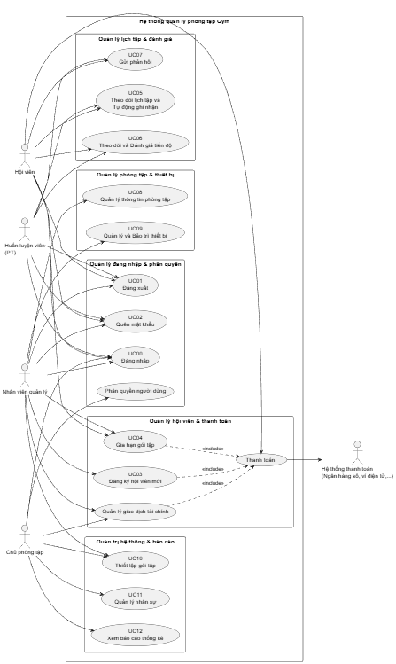
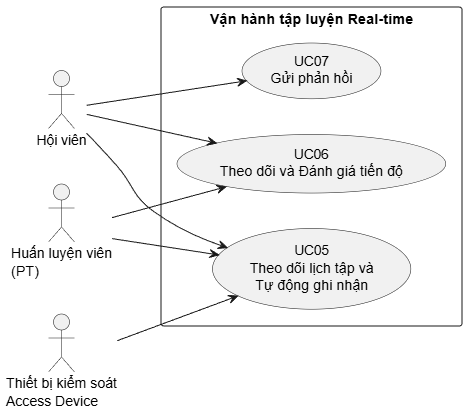
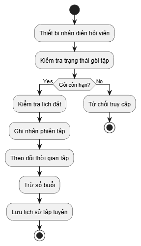

# Tài liệu Đặc tả Yêu cầu Phần mềm
## Hệ thống Quản lý Phòng tập Gym

**Phiên bản:** 1.0  
**Ngày:** 28 tháng 4 năm 2026  
**Trường:** Đại học Bách Khoa Hà Nội  

---

## Mục lục

### 1. [Giới thiệu](#1-giới-thiệu)
  - 1.1 [Mục đích](#11-mục-đích)
  - 1.2 [Phạm vi](#12-phạm-vi)
  - 1.3 [Từ điển thuật ngữ](#13-từ-điển-thuật-ngữ)
  - 1.4 [Tài liệu tham khảo](#14-tài-liệu-tham-khảo)

### 2. [Mô tả tổng quan](#2-mô-tả-tổng-quan)
  - 2.1 [Các tác nhân](#21-các-tác-nhân)
  - 2.2 [Biểu đồ Use Case Tổng quan](#22-biểu-đồ-use-case-tổng-quan)
  - 2.3 [Biểu đồ Use Case Phân rã](#23-biểu-đồ-use-case-phân-rã)
    - 2.3.1 [Phân rã Hệ thống & Tài khoản](#231-phân-rã-hệ-thống--tài-khoản)
    - 2.3.2 [Phân rã Quản lý Hội viên & Giao dịch](#232-phân-rã-quản-lý-hội-viên--giao-dịch)
    - 2.3.3 [Phân rã Vận hành tập luyện (Real-time)](#233-phân-rã-vận-hành-tập-luyện-real-time)
    - 2.3.4 [Phân rã Quản lý Cơ sở vật chất](#234-phân-rã-quản-lý-cơ-sở-vật-chất)
    - 2.3.5 [Phân rã Quản trị & Báo cáo](#235-phân-rã-quản-trị--báo-cáo)
  - 2.4 [Quy trình Nghiệp vụ](#24-quy-trình-nghiệp-vụ)
    - 2.4.1 [Quy trình Đăng ký Hội viên và Gia hạn (Tích hợp Thanh toán)](#241-quy-trình-đăng-ký-hội-viên-và-gia-hạn-tích-hợp-thanh-toán)
    - 2.4.2 [Quy trình Theo dõi Lịch tập và Tự động ghi nhận (Real-time)](#242-quy-trình-theo-dõi-lịch-tập-và-tự-động-ghi-nhận-real-time)
    - 2.4.3 [Quy trình Quản lý Thiết bị và Bảo trì (Tích hợp)](#243-quy-trình-quản-lý-thiết-bị-và-bảo-trì-tích-hợp)
    - 2.4.4 [Quy trình Quản lý Nhân sự và Đánh giá](#244-quy-trình-quản-lý-nhân-sự-và-đánh-giá)
    - 2.4.5 [Quy trình Tiếp nhận và Xử lý Phản hồi](#245-quy-trình-tiếp-nhận-và-xử-lý-phản-hồi)
    - 2.4.6 [Quy trình Quản lý Phân quyền và Nhóm người dùng](#246-quy-trình-quản-lý-phân-quyền-và-nhóm-người-dùng)
      - 2.4.6.1 [Quản lý nhóm cho người dùng](#2461-quản-lý-nhóm-cho-người-dùng)
      - 2.4.6.2 [Quản lý người dùng cho nhóm](#2462-quản-lý-người-dùng-cho-nhóm)
      - 2.4.6.3 [Quản lý chức năng cho nhóm](#2463-quản-lý-chức-năng-cho-nhóm)
    - 2.4.7 [Quy trình Báo cáo Thống kê](#247-quy-trình-báo-cáo-thống-kê)

### 3. [Đặc tả các chức năng](#3-đặc-tả-các-chức-năng)
  - 3.1 [UC00 - Đăng nhập](#31-đặc-tả-use-case-uc00---đăng-nhập)
  - 3.2 [UC01 - Đăng xuất](#32-đặc-tả-use-case-uc01---đăng-xuất)
  - 3.3 [UC02 - Quên mật khẩu](#33-đặc-tả-use-case-uc02---quên-mật-khẩu)
  - 3.4 [UC03 - Đăng ký hội viên mới](#34-đặc-tả-use-case-uc03---đăng-ký-hội-viên-mới)
  - 3.5 [UC04 - Gia hạn gói tập](#35-đặc-tả-use-case-uc04---gia-hạn-gói-tập)
  - 3.6 [UC05 - Theo dõi lịch tập và Tự động ghi nhận (Real-time)](#36-đặc-tả-use-case-uc05---theo-dõi-lịch-tập-và-tự-động-ghi-nhận-real-time)
  - 3.7 [UC06 - Theo dõi và Đánh giá tiến độ](#37-đặc-tả-use-case-uc06---theo-dõi-và-đánh-giá-tiến-độ)
  - 3.8 [UC07 - Gửi phản hồi](#38-đặc-tả-use-case-uc07---gửi-phản-hồi)
  - 3.9 [UC08 - Quản lý thông tin phòng tập](#39-đặc-tả-use-case-uc08---quản-lý-thông-tin-phòng-tập)
  - 3.10 [UC09 - Quản lý và Bảo trì thiết bị](#310-đặc-tả-use-case-uc09---quản-lý-và-bảo-trì-thiết-bị)
  - 3.11 [UC10 - Thiết lập gói tập](#311-đặc-tả-use-case-uc10---thiết-lập-gói-tập)
  - 3.12 [UC11 - Quản lý nhân sự](#312-đặc-tả-use-case-uc11---quản-lý-nhân-sự)
  - 3.13 [UC12 - Xem báo cáo thống kê](#313-đặc-tả-use-case-uc12---xem-báo-cáo-thống-kê)

### 4. [Các yêu cầu khác](#4-các-yêu-cầu-khác)
  - 4.1 [Chức năng (Functionality)](#41-chức-năng-functionality)
  - 4.2 [Tính dễ dùng (Usability)](#42-tính-dễ-dùng-usability)
  - 4.3 [Hiệu năng (Performance)](#43-hiệu-năng-performance)
  - 4.4 [Bảo mật (Security)](#44-bảo-mật-security)
  - 4.5 [Độ tin cậy (Reliability)](#45-độ-tin-cậy-reliability)
  - 4.6 [Khả năng mở rộng (Scalability)](#46-khả-năng-mở-rộng-scalability)
  - 4.7 [Khả năng bảo trì (Maintainability)](#47-khả-năng-bảo-trì-maintainability)
  - 4.8 [Sao lưu và Khôi phục (Backup & Disaster Recovery)](#48-sao-lưu-và-khôi-phục-backup--disaster-recovery)

---

# 1. Giới thiệu

## 1.1 Mục đích

Tài liệu này được xây dựng nhằm mô tả chi tiết các yêu cầu của **hệ thống quản lý phòng tập Gym**, bao gồm:
- Các chức năng chính
- Các đối tượng sử dụng
- Quy trình nghiệp vụ
- Các ràng buộc liên quan

Trong bối cảnh các phòng tập hiện nay ngày càng phát triển với quy mô lớn và số lượng hội viên tăng nhanh, việc quản lý thủ công hoặc sử dụng các công cụ rời rạc gây ra nhiều khó khăn như:
- Sai sót dữ liệu
- Khó theo dõi lịch sử tập luyện
- Thiếu tính đồng bộ

Vì vậy, việc xây dựng một **hệ thống phần mềm tập trung** là cần thiết.

Tài liệu này đóng vai trò là cầu nối giữa các bên liên quan (stakeholders) như chủ phòng tập, nhân viên vận hành và đội ngũ phát triển phần mềm, giúp đảm bảo việc hiểu đúng yêu cầu và triển khai hệ thống một cách hiệu quả.

## 1.2 Phạm vi

Hệ thống quản lý phòng tập Gym được xây dựng nhằm hỗ trợ quản lý toàn diện các hoạt động vận hành trong phòng tập, từ quản lý hội viên, nhân sự đến thiết bị và doanh thu.

### Cụ thể, hệ thống cho phép:

- Quản lý thiết bị tập luyện và tình trạng bảo trì
- Quản lý nhân sự và phân công công việc
- Quản lý thông tin phòng tập
- Tiếp nhận và xử lý phản hồi từ hội viên
- Quản lý thông tin cá nhân và tài khoản của hội viên
- Quản lý quá trình đăng ký, thiết lập, gia hạn gói tập của hội viên
- Theo dõi lịch sử tập luyện và mức độ tham gia của hội viên
- Quản lý các gói tập và quá trình đăng ký, thanh toán
- Thực hiện các báo cáo thống kê doanh thu, hiệu suất phục vụ quản lý

### Các nhóm người dùng chính:
- Chủ phòng tập
- Nhân viên quản lý
- Huấn luyện viên
- Hội viên

## 1.3 Từ điển thuật ngữ

| Thuật ngữ | Mô tả |
|-----------|--------|
| **Hội viên** | Người sử dụng dịch vụ |
| **Gói tập** | Dịch vụ tập luyện |
| **PT** | Huấn luyện viên |
| **Thiết bị** | Máy móc tập |
| **Gia hạn** | Tiếp tục gói tập |
| **Nhóm quyền** | Tập hợp các chức năng được phép thực hiện, dùng để phân quyền người dùng trong hệ thống (tương đương Role trong RBAC) |

## 1.4 Tài liệu tham khảo

Tài liệu được xây dựng dựa trên:
- Đề bài hệ thống quản lý phòng tập Gym trong môn Phát triển phần mềm theo chuẩn ITSS
- Các tài liệu mẫu SRS tiêu chuẩn
- Tham khảo các hệ thống quản lý gym thực tế

---

# 2. Mô tả tổng quan

## 2.1 Các tác nhân

### Tác nhân chính (Con người):

- **Hội viên:** Người sử dụng hệ thống để theo dõi gói tập, lịch tập và phản hồi dịch vụ
- **Huấn luyện viên (PT):** Người quản lý danh sách học viên, thiết lập giáo án và đánh giá tiến độ
- **Nhân viên quản lý:** Người thực hiện các nghiệp vụ hành chính như đăng ký hội viên, kiểm soát gói tập và xử lý phản hồi
- **Chủ phòng tập:** Người có quyền cao nhất, quản lý tổng thể hoạt động kinh doanh, nhân sự và xem báo cáo

### Tác nhân hệ thống:

- **Hệ thống Thanh toán:** Tương tác để xác nhận các giao dịch thanh toán trực tuyến (ngân hàng số, ví điện tử, v.v.)

---

## 2.2 Biểu đồ Use Case Tổng quan

Biểu đồ này phác thảo phạm vi của hệ thống và các tương tác giữa các tác nhân bên ngoài với các nhóm chức năng chính.

### Các tác nhân (Actors):
- **Tác nhân chính (Người dùng):** Hội viên, Nhân viên quản lý, Huấn luyện viên (PT), Chủ phòng tập
- **Tác nhân phụ (Hệ thống/Thiết bị):** Hệ thống thanh toán (ngân hàng số, ví điện tử, v.v.)

### Các nhóm chức năng chính trong hệ thống:
- **Quản lý đăng nhập & phân quyền:** Bao gồm các chức năng xác thực và kiểm soát truy cập
- **Quản lý hội viên & thanh toán:** Đăng ký, gia hạn và giao dịch tài chính
- **Quản lý lịch tập & đánh giá:** Lịch tập, theo dõi tiến độ và phản hồi
- **Quản lý phòng tập & thiết bị:** Quản lý phòng tập, thiết bị và bảo trì
- **Quản trị hệ thống & báo cáo:** Cấu hình hệ thống, quản lý nhân sự và xem báo cáo kinh doanh

Tệp nguồn diagram: [01_overview_usecase.puml](Diagram/src/01_overview_usecase.puml)

---

## 2.3 Biểu đồ Use Case Phân rã

### 2.3.1 Phân rã Hệ thống & Tài khoản

Nhóm này tập trung vào tính bảo mật và quyền truy cập của các tác nhân vào hệ thống.

**Các Use Case:**
- UC00 (Đăng nhập)
- UC01 (Đăng xuất)
- UC02 (Quên mật khẩu)

**Mối quan hệ:**
- UC00 (Đăng nhập) là điều kiện tiền quyết cho tất cả các chức năng khác

**Ghi chú:** Phân quyền người dùng được mô tả trong Quy trình 2.4.6, không tách thành một Use Case riêng trong phần 3.

Tệp nguồn diagram: [02_decomposition_account.puml](Diagram/src/02_decomposition_account.puml)

**Ghi chú:** Phân quyền người dùng được mô tả chi tiết trong Quy trình 2.4.6, không có Use Case riêng trong phần 3.

### 2.3.2 Phân rã Quản lý Hội viên & Giao dịch

Đây là nhóm chức năng cốt lõi tạo ra doanh thu cho phòng tập.

**Các Use Case:**
- UC03 (Đăng ký hội viên mới)
- UC04 (Gia hạn gói tập)

**Phân tích chi tiết:**
- Cả UC03 và UC04 đều đã tích hợp quy trình Thanh toán và Xuất biên lai làm luồng sự kiện chính
- Tương tác tác nhân: Nhân viên quản lý thực hiện tại quầy hoặc Hội viên tự thực hiện (đối với UC04 online)
- Hệ thống Thanh toán: Đóng vai trò là tác nhân hỗ trợ nhận lệnh và phản hồi kết quả giao dịch

Tệp nguồn diagram: [03_decomposition_membership_payment.puml](Diagram/src/03_decomposition_membership_payment.puml)

### 2.3.3 Phân rã Vận hành tập luyện (Real-time)

Nhóm này quản lý trải nghiệm hàng ngày của hội viên và huấn luyện viên.

**Các Use Case:**
- UC05 (Theo dõi lịch tập và Tự động ghi nhận)
- UC06 (Theo dõi và Đánh giá tiến độ)
- UC07 (Gửi phản hồi)

**Phân tích chi tiết:**
- UC05 hoạt động dựa trên cơ chế tự động ghi nhận theo thời gian thực thay vì check-in thủ công
- UC06 có sự tương tác chặt chẽ giữa PT (người nhập dữ liệu) và Hội viên (người theo dõi kết quả)
- UC07 cho phép Hội viên đánh giá nhân sự và cơ sở vật chất, dữ liệu này sẽ làm đầu vào cho UC11 (Quản lý nhân sự)

Tệp nguồn diagram: [04_decomposition_training_realtime.puml](Diagram/src/04_decomposition_training_realtime.puml)

### 2.3.4 Phân rã Quản lý Cơ sở vật chất

Đảm bảo phòng tập luôn trong trạng thái vận hành tốt.

**Các Use Case:**
- UC08 (Quản lý thông tin phòng tập)
- UC09 (Quản lý và Bảo trì thiết bị)

**Phân tích chi tiết:**
- UC09 là sự kết hợp giữa việc quản lý danh mục thiết bị và quy trình báo hỏng, sửa chữa
- Thiết bị kiểm soát (Access Device) tương tác trực tiếp với UC05 để cung cấp dữ liệu về sự hiện diện của hội viên

Tệp nguồn diagram: [05_decomposition_facility.puml](Diagram/src/05_decomposition_facility.puml)

### 2.3.5 Phân rã Quản trị & Báo cáo

Dành riêng cho tác nhân Chủ phòng tập để điều hành và đánh giá hiệu quả kinh doanh.

**Các Use Case:**
- UC10 (Thiết lập gói tập)
- UC11 (Quản lý nhân sự)
- UC12 (Xem báo cáo thống kê)

**Phân tích chi tiết:**
- UC11 quản lý thông tin nhân viên, phân quyền, và lịch làm việc, kết nối với các đánh giá từ UC07 để chấm điểm hiệu suất
- UC12 tổng hợp dữ liệu từ mọi giao dịch thành công tại UC03, UC04 cũng như dữ liệu từ UC05, UC06, UC07 để xuất báo cáo doanh thu, hiệu suất và thống kê nhân sự

Tệp nguồn diagram: [06_decomposition_admin_report.puml](Diagram/src/06_decomposition_admin_report.puml)

---

## 2.4 Quy trình Nghiệp vụ

### 2.4.1 Quy trình Đăng ký Hội viên và Gia hạn (Tích hợp Thanh toán)

Quy trình này áp dụng cho cả việc tạo mới hội viên và nâng cấp/gia hạn gói tập hiện có.

**Bước 1: Tiếp nhận yêu cầu**
- Hội viên cung cấp thông tin cá nhân (đối với đăng ký mới) hoặc mã hội viên (đối với gia hạn)
- Lựa chọn gói tập mong muốn (3 tháng, 6 tháng, VIP, v.v.)

**Bước 2: Kiểm tra và Khởi tạo**
- Hệ thống kiểm tra tính duy nhất của SĐT/Email (nếu đăng ký mới)
- Hoặc kiểm tra trạng thái gói tập cũ (nếu gia hạn)
- Nhân viên quản lý nhập/cập nhật dữ liệu vào hệ thống

**Bước 3: Thực hiện thanh toán**
- Hệ thống tính toán tổng tiền dựa trên đơn giá gói tập và các chương trình khuyến mãi hiện có
- Hội viên thực hiện thanh toán qua các phương thức:
  - Tiền mặt
  - Thẻ ngân hàng
  - Ví điện tử
- **Trường hợp lỗi:** Nếu giao dịch điện tử thất bại, hệ thống báo lỗi và cho phép chọn lại phương thức thanh toán hoặc hủy yêu cầu

**Bước 4: Kích hoạt và Hoàn tất**
- Hệ thống xác nhận thanh toán thành công
- Cập nhật ngày bắt đầu/kết thúc gói tập vào cơ sở dữ liệu
- Hệ thống tự động in biên lai
- Cấp/cập nhật quyền truy cập cho hội viên

Tệp nguồn diagram: [07_process_register_renew_payment.puml](Diagram/src/07_process_register_renew_payment.puml)

### 2.4.2 Quy trình Theo dõi Lịch tập và Tự động ghi nhận (Real-time)

Quy trình này thay thế cho việc check-in thủ công, dựa trên thời gian thực để quản lý sử dụng dịch vụ.

**Bước 1: Nhận diện sự hiện diện**
- Hội viên truy cập phòng tập
- Thiết bị kiểm soát gửi tín hiệu về hệ thống (không bắt buộc ghi nhận buổi tập ngay lập tức tại cổng)

**Bước 2: Xác thực trạng thái**
- Hệ thống tự động kiểm tra thời hạn gói tập
- Kiểm tra lịch đặt chỗ của hội viên trong thời gian thực

**Bước 3: Ghi nhận tự động**
- Hệ thống dựa trên thời gian hoạt động thực tế hoặc lịch hẹn của hội viên với PT
- Tự động ghi nhận một buổi tập đã thực hiện
- Số buổi tập còn lại sẽ được hệ thống tự động trừ đi sau khi phiên tập kết thúc hoặc theo cấu hình thời gian thực tế của gói tập

**Bước 4: Cập nhật lịch sử**
- Thông tin buổi tập được lưu vào lịch sử sử dụng dịch vụ
- Hội viên và nhân viên có thể theo dõi bất cứ lúc nào

Tệp nguồn diagram: [08_process_realtime_training.puml](Diagram/src/08_process_realtime_training.puml)

### 2.4.3 Quy trình Quản lý Thiết bị và Bảo trì (Tích hợp)

Đảm bảo quản lý vòng đời thiết bị từ khi nhập về đến khi thanh lý.

**Bước 1: Quản lý danh mục**
- Nhân viên quản lý cập nhật thông tin thiết bị mới (mã, tên, ngày nhập, bảo hành)
- Cập nhật thông tin thiết bị hiện có vào danh sách quản lý

**Bước 2: Báo cáo sự cố**
- Khi phát hiện lỗi (qua kiểm tra định kỳ hoặc phản hồi của hội viên)
- Nhân viên ghi nhận mô tả lỗi trên hệ thống

**Bước 3: Chuyển trạng thái bảo trì**
- Hệ thống cập nhật trạng thái thiết bị thành "Đang sửa chữa"
- Thông báo cho bộ phận kỹ thuật

**Bước 4: Xử lý sửa chữa**
- **Thành công:** Kỹ thuật viên sửa xong, cập nhật trạng thái về "Hoạt động bình thường"
- **Thất bại:** Nếu thiết bị không thể sửa, hệ thống sẽ thực hiện quy trình thanh lý và chuyển trạng thái sang "Ngừng hoạt động"

Tệp nguồn diagram: [09_process_equipment_maintenance.puml](Diagram/src/09_process_equipment_maintenance.puml)

### 2.4.4 Quy trình Quản lý Nhân sự và Đánh giá

**Bước 1: Thiết lập nhân sự**
- Chủ phòng tập tạo hồ sơ nhân viên
- Phân nhóm quyền (PT, Sales, Quản lý)
- Thiết lập lịch làm việc

**Bước 2: Theo dõi hiệu suất**
- Hệ thống tự động thu thập dữ liệu từ:
  - Số buổi hướng dẫn thực tế của PT
  - Các phản hồi từ hội viên

**Bước 3: Đánh giá**
- Định kỳ, chủ phòng tập truy xuất báo cáo hiệu suất
- Đánh giá mức độ hoàn thành công việc của từng nhân viên

Tệp nguồn diagram: [10_process_hr_evaluation.puml](Diagram/src/10_process_hr_evaluation.puml)

### 2.4.5 Quy trình Tiếp nhận và Xử lý Phản hồi

**Bước 1: Gửi phản hồi**
- Hội viên gửi đánh giá về chất lượng thiết bị, nhân viên hoặc dịch vụ qua ứng dụng

**Bước 2: Tiếp nhận và Phân loại**
- Nhân viên quản lý tiếp nhận phản hồi
- Phân loại mức độ nghiêm trọng
- Chuyển đến bộ phận liên quan

**Bước 3: Xử lý và Phản hồi lại**
- Sau khi xử lý (ví dụ: sửa máy, nhắc nhở nhân viên)
- Quản lý cập nhật kết quả lên hệ thống
- Hội viên nhận được thông báo phản hồi

Tệp nguồn diagram: [11_process_feedback.puml](Diagram/src/11_process_feedback.puml)

### 2.4.6 Quy trình Quản lý Phân quyền và Nhóm người dùng

Quy trình này đảm bảo tính bảo mật và đúng vai trò trong hệ thống.

#### 2.4.6.1 Quản lý nhóm cho người dùng

**Mô tả:** Gán một người dùng cụ thể vào một hoặc nhiều nhóm quyền nhất định

**Thực hiện:**
1. Chủ phòng tập chọn tài khoản người dùng
2. Chọn danh sách các nhóm hiện có (ví dụ: Nhóm Admin, Nhóm Sales)
3. Nhấn "Gán nhóm" để áp dụng quyền hạn của nhóm đó cho người dùng

#### 2.4.6.2 Quản lý người dùng cho nhóm

**Mô tả:** Quản lý danh sách các thành viên thuộc về một nhóm quyền cụ thể

**Thực hiện:**
1. Chủ phòng tập chọn một Nhóm cụ thể
2. Hệ thống hiển thị danh sách thành viên hiện tại
3. Chủ phòng tập thực hiện:
   - "Thêm thành viên" (bằng cách tìm mã nhân viên)
   - "Loại bỏ" thành viên ra khỏi nhóm

#### 2.4.6.3 Quản lý chức năng cho nhóm

**Mô tả:** Thiết lập các quyền hạn (chức năng) mà một nhóm cụ thể được phép thực hiện trên phần mềm

**Thực hiện:**
1. Chủ phòng tập chọn Nhóm cần cấu hình
2. Hệ thống hiển thị danh mục các tính năng của phần mềm (Xem doanh thu, Xóa thiết bị, Đăng ký hội viên, v.v.)
3. Chủ phòng tập tích chọn hoặc bỏ tích các quyền tương ứng
4. Nhấn "Lưu" để hệ thống cập nhật quyền hạn cho toàn bộ thành viên trong nhóm đó ngay lập tức

Tệp nguồn diagram: [12_process_permission_management.puml](Diagram/src/12_process_permission_management.puml)

### 2.4.7 Quy trình Báo cáo Thống kê

**Bước 1: Lựa chọn tham số**
- Chủ phòng tập chọn loại báo cáo:
  - Doanh thu
  - Đăng ký mới
  - Tỷ lệ gia hạn
- Chọn khoảng thời gian cần xem

**Bước 2: Tổng hợp dữ liệu**
- Hệ thống tự động truy xuất dữ liệu từ:
  - Các giao dịch thanh toán
  - Lịch sử tập luyện đã được ghi nhận

**Bước 3: Hiển thị báo cáo**
- Hệ thống xuất kết quả dưới dạng:
  - Biểu đồ
  - Bảng biểu số liệu chi tiết
- Phục vụ việc ra quyết định kinh doanh

Tệp nguồn diagram: [13_process_statistics_report.puml](Diagram/src/13_process_statistics_report.puml)

---

# 3. Đặc tả các chức năng

**Ghi chú quan trọng:** 
- **Phân quyền người dùng** được mô tả thông qua **Quy trình 2.4.6**, không có Use Case riêng trong phần này
- **UC03 (trong phần 3)** là "Đăng ký hội viên mới" - được mô tả chi tiết ở 3.4
- Tất cả tài liệu tham khảo đến "hộ gia đình" đã được cập nhật thành "hội viên" để phù hợp với nội dung thực tế của hệ thống

---

## 3.1 Đặc tả Use Case UC00 - Đăng nhập

| Thông tin | Chi tiết |
|-----------|---------|
| **Mã Use case** | UC00 |
| **Tên Use case** | Đăng nhập |
| **Tác nhân** | Hội viên, Nhân viên quản lý, Huấn luyện viên, Chủ phòng tập |
| **Tiền điều kiện** | Người dùng đã có tài khoản trên hệ thống |

### Luồng sự kiện chính (Thành công)

| STT | Thực hiện bởi | Hành động |
|-----|--------------|----------|
| 1 | Hội viên, Nhân viên quản lý, Huấn luyện viên, Chủ phòng tập | Chọn chức năng Đăng nhập |
| 2 | Hệ thống | Hiển thị giao diện đăng nhập |
| 3 | Hội viên, Nhân viên quản lý, Huấn luyện viên, Chủ phòng tập | Nhập email và mật khẩu |
| 4 | Khách | Yêu cầu đăng nhập |
| 5 | Hệ thống | Hệ thống xác thực thông tin đăng nhập |
| 6 | Hệ thống | Hệ thống xác định Nhóm quyền của người dùng (Group) và tải danh sách chức năng được phép |
| 7 | Hệ thống | Hệ thống chuyển hướng người dùng đến trang chức năng tương ứng |

### Luồng sự kiện thay thế

| STT | Thực hiện bởi | Hành động |
|-----|--------------|----------|
| 5a | Hệ thống | Thông báo lỗi: Cần nhập các trường bắt buộc nhập nếu khách nhập thiếu |
| 5b | Hệ thống | Thông báo lỗi: Email và/hoặc mật khẩu chưa đúng nếu không tìm thấy email và mật khẩu trong hệ thống |
| 5c | Hệ thống | Thông báo lỗi: Tài khoản bị khoá, nếu email/mật khẩu đúng như tài khoản đang bị admin khoá |
| 5d | Hệ thống | Gọi use case UC02 "Quên mật khẩu" nếu người dùng quên mật khẩu và ấn nút quên mật khẩu |
| 5e | Hệ thống | Gửi email cho phép đổi mật khẩu đến tài khoản mail của người dùng |

### Dữ liệu đầu vào

| STT | Trường dữ liệu | Mô tả | Bắt buộc? | Điều kiện hợp lệ | Ví dụ |
|-----|----------------|--------|-----------|-------------------|--------|
| 1 | Email | Địa chỉ email | Có | Format: `^[a-zA-Z0-9._%+-]+@[a-zA-Z0-9.-]+\.[a-zA-Z]{2,}$` (RFC 5322), độ dài ≤ 255 ký tự | h.anh@gmail.com |
| 2 | Mật khẩu | Mật khẩu đăng nhập | Có | Độ dài ≥ 8 ký tự, chứa ít nhất 1 chữ hoa, 1 chữ thường, 1 số, 1 ký tự đặc biệt (!@#$%^&*) | ToiLa12#$ |

### Hậu điều kiện
Người dùng truy cập được vào các tính năng thuộc quyền hạn của mình. Phiên đăng nhập được ghi lại với timestamp và IP address.

---

## 3.2 Đặc tả Use Case UC01 - Đăng xuất

| Thông tin | Chi tiết |
|-----------|---------|
| **Mã Use case** | UC01 |
| **Tên Use case** | Đăng xuất |
| **Tác nhân** | Tất cả người dùng |
| **Tiền điều kiện** | Người dùng đang ở trạng thái đăng nhập |

### Luồng sự kiện chính (Thành công)

| STT | Thực hiện bởi | Hành động |
|-----|--------------|----------|
| 1 | Người dùng | Ấn vào tùy chọn đăng xuất |
| 2 | Hệ thống | Hủy phiên làm việc và quay về trang đăng nhập |

### Luồng sự kiện thay thế
Không có

### Hậu điều kiện
Người dùng không thể thực hiện các thao tác trong hệ thống cho đến khi đăng nhập lại.

---

## 3.3 Đặc tả Use Case UC02 - Quên mật khẩu

| Thông tin | Chi tiết |
|-----------|---------|
| **Mã Use case** | UC02 |
| **Tên Use case** | Quên mật khẩu |
| **Tác nhân** | Hội viên, Nhân viên quản lý, Huấn luyện viên, Chủ phòng tập |
| **Tiền điều kiện** | Người dùng đã có tài khoản trên hệ thống và đã cung cấp thông tin liên hệ (Email hoặc Số điện thoại) chính xác khi đăng ký |

### Luồng sự kiện chính (Thành công)

| STT | Thực hiện bởi | Hành động |
|-----|--------------|----------|
| 1 | Người dùng | Tại màn hình Đăng nhập, người dùng chọn chức năng "Quên mật khẩu" |
| 2 | Hệ thống | Hiển thị giao diện yêu cầu nhập Email hoặc Số điện thoại đã đăng ký |
| 3 | Người dùng | Nhập các thông tin cá nhân |
| 4 | Khách | Nhập thông tin và nhấn "Gửi yêu cầu" |
| 5 | Hệ thống | Kiểm tra tính tồn tại của thông tin trong cơ sở dữ liệu |
| 6 | Hệ thống | Gửi một mã xác thực (OTP) hoặc đường dẫn thiết lập lại mật khẩu qua Email/SĐT của người dùng |
| 7 | Người dùng | Nhập mã xác thực và mật khẩu mới vào hệ thống |
| 8 | Hệ thống | Kiểm tra tính hợp lệ của mã và cập nhật mật khẩu mới vào cơ sở dữ liệu |
| 9 | Hệ thống | Thông báo thành công và điều hướng người dùng quay lại trang Đăng nhập |

### Luồng sự kiện thay thế

| STT | Thực hiện bởi | Hành động |
|-----|--------------|----------|
| 5a | Hệ thống | Nếu Email hoặc SĐT chưa được đăng ký, hệ thống báo lỗi "Thông tin không khớp với bất kỳ tài khoản nào" và yêu cầu nhập lại |
| 8a | Hệ thống | Mã xác thực sai hoặc hết hạn: Hệ thống báo lỗi và cho phép người dùng yêu cầu gửi lại mã mới |

### Dữ liệu đầu vào

| STT | Trường dữ liệu | Mô tả | Bắt buộc? | Điều kiện hợp lệ | Ví dụ |
|-----|----------------|--------|-----------|-------------------|--------|
| 1 | Email/SĐT | Email hoặc Số điện thoại | Có | Email: `^[a-zA-Z0-9._%+-]+@[a-zA-Z0-9.-]+\.[a-zA-Z]{2,}$`; SĐT: `^\d{10}$` | h.anh@gmail.com / 0987654321 |
| 2 | Mật khẩu mới | Mật khẩu mới | Có | Độ dài ≥ 8 ký tự, chứa ≥1 chữ hoa, ≥1 chữ thường, ≥1 số, ≥1 ký tự đặc biệt | NewPass123!@# |

### Hậu điều kiện
Mật khẩu của người dùng được cập nhật thành công và mã OTP được vô hiệu hóa; người dùng có thể sử dụng mật khẩu mới để đăng nhập. Sự kiện thay đổi mật khẩu được ghi log.

---

## 3.4 Đặc tả Use Case UC03 - Đăng ký hội viên mới

| Thông tin | Chi tiết |
|-----------|---------|
| **Mã Use case** | UC03 |
| **Tên Use case** | Đăng ký hội viên mới |
| **Tác nhân** | Nhân viên quản lý (Chính), Hệ thống thanh toán (Phụ) |
| **Tiền điều kiện** | Nhân viên đã đăng nhập |

### Luồng sự kiện chính (Thành công)

| STT | Thực hiện bởi | Hành động |
|-----|--------------|----------|
| 1 | Nhân viên | Nhập thông tin cá nhân của khách hàng (Họ tên, SĐT, Email, Vân tay) |
| 2 | Hệ thống | Kiểm tra tính duy nhất của SĐT và Email; xác nhận không trùng lặp trong hệ thống |
| 3 | Nhân viên | Chọn gói tập theo yêu cầu của khách |
| 4 | Hệ thống | Tính toán tổng tiền dựa trên đơn giá gói tập và hiển thị cho nhân viên xác nhận |
| 5 | Nhân viên | Thu tiền mặt hoặc khởi tạo giao dịch thanh toán điện tử (thẻ ngân hàng/ví điện tử) |
| 6 | Hệ thống thanh toán | Xác nhận giao dịch thanh toán thành công |
| 7 | Hệ thống | Tạo mã hội viên, lưu hồ sơ, gửi email xác nhận đến hội viên và in biên lai |

### Luồng sự kiện thay thế

| STT | Thực hiện bởi | Hành động |
|-----|--------------|----------|
| 2a | Hệ thống | SĐT hoặc Email đã tồn tại trong hệ thống; hệ thống báo lỗi và yêu cầu nhân viên kiểm tra lại thông tin hoặc tra cứu hội viên đã có |
| 6a | Hệ thống thanh toán | Giao dịch thanh toán thất bại; hệ thống báo lỗi, giữ trạng thái hồ sơ nháp và cho phép chọn lại phương thức thanh toán hoặc hủy yêu cầu |

### Dữ liệu đầu vào

| STT | Trường dữ liệu | Mô tả | Bắt buộc? | Điều kiện hợp lệ | Ví dụ |
|-----|----------------|--------|-----------|-------------------|--------|
| 1 | Họ | Họ hội viên | Có | Độ dài: 2-50 ký tự, chỉ chứa chữ cái và khoảng trắng | Lê Thành |
| 2 | Tên | Tên hội viên | Có | Độ dài: 2-50 ký tự, chỉ chứa chữ cái và khoảng trắng | An |
| 3 | Mật khẩu | Mật khẩu | Có | Độ dài ≥ 8, ≥1 chữ hoa, ≥1 chữ thường, ≥1 số, ≥1 ký tự đặc biệt | Gym123!@ |
| 4 | Quê quán | Địa chỉ quê | Không | Độ dài: 0-100 ký tự | Bắc Ninh |
| 5 | Mã gói tập | Mã gói tập | Có | Phải tồn tại trong bảng Package và đang hoạt động | PKG001 |
| 6 | Ngày sinh | Ngày sinh | Có | Format: YYYY-MM-DD, tuổi ≥ 16 | 2005-06-15 |
| 7 | Số điện thoại | Số điện thoại | Có | Format: `^\d{10}$` (10 chữ số Việt Nam) | 0987654321 |
| 8 | Email | Email | Có | Format: `^[a-zA-Z0-9._%+-]+@[a-zA-Z0-9.-]+\.[a-zA-Z]{2,}$`, duy nhất trong hệ thống | user@email.com |
| 9 | Vân tay | Dữ liệu vân tay | Có | Format: fingerprint template (256 bytes), duy nhất trong hệ thống | [binary data] |

### Hậu điều kiện
Tài khoản hội viên mới được kích hoạt. Mã hội viên được tạo tự động. Email xác nhận được gửi đến địa chỉ email của hội viên. Biên lai được in và lưu trong hệ thống.

---

## 3.5 Đặc tả Use Case UC04 - Gia hạn gói tập

| Thông tin | Chi tiết |
|-----------|---------|
| **Mã Use case** | UC04 |
| **Tên Use case** | Gia hạn gói tập |
| **Tác nhân** | Hội viên (Online), Nhân viên quản lý (Tại quầy), Hệ thống thanh toán |
| **Tiền điều kiện** | Hội viên đã đăng nhập vào hệ thống |

### Luồng sự kiện chính (Thành công)

| STT | Thực hiện bởi | Hành động |
|-----|--------------|----------|
| 1 | Hội viên | Chọn gói tập cần gia hạn hoặc nâng cấp |
| 2 | Hội viên | Thực hiện quy trình thanh toán |
| 3 | Hệ thống thanh toán | Xác nhận giao dịch thanh toán thành công |
| 4 | Hệ thống | Cập nhật thời gian hết hạn mới theo quy tắc: (a) Gói cũ còn hiệu lực → ngày bắt đầu gói mới = ngày hết hạn cũ (gia hạn nối tiếp); (b) Gói cũ đã hết hạn → ngày bắt đầu gói mới = ngày thanh toán. Cộng số buổi tập theo gói mới vào tài khoản |

### Luồng sự kiện thay thế

| STT | Thực hiện bởi | Hành động |
|-----|--------------|----------|
| 3a | Hệ thống thanh toán | Giao dịch thanh toán thất bại |
| 4a | Hệ thống | Thông báo thanh toán không thành công và yêu cầu người dùng chọn lại phương thức hoặc hủy yêu cầu |

### Hậu điều kiện
Thời hạn sử dụng dịch vụ của hội viên được cập nhật: nếu gói cũ còn hiệu lực thì gia hạn nối tiếp từ ngày hết hạn cũ; nếu gói cũ đã hết hạn thì tính từ ngày thanh toán. Số buổi tập được cộng thêm vào tài khoản. Email xác nhận gia hạn được gửi đến hội viên. Biên lai được in và lưu trong hệ thống.

---

## 3.6 Đặc tả Use Case UC05 - Theo dõi lịch tập và Tự động ghi nhận (Real-time)

| Thông tin | Chi tiết |
|-----------|---------|
| **Mã Use case** | UC05 |
| **Tên Use case** | Theo dõi lịch tập và Tự động ghi nhận |
| **Tác nhân** | Hội viên, Huấn luyện viên |
| **Tiền điều kiện** | Hội viên có gói tập đang hoạt động |

### Luồng sự kiện chính (Thành công)

| STT | Thực hiện bởi | Hành động |
|-----|--------------|----------|
| 1 | Hệ thống | Tự động tính toán số buổi tập còn lại dựa trên thời gian thực của gói tập hoặc lịch hẹn đã lên |
| 2 | Hội viên và PT | Xem lịch tập và trạng thái gói tập hiện tại trên ứng dụng |
| 3 | Hệ thống | Tự động trừ buổi hoặc ghi nhận lịch sử khi thời gian tập bắt đầu/kết thúc mà không cần Check-in |

### Luồng sự kiện thay thế

| STT | Thực hiện bởi | Hành động |
|-----|--------------|----------|
| 1a | Hệ thống | Hội viên chưa có lịch tập nào được đặt trong hôm nay; hệ thống hiển thị "Không có lịch tập hôm nay" |
| 2a | Hệ thống | Gói tập đã hết hạn; hệ thống từ chối truy cập và gợi ý gia hạn gói tập |
| 2b | Hệ thống | Số buổi tập đã hết; hệ thống thông báo và yêu cầu gia hạn gói trước khi tiếp tục |
| 3a | Hệ thống | Lỗi kết nối mạng trong quá trình ghi nhận; hệ thống lưu vào queue và tự động ghi nhận khi kết nối phục hồi |
| 3b | Hệ thống | Thiết bị kiểm soát không nhận diện được hội viên; yêu cầu check-in thủ công hoặc quét mã QR |

### Hậu điều kiện
Dữ liệu sử dụng dịch vụ luôn được cập nhật chính xác theo thời gian thực. Lịch sử tập luyện được ghi nhận với thời gian bắt đầu/kết thúc. Thông báo được gửi cho hội viên khi phiên tập kết thúc.

---

## 3.7 Đặc tả Use Case UC06 - Theo dõi và Đánh giá tiến độ

| Thông tin | Chi tiết |
|-----------|---------|
| **Mã Use case** | UC06 |
| **Tên Use case** | Theo dõi tiến độ |
| **Tác nhân** | Huấn luyện viên, Hội viên |
| **Tiền điều kiện** | Hội viên đang trong quá trình tập luyện |

### Luồng sự kiện chính (Thành công)

| STT | Thực hiện bởi | Hành động |
|-----|--------------|----------|
| 1 | Huấn luyện viên | Chọn chức năng "Quản lý tiến độ" và chọn Hội viên cụ thể |
| 2 | Hệ thống | Hiển thị biểu mẫu nhập chỉ số sức khỏe (Cân nặng, BMI, mục tiêu...) |
| 3 | Huấn luyện viên | Nhập các thông số thực tế và đánh giá chuyên môn |
| 4 | Hệ thống | Lưu dữ liệu và tự động cập nhật vào biểu đồ tiến độ của Hội viên |
| 5 | Hội viên | Đăng nhập ứng dụng và xem kết quả đánh giá |

### Luồng sự kiện thay thế

| STT | Thực hiện bởi | Hành động |
|-----|--------------|----------|
| 1a | Huấn luyện viên | PT không thể tìm thấy Hội viên trong danh sách; yêu cầu kiểm tra mã hội viên |
| 3a | Huấn luyện viên | Dữ liệu mới bị trùng lặp với bản ghi trước; hệ thống cảnh báo và cho phép chỉnh sửa |
| 4a | Hệ thống | Phát hiện dữ liệu nhập không hợp lệ (ví dụ: số âm, giá trị vượt ngưỡng); thông báo yêu cầu nhập lại |
| 4b | Hệ thống | Lỗi lưu dữ liệu vào cơ sở dữ liệu; gợi ý thử lại hoặc liên hệ quản trị viên |
| 5a | Hội viên | Hội viên chưa đăng nhập; yêu cầu đăng nhập để xem kết quả đánh giá |

### Hậu điều kiện
Kết quả tập luyện được số hóa và lưu vào lịch sử tiến độ của hội viên. Biểu đồ tiến độ được cập nhật tự động. Thông báo được gửi cho hội viên về kết quả đánh giá.

---

## 3.8 Đặc tả Use Case UC07 - Gửi phản hồi

| Thông tin | Chi tiết |
|-----------|---------|
| **Mã Use case** | UC07 |
| **Tên Use case** | Gửi phản hồi |
| **Tác nhân** | Hội viên (Online), Nhân viên quản lý (Tại quầy) |
| **Tiền điều kiện** | Hội viên đã đăng nhập vào hệ thống |

### Luồng sự kiện chính (Thành công)

| STT | Thực hiện bởi | Hành động |
|-----|--------------|----------|
| 1 | Hội viên | Chọn chức năng "Gửi phản hồi" trên ứng dụng |
| 2 | Hệ thống | Hiển thị form gồm: Loại phản hồi (Nhân sự, Thiết bị, Dịch vụ) và Nội dung |
| 3 | Hội viên | Chọn loại phản hồi, nhập nội dung chi tiết và nhấn "Gửi" |
| 4 | Hệ thống | Lưu phản hồi vào cơ sở dữ liệu và gửi thông báo cho Quản lý/Chủ phòng tập |

### Luồng sự kiện thay thế

| STT | Thực hiện bởi | Hành động |
|-----|--------------|----------|
| 3a | Hội viên | Để trống nội dung phản hồi; Hệ thống yêu cầu điền đầy đủ trước khi gửi |
| 3b | Hệ thống | Gửi thông báo lỗi và yêu cầu người dùng nhập lại |

### Hậu điều kiện
Phản hồi được ghi nhận và chuyển tới bộ phận liên quan. Hội viên nhận được thông báo xác nhận. Ticket phản hồi được tạo và gán cho bộ phận xử lý. Thời hạn xử lý được tính dựa trên mức độ nghiêm trọng.

---

## 3.9 Đặc tả Use Case UC08 - Quản lý thông tin phòng tập

| Thông tin | Chi tiết |
|-----------|---------|
| **Mã Use case** | UC08 |
| **Tên Use case** | Quản lý thông tin phòng tập |
| **Tác nhân** | Nhân viên quản lý, Chủ phòng tập |
| **Tiền điều kiện** | Nhân viên quản lý hoặc Chủ phòng tập đã đăng nhập |

### Luồng sự kiện chính (Thành công)

| STT | Thực hiện bởi | Hành động |
|-----|--------------|----------|
| 1 | Nhân viên quản lý | Chọn chức năng "Quản lý phòng tập" |
| 2 | Hệ thống | Hiển thị danh sách các phòng hiện có (Gym, Yoga, Fitness...) |
| 3 | Nhân viên quản lý | Nhấn "Thêm mới" và nhập thông tin phòng (Mã phòng, Tên phòng, Sức chứa tối đa, Mô tả) hoặc chọn phòng hiện có để chỉnh sửa thông tin |
| 4 | Hệ thống | Kiểm tra tính duy nhất của mã phòng và lưu thay đổi vào hệ thống |

### Luồng sự kiện thay thế

| STT | Thực hiện bởi | Hành động |
|-----|--------------|----------|
| 2a | Nhân viên quản lý | Danh sách phòng tập trống (lần đầu sử dụng); hệ thống hướng dẫn tạo phòng mới |
| 3b | Nhân viên quản lý | Thay vì thêm mới, nhân viên chọn phòng hiện có để cập nhật thông tin (sức chứa, mô tả); hệ thống xác nhận thay đổi |
| 3c | Nhân viên quản lý | Thay vì thêm mới, nhân viên chọn phòng để xóa; hệ thống yêu cầu xác nhận nếu phòng có thiết bị đang gán |
| 4a | Hệ thống | Phát hiện mã phòng tập đã tồn tại; thông báo lỗi và yêu cầu đổi mã |

### Hậu điều kiện
Danh sách phòng tập được cập nhật. Phòng tập mới có thể được sử dụng để gán thiết bị hoặc lịch PT. Thông báo được gửi cho nhân viên về thay đổi.

---

## 3.10 Đặc tả Use Case UC09 - Quản lý và Bảo trì thiết bị

| Thông tin | Chi tiết |
|-----------|---------|
| **Mã Use case** | UC09 |
| **Tên Use case** | Quản lý và Bảo trì thiết bị |
| **Tác nhân** | Nhân viên, Chủ phòng tập |
| **Tiền điều kiện** | Nhân viên quản lý hoặc Chủ phòng tập đã đăng nhập |

### Luồng sự kiện chính (Thành công)

| STT | Thực hiện bởi | Hành động |
|-----|--------------|----------|
| 1 | Nhân viên quản lý | Chọn chức năng "Quản lý thiết bị" trên giao diện hệ thống |
| 2 | Hệ thống | Hiển thị danh sách thiết bị hiện có kèm các thông số: Mã, Tên, Ngày nhập, Bảo hành và Trạng thái (Hoạt động/Hỏng/Đang sửa) |
| 3 | Nhân viên quản lý | Chọn một thiết bị cụ thể để cập nhật thông tin hoặc nhấn "Thêm mới" để nhập thiết bị mới về kho |
| 4 | Nhân viên quản lý | Trường hợp phát hiện hỏng hóc: Nhập mô tả lỗi và chuyển trạng thái thiết bị sang "Đang sửa chữa" |
| 5 | Hệ thống | Ghi nhận thay đổi, lưu lịch sử sửa chữa và gửi thông báo cho bộ phận kỹ thuật |
| 6 | Bộ phận kỹ thuật | Thực hiện sửa chữa thiết bị thực tế và cập nhật kết quả lên hệ thống |
| 7 | Hệ thống | Chuyển trạng thái thiết bị trở lại "Hoạt động bình thường" và cập nhật ngày bảo trì gần nhất |

### Luồng sự kiện thay thế

| STT | Thực hiện bởi | Hành động |
|-----|--------------|----------|
| 2a | Hệ thống | Danh sách thiết bị trống; hệ thống hướng dẫn thêm thiết bị mới |
| 3a | Nhân viên quản lý | Nhập thiếu thông tin bắt buộc hoặc định dạng ngày bảo hành sai; Hệ thống báo lỗi và yêu cầu chỉnh sửa |
| 3b | Nhân viên quản lý | Tìm thiết bị bằng mã hoặc tên; hệ thống hiển thị kết quả tìm kiếm |
| 4a | Nhân viên quản lý | Xóa thiết bị khỏi hệ thống (nếu máy đã cũ hoặc thanh lý); Hệ thống yêu cầu xác nhận trước khi xóa vĩnh viễn dữ liệu |
| 5a | Hệ thống | Thông báo không thể gửi đến bộ phận kỹ thuật; hệ thống ghi nhận và tái thử gửi lại |
| 6a | Bộ phận kỹ thuật | Thiết bị không thể sửa chữa; báo cáo để thanh lý và cập nhật trạng thái "Ngừng hoạt động" |
| 7a | Hệ thống | Tự động chuyển thiết bị sang danh mục "Ngừng hoạt động" và loại bỏ khỏi các lịch đặt chỗ (nếu có) |

### Hậu điều kiện
Danh sách thiết bị được cập nhật. Trạng thái thiết bị được thay đổi. Lịch sử bảo trì được ghi nhận. Các bộ phận liên quan nhận được thông báo về thay đổi trạng thái thiết bị. Báo cáo bảo trì được tạo tự động.

---

## 3.11 Đặc tả Use Case UC10 - Thiết lập gói tập

| Thông tin | Chi tiết |
|-----------|---------|
| **Mã Use case** | UC10 |
| **Tên Use case** | Thiết lập gói tập |
| **Tác nhân** | Nhân viên quản lý, Chủ phòng tập |
| **Tiền điều kiện** | Chủ phòng tập hoặc Nhân viên quản lý đã đăng nhập |

### Luồng sự kiện chính (Thành công)

| STT | Thực hiện bởi | Hành động |
|-----|--------------|----------|
| 1 | Chủ phòng tập | Chọn chức năng "Cấu hình gói tập" |
| 2 | Hệ thống | Hiển thị biểu mẫu: Tên gói, Thời hạn, Số buổi, Đơn giá, Quyền lợi |
| 3 | Chủ phòng tập | Nhập các thông số gói tập mới và nhấn "Lưu" |
| 4 | Hệ thống | Lưu thông tin và hiển thị gói tập này trên giao diện đăng ký của nhân viên |

### Luồng sự kiện thay thế

| STT | Thực hiện bởi | Hành động |
|-----|--------------|----------|
| 2a | Hệ thống | Danh sách gói tập trống; hệ thống hướng dẫn tạo gói tập mới |
| 3a | Hệ thống | Phát hiện tên gói tập đã tồn tại; yêu cầu chủ phòng tập đổi tên khác |
| 3b | Chủ phòng tập | Cập nhật thông tin gói tập hiện có (giá cả, số buổi, quyền lợi); hệ thống xác nhận thay đổi |
| 3c | Chủ phòng tập | Vô hiệu hóa gói tập cũ không còn sử dụng; hệ thống giữ dữ liệu nhưng ẩn khỏi danh sách |
| 4a | Hệ thống | Nhập giá tiền âm hoặc số buổi không hợp lệ; báo lỗi và yêu cầu nhập lại |

### Hậu điều kiện
Gói tập mới được lưu trong hệ thống. Gói tập được hiển thị trong danh sách đăng ký cho nhân viên. Nhân viên có thể sử dụng gói tập này để đăng ký hội viên.

---

## 3.12 Đặc tả Use Case UC11 - Quản lý nhân sự

| Thông tin | Chi tiết |
|-----------|----------|
| **Mã Use case** | UC11 |
| **Tên Use case** | Quản lý nhân sự |
| **Tác nhân** | Chủ phòng tập |
| **Tiền điều kiện** | Chủ phòng tập đã đăng nhập |

### Luồng sự kiện chính (Thành công)

| STT | Thực hiện bởi | Hành động |
|-----|--------------|----------|
| 1 | Chủ phòng tập | Chọn chức năng "Quản lý nhân sự" |
| 2 | Hệ thống | Hiển thị danh sách nhân viên hiện tại |
| 3 | Chủ phòng tập | Chọn nhân viên để xem chi tiết hoặc nhấn "Thêm mới" |
| 4 | Chủ phòng tập | Nhập thông tin nhân viên (Họ tên, email, số điện thoại, chức vụ) |
| 5 | Chủ phòng tập | Phân nhóm quyền (PT, Sales, Quản lý) |
| 6 | Chủ phòng tập | Thiết lập lịch làm việc (ca sáng, chiều, tối) |
| 7 | Hệ thống | Lưu thông tin và gửi email xác nhận cho nhân viên |

### Luồng sự kiện thay thế

| STT | Thực hiện bởi | Hành động |
|-----|--------------|----------|
| 4a | Chủ phòng tập | Email nhân viên đã tồn tại; hệ thống báo lỗi |
| 6a | Chủ phòng tập | Lịch làm việc bị xung đột; hệ thống cảnh báo |

### Hậu điều kiện
Hồ sơ nhân viên được lưu. Quyền truy cập được cấp phát. Lịch làm việc được cập nhật. Nhân viên nhận được thông báo kích hoạt tài khoản.

---

## 3.13 Đặc tả Use Case UC12 - Xem báo cáo thống kê

| Thông tin | Chi tiết |
|-----------|----------|
| **Mã Use case** | UC12 |
| **Tên Use case** | Xem báo cáo thống kê |
| **Tác nhân** | Chủ phòng tập |
| **Tiền điều kiện** | Chủ phòng tập đã đăng nhập |

### Luồng sự kiện chính (Thành công)

| STT | Thực hiện bởi | Hành động |
|-----|--------------|----------|
| 1 | Chủ phòng tập | Chọn chức năng "Báo cáo thống kê" |
| 2 | Hệ thống | Hiển thị các loại báo cáo (Doanh thu, Hội viên mới, Tỷ lệ gia hạn, Hiệu suất nhân viên) |
| 3 | Chủ phòng tập | Chọn loại báo cáo và khoảng thời gian |
| 4 | Hệ thống | Truy xuất dữ liệu từ cơ sở dữ liệu |
| 5 | Hệ thống | Tính toán và tổng hợp dữ liệu |
| 6 | Hệ thống | Tạo biểu đồ (column chart, pie chart, line chart) |
| 7 | Hệ thống | Hiển thị bảng dữ liệu chi tiết |

### Luồng sự kiện thay thế

| STT | Thực hiện bởi | Hành động |
|-----|--------------|----------|
| 4a | Hệ thống | Không có dữ liệu trong khoảng thời gian; hiển thị thông báo "Không có dữ liệu" |
| 5a | Hệ thống | Lỗi tính toán; hiển thị thông báo lỗi và đề nghị liên hệ quản trị viên |

### Hậu điều kiện
Báo cáo được tạo thành công. Chủ phòng tập có thể xuất báo cáo sang PDF/Excel. Báo cáo được lưu trong lịch sử. Các số liệu được cập nhật theo thời gian thực.

---

# 4. Các yêu cầu khác

## 4.1 Chức năng (Functionality)

Hệ thống cần đảm bảo thực hiện đầy đủ các chức năng đã mô tả trong các use case, bao gồm:
- Quản lý hội viên
- Quản lý gói tập
- Quản lý thiết bị
- Báo cáo thống kê

### Yêu cầu cụ thể:
- Các thao tác CRUD phải đảm bảo tính toàn vẹn dữ liệu
- Hệ thống cần phân quyền rõ ràng giữa các loại người dùng
- Các thao tác liên quan đến dữ liệu quan trọng cần có xác nhận từ người dùng

---

## 4.2 Tính dễ dùng (Usability)

Hệ thống cần được thiết kế với giao diện thân thiện, dễ sử dụng đối với cả người dùng không có chuyên môn kỹ thuật.

### Yêu cầu cụ thể:
- Các chức năng được bố trí rõ ràng, dễ tìm kiếm
- Có thông báo lỗi cụ thể, giúp người dùng hiểu và xử lý vấn đề
- Hỗ trợ thao tác nhanh trong các tác vụ thường xuyên như đăng ký hội viên hoặc gia hạn gói tập

---

## 4.3 Hiệu năng (Performance)

Hệ thống cần đảm bảo khả năng xử lý ổn định và đáp ứng nhanh:

- **Thời gian phản hồi:** Các tác vụ cơ bản (đăng nhập, tra cứu) ≤ 2 giây; báo cáo ≤ 5 giây
- **Hỗ trợ đồng thời:** Tối thiểu 100 người dùng truy cập cùng lúc
- **Tính sẵn sàng:** Hệ thống hoạt động ≥ 99% thời gian
- **Xử lý dữ liệu:** Cơ sở dữ liệu có thể xử lý ≥ 1000 giao dịch/giây
- **Khả năng mở rộng:** Hỗ trợ tăng bộ nhớ, lưu trữ khi số lượng dữ liệu tăng
- **Giám sát:** Sử dụng công cụ APM (New Relic, Grafana) để theo dõi hiệu năng

---

## 4.4 Bảo mật (Security)

Do hệ thống xử lý thông tin cá nhân và dữ liệu tài chính, cần đảm bảo:

- **Mã hóa mật khẩu:** Sử dụng Bcrypt hoặc Argon2, không lưu plain text
- **Mật khẩu mạnh:** Tối thiểu 8 ký tự, chứa chữ hoa, chữ thường, số, ký tự đặc biệt
- **Bảo vệ tài khoản:** Khóa sau 5 lần nhập sai; hỗ trợ quên mật khẩu qua email/SMS
- **Phân quyền:** Group-Based Access Control — quyền hạn được cấp theo Nhóm quyền (Nhóm Admin, Nhóm Quản lý, Nhóm PT, Nhóm Hội viên) với nguyên tắc quyền tối thiểu; cấu hình chi tiết theo Quy trình 2.4.6
- **Mã hóa truyền tải:** HTTPS/TLS 1.2+ cho tất cả kết nối
- **Mã hóa lưu trữ:** AES-256 cho dữ liệu nhạy cảm (email, SĐT, vân tay, thông tin thanh toán)
- **Session timeout:** 30 phút không hoạt động; giới hạn 3 phiên/tài khoản
- **Ghi log bảo mật:** Ghi lại đăng nhập, thay đổi mật khẩu, truy cập dữ liệu nhạy cảm; giữ log 1 năm
- **Bảo vệ web:** Ngăn chặn SQL Injection, XSS, CSRF dùng input validation + Prepared Statements
- **Cập nhật:** Triển khai security patches trong 24 giờ; kiểm tra lỗ hổng hàng tuần

---

## 4.5 Độ tin cậy (Reliability)

- Hệ thống hoạt động ổn định, hạn chế lỗi
- Có cơ chế backup dữ liệu định kỳ
- Có khả năng phục hồi khi xảy ra sự cố

---

## 4.6 Khả năng mở rộng (Scalability)

- Hệ thống có thể mở rộng khi số lượng hội viên tăng
- Có thể triển khai cho nhiều chi nhánh phòng tập

---

## 4.7 Khả năng bảo trì (Maintainability)

- Code được tổ chức rõ ràng
- Dễ dàng nâng cấp và sửa lỗi
- Có tài liệu hướng dẫn cho developer

---

## 4.8 Sao lưu và Khôi phục (Backup & Disaster Recovery)

### Mục tiêu:
- **RTO (Recovery Time Objective):** ≤ 4 giờ (thời gian tối đa downtime)
- **RPO (Recovery Point Objective):** ≤ 1 giờ (tối đa mất 1 giờ dữ liệu)

### Chiến lược Sao lưu:
- **Full Backup:** Hàng ngày 1 lần; giữ 30 ngày
- **Incremental Backup:** Mỗi 4 giờ; giữ 7 ngày
- **Offsite Backup:** Hàng tuần ra cloud storage; giữ 90 ngày

### Quy trình Khôi phục:
- **Phát hiện lỗi:** Giám sát tự động cảnh báo lỗi (downtime, data corruption)
- **Đánh giá:** Lỗi nhẹ (restart service) → Lỗi trung bình (restore backup) → Lỗi nặng (chuyển sang DR site)
- **Khôi phục:** Restore từ backup gần nhất, verify dữ liệu, khôi phục ứng dụng
- **Kiểm tra:** Test chức năng, chuyển traffic về hệ thống chính, thông báo người dùng
- **Phân tích:** Ghi lại nguyên nhân, cập nhật quy trình, kiểm tra backup strategy

### Công cụ & Giải pháp:
- Database backup: PostgreSQL native tools hoặc Percona XtraBackup
- Cloud backup: AWS Backup, Azure Backup
- Monitoring: Prometheus, Grafana
- Disaster Recovery: Database replication (Master-Slave)

### Kiểm tra:
- Test restore hàng tuần
- Disaster recovery drill hàng quý
- Cập nhật tài liệu khôi phục thường xuyên

---

> **Ghi chú:** Tài liệu này được phát triển dựa trên chuẩn ITSS và tuân thủ các quy trình quản lý yêu cầu phần mềm. Các yêu cầu có thể được cập nhật dựa trên phản hồi từ các bên liên quan trong quá trình phát triển phần mềm.

---

**Tài liệu này được phát hành vào ngày 28 tháng 4 năm 2026**

**Phiên bản:** 1.0  
**Trạng thái:** Hoàn thành  
 