# Tài liệu Đặc tả Yêu cầu Phần mềm

## Hệ thống Quản lý Phòng tập Gym

| Field | Value |
|---|---|
| Document ID | GMS-SRS-001 |
| Version | 1.0.0 |
| Status | Draft |
| Author | Lê Thanh An (initial draft 2026-05-16) |
| Reviewers | TBD — tối thiểu 1 BA + 1 backend lead khi team formed |
| Last Updated | 2026-05-17 |
| Related docs | `docs/Design/Architecture.md` (v1.1.3), `docs/Design/Database.md` |

---

## Mục lục

### 1. [Giới thiệu](#1-giới-thiệu)
  - 1.1 [Mục đích](#11-mục-đích)
  - 1.2 [Phạm vi](#12-phạm-vi)
  - 1.3 [Từ điển thuật ngữ](#13-từ-điển-thuật-ngữ)
  - 1.4 [Tài liệu tham khảo](#14-tài-liệu-tham-khảo)

### 2. [Mô tả tổng quan](#2-mô-tả-tổng-quan)
  - 2.1 [Các tác nhân](#21-các-tác-nhân)
  - 2.2 [Biểu đồ Use Case Tổng quan](#22-biểu-đồ-use-case-tổng-quan)
  - 2.3 [Biểu đồ Use Case Phân rã](#23-biểu-đồ-use-case-phân-rã)
    - 2.3.1 [Phân rã Hệ thống & Tài khoản](#231-phân-rã-hệ-thống--tài-khoản)
    - 2.3.2 [Phân rã Quản lý Hội viên & Giao dịch](#232-phân-rã-quản-lý-hội-viên--giao-dịch)
    - 2.3.3 [Phân rã Vận hành tập luyện (Real-time)](#233-phân-rã-vận-hành-tập-luyện-real-time)
    - 2.3.4 [Phân rã Quản lý Cơ sở vật chất](#234-phân-rã-quản-lý-cơ-sở-vật-chất)
    - 2.3.5 [Phân rã Quản trị & Báo cáo](#235-phân-rã-quản-trị--báo-cáo)
  - 2.4 [Quy trình Nghiệp vụ](#24-quy-trình-nghiệp-vụ)
    - 2.4.1 [Quy trình Đăng ký Hội viên và Gia hạn (Tích hợp Thanh toán)](#241-quy-trình-đăng-ký-hội-viên-và-gia-hạn-tích-hợp-thanh-toán)
    - 2.4.2 [Quy trình Theo dõi Lịch tập và Tự động ghi nhận (Real-time)](#242-quy-trình-theo-dõi-lịch-tập-và-tự-động-ghi-nhận-real-time)
    - 2.4.3 [Quy trình Quản lý Thiết bị và Bảo trì (Tích hợp)](#243-quy-trình-quản-lý-thiết-bị-và-bảo-trì-tích-hợp)
    - 2.4.4 [Quy trình Quản lý Nhân sự và Đánh giá](#244-quy-trình-quản-lý-nhân-sự-và-đánh-giá)
    - 2.4.5 [Quy trình Tiếp nhận và Xử lý Phản hồi](#245-quy-trình-tiếp-nhận-và-xử-lý-phản-hồi)
    - 2.4.6 [Quy trình Quản lý Phân quyền và Nhóm người dùng](#246-quy-trình-quản-lý-phân-quyền-và-nhóm-người-dùng)
      - 2.4.6.1 [Quản lý nhóm cho người dùng](#2461-quản-lý-nhóm-cho-người-dùng)
      - 2.4.6.2 [Quản lý người dùng cho nhóm](#2462-quản-lý-người-dùng-cho-nhóm)
      - 2.4.6.3 [Quản lý chức năng cho nhóm](#2463-quản-lý-chức-năng-cho-nhóm)
    - 2.4.7 [Quy trình Báo cáo Thống kê](#247-quy-trình-báo-cáo-thống-kê)

### 3. [Đặc tả các chức năng](#3-đặc-tả-các-chức-năng)

  - 3.1 [UC00 - Đăng nhập](#31-đặc-tả-use-case-uc00---đăng-nhập)
  - 3.2 [UC01 - Đăng xuất](#32-đặc-tả-use-case-uc01---đăng-xuất)
  - 3.3 [UC02 - Quên mật khẩu](#33-đặc-tả-use-case-uc02---quên-mật-khẩu)
  - 3.4 [UC03 - Đăng ký hội viên mới](#34-đặc-tả-use-case-uc03---đăng-ký-hội-viên-mới)
  - 3.5 [UC04 - Gia hạn / Hủy gói tập](#35-đặc-tả-use-case-uc04---gia-hạn--hủy-gói-tập)
  - 3.6 [UC05 - Theo dõi lịch tập và Tự động ghi nhận (Real-time)](#36-đặc-tả-use-case-uc05---theo-dõi-lịch-tập-và-tự-động-ghi-nhận-real-time)
  - 3.7 [UC06 - Theo dõi và Đánh giá tiến độ](#37-đặc-tả-use-case-uc06---theo-dõi-và-đánh-giá-tiến-độ)
  - 3.8 [UC07 - Gửi phản hồi](#38-đặc-tả-use-case-uc07---gửi-phản-hồi)
  - 3.9 [UC08 - Quản lý thông tin phòng tập](#39-đặc-tả-use-case-uc08---quản-lý-thông-tin-phòng-tập)
  - 3.10 [UC09 - Quản lý và Bảo trì thiết bị](#310-đặc-tả-use-case-uc09---quản-lý-và-bảo-trì-thiết-bị)
  - 3.11 [UC10 - Thiết lập gói tập](#311-đặc-tả-use-case-uc10---thiết-lập-gói-tập)
  - 3.12 [UC11 - Quản lý nhân sự](#312-đặc-tả-use-case-uc11---quản-lý-nhân-sự)
  - 3.13 [UC12 - Xem báo cáo thống kê](#313-đặc-tả-use-case-uc12---xem-báo-cáo-thống-kê)

### 4. [Các yêu cầu khác](#4-các-yêu-cầu-khác)

  - 4.1 [Chức năng (Functionality)](#41-chức-năng-functionality)
  - 4.2 [Tính dễ dùng (Usability)](#42-tính-dễ-dùng-usability)
  - 4.3 [Hiệu năng (Performance)](#43-hiệu-năng-performance)
  - 4.4 [Bảo mật (Security)](#44-bảo-mật-security)
  - 4.5 [Độ tin cậy (Reliability)](#45-độ-tin-cậy-reliability)
  - 4.6 [Khả năng mở rộng (Scalability)](#46-khả-năng-mở-rộng-scalability)
  - 4.7 [Khả năng bảo trì (Maintainability)](#47-khả-năng-bảo-trì-maintainability)

---

# 1. Giới thiệu

## 1.1 Mục đích

Tài liệu này được xây dựng nhằm mô tả chi tiết các yêu cầu của **hệ thống quản lý phòng tập Gym**, bao gồm:
- Các chức năng chính
- Các đối tượng sử dụng
- Quy trình nghiệp vụ
- Các ràng buộc liên quan

Trong bối cảnh các phòng tập hiện nay ngày càng phát triển với quy mô lớn và số lượng hội viên tăng nhanh, việc quản lý thủ công hoặc sử dụng các công cụ rời rạc gây ra nhiều khó khăn như:
- Sai sót dữ liệu
- Khó theo dõi lịch sử tập luyện
- Thiếu tính đồng bộ

Vì vậy, việc xây dựng một **hệ thống phần mềm tập trung** là cần thiết.

Tài liệu này đóng vai trò là cầu nối giữa các bên liên quan (stakeholders) như chủ phòng tập, nhân viên vận hành và đội ngũ phát triển phần mềm, giúp đảm bảo việc hiểu đúng yêu cầu và triển khai hệ thống một cách hiệu quả.

## 1.2 Phạm vi

Hệ thống quản lý phòng tập Gym được xây dựng nhằm hỗ trợ quản lý toàn diện các hoạt động vận hành trong phòng tập, từ quản lý hội viên, nhân sự đến thiết bị và doanh thu.

### Cụ thể, hệ thống cho phép:

- Quản lý thiết bị tập luyện và tình trạng bảo trì
- Quản lý nhân sự và phân công công việc
- Quản lý thông tin phòng tập
- Tiếp nhận và xử lý phản hồi từ hội viên
- Quản lý thông tin cá nhân và tài khoản của hội viên
- Quản lý quá trình đăng ký, thiết lập, gia hạn gói tập của hội viên
- Theo dõi lịch sử tập luyện và mức độ tham gia của hội viên
- Quản lý các gói tập và quá trình đăng ký, thanh toán
- Thực hiện các báo cáo thống kê doanh thu, hiệu suất phục vụ quản lý

### Các nhóm người dùng chính:
- Chủ phòng tập
- Nhân viên quản lý
- Huấn luyện viên
- Hội viên

## 1.3 Từ điển thuật ngữ

| Thuật ngữ | Mô tả |
|-----------|--------|
| **Hội viên** | Người sử dụng dịch vụ |
| **Gói tập** | Dịch vụ tập luyện theo thời hạn (v1.0 chỉ time-based, không track số buổi) |
| **PT** | Huấn luyện viên (sub-role của `staff` với `position='pt'`) |
| **Thiết bị** | Máy móc tập |
| **Gia hạn** | Tiếp tục gói tập (cùng gói hoặc gói khác) sau khi gói hiện tại hết hạn |
| **Nhóm quyền** | Tập hợp các chức năng được phép thực hiện, dùng để phân quyền người dùng trong hệ thống (tương đương Role trong RBAC) |
| **PT cố định (Primary Trainer)** | PT được gán làm người phụ trách chính của một hội viên; lưu ở `members.primary_trainer_id` |
| **Trạng thái gói (Subscription Status)** | `pending` (chờ thanh toán), `active` (đang hoạt động), `expired` (hết hạn), `cancelled` (hủy chủ động) |
| **Verify Email** | Xác thực email qua OTP/link sau đăng ký; bắt buộc trước khi sử dụng dịch vụ (áp dụng cho cả member đăng ký online lẫn tại quầy) |
| **Soft Delete / Hard Delete** | Soft = đánh dấu `deleted_at`, vẫn giữ data; Hard = xóa khỏi DB. Xem Database.md "Soft Delete Convention" |
| **Audit Log** | Bản ghi ai-làm-gì-khi-nào trên resource nhạy cảm (bảng `audit_logs`) |
| **Kỹ thuật viên (Technician)** | Sub-role của `staff` với `position='technician'`, phụ trách sửa chữa thiết bị |
| **JWT** | JSON Web Token — chuỗi mã hóa chứa user identity + roles, dùng để xác thực API request |
| **OTP** | One-Time Password — mã 6 chữ số dùng 1 lần (verify email, reset mật khẩu), TTL 10 phút |
| **RBAC** | Role-Based Access Control — phân quyền theo nhóm/role |
| **SLA** | Service Level Agreement — cam kết thời gian xử lý (áp dụng cho feedback) |
| **BMI** | Body Mass Index — chỉ số khối cơ thể, ghi trong `member_progress` |
| **Access Device** | Thiết bị kiểm soát ra/vào tại phòng tập (đầu đọc thẻ / QR), gọi backend qua API key cố định |
| **`today_vn`** | Ngày bản địa theo `Asia/Ho_Chi_Minh`, định nghĩa `(NOW() AT TIME ZONE 'Asia/Ho_Chi_Minh')::date`. Mọi date comparison nghiệp vụ (subscription start/end, attendance window, KPI day-of) dùng `today_vn` — KHÔNG dùng `CURRENT_DATE` (UTC, sai 1 ngày quanh nửa đêm VN). Xem Architecture.md §4.5 |

## 1.4 Tài liệu tham khảo

Tài liệu được xây dựng dựa trên:
- Đề bài hệ thống quản lý phòng tập Gym trong môn Phát triển phần mềm theo chuẩn ITSS
- Các tài liệu mẫu SRS tiêu chuẩn
- Tham khảo các hệ thống quản lý gym thực tế

---

# 2. Mô tả tổng quan

## 2.1 Các tác nhân

### Tác nhân chính (Con người):

- **Hội viên (Member):** Người sử dụng hệ thống để theo dõi gói tập, lịch tập và phản hồi dịch vụ. Có thể tự đăng ký online hoặc do Staff đăng ký tại quầy.
- **Huấn luyện viên (PT / Trainer):** `staff.position='pt'`. Quản lý danh sách học viên có `primary_trainer_id=self`, thiết lập lịch tập (training_session), nhập tiến độ.
- **Nhân viên quản lý (Staff):** `staff.position='manager'` hoặc `'receptionist'`. Đăng ký hội viên, kiểm soát gói tập, xử lý phản hồi, quản lý phòng/thiết bị.
- **Kỹ thuật viên (Technician):** `staff.position='technician'`. Phụ trách sửa chữa thiết bị, cập nhật trạng thái maintenance_logs.
- **Chủ phòng tập (Owner):** Quyền cao nhất; bao gồm mọi quyền của Staff + cấu hình gói tập, quản lý nhân sự, RBAC (group/permission), xem báo cáo.

### Tác nhân hệ thống:

- **Hệ thống Thanh toán (Payment Gateway):** Xác nhận giao dịch thanh toán trực tuyến (ngân hàng số, ví điện tử). Tương tác qua webhook callback.
- **Access Device:** Thiết bị kiểm soát ra/vào (đầu đọc thẻ / QR / vân tay) đặt tại phòng tập. Push event check-in qua `POST /api/v1/devices/access-events` với API key cố định (v1.0). Xem Database.md "External Device Authentication".
- **Scheduler / Cron Jobs:** Tác nhân nội bộ chạy các job định kỳ — auto-expire subscription, cleanup OTP, SLA badge check. Chi tiết job list xem Architecture.md §5.2.

---

## 2.2 Biểu đồ Use Case Tổng quan

Biểu đồ này phác thảo phạm vi của hệ thống và các tương tác giữa các tác nhân bên ngoài với các nhóm chức năng chính.

### Các tác nhân (Actors):
- **Tác nhân chính (Người dùng):** Hội viên, Nhân viên quản lý, Huấn luyện viên (PT), Chủ phòng tập
- **Tác nhân phụ (Hệ thống/Thiết bị):** Hệ thống thanh toán (ngân hàng số, ví điện tử), Access Device (thẻ/QR/vân tay tại cổng phòng tập — cho UC05B real-time check-in)

### Các nhóm chức năng chính trong hệ thống:
- **Quản lý đăng nhập & phân quyền:** Bao gồm các chức năng xác thực và kiểm soát truy cập
- **Quản lý hội viên & thanh toán:** Đăng ký, gia hạn và giao dịch tài chính
- **Quản lý lịch tập & đánh giá:** Lịch tập, theo dõi tiến độ và phản hồi
- **Quản lý phòng tập & thiết bị:** Quản lý phòng tập, thiết bị và bảo trì
- **Quản trị hệ thống & báo cáo:** Cấu hình hệ thống, quản lý nhân sự và xem báo cáo kinh doanh

Tệp nguồn diagram: [01_overview_usecase.puml](Diagram/src/01_overview_usecase.puml)

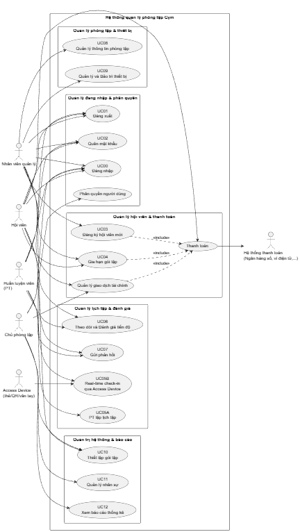

---

## 2.3 Biểu đồ Use Case Phân rã

### 2.3.1 Phân rã Hệ thống & Tài khoản

Nhóm này tập trung vào tính bảo mật và quyền truy cập của các tác nhân vào hệ thống.

**Các Use Case:**
- UC00 (Đăng nhập)
- UC01 (Đăng xuất)
- UC02 (Quên mật khẩu)

**Mối quan hệ:**
- UC00 (Đăng nhập) là điều kiện tiền quyết cho tất cả các chức năng khác

**Ghi chú:** Phân quyền người dùng được mô tả trong Quy trình 2.4.6, không tách thành một Use Case riêng trong phần 3.

Tệp nguồn diagram: [02_decomposition_account.puml](Diagram/src/02_decomposition_account.puml)

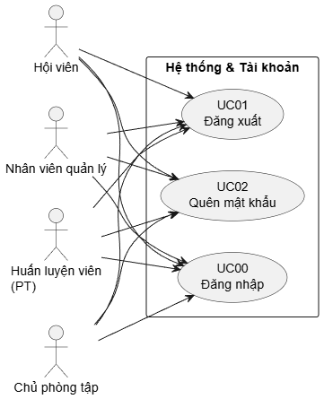

### 2.3.2 Phân rã Quản lý Hội viên & Giao dịch

Đây là nhóm chức năng cốt lõi tạo ra doanh thu cho phòng tập.

**Các Use Case:**
- UC03 (Đăng ký hội viên mới)
- UC04 (Gia hạn gói tập)

**Phân tích chi tiết:**
- Cả UC03 và UC04 đều đã tích hợp quy trình Thanh toán và Xuất biên lai làm luồng sự kiện chính
- Tương tác tác nhân: Nhân viên quản lý thực hiện tại quầy hoặc Hội viên tự thực hiện (đối với UC04 online)
- Hệ thống Thanh toán: Đóng vai trò là tác nhân hỗ trợ nhận lệnh và phản hồi kết quả giao dịch

Tệp nguồn diagram: [03_decomposition_membership_payment.puml](Diagram/src/03_decomposition_membership_payment.puml)

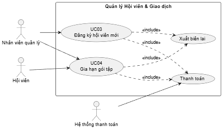

### 2.3.3 Phân rã Vận hành tập luyện (Real-time)

Nhóm này quản lý trải nghiệm hàng ngày của hội viên và huấn luyện viên.

**Các Use Case:**

- UC05A (PT lập lịch tập cho hội viên) — PT là actor chính.
- UC05B (Real-time check-in qua Access Device) — Access Device là actor chính, Member là beneficiary.
- UC06 (Theo dõi và Đánh giá tiến độ)
- UC07 (Gửi phản hồi)

**Phân tích chi tiết:**

- UC05 tách thành 2 sub-use-case: UC05A (PT chủ động lập lịch trước) và UC05B (ghi nhận thực tế khi member đến qua thiết bị).
- UC05B hoạt động dựa trên cơ chế tự động qua Access Device, KHÔNG check-in thủ công tại quầy.
- Gói tập là time-based: UC05B chỉ ghi attendance log, không trừ số buổi (xem Database.md `PACKAGE`).
- UC06 có sự tương tác chặt chẽ giữa PT (người nhập dữ liệu) và Hội viên (người theo dõi kết quả)
- UC07 cho phép Hội viên đánh giá nhân sự và cơ sở vật chất, dữ liệu này sẽ làm đầu vào cho UC11 (Quản lý nhân sự)

Tệp nguồn diagram: [04_decomposition_training_realtime.puml](Diagram/src/04_decomposition_training_realtime.puml)

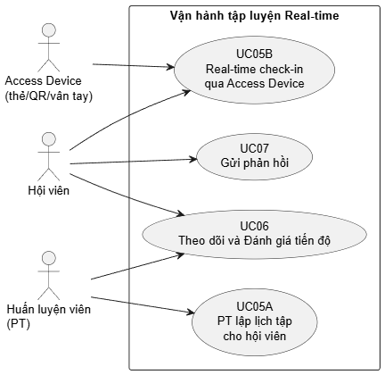

### 2.3.4 Phân rã Quản lý Cơ sở vật chất

Đảm bảo phòng tập luôn trong trạng thái vận hành tốt.

**Các Use Case:**
- UC08 (Quản lý thông tin phòng tập)
- UC09 (Quản lý và Bảo trì thiết bị)

**Phân tích chi tiết:**
- UC09 là sự kết hợp giữa việc quản lý danh mục thiết bị và quy trình báo hỏng, sửa chữa
- Thiết bị kiểm soát (Access Device) tương tác trực tiếp với UC05 để cung cấp dữ liệu về sự hiện diện của hội viên

Tệp nguồn diagram: [05_decomposition_facility.puml](Diagram/src/05_decomposition_facility.puml)

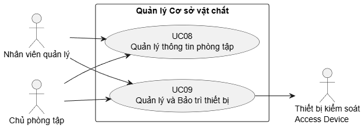

### 2.3.5 Phân rã Quản trị & Báo cáo

Dành riêng cho tác nhân Chủ phòng tập để điều hành và đánh giá hiệu quả kinh doanh.

**Các Use Case:**
- UC10 (Thiết lập gói tập)
- UC11 (Quản lý nhân sự)
- UC12 (Xem báo cáo thống kê)

**Phân tích chi tiết:**
- UC11 quản lý thông tin nhân viên, phân quyền, và lịch làm việc, kết nối với các đánh giá từ UC07 để chấm điểm hiệu suất
- UC12 tổng hợp dữ liệu từ mọi giao dịch thành công tại UC03, UC04 cũng như dữ liệu từ UC05, UC06, UC07 để xuất báo cáo doanh thu, hiệu suất và thống kê nhân sự

Tệp nguồn diagram: [06_decomposition_admin_report.puml](Diagram/src/06_decomposition_admin_report.puml)

---

## 2.4 Quy trình Nghiệp vụ

### 2.4.1 Quy trình Đăng ký Hội viên và Gia hạn (Tích hợp Thanh toán)

Quy trình này áp dụng cho cả việc tạo mới hội viên và nâng cấp/gia hạn gói tập hiện có.

**Bước 1: Tiếp nhận yêu cầu**
- Hội viên cung cấp thông tin cá nhân (đối với đăng ký mới) hoặc mã hội viên (đối với gia hạn)
- Lựa chọn gói tập mong muốn (3 tháng, 6 tháng, VIP, v.v.)

**Bước 2: Kiểm tra và Khởi tạo**
- Hệ thống kiểm tra tính duy nhất của SĐT/Email (nếu đăng ký mới)
- Hoặc kiểm tra trạng thái gói tập cũ (nếu gia hạn)
- Nhân viên quản lý nhập/cập nhật dữ liệu vào hệ thống

**Bước 3: Thực hiện thanh toán**
- Hệ thống tính toán tổng tiền dựa trên đơn giá gói tập và các chương trình khuyến mãi hiện có
- Hội viên thực hiện thanh toán qua các phương thức:
  - Tiền mặt
  - Thẻ ngân hàng
  - Ví điện tử
- **Trường hợp lỗi:** Nếu giao dịch điện tử thất bại, hệ thống báo lỗi và cho phép chọn lại phương thức thanh toán hoặc hủy yêu cầu

**Bước 4: Kích hoạt và Hoàn tất**
- Hệ thống xác nhận thanh toán thành công
- Cập nhật ngày bắt đầu/kết thúc gói tập vào cơ sở dữ liệu
- Hệ thống tự động in biên lai
- Cấp/cập nhật quyền truy cập cho hội viên

Tệp nguồn diagram: [07_process_register_renew_payment.puml](Diagram/src/07_process_register_renew_payment.puml)

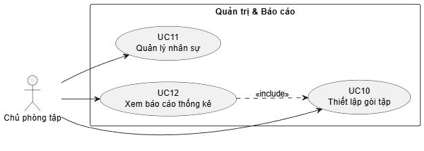

### 2.4.2 Quy trình Theo dõi Lịch tập và Tự động ghi nhận (Real-time)

Quy trình áp dụng cho UC05B: thiết bị kiểm soát ra/vào (Access Device) phát hiện hội viên và hệ thống tự động ghi nhận buổi tập, KHÔNG cần check-in thủ công ở quầy. Gói tập là time-based — không trừ số buổi.

**Bước 1: Nhận diện hội viên qua thiết bị**

- Hội viên quẹt thẻ / quét QR tại Access Device.
- Device gọi endpoint backend với device API key và `member_code`.

**Bước 2: Xác thực quyền truy cập**

- Hệ thống tra `subscriptions` của member: yêu cầu `status='active'` và `end_date >= today_vn` (xem Glossary).
- Nếu có session với PT trùng khung giờ (`training_sessions.status='scheduled'`, `start_time <= NOW() <= end_time`) → tham chiếu `session_id` vào attendance log.

**Bước 3: Ghi attendance log**

- Insert `attendance_logs` với `member_id`, `subscription_id`, `session_id` (nullable), `method='realtime'`, `checked_in_at=NOW()`.
- Không trừ buổi (time-based-only): chỉ ghi nhận có mặt, không decrement bất kỳ counter nào.

**Bước 4: Cập nhật trạng thái session (nếu có)**

- Nếu attendance gắn với `training_sessions`: cron `training-session:auto-close` (xem `Architecture.md §5.2`) sẽ chuyển session sang `completed` sau `end_time + 15 phút`.
- Hội viên và PT xem lịch sử attendance ở dashboard cá nhân.

Tệp nguồn diagram: [08_process_realtime_training.puml](Diagram/src/08_process_realtime_training.puml)

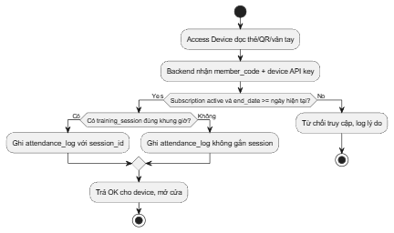

### 2.4.3 Quy trình Quản lý Thiết bị và Bảo trì (Tích hợp)

Đảm bảo quản lý vòng đời thiết bị từ khi nhập về đến khi thanh lý.

**Bước 1: Quản lý danh mục**
- Nhân viên quản lý cập nhật thông tin thiết bị mới (mã, tên, ngày nhập, bảo hành)
- Cập nhật thông tin thiết bị hiện có vào danh sách quản lý

**Bước 2: Báo cáo sự cố**
- Khi phát hiện lỗi (qua kiểm tra định kỳ hoặc phản hồi của hội viên)
- Nhân viên ghi nhận mô tả lỗi trên hệ thống

**Bước 3: Chuyển trạng thái bảo trì**
- Hệ thống cập nhật trạng thái thiết bị thành "Đang sửa chữa"
- Thông báo cho bộ phận kỹ thuật

**Bước 4: Xử lý sửa chữa**
- **Thành công:** Kỹ thuật viên sửa xong, cập nhật trạng thái về "Hoạt động bình thường"
- **Thất bại:** Nếu thiết bị không thể sửa, hệ thống sẽ thực hiện quy trình thanh lý và chuyển trạng thái sang "Ngừng hoạt động"

Tệp nguồn diagram: [09_process_equipment_maintenance.puml](Diagram/src/09_process_equipment_maintenance.puml)

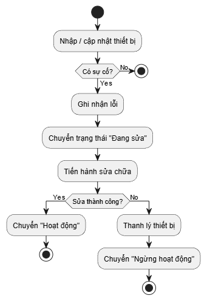

### 2.4.4 Quy trình Quản lý Nhân sự và Đánh giá

**Bước 1: Thiết lập nhân sự**
- Chủ phòng tập tạo hồ sơ nhân viên
- Phân nhóm quyền (PT, Sales, Quản lý)
- Thiết lập lịch làm việc

**Bước 2: Theo dõi hiệu suất**
- Hệ thống tự động thu thập dữ liệu từ:
  - Số buổi hướng dẫn thực tế của PT
  - Các phản hồi từ hội viên

**Bước 3: Đánh giá**
- Định kỳ, chủ phòng tập truy xuất báo cáo hiệu suất
- Đánh giá mức độ hoàn thành công việc của từng nhân viên

Tệp nguồn diagram: [10_process_hr_evaluation.puml](Diagram/src/10_process_hr_evaluation.puml)

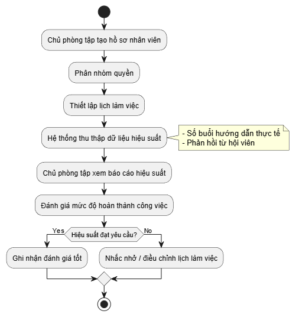

### 2.4.5 Quy trình Tiếp nhận và Xử lý Phản hồi

**Bước 1: Gửi phản hồi**
- Hội viên gửi đánh giá về chất lượng thiết bị, nhân viên hoặc dịch vụ qua ứng dụng

**Bước 2: Tiếp nhận và Phân loại**
- Nhân viên quản lý tiếp nhận phản hồi
- Phân loại mức độ nghiêm trọng
- Chuyển đến bộ phận liên quan

**Bước 3: Xử lý và Phản hồi lại**
- Sau khi xử lý (ví dụ: sửa máy, nhắc nhở nhân viên)
- Quản lý cập nhật kết quả lên hệ thống
- Hội viên nhận được thông báo phản hồi

Tệp nguồn diagram: [11_process_feedback.puml](Diagram/src/11_process_feedback.puml)

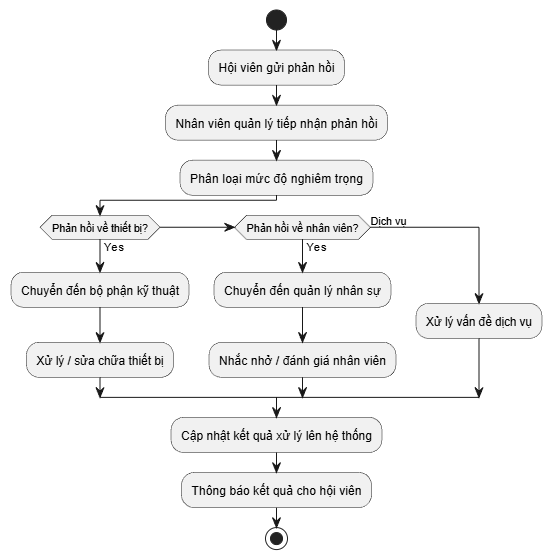

### 2.4.6 Quy trình Quản lý Phân quyền và Nhóm người dùng

Quy trình này đảm bảo tính bảo mật và đúng vai trò trong hệ thống.

#### 2.4.6.1 Quản lý nhóm cho người dùng

**Mô tả:** Gán một người dùng cụ thể vào một hoặc nhiều nhóm quyền nhất định

**Thực hiện:**
1. Chủ phòng tập chọn tài khoản người dùng
2. Chọn danh sách các nhóm hiện có (ví dụ: Nhóm Admin, Nhóm Sales)
3. Nhấn "Gán nhóm" để áp dụng quyền hạn của nhóm đó cho người dùng

#### 2.4.6.2 Quản lý người dùng cho nhóm

**Mô tả:** Quản lý danh sách các thành viên thuộc về một nhóm quyền cụ thể

**Thực hiện:**
1. Chủ phòng tập chọn một Nhóm cụ thể
2. Hệ thống hiển thị danh sách thành viên hiện tại
3. Chủ phòng tập thực hiện:
   - "Thêm thành viên" (bằng cách tìm mã nhân viên)
   - "Loại bỏ" thành viên ra khỏi nhóm

#### 2.4.6.3 Quản lý chức năng cho nhóm

**Mô tả:** Thiết lập các quyền hạn (chức năng) mà một nhóm cụ thể được phép thực hiện trên phần mềm

**Thực hiện:**
1. Chủ phòng tập chọn Nhóm cần cấu hình
2. Hệ thống hiển thị danh mục các tính năng của phần mềm (Xem doanh thu, Xóa thiết bị, Đăng ký hội viên, v.v.)
3. Chủ phòng tập tích chọn hoặc bỏ tích các quyền tương ứng
4. Nhấn "Lưu" để hệ thống cập nhật quyền hạn cho toàn bộ thành viên trong nhóm đó ngay lập tức

Tệp nguồn diagram: [12_process_permission_management.puml](Diagram/src/12_process_permission_management.puml)

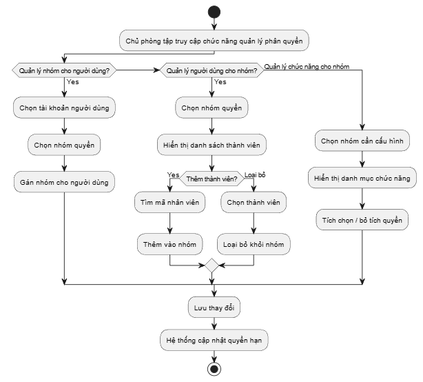

### 2.4.7 Quy trình Báo cáo Thống kê

**Bước 1: Lựa chọn tham số**
- Chủ phòng tập chọn loại báo cáo:
  - Doanh thu
  - Đăng ký mới
  - Tỷ lệ gia hạn
- Chọn khoảng thời gian cần xem

**Bước 2: Tổng hợp dữ liệu**
- Hệ thống tự động truy xuất dữ liệu từ:
  - Các giao dịch thanh toán
  - Lịch sử tập luyện đã được ghi nhận

**Bước 3: Hiển thị báo cáo**
- Hệ thống xuất kết quả dưới dạng:
  - Biểu đồ
  - Bảng biểu số liệu chi tiết
- Phục vụ việc ra quyết định kinh doanh

Tệp nguồn diagram: [13_process_statistics_report.puml](Diagram/src/13_process_statistics_report.puml)

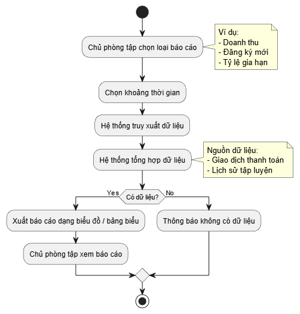

---

# 3. Đặc tả các chức năng

**Ghi chú quan trọng:** 
- **Phân quyền người dùng** được mô tả thông qua **Quy trình 2.4.6**, không có Use Case riêng trong phần này
- **UC03 (trong phần 3)** là "Đăng ký hội viên mới" - được mô tả chi tiết ở 3.4
- Tất cả tài liệu tham khảo đến "hộ gia đình" đã được cập nhật thành "hội viên" để phù hợp với nội dung thực tế của hệ thống

---

## 3.1 Đặc tả Use Case UC00 - Đăng nhập

| Thông tin | Chi tiết |
|-----------|---------|
| **Mã Use case** | UC00 |
| **Tên Use case** | Đăng nhập |
| **Tác nhân** | Hội viên, Nhân viên quản lý, Huấn luyện viên, Chủ phòng tập |
| **Tiền điều kiện** | Người dùng đã có tài khoản trên hệ thống |

### Luồng sự kiện chính (Thành công)

| STT | Thực hiện bởi | Hành động |
|-----|--------------|----------|
| 1 | Người dùng | Chọn chức năng Đăng nhập |
| 2 | Hệ thống | Hiển thị giao diện đăng nhập (form email + password, checkbox "Ghi nhớ đăng nhập", link "Quên mật khẩu") |
| 3 | Người dùng | Nhập email và mật khẩu, nhấn "Đăng nhập" |
| 4 | Hệ thống | Xác thực thông tin (email tồn tại, password đúng, `users.deleted_at IS NULL`, `users.status='active'`, `users.email_verified_at IS NOT NULL`) |
| 5 | Hệ thống | Xác định Nhóm quyền của người dùng (Group) qua `user_groups` và tải danh sách permission qua `group_permissions` |
| 6 | Hệ thống | Tạo JWT (TTL 7 ngày, payload `{ sub, email, roles[] }`), ghi `audit_logs` action `auth.login` với IP + user-agent |
| 7 | Hệ thống | Chuyển hướng người dùng đến trang chức năng tương ứng theo `roles[0]` (`/owner`, `/staff`, `/trainer`, `/member`) |

### Luồng sự kiện thay thế

| STT | Thực hiện bởi | Hành động |
|-----|--------------|----------|
| 4a | Hệ thống | Thiếu trường bắt buộc → thông báo "Vui lòng nhập đầy đủ email và mật khẩu" |
| 4b | Hệ thống | Email không tồn tại HOẶC mật khẩu sai → thông báo chung "Thông tin đăng nhập không chính xác" (không tiết lộ email có tồn tại không, tránh user enumeration). Trả 401. |
| 4c | Hệ thống | `users.email_verified_at IS NULL` → thông báo "Vui lòng xác thực email trước khi đăng nhập" + gợi ý gửi lại OTP (xem Architecture.md §3.3) |
| 4d | Người dùng | Nhấn link "Quên mật khẩu" → chuyển sang UC02 |

**Ghi chú lockout v1.0:** Account lockout (counter `failed_login_count` + `users.status='locked'` + cron auto-unlock + admin unlock + audit action `auth.lockout`) defer v1.1 — xem Architecture.md §8 Roadmap R20. V1.0 không có counter, mọi failed login trả 401 generic. Brute-force mitigation tạm thời: rate limit ở tầng WAF khi pre-production (Cloudflare/nginx) + bcrypt cost 10 + `/auth/forgot-password` rate limit 3/h/email.

### Dữ liệu đầu vào

| STT | Trường dữ liệu | Mô tả | Bắt buộc? | Điều kiện hợp lệ | Ví dụ |
|-----|----------------|--------|-----------|-------------------|--------|
| 1 | Email | Địa chỉ email | Có | Format: `^[a-zA-Z0-9._%+-]+@[a-zA-Z0-9.-]+\.[a-zA-Z]{2,}$` (RFC 5322), độ dài ≤ 255 ký tự | h.anh@gmail.com |
| 2 | Mật khẩu | Mật khẩu đăng nhập | Có | Độ dài ≥ 8 ký tự, chứa ít nhất 1 chữ hoa, 1 chữ thường, 1 số, 1 ký tự đặc biệt (!@#$%^&*) | ToiLa12#$ |
| 3 | Ghi nhớ đăng nhập | Checkbox kéo dài TTL token | Không | boolean | true |

### Hậu điều kiện
Người dùng truy cập được vào các tính năng thuộc quyền hạn của mình. JWT được cấp phát (TTL 7 ngày). Phiên đăng nhập được ghi vào `audit_logs` với timestamp + IP + user-agent.

**Ghi chú v1.0:** Logout chỉ là client-side (xóa token khỏi storage). Token blacklist / refresh token mechanism defer v1.1. Giới hạn session limit (4.4) chỉ enforce ở client.

---

## 3.2 Đặc tả Use Case UC01 - Đăng xuất

| Thông tin | Chi tiết |
|-----------|---------|
| **Mã Use case** | UC01 |
| **Tên Use case** | Đăng xuất |
| **Tác nhân** | Tất cả người dùng |
| **Tiền điều kiện** | Người dùng đang ở trạng thái đăng nhập |

### Luồng sự kiện chính (Thành công)

| STT | Thực hiện bởi | Hành động |
|-----|--------------|----------|
| 1 | Người dùng | Ấn vào tùy chọn đăng xuất |
| 2 | Hệ thống | Hủy phiên làm việc và quay về trang đăng nhập |

### Luồng sự kiện thay thế
Không có

### Hậu điều kiện
Người dùng không thể thực hiện các thao tác trong hệ thống cho đến khi đăng nhập lại.

---

## 3.3 Đặc tả Use Case UC02 - Quên mật khẩu

| Thông tin | Chi tiết |
|-----------|---------|
| **Mã Use case** | UC02 |
| **Tên Use case** | Quên mật khẩu |
| **Tác nhân** | Người dùng (mọi role) |
| **Tiền điều kiện** | Người dùng đã có tài khoản trên hệ thống và đã `email_verified_at IS NOT NULL` |

### Luồng sự kiện chính (Thành công)

| STT | Thực hiện bởi | Hành động |
|-----|--------------|----------|
| 1 | Người dùng | Tại màn hình Đăng nhập, người dùng chọn chức năng "Quên mật khẩu" |
| 2 | Hệ thống | Hiển thị form yêu cầu nhập Email đã đăng ký |
| 3 | Người dùng | Nhập email và nhấn "Gửi mã" |
| 4 | Hệ thống | Kiểm tra rate limit (tối đa 3 yêu cầu / giờ / email). Nếu vượt → từ chối với thông báo "Vui lòng thử lại sau". |
| 5 | Hệ thống | Bất kể email tồn tại hay không, trả response chung "Nếu email tồn tại, mã OTP đã được gửi" (tránh user enumeration). Nếu email thực sự tồn tại trong DB: sinh OTP 6 chữ số bằng `crypto.randomInt`, hash bcrypt, lưu `otp_codes` với `expires_at = NOW() + INTERVAL '10 minutes'`. **Single-active OTP:** trước INSERT phải `DELETE` mọi OTP cũ của user với `purpose='password_reset'` trong cùng `$transaction` (xem Database.md `otp_codes` convention). |
| 6 | Hệ thống | Gửi OTP qua email người dùng (v1.0 chỉ email, không SMS). Log plaintext OTP trong dev mode. |
| 7 | Người dùng | Nhập OTP + mật khẩu mới vào form, nhấn "Đặt lại" |
| 8 | Hệ thống | Verify OTP hash. Nếu hợp lệ và chưa expired: `$transaction` gồm update `users.password_hash` (bcrypt) + delete OTP. Ghi `audit_logs` action `auth.password-reset`. (Lockout unlock defer v1.1 R20 — xem Architecture §8.) |
| 9 | Hệ thống | Thông báo thành công, điều hướng về trang Đăng nhập |

### Luồng sự kiện thay thế

| STT | Thực hiện bởi | Hành động |
|-----|--------------|----------|
| 4a | Hệ thống | Vượt rate limit → "Bạn đã yêu cầu quá nhiều lần. Vui lòng thử lại sau 1 giờ." |
| 5a | Hệ thống | Email không tồn tại → vẫn trả response chung như success (security). KHÔNG gửi mail. |
| 8a | Hệ thống | OTP sai → tăng failed counter (max 5 lần/OTP), thông báo "Mã không hợp lệ" |
| 8b | Hệ thống | OTP hết hạn (`expires_at < NOW()`) → thông báo "Mã đã hết hạn, vui lòng yêu cầu mã mới" |

### Dữ liệu đầu vào

| STT | Trường dữ liệu | Mô tả | Bắt buộc? | Điều kiện hợp lệ | Ví dụ |
|-----|----------------|--------|-----------|-------------------|--------|
| 1 | Email | Email đã đăng ký | Có | Format: `^[a-zA-Z0-9._%+-]+@[a-zA-Z0-9.-]+\.[a-zA-Z]{2,}$` | h.anh@gmail.com |
| 2 | OTP | Mã 6 chữ số nhận qua email | Có | `^\d{6}$`, TTL 10 phút | 482910 |
| 3 | Mật khẩu mới | Mật khẩu mới | Có | Độ dài ≥ 8 ký tự, chứa ≥1 chữ hoa, ≥1 chữ thường, ≥1 số, ≥1 ký tự đặc biệt | NewPass123!@# |

### Hậu điều kiện
Mật khẩu của người dùng được cập nhật thành công và mã OTP được vô hiệu hóa; người dùng có thể sử dụng mật khẩu mới để đăng nhập. Sự kiện thay đổi mật khẩu được ghi log.

---

## 3.4 Đặc tả Use Case UC03 - Đăng ký hội viên mới

UC03 có 2 flow song song: **UC03A** (Staff đăng ký tại quầy) và **UC03B** (Member tự đăng ký online).

### 3.4.1 UC03A - Đăng ký tại quầy (Staff thực hiện)

| Thông tin | Chi tiết |
|-----------|---------|
| **Mã Use case** | UC03A |
| **Tên Use case** | Đăng ký hội viên tại quầy |
| **Tác nhân** | Nhân viên quản lý (Chính), Hệ thống thanh toán (Phụ) |
| **Tiền điều kiện** | Nhân viên đã đăng nhập với quyền tạo member |

#### Luồng sự kiện chính (Thành công)

| STT | Thực hiện bởi | Hành động |
|-----|--------------|----------|
| 1 | Nhân viên | Nhập thông tin cá nhân khách hàng (Họ tên, SĐT, Email, Ngày sinh, Địa chỉ); optional: chọn `primary_trainer_id` |
| 2 | Hệ thống | Validate dữ liệu input (regex, độ dài). Kiểm tra UNIQUE email/phone trong `users`. |
| 3 | Nhân viên | Chọn gói tập (chỉ hiển thị `packages.status='active'` AND `deleted_at IS NULL`) |
| 4 | Hệ thống | Tính tổng tiền = `packages.price`. Hiển thị xác nhận. |
| 5 | Nhân viên | Thu tiền mặt hoặc khởi tạo giao dịch thanh toán điện tử |
| 6 | Hệ thống thanh toán | Xác nhận giao dịch thành công (callback webhook nếu electronic) |
| 7 | Hệ thống | **Trong 1 transaction:** (a) Tạo `users` với `status='pending_verification'`, password tạm sinh ngẫu nhiên; (b) Tạo `members` với `member_code` tự sinh (`MEM-YYYY-XXXXXX`); (c) Auto-assign user vào group `member` qua `user_groups`; (d) Tạo `subscriptions` với `status='active'`, `start_date=today_vn`, `end_date=start_date + duration_days`; (e) Tạo `payments` với `status='success'`; (f) Ghi `audit_logs` action `member.create` với `actor_user_id=staff_user_id`. |
| 8 | Hệ thống | Gửi email cho member chứa: thông tin tài khoản (email + password tạm) + link verify email. Hiển thị biên lai để Staff in. |

#### Luồng sự kiện thay thế

| STT | Thực hiện bởi | Hành động |
|-----|--------------|----------|
| 2a | Hệ thống | Email/SĐT đã tồn tại → báo lỗi, gợi ý tra cứu hội viên hiện có |
| 6a | Hệ thống thanh toán | Thanh toán fail → rollback transaction, giữ form đã nhập, cho phép chọn lại phương thức hoặc hủy |
| 7a | Hệ thống | Member chưa verify email → vẫn cho phép check-in tại phòng tập (Staff đã verify offline tại quầy) nhưng không cho login online cho đến khi verify |

### 3.4.2 UC03B - Đăng ký online (Member tự thực hiện)

| Thông tin | Chi tiết |
|-----------|---------|
| **Mã Use case** | UC03B |
| **Tên Use case** | Đăng ký hội viên online |
| **Tác nhân** | Khách (chưa đăng nhập), Hệ thống thanh toán (Phụ) |
| **Tiền điều kiện** | Khách truy cập trang đăng ký public |

#### Luồng sự kiện chính (Thành công)

| STT | Thực hiện bởi | Hành động |
|-----|--------------|----------|
| 1 | Khách | Truy cập `/register`, nhập thông tin cá nhân + mật khẩu tự chọn + chọn gói tập |
| 2 | Hệ thống | Validate, kiểm tra UNIQUE email/phone |
| 3 | Hệ thống | Tạo `users` với `status='pending_verification'`, hash password bcrypt; tạo `members` với `member_code` tự sinh; tạo `subscriptions` với `status='pending'` (chờ thanh toán). |
| 4 | Hệ thống | Gửi email verify với OTP/link |
| 5 | Khách | Click link / nhập OTP → hoàn tất verify → `users.status='active'`, `email_verified_at=NOW()` |
| 6 | Hệ thống | Redirect khách sang trang thanh toán |
| 7 | Khách | Hoàn tất thanh toán online (thẻ/ví điện tử) |
| 8 | Hệ thống thanh toán | Webhook callback xác nhận giao dịch thành công |
| 9 | Hệ thống | Update `subscriptions.status='pending' → 'active'`, set `start_date=today_vn`, `end_date=start_date + duration_days`; tạo `payments` với `status='success'`; gửi email biên lai. |

#### Luồng sự kiện thay thế

| STT | Thực hiện bởi | Hành động |
|-----|--------------|----------|
| 2a | Hệ thống | Email/SĐT đã tồn tại → báo lỗi cụ thể (không áp dụng anti-enumeration cho registration vì đây là user info user đang nhập) |
| 5a | Khách | Không verify trong 24h → `users` vẫn ở `pending_verification`; không cleanup tự động (giữ để user có thể tự re-verify bằng cách resend OTP qua endpoint) |
| 8a | Hệ thống thanh toán | Thanh toán fail → giữ `subscriptions.status='pending'`, thông báo lỗi, cho phép retry trong 24h. Sau 24-48h cron `subscription:cancel-unpaid-pending` (daily 00:15) auto-cancel (`status='cancelled'`) — cửa sổ dao động 24-48h do daily cron, xem Architecture §5.2. |

### Dữ liệu đầu vào (chung cho UC03A và UC03B)

| STT | Trường dữ liệu | Mô tả | Bắt buộc? | Điều kiện hợp lệ | Ví dụ |
|-----|----------------|--------|-----------|-------------------|--------|
| 1 | Họ và tên (full_name) | Họ và tên đầy đủ | Có | Độ dài 2-200 ký tự; cho phép chữ cái Latin/Việt, khoảng trắng, dấu nháy `'`, gạch nối `-` | Nguyễn-An O'Brien |
| 2 | Mật khẩu | Mật khẩu (chỉ UC03B; UC03A sinh ngẫu nhiên) | Có (B) / Không (A) | Độ dài ≥ 8, ≥1 chữ hoa, ≥1 chữ thường, ≥1 số, ≥1 ký tự đặc biệt | Gym123!@ |
| 3 | Địa chỉ | Địa chỉ liên hệ | Không | Độ dài: 0-200 ký tự | 123 Lê Lợi, Hà Nội |
| 4 | Mã gói tập | `packages.package_code` | Có | Phải tồn tại và `status='active'`, `deleted_at IS NULL` | PKG-0012 |
| 5 | Ngày sinh | Ngày sinh | Có | Format ISO 8601 YYYY-MM-DD, 16 ≤ tuổi ≤ 100 | 2005-06-15 |
| 6 | Số điện thoại | SĐT VN | Có | Format: `^0\d{9}$` (10 chữ số, bắt đầu 0) | 0987654321 |
| 7 | Email | Email | Có | Format: `^[a-zA-Z0-9._%+-]+@[a-zA-Z0-9.-]+\.[a-zA-Z]{2,}$`, UNIQUE | user@email.com |
| 8 | Mã PT cố định | `staff.staff_code` của PT muốn gán | Không (chỉ UC03A) | PT phải có `position='pt'` | STF-2026-000045 |

### Hậu điều kiện

- `users.status='pending_verification'` (cho đến khi hoàn tất verify email)
- `members` được tạo với `member_code` tự sinh; auto-assign group `member`
- UC03A: `subscriptions.status='active'`, payment đã success
- UC03B: `subscriptions.status='pending'` cho đến khi payment + verify hoàn tất → `'active'`
- Email verify + email thông tin tài khoản được gửi
- `audit_logs` ghi action `member.create`

---

## 3.5 Đặc tả Use Case UC04 - Gia hạn / Hủy gói tập

UC04 gồm 2 sub-flow: **gia hạn (renewal)** và **hủy gói (cancel)**.

### 3.5.1 Gia hạn gói tập

| Thông tin | Chi tiết |
|-----------|---------|
| **Mã Use case** | UC04A |
| **Tên Use case** | Gia hạn gói tập |
| **Tác nhân** | Hội viên (Online), Nhân viên quản lý (Tại quầy), Hệ thống thanh toán |
| **Tiền điều kiện** | Hội viên đã đăng nhập, đã verify email |

#### Luồng sự kiện chính (Thành công)

| STT | Thực hiện bởi | Hành động |
|-----|--------------|----------|
| 1 | Hội viên | Chọn gói tập cần gia hạn (cùng gói cũ hoặc gói khác) |
| 2 | Hội viên | Thực hiện thanh toán |
| 3 | Hệ thống thanh toán | Xác nhận giao dịch thành công |
| 4 | Hệ thống | Tạo `subscriptions` mới theo quy tắc: (a) Nếu có gói `active` chưa hết hạn (gói cũ `end_date >= today_vn`) → `subscriptions` mới có `start_date = gói_cu.end_date + 1 day`, `status='pending'`. Cron job daily activate khi đến hạn. (b) Nếu không có gói active → `start_date=today_vn`, `status='active'` ngay. (c) `end_date = start_date + packages.duration_days`. |
| 5 | Hệ thống | Tạo `payments` với `status='success'`; ghi `audit_logs` action `subscription.renew`; gửi email biên lai. |

#### Luồng sự kiện thay thế

| STT | Thực hiện bởi | Hành động |
|-----|--------------|----------|
| 3a | Hệ thống thanh toán | Giao dịch fail → giữ trạng thái `subscriptions.status='pending'` chưa kích hoạt, thông báo lỗi |
| 4a | Hệ thống | Member đang có 1 subscription `pending` (prepaid chưa active) → từ chối gia hạn thêm: "Bạn đã có gói chờ kích hoạt" |

**Ghi chú v1.0:** Không hỗ trợ upgrade/downgrade giữa kỳ (đổi gói khi gói cũ còn hạn). Member muốn đổi → phải đợi hết hạn hoặc cancel gói cũ trước (xem 3.5.2).

### 3.5.2 Hủy gói tập

| Thông tin | Chi tiết |
|-----------|---------|
| **Mã Use case** | UC04B |
| **Tên Use case** | Hủy gói tập |
| **Tác nhân** | Hội viên hoặc Nhân viên quản lý (đại diện hội viên) |
| **Tiền điều kiện** | Tồn tại `subscriptions` với `status IN ('pending', 'active')` |

#### Luồng sự kiện chính

| STT | Thực hiện bởi | Hành động |
|-----|--------------|----------|
| 1 | Hội viên / Staff | Mở danh sách subscription, chọn gói cần hủy, nhấn "Hủy gói" |
| 2 | Hệ thống | Hiển thị cảnh báo: "Hủy gói sẽ mất quyền truy cập ngay lập tức. KHÔNG hoàn tiền. Bạn có chắc chắn?" |
| 3 | Hội viên / Staff | Xác nhận |
| 4 | Hệ thống | Set `subscriptions.status='cancelled'`, `cancelled_at=NOW()`; nếu có subscription `pending` prepaid → activate ngay (`status='active'`, `start_date=today_vn`, recompute `end_date=today_vn + packages.duration_days`); thực hiện trong `$transaction` để 2 update atomic; ghi `audit_logs` action `subscription.cancel`. |
| 5 | Hệ thống | Gửi email xác nhận hủy. |

### Hậu điều kiện
- Gia hạn: `subscriptions` mới được tạo, `start_date` theo quy tắc nối tiếp/từ ngày thanh toán; `payments` được ghi nhận; biên lai gửi qua email.
- Hủy: gói được set `cancelled`, member mất quyền truy cập; không hoàn tiền (chính sách v1.0 — xem cảnh báo tại Bước 2 luồng chính trên).

---

## 3.6 Đặc tả Use Case UC05 - Theo dõi lịch tập và Tự động ghi nhận (Real-time)

UC05 gồm 2 phần: **UC05A** (PT lập lịch tập cho hội viên) và **UC05B** (Real-time check-in qua thiết bị).

### 3.6.1 UC05A - PT lập lịch tập cho hội viên

| Thông tin | Chi tiết |
|-----------|---------|
| **Mã Use case** | UC05A |
| **Tên Use case** | Lập lịch tập (Booking training session) |
| **Tác nhân** | Huấn luyện viên |
| **Tiền điều kiện** | PT đã đăng nhập; hội viên đích có `subscriptions.status='active'` và `primary_trainer_id = self.staff_id` |

#### Luồng sự kiện chính

| STT | Thực hiện bởi | Hành động |
|-----|--------------|----------|
| 1 | PT | Mở "Lập lịch tập", chọn hội viên (chỉ thấy hội viên thuộc danh sách quản lý), chọn phòng, chọn `start_time` và `end_time` |
| 2 | Hệ thống | Validate: `end_time > start_time`; member subscription `active` tại thời điểm `start_time`; phòng không bị overlap (không có session khác cùng `room_id` có thời gian giao nhau với `status != 'cancelled'`) |
| 3 | Hệ thống | Tạo `training_sessions` với `status='scheduled'`; ghi audit log |

#### Luồng sự kiện thay thế

| STT | Thực hiện bởi | Hành động |
|-----|--------------|----------|
| 2a | Hệ thống | Phòng overlap → báo lỗi với gợi ý slot khác |
| 2b | Hệ thống | Member subscription hết hạn tại `start_time` → block, gợi ý gia hạn trước |
| -- | PT | Cancel/reschedule: PT có quyền chuyển `status='cancelled'` ít nhất 2 giờ trước `start_time`; sau ngưỡng đó session đã tiến hành thì chuyển `completed` thủ công hoặc tự động |

### 3.6.2 UC05B - Theo dõi và tự động ghi nhận buổi tập (Real-time)

| Thông tin | Chi tiết |
|-----------|---------|
| **Mã Use case** | UC05B |
| **Tên Use case** | Real-time attendance |
| **Tác nhân** | Hội viên, Huấn luyện viên, Thiết bị kiểm soát ra vào |
| **Tiền điều kiện** | Hội viên có `subscriptions.status='active'` |

#### Luồng sự kiện chính (Thành công)

| STT | Thực hiện bởi | Hành động |
|-----|--------------|----------|
| 1 | Hội viên | Đến phòng tập, quẹt thẻ / quét QR tại cổng |
| 2 | Thiết bị kiểm soát | Gửi `POST /api/v1/devices/access-events` với `X-Device-API-Key` + member identifier + timestamp |
| 3 | Hệ thống | Xác thực API key; tìm `member` qua `member_code` (v1.0; RFID/QR defer v1.1 R21); kiểm tra `subscriptions.status='active'` và `end_date >= today_vn` |
| 4 | Hệ thống | Tạo `attendance_logs` với `method='realtime'`, `start_time=event_time`, `subscription_id` của gói active hiện tại; nếu tại thời điểm đó có `training_session` của member ở `status='scheduled'` thì link `session_id` và chuyển session `status='in_progress'` |
| 5 | Hội viên & PT | Có thể xem lịch sử tập (`attendance_logs`) và trạng thái gói trên ứng dụng |
| 6 | Hệ thống | Khi member rời phòng / hết giờ session → set `attendance_logs.end_time`; nếu session đang `in_progress` → chuyển `completed` |

#### Luồng sự kiện thay thế

| STT | Thực hiện bởi | Hành động |
|-----|--------------|----------|
| 3a | Hệ thống | Gói hết hạn / cancelled → trả 403, device hiển thị "Gói hết hạn, vui lòng gia hạn" |
| 3b | Hệ thống | Không tìm thấy member → trả 404, device hiển thị "Không nhận diện được" + gợi ý lễ tân check-in thủ công (`method='manual'`) hoặc quét QR (`method='qr'`) |
| 2a | Thiết bị kiểm soát | Lỗi kết nối → device tự retry 3 lần (1s, 4s, 16s); nếu vẫn fail → fall back manual check-in tại quầy |

**Ghi chú v1.0:**
- Bỏ logic "trừ buổi tập" — gói chỉ time-based (xem Database.md PACKAGE).
- Không có cơ chế queue server-side; device tự chịu trách nhiệm retry.
- Real-time view trên ứng dụng dùng HTTP polling 30s (WebSocket defer v1.1).

### Hậu điều kiện
- `attendance_logs` được ghi với thời gian chính xác
- Nếu có session liên quan, `training_sessions.status` được cập nhật vòng đời (`scheduled` → `in_progress` → `completed`)
- Member xem session đã hoàn thành ở dashboard cá nhân

---

## 3.7 Đặc tả Use Case UC06 - Theo dõi và Đánh giá tiến độ

| Thông tin | Chi tiết |
|-----------|---------|
| **Mã Use case** | UC06 |
| **Tên Use case** | Theo dõi tiến độ |
| **Tác nhân** | Huấn luyện viên (ghi), Hội viên (đọc), Chủ phòng tập (đọc tất cả) |
| **Tiền điều kiện** | PT đã đăng nhập với `position='pt'`; hội viên đích có `primary_trainer_id = PT.staff_id` |

### Luồng sự kiện chính (Thành công)

| STT | Thực hiện bởi | Hành động |
|-----|--------------|----------|
| 1 | PT | Chọn chức năng "Quản lý tiến độ", hệ thống lọc và hiển thị danh sách hội viên có `primary_trainer_id = self.staff_id` |
| 2 | PT | Chọn hội viên cụ thể |
| 3 | Hệ thống | Hiển thị form nhập chỉ số: Cân nặng (kg), BMI, Mục tiêu, Ghi chú |
| 4 | PT | Nhập các thông số và lưu |
| 5 | Hệ thống | Validate (weight > 0, BMI hợp lý 10-50); tạo `member_progress` với `staff_id=self.staff_id`, `recorded_at=NOW()`; ghi audit log |
| 6 | Hội viên | Đăng nhập, xem biểu đồ tiến độ theo thời gian (chart từ `member_progress.recorded_at`) |

### Luồng sự kiện thay thế

| STT | Thực hiện bởi | Hành động |
|-----|--------------|----------|
| 1a | PT | Member không thuộc danh sách quản lý → không hiển thị; PT phải request đổi `primary_trainer_id` qua Staff/Owner |
| 5a | Hệ thống | Validate fail (số âm, vượt ngưỡng) → báo lỗi cụ thể |
| 5b | Hệ thống | Lỗi DB → retry hoặc thông báo |

**Authorization:**
- PT chỉ ghi `member_progress` cho member có `primary_trainer_id = self.staff_id`.
- Owner có quyền override (ghi cho bất kỳ member nào) và đọc tất cả.
- Member chỉ đọc progress của chính mình.

### Hậu điều kiện
Chỉ số sức khỏe được lưu vào `member_progress`. Biểu đồ tiến độ cập nhật tự động cho member xem ở trang cá nhân.

---

## 3.8 Đặc tả Use Case UC07 - Gửi phản hồi

| Thông tin | Chi tiết |
|-----------|---------|
| **Mã Use case** | UC07 |
| **Tên Use case** | Gửi phản hồi |
| **Tác nhân** | Hội viên (Online), Nhân viên quản lý (Tại quầy) |
| **Tiền điều kiện** | Hội viên đã đăng nhập vào hệ thống |

### Luồng sự kiện chính (Thành công)

| STT | Thực hiện bởi | Hành động |
|-----|--------------|----------|
| 1 | Hội viên | Chọn chức năng "Gửi phản hồi" trên ứng dụng |
| 2 | Hệ thống | Hiển thị form: Loại (`staff` / `equipment` / `service`), Nội dung, Severity (`low`/`medium`/`high`), và đối tượng tham chiếu (chọn nhân viên hoặc thiết bị tùy loại) |
| 3 | Hội viên | Nhập nội dung, chọn loại + severity + (nếu là `staff` chọn `subject_staff_id`, nếu `equipment` chọn `subject_equipment_id`), nhấn "Gửi" |
| 4 | Hệ thống | Validate: CHECK constraint `feedback_type` khớp với `subject_*` (xem Database.md `chk_feedback_subject`). Tạo `feedback` với `status='open'`, ghi `created_at` (dùng tính SLA, xem Architecture.md §4.6); ghi audit log. |
| 5 | Hệ thống | Phản hồi xác nhận tạo feedback thành công cho Hội viên (UI inline) |
| 6 | Staff/Manager | Mở dashboard feedback (filter `status='open'`), tiếp nhận: set `handled_by_staff_id=self.staff_id`, `status='in_progress'` |
| 7 | Staff/Manager | Sau khi xử lý → `status='resolved'` hoặc `status='rejected'` (không hợp lệ / duplicate); set `handled_at=NOW()` |

### Luồng sự kiện thay thế

| STT | Thực hiện bởi | Hành động |
|-----|--------------|----------|
| 3a | Hội viên | Để trống nội dung → "Vui lòng nhập nội dung phản hồi" |
| 4a | Hệ thống | Type/subject không khớp (vd: `type='staff'` nhưng không chọn nhân viên) → báo lỗi validation |
| 7a | Staff | Đánh dấu `rejected` nếu phản hồi không hợp lệ / spam / trùng lặp — bắt buộc nhập lý do trong field nội bộ |

### Hậu điều kiện
- `feedback` được tạo với `status='open'` và severity tương ứng
- SLA badge hiển thị quá hạn nếu vượt ngưỡng (xem Architecture.md §4.6)
- Member xem trạng thái feedback ở trang "Phản hồi của tôi"
- Background job `feedback:sla-check` (xem Architecture.md §5.2) tự đánh dấu badge "Quá hạn"

---

## 3.9 Đặc tả Use Case UC08 - Quản lý thông tin phòng tập

| Thông tin | Chi tiết |
|-----------|---------|
| **Mã Use case** | UC08 |
| **Tên Use case** | Quản lý thông tin phòng tập |
| **Tác nhân** | Nhân viên quản lý, Chủ phòng tập |
| **Tiền điều kiện** | Nhân viên quản lý hoặc Chủ phòng tập đã đăng nhập |

### Luồng sự kiện chính (Thành công)

| STT | Thực hiện bởi | Hành động |
|-----|--------------|----------|
| 1 | Nhân viên quản lý | Chọn chức năng "Quản lý phòng tập" |
| 2 | Hệ thống | Hiển thị danh sách các phòng hiện có (Gym, Yoga, Fitness...) |
| 3 | Nhân viên quản lý | Nhấn "Thêm mới" và nhập thông tin phòng (Mã phòng, Tên phòng, Sức chứa tối đa, Mô tả) hoặc chọn phòng hiện có để chỉnh sửa thông tin |
| 4 | Hệ thống | Kiểm tra tính duy nhất của mã phòng và lưu thay đổi vào hệ thống |

### Luồng sự kiện thay thế

| STT | Thực hiện bởi | Hành động |
|-----|--------------|----------|
| 2a | Nhân viên quản lý | Danh sách phòng tập trống (lần đầu sử dụng); hệ thống hướng dẫn tạo phòng mới |
| 3b | Nhân viên quản lý | Thay vì thêm mới, nhân viên chọn phòng hiện có để cập nhật thông tin (sức chứa, mô tả); hệ thống xác nhận thay đổi |
| 3c | Nhân viên quản lý | Xóa phòng — **HARD DELETE**: hệ thống kiểm tra ràng buộc: nếu phòng còn `equipment.room_id` tham chiếu hoặc `training_sessions.room_id` chưa kết thúc → block với thông báo "Không thể xóa phòng đang có thiết bị/lịch tập". Yêu cầu xác nhận double và ghi audit log. Không khôi phục được. |
| 4a | Hệ thống | Phát hiện mã phòng tập đã tồn tại; thông báo lỗi và yêu cầu đổi mã |

### Hậu điều kiện
Danh sách phòng tập được cập nhật. Phòng tập mới có thể được sử dụng để gán thiết bị hoặc lịch PT. Thông báo được gửi cho nhân viên về thay đổi.

**Ghi chú v1.0:** `gym_rooms` áp dụng **hard delete** theo Database.md "Soft Delete Convention". `room_code` tự sinh format `RM-XXX`.

---

## 3.10 Đặc tả Use Case UC09 - Quản lý và Bảo trì thiết bị

| Thông tin | Chi tiết |
|-----------|---------|
| **Mã Use case** | UC09 |
| **Tên Use case** | Quản lý và Bảo trì thiết bị |
| **Tác nhân** | Nhân viên quản lý (CRUD), Kỹ thuật viên (`staff.position='technician'` xử lý maintenance), Chủ phòng tập |
| **Tiền điều kiện** | Nhân viên đã đăng nhập với quyền tương ứng |

### Luồng sự kiện chính (Thành công)

| STT | Thực hiện bởi | Hành động |
|-----|--------------|----------|
| 1 | Nhân viên quản lý | Chọn chức năng "Quản lý thiết bị" |
| 2 | Hệ thống | Hiển thị danh sách thiết bị: `equipment_code` (auto `EQ-XXXXXX`), tên, room, `import_date`, `warranty_until`, `status` (`active`/`broken`/`repairing`/`retired`) |
| 3 | Nhân viên quản lý | Chọn thiết bị để cập nhật hoặc "Thêm mới" để nhập thiết bị mới (chọn `room_id`, tên, ngày nhập, bảo hành) |
| 4 | Nhân viên quản lý | Phát hiện hỏng → tạo `maintenance_logs` với `reported_by_staff_id=self.staff_id`, `description=...`, `status='reported'`; chuyển `equipment.status='broken'` |
| 5 | Hệ thống | Cập nhật danh sách thiết bị cần bảo trì ở dashboard technician |
| 6 | Kỹ thuật viên | Tiếp nhận, set `maintenance_logs.status='repairing'`, `equipment.status='repairing'` |
| 7 | Kỹ thuật viên | Sau khi sửa xong → set `maintenance_logs.status='resolved'`, `resolved_at=NOW()`, `equipment.status='active'` |

### Luồng sự kiện thay thế

| STT | Thực hiện bởi | Hành động |
|-----|--------------|----------|
| 2a | Hệ thống | Danh sách thiết bị trống → hướng dẫn thêm mới |
| 3a | Nhân viên quản lý | Validate fail (thiếu trường, `warranty_until` < `import_date`) → báo lỗi |
| 3b | Nhân viên quản lý | Tìm thiết bị bằng mã hoặc tên → hiển thị kết quả tìm kiếm |
| 4a | Nhân viên quản lý | Xóa thiết bị (thanh lý) — **HARD DELETE**: yêu cầu xác nhận double. Kiểm tra: không cho xóa nếu còn `maintenance_logs` chưa resolved. Thay vào đó nên dùng `equipment.status='retired'` để giữ history. |
| 7a | Kỹ thuật viên | Không thể sửa → set `maintenance_logs.status='failed'`, `equipment.status='retired'` (giữ thiết bị trong DB cho audit, không xóa hẳn) |

### Hậu điều kiện
- `equipment.status` được cập nhật vòng đời `active` → `broken` → `repairing` → `active` hoặc `retired`
- `maintenance_logs` lưu history (immutable, hard delete không cho phép)
- Dashboard technician hiển thị thiết bị có maintenance log mới

**Ghi chú v1.0:** `equipment` và `maintenance_logs` đều áp dụng **hard delete** (xem Database.md). Cost, parts replaced, preventive schedule defer v1.1.

---

## 3.11 Đặc tả Use Case UC10 - Thiết lập gói tập

| Thông tin | Chi tiết |
|-----------|---------|
| **Mã Use case** | UC10 |
| **Tên Use case** | Thiết lập gói tập |
| **Tác nhân** | Nhân viên quản lý, Chủ phòng tập |
| **Tiền điều kiện** | Chủ phòng tập hoặc Nhân viên quản lý đã đăng nhập |

### Luồng sự kiện chính (Thành công)

| STT | Thực hiện bởi | Hành động |
|-----|--------------|----------|
| 1 | Chủ phòng tập | Chọn chức năng "Cấu hình gói tập" |
| 2 | Hệ thống | Hiển thị form: Tên gói, **Thời hạn (ngày)**, Đơn giá (VND), Quyền lợi (mô tả ngắn). `package_code` server tự sinh `PKG-XXXX`. |
| 3 | Chủ phòng tập | Nhập thông số và nhấn "Lưu" |
| 4 | Hệ thống | Validate (`duration_days > 0`, `price >= 0`, không số thập phân cho VND); lưu với `status='active'`; ghi audit log |

### Luồng sự kiện thay thế

| STT | Thực hiện bởi | Hành động |
|-----|--------------|----------|
| 2a | Hệ thống | Danh sách gói tập trống → hướng dẫn tạo mới |
| 3a | Hệ thống | Tên gói đã tồn tại → yêu cầu đổi tên |
| 3b | Chủ phòng tập | Cập nhật gói hiện có (giá, thời hạn, quyền lợi); hệ thống xác nhận thay đổi không ảnh hưởng subscription đã tạo (lock giá tại thời điểm đăng ký) |
| 3c | Chủ phòng tập | **Vô hiệu hóa** gói (`status='inactive'`) — gói không hiển thị cho đăng ký mới nhưng subscriptions cũ vẫn hoạt động. Khác với delete. |
| 3d | Chủ phòng tập | **Xóa gói** — **SOFT DELETE** (`deleted_at=NOW()`). Block nếu còn subscription `active`/`pending` tham chiếu. Chỉ Owner mới có quyền. |
| 4a | Hệ thống | Giá âm / `duration_days <= 0` / giá có thập phân → báo lỗi |

### Hậu điều kiện
Gói tập mới được lưu. Gói có `status='active'` hiển thị trong danh sách đăng ký. `package_code` được sinh tự động.

**Ghi chú v1.0:**
- Đã bỏ trường "Số buổi" (`session_limit`). V1.0 chỉ time-based.
- Không hỗ trợ gói trial / promotion / discount trong v1.0.
- `packages` áp dụng **soft delete** (xem Database.md).

---

## 3.12 Đặc tả Use Case UC11 - Quản lý nhân sự

| Thông tin | Chi tiết |
|-----------|----------|
| **Mã Use case** | UC11 |
| **Tên Use case** | Quản lý nhân sự |
| **Tác nhân** | Chủ phòng tập |
| **Tiền điều kiện** | Chủ phòng tập đã đăng nhập |

### Luồng sự kiện chính (Thành công)

| STT | Thực hiện bởi | Hành động |
|-----|--------------|----------|
| 1 | Chủ phòng tập | Chọn chức năng "Quản lý nhân sự" |
| 2 | Hệ thống | Hiển thị danh sách `staff` đang active (`deleted_at IS NULL`) |
| 3 | Chủ phòng tập | Chọn nhân viên để xem chi tiết hoặc nhấn "Thêm mới" |
| 4 | Chủ phòng tập | Nhập thông tin: Họ tên, email, số điện thoại, `position` (`pt` / `manager` / `receptionist` / `technician`). Server tạo `users` với `status='pending_verification'` và `staff` với `staff_code` tự sinh `STF-YYYY-XXXXXX`. |
| 5 | Chủ phòng tập | Gán nhóm quyền (mặc định 4 groups: `owner`, `staff`, `trainer`, `member`); một nhân viên có thể thuộc nhiều group (ví dụ PT vừa là `trainer` vừa là `staff`). |
| 6 | Chủ phòng tập | Thiết lập lịch làm việc — insert nhiều rows vào `staff_schedules` (mỗi row 1 ngày + 1 ca). Frontend hỗ trợ bulk-insert (chọn tháng + pattern thứ 2-6 ca sáng → tạo 20 rows). |
| 7 | Hệ thống | Lưu thông tin; gửi email mời nhân viên (verify email + đặt mật khẩu); ghi audit log |

### Luồng sự kiện thay thế

| STT | Thực hiện bởi | Hành động |
|-----|--------------|----------|
| 4a | Chủ phòng tập | Email/phone đã tồn tại → báo lỗi |
| 6a | Hệ thống | UNIQUE `(staff_id, shift, work_date)` vi phạm → "Nhân viên đã có ca này trong ngày" |
| -- | Chủ phòng tập | Cho thôi việc / xóa nhân viên — **SOFT DELETE** (`staff.deleted_at`, `users.deleted_at`). Nhân viên mất quyền login. Giữ history audit. |

### Hậu điều kiện
- `staff` được lưu với `staff_code` tự sinh
- `user_groups` được set
- `staff_schedules` insert đầy đủ rows
- Email mời được gửi; nhân viên cần verify email (Architecture.md §3.3) trước khi login

**Ghi chú v1.0:** Không có concept "nghỉ phép" (leave) — manager xóa row schedule khi muốn. Pattern recurring weekly defer v1.1 (hiện tại frontend bulk-insert).

---

## 3.13 Đặc tả Use Case UC12 - Xem báo cáo thống kê

| Thông tin | Chi tiết |
|-----------|----------|
| **Mã Use case** | UC12 |
| **Tên Use case** | Xem báo cáo thống kê |
| **Tác nhân** | Chủ phòng tập |
| **Tiền điều kiện** | Chủ phòng tập đã đăng nhập |

### Luồng sự kiện chính (Thành công)

| STT | Thực hiện bởi | Hành động |
|-----|--------------|----------|
| 1 | Chủ phòng tập | Chọn chức năng "Báo cáo thống kê" |
| 2 | Hệ thống | Hiển thị 4 loại báo cáo có sẵn |
| 3 | Chủ phòng tập | Chọn loại báo cáo + khoảng thời gian (`from`, `to`) |
| 4 | Hệ thống | Truy xuất dữ liệu, tính toán theo công thức (xem bảng dưới) |
| 5 | Hệ thống | Render biểu đồ + bảng số liệu chi tiết |

### Danh sách báo cáo và công thức

| Báo cáo | Công thức | Visualization |
|---------|-----------|---------------|
| **Doanh thu** | `SUM(payments.amount) WHERE payments.status='success' AND paid_at BETWEEN :from AND :to` | Line chart theo ngày + total |
| **Hội viên mới** | `COUNT(members.member_id) WHERE created_at BETWEEN :from AND :to AND deleted_at IS NULL` | Bar chart theo ngày |
| **Tỷ lệ gia hạn** | `COUNT(member có >= 2 subscriptions trong range) / COUNT(member có >= 1 subscription expired trong range)` | Pie chart (renewed vs churned) |
| **Hiệu suất nhân viên** | Cho mỗi `staff` với `position='pt'`: `COUNT(training_sessions WHERE trainer_staff_id=staff.staff_id AND status='completed' AND start_time BETWEEN :from AND :to)`; kết hợp `AVG(feedback severity-rating)` từ feedback type='staff' của họ. `status='completed'` chỉ bao gồm session có attendance thực tế — cron `training-session:auto-close` set no-show thành `cancelled` (xem Architecture.md §5.2). | Table xếp hạng + chart |

### Luồng sự kiện thay thế

| STT | Thực hiện bởi | Hành động |
|-----|--------------|----------|
| 4a | Hệ thống | Không có dữ liệu trong range → "Không có dữ liệu" |
| 5a | Hệ thống | Lỗi tính toán → log lỗi + thông báo chung |

### Hậu điều kiện
Báo cáo được tạo. Owner có thể export PDF / Excel / CSV. Số liệu real-time (query trực tiếp, không cache).

**Ghi chú v1.0:**
- KPI nâng cao (churn rate, MRR, ARPU) defer v1.1
- Scheduled report (auto-email Owner daily) defer v1.1
- Không multi-branch filter (B6 confirmed)

---

# 4. Các yêu cầu khác

## 4.1 Chức năng (Functionality)

Hệ thống cần đảm bảo thực hiện đầy đủ các chức năng đã mô tả trong các use case, bao gồm:
- Quản lý hội viên
- Quản lý gói tập
- Quản lý thiết bị
- Báo cáo thống kê

### Yêu cầu cụ thể:
- Các thao tác CRUD phải đảm bảo tính toàn vẹn dữ liệu
- Hệ thống cần phân quyền rõ ràng giữa các loại người dùng
- Các thao tác liên quan đến dữ liệu quan trọng cần có xác nhận từ người dùng

---

## 4.2 Tính dễ dùng (Usability)

Hệ thống cần được thiết kế với giao diện thân thiện, dễ sử dụng đối với cả người dùng không có chuyên môn kỹ thuật.

### Yêu cầu cụ thể:
- Các chức năng được bố trí rõ ràng, dễ tìm kiếm
- Có thông báo lỗi cụ thể, giúp người dùng hiểu và xử lý vấn đề
- Hỗ trợ thao tác nhanh trong các tác vụ thường xuyên như đăng ký hội viên hoặc gia hạn gói tập

---

## 4.3 Hiệu năng (Performance)

Hệ thống cần đảm bảo khả năng xử lý ổn định và đáp ứng nhanh:

- **Thời gian phản hồi:** Các tác vụ cơ bản (đăng nhập, tra cứu) ≤ 2 giây; báo cáo ≤ 5 giây
- **Hỗ trợ đồng thời:** Tối thiểu 100 người dùng truy cập cùng lúc
- **Tính sẵn sàng:** Hệ thống hoạt động ≥ 99% thời gian
- **Xử lý dữ liệu:** Cơ sở dữ liệu có thể xử lý ≥ 1000 giao dịch/giây
- **Khả năng mở rộng:** Hỗ trợ tăng bộ nhớ, lưu trữ khi số lượng dữ liệu tăng
- **Giám sát:** Sử dụng công cụ APM (New Relic, Grafana) để theo dõi hiệu năng

---

## 4.4 Bảo mật (Security)

Do hệ thống xử lý thông tin cá nhân và dữ liệu tài chính, cần đảm bảo:

- **Mã hóa mật khẩu:** Sử dụng Bcrypt hoặc Argon2, không lưu plain text
- **Mật khẩu mạnh:** Tối thiểu 8 ký tự, chứa chữ hoa, chữ thường, số, ký tự đặc biệt
- **Bảo vệ tài khoản:** Khóa sau 5 lần nhập sai; hỗ trợ quên mật khẩu qua email/SMS
- **Phân quyền:** Group-Based Access Control — quyền hạn được cấp theo Nhóm quyền (Nhóm Admin, Nhóm Quản lý, Nhóm PT, Nhóm Hội viên) với nguyên tắc quyền tối thiểu; cấu hình chi tiết theo Quy trình 2.4.6
- **Mã hóa truyền tải:** HTTPS/TLS 1.2+ cho tất cả kết nối
- **Mã hóa lưu trữ:** AES-256 cho dữ liệu nhạy cảm (email, SĐT, thông tin thanh toán)
- **Session timeout:** 30 phút không hoạt động; giới hạn 3 phiên/tài khoản
- **Ghi log bảo mật:** Ghi lại đăng nhập, thay đổi mật khẩu, truy cập dữ liệu nhạy cảm; giữ log 1 năm
- **Bảo vệ web:** Ngăn chặn SQL Injection, XSS, CSRF dùng input validation + Prepared Statements
- **Cập nhật:** Triển khai security patches trong 24 giờ; kiểm tra lỗ hổng hàng tuần

---

## 4.5 Độ tin cậy (Reliability)

- Hệ thống hoạt động ổn định, hạn chế lỗi
- Có cơ chế backup dữ liệu định kỳ
- Có khả năng phục hồi khi xảy ra sự cố

---

## 4.6 Khả năng mở rộng (Scalability)

- Hệ thống có thể mở rộng khi số lượng hội viên tăng
- Có thể triển khai cho nhiều chi nhánh phòng tập

---

## 4.7 Khả năng bảo trì (Maintainability)

- Code được tổ chức rõ ràng
- Dễ dàng nâng cấp và sửa lỗi
- Có tài liệu hướng dẫn cho developer

---

## 5. Changelog

| Version | Date | Author | Changes |
|---|---|---|---|
| 0.1.0 | 2026-05-12 | Lê Thanh An | Initial draft — 14 UC (UC00-UC13), notification UC14, metadata Glossary skeleton. |
| 0.9.0 | 2026-05-16 | Lê Thanh An | Phase 2 refactor 4 nhóm: (1) xóa UC14 + notification reference khắp UC04B/UC05A/UC06/UC07/UC09 (v1.0 không in-app notification); (2) move technical sections sang Architecture.md mới (§2.5 Background Jobs, §4.8 Backup/DR, §4.9 API Conventions, §4.10 Feedback SLA, §4.11 Audit Logging, UC13 Verify email reformat sequence); (3) fix UC05B mâu thuẫn time-based (§2.4.2 + diagram 08 bỏ "Trừ số buổi"); (4) SRS chỉ giữ functional + non-functional. Diagram split UC05→UC05A+UC05B, thêm Access Device actor. |
| 1.0.0 | 2026-05-17 | Lê Thanh An | Phase 7-8 sync với Architecture.md v1.1.3: UC00 step 4b-4e (lockout flow) rewrite — defer v1.1 R20, 4b generic 401, 4c email-verify guard, 4d "Quên mật khẩu" link; UC02 step 5 thêm note "DELETE old OTP trong `$transaction`" (single-active invariant); UC02 step 8 bỏ "unlock locked user" branch; UC03A/UC03B/UC04B/UC05B replace `CURRENT_DATE` → `today_vn`; UC03B step 8a "24h" → "24-48h" (cron daily window); UC04B step 4 thêm `$transaction` + `today_vn` + audit `subscription.cancel`; UC12 KPI clarify "completed = thực sự attended"; Glossary thêm `today_vn`. Metadata header bổ sung (Document ID, Version, Status, Author, Reviewers, Last Updated). Stale references `Architecture.md §4` → `§5.2`, `§7` → `§4.6` (sync với restructure phase 5). Xóa duplicate ghi chú §2.3.1. Fix dangling cross-ref "xem SRS 1.2" (UC04B Hậu điều kiện). |

