# Tài liệu Đặc tả Yêu cầu Phần mềm

## Hệ thống Quản lý Phòng tập Gym

| Field | Value |
|---|---|
| Document ID | GMS-SRS-001 |
| Version | 1.0.1 |
| Status | Draft |
| Author | bta, lta, nhl, tvm, pyn |
| Reviewers | TBD — tối thiểu 1 BA + 1 backend lead khi team formed |
| Last Updated | 9999-99-99 |
| Related docs | `docs/Design/Architecture.md` (v1.1.3), `docs/Design/Database.md` |

---

## Mục lục

- [Tài liệu Đặc tả Yêu cầu Phần mềm](#tài-liệu-đặc-tả-yêu-cầu-phần-mềm)
  - [Hệ thống Quản lý Phòng tập Gym](#hệ-thống-quản-lý-phòng-tập-gym)
  - [Mục lục](#mục-lục)
- [1. Giới thiệu](#1-giới-thiệu)
  - [1.1 Mục đích](#11-mục-đích)
  - [1.2 Phạm vi](#12-phạm-vi)
    - [Cụ thể, hệ thống cho phép:](#cụ-thể-hệ-thống-cho-phép)
    - [Các nhóm người dùng chính:](#các-nhóm-người-dùng-chính)
  - [1.3 Từ điển thuật ngữ](#13-từ-điển-thuật-ngữ)
  - [1.4 Tài liệu tham khảo](#14-tài-liệu-tham-khảo)
- [2. Mô tả tổng quan](#2-mô-tả-tổng-quan)
  - [2.1 Các tác nhân](#21-các-tác-nhân)
    - [Tác nhân chính (Con người):](#tác-nhân-chính-con-người)
    - [Tác nhân hệ thống:](#tác-nhân-hệ-thống)
  - [2.2 Biểu đồ Use Case Tổng quan](#22-biểu-đồ-use-case-tổng-quan)
    - [Nhóm tác nhân và phạm vi tương tác](#nhóm-tác-nhân-và-phạm-vi-tương-tác)
    - [Nhóm use case cấp cao](#nhóm-use-case-cấp-cao)
    - [PlantUML - Use Case Tổng quan](#plantuml---use-case-tổng-quan)
    - [Ràng buộc tổng quan](#ràng-buộc-tổng-quan)
  - [2.3 Biểu đồ Use Case Phân rã](#23-biểu-đồ-use-case-phân-rã)
    - [2.3.1 Phân rã Tài khoản - Bảo mật](#231-phân-rã-tài-khoản---bảo-mật)
    - [2.3.2 Phân rã Quản lý Hội viên](#232-phân-rã-quản-lý-hội-viên)
    - [2.3.3 Phân rã Gói tập, Đăng ký gói \& Thanh toán](#233-phân-rã-gói-tập-đăng-ký-gói--thanh-toán)
    - [2.3.4 Phân rã Quản lý Nhân sự, Chấm công \& Lịch làm việc](#234-phân-rã-quản-lý-nhân-sự-chấm-công--lịch-làm-việc)
    - [2.3.5 Phân rã Phản hồi](#235-phân-rã-phản-hồi)
    - [2.3.6 Phân rã Thiết bị \& Phòng tập](#236-phân-rã-thiết-bị--phòng-tập)
    - [2.3.7 Phân rã Workout Plan \& Training](#237-phân-rã-workout-plan--training)
    - [2.3.8 Phân rã Báo cáo \& Thống kê](#238-phân-rã-báo-cáo--thống-kê)
    - [2.3.9 Phân rã Quản lý Phân quyền RBAC](#239-phân-rã-quản-lý-phân-quyền-rbac)
  - [2.4 Quy trình Nghiệp vụ](#24-quy-trình-nghiệp-vụ)
    - [2.4.1 Quy trình Đăng nhập - Đăng xuất](#241-quy-trình-đăng-nhập---đăng-xuất)
    - [2.4.2 Quy trình Quản lý Hồ sơ cá nhân](#242-quy-trình-quản-lý-hồ-sơ-cá-nhân)
    - [2.4.3 Quy trình Đăng ký Hội viên](#243-quy-trình-đăng-ký-hội-viên)
    - [2.4.4 Quy trình Quản lý gói tập của hội viên](#244-quy-trình-quản-lý-gói-tập-của-hội-viên)
    - [2.4.5 Quy trình Quản lý Hội viên tại quầy](#245-quy-trình-quản-lý-hội-viên-tại-quầy)
    - [2.4.6 Quy trình Tạo và Quản lý buổi tập](#246-quy-trình-tạo-và-quản-lý-buổi-tập)
    - [2.4.7 Quy trình Tạo và Quản lý Workout Plan](#247-quy-trình-tạo-và-quản-lý-workout-plan)
    - [2.4.8 Quy trình Phản hồi và Xử lý phản hồi](#248-quy-trình-phản-hồi-và-xử-lý-phản-hồi)
    - [2.4.9 Quy trình Quản lý Nhân sự và Theo dõi hiệu suất](#249-quy-trình-quản-lý-nhân-sự-và-theo-dõi-hiệu-suất)
    - [2.4.10 Quy trình Quản lý Phòng tập, Thiết bị và Bảo trì](#2410-quy-trình-quản-lý-phòng-tập-thiết-bị-và-bảo-trì)
    - [2.4.11 Quy trình Quản lý danh mục Gói tập](#2411-quy-trình-quản-lý-danh-mục-gói-tập)
    - [2.4.12 Quy trình Quản lý Phân quyền người dùng](#2412-quy-trình-quản-lý-phân-quyền-người-dùng)
    - [2.4.13 Quy trình Báo cáo, Thống kê, Thanh toán và Hiệu suất](#2413-quy-trình-báo-cáo-thống-kê-thanh-toán-và-hiệu-suất)
- [3. Đặc tả các chức năng](#3-đặc-tả-các-chức-năng)
  - [3.1 Đặc tả Use Case UC00 - Đăng nhập](#31-đặc-tả-use-case-uc00---đăng-nhập)
    - [Luồng sự kiện chính (Thành công)](#luồng-sự-kiện-chính-thành-công)
    - [Luồng sự kiện thay thế](#luồng-sự-kiện-thay-thế)
    - [Dữ liệu đầu vào](#dữ-liệu-đầu-vào)
    - [Hậu điều kiện](#hậu-điều-kiện)
  - [3.2 Đặc tả Use Case UC01 - Đăng xuất](#32-đặc-tả-use-case-uc01---đăng-xuất)
    - [Luồng sự kiện chính (Thành công)](#luồng-sự-kiện-chính-thành-công-1)
    - [Luồng sự kiện thay thế](#luồng-sự-kiện-thay-thế-1)
    - [Hậu điều kiện](#hậu-điều-kiện-1)
  - [3.3 Đặc tả Use Case UC02 - Quên mật khẩu](#33-đặc-tả-use-case-uc02---quên-mật-khẩu)
    - [Luồng sự kiện chính (Thành công)](#luồng-sự-kiện-chính-thành-công-2)
    - [Luồng sự kiện thay thế](#luồng-sự-kiện-thay-thế-2)
    - [Dữ liệu đầu vào](#dữ-liệu-đầu-vào-1)
    - [Hậu điều kiện](#hậu-điều-kiện-2)
  - [3.4 Đặc tả Use Case UC03 - Đăng ký hội viên mới](#34-đặc-tả-use-case-uc03---đăng-ký-hội-viên-mới)
    - [3.4.1 UC03A - Đăng ký tại quầy (Staff thực hiện)](#341-uc03a---đăng-ký-tại-quầy-staff-thực-hiện)
      - [Luồng sự kiện chính (Thành công)](#luồng-sự-kiện-chính-thành-công-3)
      - [Luồng sự kiện thay thế](#luồng-sự-kiện-thay-thế-3)
    - [3.4.2 UC03B - Đăng ký online (Member tự thực hiện)](#342-uc03b---đăng-ký-online-member-tự-thực-hiện)
      - [Luồng sự kiện chính (Thành công)](#luồng-sự-kiện-chính-thành-công-4)
      - [Luồng sự kiện thay thế](#luồng-sự-kiện-thay-thế-4)
    - [Dữ liệu đầu vào (chung cho UC03A và UC03B)](#dữ-liệu-đầu-vào-chung-cho-uc03a-và-uc03b)
    - [Hậu điều kiện](#hậu-điều-kiện-3)
  - [3.5 Đặc tả Use Case UC04 - Gia hạn / Hủy gói tập](#35-đặc-tả-use-case-uc04---gia-hạn--hủy-gói-tập)
    - [3.5.1 Gia hạn gói tập](#351-gia-hạn-gói-tập)
      - [Luồng sự kiện chính (Thành công)](#luồng-sự-kiện-chính-thành-công-5)
      - [Luồng sự kiện thay thế](#luồng-sự-kiện-thay-thế-5)
    - [3.5.2 Hủy gói tập](#352-hủy-gói-tập)
      - [Luồng sự kiện chính](#luồng-sự-kiện-chính)
    - [Hậu điều kiện](#hậu-điều-kiện-4)
  - [3.6 Đặc tả Use Case UC05 - Lập kế hoạch tập luyện, Lịch tập và Ghi nhận Real-time](#36-đặc-tả-use-case-uc05---lập-kế-hoạch-tập-luyện-lịch-tập-và-ghi-nhận-real-time)
    - [3.6.1 UC05A - PT lập kế hoạch workout và giao cho hội viên](#361-uc05a---pt-lập-kế-hoạch-workout-và-giao-cho-hội-viên)
      - [Luồng sự kiện chính](#luồng-sự-kiện-chính-1)
      - [Luồng sự kiện thay thế](#luồng-sự-kiện-thay-thế-6)
      - [Hậu điều kiện](#hậu-điều-kiện-5)
    - [3.6.2 UC05B - PT lập lịch tập cho hội viên](#362-uc05b---pt-lập-lịch-tập-cho-hội-viên)
      - [Luồng sự kiện chính](#luồng-sự-kiện-chính-2)
      - [Luồng sự kiện thay thế](#luồng-sự-kiện-thay-thế-7)
    - [3.6.3 UC05C - Theo dõi và tự động ghi nhận buổi tập (Real-time)](#363-uc05c---theo-dõi-và-tự-động-ghi-nhận-buổi-tập-real-time)
      - [Luồng sự kiện chính (Thành công)](#luồng-sự-kiện-chính-thành-công-6)
      - [Luồng sự kiện thay thế](#luồng-sự-kiện-thay-thế-8)
    - [Hậu điều kiện](#hậu-điều-kiện-6)
  - [3.7 Đặc tả Use Case UC06 - Kế hoạch và Nhật ký Luyện tập](#37-đặc-tả-use-case-uc06---kế-hoạch-và-nhật-ký-luyện-tập)
    - [3.7.1 UC06A - Hội viên ghi nhận buổi tập](#371-uc06a---hội-viên-ghi-nhận-buổi-tập)
      - [Luồng sự kiện chính](#luồng-sự-kiện-chính-3)
      - [Luồng sự kiện thay thế](#luồng-sự-kiện-thay-thế-9)
      - [Hậu điều kiện](#hậu-điều-kiện-7)
    - [3.7.2 UC06B - Hội viên tự tạo workout plan cá nhân](#372-uc06b---hội-viên-tự-tạo-workout-plan-cá-nhân)
      - [Luồng sự kiện chính](#luồng-sự-kiện-chính-4)
      - [Luồng sự kiện thay thế](#luồng-sự-kiện-thay-thế-10)
      - [Hậu điều kiện](#hậu-điều-kiện-8)
    - [3.7.3 UC06C - Theo dõi và Đánh giá tiến độ (chỉ số cơ thể)](#373-uc06c---theo-dõi-và-đánh-giá-tiến-độ-chỉ-số-cơ-thể)
      - [Luồng sự kiện chính (Thành công)](#luồng-sự-kiện-chính-thành-công-7)
      - [Luồng sự kiện thay thế](#luồng-sự-kiện-thay-thế-11)
      - [Hậu điều kiện](#hậu-điều-kiện-9)
  - [3.8 Đặc tả Use Case UC07 - Gửi phản hồi](#38-đặc-tả-use-case-uc07---gửi-phản-hồi)
    - [Luồng sự kiện chính (Thành công)](#luồng-sự-kiện-chính-thành-công-8)
    - [Luồng sự kiện thay thế](#luồng-sự-kiện-thay-thế-12)
    - [Hậu điều kiện](#hậu-điều-kiện-10)
  - [3.9 Đặc tả Use Case UC08 - Quản lý thông tin phòng tập](#39-đặc-tả-use-case-uc08---quản-lý-thông-tin-phòng-tập)
    - [Luồng sự kiện chính (Thành công)](#luồng-sự-kiện-chính-thành-công-9)
    - [Luồng sự kiện thay thế](#luồng-sự-kiện-thay-thế-13)
    - [Hậu điều kiện](#hậu-điều-kiện-11)
  - [3.10 Đặc tả Use Case UC09 - Quản lý và Bảo trì thiết bị](#310-đặc-tả-use-case-uc09---quản-lý-và-bảo-trì-thiết-bị)
    - [Luồng sự kiện chính (Thành công)](#luồng-sự-kiện-chính-thành-công-10)
    - [Luồng sự kiện thay thế](#luồng-sự-kiện-thay-thế-14)
    - [Hậu điều kiện](#hậu-điều-kiện-12)
  - [3.11 Đặc tả Use Case UC10 - Thiết lập gói tập](#311-đặc-tả-use-case-uc10---thiết-lập-gói-tập)
    - [Luồng sự kiện chính (Thành công)](#luồng-sự-kiện-chính-thành-công-11)
    - [Luồng sự kiện thay thế](#luồng-sự-kiện-thay-thế-15)
    - [Hậu điều kiện](#hậu-điều-kiện-13)
  - [3.12 Đặc tả Use Case UC11 - Quản lý nhân sự](#312-đặc-tả-use-case-uc11---quản-lý-nhân-sự)
    - [Luồng sự kiện chính (Thành công)](#luồng-sự-kiện-chính-thành-công-12)
    - [Luồng sự kiện thay thế](#luồng-sự-kiện-thay-thế-16)
    - [Hậu điều kiện](#hậu-điều-kiện-14)
  - [3.13 Đặc tả Use Case UC12 - Xem báo cáo thống kê](#313-đặc-tả-use-case-uc12---xem-báo-cáo-thống-kê)
    - [Luồng sự kiện chính (Thành công)](#luồng-sự-kiện-chính-thành-công-13)
    - [Danh sách báo cáo và công thức](#danh-sách-báo-cáo-và-công-thức)
    - [Luồng sự kiện thay thế](#luồng-sự-kiện-thay-thế-17)
    - [Hậu điều kiện](#hậu-điều-kiện-15)
- [4. Các yêu cầu khác](#4-các-yêu-cầu-khác)
  - [4.1 Chức năng (Functionality)](#41-chức-năng-functionality)
    - [Yêu cầu cụ thể:](#yêu-cầu-cụ-thể)
  - [4.2 Tính dễ dùng (Usability)](#42-tính-dễ-dùng-usability)
    - [Yêu cầu cụ thể:](#yêu-cầu-cụ-thể-1)
  - [4.3 Hiệu năng (Performance)](#43-hiệu-năng-performance)
  - [4.4 Bảo mật (Security)](#44-bảo-mật-security)
  - [4.5 Độ tin cậy (Reliability)](#45-độ-tin-cậy-reliability)
  - [4.6 Khả năng mở rộng (Scalability)](#46-khả-năng-mở-rộng-scalability)
  - [4.7 Khả năng bảo trì (Maintainability)](#47-khả-năng-bảo-trì-maintainability)

---

# 1. Giới thiệu

## 1.1 Mục đích

Tài liệu này được xây dựng nhằm mô tả chi tiết các yêu cầu của **hệ thống quản lý phòng tập Gym**, bao gồm:
- Các chức năng chính
- Các đối tượng sử dụng
- Quy trình nghiệp vụ
- Các ràng buộc liên quan

Trong bối cảnh các phòng tập hiện nay ngày càng phát triển với quy mô lớn và số lượng hội viên tăng nhanh, việc quản lý thủ công hoặc sử dụng các công cụ rời rạc gây ra nhiều khó khăn như:
- Sai sót dữ liệu
- Khó theo dõi lịch sử tập luyện
- Thiếu tính đồng bộ

Vì vậy, việc xây dựng một **hệ thống phần mềm tập trung** là cần thiết.

Tài liệu này đóng vai trò là cầu nối giữa các bên liên quan (stakeholders) như chủ phòng tập, nhân viên vận hành và đội ngũ phát triển phần mềm, giúp đảm bảo việc hiểu đúng yêu cầu và triển khai hệ thống một cách hiệu quả.

## 1.2 Phạm vi

Hệ thống quản lý phòng tập Gym được xây dựng nhằm hỗ trợ quản lý toàn diện các hoạt động vận hành trong phòng tập, từ quản lý hội viên, nhân sự đến thiết bị và doanh thu.

### Cụ thể, hệ thống cho phép:

- Quản lý thiết bị tập luyện và tình trạng bảo trì
- Quản lý nhân sự và phân công công việc
- Quản lý thông tin phòng tập
- Tiếp nhận và xử lý phản hồi từ hội viên
- Quản lý thông tin cá nhân và tài khoản của hội viên
- Quản lý quá trình đăng ký, thiết lập, gia hạn gói tập của hội viên
- Theo dõi lịch sử tập luyện và mức độ tham gia của hội viên
- Quản lý các gói tập và quá trình đăng ký, thanh toán
- Thực hiện các báo cáo thống kê doanh thu, hiệu suất phục vụ quản lý

### Các nhóm người dùng chính:
- Chủ phòng tập
- Nhân viên quản lý
- Huấn luyện viên
- Hội viên

## 1.3 Từ điển thuật ngữ

| Thuật ngữ | Mô tả |
|-----------|--------|
| **Hội viên** | Người sử dụng dịch vụ |
| **Gói tập** | Dịch vụ tập luyện theo thời hạn (v1.0 chỉ time-based, không track số buổi) |
| **PT** | Huấn luyện viên (sub-role của `staff` với `position='pt'`) |
| **Thiết bị** | Máy móc tập |
| **Gia hạn** | Tiếp tục gói tập (cùng gói hoặc gói khác) sau khi gói hiện tại hết hạn |
| **Nhóm quyền** | Tập hợp các chức năng được phép thực hiện, dùng để phân quyền người dùng trong hệ thống (tương đương Role trong RBAC) |
| **PT cố định (Primary Trainer)** | PT được gán làm người phụ trách chính của một hội viên; lưu ở `members.primary_trainer_id` |
| **Trạng thái gói (Subscription Status)** | `pending` (chờ thanh toán), `active` (đang hoạt động), `expired` (hết hạn), `cancelled` (hủy chủ động) |
| **Verify Email** | Xác thực email qua OTP/link sau đăng ký; bắt buộc trước khi sử dụng dịch vụ (áp dụng cho cả member đăng ký online lẫn tại quầy) |
| **Soft Delete / Hard Delete** | Soft = đánh dấu `deleted_at`, vẫn giữ data; Hard = xóa khỏi DB. Xem Database.md "Soft Delete Convention" |
| **Audit Log** | Bản ghi ai-làm-gì-khi-nào trên resource nhạy cảm (bảng `audit_logs`) |
| **JWT** | JSON Web Token — chuỗi mã hóa chứa user identity + roles, dùng để xác thực API request |
| **OTP** | One-Time Password — mã 6 chữ số dùng 1 lần (verify email, reset mật khẩu), TTL 10 phút |
| **RBAC** | Role-Based Access Control — phân quyền theo nhóm/role |
| **SLA** | Service Level Agreement — cam kết thời gian xử lý (áp dụng cho feedback) |
| **BMI** | Body Mass Index — chỉ số khối cơ thể, ghi trong `member_progress` |
| **Access Device** | Thiết bị kiểm soát ra/vào tại phòng tập (đầu đọc thẻ / QR), gọi backend qua API key cố định |
| **`today_vn`** | Ngày bản địa theo `Asia/Ho_Chi_Minh`, định nghĩa `(NOW() AT TIME ZONE 'Asia/Ho_Chi_Minh')::date`. Mọi date comparison nghiệp vụ (subscription start/end, attendance window, KPI day-of) dùng `today_vn` — KHÔNG dùng `CURRENT_DATE` (UTC, sai 1 ngày quanh nửa đêm VN). Xem Architecture.md §4.5 |

## 1.4 Tài liệu tham khảo

Tài liệu được xây dựng dựa trên:
- Đề bài hệ thống quản lý phòng tập Gym trong môn Phát triển phần mềm theo chuẩn ITSS
- Các tài liệu mẫu SRS tiêu chuẩn
- Tham khảo các hệ thống quản lý gym thực tế

---

# 2. Mô tả tổng quan

## 2.1 Các tác nhân

### Tác nhân chính (Con người):

- **Hội viên (Member):** Người sử dụng hệ thống để theo dõi gói tập, lịch tập và phản hồi dịch vụ. Có thể tự đăng ký online hoặc do Staff đăng ký tại quầy.
- **Huấn luyện viên (PT / Trainer):** Quản lý danh sách học viên, thiết lập lịch tập (training_session), nhập tiến độ.
- **Nhân viên quản lý (Staff):** Đăng ký hội viên, kiểm soát gói tập, xử lý phản hồi, quản lý phòng/thiết bị.
- **Chủ phòng tập (Owner):** Quyền cao nhất; bao gồm mọi quyền của Staff + cấu hình gói tập, quản lý nhân sự, RBAC (group/permission), xem báo cáo.

### Tác nhân hệ thống:

- **Hệ thống Thanh toán (Payment Gateway):** Xác nhận giao dịch thanh toán trực tuyến (ngân hàng số, ví điện tử). Tương tác qua webhook callback.
- **Access Device:** Thiết bị kiểm soát ra/vào (đầu đọc thẻ / QR / vân tay) đặt tại phòng tập. Push event check-in qua `POST /api/v1/devices/access-events` với API key cố định (v1.0). Xem Database.md "External Device Authentication".
- **Scheduler / Cron Jobs:** Tác nhân nội bộ chạy các job định kỳ — auto-expire subscription, cleanup OTP, SLA badge check. Chi tiết job list xem Architecture.md §5.2.

---

## 2.2 Biểu đồ Use Case Tổng quan

Phần tổng quan này được cập nhật theo project hiện tại, đối chiếu với các màn hình người dùng, sidebar theo vai trò, các nhóm chức năng backend, schema dữ liệu và tài liệu module. Hệ thống không chỉ dừng ở đăng ký hội viên/gia hạn gói, mà đã bao phủ các nhóm chức năng: xác thực, hồ sơ, hội viên, gói tập, thanh toán, nhân sự, phản hồi, phòng/thiết bị, workout plan, training, báo cáo và RBAC.

### Nhóm tác nhân và phạm vi tương tác

| Tác nhân | Phạm vi chính trong project |
|---|---|
| **Khách truy cập** | Xem trang public, xem gói tập/chương trình/HLV, đăng ký tài khoản hội viên, xác thực email, thanh toán sau đăng ký. |
| **Hội viên (`member`)** | Quản lý hồ sơ, gói hiện tại, mua/gia hạn/hủy gói, tài khoản thanh toán, workout plan, lịch tập, check-in/attendance, tiến độ, phản hồi, chọn trainer. |
| **Huấn luyện viên (`trainer`)** | Xem học viên mình phụ trách, lập lịch dạy, ghi tiến độ, tạo/giao workout plan, quản lý bài tập/giáo án, xem lịch làm việc cá nhân. |
| **Nhân viên (`staff`)** | Đăng ký/quản lý hội viên tại quầy, xử lý gia hạn và thanh toán, check-in hội viên, chấm công cá nhân, xử lý phản hồi, quản lý phòng tập và thiết bị. |
| **Chủ phòng tập (`owner`)** | Quản trị gói tập, nhân sự, lịch phân công, thiết bị, RBAC, doanh thu, hóa đơn/giao dịch, báo cáo hiệu suất. |
| **Payment Gateway** | Xác nhận giao dịch thanh toán online/chuyển khoản/thẻ/ví điện tử và trả kết quả để hệ thống ghi nhận thanh toán. |
| **Access Device** | Thiết bị kiểm soát ra/vào gửi thông tin check-in/check-out của hội viên về hệ thống qua kênh tích hợp đã định danh. |
| **Scheduler/Cron** | Tự động kích hoạt, hết hạn hoặc hủy gói tập đang chờ theo thời gian và trạng thái thanh toán. |

### Nhóm use case cấp cao

| Nhóm chức năng | Actor chính | Màn hình/chức năng liên quan |
|---|---|---|
| Tài khoản - bảo mật | Tất cả role, khách truy cập | Màn hình đăng nhập, quên/đặt lại mật khẩu, xác thực email, đổi mật khẩu, đăng ký hội viên online và quản lý phiên người dùng. |
| Hội viên | Member, Staff, Trainer, Owner | Danh sách/chi tiết hội viên, hồ sơ cá nhân, gán hoặc chọn trainer, tiến độ luyện tập và danh sách học viên của trainer. |
| Gói tập - subscription - payment | Member, Staff, Owner, Payment Gateway, Scheduler | Trang xem gói tập, mua/gia hạn/hủy gói, thanh toán, tài khoản thanh toán, hóa đơn/giao dịch và quản trị gói tập. |
| Nhân sự | Staff, Trainer, Owner | Hồ sơ nhân sự, lịch làm việc, phân công ca, chấm công cá nhân và đánh giá hiệu suất. |
| Phản hồi | Member, Staff, Owner | Màn hình gửi phản hồi, danh sách phản hồi, phân công xử lý, cập nhật trạng thái và tổng hợp phản hồi cho báo cáo. |
| Thiết bị và phòng tập | Staff, Owner, Trainer | Quản lý phòng tập, thiết bị, tra cứu phòng khi lập lịch, nhật ký bảo trì và phản hồi liên quan đến thiết bị. |
| Workout Plan & Training | Member, Trainer, Staff, Owner, Access Device | Thư viện bài tập, workout plan, lịch training session, nhật ký buổi tập, check-in hội viên và theo dõi tiến độ. |
| Báo cáo - thống kê | Owner | Báo cáo doanh thu, hội viên mới, tỷ lệ gia hạn, gói bán chạy và hiệu suất nhân viên/trainer. |
| RBAC | Owner | Quản lý nhóm quyền, danh mục quyền, người dùng và việc gán/gỡ quyền theo vai trò. |

### PlantUML - Use Case Tổng quan

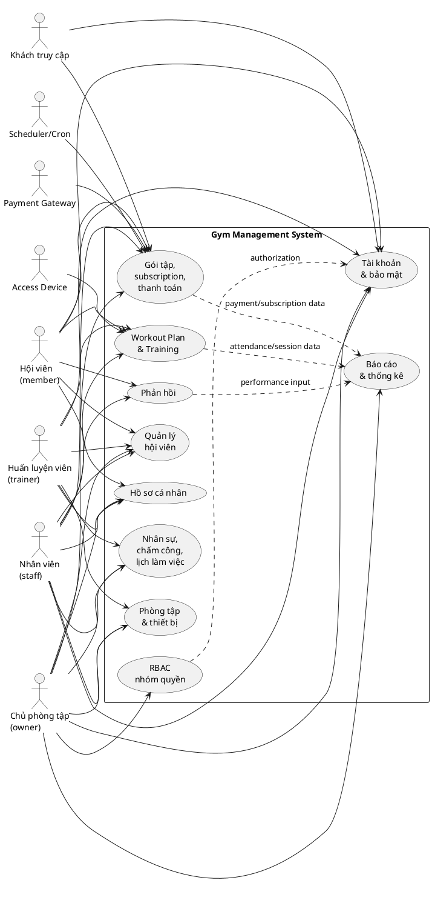
```plantuml
@startuml GMS_Overview_UseCase
left to right direction
skinparam packageStyle rectangle

actor "Khách truy cập" as Guest
actor "Hội viên\n(member)" as Member
actor "Huấn luyện viên\n(trainer)" as Trainer
actor "Nhân viên\n(staff)" as Staff
actor "Chủ phòng tập\n(owner)" as Owner
actor "Payment Gateway" as Payment
actor "Access Device" as Device
actor "Scheduler/Cron" as Scheduler

rectangle "Gym Management System" {
  usecase "Tài khoản\n& bảo mật" as UC_AUTH
  usecase "Hồ sơ cá nhân" as UC_PROFILE
  usecase "Quản lý\nhội viên" as UC_MEMBER
  usecase "Gói tập,\nsubscription,\nthanh toán" as UC_PACKAGE
  usecase "Workout Plan\n& Training" as UC_TRAINING
  usecase "Nhân sự,\nchấm công,\nlịch làm việc" as UC_STAFF
  usecase "Phản hồi" as UC_FEEDBACK
  usecase "Phòng tập\n& thiết bị" as UC_FACILITY
  usecase "Báo cáo\n& thống kê" as UC_REPORT
  usecase "RBAC\nnhóm quyền" as UC_RBAC
}

Guest --> UC_AUTH
Guest --> UC_PACKAGE

Member --> UC_AUTH
Member --> UC_PROFILE
Member --> UC_PACKAGE
Member --> UC_TRAINING
Member --> UC_FEEDBACK
Member --> UC_MEMBER

Trainer --> UC_AUTH
Trainer --> UC_PROFILE
Trainer --> UC_MEMBER
Trainer --> UC_TRAINING
Trainer --> UC_STAFF
Trainer --> UC_FACILITY

Staff --> UC_AUTH
Staff --> UC_PROFILE
Staff --> UC_MEMBER
Staff --> UC_PACKAGE
Staff --> UC_STAFF
Staff --> UC_FEEDBACK
Staff --> UC_FACILITY
Staff --> UC_TRAINING

Owner --> UC_AUTH
Owner --> UC_PROFILE
Owner --> UC_PACKAGE
Owner --> UC_STAFF
Owner --> UC_FACILITY
Owner --> UC_REPORT
Owner --> UC_RBAC
Owner --> UC_MEMBER

Payment --> UC_PACKAGE
Device --> UC_TRAINING
Scheduler --> UC_PACKAGE

UC_PACKAGE ..> UC_REPORT : payment/subscription data
UC_TRAINING ..> UC_REPORT : attendance/session data
UC_FEEDBACK ..> UC_REPORT : performance input
UC_RBAC ..> UC_AUTH : authorization
@enduml
```

### Ràng buộc tổng quan

- Các màn hình sau đăng nhập được bảo vệ theo vai trò: `member`, `trainer`, `staff`, `owner`; riêng luồng đăng ký member, xác thực email và thanh toán ban đầu được mở hoặc bảo vệ theo từng bước nghiệp vụ.
- Với role `member`, các màn hình workout, attendance, progress và feedback chỉ sử dụng được khi hội viên có gói tập đang hoạt động.
- Gói tập hiện tại là **time-based** theo thời hạn sử dụng; attendance chỉ ghi nhận lượt vào/ra, không trừ số buổi.
- Owner là actor duy nhất của nhóm báo cáo tổng hợp và RBAC. Staff có thể vận hành tại quầy nhưng không xem báo cáo doanh thu/quản trị quyền nếu chưa được cấp quyền tương ứng.
- Trainer chỉ xem/quản lý học viên, lịch và tiến độ trong phạm vi được phân công, không quản trị toàn bộ hội viên.

---

## 2.3 Biểu đồ Use Case Phân rã

Các sơ đồ dưới đây dùng PlantUML để có thể dựng lại bằng PlantUML hoặc Astah. Nội dung phân rã bám theo các module hiện có trong project: `auth`, `members`, `packages`, `subscriptions`, `payments`, `payment-accounts`, `staff`, `feedback`, `facility`, `workout`, `training`, `reports`, `rbac`.

### 2.3.1 Phân rã Tài khoản - Bảo mật

Nhóm này bao phủ đăng nhập, phiên người dùng, quên/đặt lại mật khẩu, xác thực email, đổi mật khẩu và đăng ký tài khoản hội viên. Đây là lớp tiền đề cho mọi chức năng cần xác thực người dùng bằng JWT.

**Use case chính:**

| Use case | Actor | Màn hình/chức năng liên quan |
|---|---|---|
| Đăng nhập | Tất cả role | Người dùng nhập thông tin đăng nhập; hệ thống xác thực, tạo phiên đăng nhập và điều hướng theo vai trò. |
| Xem phiên hiện tại | Tất cả role đã đăng nhập | Hệ thống hiển thị trạng thái đăng nhập, vai trò và hồ sơ liên quan để giao diện tải đúng quyền. |
| Đăng xuất | Tất cả role đã đăng nhập | Người dùng kết thúc phiên đăng nhập; giao diện xóa thông tin đăng nhập cục bộ. |
| Quên mật khẩu | Khách truy cập/tất cả role | Màn hình quên mật khẩu tiếp nhận email/số điện thoại và gửi hướng dẫn xác nhận. |
| Đặt lại mật khẩu | Khách truy cập/tất cả role | Màn hình đặt lại mật khẩu cho phép người dùng nhập OTP/token và mật khẩu mới. |
| Xác thực email | Member/Staff mới tạo | Màn hình xác thực email và gửi lại mã xác thực khi người dùng chưa nhận được mã. |
| Đổi mật khẩu | Người dùng đã đăng nhập | Màn hình đổi mật khẩu yêu cầu mật khẩu hiện tại và mật khẩu mới. |
| Đăng ký hội viên online | Khách truy cập | Trang đăng ký hội viên online, màn hình xác thực email và màn hình thanh toán ban đầu. |
| Quản lý hồ sơ cá nhân | Member/Trainer/Staff/Owner | Trang hồ sơ cá nhân theo từng vai trò, cho phép xem và cập nhật thông tin được phép. |

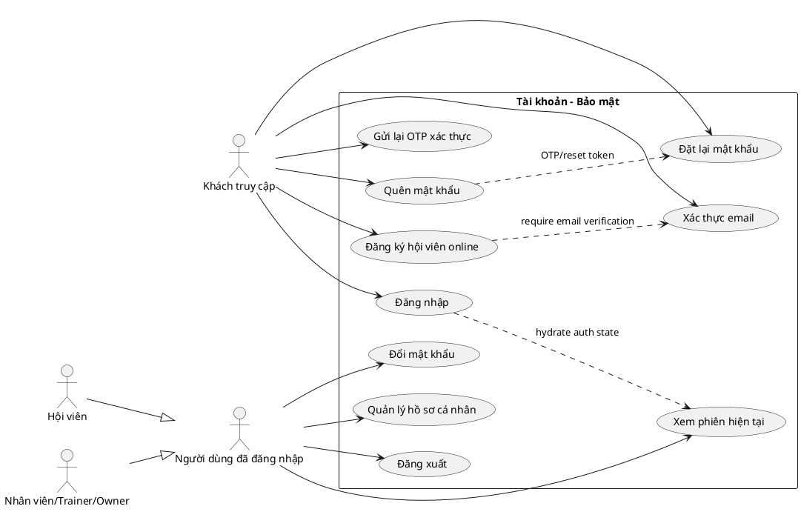
```plantuml
@startuml GMS_Account_Security
left to right direction
skinparam packageStyle rectangle

actor "Khách truy cập" as Guest
actor "Người dùng đã đăng nhập" as User
actor "Hội viên" as Member
actor "Nhân viên/Trainer/Owner" as InternalUser

rectangle "Tài khoản - Bảo mật" {
  usecase "Đăng nhập" as Login
  usecase "Xem phiên hiện tại" as Me
  usecase "Đăng xuất" as Logout
  usecase "Quên mật khẩu" as Forgot
  usecase "Đặt lại mật khẩu" as Reset
  usecase "Xác thực email" as Verify
  usecase "Gửi lại OTP xác thực" as Resend
  usecase "Đổi mật khẩu" as ChangePassword
  usecase "Đăng ký hội viên online" as SelfRegister
  usecase "Quản lý hồ sơ cá nhân" as Profile
}

Guest --> Login
Guest --> Forgot
Guest --> Reset
Guest --> SelfRegister
Guest --> Verify
Guest --> Resend

User --> Me
User --> Logout
User --> ChangePassword
User --> Profile

Member --|> User
InternalUser --|> User

SelfRegister ..> Verify : require email verification
Forgot ..> Reset : OTP/reset token
Login ..> Me : hydrate auth state
@enduml
```

### 2.3.2 Phân rã Quản lý Hội viên

Nhóm này bao phủ quản lý hội viên, hồ sơ cá nhân, gán/chọn trainer, xem học viên của trainer và theo dõi tiến độ luyện tập. Project hiện tách dữ liệu tài khoản (`users`) và dữ liệu hội viên (`members`), nên thao tác hội viên có thể đi qua cả trang tự phục vụ của member lẫn màn hình quản lý của staff/trainer/owner.

**Use case chính:**

| Use case | Actor | Màn hình/chức năng liên quan |
|---|---|---|
| Xem danh sách hội viên | Staff, Trainer, Owner | Màn hình danh sách hội viên có lọc theo vai trò; trainer chỉ thấy học viên mình phụ trách. |
| Tạo hội viên tại quầy | Staff, Owner | Nhân viên nhập thông tin hội viên, chọn gói tập ban đầu và tạo tài khoản/hồ sơ hội viên tại quầy. |
| Xem chi tiết hội viên | Member, Trainer, Staff, Owner | Màn hình chi tiết hồ sơ; member xem chính mình, trainer xem học viên mình phụ trách. |
| Cập nhật hồ sơ hội viên | Member self-field| Member cập nhật các trường được phép trong hồ sơ cá nhân. |
| Gán hoặc bỏ trainer cho hội viên | Staff, Owner, Member chọn trainer | Màn hình phân công trainer và chức năng hội viên tự chọn trainer trong phạm vi được phép. |
| Xem học viên đang huấn luyện | Trainer | Màn hình học viên của trainer, kèm thông tin hồ sơ, lịch tập và tiến độ liên quan. |
| Ghi nhận tiến độ luyện tập | Trainer, Member self-progress | Trainer hoặc hội viên nhập chỉ số cơ thể, ghi chú luyện tập và kết quả theo từng thời điểm. |
| Xem tiến độ luyện tập | Member, Trainer, Staff, Owner | Màn hình tiến độ hiển thị lịch sử chỉ số và biểu đồ theo dõi quá trình luyện tập. |

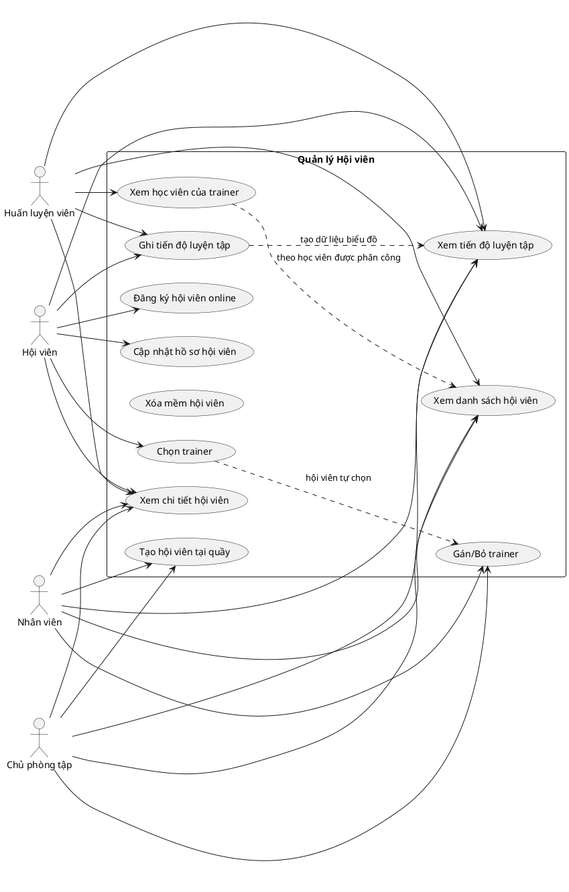
```plantuml
@startuml GMS_Member_Management
left to right direction
skinparam packageStyle rectangle

actor "Hội viên" as Member
actor "Huấn luyện viên" as Trainer
actor "Nhân viên" as Staff
actor "Chủ phòng tập" as Owner

rectangle "Quản lý Hội viên" {
  usecase "Xem danh sách hội viên" as ListMembers
  usecase "Tạo hội viên tại quầy" as CreateMember
  usecase "Đăng ký hội viên online" as SelfRegister
  usecase "Xem chi tiết hội viên" as ViewMember
  usecase "Cập nhật hồ sơ hội viên" as UpdateMember
  usecase "Xóa mềm hội viên" as DeleteMember
  usecase "Gán/Bỏ trainer" as AssignTrainer
  usecase "Chọn trainer" as ChooseTrainer
  usecase "Xem học viên của trainer" as TrainerStudents
  usecase "Ghi tiến độ luyện tập" as RecordProgress
  usecase "Xem tiến độ luyện tập" as ViewProgress
}

Member --> SelfRegister
Member --> ViewMember
Member --> UpdateMember
Member --> ChooseTrainer
Member --> ViewProgress
Member --> RecordProgress

Trainer --> ListMembers
Trainer --> ViewMember
Trainer --> TrainerStudents
Trainer --> RecordProgress
Trainer --> ViewProgress

Staff --> ListMembers
Staff --> CreateMember
Staff --> ViewMember
Staff --> AssignTrainer
Staff --> ViewProgress

Owner --> ListMembers
Owner --> CreateMember
Owner --> ViewMember
Owner --> AssignTrainer
Owner --> ViewProgress

TrainerStudents ..> ListMembers : theo học viên được phân công
ChooseTrainer ..> AssignTrainer : hội viên tự chọn
RecordProgress ..> ViewProgress : tạo dữ liệu biểu đồ
@enduml
```

### 2.3.3 Phân rã Gói tập, Đăng ký gói & Thanh toán

Nhóm này bao phủ danh mục gói tập, gói hội viên đang sử dụng, mua/gia hạn/hủy gói, tài khoản thanh toán, ghi nhận thanh toán và hóa đơn/giao dịch. Đây là luồng tạo doanh thu chính của hệ thống.

**Use case chính:**

| Use case | Actor | Màn hình/chức năng liên quan |
|---|---|---|
| Xem danh sách gói tập | Khách truy cập, Member, Staff, Trainer, Owner | Trang danh mục gói tập công khai và màn hình chọn gói trong các luồng mua/gia hạn. |
| Quản lý gói tập | Owner; Staff nếu được cấp quyền quản lý gói | Màn hình quản trị gói tập cho phép tạo, cập nhật, bật/tắt trạng thái và theo dõi gói đang bán. |
| Xem gói hiện tại | Member, Staff, Owner | Màn hình gói hiện tại hiển thị thời hạn, trạng thái, quyền lợi và thông tin thanh toán liên quan. |
| Xem lịch sử gói đã đăng ký | Member, Staff, Owner | Màn hình lịch sử gói tập cho biết các lần mua, gia hạn, hủy hoặc hết hạn trước đây. |
| Đăng ký/mua gói mới | Member, Staff | Hội viên hoặc nhân viên chọn gói, kiểm tra thông tin và khởi tạo gói ở trạng thái chờ thanh toán. |
| Gia hạn gói hiện tại | Member, Staff | Màn hình gia hạn cho phép chọn thời điểm/chu kỳ gia hạn và chuyển sang bước thanh toán. |
| Hủy gói hiện tại | Member| Màn hình quản lý gói cho phép hủy gói theo điều kiện nghiệp vụ.|
| Quản lý tài khoản thanh toán | Member| Màn hình tài khoản thanh toán lưu thông tin phương thức thanh toán phục vụ các lần mua/gia hạn sau. |
| Ghi nhận thanh toán | Member, Staff, Payment Gateway | Màn hình thanh toán tại quầy/online ghi nhận tiền mặt, thẻ, ví điện tử hoặc kết quả xác nhận từ cổng thanh toán. |
| Xem giao dịch/hóa đơn | Owner, Staff theo nghiệp vụ quầy | Màn hình giao dịch/hóa đơn cho phép tra cứu, lọc và đối soát thanh toán. |
| Quản lý danh sách hóa đơn | Owner, Staff vận hành | Danh sách hóa đơn được tạo sau khi thanh toán, có chức năng lọc, xem chi tiết và phục vụ đối soát. |
| Áp dụng/kích hoạt/hết hạn gói tập | Scheduler, hệ thống sau thanh toán thành công | Cron tự động kích hoạt gói sau khi thanh toán thành công, đồng thời hết hạn hoặc hủy các gói chờ quá lâu. |

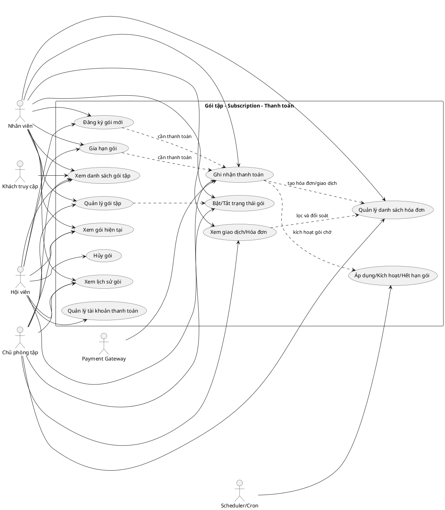
```plantuml
@startuml GMS_Package_Subscription_Payment
left to right direction
skinparam packageStyle rectangle

actor "Khách truy cập" as Guest
actor "Hội viên" as Member
actor "Nhân viên" as Staff
actor "Chủ phòng tập" as Owner
actor "Payment Gateway" as Payment
actor "Scheduler/Cron" as Scheduler

rectangle "Gói tập - Subscription - Thanh toán" {
  usecase "Xem danh sách gói tập" as BrowsePackages
  usecase "Quản lý gói tập" as ManagePackages
  usecase "Bật/Tắt trạng thái gói" as TogglePackage
  usecase "Xem gói hiện tại" as CurrentSub
  usecase "Xem lịch sử gói" as SubHistory
  usecase "Đăng ký gói mới" as CreateSub
  usecase "Gia hạn gói" as RenewSub
  usecase "Hủy gói" as CancelSub
  usecase "Quản lý tài khoản thanh toán" as PaymentAccounts
  usecase "Ghi nhận thanh toán" as CreatePayment
  usecase "Xem giao dịch/Hóa đơn" as ListPayments
  usecase "Quản lý danh sách hóa đơn" as ManageInvoices
  usecase "Áp dụng/Kích hoạt/Hết hạn gói" as SubscriptionCron
}

Guest --> BrowsePackages

Member --> BrowsePackages
Member --> CurrentSub
Member --> SubHistory
Member --> CreateSub
Member --> RenewSub
Member --> CancelSub
Member --> PaymentAccounts
Member --> CreatePayment

Staff --> BrowsePackages
Staff --> CurrentSub
Staff --> SubHistory
Staff --> CreateSub
Staff --> RenewSub
Staff --> CreatePayment
Staff --> ListPayments
Staff --> ManageInvoices
Staff --> ManagePackages
Staff --> TogglePackage

Owner --> BrowsePackages
Owner --> ManagePackages
Owner --> TogglePackage
Owner --> CurrentSub
Owner --> SubHistory
Owner --> ListPayments
Owner --> ManageInvoices

Payment --> CreatePayment
Scheduler --> SubscriptionCron

CreateSub ..> CreatePayment : cần thanh toán
RenewSub ..> CreatePayment : cần thanh toán
CreatePayment ..> ManageInvoices : tạo hóa đơn/giao dịch
ListPayments ..> ManageInvoices : lọc và đối soát
CreatePayment ..> SubscriptionCron : kích hoạt gói chờ
ManagePackages ..> TogglePackage
@enduml
```

### 2.3.4 Phân rã Quản lý Nhân sự, Chấm công & Lịch làm việc

Nhóm này bao phủ tài khoản nhân sự, lịch làm việc, chấm công cá nhân và dữ liệu đánh giá hiệu suất. Project hiện có `staff`, `staff_schedules`, `staff_attendance_logs` và báo cáo hiệu suất trong module `reports`.

**Use case chính:**

| Use case | Actor | Màn hình/chức năng liên quan |
|---|---|---|
| Xem danh sách nhân sự | Owner, Staff có quyền | Màn hình danh sách nhân sự có tìm kiếm, lọc vai trò và xem nhanh trạng thái làm việc. |
| Tạo/cập nhật/xóa nhân sự | Owner | Màn hình quản lý nhân sự cho phép tạo hồ sơ, cập nhật thông tin và ngừng kích hoạt nhân sự. |
| Xem hồ sơ nhân sự cá nhân | Staff, Trainer, Owner | Trang hồ sơ cá nhân theo vai trò, hiển thị thông tin liên hệ, vai trò và thông tin công việc. |
| Xem lịch làm việc cá nhân | Staff, Trainer | Màn hình lịch cá nhân hoặc sidebar/profile hiển thị ca làm và lịch được phân công. |
| Xem lịch tất cả nhân sự | Owner, Staff có quyền | Màn hình lịch tổng hợp giúp theo dõi phân công nhân sự theo ngày/tuần/khoảng thời gian. |
| Quản lý lịch làm việc | Owner, Staff có quyền | Màn hình phân công ca cho phép thêm, cập nhật hoặc xóa lịch làm việc của nhân sự. |
| Chấm công vào/ra | Staff, Owner nếu có staff profile | Chức năng chấm công cá nhân ghi nhận thời điểm vào/ra ca làm việc. |
| Xem lịch sử chấm công cá nhân | Staff, Owner nếu có staff profile | Màn hình lịch sử chấm công hiển thị các lần vào/ra và trạng thái ca làm. |
| Đánh giá hiệu suất làm việc | Owner | Báo cáo dựa trên sessions, attendance, feedback, revenue/operation data. |

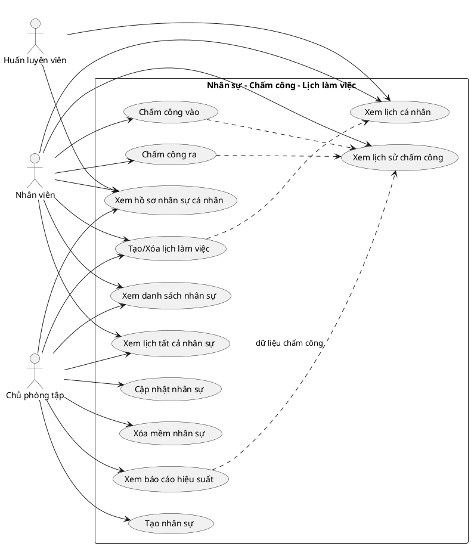
```plantuml
@startuml GMS_Staff_HR
left to right direction
skinparam packageStyle rectangle

actor "Nhân viên" as Staff
actor "Huấn luyện viên" as Trainer
actor "Chủ phòng tập" as Owner

rectangle "Nhân sự - Chấm công - Lịch làm việc" {
  usecase "Xem danh sách nhân sự" as ListStaff
  usecase "Tạo nhân sự" as CreateStaff
  usecase "Cập nhật nhân sự" as UpdateStaff
  usecase "Xóa mềm nhân sự" as DeleteStaff
  usecase "Xem hồ sơ nhân sự cá nhân" as StaffMe
  usecase "Xem lịch cá nhân" as PersonalSchedule
  usecase "Xem lịch tất cả nhân sự" as AllSchedules
  usecase "Tạo/Xóa lịch làm việc" as ManageSchedules
  usecase "Chấm công vào" as CheckIn
  usecase "Chấm công ra" as CheckOut
  usecase "Xem lịch sử chấm công" as AttendanceHistory
  usecase "Xem báo cáo hiệu suất" as PerformanceReport
}

Staff --> StaffMe
Staff --> PersonalSchedule
Staff --> CheckIn
Staff --> CheckOut
Staff --> AttendanceHistory
Staff --> ListStaff
Staff --> AllSchedules
Staff --> ManageSchedules

Trainer --> StaffMe
Trainer --> PersonalSchedule

Owner --> ListStaff
Owner --> CreateStaff
Owner --> UpdateStaff
Owner --> DeleteStaff
Owner --> StaffMe
Owner --> AllSchedules
Owner --> ManageSchedules
Owner --> PerformanceReport

ManageSchedules ..> PersonalSchedule
CheckIn ..> AttendanceHistory
CheckOut ..> AttendanceHistory
PerformanceReport ..> AttendanceHistory : dữ liệu chấm công
@enduml
```

### 2.3.5 Phân rã Phản hồi

Nhóm này bao phủ việc hội viên gửi phản hồi và nhân viên/chủ phòng tập xử lý phản hồi. Project hỗ trợ feedback theo loại `staff`, `equipment`, `service`, có trạng thái `open`, `in_progress`, `resolved`, `rejected` và có thể xóa mềm.

**Use case chính:**

| Use case | Actor | Màn hình/chức năng liên quan |
|---|---|---|
| Gửi phản hồi | Member| Màn hình gửi phản hồi cho phép chọn loại phản hồi, nhập nội dung và đính kèm thông tin nhân sự/thiết bị liên quan nếu có. |
| Xem phản hồi của tôi | Member | Màn hình phản hồi cá nhân hiển thị các phản hồi đã gửi và trạng thái xử lý. |
| Xem danh sách/chi tiết phản hồi | Staff, Owner | Màn hình quản lý phản hồi cho phép lọc danh sách, xem chi tiết nội dung và lịch sử xử lý. |
| Phân công xử lý phản hồi | Staff, Owner | Chức năng phân công người phụ trách để chuyển phản hồi vào luồng xử lý. |
| Cập nhật trạng thái xử lý | Staff, Owner | Chức năng cập nhật trạng thái phản hồi từ mới tiếp nhận đến đang xử lý, đã xử lý hoặc từ chối. |
| Xóa phản hồi | Member | Màn hình xem phản hồi của member cho phép xóa phản hồi khi cần.|

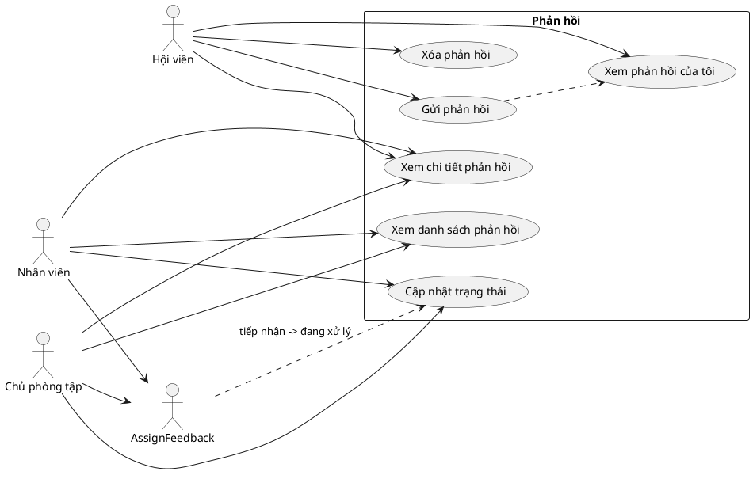
```plantuml
@startuml GMS_Feedback
left to right direction
skinparam packageStyle rectangle

actor "Hội viên" as Member
actor "Nhân viên" as Staff
actor "Chủ phòng tập" as Owner

rectangle "Phản hồi" {
  usecase "Gửi phản hồi" as CreateFeedback
  usecase "Xem phản hồi của tôi" as MyFeedback
  usecase "Xem danh sách phản hồi" as ListFeedback
  usecase "Xem chi tiết phản hồi" as FeedbackDetail
  usecase "Cập nhật trạng thái" as UpdateStatus
  usecase "Xóa phản hồi" as DeleteFeedback
}

Member --> CreateFeedback
Member --> MyFeedback
Member --> FeedbackDetail
Member --> DeleteFeedback

Staff --> ListFeedback
Staff --> FeedbackDetail
Staff --> AssignFeedback
Staff --> UpdateStatus


Owner --> ListFeedback
Owner --> FeedbackDetail
Owner --> AssignFeedback
Owner --> UpdateStatus

AssignFeedback ..> UpdateStatus : tiếp nhận -> đang xử lý
CreateFeedback ..> MyFeedback
@enduml
```

### 2.3.6 Phân rã Thiết bị & Phòng tập

Nhóm này bao phủ quản lý phòng tập, quản lý thiết bị và nhật ký bảo trì. Project dùng module `facility` với các dữ liệu phòng, thiết bị và bảo trì; phòng được dùng để xếp lịch training session, thiết bị có thể là đối tượng phản hồi/bảo trì.

**Use case chính:**

| Use case | Actor | Màn hình/chức năng liên quan |
|---|---|---|
| Quản lý phòng tập | Staff, Owner | Màn hình phòng tập cho phép xem danh sách, thêm phòng mới, cập nhật thông tin và ngừng sử dụng phòng. |
| Tra cứu phòng để lập lịch | Trainer | Chức năng chọn phòng khả dụng khi tạo hoặc điều chỉnh training session. |
| Quản lý thiết bị | Staff, Owner | Màn hình thiết bị cho phép xem danh sách, thêm thiết bị, cập nhật thông tin và ngừng sử dụng thiết bị. |
| Xem lịch sử bảo trì thiết bị | Staff, Owner| Màn hình chi tiết thiết bị hiển thị các lần báo hỏng, sửa chữa và kết quả bảo trì. |
| Báo hỏng thiết bị | Staff, Owner | Màn hình nhập mô tả sự cố, mức độ ảnh hưởng và tạo yêu cầu bảo trì. |
| Cập nhật trạng thái bảo trì | Staff, Owner | Màn hình bảo trì cho phép chuyển trạng thái xử lý, ghi chú kết quả và thời điểm hoàn tất. |
| Liên kết phản hồi thiết bị | Member, Staff, Owner | Phản hồi liên quan đến thiết bị có thể tham chiếu thiết bị cụ thể để nhân viên theo dõi và bảo trì. |

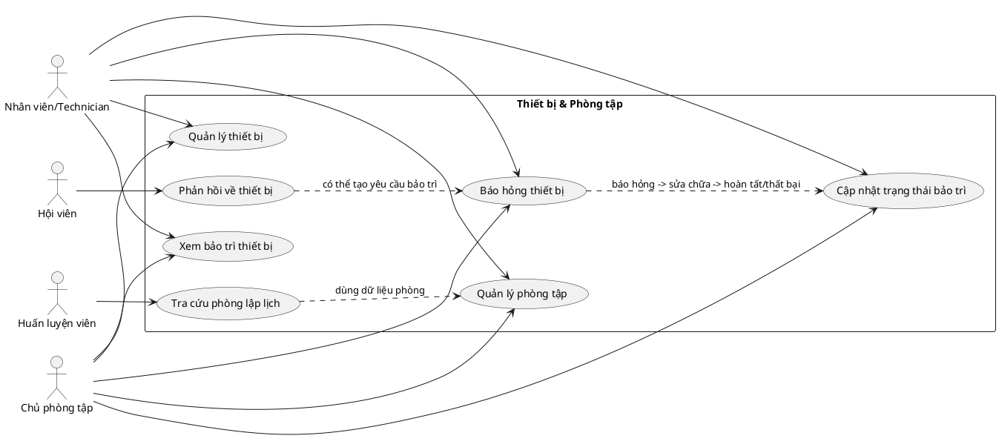
```plantuml
@startuml GMS_Facility
left to right direction
skinparam packageStyle rectangle

actor "Hội viên" as Member
actor "Huấn luyện viên" as Trainer
actor "Nhân viên/Technician" as Staff
actor "Chủ phòng tập" as Owner

rectangle "Thiết bị & Phòng tập" {
  usecase "Quản lý phòng tập" as RoomCrud
  usecase "Tra cứu phòng lập lịch" as RoomLookup
  usecase "Quản lý thiết bị" as EquipmentCrud
  usecase "Xem bảo trì thiết bị" as MaintenanceRead
  usecase "Báo hỏng thiết bị" as MaintenanceReport
  usecase "Cập nhật trạng thái bảo trì" as MaintenanceResolve
  usecase "Phản hồi về thiết bị" as EquipmentFeedback
}

Member --> EquipmentFeedback

Trainer --> RoomLookup

Staff --> RoomCrud
Staff --> EquipmentCrud
Staff --> MaintenanceRead
Staff --> MaintenanceReport
Staff --> MaintenanceResolve

Owner --> RoomCrud
Owner --> EquipmentCrud
Owner --> MaintenanceRead
Owner --> MaintenanceReport
Owner --> MaintenanceResolve

EquipmentFeedback ..> MaintenanceReport : có thể tạo yêu cầu bảo trì
RoomLookup ..> RoomCrud : dùng dữ liệu phòng
MaintenanceReport ..> MaintenanceResolve : báo hỏng -> sửa chữa -> hoàn tất/thất bại
@enduml
```

### 2.3.7 Phân rã Workout Plan & Training

Nhóm này là phần vận hành tập luyện. Project đã tách rõ thư viện bài tập, workout plan, plan được giao cho hội viên, nhật ký buổi tập, training session, attendance và tiến độ.

**Use case chính:**

| Use case | Actor | Màn hình/chức năng liên quan |
|---|---|---|
| Xem thư viện bài tập | Member, Trainer| Màn hình thư viện bài tập cho phép xem, tìm kiếm và tra cứu hướng dẫn bài tập. |
| Quản lý bài tập | Trainer | Màn hình quản lý bài tập cho phép thêm, chỉnh sửa, ẩn/xóa bài tập theo quyền được cấp. |
| Quản lý workout plan | Trainer, Member với plan tự tạo | Trainer hoặc member tạo, chỉnh sửa và quản lý workout plan trong phạm vi được phép. |
| Xây dựng giáo án/plan theo ngày và bài tập | Trainer, Member | Màn hình dựng plan cho phép chia ngày tập, chọn bài tập, số hiệp, số lần và ghi chú kỹ thuật. |
| Giao workout plan cho hội viên | Trainer | Trainer chọn hội viên, chọn workout plan phù hợp và giao plan để hội viên theo dõi. |
| Xem plan PT giao | Member | Màn hình plan được giao hiển thị lịch tập, bài tập và hướng dẫn từ trainer. |
| Áp dụng/bắt đầu plan | Member | Hội viên bắt đầu một buổi tập từ plan được giao hoặc plan tự tạo; hệ thống khởi tạo nhật ký buổi tập. |
| Điều chỉnh plan | Trainer với plan do nhân sự tạo, Member với plan tự tạo | Hệ thống không cho chỉnh sửa phần đã có lịch sử tập để bảo toàn dữ liệu theo dõi. |
| Ghi nhận kết quả buổi tập | Member | Hội viên nhập kết quả buổi tập, cảm nhận, số hiệp/số lần hoàn thành và ghi chú nếu có. |
| Lập lịch training session | Trainer | Màn hình lập lịch cho phép chọn hội viên, trainer, phòng tập, thời gian và nội dung buổi tập. |
| Xem lịch tập | Member, Trainer| Màn hình lịch tập hiển thị các buổi đã lên lịch, trạng thái và thông tin liên quan. |
| Check-in hội viên | Access Device, Staff, Member xem log | Thiết bị kiểm soát ra/vào gửi thông tin check-in của hội viên về hệ thống. Hệ thống kiểm tra quyền truy cập và tự động ghi nhận lượt vào phòng tập; nhân viên có thể hỗ trợ check-in thủ công khi cần. |
| Ghi và xem tiến độ | Trainer, Member | Kết nối với nhóm Hội viên ở 2.3.2. |

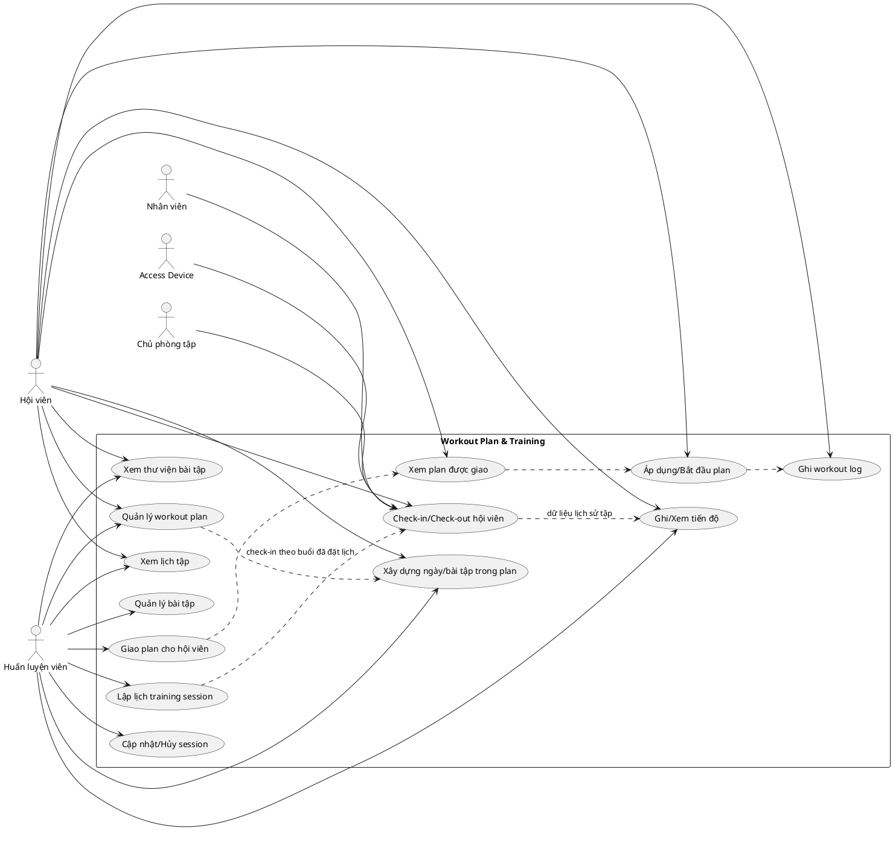
```plantuml
@startuml GMS_Workout_Training
left to right direction
skinparam packageStyle rectangle

actor "Hội viên" as Member
actor "Huấn luyện viên" as Trainer
actor "Nhân viên" as Staff
actor "Chủ phòng tập" as Owner
actor "Access Device" as Device

rectangle "Workout Plan & Training" {
  usecase "Xem thư viện bài tập" as ExerciseRead
  usecase "Quản lý bài tập" as ExerciseCrud
  usecase "Quản lý workout plan" as PlanCrud
  usecase "Xây dựng ngày/bài tập trong plan" as PlanBuilder
  usecase "Giao plan cho hội viên" as AssignPlan
  usecase "Xem plan được giao" as ViewAssignedPlan
  usecase "Áp dụng/Bắt đầu plan" as ApplyPlan
  usecase "Ghi workout log" as WorkoutLog
  usecase "Lập lịch training session" as CreateSession
  usecase "Cập nhật/Hủy session" as ManageSession
  usecase "Xem lịch tập" as ViewSchedule
  usecase "Check-in/Check-out hội viên" as Attendance
  usecase "Ghi/Xem tiến độ" as Progress
}

Member --> ExerciseRead
Member --> PlanCrud
Member --> PlanBuilder
Member --> ViewAssignedPlan
Member --> ApplyPlan
Member --> WorkoutLog
Member --> ViewSchedule
Member --> Attendance
Member --> Progress

Trainer --> ExerciseRead
Trainer --> ExerciseCrud
Trainer --> PlanCrud
Trainer --> PlanBuilder
Trainer --> AssignPlan
Trainer --> CreateSession
Trainer --> ManageSession
Trainer --> ViewSchedule
Trainer --> Progress

Staff --> Attendance

Owner --> Attendance

Device --> Attendance

PlanCrud ..> PlanBuilder
AssignPlan ..> ViewAssignedPlan
ViewAssignedPlan ..> ApplyPlan
ApplyPlan ..> WorkoutLog
CreateSession ..> Attendance : check-in theo buổi đã đặt lịch
Attendance ..> Progress : dữ liệu lịch sử tập
@enduml
```

### 2.3.8 Phân rã Báo cáo & Thống kê

Nhóm này phục vụ Owner trong việc theo dõi doanh thu, hội viên mới, tỷ lệ gia hạn, gói bán chạy và hiệu suất nhân viên/trainer. Dữ liệu báo cáo vẫn đọc từ `payments`, `subscriptions`, `members`, `training_sessions`, `feedback`, `staff_attendance_logs` và các bảng liên quan; phần xem giao dịch, hóa đơn và ghi nhận thanh toán thuộc nhóm 2.3.3 Gói tập, Đăng ký gói & Thanh toán.

**Use case chính:**

| Use case | Actor | Màn hình/chức năng liên quan |
|---|---|---|
| Xem doanh thu | Owner | Dashboard doanh thu theo thời gian, nguồn thanh toán và các chỉ số tổng hợp. |
| Xem hội viên mới | Owner | Báo cáo số hội viên mới theo khoảng thời gian, kênh đăng ký và gói đã chọn. |
| Xem tỷ lệ gia hạn | Owner | Báo cáo tỷ lệ hội viên gia hạn, hủy gói hoặc để gói hết hạn. |
| Xem gói bán chạy | Owner | Báo cáo xếp hạng gói tập theo số lượt mua/gia hạn và doanh thu. |
| Xem báo cáo hiệu suất nhân viên | Owner | Báo cáo hiệu suất vận hành dựa trên chấm công, xử lý phản hồi, giao dịch và dữ liệu liên quan. |
| Xem báo cáo hiệu suất trainer/staff | Owner | Báo cáo hiệu suất trainer/staff có lọc theo nhân sự, thời gian và chỉ số đánh giá. |

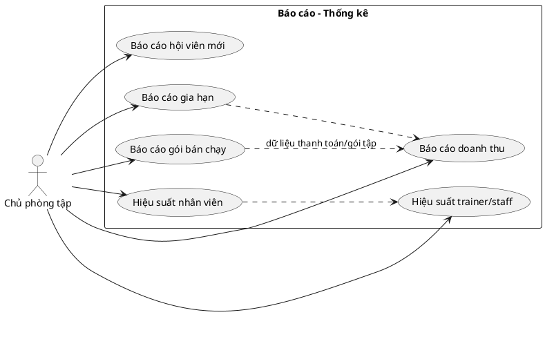
```plantuml
@startuml GMS_Reports_Statistics
left to right direction
skinparam packageStyle rectangle

actor "Chủ phòng tập" as Owner

rectangle "Báo cáo - Thống kê" {
  usecase "Báo cáo doanh thu" as Revenue
  usecase "Báo cáo hội viên mới" as MembersReport
  usecase "Báo cáo gia hạn" as Renewals
  usecase "Báo cáo gói bán chạy" as TopPackages
  usecase "Hiệu suất nhân viên" as EmployeePerformance
  usecase "Hiệu suất trainer/staff" as StaffPerformance
}

Owner --> Revenue
Owner --> MembersReport
Owner --> Renewals
Owner --> TopPackages
Owner --> EmployeePerformance
Owner --> StaffPerformance

Renewals ..> Revenue
TopPackages ..> Revenue : dữ liệu thanh toán/gói tập
EmployeePerformance ..> StaffPerformance
@enduml
```

### 2.3.9 Phân rã Quản lý Phân quyền RBAC

Nhóm này phục vụ Owner trong quản lý phân quyền. Project hiện hỗ trợ quản lý nhóm quyền, gán/gỡ quyền cho nhóm, quản lý người dùng và gán/gỡ nhóm cho người dùng. Riêng danh mục permission hiện là **chỉ đọc** trên giao diện/hệ thống; việc thêm/sửa/xóa permission khi chạy chưa được hỗ trợ trực tiếp, mà được quản lý qua seed/migration.

**Use case chính:**

| Use case | Actor | Màn hình/chức năng liên quan |
|---|---|---|
| Xem danh mục quyền | Owner | Màn hình danh mục quyền hiển thị các permission hiện có và ghi rõ trạng thái chỉ đọc. |
| Xem chi tiết quyền | Owner | Màn hình chi tiết quyền cho biết tên quyền, mô tả và phạm vi áp dụng. |
| Quản lý nhóm quyền | Owner | Màn hình nhóm quyền cho phép tạo, xem, cập nhật và ngừng sử dụng nhóm quyền. |
| Gán quyền cho nhóm | Owner | Owner chọn nhóm quyền và bổ sung các permission phù hợp với phạm vi trách nhiệm của nhóm. |
| Gỡ quyền khỏi nhóm | Owner | Owner loại bỏ permission khỏi nhóm khi nhóm không còn cần quyền đó. |
| Xem danh sách người dùng | Owner | Màn hình người dùng cho phép tra cứu tài khoản, vai trò và trạng thái hoạt động. |
| Cập nhật/xóa người dùng | Owner | Owner cập nhật thông tin tài khoản hoặc ngừng kích hoạt người dùng theo quy trình quản trị. |
| Gán nhóm cho người dùng | Owner | Owner thêm người dùng vào nhóm quyền để cấp bộ quyền tương ứng. |
| Gỡ nhóm khỏi người dùng | Owner | Owner gỡ người dùng khỏi nhóm quyền khi vai trò hoặc phạm vi công việc thay đổi. |

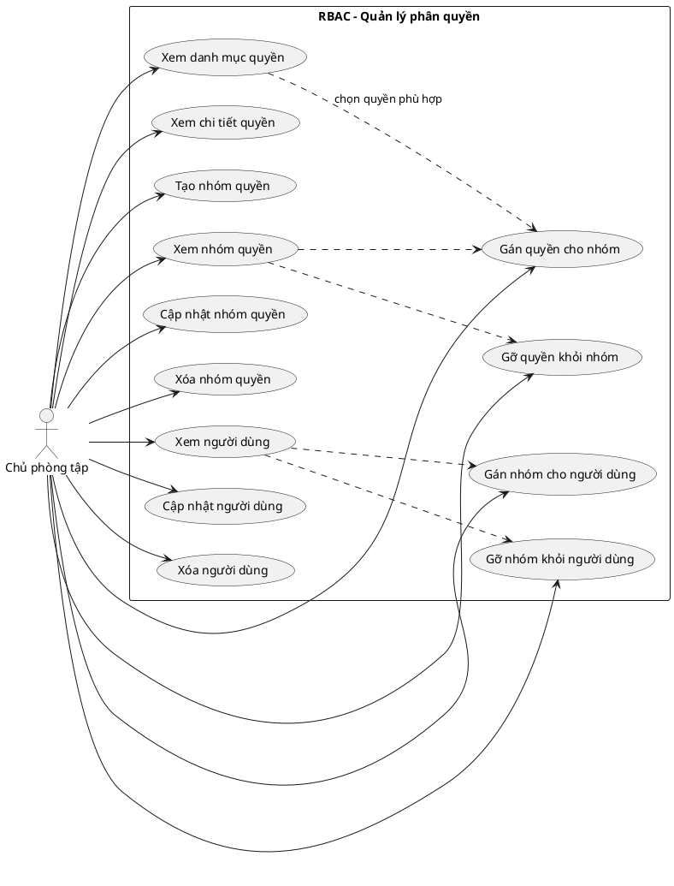
```plantuml
@startuml GMS_RBAC
left to right direction
skinparam packageStyle rectangle

actor "Chủ phòng tập" as Owner

rectangle "RBAC - Quản lý phân quyền" {
  usecase "Xem danh mục quyền" as PermissionList
  usecase "Xem chi tiết quyền" as PermissionDetail
  usecase "Tạo nhóm quyền" as GroupCreate
  usecase "Xem nhóm quyền" as GroupRead
  usecase "Cập nhật nhóm quyền" as GroupUpdate
  usecase "Xóa nhóm quyền" as GroupDelete
  usecase "Gán quyền cho nhóm" as AssignPermission
  usecase "Gỡ quyền khỏi nhóm" as RevokePermission
  usecase "Xem người dùng" as UserRead
  usecase "Cập nhật người dùng" as UserUpdate
  usecase "Xóa người dùng" as UserDelete
  usecase "Gán nhóm cho người dùng" as AssignGroup
  usecase "Gỡ nhóm khỏi người dùng" as RevokeGroup
}

Owner --> PermissionList
Owner --> PermissionDetail
Owner --> GroupCreate
Owner --> GroupRead
Owner --> GroupUpdate
Owner --> GroupDelete
Owner --> AssignPermission
Owner --> RevokePermission
Owner --> UserRead
Owner --> UserUpdate
Owner --> UserDelete
Owner --> AssignGroup
Owner --> RevokeGroup

PermissionList ..> AssignPermission : chọn quyền phù hợp
GroupRead ..> AssignPermission
GroupRead ..> RevokePermission
UserRead ..> AssignGroup
UserRead ..> RevokeGroup
@enduml
```

---

## 2.4 Quy trình Nghiệp vụ

Phần này mô tả các luồng nghiệp vụ cấp tiến trình, bám theo phạm vi use case ở 2.3, các đặc tả chi tiết ở Chương 3 và cấu trúc module hiện có của project. Các luồng có thể do Owner, Staff, Trainer hoặc Member thực hiện tùy quyền RBAC; mọi thao tác làm thay đổi dữ liệu quan trọng cần ghi nhận audit log.

### 2.4.1 Quy trình Đăng nhập - Đăng xuất

**Tác nhân:** Owner, Staff, Trainer, Member.

**Luồng chính:**
1. Người dùng truy cập một trang đăng nhập chung và nhập email, mật khẩu.
2. Hệ thống xác thực thông tin đăng nhập, kiểm tra trạng thái tài khoản (`active`, `locked`, `pending_verification`) và lấy danh sách nhóm quyền của người dùng.
3. Nếu đăng nhập hợp lệ, hệ thống phát hành JWT kèm `roles`, `staffId` hoặc `memberId` nếu có.
4. Giao diện điều hướng theo vai trò:
   - Owner: chuyển đến dashboard quản lý Owner.
   - Staff: chuyển đến dashboard vận hành của Staff.
   - Trainer: chuyển đến dashboard quản lý lịch dạy, hội viên và workout plan.
   - Member: hệ thống kiểm tra gói tập còn hiệu lực trước khi cho vào dashboard.
5. Với Member, nếu chưa có gói tập, gói đang chờ thanh toán, gói đã hủy hoặc gói active nhưng hết hạn, hệ thống chuyển đến màn hình đăng ký gói tập. Nếu có gói tập đang có hiệu lực và còn hạn, hệ thống cho phép truy cập dashboard Member.
6. Khi người dùng đăng xuất, client xóa token phiên hiện tại, gọi logout để ghi nhận sự kiện nếu cần, sau đó chuyển về HomePage.

**Luồng ngoại lệ:**
- Sai email/mật khẩu: hệ thống trả lỗi đăng nhập chung, không tiết lộ tài khoản có tồn tại hay không.
- Tài khoản `locked`: hệ thống từ chối đăng nhập và hướng dẫn liên hệ quản trị.
- Tài khoản `pending_verification`: hệ thống yêu cầu xác thực email trước khi đăng nhập đầy đủ.

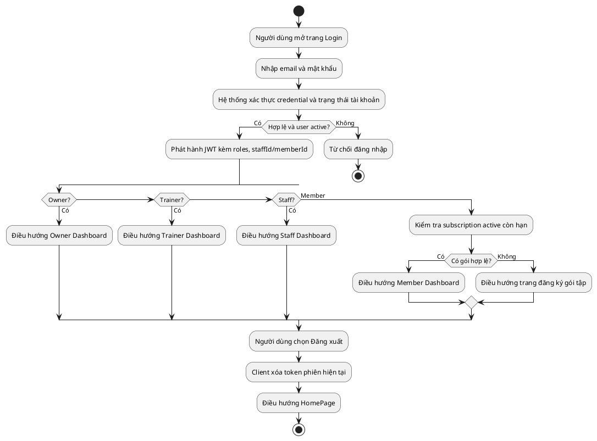
```plantuml
@startuml GMS_Process_Login_Logout
start
:Người dùng mở trang Login;
:Nhập email và mật khẩu;
:Hệ thống xác thực credential và trạng thái tài khoản;

if (Hợp lệ và user active?) then (Có)
  :Phát hành JWT kèm roles, staffId/memberId;
else (Không)
  :Từ chối đăng nhập;
  stop
endif

if (Owner?) then (Có)
  :Điều hướng Owner Dashboard;
elseif (Trainer?) then (Có)
  :Điều hướng Trainer Dashboard;
elseif (Staff?) then (Có)
  :Điều hướng Staff Dashboard;
else (Member)
  :Kiểm tra subscription active còn hạn;
  if (Có gói hợp lệ?) then (Có)
    :Điều hướng Member Dashboard;
  else (Không)
    :Điều hướng trang đăng ký gói tập;
  endif
endif

:Người dùng chọn Đăng xuất;
:Client xóa token phiên hiện tại;
:Điều hướng HomePage;
stop
@enduml
```

### 2.4.2 Quy trình Quản lý Hồ sơ cá nhân

**Tác nhân:** Owner, Staff, Trainer, Member.

**Luồng chính:**
1. Người dùng đã đăng nhập mở màn hình hồ sơ cá nhân.
2. Hệ thống hiển thị thông tin tài khoản hiện tại gồm họ tên, email, số điện thoại, trạng thái tài khoản, nhóm quyền và mã hồ sơ tương ứng (`staffId` hoặc `memberId`) nếu có.
3. Người dùng chỉnh sửa các thông tin được phép thay đổi như họ tên, số điện thoại, ảnh đại diện hoặc thông tin hồ sơ cá nhân liên quan.
4. Trước khi lưu, hệ thống yêu cầu xác nhận thay đổi và validate các trường bắt buộc, định dạng email/SĐT, độ dài dữ liệu.
5. Hệ thống cập nhật hồ sơ, ghi audit log cho các trường thay đổi và hiển thị thông báo thành công.
6. Nếu đổi mật khẩu, người dùng phải nhập mật khẩu hiện tại và mật khẩu mới. Hệ thống kiểm tra mật khẩu hiện tại, hash mật khẩu mới và ghi log sự kiện `auth.change-password`.

**Quy tắc nghiệp vụ:**
- Người dùng được xem và cập nhật hồ sơ của chính mình mà không cần quyền quản trị bổ sung.
- Người dùng không được tự thay đổi `status`, nhóm quyền hoặc quyền chức năng của chính mình.
- Với tài khoản không dùng mật khẩu nội bộ, hệ thống có thể từ chối đổi mật khẩu và yêu cầu dùng phương thức đăng nhập tương ứng.

### 2.4.3 Quy trình Đăng ký Hội viên

Quy trình đăng ký hội viên có hai kênh: Member tự đăng ký online và Staff đăng ký tại quầy. Dù đăng ký theo kênh nào, hội viên mới phải có gói tập hợp lệ sau khi hoàn tất thì mới được truy cập đầy đủ các tính năng Member.

**Luồng đăng ký online:**
1. Khách truy cập trang đăng ký, nhập thông tin cá nhân, email, số điện thoại và mật khẩu.
2. Hệ thống kiểm tra dữ liệu, đảm bảo email/SĐT chưa được sử dụng.
3. Hệ thống tạo `users` với `status='pending_verification'`, tạo `members`, sinh `member_code` và gán group `member`.
4. Hệ thống gửi OTP/link xác thực email.
5. Sau khi xác thực email thành công, tài khoản chuyển sang `active`.
6. Hội viên chọn gói tập, chọn trainer nếu gói có PT, tiến hành thanh toán.
7. Khi thanh toán thành công, subscription được kích hoạt và hội viên được chuyển vào dashboard Member.

**Luồng đăng ký tại quầy:**
1. Staff nhập thông tin khách hàng vào form đăng ký.
2. Hệ thống kiểm tra email/SĐT trùng lặp và validate dữ liệu.
3. Staff chọn gói tập, phương thức thanh toán và trainer nếu gói có PT.
4. Sau khi thu tiền hoặc xác nhận giao dịch thành công, hệ thống tạo user, member, subscription active, payment success trong một giao dịch nghiệp vụ.
5. Hệ thống in/hiển thị biên lai, ghi audit log với Staff là người thực hiện và cung cấp thông tin đăng nhập/xác thực email cho hội viên.

**Quy tắc nghiệp vụ:**
- Đăng ký online có thể tạo subscription `pending` trước, nhưng Member chỉ được vào dashboard sau khi email đã xác thực và gói tập đã thanh toán/kích hoạt.
- Đăng ký tại quầy được xem là Staff đã đối soát khách trực tiếp; hệ thống vẫn cần tạo tài khoản và ghi nhận lịch sử thanh toán rõ ràng.
- Nếu thanh toán thất bại, hệ thống giữ hoặc hủy yêu cầu theo trạng thái hiện tại, cho phép thử lại hoặc chọn phương thức thanh toán khác.

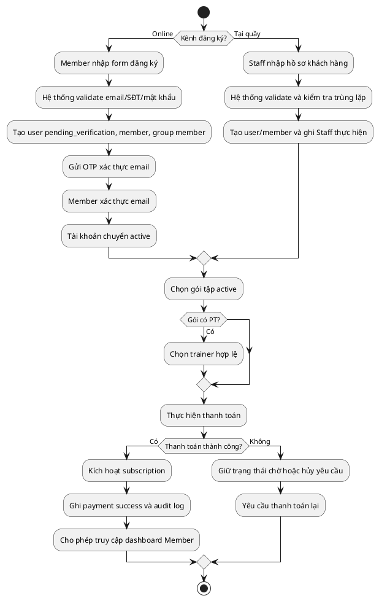
```plantuml
@startuml GMS_Process_Member_Registration
start
if (Kênh đăng ký?) then (Online)
  :Member nhập form đăng ký;
  :Hệ thống validate email/SĐT/mật khẩu;
  :Tạo user pending_verification, member, group member;
  :Gửi OTP xác thực email;
  :Member xác thực email;
  :Tài khoản chuyển active;
else (Tại quầy)
  :Staff nhập hồ sơ khách hàng;
  :Hệ thống validate và kiểm tra trùng lặp;
  :Tạo user/member và ghi Staff thực hiện;
endif

:Chọn gói tập active;
if (Gói có PT?) then (Có)
  :Chọn trainer hợp lệ;
endif
:Thực hiện thanh toán;
if (Thanh toán thành công?) then (Có)
  :Kích hoạt subscription;
  :Ghi payment success và audit log;
  :Cho phép truy cập dashboard Member;
else (Không)
  :Giữ trạng thái chờ hoặc hủy yêu cầu;
  :Yêu cầu thanh toán lại;
endif
stop
@enduml
```

### 2.4.4 Quy trình Quản lý gói tập của hội viên

Quy trình này bao gồm đăng ký gói mới, gia hạn, hủy gói và xem lịch sử gói đã đăng ký. Member có thể tự thực hiện online; Staff có thể thực hiện thay Member tại quầy theo quyền được cấp.

**Đăng ký gói mới:**
1. Member/Staff mở danh sách gói tập đang kinh doanh (gói tập đang có hiệu lực và chưa bị xóa).
2. Hệ thống kiểm tra Member hiện có subscription `pending` hoặc subscription `active` còn hạn hay không.
3. Nếu đã có gói đang hoạt động hoặc đang chờ kích hoạt, hệ thống từ chối đăng ký gói khác. Member phải hủy gói hiện tại hoặc đợi gói hết hạn trước khi đăng ký gói mới.
4. Member/Staff chọn gói. Nếu gói chứa trainer/PT, hệ thống yêu cầu chọn trainer/PT hợp lệ trong danh sách Staff có vị trí trainer/PT.
5. Hệ thống tạo subscription theo ngày bắt đầu tính theo thời điểm đăng kí hiện tại, ngày kết thúc tính theo thời hạn gói và trạng thái ban đầu phù hợp với luồng thanh toán.
6. Sau khi thanh toán thành công, hệ thống kích hoạt gói nếu không còn gói active khác; cập nhật `primaryTrainerId` nếu có trainer.

**Gia hạn gói:**
1. Member/Staff chọn subscription đang có hiệu lực.
2. Hệ thống hiển thị thông tin gói, ngày hết hạn hiện tại, số ngày gia hạn và số tiền cần thanh toán.
3. Sau khi thanh toán thành công, hệ thống tạo payment success và cộng thêm thời hạn gói vào ngày hết hạn hiện tại.
4. Lịch sử gia hạn được ghi vào payment/subscription history và audit log.

**Hủy gói:**
1. Member/Staff chọn gói đang có hiệu lực và yêu cầu hủy.
2. Hệ thống hiển thị cảnh báo: hủy gói làm dừng quyền lợi ngay và không hoàn tiền.
3. Sau khi xác nhận, hệ thống chuyển trạng thái subscription sang Đã hủy, ghi lại thời gian hủy, dừng quyền lợi Member, cập nhật ngày kết thúc hiệu lực hiển thị về ngày hủy và đưa Member về trang đăng ký gói tập.
4. Nếu gói có trainer, hệ thống bỏ gán trainer chính cho Member. Dữ liệu nghiệp vụ dùng thời gian hủy hoặc trường ngày kết thúc tương ứng để thể hiện gói đã hết hiệu lực ngay trong ngày hủy.

**Xem lịch sử gói tập:**
- Member xem lịch sử gói, trạng thái, trainer, ngày bắt đầu/kết thúc và các lần thanh toán của chính mình.
- Staff xem lịch sử theo quyền quản lý.
- Trainer chỉ xem được gói và thanh toán của Member thuộc phạm vi phụ trách.

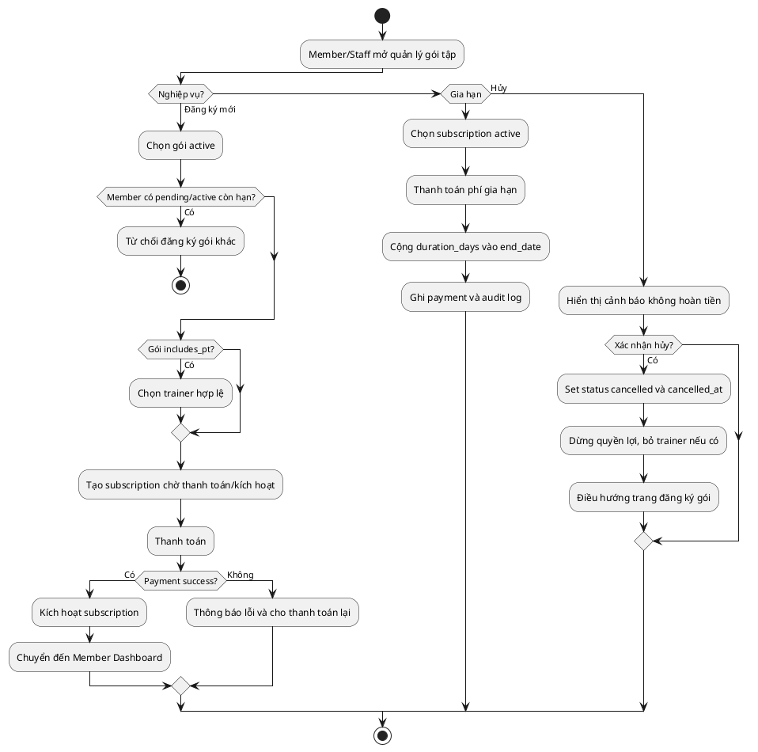
```plantuml
@startuml GMS_Process_Subscription_Lifecycle
start
:Member/Staff mở quản lý gói tập;
if (Nghiệp vụ?) then (Đăng ký mới)
  :Chọn gói active;
  if (Member có pending/active còn hạn?) then (Có)
    :Từ chối đăng ký gói khác;
    stop
  endif
  if (Gói includes_pt?) then (Có)
    :Chọn trainer hợp lệ;
  endif
  :Tạo subscription chờ thanh toán/kích hoạt;
  :Thanh toán;
  if (Payment success?) then (Có)
    :Kích hoạt subscription;
    :Chuyển đến Member Dashboard;
  else (Không)
    :Thông báo lỗi và cho thanh toán lại;
  endif
elseif (Gia hạn)
  :Chọn subscription active;
  :Thanh toán phí gia hạn;
  :Cộng duration_days vào end_date;
  :Ghi payment và audit log;
else (Hủy)
  :Hiển thị cảnh báo không hoàn tiền;
  if (Xác nhận hủy?) then (Có)
    :Set status cancelled và cancelled_at;
    :Dừng quyền lợi, bỏ trainer nếu có;
    :Điều hướng trang đăng ký gói;
  endif
endif
stop
@enduml
```

### 2.4.5 Quy trình Quản lý Hội viên tại quầy

**Tác nhân:** Staff, Owner.

**Luồng chính:**
1. Staff tìm kiếm hội viên theo mã hội viên, tên, email, SĐT, trạng thái tài khoản hoặc trạng thái gói.
2. Hệ thống hiển thị trang chi tiết gồm thông tin cá nhân, trainer phụ trách, gói đang dùng, lịch sử đăng ký gói, lịch sử thanh toán, lịch sử tập luyện và phản hồi liên quan.
3. Staff cập nhật thông tin cơ bản của hội viên theo yêu cầu trực tiếp từ hội viên.
4. Staff thực hiện nghiệp vụ tại quầy như đăng ký gói mới, gia hạn, hủy gói, gán trainer hoặc hỗ trợ check-in thủ công.
5. Hệ thống ghi lại `actor_user_id` của Staff vào audit log đối với các thao tác thay mặt hội viên.

**Quy tắc nghiệp vụ:**
- Staff không được bỏ qua ràng buộc "một hội viên chỉ có tối đa một gói active/pending tại một thời điểm".
- Các thao tác tài chính phải gắn với payment, phương thức thanh toán và mã giao dịch nếu có.
- Khi cập nhật trainer, trainer phải tồn tại, chưa bị xóa và có vị trí trainer/PT.

### 2.4.6 Quy trình Tạo và Quản lý buổi tập

Quy trình này mô tả quản lý lịch tập theo Trainer và ghi nhận tham gia buổi tập theo thời gian thực.

**Luồng chính:**
1. Trainer mở màn hình lịch dạy, chọn Member mình phụ trách, phòng tập, thời gian bắt đầu/kết thúc và nội dung/ghi chú buổi tập theo plan nếu có.
2. Hệ thống kiểm tra Member có subscription active tại ngày buổi tập.
3. Hệ thống kiểm tra quyền phụ trách: Trainer chỉ được tạo lịch cho Member có `primaryTrainerId` là chính mình; Staff/Owner có thể tạo theo quyền quản lý.
4. Hệ thống kiểm tra xung đột lịch phòng và lịch trainer trong cùng khung giờ.
5. Nếu hợp lệ, hệ thống tạo `training_sessions` với trạng thái `scheduled`.
6. Member xem buổi tập trong lịch cá nhân với thời gian, trainer, phòng tập và nội dung liên quan.
7. Trainer theo dõi lịch dạy của các Member mình phụ trách và có thể cập nhật/hủy buổi tập trước khi bắt đầu, miễn buổi tập chưa `completed` hoặc `cancelled`.
8. Khi Member đến phòng, Access Device hoặc Staff ghi nhận check-in. Hệ thống tạo `attendance_logs` nếu Member có subscription active.
9. Nếu check-in trùng với training session đã lên lịch, hệ thống gắn attendance với session và có thể chuyển session sang `in_progress`; sau khi kết thúc, session chuyển sang `completed` theo thao tác hoặc job tự động.

**Luồng ngoại lệ:**
- Member không có gói active tại ngày tập: từ chối tạo lịch hoặc check-in.
- Phòng hoặc Trainer bị trùng lịch: từ chối tạo/cập nhật session.
- Trainer cố tạo/sửa session của Member không thuộc phạm vi phụ trách: từ chối.
- Member đã có attendance đang mở: hệ thống không tạo check-in trùng.

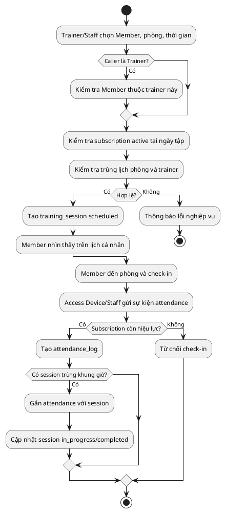
```plantuml
@startuml GMS_Process_Training_Session
start
:Trainer/Staff chọn Member, phòng, thời gian;
if (Caller là Trainer?) then (Có)
  :Kiểm tra Member thuộc trainer này;
endif
:Kiểm tra subscription active tại ngày tập;
:Kiểm tra trùng lịch phòng và trainer;
if (Hợp lệ?) then (Có)
  :Tạo training_session scheduled;
  :Member nhìn thấy trên lịch cá nhân;
else (Không)
  :Thông báo lỗi nghiệp vụ;
  stop
endif

:Member đến phòng và check-in;
:Access Device/Staff gửi sự kiện attendance;
if (Subscription còn hiệu lực?) then (Có)
  :Tạo attendance_log;
  if (Có session trùng khung giờ?) then (Có)
    :Gắn attendance với session;
    :Cập nhật session in_progress/completed;
  endif
else (Không)
  :Từ chối check-in;
endif
stop
@enduml
```

### 2.4.7 Quy trình Tạo và Quản lý Workout Plan

**Tác nhân:** Trainer, Member, Staff/Owner có quyền quản lý.

**Luồng chính:**
1. Trainer tạo giáo án mới cho hội viên hoặc Member tự tạo plan cá nhân.
2. Người tạo đặt tên, mô tả/mục tiêu và thêm các ngày tập.
3. Với mỗi ngày tập, người tạo chọn bài tập từ thư viện, thiết lập thứ tự, số hiệp, số lần lặp hoặc thời lượng, mức tạ, thời gian nghỉ và ghi chú kỹ thuật.
4. Khi kích hoạt plan, hệ thống kiểm tra plan có ít nhất một ngày tập và mỗi ngày có ít nhất một bài tập hợp lệ.
5. Trainer giao plan cho Member. Hệ thống kiểm tra Trainer có quyền phụ trách Member; nếu Trainer cố giao plan cho Member của Trainer khác, hệ thống từ chối.
6. Khi plan được giao, hệ thống tạo `member_workout_plans.status='active'`; các assignment cũ bị thay thế theo quy tắc hiện hành.
7. Member mở plan được giao, bắt đầu buổi tập và ghi workout log cho từng ngày/bài tập.
8. Từ khi plan đã có workout log, cấu trúc plan bị khóa, không cho chỉnh sửa ngày tập/bài tập nhằm bảo toàn dữ liệu lịch sử. Workout log của Member chỉ được chỉnh sửa trong thời hạn cho phép.

**Quy tắc nghiệp vụ:**
- Plan ở trạng thái `draft` được soạn thảo; `active` mới được giao; `archived` là chỉ đọc.
- Plan do Trainer tạo không được xóa nếu còn assignment active.
- Member có thể tự tạo và tự áp dụng plan cá nhân theo quyền của chính mình.

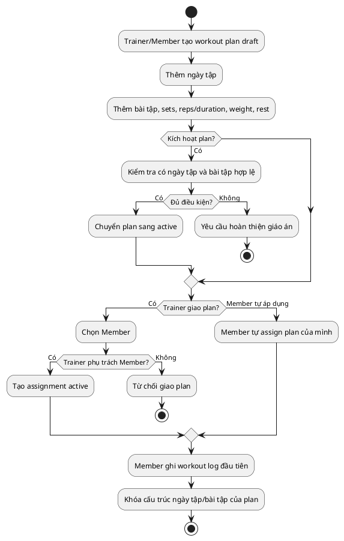
```plantuml
@startuml GMS_Process_Workout_Plan
start
:Trainer/Member tạo workout plan draft;
:Thêm ngày tập;
:Thêm bài tập, sets, reps/duration, weight, rest;
if (Kích hoạt plan?) then (Có)
  :Kiểm tra có ngày tập và bài tập hợp lệ;
  if (Đủ điều kiện?) then (Có)
    :Chuyển plan sang active;
  else (Không)
    :Yêu cầu hoàn thiện giáo án;
    stop
  endif
endif

if (Trainer giao plan?) then (Có)
  :Chọn Member;
  if (Trainer phụ trách Member?) then (Có)
    :Tạo assignment active;
  else (Không)
    :Từ chối giao plan;
    stop
  endif
else (Member tự áp dụng)
  :Member tự assign plan của mình;
endif

:Member ghi workout log đầu tiên;
:Khóa cấu trúc ngày tập/bài tập của plan;
stop
@enduml
```

### 2.4.8 Quy trình Phản hồi và Xử lý phản hồi

**Tác nhân:** Member, Staff, Owner.

**Luồng chính:**
1. Member mở chức năng phản hồi, chọn loại phản hồi (`staff`, `equipment`, `service`), mức độ nghiêm trọng (`low`, `medium`, `high`) và nhập nội dung mô tả.
2. Nếu phản hồi liên quan đến Staff hoặc thiết bị, Member chọn đối tượng tương ứng; hệ thống kiểm tra loại phản hồi và đối tượng có khớp nhau không.
3. Hệ thống tạo feedback với `status='open'`, hiển thị trong hàng chờ xử lý và ưu tiên các phản hồi `severity='high'`.
4. Staff nhận xử lý hoặc được phân công, hệ thống chuyển trạng thái sang `in_progress` và ghi người phụ trách.
5. Staff tìm hiểu vấn đề, cập nhật tiến độ hoặc mức độ nghiêm trọng nếu cần.
6. Khi hoàn tất, Staff đóng phản hồi bằng `resolved` hoặc `rejected`. Nếu từ chối hoặc giải quyết xong, hệ thống bắt buộc nhập ghi chú kết quả/lý do.
7. Member xem được trạng thái xử lý và kết quả cuối cùng.
8. Hệ thống đánh dấu phản hồi quá hạn theo SLA để Owner giám sát.

**SLA xử lý tham chiếu:** `high` trong 1 ngày, `medium` trong 3 ngày, `low` trong 7 ngày.

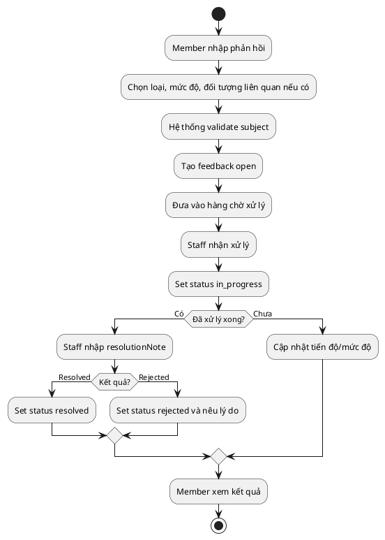
```plantuml
@startuml GMS_Process_Feedback
start
:Member nhập phản hồi;
:Chọn loại, mức độ, đối tượng liên quan nếu có;
:Hệ thống validate subject;
:Tạo feedback open;
:Đưa vào hàng chờ xử lý;
:Staff nhận xử lý;
:Set status in_progress;
if (Đã xử lý xong?) then (Có)
  :Staff nhập resolutionNote;
  if (Kết quả?) then (Resolved)
    :Set status resolved;
  else (Rejected)
    :Set status rejected và nêu lý do;
  endif
else (Chưa)
  :Cập nhật tiến độ/mức độ;
endif
:Member xem kết quả;
stop
@enduml
```

### 2.4.9 Quy trình Quản lý Nhân sự và Theo dõi hiệu suất

**Tác nhân:** Owner, Staff, Trainer.

**Luồng chính:**
1. Owner tạo hồ sơ nhân viên, nhập họ tên, email, SĐT, chức vụ (`trainer`/`pt`, `manager`, `receptionist`, `technician`) và nhóm quyền.
2. Hệ thống kiểm tra trùng email/SĐT, tạo `users.status='pending_verification'`, tạo `staff`, sinh `staff_code` và gán group mặc định hoặc group được chọn.
3. Owner/Staff có quyền lập lịch làm việc theo ngày, ca sáng/chiều/tối; hệ thống chặn trùng ca cùng ngày của cùng nhân viên.
4. Staff/Trainer check-in/check-out ca làm việc hoặc được hệ thống ghi nhận dữ liệu vận hành liên quan.
5. Hệ thống tổng hợp KPI từ số buổi dạy, attendance, phản hồi đã xử lý, điểm/mức độ phản hồi, thanh toán hoặc dữ liệu nghiệp vụ phát sinh theo vai trò.
6. Owner xem báo cáo hiệu suất để đánh giá nhân viên; Staff/Trainer có thể xem chỉ số cá nhân nếu được cấp quyền.
7. Khi nhân viên thôi việc, Owner thực hiện xóa/ngừng kích hoạt. Hệ thống soft delete `staff` và `users`, thu hồi khả năng đăng nhập nhưng giữ lịch sử làm việc, feedback, session và audit log để đối chiếu.

**Quy tắc nghiệp vụ:**
- Nhân viên mới phải xác thực email/thiết lập mật khẩu trước khi đăng nhập đầy đủ.
- Xóa nhân sự không được xóa trắng dữ liệu lịch sử.
- Trainer có thể thuộc nhiều group, ví dụ vừa là `trainer` vừa có một số quyền `staff` nếu Owner cấu hình.

### 2.4.10 Quy trình Quản lý Phòng tập, Thiết bị và Bảo trì

**Tác nhân:** Owner, Staff, Technician.

**Luồng quản lý phòng tập:**
1. Owner/Staff thêm hoặc cập nhật phòng tập, gồm mã phòng, tên, loại phòng, sức chứa và mô tả.
2. Khi xóa phòng, hệ thống kiểm tra ràng buộc. Nếu phòng còn thiết bị hoặc còn training session chưa kết thúc, hệ thống từ chối xóa.
3. Nếu không còn ràng buộc, hệ thống xóa phòng và ghi audit log.

**Luồng quản lý thiết bị và bảo trì:**
1. Owner/Staff thêm thiết bị vào phòng, ghi ngày nhập, bảo hành và trạng thái ban đầu `active`.
2. Khi phát hiện sự cố, Staff tạo maintenance log với mô tả lỗi; hệ thống chuyển thiết bị từ `active` sang `broken` nếu phù hợp.
3. Technician nhận phiếu, chuyển maintenance từ `reported` sang `repairing`; thiết bị chuyển sang `repairing`.
4. Sau khi xử lý:
   - Nếu sửa thành công, maintenance chuyển `resolved`, thiết bị chuyển `active`.
   - Nếu không thể sửa, maintenance chuyển `failed`, thiết bị chuyển `retired`.
5. Thiết bị đã `retired` không được tạo maintenance log mới và không được khôi phục về active.
6. Nếu thiết bị đã có lịch sử bảo trì, hệ thống ưu tiên chuyển `status='retired'` thay vì xóa trắng để giữ lịch sử. Force delete chỉ dành cho Owner theo chính sách hệ thống.

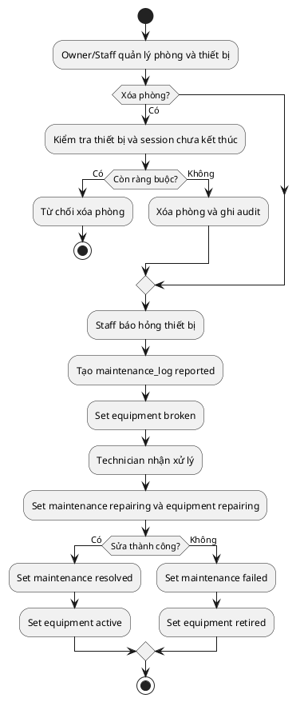
```plantuml
@startuml GMS_Process_Facility_Maintenance
start
:Owner/Staff quản lý phòng và thiết bị;
if (Xóa phòng?) then (Có)
  :Kiểm tra thiết bị và session chưa kết thúc;
  if (Còn ràng buộc?) then (Có)
    :Từ chối xóa phòng;
    stop
  else (Không)
    :Xóa phòng và ghi audit;
  endif
endif

:Staff báo hỏng thiết bị;
:Tạo maintenance_log reported;
:Set equipment broken;
:Technician nhận xử lý;
:Set maintenance repairing và equipment repairing;
if (Sửa thành công?) then (Có)
  :Set maintenance resolved;
  :Set equipment active;
else (Không)
  :Set maintenance failed;
  :Set equipment retired;
endif
stop
@enduml
```

### 2.4.11 Quy trình Quản lý danh mục Gói tập

**Tác nhân:** Owner, Staff có quyền cấu hình.

**Luồng chính:**
1. Người quản lý mở màn hình cấu hình gói tập.
2. Người quản lý tạo gói mới với tên, số ngày sử dụng, đơn giá, mô tả quyền lợi và cờ có bao gồm PT hay không.
3. Hệ thống validate `duration_days > 0`, `price >= 0`, mã/tên không trùng theo quy định và lưu gói với `status='active'`.
4. Khi chỉnh sửa gói, hệ thống cập nhật thông tin danh mục cho lượt mua mới; các subscription/payment đã phát sinh trước đó vẫn giữ lịch sử, giá trị và quyền lợi đã ghi nhận tại thời điểm mua.
5. Khi không muốn bán tiếp, người quản lý vô hiệu hóa gói bằng `status='inactive'`; gói không còn hiển thị trong danh sách đăng ký mới nhưng lịch sử cũ vẫn còn.
6. Khi xóa gói, hệ thống kiểm tra subscription đang `active` hoặc `pending`. Nếu còn hội viên đang dùng/chờ kích hoạt, hệ thống chặn xóa; nếu không, hệ thống thực hiện xóa theo chính sách soft delete.

**Quy tắc nghiệp vụ:**
- Gói tập của v1.0 là time-based, không trừ số buổi.
- Gói có PT bắt buộc chọn trainer khi đăng ký.
- Không chỉnh sửa hồi tố giá hoặc quyền lợi của subscription đã mua.

### 2.4.12 Quy trình Quản lý Phân quyền người dùng

**Tác nhân:** Owner.

**Luồng chính:**
1. Owner tạo nhóm quyền, đặt tên và mô tả phạm vi sử dụng. Các nhóm hệ thống như `owner`, `staff`, `trainer`, `member` được bảo vệ theo quy định hệ thống.
2. Owner mở danh mục permission hiện có. Danh mục permission là tập chức năng hệ thống như đọc/ghi/xóa/báo cáo/quản lý RBAC.
3. Owner gán hoặc gỡ permission cho từng nhóm quyền.
4. Owner tra cứu người dùng và gán người dùng vào một hoặc nhiều nhóm phù hợp với vai trò thực tế.
5. Khi vai trò thay đổi, Owner gỡ nhóm cũ hoặc gán nhóm mới. Hệ thống không cho người dùng mất toàn bộ group nếu quy tắc tối thiểu yêu cầu ít nhất một group.
6. Quyền truy cập được cập nhật cho các request tiếp theo mà không yêu cầu người dùng đăng xuất thủ công.
7. Mọi thao tác thay đổi nhóm quyền, quyền của nhóm hoặc nhóm của người dùng đều ghi audit log.

**Luồng ngoại lệ:**
- Không được xóa hoặc đổi tên nhóm hệ thống.
- Không được gỡ group cuối cùng của một user nếu làm user không còn nhóm nào.
- Không được tự cập nhật `status` hoặc tự nâng quyền cho chính mình.

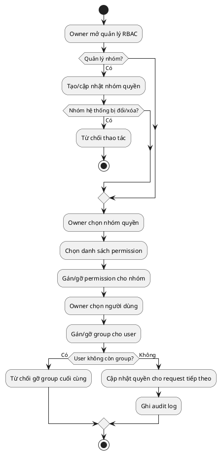
```plantuml
@startuml GMS_Process_RBAC
start
:Owner mở quản lý RBAC;
if (Quản lý nhóm?) then (Có)
  :Tạo/cập nhật nhóm quyền;
  if (Nhóm hệ thống bị đổi/xóa?) then (Có)
    :Từ chối thao tác;
    stop
  endif
endif

:Owner chọn nhóm quyền;
:Chọn danh sách permission;
:Gán/gỡ permission cho nhóm;
:Owner chọn người dùng;
:Gán/gỡ group cho user;
if (User không còn group?) then (Có)
  :Từ chối gỡ group cuối cùng;
else (Không)
  :Cập nhật quyền cho request tiếp theo;
  :Ghi audit log;
endif
stop
@enduml
```

### 2.4.13 Quy trình Báo cáo, Thống kê, Thanh toán và Hiệu suất

**Tác nhân:** Owner, Staff/Trainer xem dữ liệu cá nhân nếu được cấp quyền.

**Luồng chính:**
1. Người dùng có quyền mở màn hình báo cáo.
2. Chọn loại báo cáo: doanh thu, hội viên mới, tỷ lệ gia hạn/hủy, gói bán chạy, thanh toán, hiệu suất nhân viên hoặc hiệu suất trainer.
3. Thiết lập khoảng thời gian và bộ lọc liên quan như phương thức thanh toán, staff/trainer, gói tập hoặc trạng thái.
4. Hệ thống truy vấn dữ liệu từ `payments`, `subscriptions`, `members`, `training_sessions`, `feedback`, `staff_attendance_logs` và các bảng liên quan.
5. Hệ thống tổng hợp số liệu, tính chỉ số và hiển thị thành biểu đồ cột, đường, tròn hoặc bảng so sánh.
6. Người dùng xem chi tiết để đối chiếu giao dịch, lịch sử gói, số buổi dạy, phản hồi xử lý và mức độ hoàn thành công việc.
7. Hệ thống cung cấp chức năng xuất báo cáo ra PDF, Excel hoặc CSV để lưu trữ/gửi báo cáo.

**Quy tắc nghiệp vụ:**
- Doanh thu chỉ tính payment `success`.
- Báo cáo hiệu suất trainer ưu tiên số buổi `completed`, attendance thực tế và phản hồi liên quan.
- Báo cáo phản hồi cần hiển thị các mục quá hạn SLA để Owner giám sát.
- Nếu không có dữ liệu trong khoảng chọn, hệ thống hiển thị trạng thái rỗng thay vì báo lỗi.

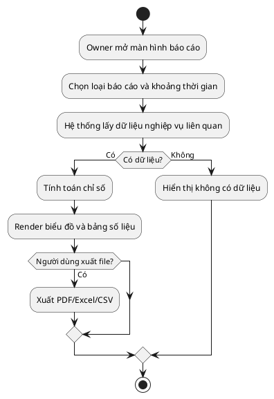
```plantuml
@startuml GMS_Process_Reports
start
:Owner mở màn hình báo cáo;
:Chọn loại báo cáo và khoảng thời gian;
:Hệ thống lấy dữ liệu nghiệp vụ liên quan;
if (Có dữ liệu?) then (Có)
  :Tính toán chỉ số;
  :Render biểu đồ và bảng số liệu;
  if (Người dùng xuất file?) then (Có)
    :Xuất PDF/Excel/CSV;
  endif
else (Không)
  :Hiển thị không có dữ liệu;
endif
stop
@enduml
```

---

# 3. Đặc tả các chức năng

**Ghi chú quan trọng:** 
- **Phân quyền người dùng** được mô tả thông qua **Quy trình 2.4.12**, không có Use Case riêng trong phần này
- **UC03 (trong phần 3)** là "Đăng ký hội viên mới" - được mô tả chi tiết ở 3.4
- Tất cả tài liệu tham khảo đến "hộ gia đình" đã được cập nhật thành "hội viên" để phù hợp với nội dung thực tế của hệ thống

---

## 3.1 Đặc tả Use Case UC00 - Đăng nhập

| Thông tin | Chi tiết |
|-----------|---------|
| **Mã Use case** | UC00 |
| **Tên Use case** | Đăng nhập |
| **Tác nhân** | Hội viên, Nhân viên quản lý, Huấn luyện viên, Chủ phòng tập |
| **Tiền điều kiện** | Người dùng đã có tài khoản trên hệ thống |

### Luồng sự kiện chính (Thành công)

| STT | Thực hiện bởi | Hành động |
|-----|--------------|----------|
| 1 | Người dùng | Chọn chức năng Đăng nhập |
| 2 | Hệ thống | Hiển thị giao diện đăng nhập (form email + password, link "Quên mật khẩu") |
| 3 | Người dùng | Nhập email và mật khẩu, nhấn "Đăng nhập" |
| 4 | Hệ thống | Xác thực thông tin (email tồn tại, password đúng, `users.deleted_at IS NULL`, `users.status='active'`, `users.email_verified_at IS NOT NULL`) |
| 5 | Hệ thống | Xác định Nhóm quyền của người dùng (Group) qua `user_groups` và tải danh sách permission qua `group_permissions` |
| 6 | Hệ thống | Tạo JWT (TTL 7 ngày, payload `{ sub, email, roles[] }`), ghi `audit_logs` action `auth.login` với IP + user-agent |
| 7 | Hệ thống | Chuyển hướng người dùng đến trang chức năng tương ứng theo `roles[0]` (`/owner`, `/staff`, `/trainer`, `/member`) |

### Luồng sự kiện thay thế

| STT | Thực hiện bởi | Hành động |
|-----|--------------|----------|
| 4a | Hệ thống | Thiếu trường bắt buộc → thông báo "Vui lòng nhập đầy đủ email và mật khẩu" |
| 4b | Hệ thống | Email không tồn tại HOẶC mật khẩu sai → thông báo chung "Thông tin đăng nhập không chính xác" (không tiết lộ email có tồn tại không, tránh user enumeration). Trả 401. Ghi `audit_logs` action `auth.login` với payload `{success: false, reason: 'invalid_credentials'}`, `actor_user_id=NULL` khi credential không khớp user; nếu email match user, lưu `actor_user_id=user.id` + `payload.email_attempted` cho forensics (xem Architecture.md §4.4.2). |
| 4c | Hệ thống | `users.email_verified_at IS NULL` → thông báo "Vui lòng xác thực email trước khi đăng nhập" + gợi ý gửi lại OTP (xem Architecture.md §3.3). Ghi `audit_logs` action `auth.login` với payload `{success: false, reason: 'email_not_verified'}`. |
| 4d | Hệ thống | `users.deleted_at IS NOT NULL` → trả cùng 401 generic như 4b để tránh enumeration. Ghi `audit_logs` action `auth.login` với payload `{success: false, reason: 'user_deleted'}`. |
| 4e | Người dùng | Nhấn link "Quên mật khẩu" → chuyển sang UC02 |

**Ghi chú lockout v1.0:** Account lockout (counter `failed_login_count` + `users.status='locked'` + cron auto-unlock + admin unlock + audit action `auth.lockout`) defer v1.1 — xem Architecture.md §8 Roadmap R20. V1.0 không có counter, mọi failed login trả 401 generic. Giá trị `'locked'` trong `user_status` enum (Database.md) tồn tại như placeholder cho v1.1 R20, **code v1.0 MUST NOT set**; UC00 step 4 check `status='active'` đã đủ block bất kỳ status nào khác. Brute-force mitigation tạm thời: rate limit ở tầng WAF khi pre-production (Cloudflare/nginx) + bcrypt cost 10 + `/auth/forgot-password` rate limit 3/h/email + audit log failed login để Owner trace pattern (xem Architecture.md §4.4.2).

### Dữ liệu đầu vào

| STT | Trường dữ liệu | Mô tả | Bắt buộc? | Điều kiện hợp lệ | Ví dụ |
|-----|----------------|--------|-----------|-------------------|--------|
| 1 | Email | Địa chỉ email | Có | Format: `^[a-zA-Z0-9._%+-]+@[a-zA-Z0-9.-]+\.[a-zA-Z]{2,}$` (RFC 5322), độ dài ≤ 255 ký tự | h.anh@gmail.com |
| 2 | Mật khẩu | Mật khẩu đăng nhập | Có | Độ dài ≥ 8 ký tự, chứa ít nhất 1 chữ hoa, 1 chữ thường, 1 số, 1 ký tự đặc biệt (!@#$%^&*) | ToiLa12#$ |

Ghi chú: TTL token cố định 7 ngày v1.0. Tính năng "Ghi nhớ đăng nhập" (extended TTL) defer v1.1 cùng refresh token — xem Architecture.md §8 Roadmap R1.

### Hậu điều kiện
Người dùng truy cập được vào các tính năng thuộc quyền hạn của mình. JWT được cấp phát (TTL 7 ngày). Phiên đăng nhập được ghi vào `audit_logs` với timestamp + IP + user-agent.

**Ghi chú v1.0:** Logout chỉ là client-side (xóa token khỏi storage). Token blacklist / refresh token mechanism defer v1.1. Giới hạn session limit (4.4) chỉ enforce ở client.

---

## 3.2 Đặc tả Use Case UC01 - Đăng xuất

| Thông tin | Chi tiết |
|-----------|---------|
| **Mã Use case** | UC01 |
| **Tên Use case** | Đăng xuất |
| **Tác nhân** | Tất cả người dùng |
| **Tiền điều kiện** | Người dùng đang ở trạng thái đăng nhập |

### Luồng sự kiện chính (Thành công)

| STT | Thực hiện bởi | Hành động |
|-----|--------------|----------|
| 1 | Người dùng | Ấn vào tùy chọn đăng xuất |
| 2 | Hệ thống | Hủy phiên làm việc và quay về trang đăng nhập |

### Luồng sự kiện thay thế
Không có

### Hậu điều kiện
Người dùng không thể thực hiện các thao tác trong hệ thống cho đến khi đăng nhập lại.

---

## 3.3 Đặc tả Use Case UC02 - Quên mật khẩu

| Thông tin | Chi tiết |
|-----------|---------|
| **Mã Use case** | UC02 |
| **Tên Use case** | Quên mật khẩu |
| **Tác nhân** | Người dùng (mọi role) |
| **Tiền điều kiện** | Người dùng đã có tài khoản trên hệ thống và đã `email_verified_at IS NOT NULL` |

### Luồng sự kiện chính (Thành công)

| STT | Thực hiện bởi | Hành động |
|-----|--------------|----------|
| 1 | Người dùng | Tại màn hình Đăng nhập, người dùng chọn chức năng "Quên mật khẩu" |
| 2 | Hệ thống | Hiển thị form yêu cầu nhập Email đã đăng ký |
| 3 | Người dùng | Nhập email và nhấn "Gửi mã" |
| 4 | Hệ thống | Kiểm tra rate limit (tối đa 3 yêu cầu / giờ / email). Nếu vượt → từ chối với thông báo "Vui lòng thử lại sau". |
| 5 | Hệ thống | Bất kể email tồn tại hay không, trả response chung "Nếu email tồn tại, mã OTP đã được gửi" (tránh user enumeration). Nếu email thực sự tồn tại trong DB: sinh OTP 6 chữ số bằng `crypto.randomInt`, hash bcrypt, lưu `otp_codes` với `expires_at = NOW() + INTERVAL '10 minutes'`. **Single-active OTP:** trước INSERT phải `DELETE` mọi OTP cũ của user với `purpose='password_reset'` trong cùng `$transaction` (xem Database.md `otp_codes` convention). |
| 6 | Hệ thống | Gửi OTP qua email người dùng (v1.0 chỉ email, không SMS). Log plaintext OTP trong dev mode. |
| 7 | Người dùng | Nhập OTP + mật khẩu mới vào form, nhấn "Đặt lại" |
| 8 | Hệ thống | Verify OTP hash. Nếu hợp lệ và chưa expired: `$transaction` gồm update `users.password_hash` (bcrypt) + delete OTP. Ghi `audit_logs` action `auth.password-reset`. (Lockout unlock defer v1.1 R20 — xem Architecture §8.) |
| 9 | Hệ thống | Thông báo thành công, điều hướng về trang Đăng nhập |

### Luồng sự kiện thay thế

| STT | Thực hiện bởi | Hành động |
|-----|--------------|----------|
| 4a | Hệ thống | Vượt rate limit → "Bạn đã yêu cầu quá nhiều lần. Vui lòng thử lại sau 1 giờ." |
| 5a | Hệ thống | Email không tồn tại → vẫn trả response chung như success (security). KHÔNG gửi mail. |
| 8a | Hệ thống | OTP sai → tăng failed counter (max 5 lần/OTP), thông báo "Mã không hợp lệ" |
| 8b | Hệ thống | OTP hết hạn (`expires_at < NOW()`) → thông báo "Mã đã hết hạn, vui lòng yêu cầu mã mới" |

### Dữ liệu đầu vào

| STT | Trường dữ liệu | Mô tả | Bắt buộc? | Điều kiện hợp lệ | Ví dụ |
|-----|----------------|--------|-----------|-------------------|--------|
| 1 | Email | Email đã đăng ký | Có | Format: `^[a-zA-Z0-9._%+-]+@[a-zA-Z0-9.-]+\.[a-zA-Z]{2,}$` | h.anh@gmail.com |
| 2 | OTP | Mã 6 chữ số nhận qua email | Có | `^\d{6}$`, TTL 10 phút | 482910 |
| 3 | Mật khẩu mới | Mật khẩu mới | Có | Độ dài ≥ 8 ký tự, chứa ≥1 chữ hoa, ≥1 chữ thường, ≥1 số, ≥1 ký tự đặc biệt | NewPass123!@# |

### Hậu điều kiện
Mật khẩu của người dùng được cập nhật thành công và mã OTP được vô hiệu hóa; người dùng có thể sử dụng mật khẩu mới để đăng nhập. Sự kiện thay đổi mật khẩu được ghi log.

---

## 3.4 Đặc tả Use Case UC03 - Đăng ký hội viên mới

UC03 có 2 flow song song: **UC03A** (Staff đăng ký tại quầy) và **UC03B** (Member tự đăng ký online).

### 3.4.1 UC03A - Đăng ký tại quầy (Staff thực hiện)

| Thông tin | Chi tiết |
|-----------|---------|
| **Mã Use case** | UC03A |
| **Tên Use case** | Đăng ký hội viên tại quầy |
| **Tác nhân** | Nhân viên quản lý (Chính), Hệ thống thanh toán (Phụ) |
| **Tiền điều kiện** | Nhân viên đã đăng nhập với quyền tạo member |

#### Luồng sự kiện chính (Thành công)

| STT | Thực hiện bởi | Hành động |
|-----|--------------|----------|
| 1 | Nhân viên | Nhập thông tin cá nhân khách hàng (Họ tên, SĐT, Email, Ngày sinh, Địa chỉ); optional: chọn `primary_trainer_id` |
| 2 | Hệ thống | Validate dữ liệu input (regex, độ dài). Kiểm tra UNIQUE email/phone trong `users`. |
| 3 | Nhân viên | Chọn gói tập (chỉ hiển thị `packages.status='active'` AND `deleted_at IS NULL`) |
| 4 | Hệ thống | Tính tổng tiền = `packages.price`. Hiển thị xác nhận. |
| 5 | Nhân viên | Thu tiền mặt hoặc khởi tạo giao dịch thanh toán điện tử |
| 6 | Hệ thống thanh toán | Xác nhận giao dịch thành công (callback webhook nếu electronic) |
| 7 | Hệ thống | **Trong 1 transaction:** (a) Tạo `users` với `status='pending_verification'`, password tạm sinh ngẫu nhiên; (b) Tạo `members` với `member_code` tự sinh (`MEM-YYYY-XXXXXX`); (c) Auto-assign user vào group `member` qua `user_groups`; (d) Tạo `subscriptions` với `status='active'`, `start_date=today_vn`, `end_date=start_date + duration_days`; (e) Tạo `payments` với `status='success'`; (f) Ghi `audit_logs` actions trong cùng transaction: `member.create` (primary, `actor_user_id=staff_user_id`), `subscription.create`, `payment.success` (xem Architecture.md §4.4.1 audit scope). |
| 8 | Hệ thống | Gửi email cho member chứa: thông tin tài khoản (email + password tạm) + link verify email. Hiển thị biên lai để Staff in. |

#### Luồng sự kiện thay thế

| STT | Thực hiện bởi | Hành động |
|-----|--------------|----------|
| 2a | Hệ thống | Email/SĐT đã tồn tại → báo lỗi, gợi ý tra cứu hội viên hiện có |
| 6a | Hệ thống thanh toán | Thanh toán fail → rollback transaction, giữ form đã nhập, cho phép chọn lại phương thức hoặc hủy |
| 7a | Hệ thống | Member chưa verify email → vẫn cho phép check-in tại phòng tập (Staff đã verify offline tại quầy) nhưng không cho login online cho đến khi verify |

### 3.4.2 UC03B - Đăng ký online (Member tự thực hiện)

| Thông tin | Chi tiết |
|-----------|---------|
| **Mã Use case** | UC03B |
| **Tên Use case** | Đăng ký hội viên online |
| **Tác nhân** | Khách (chưa đăng nhập), Hệ thống thanh toán (Phụ) |
| **Tiền điều kiện** | Khách truy cập trang đăng ký public |

#### Luồng sự kiện chính (Thành công)

| STT | Thực hiện bởi | Hành động |
|-----|--------------|----------|
| 1 | Khách | Truy cập `/register`, nhập thông tin cá nhân + mật khẩu tự chọn + chọn gói tập |
| 2 | Hệ thống | Validate, kiểm tra UNIQUE email/phone |
| 3 | Hệ thống | Tạo `users` với `status='pending_verification'`, hash password bcrypt; tạo `members` với `member_code` tự sinh; tạo `subscriptions` với `status='pending'` (chờ thanh toán). |
| 4 | Hệ thống | Gửi email verify với OTP/link |
| 5 | Khách | Click link / nhập OTP → hoàn tất verify → `users.status='active'`, `email_verified_at=NOW()` |
| 6 | Hệ thống | Redirect khách sang trang thanh toán |
| 7 | Khách | Hoàn tất thanh toán online (thẻ/ví điện tử) |
| 8 | Hệ thống thanh toán | Webhook callback xác nhận giao dịch thành công |
| 9 | Hệ thống | Update `subscriptions.status='pending' → 'active'`, set `start_date=today_vn`, `end_date=start_date + duration_days`; tạo `payments` với `status='success'`; gửi email biên lai. |

#### Luồng sự kiện thay thế

| STT | Thực hiện bởi | Hành động |
|-----|--------------|----------|
| 2a | Hệ thống | Email/SĐT đã tồn tại → báo lỗi cụ thể (không áp dụng anti-enumeration cho registration vì đây là user info user đang nhập) |
| 5a | Khách | Không verify trong 24h → `users` vẫn ở `pending_verification`; không cleanup tự động (giữ để user có thể tự re-verify bằng cách resend OTP qua endpoint) |
| 8a | Hệ thống thanh toán | Thanh toán fail → giữ `subscriptions.status='pending'`, thông báo lỗi, cho phép retry trong 24h. Sau 24-48h cron `subscription:cancel-unpaid-pending` (daily 00:15) auto-cancel (`status='cancelled'`) — cửa sổ dao động 24-48h do daily cron, xem Architecture §5.2. |

### Dữ liệu đầu vào (chung cho UC03A và UC03B)

| STT | Trường dữ liệu | Mô tả | Bắt buộc? | Điều kiện hợp lệ | Ví dụ |
|-----|----------------|--------|-----------|-------------------|--------|
| 1 | Họ và tên (full_name) | Họ và tên đầy đủ | Có | Độ dài 2-200 ký tự; cho phép chữ cái Latin/Việt, khoảng trắng, dấu nháy `'`, gạch nối `-` | Nguyễn-An O'Brien |
| 2 | Mật khẩu | Mật khẩu (chỉ UC03B; UC03A sinh ngẫu nhiên) | Có (B) / Không (A) | Độ dài ≥ 8, ≥1 chữ hoa, ≥1 chữ thường, ≥1 số, ≥1 ký tự đặc biệt | Gym123!@ |
| 3 | Địa chỉ | Địa chỉ liên hệ | Không | Độ dài: 0-200 ký tự | 123 Lê Lợi, Hà Nội |
| 4 | Mã gói tập | `packages.package_code` | Có | Phải tồn tại và `status='active'`, `deleted_at IS NULL` | PKG-0012 |
| 5 | Ngày sinh | Ngày sinh | Có | Format ISO 8601 YYYY-MM-DD, 16 ≤ tuổi ≤ 100 | 2005-06-15 |
| 6 | Số điện thoại | SĐT VN | Có | Format: `^0\d{9}$` (10 chữ số, bắt đầu 0) | 0987654321 |
| 7 | Email | Email | Có | Format: `^[a-zA-Z0-9._%+-]+@[a-zA-Z0-9.-]+\.[a-zA-Z]{2,}$`, UNIQUE | user@email.com |
| 8 | Mã PT cố định | `staff.staff_code` của PT muốn gán | Không (chỉ UC03A) | PT phải có `position='pt'` | STF-2026-000045 |

### Hậu điều kiện

- `users.status='pending_verification'` (cho đến khi hoàn tất verify email)
- `members` được tạo với `member_code` tự sinh; auto-assign group `member`
- UC03A: `subscriptions.status='active'`, payment đã success
- UC03B: `subscriptions.status='pending'` cho đến khi payment + verify hoàn tất → `'active'`
- Email verify + email thông tin tài khoản được gửi
- `audit_logs` ghi action `member.create`

---

## 3.5 Đặc tả Use Case UC04 - Gia hạn / Hủy gói tập

UC04 gồm 2 sub-flow: **gia hạn (renewal)** và **hủy gói (cancel)**.

### 3.5.1 Gia hạn gói tập

| Thông tin | Chi tiết |
|-----------|---------|
| **Mã Use case** | UC04A |
| **Tên Use case** | Gia hạn gói tập |
| **Tác nhân** | Hội viên (Online), Nhân viên quản lý (Tại quầy), Hệ thống thanh toán |
| **Tiền điều kiện** | Hội viên đã đăng nhập, đã verify email |

#### Luồng sự kiện chính (Thành công)

| STT | Thực hiện bởi | Hành động |
|-----|--------------|----------|
| 1 | Hội viên | Chọn gói tập cần gia hạn (cùng gói cũ hoặc gói khác) |
| 2 | Hội viên | Thực hiện thanh toán |
| 3 | Hệ thống thanh toán | Xác nhận giao dịch thành công |
| 4 | Hệ thống | Tạo `subscriptions` mới theo quy tắc: (a) Nếu có gói `active` chưa hết hạn (gói cũ `end_date >= today_vn`) → `subscriptions` mới có `start_date = dayjs(gói_cu.end_date).add(1, 'day')` (date-only arithmetic, không cần timezone convert vì `end_date` là DATE field), `status='pending'`. Cron job daily activate khi đến hạn. (b) Nếu không có gói active → `start_date=today_vn`, `status='active'` ngay. (c) `end_date = start_date + packages.duration_days`. |
| 5 | Hệ thống | Tạo `payments` với `status='success'`; ghi `audit_logs` action `subscription.renew` (cover cả 2 branch a + b — branch (b) immediate activation không cần ghi thêm `subscription.activate` separate vì `before_data.status` trong audit row đã trace được trạng thái); gửi email biên lai. |

#### Luồng sự kiện thay thế

| STT | Thực hiện bởi | Hành động |
|-----|--------------|----------|
| 3a | Hệ thống thanh toán | Giao dịch fail → giữ trạng thái `subscriptions.status='pending'` chưa kích hoạt, thông báo lỗi |
| 4a | Hệ thống | Member đang có 1 subscription `pending` (prepaid chưa active) → từ chối gia hạn thêm: "Bạn đã có gói chờ kích hoạt" |

**Ghi chú v1.0:** Không hỗ trợ upgrade/downgrade giữa kỳ (đổi gói khi gói cũ còn hạn). Member muốn đổi → phải đợi hết hạn hoặc cancel gói cũ trước (xem 3.5.2).

### 3.5.2 Hủy gói tập

| Thông tin | Chi tiết |
|-----------|---------|
| **Mã Use case** | UC04B |
| **Tên Use case** | Hủy gói tập |
| **Tác nhân** | Hội viên hoặc Nhân viên quản lý (đại diện hội viên) |
| **Tiền điều kiện** | Tồn tại `subscriptions` với `status IN ('pending', 'active')` |

#### Luồng sự kiện chính

| STT | Thực hiện bởi | Hành động |
|-----|--------------|----------|
| 1 | Hội viên / Staff | Mở danh sách subscription, chọn gói cần hủy, nhấn "Hủy gói" |
| 2 | Hệ thống | Hiển thị cảnh báo: "Hủy gói sẽ mất quyền truy cập ngay lập tức. KHÔNG hoàn tiền. Bạn có chắc chắn?" |
| 3 | Hội viên / Staff | Xác nhận |
| 4 | Hệ thống | Set `subscriptions.status='cancelled'`, `cancelled_at=NOW()`; nếu có subscription `pending` prepaid (`EXISTS payments WHERE status='success'`) → activate ngay (`status='active'`, `start_date=today_vn`, recompute `end_date=today_vn + packages.duration_days`); thực hiện trong `$transaction` để 2 update atomic; ghi `audit_logs` action `subscription.cancel`; **nếu có cascade activate** → ghi thêm `audit_logs` action `subscription.activate` với payload `{activated_from: 'cascade_cancel'}` trong cùng `$transaction` (xem Architecture.md §4.3.3 code sample + §4.4.1). |
| 5 | Hệ thống | Gửi email xác nhận hủy. |

### Hậu điều kiện
- Gia hạn: `subscriptions` mới được tạo, `start_date` theo quy tắc nối tiếp/từ ngày thanh toán; `payments` được ghi nhận; biên lai gửi qua email.
- Hủy: gói được set `cancelled`, member mất quyền truy cập; không hoàn tiền (chính sách v1.0 — xem cảnh báo tại Bước 2 luồng chính trên).

---

## 3.6 Đặc tả Use Case UC05 - Lập kế hoạch tập luyện, Lịch tập và Ghi nhận Real-time

UC05 gồm 3 phần: **UC05A** (PT lập kế hoạch workout và giao plan), **UC05B** (PT lập lịch tập cho hội viên), và **UC05C** (Real-time check-in qua thiết bị).

### 3.6.1 UC05A - PT lập kế hoạch workout và giao cho hội viên

| Thông tin | Chi tiết |
|-----------|---------|
| **Mã Use case** | UC05A |
| **Tên Use case** | Lập kế hoạch workout (Workout Plan Management) |
| **Tác nhân** | Huấn luyện viên |
| **Tiền điều kiện** | PT đã đăng nhập với quyền `workout_plan.create`; hội viên đích có `subscriptions.status='active'` |

#### Luồng sự kiện chính

| STT | Thực hiện bởi | Hành động |
|-----|--------------|----------|
| 1 | PT | Mở "Kế hoạch tập luyện", chọn "Tạo plan mới", nhập tên và mô tả |
| 2 | PT | Thêm các ngày tập (Day 1, Day 2...), trong mỗi ngày chọn bài tập từ Exercise Library và đặt target (sets × reps @ weight) |
| 3 | PT | Kích hoạt plan (`status='active'`); giao cho hội viên cụ thể qua "Giao plan" |
| 4 | Hệ thống | Validate plan có ít nhất 1 ngày và 1 bài tập; nếu member đang có plan active → set plan cũ `status='replaced'`; tạo `member_workout_plans` mới với `status='active'`; ghi audit `workout_plan.assign` |
| 5 | Hội viên | Đăng nhập, xem plan được giao tại "/member/my-plan" |

#### Luồng sự kiện thay thế

| STT | Thực hiện bởi | Hành động |
|-----|--------------|----------|
| 3a | Hệ thống | Plan chưa có ngày hoặc bài tập → báo lỗi 400, yêu cầu bổ sung nội dung trước khi giao |
| 4a | Hệ thống | Member không thuộc danh sách PT quản lý → 403 |

**Authorization:**

- PT chỉ giao plan cho member có `primary_trainer_id = self.staff_id`; Owner/Staff có thể giao cho bất kỳ member.
- Plan template sau khi có workout log không thể sửa (bảo toàn lịch sử thực tế vs target).

#### Hậu điều kiện
`member_workout_plans` tạo mới với `status='active'`. Plan cũ (nếu có) chuyển `status='replaced'`. Member thấy plan tại dashboard.

### 3.6.2 UC05B - PT lập lịch tập cho hội viên

| Thông tin | Chi tiết |
|-----------|---------|
| **Mã Use case** | UC05B |
| **Tên Use case** | Lập lịch tập (Booking training session) |
| **Tác nhân** | Huấn luyện viên |
| **Tiền điều kiện** | PT đã đăng nhập; hội viên đích có `subscriptions.status='active'` và `primary_trainer_id = self.staff_id` |

#### Luồng sự kiện chính

| STT | Thực hiện bởi | Hành động |
|-----|--------------|----------|
| 1 | PT | Mở "Lập lịch tập", chọn hội viên (chỉ thấy hội viên thuộc danh sách quản lý), chọn phòng, chọn `start_time` và `end_time` |
| 2 | Hệ thống | Validate: `end_time > start_time`; member subscription `active` tại thời điểm `start_time`; phòng không bị overlap (không có session khác cùng `room_id` có thời gian giao nhau với `status != 'cancelled'`) |
| 3 | Hệ thống | Tạo `training_sessions` với `status='scheduled'`; ghi audit log |

#### Luồng sự kiện thay thế

| STT | Thực hiện bởi | Hành động |
|-----|--------------|----------|
| 2a | Hệ thống | Phòng overlap → báo lỗi với gợi ý slot khác |
| 2b | Hệ thống | Member subscription hết hạn tại `start_time` → block, gợi ý gia hạn trước |
| -- | PT | Cancel/reschedule: PT có quyền chuyển `status='cancelled'` ít nhất 2 giờ trước `start_time`; sau ngưỡng đó session đã tiến hành thì chuyển `completed` thủ công hoặc tự động |

### 3.6.3 UC05C - Theo dõi và tự động ghi nhận buổi tập (Real-time)

| Thông tin | Chi tiết |
|-----------|---------|
| **Mã Use case** | UC05C |
| **Tên Use case** | Real-time attendance |
| **Tác nhân** | Hội viên, Huấn luyện viên, Thiết bị kiểm soát ra vào |
| **Tiền điều kiện** | Hội viên có `subscriptions.status='active'` |

#### Luồng sự kiện chính (Thành công)

| STT | Thực hiện bởi | Hành động |
|-----|--------------|----------|
| 1 | Hội viên | Đến phòng tập, quẹt thẻ / quét QR tại cổng |
| 2 | Thiết bị kiểm soát | Gửi `POST /api/v1/devices/access-events` với `X-Device-API-Key` + member identifier + timestamp |
| 3 | Hệ thống | Xác thực API key; tìm `member` qua `member_code` (v1.0; RFID/QR defer v1.1 R21); kiểm tra `subscriptions.status='active'` và `end_date >= today_vn` |
| 4 | Hệ thống | Tạo `attendance_logs` với `method='realtime'`, `start_time=event_time`, `subscription_id` của gói active hiện tại; nếu tại thời điểm đó có `training_session` của member ở `status='scheduled'` thì link `session_id`. Chuyển session `status='in_progress'` là **optional v1.0** — cron `training-session:auto-close` query-based theo `EXISTS attendance_logs` (không phụ thuộc transition), xem Architecture.md §5.2. |
| 5 | Hội viên & PT | Có thể xem lịch sử tập (`attendance_logs`) và trạng thái gói trên ứng dụng |
| 6 | Hệ thống | Khi member rời phòng / hết giờ session → set `attendance_logs.end_time`; nếu session đang `in_progress` → chuyển `completed` |

#### Luồng sự kiện thay thế

| STT | Thực hiện bởi | Hành động |
|-----|--------------|----------|
| 3a | Hệ thống | Gói hết hạn / cancelled → trả 403, device hiển thị "Gói hết hạn, vui lòng gia hạn" |
| 3b | Hệ thống | Không tìm thấy member → trả 404, device hiển thị "Không nhận diện được" + gợi ý lễ tân check-in thủ công tại quầy (`method='manual'`, nhập `member_code`). QR/RFID method defer v1.1 R21. |
| 2a | Thiết bị kiểm soát | Lỗi kết nối → device tự retry 3 lần (1s, 4s, 16s); nếu vẫn fail → fall back manual check-in tại quầy |

**Ghi chú v1.0:**
- Bỏ logic "trừ buổi tập" — gói chỉ time-based (xem Database.md PACKAGE).
- Không có cơ chế queue server-side; device tự chịu trách nhiệm retry.
- Real-time view trên ứng dụng dùng HTTP polling 30s (WebSocket defer v1.1).

### Hậu điều kiện
- `attendance_logs` được ghi với thời gian chính xác
- Nếu có session liên quan, `training_sessions.status` chuyển `scheduled` → `completed` (transition `in_progress` là optional v1.0 — xem Bước 4 ghi chú)
- Member xem session đã hoàn thành ở dashboard cá nhân

---

## 3.7 Đặc tả Use Case UC06 - Kế hoạch và Nhật ký Luyện tập

UC06 gồm 3 phần: **UC06A** (Hội viên ghi nhận buổi tập), **UC06B** (Hội viên tự tạo workout plan), và **UC06C** (PT ghi chỉ số cơ thể — theo dõi tiến độ).

### 3.7.1 UC06A - Hội viên ghi nhận buổi tập

| Thông tin | Chi tiết |
|-----------|---------|
| **Mã Use case** | UC06A |
| **Tên Use case** | Ghi nhận buổi tập (Workout Log) |
| **Tác nhân** | Hội viên |
| **Tiền điều kiện** | Hội viên đã đăng nhập; có `member_workout_plans.status='active'` |

#### Luồng sự kiện chính

| STT | Thực hiện bởi | Hành động |
|-----|--------------|----------|
| 1 | Hội viên | Mở "Plan của tôi", chọn ngày tập (Day 1, Day 2...) |
| 2 | Hội viên | Với mỗi bài tập: nhập số reps thực tế, trọng lượng thực tế, tick completed cho từng set |
| 3 | Hội viên | "Kết thúc buổi tập" → hệ thống tạo `workout_logs` + `workout_log_sets`; ghi audit `workout_log.create` |
| 4 | Hội viên | Xem lịch sử tại "/member/workout-history" — so sánh target vs actual per exercise |

#### Luồng sự kiện thay thế

| STT | Thực hiện bởi | Hành động |
|-----|--------------|----------|
| 1a | Hội viên | Chưa có plan active → empty state "Liên hệ PT hoặc tự tạo plan" |
| 3a | Hội viên | Sửa log trong vòng 24 giờ: `PATCH /workout-logs/:id`; sau 24h → 403 |

**Authorization:**
- Member chỉ đọc/ghi workout log của chính mình.
- Trainer có quyền `workout_log.read` để xem log của member.

#### Hậu điều kiện
`workout_logs` + `workout_log_sets` ghi nhận kết quả thực tế. Member xem lịch sử và thống kê tại trang history.

### 3.7.2 UC06B - Hội viên tự tạo workout plan cá nhân

| Thông tin | Chi tiết |
|-----------|---------|
| **Mã Use case** | UC06B |
| **Tên Use case** | Tự tạo workout plan |
| **Tác nhân** | Hội viên |
| **Tiền điều kiện** | Hội viên đã đăng nhập; có quyền `workout_plan.create` |

#### Luồng sự kiện chính

| STT | Thực hiện bởi | Hành động |
|-----|--------------|----------|
| 1 | Hội viên | Vào "Plan của tôi" → "Tạo plan cá nhân" → nhập tên plan |
| 2 | Hội viên | Thêm ngày tập, chọn bài tập từ library, đặt target_sets/target_reps/target_weight |
| 3 | Hội viên | "Kích hoạt plan này" → hệ thống tạo `member_workout_plans` với `assignedByStaffId=null`, `status='active'`; nếu có plan active cũ → set `status='replaced'`; ghi audit `workout_plan.assign` |

#### Luồng sự kiện thay thế

| STT | Thực hiện bởi | Hành động |
|-----|--------------|----------|
| 3a | Hội viên | Plan chưa có ngày/bài tập → 400 "Plan cần có ít nhất 1 ngày và 1 bài tập trước khi kích hoạt" |

**Authorization:**
- Member chỉ tạo/sửa/xóa plan do mình tạo (`creator_member_id = self.member_id`).
- Member không được sửa plan do PT giao.

#### Hậu điều kiện
`workout_plans` với `creator_type='member'` và `member_workout_plans.status='active'`. Member có thể log buổi tập ngay.

### 3.7.3 UC06C - Theo dõi và Đánh giá tiến độ (chỉ số cơ thể)

| Thông tin | Chi tiết |
|-----------|---------|
| **Mã Use case** | UC06C |
| **Tên Use case** | Theo dõi tiến độ |
| **Tác nhân** | Huấn luyện viên (ghi), Hội viên (đọc), Chủ phòng tập (đọc tất cả) |
| **Tiền điều kiện** | PT đã đăng nhập với `position='pt'`; hội viên đích có `primary_trainer_id = PT.staff_id` |

#### Luồng sự kiện chính (Thành công)

| STT | Thực hiện bởi | Hành động |
|-----|--------------|----------|
| 1 | PT | Chọn chức năng "Quản lý tiến độ", hệ thống lọc và hiển thị danh sách hội viên có `primary_trainer_id = self.staff_id` |
| 2 | PT | Chọn hội viên cụ thể |
| 3 | Hệ thống | Hiển thị form nhập chỉ số: Cân nặng (kg), BMI, Mục tiêu, Ghi chú |
| 4 | PT | Nhập các thông số và lưu |
| 5 | Hệ thống | Validate (weight > 0, BMI hợp lý 10-50); tạo `member_progress` với `staff_id=self.staff_id`, `recorded_at=NOW()`; ghi audit log |
| 6 | Hội viên | Đăng nhập, xem biểu đồ tiến độ theo thời gian (chart từ `member_progress.recorded_at`) |

#### Luồng sự kiện thay thế

| STT | Thực hiện bởi | Hành động |
|-----|--------------|----------|
| 1a | PT | Member không thuộc danh sách quản lý → không hiển thị; PT phải request đổi `primary_trainer_id` qua Staff/Owner |
| 5a | Hệ thống | Validate fail (số âm, vượt ngưỡng) → báo lỗi cụ thể |
| 5b | Hệ thống | Lỗi DB → retry hoặc thông báo |

**Authorization:**
- PT chỉ ghi `member_progress` cho member có `primary_trainer_id = self.staff_id`.
- Owner có quyền override (ghi cho bất kỳ member nào) và đọc tất cả.
- Member chỉ đọc progress của chính mình.

#### Hậu điều kiện
Chỉ số sức khỏe được lưu vào `member_progress`. Biểu đồ tiến độ cập nhật tự động cho member xem ở trang cá nhân.

---

## 3.8 Đặc tả Use Case UC07 - Gửi phản hồi

| Thông tin | Chi tiết |
|-----------|---------|
| **Mã Use case** | UC07 |
| **Tên Use case** | Gửi phản hồi |
| **Tác nhân** | Hội viên (Online), Nhân viên quản lý (Tại quầy) |
| **Tiền điều kiện** | Hội viên đã đăng nhập vào hệ thống |

### Luồng sự kiện chính (Thành công)

| STT | Thực hiện bởi | Hành động |
|-----|--------------|----------|
| 1 | Hội viên | Chọn chức năng "Gửi phản hồi" trên ứng dụng |
| 2 | Hệ thống | Hiển thị form: Loại (`staff` / `equipment` / `service`), Nội dung, Severity (`low`/`medium`/`high`), và đối tượng tham chiếu (chọn nhân viên hoặc thiết bị tùy loại) |
| 3 | Hội viên | Nhập nội dung, chọn loại + severity + (nếu là `staff` chọn `subject_staff_id`, nếu `equipment` chọn `subject_equipment_id`), nhấn "Gửi" |
| 4 | Hệ thống | Validate: CHECK constraint `feedback_type` khớp với `subject_*` (xem Database.md `chk_feedback_subject`). Tạo `feedback` với `status='open'`, ghi `created_at` (dùng tính SLA, xem Architecture.md §4.6); ghi audit log. |
| 5 | Hệ thống | Phản hồi xác nhận tạo feedback thành công cho Hội viên (UI inline) |
| 6 | Staff/Manager | Mở dashboard feedback (filter `status='open'`), tiếp nhận: set `handled_by_staff_id=self.staff_id`, `status='in_progress'` |
| 7 | Staff/Manager | Sau khi xử lý → `status='resolved'` hoặc `status='rejected'` (không hợp lệ / duplicate); set `handled_at=NOW()` |

### Luồng sự kiện thay thế

| STT | Thực hiện bởi | Hành động |
|-----|--------------|----------|
| 3a | Hội viên | Để trống nội dung → "Vui lòng nhập nội dung phản hồi" |
| 4a | Hệ thống | Type/subject không khớp (vd: `type='staff'` nhưng không chọn nhân viên) → báo lỗi validation |
| 7a | Staff | Đánh dấu `rejected` nếu phản hồi không hợp lệ / spam / trùng lặp — bắt buộc nhập lý do trong field nội bộ |

### Hậu điều kiện
- `feedback` được tạo với `status='open'` và severity tương ứng
- SLA badge hiển thị quá hạn nếu vượt ngưỡng (xem Architecture.md §4.6)
- Member xem trạng thái feedback ở trang "Phản hồi của tôi"
- Background job `feedback:sla-check` (xem Architecture.md §5.2) tự đánh dấu badge "Quá hạn"

---

## 3.9 Đặc tả Use Case UC08 - Quản lý thông tin phòng tập

| Thông tin | Chi tiết |
|-----------|---------|
| **Mã Use case** | UC08 |
| **Tên Use case** | Quản lý thông tin phòng tập |
| **Tác nhân** | Nhân viên quản lý, Chủ phòng tập |
| **Tiền điều kiện** | Nhân viên quản lý hoặc Chủ phòng tập đã đăng nhập |

### Luồng sự kiện chính (Thành công)

| STT | Thực hiện bởi | Hành động |
|-----|--------------|----------|
| 1 | Nhân viên quản lý | Chọn chức năng "Quản lý phòng tập" |
| 2 | Hệ thống | Hiển thị danh sách các phòng hiện có (Gym, Yoga, Fitness...) |
| 3 | Nhân viên quản lý | Nhấn "Thêm mới" và nhập thông tin phòng (Mã phòng, Tên phòng, Sức chứa tối đa, Mô tả) hoặc chọn phòng hiện có để chỉnh sửa thông tin |
| 4 | Hệ thống | Kiểm tra tính duy nhất của mã phòng và lưu thay đổi vào hệ thống |

### Luồng sự kiện thay thế

| STT | Thực hiện bởi | Hành động |
|-----|--------------|----------|
| 2a | Nhân viên quản lý | Danh sách phòng tập trống (lần đầu sử dụng); hệ thống hướng dẫn tạo phòng mới |
| 3b | Nhân viên quản lý | Thay vì thêm mới, nhân viên chọn phòng hiện có để cập nhật thông tin (sức chứa, mô tả); hệ thống xác nhận thay đổi |
| 3c | Nhân viên quản lý | Xóa phòng — **HARD DELETE**: hệ thống kiểm tra ràng buộc: nếu phòng còn `equipment.room_id` tham chiếu hoặc `training_sessions.room_id` chưa kết thúc → block với thông báo "Không thể xóa phòng đang có thiết bị/lịch tập". Yêu cầu xác nhận double và ghi audit log. Không khôi phục được. |
| 4a | Hệ thống | Phát hiện mã phòng tập đã tồn tại; thông báo lỗi và yêu cầu đổi mã |

### Hậu điều kiện
Danh sách phòng tập được cập nhật. Phòng tập mới có thể được sử dụng để gán thiết bị hoặc lịch PT. Thông báo được gửi cho nhân viên về thay đổi.

**Ghi chú v1.0:** `gym_rooms` áp dụng **hard delete** theo Database.md "Soft Delete Convention". `room_code` tự sinh format `RM-XXX`.

---

## 3.10 Đặc tả Use Case UC09 - Quản lý và Bảo trì thiết bị

| Thông tin | Chi tiết |
|-----------|---------|
| **Mã Use case** | UC09 |
| **Tên Use case** | Quản lý và Bảo trì thiết bị |
| **Tác nhân** | Nhân viên quản lý (CRUD), Kỹ thuật viên (`staff.position='technician'` xử lý maintenance), Chủ phòng tập |
| **Tiền điều kiện** | Nhân viên đã đăng nhập với quyền tương ứng |

### Luồng sự kiện chính (Thành công)

| STT | Thực hiện bởi | Hành động |
|-----|--------------|----------|
| 1 | Nhân viên quản lý | Chọn chức năng "Quản lý thiết bị" |
| 2 | Hệ thống | Hiển thị danh sách thiết bị: `equipment_code` (auto `EQ-XXXXXX`), tên, room, `import_date`, `warranty_until`, `status` (`active`/`broken`/`repairing`/`retired`) |
| 3 | Nhân viên quản lý | Chọn thiết bị để cập nhật hoặc "Thêm mới" để nhập thiết bị mới (chọn `room_id`, tên, ngày nhập, bảo hành) |
| 4 | Nhân viên quản lý | Phát hiện hỏng → tạo `maintenance_logs` với `reported_by_staff_id=self.staff_id`, `description=...`, `status='reported'`; chuyển `equipment.status='broken'` |
| 5 | Hệ thống | Cập nhật danh sách thiết bị cần bảo trì ở dashboard technician |
| 6 | Kỹ thuật viên | Tiếp nhận, set `maintenance_logs.status='repairing'`, `equipment.status='repairing'` |
| 7 | Kỹ thuật viên | Sau khi sửa xong → set `maintenance_logs.status='resolved'`, `resolved_at=NOW()`, `equipment.status='active'` |

### Luồng sự kiện thay thế

| STT | Thực hiện bởi | Hành động |
|-----|--------------|----------|
| 2a | Hệ thống | Danh sách thiết bị trống → hướng dẫn thêm mới |
| 3a | Nhân viên quản lý | Validate fail (thiếu trường, `warranty_until` < `import_date`) → báo lỗi |
| 3b | Nhân viên quản lý | Tìm thiết bị bằng mã hoặc tên → hiển thị kết quả tìm kiếm |
| 4a | Nhân viên quản lý | Xóa thiết bị (thanh lý) — **HARD DELETE**: yêu cầu xác nhận double. Kiểm tra: không cho xóa nếu còn `maintenance_logs` chưa resolved. Thay vào đó nên dùng `equipment.status='retired'` để giữ history. |
| 7a | Kỹ thuật viên | Không thể sửa → set `maintenance_logs.status='failed'`, `equipment.status='retired'` (giữ thiết bị trong DB cho audit, không xóa hẳn) |

### Hậu điều kiện
- `equipment.status` được cập nhật vòng đời `active` → `broken` → `repairing` → `active` hoặc `retired`
- `maintenance_logs` lưu history (immutable, hard delete không cho phép)
- Dashboard technician hiển thị thiết bị có maintenance log mới

**Ghi chú v1.0:** `equipment` và `maintenance_logs` đều áp dụng **hard delete** (xem Database.md). Cost, parts replaced, preventive schedule defer v1.1.

---

## 3.11 Đặc tả Use Case UC10 - Thiết lập gói tập

| Thông tin | Chi tiết |
|-----------|---------|
| **Mã Use case** | UC10 |
| **Tên Use case** | Thiết lập gói tập |
| **Tác nhân** | Nhân viên quản lý, Chủ phòng tập |
| **Tiền điều kiện** | Chủ phòng tập hoặc Nhân viên quản lý đã đăng nhập |

### Luồng sự kiện chính (Thành công)

| STT | Thực hiện bởi | Hành động |
|-----|--------------|----------|
| 1 | Chủ phòng tập | Chọn chức năng "Cấu hình gói tập" |
| 2 | Hệ thống | Hiển thị form: Tên gói, **Thời hạn (ngày)**, Đơn giá (VND), Quyền lợi (mô tả ngắn). `package_code` server tự sinh `PKG-XXXX`. |
| 3 | Chủ phòng tập | Nhập thông số và nhấn "Lưu" |
| 4 | Hệ thống | Validate (`duration_days > 0`, `price >= 0`, không số thập phân cho VND); lưu với `status='active'`; ghi audit log |

### Luồng sự kiện thay thế

| STT | Thực hiện bởi | Hành động |
|-----|--------------|----------|
| 2a | Hệ thống | Danh sách gói tập trống → hướng dẫn tạo mới |
| 3a | Hệ thống | Tên gói đã tồn tại → yêu cầu đổi tên |
| 3b | Chủ phòng tập | Cập nhật gói hiện có (giá, thời hạn, quyền lợi); hệ thống xác nhận thay đổi không ảnh hưởng subscription đã tạo (lock giá tại thời điểm đăng ký) |
| 3c | Chủ phòng tập | **Vô hiệu hóa** gói (`status='inactive'`) — gói không hiển thị cho đăng ký mới nhưng subscriptions cũ vẫn hoạt động. Khác với delete. |
| 3d | Chủ phòng tập | **Xóa gói** — **SOFT DELETE** (`deleted_at=NOW()`). Block nếu còn subscription `active`/`pending` tham chiếu. Chỉ Owner mới có quyền. |
| 4a | Hệ thống | Giá âm / `duration_days <= 0` / giá có thập phân → báo lỗi |

### Hậu điều kiện
Gói tập mới được lưu. Gói có `status='active'` hiển thị trong danh sách đăng ký. `package_code` được sinh tự động.

**Ghi chú v1.0:**
- Đã bỏ trường "Số buổi" (`session_limit`). V1.0 chỉ time-based.
- Không hỗ trợ gói trial / promotion / discount trong v1.0.
- `packages` áp dụng **soft delete** (xem Database.md).

---

## 3.12 Đặc tả Use Case UC11 - Quản lý nhân sự

| Thông tin | Chi tiết |
|-----------|----------|
| **Mã Use case** | UC11 |
| **Tên Use case** | Quản lý nhân sự |
| **Tác nhân** | Chủ phòng tập |
| **Tiền điều kiện** | Chủ phòng tập đã đăng nhập |

### Luồng sự kiện chính (Thành công)

| STT | Thực hiện bởi | Hành động |
|-----|--------------|----------|
| 1 | Chủ phòng tập | Chọn chức năng "Quản lý nhân sự" |
| 2 | Hệ thống | Hiển thị danh sách `staff` đang active (`deleted_at IS NULL`) |
| 3 | Chủ phòng tập | Chọn nhân viên để xem chi tiết hoặc nhấn "Thêm mới" |
| 4 | Chủ phòng tập | Nhập thông tin: Họ tên, email, số điện thoại, `position` (`pt` / `manager` / `receptionist` / `technician`). Server tạo `users` với `status='pending_verification'` và `staff` với `staff_code` tự sinh `STF-YYYY-XXXXXX`. |
| 5 | Chủ phòng tập | Gán nhóm quyền (mặc định 4 groups: `owner`, `staff`, `trainer`, `member`); một nhân viên có thể thuộc nhiều group (ví dụ PT vừa là `trainer` vừa là `staff`). |
| 6 | Chủ phòng tập | Thiết lập lịch làm việc — insert nhiều rows vào `staff_schedules` (mỗi row 1 ngày + 1 ca). Frontend hỗ trợ bulk-insert (chọn tháng + pattern thứ 2-6 ca sáng → tạo 20 rows). |
| 7 | Hệ thống | Lưu thông tin; gửi email mời nhân viên (verify email + đặt mật khẩu); ghi audit log |

### Luồng sự kiện thay thế

| STT | Thực hiện bởi | Hành động |
|-----|--------------|----------|
| 4a | Chủ phòng tập | Email/phone đã tồn tại → báo lỗi |
| 6a | Hệ thống | UNIQUE `(staff_id, shift, work_date)` vi phạm → "Nhân viên đã có ca này trong ngày" |
| -- | Chủ phòng tập | Cho thôi việc / xóa nhân viên — **SOFT DELETE** (`staff.deleted_at`, `users.deleted_at`). Nhân viên mất quyền login. Giữ history audit. |

### Hậu điều kiện
- `staff` được lưu với `staff_code` tự sinh
- `user_groups` được set
- `staff_schedules` insert đầy đủ rows
- Email mời được gửi; nhân viên cần verify email (Architecture.md §3.3) trước khi login

**Ghi chú v1.0:** Không có concept "nghỉ phép" (leave) — manager xóa row schedule khi muốn. Pattern recurring weekly defer v1.1 (hiện tại frontend bulk-insert).

---

## 3.13 Đặc tả Use Case UC12 - Xem báo cáo thống kê

| Thông tin | Chi tiết |
|-----------|----------|
| **Mã Use case** | UC12 |
| **Tên Use case** | Xem báo cáo thống kê |
| **Tác nhân** | Chủ phòng tập |
| **Tiền điều kiện** | Chủ phòng tập đã đăng nhập |

### Luồng sự kiện chính (Thành công)

| STT | Thực hiện bởi | Hành động |
|-----|--------------|----------|
| 1 | Chủ phòng tập | Chọn chức năng "Báo cáo thống kê" |
| 2 | Hệ thống | Hiển thị 4 loại báo cáo có sẵn |
| 3 | Chủ phòng tập | Chọn loại báo cáo + khoảng thời gian (`from`, `to`) |
| 4 | Hệ thống | Truy xuất dữ liệu, tính toán theo công thức (xem bảng dưới) |
| 5 | Hệ thống | Render biểu đồ + bảng số liệu chi tiết |

### Danh sách báo cáo và công thức

| Báo cáo | Công thức | Visualization |
|---------|-----------|---------------|
| **Doanh thu** | `SUM(payments.amount) WHERE payments.status='success' AND paid_at BETWEEN :from AND :to` | Line chart theo ngày + total |
| **Hội viên mới** | `COUNT(members.member_id) WHERE created_at BETWEEN :from AND :to AND deleted_at IS NULL` | Bar chart theo ngày |
| **Tỷ lệ gia hạn** | `COUNT(member có >= 2 subscriptions trong range) / COUNT(member có >= 1 subscription expired trong range)` | Pie chart (renewed vs churned) |
| **Hiệu suất nhân viên** | Cho mỗi `staff` với `position='pt'`: `COUNT(training_sessions WHERE trainer_staff_id=staff.staff_id AND status='completed' AND start_time BETWEEN :from AND :to)`; kết hợp `AVG(feedback severity-rating)` từ feedback type='staff' của họ. `status='completed'` chỉ bao gồm session có attendance thực tế — cron `training-session:auto-close` set no-show thành `cancelled` (xem Architecture.md §5.2). | Table xếp hạng + chart |

### Luồng sự kiện thay thế

| STT | Thực hiện bởi | Hành động |
|-----|--------------|----------|
| 4a | Hệ thống | Không có dữ liệu trong range → "Không có dữ liệu" |
| 5a | Hệ thống | Lỗi tính toán → log lỗi + thông báo chung |

### Hậu điều kiện
Báo cáo được tạo. Owner có thể export PDF / Excel / CSV. Số liệu real-time (query trực tiếp, không cache).

**Ghi chú v1.0:**
- KPI nâng cao (churn rate, MRR, ARPU) defer v1.1
- Scheduled report (auto-email Owner daily) defer v1.1
- Không multi-branch filter (B6 confirmed)

---

# 4. Các yêu cầu khác

## 4.1 Chức năng (Functionality)

Hệ thống cần đảm bảo thực hiện đầy đủ các chức năng đã mô tả trong các use case, bao gồm:
- Quản lý hội viên
- Quản lý gói tập
- Quản lý thiết bị
- Báo cáo thống kê

### Yêu cầu cụ thể:
- Các thao tác CRUD phải đảm bảo tính toàn vẹn dữ liệu
- Hệ thống cần phân quyền rõ ràng giữa các loại người dùng
- Các thao tác liên quan đến dữ liệu quan trọng cần có xác nhận từ người dùng

---

## 4.2 Tính dễ dùng (Usability)

Hệ thống cần được thiết kế với giao diện thân thiện, dễ sử dụng đối với cả người dùng không có chuyên môn kỹ thuật.

### Yêu cầu cụ thể:
- Các chức năng được bố trí rõ ràng, dễ tìm kiếm
- Có thông báo lỗi cụ thể, giúp người dùng hiểu và xử lý vấn đề
- Hỗ trợ thao tác nhanh trong các tác vụ thường xuyên như đăng ký hội viên hoặc gia hạn gói tập

---

## 4.3 Hiệu năng (Performance)

Hệ thống cần đảm bảo khả năng xử lý ổn định và đáp ứng nhanh:

- **Thời gian phản hồi:** Các tác vụ cơ bản (đăng nhập, tra cứu) ≤ 2 giây; báo cáo ≤ 5 giây
- **Hỗ trợ đồng thời:** Tối thiểu 100 người dùng truy cập cùng lúc
- **Tính sẵn sàng:** Hệ thống hoạt động ≥ 99% thời gian
- **Xử lý dữ liệu:** Cơ sở dữ liệu có thể xử lý ≥ 1000 giao dịch/giây
- **Khả năng mở rộng:** Hỗ trợ tăng bộ nhớ, lưu trữ khi số lượng dữ liệu tăng
- **Giám sát:** Sử dụng công cụ APM (New Relic, Grafana) để theo dõi hiệu năng

---

## 4.4 Bảo mật (Security)

Do hệ thống xử lý thông tin cá nhân và dữ liệu tài chính, cần đảm bảo:

- **Mã hóa mật khẩu:** Sử dụng Bcrypt hoặc Argon2, không lưu plain text
- **Mật khẩu mạnh:** Tối thiểu 8 ký tự, chứa chữ hoa, chữ thường, số, ký tự đặc biệt
- **Bảo vệ tài khoản:** Khóa sau 5 lần nhập sai; hỗ trợ quên mật khẩu qua email/SMS
- **Phân quyền:** Group-Based Access Control — quyền hạn được cấp theo Nhóm quyền (Nhóm Admin, Nhóm Quản lý, Nhóm PT, Nhóm Hội viên) với nguyên tắc quyền tối thiểu; cấu hình chi tiết theo Quy trình 2.4.12
- **Mã hóa truyền tải:** HTTPS/TLS 1.2+ cho tất cả kết nối
- **Mã hóa lưu trữ:** AES-256 cho dữ liệu nhạy cảm (email, SĐT, thông tin thanh toán)
- **Session timeout:** 30 phút không hoạt động; giới hạn 3 phiên/tài khoản
- **Ghi log bảo mật:** Ghi lại đăng nhập, thay đổi mật khẩu, truy cập dữ liệu nhạy cảm; giữ log 1 năm
- **Bảo vệ web:** Ngăn chặn SQL Injection, XSS, CSRF dùng input validation + Prepared Statements
- **Cập nhật:** Triển khai security patches trong 24 giờ; kiểm tra lỗ hổng hàng tuần

---

## 4.5 Độ tin cậy (Reliability)

- Hệ thống hoạt động ổn định, hạn chế lỗi
- Có cơ chế backup dữ liệu định kỳ
- Có khả năng phục hồi khi xảy ra sự cố

---

## 4.6 Khả năng mở rộng (Scalability)

- Hệ thống có thể mở rộng khi số lượng hội viên tăng
- Có thể triển khai cho nhiều chi nhánh phòng tập

---

## 4.7 Khả năng bảo trì (Maintainability)

- Code được tổ chức rõ ràng
- Dễ dàng nâng cấp và sửa lỗi
- Có tài liệu hướng dẫn cho developer

---

