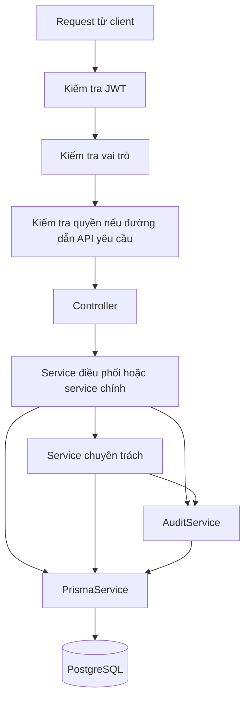
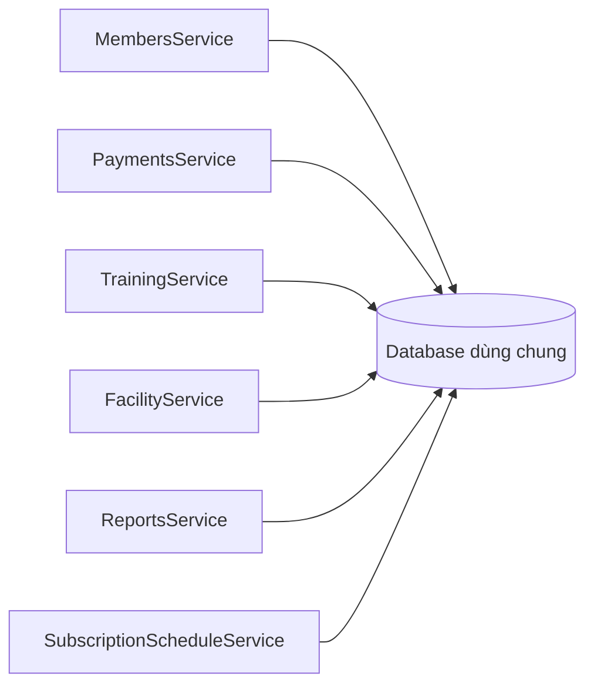

# Báo cáo thiết kế backend và mức độ phụ thuộc giữa các thành phần

## 1. Mục đích của báo cáo

Báo cáo này trả lời ba câu hỏi:

1. Backend trong `server/src` có những module, controller và service nào?
2. Các thành phần phụ thuộc vào nhau theo cách nào?
3. Mức phụ thuộc đó có làm hệ thống khó sửa, khó test hoặc khó mở rộng hay không?

Kết quả được lấy trực tiếp từ mã nguồn ngày 21/06/2026. Báo cáo kiểm tra:

- danh sách `imports`, `providers`, `controllers` và `exports` trong từng module;
- các thành phần được truyền vào constructor;
- lời gọi giữa controller và service;
- lời gọi giữa các service;
- cách các service truy cập dữ liệu qua `PrismaService`;
- các import giữa file TypeScript.

DTO, exception và Prisma model không được tính là service. Tuy nhiên, chúng vẫn được xem xét nếu làm hai thành phần phụ thuộc vào nhau nhiều hơn.

## 2. Một số từ được dùng trong báo cáo

| Từ | Cách hiểu đơn giản |
| --- | --- |
| Coupling | Mức độ một thành phần phụ thuộc vào thành phần khác. |
| Service điều phối | Service nhận yêu cầu chính rồi gọi các service nhỏ hơn để hoàn thành công việc. |
| Service chuyên trách | Service chỉ tập trung vào một nhóm việc nhỏ, ví dụ chấm công hoặc bảo trì. |
| Ranh giới chức năng | Giới hạn trách nhiệm của một module hoặc service. |
| Quy tắc nghiệp vụ | Điều kiện mà hệ thống phải luôn giữ đúng, ví dụ chỉ hội viên còn gói tập mới được check-in. |
| Dữ liệu trao đổi | Dữ liệu mà hai thành phần truyền cho nhau khi gọi hàm. |
| Trạng thái dùng chung | Dữ liệu mà nhiều thành phần cùng đọc hoặc sửa, ví dụ database. |

Trong tài liệu này, **service điều phối** là từ thay cho cách gọi khó hiểu trước đây. Ví dụ, `StaffService` là service điều phối vì nó nhận yêu cầu về nhân viên rồi chuyển phần lịch làm việc cho `StaffScheduleService` và phần chấm công cho `StaffAttendanceService`.

## 3. Kết quả kiểm kê

| Loại thành phần | Số lượng |
| --- | ---: |
| Module | 16 |
| Service | 32 |
| Controller | 19 |
| Guard | 4 |
| JWT strategy | 1 |

Trong 16 module có:

- một module gốc là `AppModule`;
- 12 module nghiệp vụ;
- ba module hạ tầng dùng chung.

Không có vòng phụ thuộc khi chương trình chạy. Có ba vòng import chỉ liên quan đến kiểu dữ liệu trong phần `auth`; chúng không làm ứng dụng lỗi khi chạy nhưng vẫn nên được dọn lại.

## 4. Cấu trúc chung của backend

Một request thường đi qua các bước sau:



[`AppModule`](../../server/src/app.module.ts) nạp cấu hình và tất cả module. `ConfigModule`, `PrismaModule`, `OtpStoreModule` và `PermissionCacheModule` cung cấp các chức năng dùng chung.

Các module nghiệp vụ gần như không import trực tiếp lẫn nhau. Tuy nhiên, nhiều module cùng dùng `PrismaService`, nên chúng vẫn phụ thuộc gián tiếp vào cùng một database.

## 5. Các thành phần và trách nhiệm chính

### 5.1. Thành phần dùng chung

| Thành phần | Trách nhiệm chính |
| --- | --- |
| [`AppModule`](../../server/src/app.module.ts) | Khởi tạo và kết nối toàn bộ backend. |
| [`PrismaModule`](../../server/src/prisma/prisma.module.ts) | Cung cấp `PrismaService` cho toàn hệ thống. |
| [`PrismaService`](../../server/src/prisma/prisma.service.ts) | Kết nối PostgreSQL và cung cấp các lệnh đọc, ghi dữ liệu. |
| [`PermissionCacheModule`](../../server/src/common/cache/permission-cache.module.ts) | Cung cấp bộ nhớ đệm cho quyền người dùng. |
| [`InMemoryPermissionCacheService`](../../server/src/common/cache/in-memory-permission-cache.service.ts) | Lưu tạm quyền người dùng trong bộ nhớ theo thời gian hết hạn. |
| [`OtpStoreModule`](../../server/src/common/otp-store/otp-store.module.ts) | Cung cấp kho lưu OTP cho toàn hệ thống. |
| [`OtpStoreService`](../../server/src/common/otp-store/otp-store.service.ts) | Lưu OTP, thời gian hết hạn và số lần nhập sai. |
| [`RateLimitService`](../../server/src/common/rate-limit/rate-limit.service.ts) | Giới hạn số lần gửi hoặc nhập OTP trong một khoảng thời gian. |
| [`AuditService`](../../server/src/common/audit/audit.service.ts) | Ghi lại các thao tác quan trọng vào bảng audit log. |

### 5.2. Module nghiệp vụ

| Module | Controller | Service và trách nhiệm |
| --- | --- | --- |
| [`AuthModule`](../../server/src/auth/auth.module.ts) | `AuthController` | `AuthService`: đăng nhập, đổi mật khẩu và điều phối các luồng xác thực; `UsersService`: tìm người dùng và vai trò; `PasswordResetService`: quên mật khẩu; `EmailVerificationService`: xác minh email; `LineOAuthService`: đăng nhập LINE. |
| `HealthModule` | `HealthController` | Kiểm tra API và kết nối database. Module này không có service riêng. |
| [`RbacModule`](../../server/src/rbac/rbac.module.ts) | `PermissionsController`, `GroupsController`, `UsersAdminController` | `RbacService`: quản lý quyền, nhóm quyền, người dùng và việc gán nhóm. |
| [`MembershipModule`](../../server/src/membership/membership.module.ts) | `PackagesController`, `SubscriptionsController` | `PackagesService`: quản lý gói tập; `SubscriptionsService`: tạo, gia hạn và hủy đăng ký; `SubscriptionScheduleService`: tự cập nhật trạng thái đăng ký theo lịch. |
| [`MembersModule`](../../server/src/members/members.module.ts) | `MembersController` | `MembersService`: quản lý hội viên và điều phối; `TrainerAssignmentService`: gán huấn luyện viên; `MemberProgressService`: ghi tiến độ. |
| [`PaymentsModule`](../../server/src/payments/payments.module.ts) | `PaymentsController`, `PaymentAccountsController` | `PaymentsService`: xử lý thanh toán và tài khoản thanh toán. |
| [`TrainingModule`](../../server/src/training/training.module.ts) | `TrainingController`, `DeviceController` | `TrainingService`: quản lý buổi tập và điều phối; `AttendanceService`: check-in/check-out; `DeviceAccessService`: xử lý dữ liệu từ thiết bị ra vào. |
| [`FeedbackModule`](../../server/src/feedback/feedback.module.ts) | `FeedbackController` | `FeedbackService`: tạo, phân công, cập nhật và xóa mềm phản hồi. |
| [`WorkoutModule`](../../server/src/workout/workout.module.ts) | `ExercisesController`, `WorkoutPlansController`, `WorkoutLogsController` | `ExercisesService`: quản lý bài tập; `WorkoutPlansService`: quản lý giáo án và gán giáo án; `WorkoutLogsService`: lưu nhật ký tập luyện. |
| [`StaffModule`](../../server/src/staff/staff.module.ts) | `StaffController` | `StaffService`: quản lý nhân viên và điều phối; `StaffScheduleService`: quản lý lịch làm việc; `StaffAttendanceService`: chấm công. |
| [`FacilityModule`](../../server/src/facility/facility.module.ts) | `FacilityController` | `FacilityService`: quản lý phòng tập và điều phối; `EquipmentService`: quản lý thiết bị; `MaintenanceService`: quản lý bảo trì. |
| [`ReportsModule`](../../server/src/reports/reports.module.ts) | `ReportsController` | `ReportsService`: tổng hợp doanh thu, hội viên, gia hạn, nhân viên và gói tập. |

### 5.3. Xác thực và phân quyền

| Thành phần | Trách nhiệm |
| --- | --- |
| `JwtStrategy` | Kiểm tra JWT và tạo thông tin người dùng hiện tại. |
| `JwtAuthGuard` | Yêu cầu JWT, trừ đường dẫn API có `@Public()`. |
| `RolesGuard` | Kiểm tra vai trò được khai báo bằng `@Roles()`. |
| `PermissionsGuard` | Kiểm tra quyền chi tiết của người dùng. |
| `DeviceApiKeyGuard` | Kiểm tra khóa `X-Device-API-Key` của thiết bị. |

## 6. Sáu mức Coupling

Các mức dưới đây được xếp từ phụ thuộc xấu nhất đến phụ thuộc ít nhất.

| Mức | Giải thích đơn giản | Mức mong muốn |
| --- | --- | --- |
| **Content Coupling** | Một thành phần đi thẳng vào phần dữ liệu hoặc cách làm bên trong của thành phần khác. | Nên tránh. |
| **Common Coupling** | Nhiều thành phần cùng đọc hoặc sửa một vùng dữ liệu dùng chung. | Cần kiểm soát chặt. |
| **Control Coupling** | Thành phần gọi truyền cờ hoặc vai trò để bắt thành phần được gọi chạy theo một nhánh cụ thể. | Chỉ nên dùng khi thật cần thiết. |
| **Stamp Coupling** | Truyền cả một đối tượng dữ liệu lớn trong khi bên nhận chỉ cần vài trường. | Nên truyền dữ liệu nhỏ hơn. |
| **Data Coupling** | Chỉ truyền đúng dữ liệu cần dùng, ví dụ ID hoặc DTO dành riêng cho thao tác. | Tốt, nên ưu tiên. |
| **Uncoupled** | Hai thành phần không gọi nhau và không dùng chung trạng thái quan trọng. | Rất tốt nếu hai chức năng không liên quan. |

DTO không tự động là Stamp Coupling. Nếu DTO được tạo riêng cho một thao tác và các trường trong đó đều cần thiết, đây vẫn là Data Coupling.

## 7. Coupling trong backend hiện tại

### 7.1. Content Coupling

**Đánh giá: không có Content Coupling đúng nghĩa, nhưng có một số chỗ vượt qua ranh giới chức năng.**

Không có class nào đọc trực tiếp biến private của class khác hoặc sửa mã bên trong class khác. Tuy nhiên, một số thành phần đọc hoặc ghi dữ liệu thuộc phần việc của module khác qua Prisma:

- [`UsersAdminController`](../../server/src/rbac/users-admin.controller.ts) tự đọc bảng `userGroup` thay vì gọi `RbacService`;
- [`MembersService`](../../server/src/members/members.service.ts) tạo trực tiếp cả subscription và payment;
- [`SubscriptionScheduleService`](../../server/src/membership/schedule/subscription-schedule.service.ts) sửa trực tiếp `member.primaryTrainerId`;
- [`FacilityService`](../../server/src/facility/facility.service.ts) đọc `trainingSession` để quyết định có được xóa phòng hay không;
- [`TrainingService`](../../server/src/training/training.service.ts) đọc dữ liệu giáo án thuộc phần workout.

Các chỗ này chưa phải Content Coupling theo định nghĩa chặt, vì chúng vẫn dùng các hàm công khai của Prisma. Dù vậy, hậu quả khá giống nhau: khi cách lưu dữ liệu của một module thay đổi, module khác cũng có thể bị lỗi.

Cách cải thiện:

1. Chuyển truy vấn trong `UsersAdminController` vào `RbacService`.
2. Quy định rõ module nào quản lý từng loại dữ liệu.
3. Khi một nghiệp vụ cần nhiều module, tạo một service điều phối riêng thay vì để mọi service tự sửa mọi bảng.

### 7.2. Common Coupling

**Đánh giá: cao. Đây là vấn đề phụ thuộc lớn nhất của backend.**

`PrismaService` được dùng trong toàn hệ thống. Có 32 thành phần sử dụng trực tiếp Prisma Client. Vì vậy, các service khác nhau có thể cùng đọc và sửa database.



Trạng thái dùng chung còn xuất hiện ở:

- cấu hình chung trong `ConfigModule`;
- OTP lưu trong bộ nhớ của tiến trình;
- cache quyền lưu trong bộ nhớ;
- các giao dịch database sửa nhiều bảng cùng lúc.

Không phải mọi thành phần dùng chung đều xấu. Cấu hình chung và cache quyền có phạm vi khá rõ. Vấn đề lớn nhất là mọi service đều có thể dùng toàn bộ Prisma Client và truy cập gần như mọi bảng.

Hậu quả:

- đổi cấu trúc database có thể ảnh hưởng nhiều service;
- khó biết service nào chịu trách nhiệm giữ một quy tắc nghiệp vụ;
- module nhìn có vẻ độc lập nhưng vẫn phụ thuộc nhau qua database;
- test phải dựng một Prisma giả có nhiều hàm;
- khó đổi công cụ truy cập database hoặc tách hệ thống thành nhiều dịch vụ nhỏ sau này.

Cách cải thiện là tạo giao diện chung hoặc service trung gian tại những chỗ có quy tắc nghiệp vụ quan trọng. Không cần tạo một lớp bọc cho mọi câu lệnh Prisma. Chỉ nên thêm lớp trung gian khi nó giúp bảo vệ quy tắc hoặc giảm số thành phần biết chi tiết database.

### 7.3. Control Coupling

**Đánh giá: trung bình.**

| Nơi gọi | Dữ liệu điều khiển | Tác dụng |
| --- | --- | --- |
| `FacilityController` gọi xóa thiết bị | `force`, `callerRoles` | Cho phép owner ép xóa thiết bị. |
| `UsersAdminController` gọi cập nhật user | `isSelf` | Thay đổi cách xử lý khi user tự sửa tài khoản của mình. |
| `GroupsController` gọi lấy danh sách nhóm | `includeDeleted` | Quyết định có lấy dữ liệu đã xóa hay không. |
| `MembersController` gọi lấy danh sách hội viên | `includeDeleted`, `roles` | Quyết định ai được xem dữ liệu đã xóa. |
| Nhiều controller gọi service | `roles` | Chọn cách xử lý cho owner, staff, trainer hoặc member. |

Loại phụ thuộc này không thể bỏ hoàn toàn vì hệ thống cần kiểm tra quyền và tùy chọn tìm kiếm. Tuy nhiên, quá nhiều cờ boolean làm hàm khó hiểu và làm số trường hợp test tăng lên.

Cách cải thiện:

- nếu xóa thường và ép xóa ngày càng khác nhau, tách thành hai hàm có tên rõ;
- để service tự xác định user có đang sửa chính mình hay không;
- gom tùy chọn tìm kiếm vào DTO có tên rõ;
- giữ việc kiểm tra quyền trong service chịu trách nhiệm cho nghiệp vụ đó.

### 7.4. Stamp Coupling

**Đánh giá: trung bình. Phần lớn nằm ở đối tượng `AuthenticatedUser`.**

`AuthenticatedUser` có các trường như `userId`, `email`, `roles`, `staffId` và `memberId`. Nhiều service nhận toàn bộ dữ liệu này dù chỉ dùng một hoặc hai trường.

Ví dụ:

- `WorkoutPlansService` thường chỉ cần ID và vai trò nhưng nhận cả user;
- `WorkoutLogsService` nhận cả user để tìm member;
- `PaymentsService` nhận cả user để lấy vai trò hoặc member ID;
- `MembersService` nhận cả user để kiểm tra quyền;
- nhiều module phải lấy kiểu dữ liệu người dùng từ thư mục `auth`.

Hậu quả là khi `AuthenticatedUser` thay đổi, nhiều module có thể phải sửa theo.

Cách cải thiện:

- chuyển các kiểu dữ liệu dùng chung như `AuthenticatedUser`, `CurrentUser` và `Role` sang `common/security`;
- tạo đối tượng dữ liệu nhỏ theo từng việc, ví dụ chỉ gồm `userId` và `roles`;
- dùng `Pick<AuthenticatedUser, 'userId' | 'roles'>` nếu chưa cần tạo kiểu dữ liệu mới.

Các DTO như `CreateMemberDto`, `CreateSessionDto` và `AssignPlanDto` không bị xem là Stamp Coupling vì chúng được tạo riêng cho từng thao tác.

### 7.5. Data Coupling

**Đánh giá: cao theo hướng tích cực. Đây là điểm tốt của backend.**

Nhiều service điều phối đã chuyển đúng dữ liệu cần thiết cho service chuyên trách:

| Quan hệ | Dữ liệu được truyền |
| --- | --- |
| `AuthService` → `PasswordResetService` | Email, OTP, mật khẩu mới và thông tin request cần thiết. |
| `AuthService` → `EmailVerificationService` | Email, OTP và thông tin request cần thiết. |
| `AuthService` → `LineOAuthService` | LINE ID token và thông tin request cần thiết. |
| `MembersService` → `TrainerAssignmentService` | Member ID, trainer ID và user thực hiện. |
| `MembersService` → `MemberProgressService` | Member ID và DTO tiến độ. |
| `StaffService` → `StaffScheduleService` | Staff ID, DTO lịch hoặc khoảng ngày. |
| `StaffService` → `StaffAttendanceService` | Staff ID và điều kiện lấy dữ liệu chấm công. |
| `FacilityService` → `EquipmentService` | Equipment ID, DTO và user thực hiện. |
| `FacilityService` → `MaintenanceService` | Equipment ID hoặc maintenance ID và DTO. |
| `TrainingService` → `AttendanceService` | DTO điểm danh, ID và thông tin người gọi. |
| `TrainingService` → `DeviceAccessService` | Dữ liệu sự kiện từ thiết bị. |

Controller cũng chủ yếu truyền ID, DTO và thông tin người dùng cho service. Controller không tự xử lý giao dịch database hoặc chứa nhiều quy tắc nghiệp vụ.

Đây là hướng tốt:

```text
Controller -> Service điều phối -> Service chuyên trách
```

Nên tiếp tục ưu tiên cách truyền dữ liệu nhỏ và rõ như trên.

### 7.6. Uncoupled

**Đánh giá: tốt nếu chỉ nhìn cách module gọi nhau; thấp hơn nếu xét database.**

Không có module nghiệp vụ nào import trực tiếp module nghiệp vụ khác. Không có `forwardRef`, `ModuleRef` hoặc vòng phụ thuộc do NestJS tạo giữa các module.

Tuy nhiên, hai module không gọi nhau chưa chắc đã hoàn toàn độc lập. Ví dụ, `MembersModule` và `PaymentsModule` không import nhau, nhưng cả hai đều đọc hoặc sửa member, subscription và payment qua database.

Vì vậy:

- phần lớn module không phụ thuộc trực tiếp vào nhau;
- nhiều module vẫn phụ thuộc gián tiếp qua database;
- chỉ những cặp không gọi nhau và không dùng chung dữ liệu quan trọng mới thật sự độc lập, ví dụ kho OTP và cache quyền.

## 8. Bảng tổng hợp

| Loại Coupling | Mức xuất hiện | Ví dụ chính | Nhận xét |
| --- | --- | --- | --- |
| Content | Không có dạng đúng nghĩa; có một số chỗ vượt ranh giới | Controller tự query Prisma; service sửa dữ liệu của phần khác | Nên sửa từng chỗ cụ thể. |
| Common | Cao | Prisma và database dùng chung | Rủi ro lớn nhất. |
| Control | Trung bình | `force`, `includeDeleted`, `isSelf`, `roles` | Cần đặt tên và giới hạn rõ. |
| Stamp | Trung bình | Truyền toàn bộ `AuthenticatedUser` | Nên truyền dữ liệu nhỏ hơn. |
| Data | Cao | Truyền ID và DTO giữa các service | Điểm tốt, nên giữ. |
| Uncoupled | Tốt ở cách nối module, thấp hơn ở dữ liệu | Module không import nhau nhưng dùng chung DB | Phải xem cả lời gọi và dữ liệu. |

## 9. Các vấn đề cụ thể cần chú ý

### 9.1. Ba vòng import type trong Auth

Ba vòng import là:

```text
AuthService <-> PasswordResetService
AuthService <-> EmailVerificationService
AuthService <-> LineOAuthService
```

Nguyên nhân là các service nhỏ lấy `RequestContext` hoặc `LoginResult` từ `auth.service.ts`, trong khi `AuthService` lại gọi các service này.

Các import đều dùng `import type`, nên chúng không tạo vòng khi JavaScript chạy. Dù vậy, vị trí đặt các kiểu dữ liệu này chưa hợp lý. Nên chuyển chúng sang `auth/types/auth-contracts.ts`.

### 9.2. Dependency không được sử dụng

[`JwtStrategy`](../../server/src/auth/strategies/jwt.strategy.ts) nhận `PrismaService` trong constructor nhưng không dùng đến. Nên xóa phần phụ thuộc này.

### 9.3. Controller tự truy cập database

`UsersAdminController` vừa gọi `RbacService` vừa tự truy vấn Prisma. Phần lấy dữ liệu tổng hợp quyền nên được chuyển vào `RbacService`.

`HealthController` tự chạy `SELECT 1` là hợp lý vì đây chỉ là kiểm tra kết nối database, không phải nghiệp vụ.

### 9.4. Đăng ký AuditService bị lặp

`AuditService` được khai báo lại trong mười module. Cách này vẫn chạy đúng vì service gần như không giữ trạng thái riêng, nhưng làm cấu hình bị lặp. Có thể tạo `AuditModule` dùng chung nếu muốn quản lý tập trung hơn.

Nhiều module cũng export service nhưng hiện chưa có module nghiệp vụ nào import chúng. Chỉ nên export khi thật sự có nơi khác sử dụng.

### 9.5. Comment của DeviceController chưa đúng với cách chạy

`DeviceController` có comment “no JWT auth” và dùng `DeviceApiKeyGuard`, nhưng không có `@Public()`. Vì `JwtAuthGuard` áp dụng toàn hệ thống, endpoint hiện cần cả JWT và `X-Device-API-Key`.

- Nếu thiết bị chỉ cần API key: thêm `@Public()`.
- Nếu đường dẫn API cần cả hai: sửa comment và tài liệu API.

## 10. Hướng cải thiện

### Ưu tiên 1: sửa các phần phụ thuộc sai hoặc thừa

1. Chuyển truy vấn quyền từ `UsersAdminController` vào `RbacService`.
2. Xóa `PrismaService` khỏi `JwtStrategy`.
3. Chuyển `RequestContext` và `LoginResult` sang file kiểu dữ liệu riêng.
4. Làm rõ cách xác thực của `DeviceController`.

### Ưu tiên 2: truyền dữ liệu nhỏ và rõ hơn

1. Chuyển kiểu dữ liệu bảo mật dùng chung sang `common/security`.
2. Không truyền toàn bộ `AuthenticatedUser` nếu chỉ cần ID và vai trò.
3. Hạn chế cờ boolean; dùng tên hàm hoặc DTO rõ nghĩa hơn.

### Ưu tiên 3: giảm việc mọi service cùng dùng toàn bộ Prisma

1. Quy định rõ module nào chịu trách nhiệm cho từng loại dữ liệu.
2. Tạo service hoặc giao diện chung làm lớp trung gian cho các quy tắc quan trọng.
3. Cân nhắc một service điều phối riêng cho luồng tạo hội viên, đăng ký và thanh toán.
4. Không tạo lớp bọc Prisma chỉ để đổi tên hàm; lớp mới phải giúp bảo vệ quy tắc hoặc giảm phụ thuộc thật sự.

### Ưu tiên 4: tiếp tục chia nhỏ service lớn

Các service cần xem xét trước:

- `TrainingService`;
- `WorkoutPlansService`;
- `MembersService`;
- `SubscriptionsService`;
- `ReportsService`;
- `RbacService`.

Không nên chia chỉ vì file dài. Chỉ nên chia khi một nhóm hàm có trách nhiệm riêng rõ ràng. Ví dụ, có thể tách phần quản lý buổi tập, phần tiến độ tập và phần gán giáo án thành các service riêng.

## 11. Ảnh hưởng của Coupling

### 11.1. Kết luận nhanh

Coupling hiện tại **có làm hệ thống khó sửa, khó test và khó mở rộng**, nhưng không phải mọi phần đều khó như nhau.

| Công việc | Mức khó | Lý do chính |
| --- | --- | --- |
| Sửa CRUD trong một module | Thấp đến trung bình | Controller và service trao đổi dữ liệu khá rõ. |
| Sửa quy tắc liên quan nhiều module | Cao | Nhiều service cùng dùng database. |
| Test service nhỏ | Thấp | Ít thành phần phụ thuộc và ít nhánh xử lý. |
| Test service lớn | Trung bình đến cao | Phải dựng Prisma giả có nhiều hàm và nhiều trường hợp người dùng. |
| Thêm đường dẫn API trong module hiện có | Thấp đến trung bình | Cấu trúc controller và service đã rõ. |
| Thêm nghiệp vụ liên quan nhiều module | Cao | Chưa rõ module nào quản lý dữ liệu và quy tắc chung. |
| Đổi công cụ truy cập hoặc loại database | Rất cao | 32 thành phần dùng trực tiếp Prisma Client. |
| Đổi cách lưu cache quyền | Thấp | Đã có giao diện chung ở giữa. |
| Đổi OTP hoặc giới hạn request sang Redis | Trung bình | Các service đang phụ thuộc trực tiếp vào cách lưu trong bộ nhớ. |

Nói đơn giản: sửa một chức năng nhỏ trong đúng module thường không quá khó. Khó khăn tăng mạnh khi thay đổi liên quan đến database dùng chung, thông tin người dùng hoặc nhiều module cùng lúc.

### 11.2. Coupling có làm khó sửa không?

**Có. Mức ảnh hưởng từ trung bình đến cao.**

Ví dụ, nếu thay đổi quy tắc trạng thái subscription, cần kiểm tra ít nhất:

- `SubscriptionsService`;
- `MembersService`, vì tạo hội viên có thể tạo luôn subscription và payment;
- `PaymentsService`, vì thanh toán có thể đổi trạng thái subscription;
- `TrainingService` và `AttendanceService`, vì quyền tập phụ thuộc gói tập;
- `SubscriptionScheduleService`, vì có tác vụ tự đổi trạng thái;
- `ReportsService`, vì báo cáo đọc các dữ liệu này.

Thay đổi `AuthenticatedUser` cũng có thể làm nhiều module phải sửa vì object này đang được truyền rộng khắp hệ thống.

Tuy nhiên, các service chuyên trách như `StaffAttendanceService` dễ sửa hơn. Nếu tên hàm và dữ liệu trả về không đổi, phần còn lại của module ít bị ảnh hưởng.

Kết luận:

- sửa bên trong một service nhỏ: tương đối dễ;
- sửa dữ liệu trao đổi giữa controller và service: mức khó trung bình;
- sửa cấu trúc database hoặc quy tắc liên quan nhiều module: khó;
- thay toàn bộ cách truy cập dữ liệu: rất khó.

### 11.3. Coupling có làm khó test không?

**Có. Service càng lớn và dùng càng nhiều bảng thì càng khó test.**

Backend hiện có 48 file test, nên hệ thống vẫn có khả năng test tốt. Vấn đề là nhiều test phải chuẩn bị quá nhiều dữ liệu giả.

Ví dụ, test của `FacilityService` phải tạo:

- Prisma giả;
- `EquipmentService`;
- `MaintenanceService`;
- Audit giả;
- dữ liệu giả cho room, equipment, maintenance, staff và training session;
- cách giả lập giao dịch database.

Hậu quả:

- phần chuẩn bị test dài;
- test khó đọc;
- đổi `include`, `select` hoặc cấu trúc câu truy vấn có thể làm test hỏng dù kết quả nghiệp vụ không đổi;
- `mockPrisma as any` làm TypeScript khó phát hiện phần giả bị sai;
- cờ như `force`, `includeDeleted`, `isSelf` và các vai trò tạo thêm nhiều trường hợp phải test.

Các thành phần nhỏ như `RateLimitService`, `OtpStoreService`, `JwtAuthGuard` và `RolesGuard` dễ test hơn vì có ít phần phụ thuộc và ít dữ liệu cần chuẩn bị.

Điểm tốt nhất là cache quyền đã có giao diện chung. Khi test, có thể thay cache thật bằng cache giả mà không phải sửa `PermissionsGuard` hoặc `RbacService`.

### 11.4. Coupling có làm khó mở rộng không?

**Có, nhưng chủ yếu ở các chức năng liên quan nhiều module.**

Điểm thuận lợi:

- thêm đường dẫn API vào module hiện có khá rõ ràng;
- thêm service chuyên trách trong cùng module ít rủi ro;
- không có vòng phụ thuộc khi chương trình chạy;
- hệ thống đã có ví dụ tách tốt như chấm công, lịch làm việc, bảo trì và gán huấn luyện viên.

Điểm khó:

- thêm chức năng liên quan hội viên, đăng ký, thanh toán và buổi tập dễ dẫn đến một service mới tiếp tục truy cập nhiều bảng;
- thêm trạng thái subscription mới có thể phải sửa nhiều service và báo cáo;
- khó tách một module thành dịch vụ độc lập vì một giao dịch database có thể đi qua nhiều bảng;
- rất khó thay Prisma vì nhiều service dùng trực tiếp API của Prisma;
- muốn đổi LINE hoặc ExerciseDB phải sửa service đang gọi trực tiếp hệ thống đó;
- khi chạy nhiều server cùng lúc, OTP, giới hạn request và cache trong bộ nhớ có thể không giống nhau giữa các server.

Cache quyền là ví dụ mở rộng tốt: có thể thay cách lưu trong bộ nhớ bằng Redis mà gần như không đổi phần sử dụng cache. Kho OTP và giới hạn request chưa có cách tách tương tự.

### 11.5. Ảnh hưởng của từng loại Coupling

| Loại | Khó sửa | Khó test | Khó mở rộng | Ảnh hưởng chính |
| --- | --- | --- | --- | --- |
| Content hoặc gần giống Content | Cao | Cao | Cao | Một phần biết quá nhiều về dữ liệu bên trong của phần khác. |
| Common | Cao | Cao | Cao | Database dùng chung làm thay đổi lan sang nhiều service. |
| Control | Trung bình | Trung bình đến cao | Trung bình | Nhiều cờ và vai trò tạo thêm nhánh xử lý. |
| Stamp | Trung bình | Trung bình | Trung bình | Object lớn làm thay đổi lan rộng và test cần nhiều dữ liệu giả. |
| Data | Thấp | Thấp | Thấp | Dữ liệu nhỏ và rõ giúp thay đổi được giới hạn. |
| Uncoupled | Thấp | Thấp | Thấp | Thành phần có thể được sửa và test riêng. |

### 11.6. Nhóm có rủi ro cao nhất

| Nhóm | Mức rủi ro | Lý do |
| --- | --- | --- |
| `TrainingService`, `MembersService`, `SubscriptionsService` | Cao | Dùng nhiều bảng và chứa nhiều quy tắc liên quan các module khác. |
| `WorkoutPlansService`, `ReportsService`, `RbacService` | Trung bình đến cao | Có nhiều chức năng hoặc đọc dữ liệu trên phạm vi rộng. |
| `FacilityService`, `StaffService`, `AuthService` | Trung bình | Đã tách service nhỏ nhưng service điều phối vẫn tự truy cập Prisma. |
| Service chuyên trách về chấm công, lịch và bảo trì | Thấp đến trung bình | Phạm vi nhỏ hơn nhưng vẫn dùng trực tiếp Prisma và Audit. |
| Cache quyền | Thấp | Đã có giao diện chung ở giữa. |
| OTP và giới hạn request trong bộ nhớ | Thấp khi chạy một server, trung bình khi chạy nhiều server | Dữ liệu nằm riêng trong từng tiến trình. |

### 11.7. Đánh giá cuối cùng

Mức rủi ro coupling chung của backend là **trung bình đến cao**. Vấn đề lớn nhất là nhiều service cùng dùng toàn bộ Prisma Client và database.

Hệ thống chưa cần viết lại từ đầu. Controller phần lớn còn gọn, không có vòng phụ thuộc khi chạy và nhiều service điều phối đã chuyển công việc nhỏ cho service chuyên trách.

Nên sửa theo thứ tự sau:

1. Loại bỏ phần phụ thuộc thừa và truy vấn Prisma nằm sai lớp.
2. Truyền dữ liệu người dùng nhỏ hơn.
3. Quy định rõ module nào quản lý từng loại dữ liệu.
4. Thêm giao diện chung ở giữa tại các quy tắc quan trọng.
5. Tiếp tục giữ cách truyền ID và DTO rõ ràng giữa các service.

Làm theo thứ tự này sẽ giúp backend dễ sửa, dễ test và dễ mở rộng hơn mà không cần thay đổi toàn bộ kiến trúc cùng lúc.
