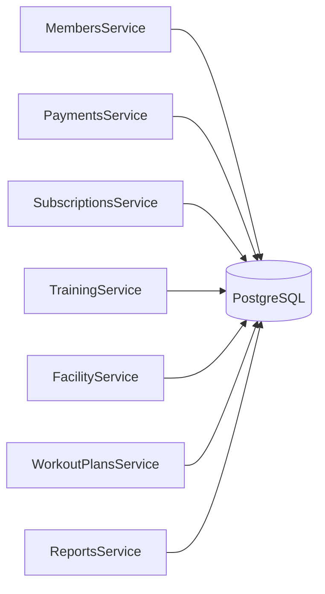
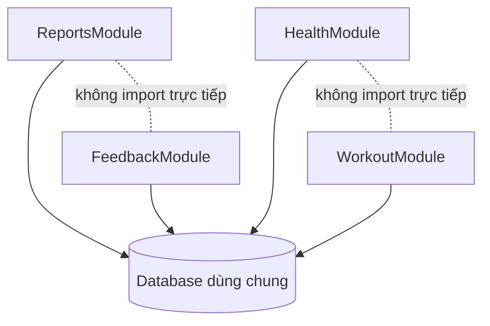

# Báo cáo Coupling trong thiết kế backend

## 1. Mục đích và phạm vi

Báo cáo này phân tích mã nguồn đã được xây dựng trong `server/src` theo sáu loại Coupling:

1. Content Coupling;
2. Common Coupling;
3. Control Coupling;
4. Stamp Coupling;
5. Data Coupling;
6. Uncoupled.

Mỗi loại được trình bày theo cùng một bố cục: định nghĩa, bằng chứng trong mã nguồn, tác động và hướng xử lý. Kết quả được đối chiếu trực tiếp với mã nguồn ngày 21/06/2026.

Coupling luôn được đánh giá giữa **hai thành phần cụ thể**. Một class có thể đồng thời Data Coupling với service chuyên trách nhưng Common Coupling với các service khác qua database. Vì vậy, báo cáo không gắn một nhãn duy nhất cho toàn bộ class hoặc module.

## 2. Thang đánh giá

Các loại dưới đây được sắp từ phụ thuộc chặt và rủi ro cao đến phụ thuộc thấp:

| Loại | Dấu hiệu chính | Nhận định mong muốn |
| --- | --- | --- |
| **Content Coupling** | Thành phần truy cập hoặc phụ thuộc trực tiếp chi tiết bên trong của thành phần khác | Cần tránh |
| **Common Coupling** | Nhiều thành phần cùng đọc hoặc sửa một trạng thái dùng chung | Cần kiểm soát chặt |
| **Control Coupling** | Bên gọi truyền cờ hoặc mã điều khiển để quyết định nhánh chạy của bên nhận | Chỉ dùng khi biểu diễn đúng nghiệp vụ |
| **Stamp Coupling** | Bên gọi truyền một object lớn trong khi bên nhận chỉ dùng một phần | Nên thu hẹp dữ liệu truyền |
| **Data Coupling** | Hai bên chỉ trao đổi đúng ID, giá trị hoặc DTO cần thiết | Tốt, nên ưu tiên |
| **Uncoupled** | Hai thành phần không gọi nhau, không import nhau và không dùng chung trạng thái liên quan | Tốt khi hai chức năng độc lập |

DTO không tự động tạo Stamp Coupling. Nếu DTO được thiết kế riêng cho một use case và các trường của nó đều thuộc use case đó, việc truyền DTO vẫn là Data Coupling.

## 3. Content Coupling

### 3.1. Định nghĩa

Content Coupling xuất hiện khi một thành phần biết hoặc can thiệp trực tiếp vào cách làm bên trong của thành phần khác, ví dụ:

- đọc hoặc sửa biến private của class khác;
- nhảy vào luồng xử lý nội bộ của thành phần khác;
- sửa trạng thái nội bộ mà không đi qua API công khai;
- phụ thuộc vào bố cục hoặc thuật toán nội bộ không nằm trong hợp đồng.

### 3.2. Kết quả rà soát

**Không phát hiện Content Coupling đúng nghĩa trong `server/src`.**

Controller gọi method public của service; service chuyên trách được truyền qua constructor; các provider trao đổi qua method công khai. Không có class nào truy cập biến private của class khác, dùng reflection để thay đổi trạng thái nội bộ hoặc gọi vào một bước giữa của thuật toán bên ngoài.

Việc các service gọi `this.prisma.*` cũng không phải Content Coupling theo định nghĩa chặt, vì đó là API public của Prisma Client. Tuy nhiên, nó có thể tạo Common Coupling hoặc làm rò rỉ ranh giới domain.

### 3.3. Những đoạn mã gần với rủi ro Content Coupling

| Đoạn mã | Phân tích | Phân loại chính xác hơn |
| --- | --- | --- |
| [`UsersAdminController.assertPermission()`](../../server/src/rbac/users-admin.controller.ts#L101-L108) tự dựng truy vấn `userGroup → group → permissions` | Controller biết chi tiết cấu trúc lưu quyền thay vì chỉ phụ thuộc hành vi “kiểm tra quyền” | Layer violation và Common Coupling với schema, chưa phải Content Coupling giữa hai class |
| [`FacilityService`](../../server/src/facility/facility.service.ts#L139-L142) đọc `trainingSession` để quyết định xóa phòng | Facility biết dữ liệu thuộc luồng training | Rò rỉ ranh giới domain qua database dùng chung |
| [`TrainingService`](../../server/src/training/training.service.ts#L823-L852) đọc `memberWorkoutPlan` và `workoutPlanDay` | Training phụ thuộc trực tiếp schema của workout plan | Common Coupling với database và schema liên domain |
| [`SubscriptionScheduleService`](../../server/src/membership/schedule/subscription-schedule.service.ts#L31-L37) sửa `member.primaryTrainerId` | Membership tác động dữ liệu thuộc member | Common Coupling với trạng thái dùng chung |

Các trường hợp trên đáng cải thiện, nhưng gọi chúng là Content Coupling sẽ làm sai bản chất vấn đề. Hướng xử lý phù hợp là đưa truy vấn sau một service/port có tên theo nghiệp vụ, thay vì cố che các chi tiết private vốn chưa bị xâm phạm.

### 3.4. Biểu hiện mã nguồn đang làm tốt

Backend đang tránh Content Coupling bằng các cách sau:

- **Giữ trạng thái nội bộ ở chế độ private.** `store` của [`OtpStoreService`](../../server/src/common/otp-store/otp-store.service.ts#L9-L36), `RateLimitService` và `InMemoryPermissionCacheService` không bị client truy cập trực tiếp. Các client phải đi qua method public như `get`, `set`, `delete` hoặc `isAllowed`.
- **Controller giao việc qua API public của service.** Ví dụ, [`FacilityController`](../../server/src/facility/facility.controller.ts#L33-L151) chỉ gọi `FacilityService`; controller không truy cập các field hoặc helper private của service.
- **Service điều phối không can thiệp internals của service chuyên trách.** [`FacilityService`](../../server/src/facility/facility.service.ts#L173-L202) chuyển dữ liệu sang `EquipmentService` và `MaintenanceService`; [`TrainingService`](../../server/src/training/training.service.ts#L571-L588) làm tương tự với attendance và device access.
- **Cache quyền có hợp đồng công khai.** Client phụ thuộc [`IPermissionCacheProvider`](../../server/src/common/interfaces/permission-cache.interface.ts#L3-L7), không biết implementation dùng `Map` và tính thời gian hết hạn ra sao.

Các cách trên bảo vệ implementation detail và làm thay đổi bên trong một service ít lan sang nơi gọi. Đây là lý do backend chưa xuất hiện Content Coupling đúng nghĩa.

### 3.5. Đánh giá

| Tiêu chí | Kết quả |
| --- | --- |
| Mức xuất hiện | Không có ví dụ trực tiếp |
| Rủi ro hiện tại | Thấp |
| Điểm cần theo dõi | Truy vấn vượt ranh giới domain qua Prisma |

## 4. Common Coupling

### 4.1. Định nghĩa

Common Coupling xuất hiện khi nhiều thành phần cùng phụ thuộc một vùng trạng thái dùng chung. Một thành phần có thể làm thay đổi dữ liệu khiến thành phần khác đổi hành vi dù hai bên không gọi trực tiếp nhau.

### 4.2. Database là trạng thái dùng chung lớn nhất

Có **32 file bên ngoài `server/src/prisma`** sử dụng trực tiếp `PrismaService`. Các module nhìn tách biệt ở cấp NestJS nhưng vẫn có thể cùng đọc và sửa PostgreSQL:

Đây là Common Coupling vì database trở thành kênh liên kết ngầm giữa các domain. Một thay đổi schema hoặc quy tắc ghi dữ liệu tại một service có thể làm truy vấn của service khác không còn đúng.

### 4.3. Các đoạn mã cùng sửa hoặc đọc dữ liệu liên domain

| Đoạn mã | Trạng thái dùng chung | Quan hệ phát sinh |
| --- | --- | --- |
| [`MembersService.createMember()`](../../server/src/members/members.service.ts#L63-L132) tạo user, member, subscription và payment trong một transaction | Bảng auth, member, membership và payment | Tạo hội viên phụ thuộc trực tiếp cấu trúc của nhiều domain |
| [`PaymentsService.createPayment()`](../../server/src/payments/payments.service.ts#L32-L139) tạo payment rồi cập nhật subscription | Payment và subscription | Thanh toán có thể thay đổi trạng thái gói đăng ký mà không qua `SubscriptionsService` |
| [`SubscriptionScheduleService`](../../server/src/membership/schedule/subscription-schedule.service.ts#L31-L37) xóa trainer chính khi gói PT hết hạn | Subscription và member | Job membership làm thay đổi dữ liệu member |
| [`FacilityService.deleteRoom()`](../../server/src/facility/facility.service.ts#L135-L153) đếm session tương lai trước khi xóa phòng | Facility và training session | Quy tắc xóa phòng phụ thuộc dữ liệu training |
| [`TrainingService.resolveSessionPlanLink()`](../../server/src/training/training.service.ts#L799-L852) xác minh assignment và plan day | Training session và workout plan | Tạo session phụ thuộc schema workout |
| [`ReportsService`](../../server/src/reports/reports.service.ts) đọc payment, member, subscription và staff | Nhiều bảng nghiệp vụ | Read model báo cáo phụ thuộc rộng vào schema toàn hệ thống |

Một transaction nhiều bảng không tự động là thiết kế xấu; đôi khi nó cần thiết để giữ tính nhất quán. Rủi ro nằm ở việc nhiều service đều biết và tự duy trì cùng một quy tắc liên domain.

### 4.4. Trạng thái in-memory dùng chung

Backend còn có Common Coupling được kiểm soát qua provider:

| Trạng thái | Thành phần sử dụng | Mức rủi ro |
| --- | --- | --- |
| OTP trong [`OtpStoreService`](../../server/src/common/otp-store/otp-store.service.ts) | `PasswordResetService`, `EmailVerificationService`, `MembersService` | Trung bình; cùng tiến trình và mất khi restart |
| Rate-limit trong [`RateLimitService`](../../server/src/common/rate-limit/rate-limit.service.ts) | Luồng quên mật khẩu và xác minh email | Thấp đến trung bình; dùng chung có chủ đích nhưng không chia sẻ giữa nhiều instance server |
| Cache quyền trong [`InMemoryPermissionCacheService`](../../server/src/common/cache/in-memory-permission-cache.service.ts) | `PermissionsGuard` đọc/ghi, `RbacService` vô hiệu hóa | Trung bình; thay đổi quyền cần invalidation chính xác |
| Cấu hình từ `ConfigModule` | Auth, guard, Prisma và các thành phần hạ tầng | Thấp; chủ yếu là trạng thái chỉ đọc |

Điểm tốt là OTP và cache không bị các client sửa trực tiếp `Map`; chúng đi qua service hoặc interface. Cách bao bọc này không xóa Common Coupling nhưng làm nó dễ kiểm soát hơn.

### 4.5. Biểu hiện mã nguồn đang làm tốt

Dù Common Coupling còn cao, một số cơ chế hiện tại đã làm trạng thái dùng chung an toàn và dễ kiểm soát hơn:

- **Tập trung vòng đời database.** [`PrismaService`](../../server/src/prisma/prisma.service.ts#L18-L68) quản lý probe, keepalive và disconnect tại một nơi; các service không tự tạo connection riêng.
- **Dùng transaction cho thay đổi nhiều bảng.** [`MembersService.createMember()`](../../server/src/members/members.service.ts#L63-L132) và [`PaymentsService.createPayment()`](../../server/src/payments/payments.service.ts#L71-L117) gom các write liên quan vào transaction. Nếu một bước thất bại, database không bị giữ ở trạng thái cập nhật dở dang.
- **Bao bọc state in-memory.** OTP, rate-limit và permission cache được quản lý bởi provider/service chuyên trách thay vì export trực tiếp `Map` toàn cục.
- **Cache quyền phụ thuộc abstraction.** [`PermissionCacheModule`](../../server/src/common/cache/permission-cache.module.ts#L5-L15) chọn implementation qua provider token. Điều này cho phép chuyển state sang Redis mà không đổi cách `PermissionsGuard` sử dụng cache.
- **Read-side báo cáo không ghi ngược dữ liệu nghiệp vụ.** `ReportsService` phụ thuộc rộng vào schema để đọc, nhưng không trở thành một nguồn ghi mới cạnh tranh ownership với các domain.

Những biện pháp này không loại bỏ Common Coupling qua database, nhưng giảm nguy cơ connection phân tán, partial write và truy cập state không kiểm soát.

### 4.6. Tác động

- **Khó sửa:** đổi schema có thể ảnh hưởng nhiều service không import nhau.
- **Khó test:** test phải dựng mock Prisma với nhiều delegate và relation.
- **Khó xác định ownership:** cùng một bảng có thể bị nhiều domain ghi.
- **Khó mở rộng hạ tầng:** cache/OTP in-memory không hoạt động như trạng thái dùng chung khi chạy nhiều instance.

### 4.7. Hướng xử lý

1. Xác định domain sở hữu từng bảng và từng quy tắc ghi.
2. Đưa các write path quan trọng như thanh toán, đăng ký và tạo hội viên sau repository hoặc application port.
3. Dùng service điều phối riêng cho use case thực sự cần transaction nhiều domain.
4. Dùng read-model/query service cho báo cáo thay vì ép mọi truy vấn đọc qua repository nghiệp vụ.
5. Khi scale nhiều instance, thay state in-memory bằng backend dùng chung có hợp đồng rõ ràng.

### 4.8. Đánh giá

| Tiêu chí | Kết quả |
| --- | --- |
| Mức xuất hiện | Cao |
| Rủi ro hiện tại | Cao nhất trong sáu loại |
| Điểm tích cực | State in-memory đã được bao bọc bằng service/provider |

## 5. Control Coupling

### 5.1. Định nghĩa

Control Coupling xuất hiện khi bên gọi truyền dữ liệu chủ yếu để ra lệnh cho bên nhận chọn một nhánh xử lý. Dấu hiệu thường gặp là `boolean`, role, status hoặc mode.

Không phải mọi cờ điều khiển đều xấu. Một bộ lọc như `includeDeleted` có thể là dữ liệu nghiệp vụ hợp lệ. Nó trở thành vấn đề khi bên gọi phải biết quá nhiều về thuật toán bên trong hoặc khi số tổ hợp cờ tăng nhanh.

### 5.2. Các đoạn mã đã xây dựng

| Bên gọi → bên nhận | Dữ liệu điều khiển | Nhánh bị điều khiển |
| --- | --- | --- |
| [`FacilityController`](../../server/src/facility/facility.controller.ts#L114-L123) → `EquipmentService.deleteEquipment()` | `force`, `callerRoles` | `force` bỏ qua ràng buộc maintenance đã xử lý; role `owner` quyết định có được ép xóa tại [`equipment.service.ts`](../../server/src/facility/equipment.service.ts#L219-L244) |
| [`UsersAdminController`](../../server/src/rbac/users-admin.controller.ts#L82-L90) → `RbacService.updateUser()` | `isSelf` | Service cấm tự cập nhật status tại [`rbac.service.ts`](../../server/src/rbac/rbac.service.ts#L403-L409) |
| [`GroupsController`](../../server/src/rbac/groups.controller.ts#L30-L38) → `RbacService.listGroups()` | `includeDeleted` | Service thêm hoặc bỏ điều kiện `deletedAt` tại [`rbac.service.ts`](../../server/src/rbac/rbac.service.ts#L61-L67) |
| `MembersController` → [`MembersService.listMembers()`](../../server/src/members/members.service.ts#L257-L279) | `includeDeleted`, `caller.roles` | Owner có thể xem dữ liệu đã xóa; trainer bị giới hạn theo member phụ trách |
| `TrainingController` → [`TrainingService`](../../server/src/training/training.service.ts#L770-L784) | `caller.roles` | Service chọn policy owner/staff, trainer hoặc member |
| `TrainingService.createSession()` → `resolveSessionPlanLink()` | `required` | PT bị buộc liên kết giáo án, các vai trò khác có thể bỏ qua tại [`training.service.ts`](../../server/src/training/training.service.ts#L799-L817) |

### 5.3. Phân tích mức hợp lý

- `includeDeleted` là control data chấp nhận được vì nó biểu diễn một tùy chọn truy vấn rõ ràng.
- `caller.roles` là cần thiết cho authorization, nhưng truyền role sâu qua nhiều tầng làm policy phân tán và tăng số nhánh test.
- Cặp `force + callerRoles` làm controller biết service có “chế độ ép xóa”. Nếu luồng ép xóa phát triển thêm bước audit hoặc phê duyệt, nên tách thành use case riêng.
- `isSelf` có thể được tính bên trong service từ `actorUserId` và `targetUserId`; truyền cờ từ controller khiến service phải tin kết luận của bên gọi.

### 5.4. Biểu hiện mã nguồn đang làm tốt

Backend đã có một số cách giảm Control Coupling thay vì truyền cờ cho mọi tình huống:

- **Dùng metadata cho policy HTTP.** [`@Public()`](../../server/src/auth/decorators/public.decorator.ts), [`@Roles()`](../../server/src/auth/decorators/roles.decorator.ts) và [`@RequirePermission()`](../../server/src/common/decorators/require-permission.decorator.ts) khai báo yêu cầu truy cập. Controller không phải truyền các boolean như `skipAuth` hoặc `checkPermission` vào service.
- **Guard tự đọc metadata.** `JwtAuthGuard`, `RolesGuard` và [`PermissionsGuard`](../../server/src/common/guards/permissions.guard.ts#L33-L51) chịu trách nhiệm chọn hành vi xác thực/phân quyền, nên policy không bị lặp thành các cờ điều khiển trong từng method nghiệp vụ.
- **Dùng strategy cho bộ lọc theo vai trò.** [`MemberCallerQueryFilter`, `TrainerCallerQueryFilter` và `AdminCallerQueryFilter`](../../server/src/training/filters/caller-query-filter.ts#L10-L64) đóng gói từng nhánh dựng query. [`TrainingService.listSessions()`](../../server/src/training/training.service.ts#L183-L184) chỉ gọi hợp đồng `apply()` thay vì chứa toàn bộ chuỗi điều kiện role.
- **Service vẫn kiểm tra policy quan trọng.** Với `force delete`, [`EquipmentService`](../../server/src/facility/equipment.service.ts#L219-L244) tự xác minh role owner; nó không chỉ tin rằng controller đã kiểm tra đúng.
- **Query option được gom trong DTO ở nhiều luồng.** `ListMembersDto`, `ListPaymentsDto` và `ListSessionsDto` giúp các tùy chọn có tên rõ thay vì một danh sách dài các boolean theo vị trí.

Những điểm này làm các nhánh điều khiển có chỗ sở hữu rõ hơn và hạn chế việc bên gọi phải hiểu thuật toán chi tiết của bên nhận.

### 5.5. Tác động

- tăng số tổ hợp cần test;
- tên boolean tại call site dễ mất nghĩa nếu gọi theo vị trí;
- policy role có thể bị lặp ở controller, guard và service;
- thêm role mới buộc sửa nhiều nhánh điều kiện.

### 5.6. Hướng xử lý

1. Giữ các tùy chọn truy vấn đơn giản trong DTO có tên rõ.
2. Tách method khi hai chế độ đã trở thành hai use case khác nhau, ví dụ `deleteEquipment()` và `forceDeleteEquipment()`.
3. Truyền actor/target ID và để policy service tự tính `isSelf`.
4. Gom quy tắc role phức tạp vào policy hoặc strategy dùng chung.

### 5.7. Đánh giá

| Tiêu chí | Kết quả |
| --- | --- |
| Mức xuất hiện | Trung bình |
| Rủi ro hiện tại | Trung bình |
| Ví dụ cần chú ý nhất | `force + callerRoles`, `isSelf`, role-based branching |

## 6. Stamp Coupling

### 6.1. Định nghĩa

Stamp Coupling xuất hiện khi một thành phần nhận cả record/object nhưng chỉ dùng một phần nhỏ. Bên nhận bị phụ thuộc vào hình dạng của object rộng hơn nhu cầu thật.

### 6.2. AuthenticatedUser là data stamp phổ biến

[`AuthenticatedUser`](../../server/src/auth/types/jwt-payload.interface.ts#L20-L26) chứa `userId`, `email`, `roles`, `staffId` và `memberId`. Nhiều service nhận toàn bộ object này dù từng use case chỉ dùng một tập con:

| Method | Phần dữ liệu thực sự dùng | Dữ liệu bị kéo theo |
| --- | --- | --- |
| [`StaffService.list()`](../../server/src/staff/staff.service.ts#L114-L123) | `roles` | `userId`, `email`, `staffId`, `memberId` |
| [`WorkoutLogsService`](../../server/src/workout/workout-logs/workout-logs.service.ts#L20-L28) | Chủ yếu `memberId` hoặc `userId`; `userId` dùng thêm cho audit | `email`, `roles`, `staffId` |
| [`PaymentsService.createPayment()`](../../server/src/payments/payments.service.ts#L32-L40) | `roles`, `memberId`/`userId`, và `userId` cho audit | `email`; các method khác nhau cần các tập con khác nhau |
| [`MembersService.listMembers()`](../../server/src/members/members.service.ts#L257-L279) | `roles`, `staffId` | `email`, `memberId`; `userId` không cần cho use case list |
| [`WorkoutPlansService`](../../server/src/workout/workout-plans/workout-plans.service.ts#L58-L96) | Tùy method dùng `userId`, `roles`, `staffId` hoặc `memberId` | `email` gần như không phục vụ policy workout plan |

Ngoài lượng dữ liệu thừa, các module `payments`, `members`, `staff` và `workout` còn phải import kiểu người dùng từ thư mục `auth`. Vì vậy, thay đổi shape của auth principal có thể lan sang nhiều domain.

### 6.3. Caller trong Training là bước giảm Stamp Coupling

[`TrainingController`](../../server/src/training/training.controller.ts#L31-L120) không chuyển nguyên `AuthenticatedUser` vào service. Controller tạo object `Caller` chỉ gồm `userId`, `roles` và ID profile cần cho từng thao tác. [`TrainingService`](../../server/src/training/training.service.ts#L23-L28) định nghĩa contract nhỏ hơn auth principal.

Cách này chưa loại bỏ hoàn toàn Stamp Coupling vì một số method vẫn nhận nhiều trường hơn mức chúng sử dụng, nhưng nó đã:

- loại `email` khỏi tầng training;
- làm rõ dữ liệu authorization mà training cần;
- giảm phụ thuộc trực tiếp vào kiểu nằm trong module auth.

### 6.4. DTO nghiệp vụ không phải Stamp Coupling

Các DTO như `CreateMemberDto`, `CreateSessionDto`, `CreatePaymentDto` và `AssignPlanDto` mô tả dữ liệu của một thao tác cụ thể. Việc một service nhận toàn DTO là hợp lý nếu các trường đều được validate hoặc sử dụng trong use case. Không nên tách DTO thành nhiều tham số chỉ để giảm số trường.

### 6.5. Biểu hiện mã nguồn đang làm tốt

Một số đoạn mã đã chủ động thu hẹp data stamp:

- **Training định nghĩa principal riêng.** Kiểu `Caller` chỉ giữ dữ liệu authorization mà training cần và loại bỏ `email` khỏi contract của service.
- **Controller map object tại biên.** [`TrainingController`](../../server/src/training/training.controller.ts#L31-L120) tạo object caller theo từng method thay vì chuyển nguyên `AuthenticatedUser`.
- **Helper dùng `Pick` cho nhu cầu nhỏ.** Hàm `isOwnerOrStaff()` trong [`MembersService`](../../server/src/members/members.service.ts#L43-L45) và [`PaymentsService`](../../server/src/payments/payments.service.ts#L21-L23) khai báo rằng nó chỉ cần `roles`.
- **Prisma query dùng `select` cho nhiều read path.** Các include shape của [`TrainingService`](../../server/src/training/training.service.ts#L107-L137) chỉ lấy ID và tên cần cho session summary/detail thay vì luôn kéo toàn bộ relation record.
- **DTO được thiết kế theo use case.** DTO tạo, cập nhật, tìm kiếm và phân công được tách riêng; bên nhận không phải phụ thuộc một “domain object tổng” cho mọi thao tác.

Đây là các mẫu nên nhân rộng sang payments, workout và staff: thu hẹp object tại biên, rồi để method nhận đúng actor view hoặc DTO nó cần.

### 6.6. Tác động và hướng xử lý

Tác động chính là thay đổi auth principal có thể gây lỗi biên dịch ở nhiều module, test phải tạo object user đầy đủ, và dependency từ domain về `auth` ngày càng rộng.

Hướng xử lý:

1. Đưa principal dùng chung sang `common/security` nếu nó thực sự là hợp đồng toàn hệ thống.
2. Tạo kiểu theo nhu cầu như `ActorIdentity`, `MemberActor`, hoặc `Pick<AuthenticatedUser, 'userId' | 'roles'>`.
3. Tiếp tục mẫu mapping của `TrainingController`: thu hẹp object ngay tại biên trước khi gọi application service.

### 6.7. Đánh giá

| Tiêu chí | Kết quả |
| --- | --- |
| Mức xuất hiện | Trung bình |
| Rủi ro hiện tại | Trung bình |
| Data stamp chính | `AuthenticatedUser` |

## 7. Data Coupling

### 7.1. Định nghĩa

Data Coupling là quan hệ trong đó hai thành phần trao đổi đúng dữ liệu cần thiết qua tham số rõ nghĩa: ID, scalar, value object hoặc DTO dành riêng cho use case. Đây là kiểu phụ thuộc tích cực và dễ test.

### 7.2. Service điều phối truyền dữ liệu gọn cho service chuyên trách

| Quan hệ | Dữ liệu truyền | Bằng chứng |
| --- | --- | --- |
| `AuthService` → `PasswordResetService` | Email, OTP, mật khẩu mới, request context | [`auth.service.ts`](../../server/src/auth/auth.service.ts#L149-L163) |
| `AuthService` → `EmailVerificationService` | Email, OTP, request context | [`auth.service.ts`](../../server/src/auth/auth.service.ts#L170-L175) |
| `AuthService` → `LineOAuthService` | LINE ID token, request context | [`auth.service.ts`](../../server/src/auth/auth.service.ts#L179-L183) |
| `MembersService` → `TrainerAssignmentService` | Member ID, trainer ID, actor ID | [`members.service.ts`](../../server/src/members/members.service.ts#L378-L383) |
| `MembersService` → `MemberProgressService` | Member ID, DTO tiến độ | [`members.service.ts`](../../server/src/members/members.service.ts#L617-L626) |
| `StaffService` → `StaffScheduleService` | Staff ID, DTO lịch hoặc khoảng ngày | [`staff.service.ts`](../../server/src/staff/staff.service.ts#L319-L332) |
| `StaffService` → `StaffAttendanceService` | Staff ID, DTO truy vấn | [`staff.service.ts`](../../server/src/staff/staff.service.ts#L358-L367) |
| `FacilityService` → `EquipmentService` | Equipment ID, DTO, actor ID, policy data khi cần | [`facility.service.ts`](../../server/src/facility/facility.service.ts#L173-L190) |
| `FacilityService` → `MaintenanceService` | Equipment/maintenance ID, DTO, actor ID | [`facility.service.ts`](../../server/src/facility/facility.service.ts#L193-L202) |
| `TrainingService` → `AttendanceService` | DTO điểm danh, attendance ID, caller | [`training.service.ts`](../../server/src/training/training.service.ts#L571-L580) |
| `TrainingService` → `DeviceAccessService` | `memberIdentifier`, `occurredAt`, `deviceId` | [`training.service.ts`](../../server/src/training/training.service.ts#L583-L588) |

Các service chuyên trách không cần biết toàn bộ HTTP request hoặc response object. Chúng nhận giá trị đã parse và DTO đã validate từ tầng trên.

### 7.3. Controller và service chủ yếu trao đổi qua ID/DTO

Ví dụ [`PaymentAccountsController`](../../server/src/payments/payments.controller.ts#L40-L79) parse `memberId`, `accountId`, nhận `CreatePaymentAccountDto`, kiểm tra actor rồi gọi các method service bằng `bigint` và DTO. Service không phụ thuộc `Request` hoặc `Response` của Express.

[`TrainingController`](../../server/src/training/training.controller.ts#L129-L132) chuyển đúng ba trường của sự kiện thiết bị. [`DeviceAccessService`](../../server/src/training/device-access.service.ts) không phải biết header, route hoặc shape của HTTP request.

### 7.4. Interface cache truyền dữ liệu tối thiểu

[`IPermissionCacheProvider`](../../server/src/common/interfaces/permission-cache.interface.ts#L3-L7) trao đổi bằng `userId`, `Set<string>` và `ttlMs`. `PermissionsGuard` không biết `Map`, Redis key hay cơ chế hết hạn bên trong implementation. Đây là Data Coupling tốt kết hợp với abstraction.

### 7.5. Biểu hiện mã nguồn đang làm tốt

Data Coupling là phần backend đang thực hiện tốt nhất:

- service nghiệp vụ không nhận trực tiếp `Request` hoặc `Response` của Express;
- controller parse path parameter và chuyển sang `bigint`/DTO trước khi gọi service;
- các service điều phối đã tách chỉ chuyển ID, DTO và actor ID sang service chuyên trách;
- interface cache chỉ truyền key, value và TTL, không làm lộ cấu trúc lưu trữ;
- device access nhận đúng ba trường của sự kiện thiết bị thay vì toàn HTTP body không định kiểu;
- audit nhận [`AuditParams`](../../server/src/common/audit/audit.service.ts#L5-L14), một object được thiết kế riêng cho thao tác ghi audit, thay vì nhận cả entity hoặc request.

Các contract này giúp code dễ đọc và cho phép unit test dựng input nhỏ, không cần khởi tạo object framework hoặc record database đầy đủ.

### 7.6. Tác động tích cực

- method signature diễn đạt rõ dữ liệu cần thiết;
- unit test có thể tạo input nhỏ;
- service không phụ thuộc framework HTTP;
- thay đổi implementation bên trong ít lan sang bên gọi;
- ranh giới giữa service điều phối và service chuyên trách dễ nhận biết.

### 7.7. Đánh giá

| Tiêu chí | Kết quả |
| --- | --- |
| Mức xuất hiện | Cao theo hướng tích cực |
| Rủi ro hiện tại | Thấp |
| Điểm mạnh nhất | Các luồng delegation sau khi tách service |

## 8. Uncoupled

### 8.1. Định nghĩa và giới hạn

Uncoupled chỉ có nghĩa khi xét một cặp thành phần: hai bên không gọi, không import và không dùng chung trạng thái có liên quan. Trong một monolith, rất khó gọi hai module là “hoàn toàn không liên quan” vì chúng vẫn được khởi tạo bởi cùng `AppModule`, dùng chung runtime, cấu hình hoặc database.

### 8.2. Các cặp không có phụ thuộc trực tiếp

| Cặp thành phần | Bằng chứng | Giới hạn của kết luận |
| --- | --- | --- |
| [`HealthModule`](../../server/src/health/health.module.ts) và [`WorkoutModule`](../../server/src/workout/workout.module.ts) | Không import hoặc gọi nhau; health chỉ cung cấp health endpoint | Cùng được lắp trong `AppModule`; các controller/service vẫn có thể cùng dùng Prisma |
| [`ReportsModule`](../../server/src/reports/reports.module.ts) và [`FeedbackModule`](../../server/src/feedback/feedback.module.ts) | Hai module không import provider của nhau | Có Common Coupling gián tiếp nếu cùng đọc/ghi database |
| `OtpStoreService` và `EquipmentService` | Không import, gọi hoặc dùng chung state nghiệp vụ | Cùng chạy trong một process nhưng không tạo coupling đáng kể giữa hai class |
| `RateLimitService` và `ReportsService` | Không có quan hệ gọi hay dữ liệu dùng chung trực tiếp | Cùng phụ thuộc hạ tầng ứng dụng ở mức hệ thống |

[`AppModule`](../../server/src/app.module.ts#L20-L44) import các module để làm composition root. Việc hai module cùng xuất hiện trong `AppModule` không có nghĩa chúng phụ thuộc nghiệp vụ vào nhau; dependency chỉ phát sinh khi một module import provider của module kia, gọi class kia hoặc dùng chung state.

### 8.3. Module graph độc lập hơn database graph

Nhiều module nghiệp vụ không import trực tiếp nhau. Đây là điểm tốt về compile-time coupling. Tuy nhiên, Common Coupling qua Prisma làm mức độc lập runtime thấp hơn vẻ ngoài của module graph.

Vì vậy, kết luận chính xác là backend có nhiều cặp **uncoupled ở cấp mã nguồn trực tiếp**, nhưng ít module hoàn toàn uncoupled ở cấp dữ liệu và vận hành.

### 8.4. Biểu hiện mã nguồn đang làm tốt

Backend đang duy trì mức direct coupling thấp bằng các cách sau:

- **Module nghiệp vụ tự đăng ký controller/service của mình.** `ReportsModule`, `FeedbackModule`, `HealthModule`, `FacilityModule` và `StaffModule` không import chéo lẫn nhau chỉ để lấy implementation detail.
- **AppModule làm composition root.** [`AppModule`](../../server/src/app.module.ts#L20-L44) là nơi lắp ghép module; việc khởi tạo hệ thống không bị rải vào các service nghiệp vụ.
- **Tách service chuyên trách trong cùng domain.** Attendance, device access, equipment, maintenance, staff schedule và staff attendance có class riêng. Thay đổi một nhóm chức năng không buộc controller hoặc service ở domain không liên quan phải biết implementation mới.
- **Provider chung được đặt sau contract/module hạ tầng.** Permission cache và OTP store được cung cấp qua module dùng chung, tránh để module nghiệp vụ import ngược implementation của nhau.
- **Controller không gọi controller khác.** Giao tiếp đi theo hướng controller → service, nên biên HTTP của module này không trở thành dependency của module khác.

Những lựa chọn này làm module graph sạch hơn và tạo nền tảng để tiếp tục giảm coupling ngầm qua database.

### 8.5. Đánh giá

| Tiêu chí | Kết quả |
| --- | --- |
| Mức xuất hiện | Khá cao ở direct module dependency |
| Mức độc lập runtime | Trung bình do database dùng chung |
| Điểm tích cực | Ít import chéo giữa các module nghiệp vụ |

## 9. Bảng tổng hợp toàn backend

| Loại Coupling | Vấn đề hoặc mức xuất hiện | Biểu hiện hiện đã làm tốt | Hướng tiếp theo |
| --- | --- | --- | --- |
| **Content** | Không phát hiện trực tiếp | State private; giao tiếp qua API public; service điều phối không chạm internals của service chuyên trách | Tiếp tục giữ encapsulation, xử lý các truy vấn vượt ranh giới domain |
| **Common** | Cao: 32 consumer của Prisma, write path liên domain và state in-memory | Prisma lifecycle tập trung; transaction bảo vệ write nhiều bảng; shared state được bao bọc bằng provider | Xác định ownership, thêm port/repository có chọn lọc, dùng shared backend khi scale |
| **Control** | Trung bình: `force`, `isSelf`, `includeDeleted`, `roles` | Metadata/guard thay cờ auth; strategy đóng gói role filter; service kiểm tra lại policy quan trọng | Tách use case, gom policy, dùng DTO có tên rõ |
| **Stamp** | Trung bình: truyền toàn `AuthenticatedUser` | Training dùng `Caller` thu gọn; helper dùng `Pick`; query dùng `select` | Tạo actor contract nhỏ theo use case và map tại biên |
| **Data** | Cao theo hướng tích cực | ID/DTO giữa service điều phối và service chuyên trách; không truyền object HTTP; cache contract nhỏ | Tiếp tục áp dụng và dùng làm mẫu cho phần còn lại |
| **Uncoupled** | Khá cao ở cấp phụ thuộc trực tiếp, thấp hơn ở cấp dữ liệu | Ít import chéo; AppModule làm composition root; controller không gọi controller | Giữ module graph độc lập, giảm coupling ngầm qua database |

## 10. Kết luận

Backend không có Content Coupling đúng nghĩa và đã sử dụng Data Coupling tốt ở nhiều luồng delegation. Cấu trúc module cũng hạn chế khá tốt import chéo trực tiếp.

Rủi ro lớn nhất là **Common Coupling qua Prisma/database**, tiếp theo là Control Coupling do role/boolean và Stamp Coupling quanh `AuthenticatedUser`. Vì vậy, thứ tự cải thiện hợp lý là:

1. làm rõ ownership và write path liên domain;
2. gom policy role và giảm các cờ điều khiển không cần thiết;
3. thu hẹp actor object theo từng use case;
4. tiếp tục giữ cách truyền ID/DTO nhỏ giữa các service;
5. không tạo abstraction hàng loạt nếu nó không bảo vệ quy tắc nghiệp vụ hoặc giảm coupling thực tế.
