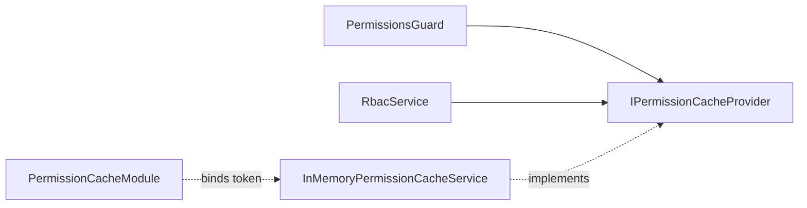

# Báo cáo các đoạn mã backend tuân thủ nguyên tắc SOLID

## 1. Mục đích và phạm vi

Báo cáo này phân tích những thành phần đã được xây dựng trong `server/src` có áp dụng tốt một phần hoặc toàn bộ các nguyên tắc SOLID. Kết quả được đối chiếu trực tiếp với mã nguồn ngày 21/06/2026, tập trung vào:

- trách nhiệm của controller, service, guard và lớp hạ tầng;
- cách mở rộng hành vi mà không phải sửa mã đang ổn định;
- khả năng thay thế các implementation qua một hợp đồng chung;
- kích thước và mức độ tập trung của interface;
- chiều phụ thuộc giữa mã nghiệp vụ và implementation kỹ thuật.

Nhận định “tuân thủ” trong tài liệu được áp dụng cho **đoạn mã hoặc ranh giới thiết kế được nêu**, không có nghĩa toàn bộ backend đã tuân thủ hoàn toàn cả năm nguyên tắc.

## 2. Kết luận tổng quan

| Nguyên tắc | Những phần triển khai tiêu biểu | Mức thể hiện trong mã hiện tại |
| --- | --- | --- |
| **S — Single Responsibility Principle** | Các service chuyên trách trong `auth`, `training`, `facility`, `members`, `staff`; controller mỏng; các service hạ tầng nhỏ | Tốt ở các module đã được tách service |
| **O — Open/Closed Principle** | Permission cache qua provider token; phân quyền bằng metadata/decorator; các caller filter theo strategy | Tốt với cache và guard; một phần với caller filter |
| **L — Liskov Substitution Principle** | Các caller filter cùng thực thi `ICallerQueryFilter`; các guard cùng thực thi `CanActivate`; exception riêng kế thừa `HttpException` | Tốt tại các hợp đồng được chỉ ra |
| **I — Interface Segregation Principle** | `ICallerQueryFilter` chỉ có một thao tác; `IPermissionCacheProvider` chỉ chứa ba thao tác cache liên quan chặt chẽ | Tốt, interface nhỏ và tập trung |
| **D — Dependency Inversion Principle** | `PermissionsGuard` và `RbacService` phụ thuộc `IPermissionCacheProvider`; module quyết định implementation | Rõ ràng ở permission cache, chưa phổ biến cho tầng persistence |

## 3. Single Responsibility Principle — SRP

### 3.1. Ý nghĩa trong backend

Một class nên có một nhóm trách nhiệm gắn kết và chỉ nên có một lý do chính để thay đổi. SRP không yêu cầu mỗi class chỉ có một method; điều quan trọng là các method cùng phục vụ một mục tiêu.

### 3.2. Controller tập trung vào tầng HTTP

Nhiều controller chỉ thực hiện các việc thuộc tầng giao tiếp:

1. nhận path, query hoặc body;
2. chuyển dữ liệu sang service;
3. định dạng response.

Ví dụ, [`ReportsController`](../../server/src/reports/reports.controller.ts#L7-L57) không chứa truy vấn Prisma hoặc công thức tổng hợp báo cáo. Mỗi endpoint chuyển khoảng ngày và bộ lọc sang `ReportsService`, sau đó trả kết quả theo cấu trúc HTTP. Vì vậy, thay đổi cách tính doanh thu thuộc về service, còn thay đổi route hoặc DTO thuộc về controller.

[`PaymentsController`](../../server/src/payments/payments.controller.ts#L14-L33) cũng giao việc tạo và liệt kê thanh toán cho `PaymentsService`. Các decorator `@Controller`, `@Get`, `@Post`, `@RequirePermission` giữ phần định tuyến và phân quyền khai báo ở biên HTTP.

### 3.3. AuthService điều phối các use case chuyên trách

[`AuthService`](../../server/src/auth/auth.service.ts#L35-L42) nhận ba service chuyên trách:

- [`PasswordResetService`](../../server/src/auth/password-reset.service.ts) xử lý yêu cầu và hoàn tất đặt lại mật khẩu;
- [`EmailVerificationService`](../../server/src/auth/email-verification.service.ts) xử lý xác thực và gửi lại OTP email;
- [`LineOAuthService`](../../server/src/auth/line-oauth.service.ts) xử lý đăng nhập LINE.

Các method facade trong `AuthService` chỉ chuyển tiếp sang đúng use case:

- `forgotPassword()` và `resetPassword()` chuyển sang `PasswordResetService` tại [`auth.service.ts`](../../server/src/auth/auth.service.ts#L149-L163);
- `verifyEmail()` và `resendVerify()` chuyển sang `EmailVerificationService` tại [`auth.service.ts`](../../server/src/auth/auth.service.ts#L170-L175);
- `lineLogin()` chuyển sang `LineOAuthService` tại [`auth.service.ts`](../../server/src/auth/auth.service.ts#L179-L183).

[`AuthModule`](../../server/src/auth/auth.module.ts#L35-L47) là nơi đăng ký các service này. Cách tách trên giúp thay đổi quy tắc OTP không buộc phải sửa luồng LINE, và thay đổi LINE OAuth không buộc phải sửa luồng mật khẩu.

### 3.4. Các service điều phối giao việc cho service chuyên trách

Mẫu tách trách nhiệm tương tự đã xuất hiện ở bốn module nghiệp vụ:

| Service điều phối | Service chuyên trách | Bằng chứng giao việc |
| --- | --- | --- |
| `TrainingService` | `AttendanceService`, `DeviceAccessService` | Các thao tác danh sách chấm công, check-in, check-out và sự kiện thiết bị được chuyển tiếp tại [`training.service.ts`](../../server/src/training/training.service.ts#L571-L588) |
| `FacilityService` | `EquipmentService`, `MaintenanceService` | Các thao tác thiết bị và bảo trì được chuyển tiếp tại [`facility.service.ts`](../../server/src/facility/facility.service.ts#L173-L202) |
| `MembersService` | `TrainerAssignmentService`, `MemberProgressService` | Gán trainer, lấy trainer khả dụng và ghi tiến độ được chuyển tiếp tại [`members.service.ts`](../../server/src/members/members.service.ts#L378-L383) và [`members.service.ts`](../../server/src/members/members.service.ts#L617-L626) |
| `StaffService` | `StaffScheduleService`, `StaffAttendanceService` | Lịch làm việc và chấm công được chuyển tiếp tại [`staff.service.ts`](../../server/src/staff/staff.service.ts#L319-L367) |

Các module tương ứng đăng ký rõ các provider chuyên trách trong [`TrainingModule`](../../server/src/training/training.module.ts#L9-L13), [`FacilityModule`](../../server/src/facility/facility.module.ts#L8-L12), [`MembersModule`](../../server/src/members/members.module.ts#L8-L12) và [`StaffModule`](../../server/src/staff/staff.module.ts#L8-L12).

Đây là biểu hiện tốt của SRP vì một thay đổi về chấm công, bảo trì, phân công trainer hoặc lịch làm việc đã có class riêng để tiếp nhận thay đổi.

### 3.5. Các lớp hạ tầng có trách nhiệm tập trung

Một số service dùng chung cũng có phạm vi nhỏ và rõ:

- [`AuditService`](../../server/src/common/audit/audit.service.ts#L20-L43) chỉ ghi audit log và cô lập lỗi ghi log khỏi luồng nghiệp vụ;
- [`OtpStoreService`](../../server/src/common/otp-store/otp-store.service.ts#L9-L37) chỉ quản lý vòng đời OTP trong bộ nhớ;
- [`RateLimitService`](../../server/src/common/rate-limit/rate-limit.service.ts#L8-L31) chỉ kiểm tra giới hạn request theo cửa sổ thời gian;
- [`PrismaService`](../../server/src/prisma/prisma.service.ts#L18-L68) tập trung vào vòng đời kết nối database, probe và keepalive.

## 4. Open/Closed Principle — OCP

### 4.1. Permission cache mở cho implementation mới

[`IPermissionCacheProvider`](../../server/src/common/interfaces/permission-cache.interface.ts#L1-L7) định nghĩa hợp đồng cache độc lập với nơi lưu dữ liệu. Implementation hiện tại là [`InMemoryPermissionCacheService`](../../server/src/common/cache/in-memory-permission-cache.service.ts#L4-L23).

[`PermissionCacheModule`](../../server/src/common/cache/permission-cache.module.ts#L5-L15) liên kết injection token với implementation:

```ts
{
  provide: PERMISSION_CACHE_PROVIDER,
  useClass: InMemoryPermissionCacheService,
}
```

Khi cần chuyển sang Redis, có thể tạo `RedisPermissionCacheService implements IPermissionCacheProvider` và đổi binding tại module. [`PermissionsGuard`](../../server/src/common/guards/permissions.guard.ts#L24-L30) cùng [`RbacService`](../../server/src/rbac/rbac.service.ts#L23-L28) không phải sửa cách gọi `get`, `set` hoặc `delete`. Mã đang chạy được đóng đối với thay đổi trong client, nhưng mở cho implementation cache mới.

### 4.2. Phân quyền được mở rộng bằng metadata

Các decorator [`@Public()`](../../server/src/auth/decorators/public.decorator.ts#L3-L9), [`@Roles()`](../../server/src/auth/decorators/roles.decorator.ts#L4-L13) và [`@RequirePermission()`](../../server/src/common/decorators/require-permission.decorator.ts#L3-L6) đưa yêu cầu truy cập vào metadata.

Guard đọc metadata thông qua `Reflector`:

- [`JwtAuthGuard`](../../server/src/auth/guards/jwt-auth.guard.ts#L10-L23) bỏ qua xác thực khi route có `@Public()`;
- [`RolesGuard`](../../server/src/auth/guards/roles.guard.ts#L13-L39) áp dụng danh sách role khai báo bằng `@Roles()`;
- [`PermissionsGuard`](../../server/src/common/guards/permissions.guard.ts#L33-L51) áp dụng mã quyền khai báo bằng `@RequirePermission()`.

Do đó, khi thêm endpoint mới, lập trình viên khai báo policy ngay trên controller thay vì thêm nhánh `if` vào guard. Ví dụ, [`ReportsController`](../../server/src/reports/reports.controller.ts#L7-L10) áp dụng một quyền cho cả controller, còn [`PaymentsController`](../../server/src/payments/payments.controller.ts#L19-L31) khai báo quyền riêng cho từng endpoint.

### 4.3. Caller query filter dùng strategy

[`caller-query-filter.ts`](../../server/src/training/filters/caller-query-filter.ts#L10-L45) có ba strategy cùng hợp đồng:

- `MemberCallerQueryFilter` giới hạn session theo member hiện tại;
- `TrainerCallerQueryFilter` giới hạn theo trainer và member được yêu cầu;
- `AdminCallerQueryFilter` áp dụng bộ lọc dành cho owner/staff.

[`TrainingService.listSessions()`](../../server/src/training/training.service.ts#L150-L184) chỉ nhận kết quả từ `resolveCallerFilter()` rồi gọi `filter.apply(...)`; phần dựng truy vấn chính không cần biết chi tiết của từng strategy.

Đây là OCP ở mức **một phần**: có thể thêm class strategy mới mà không sửa các strategy cũ hoặc `TrainingService`, nhưng vẫn phải thêm nhánh chọn strategy trong `resolveCallerFilter()`.

### 4.4. Exception mới không buộc sửa luồng xử lý HTTP chung

Các exception nghiệp vụ như [`OtpInvalidException`](../../server/src/auth/exceptions/otp-invalid.exception.ts), [`OtpExpiredException`](../../server/src/auth/exceptions/otp-expired.exception.ts) và [`EmailAlreadyVerifiedException`](../../server/src/auth/exceptions/email-already-verified.exception.ts) đều kế thừa `HttpException`.

[`HttpExceptionFilter`](../../server/src/common/filters/http-exception.filter.ts#L51-L76) xử lý mọi subtype của `HttpException` qua cùng API `getStatus()` và `getResponse()`. Vì vậy, có thể thêm exception nghiệp vụ mới mà không phải thêm một nhánh riêng vào filter, miễn exception tuân theo hợp đồng `HttpException`.

## 5. Liskov Substitution Principle — LSP

### 5.1. Các caller filter có thể thay thế cho nhau

`MemberCallerQueryFilter`, `TrainerCallerQueryFilter` và `AdminCallerQueryFilter` đều thực thi:

```ts
apply(where: Prisma.TrainingSessionWhereInput, caller: Caller): void
```

Mỗi implementation nhận cùng kiểu đầu vào, không thay đổi điều kiện tiền đề của caller và cùng trả về `void` sau khi bổ sung điều kiện vào `where`. `TrainingService` sử dụng biến có kiểu `ICallerQueryFilter` tại [`training.service.ts`](../../server/src/training/training.service.ts#L183-L184) mà không cần ép kiểu hoặc kiểm tra class cụ thể. Vì vậy, ba implementation có thể thay thế nhau đúng theo vai trò được factory lựa chọn.

### 5.2. Các guard tuân theo hợp đồng CanActivate

[`RolesGuard`](../../server/src/auth/guards/roles.guard.ts#L14-L39), [`PermissionsGuard`](../../server/src/common/guards/permissions.guard.ts#L19-L51) và [`DeviceApiKeyGuard`](../../server/src/training/guards/device-api-key.guard.ts#L5-L26) đều thực thi `CanActivate`. `JwtAuthGuard` kế thừa `AuthGuard('jwt')` và vẫn giữ hợp đồng `canActivate()` tại [`jwt-auth.guard.ts`](../../server/src/auth/guards/jwt-auth.guard.ts#L11-L23).

NestJS có thể đưa từng guard vào cùng pipeline bảo vệ route. Dù cách xác thực khác nhau, mỗi guard vẫn có hành vi hợp lệ theo hợp đồng: trả `true`, trả một kết quả bất đồng bộ hợp lệ, hoặc ném HTTP exception khi từ chối truy cập.

### 5.3. Exception nghiệp vụ thay thế được cho HttpException

Ba exception OTP/email nêu trên không yêu cầu `HttpExceptionFilter` nhận biết subtype cụ thể. Filter sử dụng chúng như `HttpException`, giữ đúng status và response. Đây là ví dụ LSP vì subtype không phá vỡ kỳ vọng của nơi tiêu thụ base type.

## 6. Interface Segregation Principle — ISP

### 6.1. ICallerQueryFilter chỉ mô tả đúng một khả năng

[`ICallerQueryFilter`](../../server/src/training/filters/caller-query-filter.ts#L10-L12) chỉ có method `apply()`. Các strategy không bị buộc cài đặt method không liên quan như phân trang, sắp xếp, truy vấn database hoặc kiểm tra quyền. Interface này nhỏ, đúng mục đích và có client rõ ràng là `TrainingService.listSessions()`.

### 6.2. IPermissionCacheProvider là interface chuyên biệt

[`IPermissionCacheProvider`](../../server/src/common/interfaces/permission-cache.interface.ts#L3-L7) chỉ gồm ba thao tác cùng một nhóm trách nhiệm: đọc, ghi và xóa cache quyền. Nó không trộn thêm cấu hình Redis, thống kê cache, truy vấn quyền hay nghiệp vụ RBAC.

Nhờ vậy:

- `PermissionsGuard` chỉ dùng `get()` và `set()` để phục vụ kiểm tra quyền;
- `RbacService` dùng `delete()` để yêu cầu vô hiệu hóa cache khi quyền thay đổi;
- implementation in-memory không phải cài đặt các thao tác ngoài phạm vi cache quyền.

Interface này vẫn có thể được tách nhỏ hơn thành read/write và invalidation nếu số client tăng mạnh. Tuy nhiên, với ba thao tác liên quan chặt chẽ hiện tại, nó chưa phải một “fat interface”.

### 6.3. Các hợp đồng framework nhỏ và đúng vai trò

Backend sử dụng các interface hẹp của NestJS:

- guard chỉ cần thực thi `CanActivate.canActivate()`;
- global filter chỉ cần thực thi `ExceptionFilter.catch()` tại [`http-exception.filter.ts`](../../server/src/common/filters/http-exception.filter.ts#L28-L49);
- `PrismaService` chỉ nhận hai hợp đồng vòng đời `OnModuleInit` và `OnModuleDestroy` tại [`prisma.service.ts`](../../server/src/prisma/prisma.service.ts#L18-L19).

Mỗi class chỉ phụ thuộc phần giao diện framework mà nó thực sự cần.

## 7. Dependency Inversion Principle — DIP

### 7.1. Luồng phụ thuộc đúng trong permission cache

Permission cache là ví dụ DIP đầy đủ nhất trong backend hiện tại:



Hai thành phần cấp cao là `PermissionsGuard` và `RbacService` không phụ thuộc trực tiếp `InMemoryPermissionCacheService`. Cả thành phần cấp cao và implementation cấp thấp đều hướng vào abstraction `IPermissionCacheProvider`:

- abstraction và token được định nghĩa tại [`permission-cache.interface.ts`](../../server/src/common/interfaces/permission-cache.interface.ts#L1-L7);
- implementation cấp thấp thực thi abstraction tại [`in-memory-permission-cache.service.ts`](../../server/src/common/cache/in-memory-permission-cache.service.ts#L4-L23);
- module làm composition root và chọn implementation tại [`permission-cache.module.ts`](../../server/src/common/cache/permission-cache.module.ts#L5-L15);
- client yêu cầu token bằng `@Inject(PERMISSION_CACHE_PROVIDER)` thay vì tự tạo object tại [`permissions.guard.ts`](../../server/src/common/guards/permissions.guard.ts#L24-L30) và [`rbac.service.ts`](../../server/src/rbac/rbac.service.ts#L23-L28).

Kết quả là chính sách kiểm tra và vô hiệu hóa quyền không bị buộc vào `Map` trong bộ nhớ. Đây đồng thời giúp test thay provider thật bằng mock theo cùng hợp đồng.

### 7.2. Constructor injection hỗ trợ đảo chiều quyền khởi tạo

Các service điều phối như `AuthService`, `TrainingService`, `FacilityService`, `MembersService` và `StaffService` nhận dependency qua constructor thay vì gọi `new` bên trong. Module chịu trách nhiệm lắp ghép object graph. Cách làm này:

- tách việc sử dụng dependency khỏi việc khởi tạo dependency;
- cho phép NestJS thay provider trong test;
- giảm phụ thuộc vào vòng đời cụ thể của dependency.

Đây là **Dependency Injection**, một kỹ thuật hỗ trợ DIP. Tuy nhiên, khi constructor vẫn nhận class cụ thể như `PrismaService` hoặc `AuditService`, nó chưa phải một abstraction hoàn chỉnh như ví dụ permission cache.

## 8. Quan hệ giữa năm nguyên tắc trong các đoạn mã tiêu biểu

| Đoạn mã | S | O | L | I | D | Giải thích ngắn |
| --- | :---: | :---: | :---: | :---: | :---: | --- |
| Permission cache provider |  | ✓ | ✓ | ✓ | ✓ | Cache có hợp đồng nhỏ, implementation thay thế được và client phụ thuộc abstraction |
| Caller query filter | ✓ | ◐ | ✓ | ✓ |  | Mỗi strategy có một trách nhiệm; thay thế qua interface; factory vẫn cần sửa khi thêm loại mới |
| Guard + metadata decorator | ✓ | ✓ | ✓ | ✓ |  | Policy được khai báo ngoài guard; các guard theo hợp đồng `CanActivate` nhỏ |
| Auth use-case services | ✓ |  |  |  | ◐ | Trách nhiệm đã tách; dùng constructor injection nhưng phần lớn dependency vẫn là class cụ thể |
| Training/Facility/Members/Staff service split | ✓ |  |  |  | ◐ | Service điều phối giao việc chuyên môn; dependency được inject nhưng chưa có port riêng |
| Custom HTTP exceptions | ✓ | ✓ | ✓ |  |  | Mỗi exception biểu diễn một lỗi; subtype mới dùng được với filter hiện tại |

Ký hiệu: `✓` là biểu hiện rõ; `◐` là tuân thủ một phần; ô trống nghĩa là đoạn mã không nhằm thể hiện trực tiếp nguyên tắc đó.

## 9. Giới hạn của kết luận

Các ví dụ trên chứng minh backend đã có nền tảng SOLID thực tế, đặc biệt ở việc tách service và thiết kế permission cache. Tuy nhiên, cần giữ ba ranh giới khi đọc báo cáo:

1. Inject `PrismaService` không tự động thỏa DIP. Nhiều application service vẫn phụ thuộc trực tiếp API và kiểu dữ liệu của Prisma.
2. Một số service điều phối vẫn còn lớn. Việc đã tách một phần không có nghĩa toàn bộ class thỏa SRP tuyệt đối.
3. `resolveCallerFilter()` vẫn phải sửa khi thêm một nhóm strategy mới, nên caller filter mới chỉ đạt OCP một phần.

Vì vậy, kết luận chính xác là: **backend đã có nhiều đoạn mã tuân thủ SOLID và có thể dùng làm mẫu cho các phần còn lại; mức tuân thủ chưa đồng đều trên toàn bộ `server/src`.**
